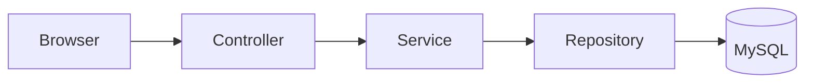

# Cómo usar este libro

Este libro no está diseñado para leerse como una lista de definiciones. Está pensado para que aprendas Spring **leyendo, recorriendo y relacionando código real de PetMatch Community**.

Si es tu primer contacto con Spring, sigue los capítulos en orden. Los conceptos se presentan cuando ya tienes suficiente contexto para entender por qué existen.

---

## El método de lectura

Cada tema importante seguirá, cuando tenga sentido, esta secuencia:

1. **¿Qué problema estamos resolviendo?**
2. **Idea intuitiva.**
3. **Definición técnica.**
4. **¿Cómo lo resuelve Spring?**
5. **¿Dónde aparece en PetMatch?**
6. **Código real.**
7. **Paso a paso.**
8. **¿Por qué se implementó así?**
9. **¿Qué alternativa existía?**
10. **Error frecuente.**
11. **Prueba en el código.**
12. **Comprueba que entendiste.**
13. **Qué debes recordar.**

No todos los conceptos necesitan las trece secciones. Una idea sencilla puede explicarse en menos espacio; una idea central como Dependency Injection, JPA, transacciones o Spring Security necesitará más recorrido.

> [!IMPORTANT]
> No memorices una anotación antes de comprender qué responsabilidad representa. Saber escribir `@Service` tiene poco valor si todavía no sabes por qué existe una capa Service.

---

## Trabaja con dos ventanas

La forma recomendada de estudiar es tener abiertas al mismo tiempo:

- esta documentación;
- el repositorio PetMatch Community.

Cuando el libro indique:

```text
Archivo:
src/main/java/com/petmatch/community/service/PetService.java
```

abre ese archivo y localiza el fragmento mencionado.

El objetivo es que gradualmente puedas pasar de:

> “entiendo la explicación del libro”

hacia:

> “puedo encontrar la implementación y explicarla sin el libro”.

---

## No leas los fragmentos de código como imágenes

Cuando encuentres un fragmento como este:

```java
public PetController(PetService petService) {
    this.petService = petService;
}
```

no te limites a reconocerlo visualmente. Pregúntate:

- ¿qué clase necesita a cuál otra?
- ¿quién proporciona `PetService`?
- ¿por qué el Controller no crea `new PetService(...)`?
- ¿qué ocurriría si `PetService` necesitara además un Repository?

En capítulos posteriores esas preguntas nos conducirán hacia Dependency Injection e IoC.

---

## Cómo identificar código real y pseudocódigo

### Código real

Cuando el libro diga **Código real**, el fragmento corresponde al repositorio estudiado.

Ejemplo:

```java
@GetMapping("/")
public String home() {
    return "home";
}
```

Archivo real:

```text
src/main/java/com/petmatch/community/controller/HomeController.java
```

### Pseudocódigo

En ocasiones será útil reducir una idea a algo como:

```text
petición HTTP
    ↓
Controller
    ↓
Service
    ↓
Repository
```

Esto explica una relación conceptual; no significa que exista un archivo con ese contenido.

Si un ejemplo Java se simplifica y deja de coincidir literalmente con el repositorio, se identificará como **pseudocódigo** o **ejemplo conceptual**.

> [!WARNING]
> No copies pseudocódigo dentro de la aplicación esperando que compile.

---

## Cómo leer las rutas

Una ruta de archivo:

```text
src/main/java/com/petmatch/community/model/Pet.java
```

es diferente de una ruta HTTP:

```text
/pets/15
```

y ambas son diferentes de una ruta REST:

```text
/api/v1/pets/15
```

Durante el libro utilizaremos las expresiones:

- **ruta de archivo** para ubicar código;
- **ruta HTTP** o **endpoint** para hablar de una dirección atendida por la aplicación.

---

## Las palabras en inglés no se traducen cuando son nombres reales

El proyecto utiliza nombres como:

```text
SupportRequest
SupportApplication
PetService
SupportRequestRepository
findByIdAndOwnerId
```

El libro explicará su significado en español, pero no cambiará el nombre del código.

Por ejemplo:

> `SupportRequest` representa una solicitud de apoyo.

No utilizaremos una clase ficticia llamada `SolicitudApoyo` para explicar una clase que realmente se llama `SupportRequest`.

Esto te ayuda a conectar directamente la explicación con el IDE y con GitHub.

---

## Aprende a distinguir responsabilidades

Una de las metas principales del recorrido será evitar la sensación de que “Spring es un conjunto enorme de archivos y anotaciones”.

A medida que avances, intenta formular una frase corta para cada tipo de pieza.

Por ejemplo, más adelante deberías poder decir algo similar a:

```text
Controller
recibe y coordina solicitudes HTTP.

Service
aplica casos de uso y reglas de negocio.

Repository
proporciona acceso a persistencia.

Entity
representa información persistente del dominio.

Form DTO
representa los datos permitidos en un formulario.

API DTO
representa el contrato JSON de la API.
```

No intentes memorizar estas frases todavía. Los capítulos mostrarán cómo se llega a ellas a partir del código.

---

## Usa las preguntas de comprobación de verdad

Al final de muchos capítulos encontrarás preguntas como:

### 🧪 Comprueba que entendiste

1. ¿Por qué `PetService` no debería encargarse de renderizar HTML?
2. ¿Qué diferencia existe entre autenticar y autorizar?
3. ¿Por qué ocultar un botón no impide modificar un recurso ajeno?

No necesitas escribir una respuesta formal. Intenta explicarla con tus propias palabras antes de continuar.

Si no puedes responder una pregunta, vuelve a la sección relacionada y busca el código mencionado.

---

## Los ejercicios son principalmente de lectura

El propósito del libro es comprender la aplicación existente antes de ampliarla.

Encontrarás actividades como:

### 🛠 Prueba en el código

- localiza `PetService`;
- identifica sus dependencias en el constructor;
- busca el método `findOwnedPet(...)`;
- observa qué Repository utiliza;
- identifica qué excepción lanza cuando la mascota no pertenece al usuario.

Este tipo de ejercicio desarrolla una habilidad fundamental: **navegar una aplicación que no escribiste tú**.

No se pedirán nuevas funcionalidades dentro del recorrido principal salvo que una actividad esté claramente marcada como práctica opcional.

---

## Qué significan las notas visuales

> [!NOTE]
> Agrega contexto o una aclaración que ayuda a interpretar el tema.

> [!TIP]
> Sugiere una forma más práctica de estudiar, programar o investigar.

> [!IMPORTANT]
> Marca una idea que tendrá consecuencias en capítulos posteriores.

> [!WARNING]
> Señala errores habituales, riesgos o interpretaciones incorrectas.

También utilizaremos algunos encabezados visuales:

### 🧠 Idea mental

Una analogía o representación sencilla antes de la definición técnica.

### 🔎 En PetMatch

La clase, método, configuración o template donde puedes encontrar el concepto.

### ⚠️ Error frecuente

Una equivocación común de quien empieza.

### ✅ Qué debes recordar

Síntesis de las ideas esenciales del capítulo.

---

## No todo lo que existe en Spring existe en PetMatch

Spring es un ecosistema enorme. PetMatch utiliza solamente una parte de él.

El libro evitará introducir tecnologías solo porque sean populares.

Por ejemplo, PetMatch actualmente **no utiliza JWT**. Por tanto, cuando estudiemos la API REST veremos primero lo que realmente existe:

```text
HTTP Basic
+
STATELESS
```

Igualmente, el proyecto no implementa carga de imágenes. No aparecerá un supuesto `FileStorageService` en un capítulo como si fuese código real.

> [!IMPORTANT]
> Distinguir “Spring puede hacerlo” de “PetMatch lo hace” es una habilidad técnica importante.

---

## Las alternativas se estudian para comprender decisiones

En algunos capítulos compararemos la implementación actual con otras posibilidades.

Ejemplo conceptual:

```text
Opción A
Controller contiene todas las reglas

Opción B
Controller delega las reglas a Service
```

La comparación sirve para responder:

- ¿qué problema evita la opción elegida?
- ¿qué costo tiene?
- ¿en qué situación podría elegirse otra alternativa?

No significa que todas las alternativas estén implementadas.

---

## No confundas “funciona” con “es una buena responsabilidad”

En Java es posible escribir una aplicación completa dentro de unas pocas clases gigantes. También es posible escribir SQL directamente en un Controller o guardar una contraseña sin protegerla.

Que algo sea técnicamente posible no significa que sea una decisión adecuada.

Parte del recorrido consiste en separar tres preguntas:

1. **¿puede hacerse?**
2. **¿funciona?**
3. **¿está bien ubicada esa responsabilidad?**

Spring se vuelve mucho más comprensible cuando se estudia desde esta tercera pregunta.

---

## Cómo utilizar los diagramas Mermaid

Los diagramas no sustituyen el código. Funcionan como mapas mentales.

Por ejemplo:



Después de entender el diagrama debes ser capaz de localizar clases reales que ocupan cada posición.

No memorices el dibujo. Utilízalo para orientarte.

---

## Una estrategia para cada capítulo

Puedes utilizar este ciclo de estudio:

### 1. Lee el problema

Asegúrate de entender por qué el tema es necesario.

### 2. Mira el código

Abre los archivos indicados.

### 3. Regresa a la explicación

Relaciona cada pieza con lo que viste.

### 4. Responde las preguntas

Sin copiar frases del capítulo.

### 5. Recorre otra vez el código

Intenta encontrar las piezas sin usar los enlaces del texto.

### 6. Continúa

Solo necesitas una comprensión funcional. No esperes dominar un concepto avanzado en una sola lectura.

---

## ¿Debo ejecutar la aplicación mientras estudio?

No es obligatorio para todos los capítulos, pero es recomendable cuando tengas el entorno disponible.

El README principal del repositorio explica cómo configurar:

```text
DB_URL
DB_USERNAME
DB_PASSWORD
```

 y cómo iniciar la aplicación con Maven Wrapper.

Durante capítulos de MVC, seguridad y REST será especialmente útil relacionar una acción visible con las clases que se ejecutan detrás.

Por ejemplo:

```text
clic en “Mis mascotas”
        ↓
GET /pets
        ↓
PetController
        ↓
PetService
        ↓
PetRepository
```

---

## Si eres instructor

Puedes utilizar los capítulos como recorrido guiado de lectura del proyecto.

Una dinámica útil es pedir al aprendiz que primero prediga dónde debería estar una responsabilidad y después comprobarlo en PetMatch.

Ejemplos:

- “¿Dónde esperarías encontrar la regla que impide eliminar una mascota con solicitudes?”
- “¿En el HTML o en backend debería verificarse que una solicitud pertenece al usuario?”
- “¿Quién debería decidir que aceptar una postulación cambia el estado de la solicitud?”

La respuesta importa, pero importa aún más la justificación.

---

## Correspondencia con el proyecto

Las explicaciones de PetMatch se basan en el código disponible en la rama `main`.

Si más adelante el proyecto cambia, la documentación deberá revisarse para mantener sincronizados:

```text
explicación
↔
fragmento
↔
ruta
↔
comportamiento real
```

---

## Antes de continuar

No necesitas conocer Spring todavía.

Solo necesitas llevar contigo estas tres preguntas:

1. **¿qué problema estamos intentando resolver?**
2. **¿qué responsabilidad tiene cada clase?**
3. **¿cómo fluye una acción desde el usuario hasta los datos y de regreso?**

El resto del libro irá construyendo las respuestas.

---

## Continúa con

- [Portada e índice](README.md)
- [Bloque 01 — Fundamentos](01-fundamentos/README.md)
- [Capítulo 01 — PetMatch y el problema](01-fundamentos/01-petmatch-y-el-problema.md)

---

[← Portada](README.md) · [Índice](README.md) · [Siguiente → Capítulo 01](01-fundamentos/01-petmatch-y-el-problema.md)
