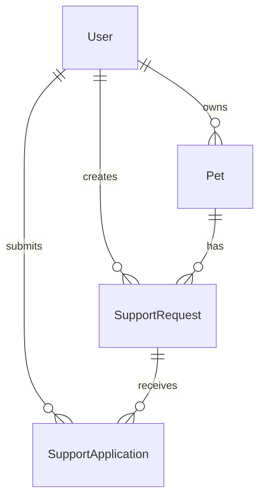
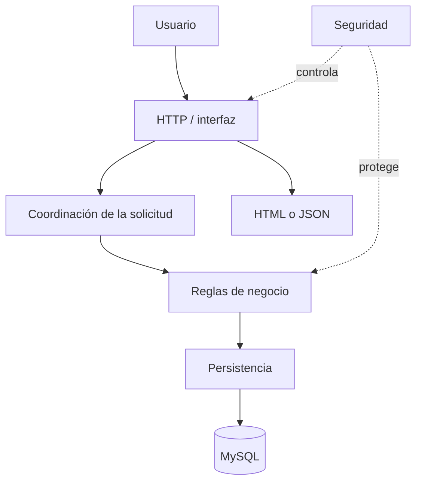
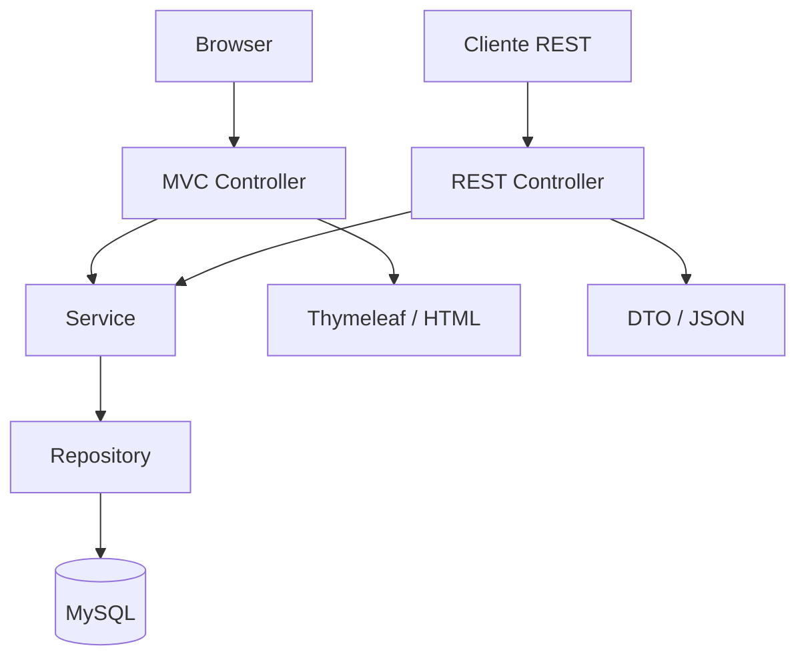

# 01 — PetMatch y el problema

Antes de estudiar Spring debemos entender la aplicación que utilizaremos como hilo conductor.

PetMatch Community no existe para demostrar anotaciones. Existe para resolver un problema de negocio pequeño pero suficientemente rico como para obligarnos a pensar en usuarios, datos, reglas, estados, seguridad, persistencia y HTTP.

Ese problema será nuestro laboratorio durante todo el libro.

---

## ¿Qué problema estamos resolviendo?

Imagina una comunidad en la que una persona necesita apoyo temporal con una mascota.

Por ejemplo:

- necesita que alguien saque a pasear a su perro;
- necesita cuidado temporal;
- necesita apoyo para alimentarlo;
- necesita compañía;
- necesita transporte.

La necesidad no consiste simplemente en publicar un texto. Hay varias personas y reglas involucradas.

Un usuario propietario puede tener una mascota y publicar una solicitud. Otros usuarios pueden postularse para ayudar. El propietario debe poder decidir cuál postulación acepta y el sistema debe mantener un estado coherente.

El flujo central es:

```text
Usuario A
  registra una mascota
        ↓
  publica una solicitud OPEN
        ↓
Usuario B se postula → PENDING
Usuario C se postula → PENDING
        ↓
Usuario A acepta a B
        ↓
B → ACCEPTED
C → REJECTED
Solicitud → IN_PROGRESS
        ↓
Usuario A completa la solicitud
        ↓
Solicitud → COMPLETED
```

Este flujo parece sencillo cuando se expresa como una historia. Convertirlo en software obliga a responder muchas preguntas.

---

## Las preguntas escondidas detrás de la historia

Si Usuario A registra una mascota, ¿quién puede editarla?

Si Usuario B conoce el identificador de la mascota, ¿debería poder modificarla escribiendo una URL manualmente?

Si una mascota tiene solicitudes asociadas, ¿qué ocurre si se elimina?

Si Usuario A publica una solicitud, ¿puede postularse a su propia solicitud?

Si Usuario B ya se postuló, ¿puede postularse una segunda vez?

Si la fecha del servicio ya pasó, ¿la solicitud debería seguir aceptando postulaciones?

Si Usuario B y Usuario C están pendientes y B es aceptado, ¿qué ocurre con C?

Si dos operaciones intentaran aceptar postulaciones al mismo tiempo, ¿cómo evitamos terminar con dos aceptadas?

Si una solicitud está `COMPLETED`, ¿podemos devolverla arbitrariamente a `OPEN`?

¿Quién decide todas estas cosas: el HTML, el Controller, la base de datos o alguna otra parte de la aplicación?

Estas preguntas son mucho más importantes para aprender Spring que empezar memorizando `@Controller`, `@Service` o `@Entity`.

---

## El dominio de PetMatch

En software llamamos **dominio** al área del problema que estamos modelando: sus conceptos, relaciones, reglas y comportamientos relevantes.

En PetMatch hay cuatro conceptos centrales representados por clases reales:

```text
User
Pet
SupportRequest
SupportApplication
```

### `User`

Representa a una persona registrada en la aplicación.

Un usuario puede:

- tener mascotas;
- crear solicitudes de apoyo;
- postularse a solicitudes de otros usuarios;
- autenticarse mediante su correo y contraseña;
- poseer un rol.

Archivo real:

```text
src/main/java/com/petmatch/community/model/User.java
```

### `Pet`

Representa una mascota perteneciente a un usuario.

Archivo real:

```text
src/main/java/com/petmatch/community/model/Pet.java
```

Entre sus datos encontramos nombre, especie, edad, descripción y propietario.

### `SupportRequest`

Representa una solicitud de apoyo temporal publicada por un usuario para una de sus mascotas.

Archivo real:

```text
src/main/java/com/petmatch/community/model/SupportRequest.java
```

Incluye, entre otros datos:

- título;
- descripción;
- tipo de apoyo;
- fecha del servicio;
- estado;
- mascota;
- propietario.

### `SupportApplication`

Representa la postulación de un usuario para ayudar en una solicitud.

Archivo real:

```text
src/main/java/com/petmatch/community/model/SupportApplication.java
```

Relaciona:

- al usuario que se postula;
- la solicitud a la que se postula;
- un mensaje opcional;
- un estado.

> [!IMPORTANT]
> En este libro la palabra **Application** en `SupportApplication` significa “postulación”, no “aplicación de software”. El contexto importa.

---

## Un primer mapa del dominio

Sin entrar todavía en JPA, podemos representar conceptualmente las relaciones principales así:



La lectura es:

- un `User` puede poseer varias `Pet`;
- un `User` puede crear varias `SupportRequest`;
- un `User` puede crear varias `SupportApplication`;
- una `Pet` puede estar relacionada con varias solicitudes;
- una `SupportRequest` puede recibir varias postulaciones.

Más adelante estudiaremos cómo estas relaciones se expresan con JPA y cómo terminan representándose en tablas MySQL.

Por ahora solo necesitamos comprender el significado.

---

## Los estados también forman parte del dominio

PetMatch no guarda únicamente datos. También guarda **situaciones** por las que pasan ciertos objetos.

### Estados de `SupportRequest`

Código real:

```java
public enum SupportRequestStatus {
    OPEN,
    IN_PROGRESS,
    COMPLETED,
    CANCELLED
}
```

Archivo:

```text
src/main/java/com/petmatch/community/model/enums/SupportRequestStatus.java
```

Podemos interpretarlos así:

| Estado | Significado en PetMatch |
|---|---|
| `OPEN` | La solicitud está abierta y puede aceptar postulaciones válidas |
| `IN_PROGRESS` | Ya existe una postulación aceptada y el apoyo está en curso |
| `COMPLETED` | El apoyo finalizó |
| `CANCELLED` | El propietario canceló la solicitud |

### Estados de `SupportApplication`

Código real:

```java
public enum SupportApplicationStatus {
    PENDING,
    ACCEPTED,
    REJECTED
}
```

Archivo:

```text
src/main/java/com/petmatch/community/model/enums/SupportApplicationStatus.java
```

| Estado | Significado |
|---|---|
| `PENDING` | La postulación espera decisión |
| `ACCEPTED` | Fue elegida por el propietario |
| `REJECTED` | Fue rechazada o dejó de ser válida frente a otra decisión |

No todas las combinaciones de estados tienen sentido. Por ejemplo, el sistema no debería permitir aceptar libremente una postulación cuando la solicitud ya está completada.

Más adelante llamaremos a esto una **máquina de estados** y estudiaremos las transiciones reales en los Services.

---

## Los tipos de apoyo reales

PetMatch define los siguientes valores:

```java
public enum SupportType {
    WALK,
    TEMPORARY_CARE,
    FEEDING,
    COMPANIONSHIP,
    TRANSPORTATION,
    OTHER
}
```

Archivo:

```text
src/main/java/com/petmatch/community/model/enums/SupportType.java
```

Esto demuestra una decisión importante de modelado: para ciertos datos el sistema no acepta cualquier texto libre, sino uno de un conjunto conocido de valores.

Todavía no necesitamos estudiar cómo se persiste un `enum`. Lo veremos en el bloque de JPA.

---

## Una aplicación no es solo sus entidades

Sería un error pensar que PetMatch se reduce a cuatro clases de modelo.

Para que la historia de negocio funcione necesitamos resolver varios grupos de responsabilidades.



A lo largo del libro descubriremos qué piezas de Spring ocupan esas posiciones.

---

## De una acción visible a varias responsabilidades

Pensemos en una sola acción:

> “Registrar una mascota”.

Desde el punto de vista del usuario parece una única operación.

Desde el punto de vista del software aparecen preguntas distintas:

### Entrada

¿Cómo llegan nombre, especie, edad y descripción al servidor?

### Validación

¿Qué ocurre si el nombre está vacío o la edad es negativa?

### Identidad

¿Quién es el usuario que está realizando la operación?

### Regla

¿A quién debe asignarse la mascota creada?

### Persistencia

¿Cómo se guarda en MySQL?

### Respuesta

¿Se devuelve HTML o JSON?

### Seguridad

¿Puede una persona no autenticada hacer la operación?

Una arquitectura útil intenta evitar que una sola clase responda todas estas preguntas al mismo tiempo.

---

## Un primer recorrido por código real

Veamos cómo PetMatch distribuye parte de la operación de mascotas.

No estudiaremos todavía todas las anotaciones. Solo las responsabilidades.

### Controller

Archivo:

```text
src/main/java/com/petmatch/community/controller/PetController.java
```

Fragmento real:

```java
@PostMapping
public String create(
    @Valid PetForm petForm,
    BindingResult bindingResult,
    Authentication authentication,
    Model model,
    RedirectAttributes redirectAttributes
) {
    if (bindingResult.hasErrors()) {
        model.addAttribute("editing", false);
        return "pets/form";
    }

    Pet pet = petService.create(petForm, authentication);
    redirectAttributes.addFlashAttribute(
        "successMessage",
        "Mascota registrada correctamente."
    );
    return "redirect:/pets/" + pet.getId();
}
```

Aunque todavía no conozcas Spring MVC, puedes observar algo importante:

```java
petService.create(petForm, authentication);
```

El Controller **no contiene todos los pasos de creación de la mascota**. Delega la operación a `PetService`.

### Service

Archivo:

```text
src/main/java/com/petmatch/community/service/PetService.java
```

Fragmento real:

```java
@Transactional
public Pet create(PetForm form, Authentication authentication) {
    User owner = userService.getCurrentUser(authentication);
    Pet pet = new Pet(
        normalize(form.getName()),
        normalize(form.getSpecies()),
        form.getAge(),
        normalizeNullable(form.getDescription()),
        owner
    );
    return petRepository.save(pet);
}
```

Aquí ya vemos otras responsabilidades:

- determinar el usuario actual;
- preparar los datos;
- construir la entidad;
- asignar el propietario;
- solicitar que se guarde.

### Repository

Archivo:

```text
src/main/java/com/petmatch/community/repository/PetRepository.java
```

Código real:

```java
public interface PetRepository extends JpaRepository<Pet, Long> {

    List<Pet> findByOwnerIdOrderByNameAsc(Long ownerId);

    Optional<Pet> findByIdAndOwnerId(Long id, Long ownerId);
}
```

Todavía no estudiaremos `JpaRepository`, pero ya podemos identificar que esta interfaz está cerca del problema de consultar y persistir datos.

---

## El primer patrón que debes observar

Para muchas operaciones de PetMatch veremos una forma general parecida a esta:

```text
petición
   ↓
Controller
   ↓
Service
   ↓
Repository
   ↓
base de datos
```

Y luego el resultado regresa en sentido contrario.

Esto no significa que todas las operaciones tengan exactamente los mismos pasos. Significa que existe una separación de responsabilidades que nos ayudará a estudiar el proyecto.

Más adelante dedicaremos un capítulo completo a la arquitectura por capas.

---

## Las reglas importantes viven en backend

Una idea central de PetMatch es que la interfaz visual no es la autoridad final sobre lo que un usuario puede hacer.

Por ejemplo, para localizar una mascota propia el proyecto utiliza:

```java
return petRepository.findByIdAndOwnerId(petId, owner.getId())
    .orElseThrow(() -> new PetNotFoundException(petId));
```

Archivo:

```text
src/main/java/com/petmatch/community/service/PetService.java
```

La consulta no pregunta solamente:

```text
¿existe la mascota con id 15?
```

conceptualmente pregunta:

```text
¿existe la mascota 15 Y pertenece al usuario actual?
```

Esta diferencia será fundamental cuando estudiemos **ownership**.

> [!IMPORTANT]
> Ocultar el botón “Editar” en HTML puede mejorar la experiencia de usuario, pero no sustituye una comprobación de seguridad en backend.

---

## Una regla de negocio real: no eliminar una mascota con solicitudes

Archivo:

```text
src/main/java/com/petmatch/community/service/PetService.java
```

Código real:

```java
@Transactional
public void delete(Long petId, Authentication authentication) {
    Pet pet = findOwnedPet(petId, authentication);
    if (supportRequestRepository.existsByPetId(pet.getId())) {
        throw new PetDeletionException(pet.getId());
    }
    petRepository.delete(pet);
}
```

La operación no se limita a ejecutar un `DELETE`.

Primero comprueba:

1. que la mascota pertenece al usuario actual;
2. que no existen solicitudes relacionadas;
3. solo entonces pide eliminarla.

Esto es **lógica de negocio**: una decisión sobre qué operaciones tienen sentido en el dominio de PetMatch.

---

## Una regla más compleja: aceptar una postulación

Aceptar una postulación no significa simplemente cambiar:

```text
PENDING → ACCEPTED
```

En PetMatch tiene consecuencias coordinadas:

```text
postulación seleccionada → ACCEPTED
solicitud                → IN_PROGRESS
otras pendientes         → REJECTED
```

Fragmento real de `SupportApplicationService`:

```java
application.setStatus(SupportApplicationStatus.ACCEPTED);
request.setStatus(SupportRequestStatus.IN_PROGRESS);

supportApplicationRepository.findBySupportRequestIdAndStatus(
    request.getId(),
    SupportApplicationStatus.PENDING
)
    .stream()
    .filter(other -> !other.getId().equals(applicationId))
    .forEach(other -> other.setStatus(SupportApplicationStatus.REJECTED));
```

Este ejemplo nos acompañará después para estudiar:

- Service layer;
- transacciones;
- máquinas de estado;
- consistencia;
- concurrencia;
- pessimistic locking;
- pruebas unitarias;
- pruebas de integración.

Una sola operación real nos permitirá conectar muchos conceptos de Spring.

---

## La aplicación tiene dos interfaces, no dos lógicas de negocio

PetMatch expone dos formas principales de interactuar con el mismo dominio.

### Web MVC

Un navegador recibe HTML generado con Thymeleaf.

### API REST

Un cliente HTTP recibe y envía JSON bajo:

```text
/api/v1/**
```

El punto importante es que ambos caminos reutilizan Services.



Esto evita tener una regla para web y otra diferente para REST.

Por ejemplo, la regla “no puedes postularte a tu propia solicitud” pertenece al Service. Por eso puede proteger ambos caminos.

---

## Un vistazo al flujo real probado por el proyecto

El proyecto contiene una prueba de integración llamada:

```text
src/test/java/com/petmatch/community/integration/MvpFlowIntegrationTests.java
```

Su método principal se llama:

```java
completeMvpFlowKeepsOwnershipVisibilityAndStatusesConsistent()
```

Esta prueba crea un escenario con:

- un propietario;
- dos usuarios que se postulan;
- un usuario externo;
- una mascota;
- una solicitud;
- dos postulaciones.

Después comprueba, entre otras cosas:

- que otro usuario no puede tratar la mascota como propia;
- que el propietario no puede postularse a su propia solicitud;
- que no puede repetirse una postulación;
- que al aceptar una, la solicitud pasa a `IN_PROGRESS`;
- que la elegida queda `ACCEPTED`;
- que la otra queda `REJECTED`;
- que un usuario externo pierde visibilidad cuando corresponde;
- que la solicitud puede terminar en `COMPLETED`.

Esto es muy valioso pedagógicamente: el flujo que estudiaremos no es solamente una descripción del README; existe código que lo valida.

---

## Qué NO es PetMatch

Comprender los límites evita imaginar funcionalidades inexistentes.

PetMatch no es:

- una tienda;
- un inventario;
- una aplicación de adopciones;
- una red social completa;
- un chat;
- un sistema de pagos;
- una aplicación de geolocalización;
- un gestor de tareas.

Tampoco implementa actualmente carga de imágenes o archivos.

> [!WARNING]
> No deduzcas una funcionalidad porque “sería lógica” para una aplicación de mascotas. El libro documentará el código que existe, no una aplicación imaginaria.

---

## ¿Por qué PetMatch es un buen proyecto para aprender Spring?

Porque es suficientemente pequeño para recorrerlo completo y suficientemente complejo para necesitar conceptos reales.

Una aplicación que solo mostrara “Hola mundo” permitiría enseñar `@Controller`, pero no explicaría por qué necesitamos:

- persistencia;
- relaciones;
- Service layer;
- ownership;
- autenticación;
- autorización;
- DTO;
- transacciones;
- estados;
- locking;
- pruebas de integración.

PetMatch contiene todos esos problemas sin convertirse en un sistema enorme.

---

## 🧠 Idea mental

Piensa en PetMatch como una historia que atraviesa varias estaciones.

```text
persona
  ↓
petición
  ↓
entrada validada
  ↓
regla de negocio
  ↓
datos
  ↓
respuesta
```

Spring nos proporcionará herramientas para organizar y conectar esas estaciones.

Pero antes debemos entender qué ocurriría si intentáramos conectarlas manualmente.

Ese es el tema del siguiente capítulo.

---

## 🛠 Prueba en el código

### Actividad 1 — Localiza el dominio

Busca:

```text
model/User.java
model/Pet.java
model/SupportRequest.java
model/SupportApplication.java
```

Sin estudiar aún las anotaciones JPA, responde:

1. ¿qué atributos representan relaciones con otras clases?
2. ¿qué clase conecta a un usuario postulante con una solicitud?
3. ¿qué clase tiene la fecha del servicio?

### Actividad 2 — Sigue una creación

Abre:

```text
controller/PetController.java
service/PetService.java
repository/PetRepository.java
```

Localiza la operación de crear una mascota.

Intenta identificar dónde ocurre cada responsabilidad:

- recepción del formulario;
- comprobación de errores de entrada;
- obtención del usuario actual;
- construcción de `Pet`;
- persistencia.

### Actividad 3 — Localiza una transición

En:

```text
service/SupportApplicationService.java
```

busca el método:

```java
accept(...)
```

Localiza las tres modificaciones de estado que ocurren cuando se acepta una postulación.

---

## 🧪 Comprueba que entendiste

1. ¿Cuáles son las cuatro clases centrales del dominio de PetMatch?
2. ¿Qué diferencia hay entre `SupportRequest` y `SupportApplication`?
3. ¿Por qué aceptar una postulación no puede verse como un simple cambio aislado de `PENDING` a `ACCEPTED`?
4. ¿Qué significa ownership en el ejemplo de una mascota?
5. ¿Por qué es útil que MVC y REST reutilicen el mismo Service?
6. ¿Qué prueba del proyecto recorre el flujo principal del MVP?

---

## ✅ Qué debes recordar

- PetMatch gestiona **apoyo temporal para mascotas**, no adopciones, pagos ni chat.
- El dominio central utiliza `User`, `Pet`, `SupportRequest` y `SupportApplication`.
- Las solicitudes y postulaciones tienen estados que no deben cambiar arbitrariamente.
- Una operación visible para el usuario suele involucrar varias responsabilidades internas.
- Las reglas importantes deben protegerse en backend.
- MVC y REST son dos interfaces sobre la misma lógica de negocio.
- El flujo principal existe también como prueba de integración real.
- Antes de aprender anotaciones de Spring conviene entender qué problemas organizativos debe resolver la aplicación.

---

## Continúa con

En el siguiente capítulo eliminaremos mentalmente Spring por un momento y nos preguntaremos:

> **¿qué pasaría si tuviéramos que crear y conectar manualmente todos los objetos que PetMatch necesita?**

Ese problema nos llevará hacia acoplamiento, IoC, contenedores y Dependency Injection.

- [Capítulo 02 — Antes de Spring](02-antes-de-spring.md)
- [Bloque 01 — Fundamentos](README.md)
- [Índice general](../README.md)

---

[← Bloque 01](README.md) · [Índice](../README.md) · [Siguiente → Antes de Spring](02-antes-de-spring.md)
