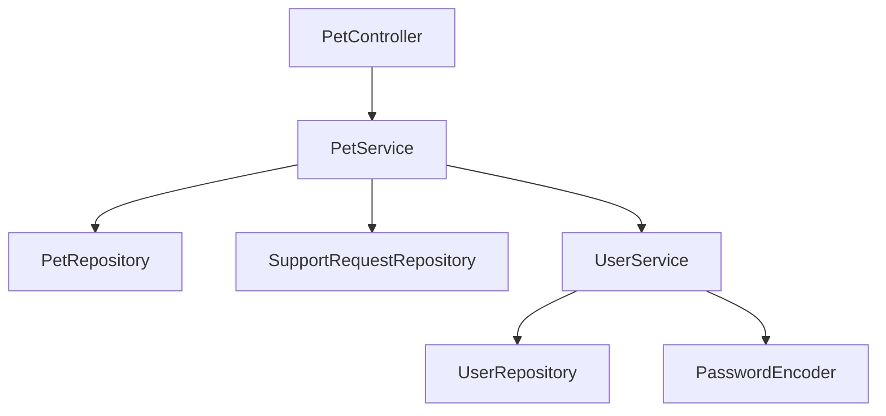
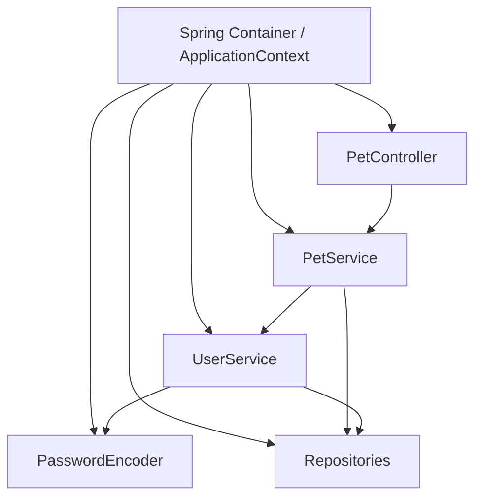
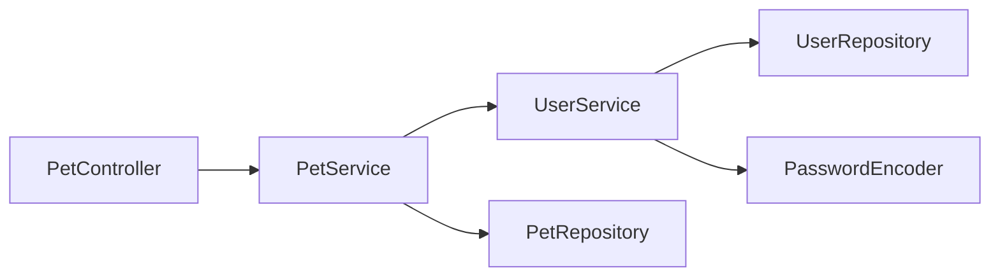

# 02 — Antes de Spring

En el capítulo anterior vimos que una sola acción de PetMatch puede involucrar Controller, Service, Repository, seguridad, validación y persistencia.

Ahora vamos a retroceder conceptualmente.

Imagina que Spring no existiera y que tuvieras que crear y conectar manualmente todos los objetos necesarios para ejecutar PetMatch.

La pregunta central es:

> **¿qué problemas aparecen cuando una aplicación Java empieza a depender de muchas clases conectadas entre sí?**

La respuesta nos llevará a cuatro ideas que debes comprender antes de estudiar las anotaciones de Spring:

- dependencia;
- acoplamiento;
- inversión de control;
- Dependency Injection.

Y, finalmente, a dos conceptos propios del ecosistema Spring:

- contenedor;
- Bean.

---

## ¿Qué es una dependencia?

Una clase **depende** de otra cuando necesita utilizarla para cumplir su responsabilidad.

En PetMatch, `PetController` necesita a `PetService`.

Código real:

```java
private final PetService petService;

public PetController(PetService petService) {
    this.petService = petService;
}
```

Archivo:

```text
src/main/java/com/petmatch/community/controller/PetController.java
```

La relación conceptual es:

```text
PetController
    necesita
PetService
```

`PetService`, a su vez, necesita otras piezas.

Código real:

```java
private final PetRepository petRepository;
private final SupportRequestRepository supportRequestRepository;
private final UserService userService;
```

Su constructor recibe esas dependencias:

```java
public PetService(
    PetRepository petRepository,
    SupportRequestRepository supportRequestRepository,
    UserService userService
) {
    this.petRepository = petRepository;
    this.supportRequestRepository = supportRequestRepository;
    this.userService = userService;
}
```

La relación ya es más amplia:

```text
PetController
    ↓
PetService
    ├── PetRepository
    ├── SupportRequestRepository
    └── UserService
```

Y `UserService` necesita a su vez:

```text
UserRepository
PasswordEncoder
```

Cuando una aplicación crece, aparece una red de objetos que necesitan otros objetos.

A esa red podemos verla como un **grafo de dependencias**.

---

## 🧠 Idea mental: una obra de teatro

Imagina una obra en la que cada actor necesita trabajar con otros actores.

El Controller no puede representar toda la obra solo. Necesita al Service.

El Service necesita acceso a datos y a otros servicios.

El Repository necesita infraestructura de persistencia.

Si cada actor tuviera que contratar personalmente a todos los demás actores que necesita, la organización sería caótica.

Una alternativa es tener una dirección central que:

1. conozca qué participantes existen;
2. los prepare;
3. conecte a cada uno con las personas que necesita;
4. gestione su ciclo de vida.

Esta analogía se aproxima al papel de un **contenedor de IoC**.

No sustituye la definición técnica, pero ayuda a visualizar el problema.

---

## ¿Qué ocurriría creando todo manualmente?

Imaginemos una versión conceptual de PetMatch sin Spring.

> [!NOTE]
> El siguiente código es **pseudocódigo conceptual**. No corresponde a la implementación real del repositorio.

Podríamos terminar escribiendo algo parecido a:

```java
UserRepository userRepository = new UserRepositoryImpl(...);
PasswordEncoder passwordEncoder = new SomePasswordEncoder();
UserService userService = new UserService(userRepository, passwordEncoder);

PetRepository petRepository = new PetRepositoryImpl(...);
SupportRequestRepository supportRequestRepository = new SupportRequestRepositoryImpl(...);

PetService petService = new PetService(
    petRepository,
    supportRequestRepository,
    userService
);

PetController petController = new PetController(petService);
```

Y eso es solamente una parte del sistema.

También habría que preparar:

- `SupportRequestService`;
- `SupportApplicationService`;
- otros Controllers;
- seguridad;
- infraestructura de base de datos;
- mapeo HTTP;
- configuración;
- objetos de framework.

El problema no es que `new` sea malo. Crear objetos con `new` es completamente normal en Java.

El problema aparece cuando **la composición completa de una aplicación compleja queda distribuida o controlada manualmente por las propias clases**.

---

## Problema 1 — Las clases conocen demasiado sobre cómo construir sus colaboradores

Supongamos que `PetController` hiciera esto:

> [!NOTE]
> Ejemplo conceptual, no código real de PetMatch.

```java
public class PetController {

    private final PetService petService;

    public PetController() {
        UserRepository userRepository = new UserRepositoryImpl();
        UserService userService = new UserService(userRepository, new PasswordEncoderImpl());
        PetRepository petRepository = new PetRepositoryImpl();
        SupportRequestRepository requestRepository = new SupportRequestRepositoryImpl();

        this.petService = new PetService(
            petRepository,
            requestRepository,
            userService
        );
    }
}
```

Ahora `PetController` no solo sabe que necesita `PetService`.

También sabe:

- qué implementación de Repository crear;
- cómo construir `UserService`;
- qué encoder utilizar;
- en qué orden construir todo;
- qué infraestructura necesitan esas clases.

Eso no forma parte de la responsabilidad natural de un Controller.

El Controller debería concentrarse en su problema de entrada/salida HTTP y coordinación, no en ensamblar toda la aplicación.

---

## Problema 2 — Cambiar una implementación puede obligar a modificar consumidores

Imagina que una clase construye directamente una implementación concreta:

```java
this.notifier = new EmailNotifier();
```

Si después quieres probar con:

```text
SmsNotifier
```

puede ser necesario modificar la clase que consume la dependencia.

Eso aumenta el **acoplamiento**.

### ¿Qué es acoplamiento?

El acoplamiento describe cuánto conoce o depende una parte del software de detalles de otra.

No significa que todas las dependencias sean malas. Una aplicación necesita colaboración entre clases.

La pregunta útil es:

> **¿dependo de lo necesario o estoy atado innecesariamente a detalles de construcción e implementación?**

En PetMatch, el constructor de `PetController` expresa una dependencia clara:

```java
public PetController(PetService petService) {
    this.petService = petService;
}
```

El Controller sabe que necesita un `PetService`.

No aparece dentro del Controller código para decidir cómo construir todas las dependencias internas de ese Service.

Ese detalle es fundamental.

---

## Problema 3 — Las pruebas se vuelven más difíciles

Una ventaja importante de recibir dependencias desde afuera es poder sustituirlas durante una prueba.

PetMatch tiene pruebas unitarias reales que utilizan Mockito.

Por ejemplo, `SupportRequestServiceTests` declara:

```java
@Mock
private SupportRequestRepository supportRequestRepository;

@Mock
private SupportApplicationRepository supportApplicationRepository;

@Mock
private PetService petService;

@Mock
private UserService userService;

@InjectMocks
private SupportRequestService supportRequestService;
```

Archivo:

```text
src/test/java/com/petmatch/community/service/SupportRequestServiceTests.java
```

La prueba puede construir un `SupportRequestService` utilizando colaboradores controlados por Mockito.

¿Por qué es posible?

Porque `SupportRequestService` expresa sus dependencias mediante el constructor:

```java
public SupportRequestService(
    SupportRequestRepository supportRequestRepository,
    SupportApplicationRepository supportApplicationRepository,
    PetService petService,
    UserService userService
) {
    this.supportRequestRepository = supportRequestRepository;
    this.supportApplicationRepository = supportApplicationRepository;
    this.petService = petService;
    this.userService = userService;
}
```

Si el Service creara internamente sus repositories con `new`, sustituirlos durante una prueba aislada sería mucho más incómodo.

> [!IMPORTANT]
> Dependency Injection no existe únicamente para “ahorrar `new`”. Una de sus consecuencias más valiosas es hacer explícitas y sustituibles las dependencias.

---

## Problema 4 — La configuración termina mezclada con lógica

Las aplicaciones dependen de decisiones que pueden variar:

- conexión a base de datos;
- puerto del servidor;
- credenciales;
- mecanismos de seguridad;
- implementaciones concretas;
- políticas de sesión.

Si cada clase decidiera por sí misma cómo crear y configurar todo lo que utiliza, la lógica funcional quedaría mezclada con infraestructura.

PetMatch evita, por ejemplo, escribir credenciales MySQL dentro de `PetService`.

La configuración real vive en:

```text
src/main/resources/application.yaml
```

con variables de entorno:

```yaml
spring:
  datasource:
    url: ${DB_URL}
    username: ${DB_USERNAME}
    password: ${DB_PASSWORD}
```

Más adelante estudiaremos en detalle cómo Spring Boot procesa esta configuración.

Aquí basta con observar la separación:

```text
regla de negocio
≠
configuración de infraestructura
```

---

## Problema 5 — El orden de construcción se vuelve una responsabilidad global

Si A necesita B y B necesita C, alguien debe asegurarse de que C exista antes de construir B y de que B exista antes de construir A.

Un sistema real puede tener una estructura como:



¿Quién crea primero cada pieza?

¿Quién conserva las instancias?

¿Se debe crear un `UserService` nuevo cada vez que alguien lo necesita?

¿Quién decide cuándo reutilizar un objeto?

Ese tipo de coordinación es precisamente lo que un contenedor puede administrar.

---

# Inversión de Control (IoC)

Ya tenemos suficiente contexto para definir el primer concepto central.

## Definición intuitiva

En lugar de que cada clase controle la creación y búsqueda de todos sus colaboradores, **cede ese control a una infraestructura externa**.

La clase declara qué necesita.

Otro componente se encarga de proporcionárselo.

## Definición técnica

**Inversion of Control (IoC)** es un principio de diseño en el que el flujo de creación, configuración y conexión de componentes deja de ser controlado directamente por el código de negocio y pasa a ser gestionado por un framework, contenedor u otra infraestructura.

La “inversión” está en quién tiene el control.

### Control tradicional

```text
Mi clase
  ↓
crea dependencia
  ↓
configura dependencia
  ↓
utiliza dependencia
```

### Con IoC

```text
Contenedor
  ↓
crea componentes
  ↓
los conecta
  ↓
entrega a mi clase lo que necesita
```

La clase se concentra en utilizar sus colaboradores.

---

## IoC no significa que Spring haga toda la lógica

Un error frecuente es interpretar IoC como:

> “Spring decide lo que hace mi aplicación”.

No.

Tu código sigue definiendo:

- reglas de negocio;
- métodos;
- estructuras de datos;
- decisiones funcionales;
- estados válidos.

Spring administra principalmente infraestructura y composición de componentes según la configuración que le proporcionas.

Por ejemplo, la regla:

```java
if (request.getOwner().getId().equals(applicant.getId())) {
    throw new SupportApplicationRuleException(
        "No puedes postularte a tu propia solicitud."
    );
}
```

es lógica de PetMatch.

Spring no inventó esa regla.

---

# Dependency Injection (DI)

IoC es un principio amplio. **Dependency Injection** es una forma concreta de aplicar ese principio.

## Definición intuitiva

Una clase recibe desde afuera los objetos que necesita en lugar de construirlos por sí misma.

Código real de PetMatch:

```java
public PetController(PetService petService) {
    this.petService = petService;
}
```

`PetController` no hace:

```java
this.petService = new PetService(...);
```

Recibe la dependencia.

Eso es la idea esencial de inyección de dependencias.

## Definición técnica

**Dependency Injection (DI)** es un patrón mediante el cual las dependencias de un objeto son suministradas desde el exterior en vez de ser creadas o localizadas internamente por ese objeto.

Las formas comunes incluyen:

- inyección por constructor;
- inyección mediante métodos/setters;
- inyección en campos.

PetMatch utiliza principalmente **constructor injection**.

---

## ¿Por qué constructor injection?

Observemos nuevamente:

```java
public UserService(
    UserRepository userRepository,
    PasswordEncoder passwordEncoder
) {
    this.userRepository = userRepository;
    this.passwordEncoder = passwordEncoder;
}
```

Este diseño tiene varias ventajas.

### 1. Las dependencias son visibles

Puedes mirar el constructor y saber qué necesita la clase para funcionar.

### 2. La clase no puede construirse correctamente sin ellas

Si `UserService` requiere Repository y encoder, el constructor obliga a proporcionarlos.

### 3. Los campos pueden mantenerse `final`

Código real:

```java
private final UserRepository userRepository;
private final PasswordEncoder passwordEncoder;
```

Eso expresa que la referencia se establece durante la construcción y no se reemplaza arbitrariamente después.

### 4. Facilita pruebas

Puedes proporcionar dobles de prueba o mocks.

### 5. Evita dependencias ocultas

Una dependencia inyectada directamente en un campo puede ser menos evidente al leer el constructor de la clase.

> [!TIP]
> Cuando abras un Service de PetMatch por primera vez, mira su constructor antes que sus métodos. El constructor te ofrece un mapa rápido de sus colaboradores.

---

## ¿Qué sería field injection?

Un estilo que encontrarás en muchos proyectos antiguos o ejemplos simples es:

```java
@Autowired
private PetService petService;
```

PetMatch no utiliza este patrón en su código de producción para conectar Controllers y Services.

El proyecto prefiere:

```java
private final PetService petService;

public PetController(PetService petService) {
    this.petService = petService;
}
```

Más adelante veremos por qué Spring puede inyectar ese constructor incluso sin escribir `@Autowired` cuando existe un único constructor adecuado.

Por ahora conserva la idea:

```text
necesidad explícita en constructor
>
dependencia oculta en campo
```

como regla pedagógica general del proyecto.

---

# ¿Qué es un contenedor?

Ahora podemos introducir un término que aparecerá constantemente.

## Idea intuitiva

El contenedor es el sistema que mantiene el “mapa” de componentes gestionados y se encarga de crearlos y conectarlos.

## Definición técnica

En Spring, el **IoC Container** es la infraestructura responsable de instanciar, configurar y ensamblar objetos gestionados por Spring.

La interfaz central del contenedor moderno de Spring es `ApplicationContext`.

No necesitas interactuar manualmente con `ApplicationContext` para cada operación. Normalmente declaras componentes/configuración y Spring realiza el ensamblaje durante el arranque.

Conceptualmente:



El diagrama no significa que todos estos objetos se creen de la misma forma internamente. Significa que Spring conoce y administra las relaciones necesarias entre componentes.

---

# ¿Qué es un Bean?

Una vez entendido el contenedor, `Bean` deja de parecer una palabra misteriosa.

## Definición sencilla

Un **Bean** es un objeto que forma parte del contenedor de Spring y cuyo ciclo de creación/configuración es administrado por ese contenedor.

No todo objeto Java es automáticamente un Bean.

Por ejemplo, dentro de `PetService.create(...)` se construye una entidad:

```java
Pet pet = new Pet(
    normalize(form.getName()),
    normalize(form.getSpecies()),
    form.getAge(),
    normalizeNullable(form.getDescription()),
    owner
);
```

Ese `Pet` representa un dato del dominio creado durante una operación. No necesitamos convertir cada mascota en un componente global administrado por el contenedor.

En cambio, `PetService` sí representa un componente de la aplicación que Spring administra.

> [!IMPORTANT]
> “Objeto Java” y “Spring Bean” no son sinónimos. Un Bean sigue siendo un objeto Java, pero está registrado y gestionado por el contenedor de Spring.

---

## ¿Cómo sabe Spring qué objetos gestionar?

La respuesta completa llegará en los siguientes capítulos.

Pero podemos observar dos mecanismos reales de PetMatch.

### Componentes detectados

`PetService` tiene:

```java
@Service
public class PetService {
```

`PetController` tiene:

```java
@Controller
public class PetController {
```

Estas anotaciones permiten que Spring identifique clases que deben formar parte de la aplicación durante el escaneo de componentes.

### Beans declarados mediante configuración

En `SecurityConfig` existe:

```java
@Bean
PasswordEncoder passwordEncoder() {
    return PasswordEncoderFactories.createDelegatingPasswordEncoder();
}
```

En este caso Spring registra como Bean el objeto retornado por el método.

Archivo:

```text
src/main/java/com/petmatch/community/config/SecurityConfig.java
```

Todavía no estudiaremos todas las variantes. El punto es reconocer que el contenedor necesita saber qué objetos forman parte de su contexto.

---

## ¿Cómo llega entonces `PasswordEncoder` a `UserService`?

PetMatch contiene estas dos piezas reales.

En configuración:

```java
@Bean
PasswordEncoder passwordEncoder() {
    return PasswordEncoderFactories.createDelegatingPasswordEncoder();
}
```

En `UserService`:

```java
public UserService(
    UserRepository userRepository,
    PasswordEncoder passwordEncoder
) {
    this.userRepository = userRepository;
    this.passwordEncoder = passwordEncoder;
}
```

Conceptualmente Spring hace posible la relación:

```text
Bean PasswordEncoder
        ↓
Spring Container
        ↓
constructor UserService
```

`UserService` no necesita conocer la fábrica concreta utilizada para construir el encoder.

Solo necesita trabajar con `PasswordEncoder`.

Este es un ejemplo real de desacoplar:

```text
uso
```

de:

```text
construcción/configuración
```

---

## ¿Spring elimina todas las dependencias?

No.

Spring no intenta que las clases dejen de depender unas de otras.

`PetController` **sí depende** de `PetService`.

`PetService` **sí depende** de `PetRepository` y `UserService`.

Lo que cambia es cómo se gestionan esas dependencias.

La meta no es:

```text
cero dependencias
```

sino:

```text
dependencias claras
+
responsabilidades separadas
+
composición administrable
```

---

## Dependency Injection no reemplaza diseño

Es posible usar Spring y aun así diseñar mal una aplicación.

Por ejemplo, podríamos tener:

```text
MegaService
 ├─ UserRepository
 ├─ PetRepository
 ├─ SupportRequestRepository
 ├─ SupportApplicationRepository
 ├─ PasswordEncoder
 ├─ EmailClient
 ├─ PaymentClient
 └─ veinte responsabilidades más
```

Aunque todas las dependencias estén correctamente inyectadas, la clase puede seguir teniendo demasiadas responsabilidades.

DI facilita composición y desacoplamiento, pero no decide automáticamente dónde debe vivir cada regla.

Eso sigue siendo una decisión de diseño.

---

## Un ejemplo completo con PetMatch

Consideremos la operación:

```text
GET /pets
```

En código real, `PetController` llama:

```java
petService.findCurrentUserPets(authentication)
```

`PetService` necesita determinar el usuario:

```java
User owner = userService.getCurrentUser(authentication);
```

y luego consulta:

```java
return petRepository.findByOwnerIdOrderByNameAsc(owner.getId());
```

Para que este flujo exista, hay un grafo conceptual:



Aunque esta operación concreta no utilice directamente `PasswordEncoder`, `UserService` forma parte de un componente que tiene esa dependencia para otras responsabilidades como registro.

Spring prepara el grafo de componentes durante la creación del contexto de la aplicación.

El Controller puede concentrarse en:

```text
recibir petición
→ delegar
→ preparar respuesta
```

sin convertirse en ensamblador de infraestructura.

---

# Separación de responsabilidades

IoC y DI funcionan mejor cuando las clases tienen responsabilidades claras.

PetMatch utiliza nombres que ayudan a reconocerlas:

```text
Controller
Service
Repository
```

Aún no estudiaremos formalmente la arquitectura por capas, pero podemos establecer una primera aproximación.

### Controller

Cerca de HTTP y de la interacción con el cliente.

### Service

Cerca de casos de uso y reglas del dominio.

### Repository

Cerca de persistencia y consultas.

Si el Controller construyera el Repository, procesara todas las reglas y además escribiera SQL, habríamos perdido gran parte del beneficio de separar responsabilidades.

---

## ¿Qué problema resuelve realmente Spring aquí?

Después de todo lo anterior, ya podemos formular una respuesta más precisa.

Spring ayuda a resolver, entre otros, el problema de **organizar y conectar componentes de una aplicación sin obligar a cada clase a gestionar manualmente la construcción de todo su grafo de dependencias**.

Lo hace mediante un contenedor de IoC que administra Beans y puede inyectar dependencias.

Pero Spring ofrece mucho más:

- configuración;
- transacciones;
- MVC;
- integración de persistencia;
- seguridad;
- validación;
- testing;
- infraestructura web.

En los siguientes capítulos iremos incorporando esas capacidades gradualmente.

---

## Spring Framework todavía no es Spring Boot

En este capítulo hemos hablado del contenedor y de DI como ideas centrales de Spring.

Eso pertenece fundamentalmente a **Spring Framework**.

Spring Boot aparecerá después para resolver otro problema:

> configurar y arrancar una aplicación Spring completa con menos configuración manual y convenciones más prácticas.

No confundas desde ahora:

```text
Spring Framework
```

con:

```text
Spring Boot
```

Están profundamente relacionados, pero no son exactamente lo mismo.

El próximo capítulo del bloque profundiza esa diferencia.

---

## ⚠️ Errores frecuentes

### Error 1 — “Dependency Injection significa no usar `new` nunca”

Incorrecto.

PetMatch utiliza `new` para crear entidades y DTO cuando corresponde.

Ejemplo real:

```java
Pet pet = new Pet(...);
```

DI se aplica especialmente a colaboradores/componentes cuya construcción y conexión conviene administrar externamente.

### Error 2 — “Un Bean es cualquier objeto Java”

No.

Un Bean es un objeto administrado por el contenedor de Spring.

### Error 3 — “IoC y DI son exactamente sinónimos”

No del todo.

IoC es un principio más amplio. Dependency Injection es una técnica concreta para aplicarlo.

### Error 4 — “Spring escribe mis reglas de negocio”

No.

Spring proporciona infraestructura. Las reglas de PetMatch siguen estando expresadas por el código del proyecto.

### Error 5 — “Si uso `@Autowired` ya entendí DI”

La anotación es un mecanismo. El concepto importante es que la clase recibe una dependencia externa en vez de encargarse de construirla.

### Error 6 — “Muchos Beans siempre significan buena arquitectura”

No.

Una mala separación de responsabilidades sigue siendo mala aunque Spring pueda instanciar todas las clases.

---

## 🛠 Prueba en el código

### Actividad 1 — Dibuja un grafo de dependencias

Abre:

```text
service/PetService.java
service/UserService.java
controller/PetController.java
```

Dibuja en papel flechas del tipo:

```text
A → necesita → B
```

No dibujes todavía dependencias internas de Spring que no puedas identificar directamente en el código.

### Actividad 2 — Busca constructores

Revisa:

```text
PetController
SupportRequestController
SupportApplicationController
PetService
SupportRequestService
SupportApplicationService
UserService
DatabaseUserDetailsService
```

Responde:

1. ¿cuáles reciben dependencias mediante constructor?
2. ¿qué campos correspondientes son `final`?
3. ¿encuentras field injection en esas clases de producción?

### Actividad 3 — Encuentra un Bean explícito

Abre:

```text
config/SecurityConfig.java
```

Busca:

```java
@Bean
PasswordEncoder passwordEncoder()
```

Luego abre:

```text
service/UserService.java
```

Localiza dónde llega `PasswordEncoder`.

### Actividad 4 — Compara con una prueba

Abre:

```text
src/test/java/com/petmatch/community/service/SupportRequestServiceTests.java
```

Identifica:

```java
@Mock
@InjectMocks
```

No necesitas dominar Mockito todavía. Pregúntate solamente por qué resulta útil que el Service permita recibir sus dependencias desde afuera.

---

## 🧪 Comprueba que entendiste

1. ¿Qué significa que una clase dependa de otra?
2. ¿Qué problema aparecería si `PetController` tuviera que construir manualmente `PetService` y todas sus dependencias internas?
3. ¿Qué es acoplamiento?
4. ¿Qué significa Inversion of Control?
5. ¿Qué relación existe entre IoC y Dependency Injection?
6. ¿Qué es un Spring Bean?
7. ¿Todos los objetos creados con `new` dentro de PetMatch deberían convertirse en Beans?
8. ¿Por qué constructor injection facilita identificar dependencias?
9. ¿Qué Bean explícito produce `SecurityConfig` y quién lo consume?
10. ¿Por qué DI puede facilitar las pruebas unitarias?

---

## ✅ Qué debes recordar

- Una **dependencia** es un colaborador que una clase necesita para cumplir su responsabilidad.
- A medida que una aplicación crece aparece un **grafo de dependencias**.
- Si cada clase construye y configura internamente todos sus colaboradores, aumenta el acoplamiento y se dificulta el testing y la configuración.
- **IoC** invierte quién controla la creación y conexión de componentes.
- **Dependency Injection** hace que una clase reciba sus dependencias desde afuera.
- PetMatch utiliza principalmente **constructor injection**.
- El **Spring Container** administra componentes de la aplicación.
- Un **Bean** es un objeto gestionado por ese contenedor.
- No todo objeto Java debe ser un Bean.
- DI no reemplaza un buen diseño de responsabilidades.
- Spring Framework aporta estas bases; Spring Boot construirá sobre ellas para simplificar configuración y arranque.

---

## Continúa con

Hasta aquí ya puedes entender el problema fundamental que Spring ayuda a resolver sin depender de memorizar anotaciones.

El siguiente paso del bloque es diferenciar claramente:

```text
Spring Framework
vs
Spring Boot
```

Y estudiar qué ocurre realmente cuando PetMatch ejecuta:

```java
SpringApplication.run(...)
```

Ese contenido ya está disponible en:

**[Capítulo 03 — Spring y Spring Boot →](03-spring-y-spring-boot.md)**

También puedes volver a:

- [Capítulo 01 — PetMatch y el problema](01-petmatch-y-el-problema.md)
- [Bloque 01 — Fundamentos](README.md)
- [Índice general](../README.md)

---

[← PetMatch y el problema](01-petmatch-y-el-problema.md) · [Índice del bloque](README.md) · [Índice general](../README.md) · [Siguiente → Capítulo 03](03-spring-y-spring-boot.md)
