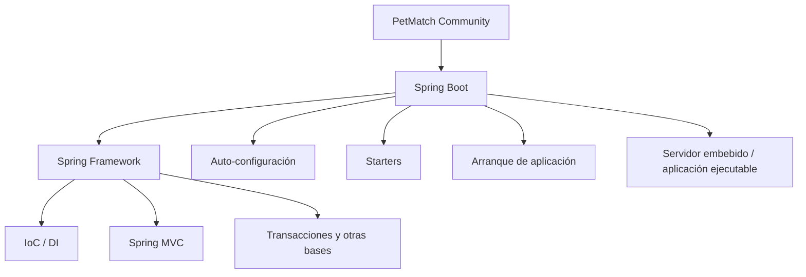
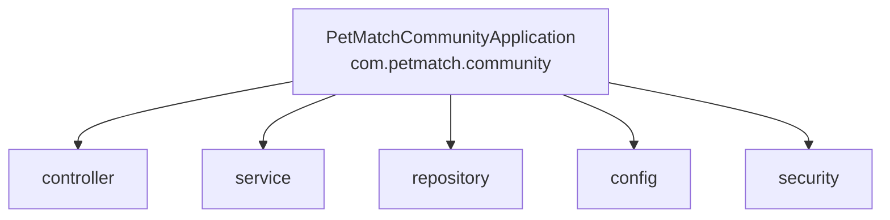
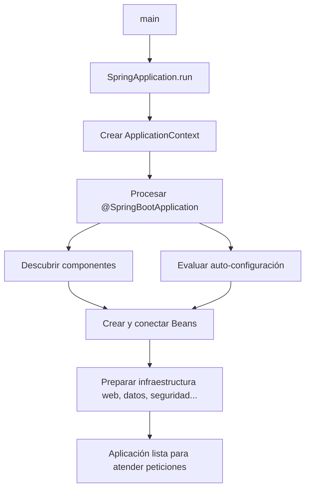

# 03 — Spring y Spring Boot

En el capítulo anterior vimos el problema de construir y conectar manualmente una aplicación Java que tiene muchos objetos dependientes entre sí.

Ahora podemos responder una pregunta que suele aparecer muy pronto cuando alguien empieza en este ecosistema:

> **¿Spring y Spring Boot son lo mismo?**

No.

Spring Boot se apoya en Spring Framework, pero resuelve un conjunto adicional de problemas relacionados con la **puesta en marcha, configuración y composición de una aplicación Spring**.

En este capítulo no intentaremos memorizar todas sus capacidades. Nos concentraremos en entender qué papel cumple cada uno y cómo aparece esa relación en PetMatch Community.

---

## ¿Qué problema estamos resolviendo?

Imagina que ya aceptamos una idea del capítulo anterior:

```text
las clases deberían declarar sus dependencias
        ↓
un contenedor puede crear y conectar componentes
```

Eso todavía deja muchas preguntas prácticas:

- ¿cómo se inicia el contenedor?
- ¿cómo descubre los componentes de la aplicación?
- ¿cómo se configura una aplicación web?
- ¿cómo se prepara un servidor HTTP?
- ¿cómo se conecta la aplicación con JPA?
- ¿cómo se activa Spring Security?
- ¿cómo se decide qué configuración automática aplicar?
- ¿cómo se agrupan dependencias compatibles?
- ¿cómo se arranca todo desde un único `main()`?

Spring Framework aporta la infraestructura central. Spring Boot reduce gran parte del trabajo repetitivo necesario para convertir esa infraestructura en una aplicación ejecutable.

---

# 1. ¿Qué es un framework?

Antes de hablar de Spring conviene detenernos en la palabra **framework**.

Una biblioteca normalmente ofrece código que tu aplicación llama cuando lo necesita.

Un framework, además de ofrecer componentes reutilizables, suele definir una estructura y participar activamente en el ciclo de ejecución de la aplicación.

Una simplificación útil es:

```text
Biblioteca
Tu código → llama a la biblioteca

Framework
Framework → coordina partes de tu código
```

No significa que pierdas el control sobre las reglas de negocio. Significa que aceptas ciertas convenciones y puntos de extensión para delegar infraestructura repetitiva.

En PetMatch, por ejemplo, tu código sigue decidiendo que:

- un usuario no puede postularse a su propia solicitud;
- una solicitud aceptada pasa a `IN_PROGRESS`;
- las otras postulaciones pendientes pasan a `REJECTED`.

Spring no inventa esas reglas. Spring aporta infraestructura para que tu aplicación pueda recibir peticiones HTTP, crear componentes, abrir transacciones, consultar datos, autenticar usuarios y ejecutar esas reglas dentro de un sistema organizado.

---

# 2. ¿Qué es Spring Framework?

## Idea intuitiva

Spring Framework es la base que permite construir aplicaciones Java a partir de componentes administrados y conectados por un contenedor, junto con muchos módulos para problemas habituales de aplicaciones empresariales.

En este libro nos interesan especialmente ideas como:

- IoC Container;
- Dependency Injection;
- configuración de componentes;
- acceso a datos;
- transacciones;
- MVC web;
- integración con seguridad y otras tecnologías del ecosistema.

## Definición técnica

**Spring Framework** es un framework para aplicaciones Java que proporciona infraestructura modular para crear, configurar y coordinar componentes. Entre sus fundamentos está el contenedor de inversión de control, encargado de administrar objetos y sus dependencias.

En PetMatch ya vimos una consecuencia directa de esa idea:

```java
public PetController(PetService petService) {
    this.petService = petService;
}
```

Archivo:

```text
src/main/java/com/petmatch/community/controller/PetController.java
```

`PetController` declara lo que necesita. No construye manualmente `PetService` ni todo su grafo de dependencias.

---

# 3. Entonces, ¿qué es Spring Boot?

## El problema después de tener Spring

Tener un framework potente no elimina automáticamente el trabajo de configuración.

Una aplicación web necesita muchas decisiones de infraestructura:

```text
¿Qué módulos están disponibles?
¿Qué componentes existen?
¿Qué servidor se utilizará?
¿Cómo se configura MVC?
¿Hay JPA?
¿Hay Security?
¿Qué propiedades se aplican?
¿Cómo arranca todo?
```

Spring Boot está orientado a reducir esa configuración repetitiva y facilitar la creación de aplicaciones Spring ejecutables.

## Definición intuitiva

Podemos pensar en Spring Boot como una capa que ayuda a decir:

> “Estas son las capacidades que necesita mi aplicación. Arráncala con convenciones razonables y déjame personalizar lo que sea necesario”.

## Definición técnica

**Spring Boot** es un proyecto del ecosistema Spring que simplifica la creación y ejecución de aplicaciones Spring mediante convenciones, configuración automática, starters, soporte de servidor embebido y un modelo de arranque integrado.

> [!IMPORTANT]
> Spring Boot **no reemplaza Spring Framework**. Lo utiliza como base y facilita su configuración y puesta en marcha.

---

# 4. Spring Framework vs Spring Boot

| Pregunta | Spring Framework | Spring Boot |
|---|---|---|
| ¿Aporta el contenedor IoC? | Sí | Lo utiliza |
| ¿Permite Dependency Injection? | Sí | La utiliza y facilita su configuración |
| ¿Define infraestructura MVC? | Sí, mediante Spring MVC | Facilita su configuración y arranque |
| ¿Tiene configuración automática orientada a aplicaciones? | No es su propósito principal | Sí |
| ¿Agrupa dependencias mediante starters? | No como mecanismo central | Sí |
| ¿Facilita ejecutar una aplicación con servidor embebido? | Requiere más composición | Sí |
| ¿Tiene `SpringApplication.run(...)`? | No | Sí |
| ¿PetMatch es una aplicación Spring Boot? | Usa Spring Framework por debajo | Sí |

Una forma de visualizarlo:



---

# 5. 🔎 En PetMatch: la clase de arranque

El mejor lugar para comenzar a observar Spring Boot en el proyecto es:

```text
src/main/java/com/petmatch/community/PetMatchCommunityApplication.java
```

Código real:

```java
package com.petmatch.community;

import org.springframework.boot.SpringApplication;
import org.springframework.boot.autoconfigure.SpringBootApplication;

@SpringBootApplication
public class PetMatchCommunityApplication {

    public static void main(String[] args) {
        SpringApplication.run(PetMatchCommunityApplication.class, args);
    }
}
```

Es una clase pequeña, pero cumple un papel decisivo.

---

# 6. El método `main()` sigue siendo Java

PetMatch no deja de ser una aplicación Java.

Su punto de entrada sigue siendo:

```java
public static void main(String[] args)
```

Eso es importante pedagógicamente.

Spring Boot no elimina Java ni crea un lenguaje diferente. Tu aplicación sigue arrancando desde un método `main()` normal.

La diferencia está en lo que ocurre dentro:

```java
SpringApplication.run(PetMatchCommunityApplication.class, args);
```

Ese llamado inicia el proceso de bootstrap de Spring Boot.

---

# 7. ¿Qué significa “bootstrap”?

**Bootstrap** puede traducirse de forma aproximada como el proceso de **arranque y preparación inicial** de una aplicación.

Antes de atender una petición como:

```text
GET /pets
```

PetMatch necesita estar preparado.

Conceptualmente deben ocurrir tareas como:

```text
iniciar la aplicación
        ↓
crear el contexto de Spring
        ↓
descubrir/configurar componentes
        ↓
procesar configuración automática
        ↓
preparar infraestructura web
        ↓
preparar acceso a datos y seguridad según dependencias/configuración
        ↓
iniciar la aplicación para recibir peticiones
```

No debes interpretar este diagrama como una lista exhaustiva del código interno de Spring Boot. Es un mapa mental para comprender qué significa “arrancar” una aplicación completa.

---

# 8. `SpringApplication.run(...)`

Código real:

```java
SpringApplication.run(PetMatchCommunityApplication.class, args);
```

Podemos leerlo así:

```text
SpringApplication
    ↓
arranca una aplicación Spring Boot
    ↓
usando PetMatchCommunityApplication como fuente principal de configuración
    ↓
y recibe los argumentos de línea de comandos del main
```

El resultado del proceso incluye la creación de un contexto de Spring.

En el capítulo anterior presentamos el término `ApplicationContext` como interfaz central del contenedor moderno de Spring. Aquí vemos el punto de arranque que conduce a su creación en una aplicación Boot.

> [!TIP]
> Cuando un proyecto Spring Boot “no arranca”, muchos errores aparecen durante esta fase porque Spring está intentando crear/configurar el contexto y encuentra una dependencia, propiedad o recurso que falta.

---

# 9. `@SpringBootApplication`

La anotación más visible de la clase es:

```java
@SpringBootApplication
```

No conviene memorizarla como “la anotación obligatoria de Spring”. Es mejor entender qué intención expresa:

> **Esta es la clase principal desde la cual configuramos y arrancamos la aplicación Spring Boot.**

`@SpringBootApplication` combina tres ideas principales del ecosistema Spring Boot:

```text
configuración de Spring
+
auto-configuración de Spring Boot
+
escaneo de componentes
```

A nivel conceptual se relaciona con:

- `@SpringBootConfiguration`;
- `@EnableAutoConfiguration`;
- `@ComponentScan`.

No necesitas reemplazar `@SpringBootApplication` por esas anotaciones en PetMatch. La anotación compuesta existe precisamente para expresar el caso habitual de una aplicación Boot.

---

# 10. Component scanning: ¿cómo encuentra Spring nuestras clases?

Mira el paquete de la clase principal:

```java
package com.petmatch.community;
```

Debajo de ese paquete están las áreas principales:

```text
com.petmatch.community
├── config
├── controller
├── dto
├── exception
├── model
├── repository
├── security
└── service
```

Esto no es accidental.

El escaneo de componentes asociado a la configuración principal toma como referencia el paquete de la clase de arranque y sus subpaquetes.

Por eso una clase como:

```text
com.petmatch.community.service.PetService
```

queda dentro del árbol natural que Spring puede inspeccionar.

Y `PetService` está marcado realmente con:

```java
@Service
public class PetService {
```

Más adelante estudiaremos con detalle los estereotipos como `@Service` y `@Controller`.

Por ahora conserva esta relación:



> [!WARNING]
> Mover la clase principal a un paquete que no sea ancestro de los componentes puede cambiar qué clases se descubren automáticamente. La ubicación de la clase de arranque tiene consecuencias.

---

# 11. ¿Qué es la auto-configuración?

## El problema

Supón que agregas capacidades web, seguridad y persistencia.

Sin ayuda, tendrías que configurar manualmente una gran cantidad de infraestructura incluso para comenzar.

## Idea intuitiva

Spring Boot examina el contexto de la aplicación —incluidas las dependencias disponibles y la configuración— y aplica configuraciones automáticas apropiadas cuando se cumplen determinadas condiciones.

Una forma simplificada de pensarlo:

```text
¿Qué dependencias hay?
¿Qué configuración existe?
¿Qué componentes ya definió el desarrollador?
        ↓
Spring Boot evalúa condiciones
        ↓
aplica configuración automática pertinente
```

## 🔎 En PetMatch

El `pom.xml` incluye, entre otras, estas dependencias:

```xml
<artifactId>spring-boot-starter-data-jpa</artifactId>
<artifactId>spring-boot-starter-security</artifactId>
<artifactId>spring-boot-starter-thymeleaf</artifactId>
<artifactId>spring-boot-starter-validation</artifactId>
<artifactId>spring-boot-starter-webmvc</artifactId>
```

Eso le da al proyecto capacidades que Spring Boot puede detectar y configurar.

Además existe:

```text
src/main/resources/application.yaml
```

con configuración de datasource y JPA.

El resultado es que PetMatch no contiene una clase manual para construir desde cero toda la infraestructura MVC, Hibernate o el servidor HTTP.

> [!IMPORTANT]
> “Auto-configuración” no significa “magia sin reglas”. Spring Boot aplica configuraciones condicionadas por lo que encuentra en el proyecto. Más adelante aprenderemos a identificar mejor esas condiciones y a personalizar el comportamiento.

---

# 12. Convención sobre configuración

Spring Boot intenta ofrecer valores y comportamientos razonables para casos habituales.

La idea es:

```text
convención útil
+
configuración automática
+
personalización cuando la necesitas
```

PetMatch demuestra esa combinación.

Hay aspectos que no requieren configuración explícita en `application.yaml`, mientras otros sí se personalizan:

```yaml
spring:
  datasource:
    url: ${DB_URL}
    username: ${DB_USERNAME}
    password: ${DB_PASSWORD}

  jpa:
    hibernate:
      ddl-auto: update
    open-in-view: false
```

No estudiaremos todavía qué hace cada propiedad; eso corresponde al capítulo 06.

La observación importante aquí es que Boot permite centralizar configuración externa sin convertir cada clase en responsable de leer credenciales o preparar infraestructura.

---

# 13. ¿Qué es un starter?

En el `pom.xml` aparece repetidamente la palabra:

```text
starter
```

Por ejemplo:

```xml
<dependency>
    <groupId>org.springframework.boot</groupId>
    <artifactId>spring-boot-starter-security</artifactId>
</dependency>
```

Un **Spring Boot Starter** es una dependencia diseñada para facilitar la incorporación de una capacidad concreta mediante un conjunto coherente de dependencias relacionadas.

En vez de que el aprendiz tenga que localizar manualmente cada biblioteca necesaria para comenzar con una característica, el starter representa una intención:

```text
quiero trabajar con seguridad
→ spring-boot-starter-security

quiero trabajar con JPA
→ spring-boot-starter-data-jpa

quiero una aplicación web MVC
→ spring-boot-starter-webmvc
```

En el próximo capítulo dedicado a Maven veremos cada dependencia real del `pom.xml` y qué habilita.

---

# 14. Servidor embebido y aplicación ejecutable

Una aplicación web necesita un servidor capaz de recibir peticiones HTTP.

En enfoques Java web tradicionales era común pensar primero en un servidor externo donde se desplegaba la aplicación.

Spring Boot favorece un modelo en el que la aplicación puede ejecutarse directamente y llevar consigo la infraestructura de servidor necesaria a través de sus dependencias y configuración.

Por eso el flujo cotidiano de PetMatch puede empezar con:

```bash
./mvnw spring-boot:run
```

En Windows PowerShell:

```powershell
.\mvnw.cmd spring-boot:run
```

El README principal indica que la interfaz se abre en:

```text
http://localhost:8080
```

Y `application.yaml` confirma:

```yaml
server:
  port: 8080
```

Para el aprendiz, la idea importante es:

```text
no preparo manualmente un servidor y después copio PetMatch dentro

PetMatch puede arrancarse como una aplicación Spring Boot
```

---

# 15. ¿Por qué no hay una enorme clase de configuración?

Si vienes de Java básico podrías esperar una clase similar a:

```java
public static void main(String[] args) {
    // crear conexión
    // crear repositorios
    // crear services
    // crear controllers
    // configurar servidor
    // configurar seguridad
    // configurar MVC
    // iniciar servidor
}
```

Ese código no existe en PetMatch.

El `main()` real sigue siendo:

```java
SpringApplication.run(PetMatchCommunityApplication.class, args);
```

La explicación es que la composición de la aplicación está distribuida mediante:

- configuración de Spring;
- componentes descubiertos;
- auto-configuración;
- dependencias de Maven;
- propiedades externas;
- Beans definidos por la aplicación cuando necesita personalización.

Un ejemplo de personalización real aparecerá más adelante en:

```text
src/main/java/com/petmatch/community/config/SecurityConfig.java
```

Allí PetMatch define explícitamente aspectos de seguridad que no quiere dejar únicamente en comportamiento por defecto.

---

# 16. Spring Boot no significa “cero configuración”

Un error frecuente es afirmar:

> “Spring Boot no necesita configuración”.

PetMatch demuestra que eso es falso.

Tiene configuración explícita en:

```text
application.yaml
SecurityConfig.java
pom.xml
```

Spring Boot busca reducir configuración repetitiva, no eliminar las decisiones de arquitectura.

Podemos expresarlo así:

```text
Spring Boot
≠
ninguna configuración

Spring Boot
=
menos configuración repetitiva
+
convenciones
+
auto-configuración
+
puntos claros de personalización
```

---

# 17. Spring Boot tampoco significa “todo automático”

PetMatch contiene código explícito para:

- reglas de negocio;
- validaciones;
- autorización por ownership;
- configuración de seguridad;
- queries específicas;
- mapping de DTO;
- manejo de errores REST.

Eso no contradice Spring Boot.

Boot se concentra en facilitar la infraestructura necesaria para que tu código pueda ejecutarse dentro de una aplicación coherente.

---

# 18. ¿Qué ocurre conceptualmente al arrancar PetMatch?

Sin entrar todavía en detalles internos avanzados, puedes conservar este mapa:



Esta secuencia será refinada durante el libro. No necesitas memorizarla como orden interno exacto de todos los eventos de Spring; úsala como modelo conceptual.

---

# 19. ¿Dónde está Spring Boot y dónde está nuestro código?

Una separación útil:

## Infraestructura del framework

Spring/Spring Boot participa en:

- arrancar el contexto;
- crear componentes administrados;
- inyectar dependencias;
- procesar configuración;
- preparar infraestructura MVC;
- integrar persistencia;
- integrar seguridad.

## Código propio de PetMatch

Nuestra aplicación define:

- `User`;
- `Pet`;
- `SupportRequest`;
- `SupportApplication`;
- reglas de negocio;
- estados;
- Services;
- Controllers;
- DTO;
- queries específicas;
- templates;
- decisiones de seguridad.

El framework no reemplaza el dominio.

El framework **sostiene** el dominio.

---

# 20. ⚠️ Errores frecuentes

## “Spring y Spring Boot son sinónimos”

No. Boot utiliza Spring Framework y facilita construir aplicaciones sobre él.

## “`@SpringBootApplication` contiene toda la aplicación”

No. Es un punto principal de configuración/arranque. El comportamiento real está distribuido entre componentes, configuración y dependencias.

## “Spring Boot escribe mis reglas de negocio”

No. Las reglas de PetMatch siguen escritas en nuestros Services.

## “Auto-configuración significa que Spring adivina cualquier cosa”

No. La configuración automática se activa de forma condicionada según el entorno de la aplicación.

## “Con Boot nunca necesito configurar nada”

Falso. PetMatch tiene configuración explícita en `application.yaml` y `SecurityConfig`.

## “Debo memorizar todas las anotaciones antes de continuar”

No. En este punto necesitas comprender el modelo de arranque y la diferencia entre Spring y Boot.

---

# 21. 🛠 Prueba en el código

Abre:

```text
src/main/java/com/petmatch/community/PetMatchCommunityApplication.java
```

Responde sin buscar documentación externa:

1. ¿cuál es el paquete de la clase principal?
2. ¿qué anotación marca la clase?
3. ¿qué método Java funciona como punto de entrada?
4. ¿qué clase se pasa como primer argumento a `SpringApplication.run(...)`?
5. ¿qué subpaquetes importantes existen debajo de `com.petmatch.community`?

Luego abre:

```text
pom.xml
```

Busca cuántos `artifactId` contienen la palabra:

```text
starter
```

No intentes todavía aprenderlos todos. Solo relaciona la presencia de starters con las capacidades que Boot configura.

---

# 22. 🧪 Comprueba que entendiste

Intenta responder sin volver arriba.

1. ¿Spring Framework y Spring Boot son lo mismo?
2. ¿qué problema adicional intenta simplificar Spring Boot?
3. ¿qué hace conceptualmente `SpringApplication.run(...)`?
4. ¿qué tres ideas principales reúne `@SpringBootApplication`?
5. ¿por qué importa el paquete donde está `PetMatchCommunityApplication`?
6. ¿qué es un starter?
7. ¿por qué “auto-configuración” no significa “magia”?
8. ¿Spring Boot elimina la necesidad de escribir reglas de negocio?
9. ¿PetMatch sigue siendo una aplicación Java normal en cuanto a su punto de entrada?
10. ¿qué archivo del proyecto declara las dependencias que ayudan a determinar las capacidades disponibles?

### Respuestas esperadas

1. No. Boot se construye sobre Spring Framework.
2. El arranque, configuración y composición repetitiva de aplicaciones Spring.
3. Inicia el proceso de bootstrap de la aplicación y su contexto Spring.
4. Configuración, auto-configuración y component scanning.
5. Porque funciona como referencia natural para descubrir componentes en sus subpaquetes.
6. Una dependencia de Boot que agrupa capacidades/dependencias relacionadas para un propósito.
7. Porque se basa en condiciones y en lo que existe en el proyecto/configuración.
8. No. Las reglas siguen siendo responsabilidad de nuestro código.
9. Sí: comienza en `public static void main(String[] args)`.
10. `pom.xml`.

---

# 23. ✅ Qué debes recordar

Si solo conservas diez ideas de este capítulo, conserva estas:

1. **Spring Framework y Spring Boot no son lo mismo.**
2. **Spring Boot utiliza Spring Framework como base.**
3. **PetMatch sigue arrancando desde un `main()` normal de Java.**
4. **`SpringApplication.run(...)` inicia el bootstrap de la aplicación Spring Boot.**
5. **`@SpringBootApplication` reúne configuración, auto-configuración y escaneo de componentes.**
6. **La ubicación de la clase principal ayuda a definir el árbol natural de componentes.**
7. **Los starters expresan capacidades que queremos incorporar.**
8. **La auto-configuración reduce trabajo repetitivo, pero no elimina nuestras decisiones.**
9. **Spring Boot facilita infraestructura; PetMatch sigue definiendo su dominio y reglas.**
10. **Para saber qué capacidades tiene realmente un proyecto debes mirar su código y sus dependencias, no asumirlas.**

---

# 🔗 Continúa con

Ahora sabemos **qué arranca PetMatch**, pero todavía necesitamos aprender a orientarnos dentro de todo el repositorio.

El siguiente capítulo responde:

> **¿qué significa cada carpeta y archivo principal de una aplicación Spring Boot como PetMatch?**

**[Capítulo 04 — Estructura del proyecto →](04-estructura-del-proyecto.md)**

---

[← Capítulo 02 — Antes de Spring](02-antes-de-spring.md) · [Índice del bloque](README.md) · [Índice general](../README.md) · [Siguiente → Capítulo 04](04-estructura-del-proyecto.md)
