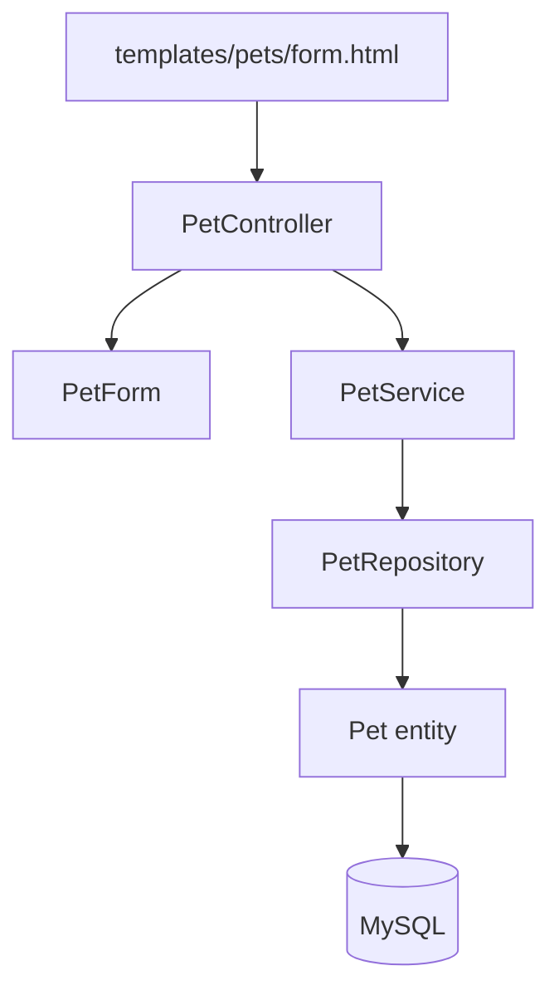
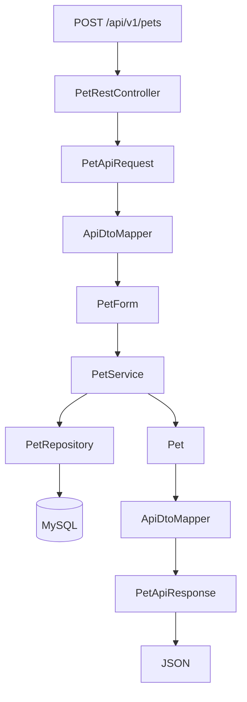
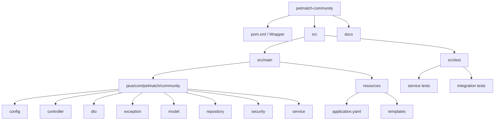

# 04 — Estructura del proyecto

Ya sabemos qué relación existe entre Spring Framework y Spring Boot y desde qué clase arranca PetMatch Community.

Ahora necesitamos aprender a orientarnos dentro del repositorio.

Cuando alguien abre por primera vez un proyecto Spring Boot suele ver muchas carpetas y archivos con nombres desconocidos. El error más común es intentar memorizar el árbol completo sin entender qué responsabilidad tiene cada zona.

La pregunta central de este capítulo es:

> **¿cómo leer la estructura real de PetMatch para saber dónde buscar cada tipo de responsabilidad?**

No estudiaremos todavía cada tecnología en profundidad. Construiremos primero un mapa mental del proyecto.

---

## ¿Qué problema estamos resolviendo?

Imagina que necesitas hacer una modificación concreta:

- cambiar una regla para aceptar postulaciones;
- añadir una validación de formulario;
- revisar una ruta web;
- cambiar una plantilla HTML;
- verificar una consulta de base de datos;
- revisar cómo se autentica un usuario;
- ejecutar una prueba.

Si no entiendes la estructura, puedes empezar a buscar al azar.

En cambio, si reconoces las responsabilidades del proyecto, puedes transformar una pregunta funcional en una ruta probable.

Por ejemplo:

```text
"¿Dónde se valida que una mascota pertenezca al usuario?"
        ↓
probablemente Service / Repository

"¿Dónde está el formulario HTML de una solicitud?"
        ↓
templates/support-requests/

"¿Dónde está la ruta REST de mascotas?"
        ↓
controller/api/
```

El objetivo de una buena estructura no es decorar el repositorio. Es reducir el costo de encontrar y mantener código.

---

# 1. Vista general real del repositorio

La rama `main` contiene, entre otros, estos elementos principales:

```text
petmatch-community/
├── .mvn/
│   └── wrapper/
│       └── maven-wrapper.properties
├── .gitattributes
├── .gitignore
├── README.md
├── docs/
├── mise.toml
├── mvnw
├── mvnw.cmd
├── pom.xml
└── src/
    ├── main/
    │   ├── java/
    │   └── resources/
    └── test/
        └── java/
```

Esta primera división ya comunica bastante.

```text
raíz del proyecto
├── configuración y herramientas de construcción
├── documentación
└── código fuente
```

---

# 2. La raíz del proyecto

Antes de entrar en `src/`, revisemos los archivos que gobiernan el proyecto completo.

## `pom.xml`

Ruta:

```text
pom.xml
```

Es el descriptor principal de Maven.

Allí PetMatch declara:

- identidad del proyecto;
- versión;
- versión de Java;
- parent de Spring Boot;
- dependencias;
- scopes;
- plugin de Spring Boot.

En el capítulo siguiente lo estudiaremos en detalle.

## `mvnw` y `mvnw.cmd`

Rutas:

```text
mvnw
mvnw.cmd
```

Son scripts del **Maven Wrapper**.

Permiten ejecutar Maven sin depender de que cada persona tenga una instalación global compatible.

En Linux/macOS/WSL:

```bash
./mvnw clean test
```

En Windows:

```powershell
.\mvnw.cmd clean test
```

## `.mvn/wrapper/maven-wrapper.properties`

El proyecto declara realmente:

```text
wrapperVersion=3.3.4
```

y apunta a una distribución Maven:

```text
apache-maven-3.9.16-bin.zip
```

Eso significa que el Wrapper tiene una versión concreta de Maven asociada al proyecto.

## `README.md`

El README de la raíz describe:

- propósito de PetMatch;
- requisitos;
- variables de entorno;
- comandos de ejecución;
- rutas MVC/REST;
- reglas principales;
- arquitectura;
- pruebas;
- alcance.

Es documentación operativa y técnica del proyecto.

Este libro vive en `docs/` y tiene otro propósito: **enseñar los conceptos a partir del código real**.

## `mise.toml`

El repositorio incluye `mise.toml` como apoyo opcional para seleccionar Java 21.

No es requisito central del funcionamiento de PetMatch.

> [!IMPORTANT]
> No confundas “archivo presente en la raíz” con “tecnología central del sistema”. Su importancia depende de la función que cumple.

---

# 3. `src/main`: el código de la aplicación

La convención Maven separa el código principal del código de pruebas.

PetMatch sigue esta estructura:

```text
src/main/
├── java/
└── resources/
```

Podemos leerla así:

```text
java
→ clases Java de la aplicación

resources
→ configuración y recursos no Java
```

---

# 4. El paquete raíz de Java

Dentro de:

```text
src/main/java/
```

PetMatch utiliza el paquete:

```text
com.petmatch.community
```

Ruta física:

```text
src/main/java/com/petmatch/community/
```

Allí está la clase principal:

```text
PetMatchCommunityApplication.java
```

Y debajo se encuentran los subpaquetes funcionales/técnicos:

```text
com.petmatch.community/
├── config/
├── controller/
├── dto/
├── exception/
├── model/
├── repository/
├── security/
└── service/
```

Esta estructura es fundamental para todo el libro.

---

# 5. `config/`: configuración explícita de la aplicación

Ruta real:

```text
src/main/java/com/petmatch/community/config/
```

Actualmente contiene:

```text
SecurityConfig.java
```

Su nombre ya da una pista: contiene configuración explícita de seguridad.

Allí PetMatch define Beans como:

```java
@Bean
PasswordEncoder passwordEncoder() {
    return PasswordEncoderFactories.createDelegatingPasswordEncoder();
}
```

Y dos cadenas de seguridad:

```java
SecurityFilterChain apiSecurityFilterChain(...)
SecurityFilterChain webSecurityFilterChain(...)
```

No estudiaremos estas decisiones todavía. Lo importante es entender la responsabilidad del paquete:

```text
config/
→ decisiones de configuración de infraestructura que la aplicación declara explícitamente
```

---

# 6. `controller/`: entrada HTTP de la aplicación web

Ruta:

```text
src/main/java/com/petmatch/community/controller/
```

Contiene:

```text
AuthController.java
HomeController.java
PetController.java
SupportApplicationController.java
SupportRequestController.java
```

Estas clases reciben solicitudes de la interfaz web y coordinan la respuesta MVC.

Ejemplo real:

```java
@Controller
@RequestMapping("/pets")
public class PetController {
```

Un método real:

```java
@GetMapping
public String list(Authentication authentication, Model model) {
    model.addAttribute("pets", petService.findCurrentUserPets(authentication));
    return "pets/list";
}
```

Sin estudiar todavía MVC en profundidad, ya podemos leer:

```text
GET /pets
↓
PetController
↓
PetService
↓
Model
↓
"pets/list"
```

> [!TIP]
> Si buscas una URL de la interfaz web, `controller/` es uno de los primeros lugares que debes revisar.

---

# 7. `controller/api/`: entrada HTTP REST

Dentro de `controller/` existe:

```text
controller/api/
```

Contiene:

```text
ApiExceptionHandler.java
PetRestController.java
SupportApplicationRestController.java
SupportRequestRestController.java
```

Estas clases no devuelven templates Thymeleaf. Exponen JSON y respuestas HTTP para `/api/v1/**`.

Ejemplo real:

```java
@RestController
@RequestMapping("/api/v1/pets")
public class PetRestController {
```

Esto permite una separación visual inmediata:

```text
controller/
├── MVC web
└── api/
    └── REST JSON
```

Ambos tipos de Controller reutilizan los mismos Services.

Ese detalle arquitectónico será muy importante más adelante.

---

# 8. `dto/`: objetos para mover datos entre límites

Ruta:

```text
src/main/java/com/petmatch/community/dto/
```

Está organizada por propósito:

```text
dto/
├── api/
├── auth/
├── pet/
├── supportapplication/
└── supportrequest/
```

Ejemplos reales:

```text
RegistrationForm.java
PetForm.java
SupportApplicationForm.java
SupportRequestForm.java
```

Y en REST:

```text
PetApiRequest.java
PetApiResponse.java
SupportRequestApiRequest.java
SupportRequestApiResponse.java
SupportApplicationApiRequest.java
SupportApplicationApiResponse.java
ApiDtoMapper.java
```

Una idea que iremos desarrollando es:

```text
Entity
≠
Form DTO
≠
API DTO
```

La estructura de carpetas ya nos ayuda a visualizar esa separación.

---

# 9. `exception/`: errores con significado del dominio

Ruta:

```text
src/main/java/com/petmatch/community/exception/
```

Incluye clases como:

```text
DuplicateEmailException.java
PetDeletionException.java
PetNotFoundException.java
SupportApplicationNotFoundException.java
SupportApplicationRuleException.java
SupportApplicationStateException.java
SupportRequestNotFoundException.java
SupportRequestStateException.java
```

Estos nombres expresan errores concretos del sistema.

Por ejemplo:

```text
PetDeletionException
```

se utiliza cuando una mascota no puede eliminarse porque tiene solicitudes asociadas.

La ventaja de este enfoque es que el código puede diferenciar:

```text
"no encontré una mascota"
```

de:

```text
"encontré la mascota, pero una regla impide eliminarla"
```

---

# 10. `model/`: representación del dominio persistente

Ruta:

```text
src/main/java/com/petmatch/community/model/
```

Contiene las cuatro entidades centrales:

```text
User.java
Pet.java
SupportRequest.java
SupportApplication.java
```

Y un subpaquete:

```text
model/enums/
```

con:

```text
Role.java
SupportApplicationStatus.java
SupportRequestStatus.java
SupportType.java
```

Este paquete representa conceptos centrales del dominio.

Ejemplo:

```text
Pet
```

no es “una clase de Spring”. Es un concepto de PetMatch modelado en Java y persistido mediante JPA.

> [!IMPORTANT]
> Las tecnologías cambian; el dominio representa el problema que intentas resolver. Aprender a distinguirlos evita pensar que toda clase de un proyecto Spring existe “porque Spring lo pide”.

---

# 11. `repository/`: acceso a persistencia

Ruta:

```text
src/main/java/com/petmatch/community/repository/
```

Contiene:

```text
PetRepository.java
SupportApplicationRepository.java
SupportRequestRepository.java
UserRepository.java
```

Ejemplo real:

```java
public interface PetRepository extends JpaRepository<Pet, Long> {

    List<Pet> findByOwnerIdOrderByNameAsc(Long ownerId);

    Optional<Pet> findByIdAndOwnerId(Long id, Long ownerId);
}
```

Aquí encontramos operaciones orientadas a persistencia y consultas derivadas.

Conceptualmente:

```text
Service
↓
Repository
↓
JPA / Hibernate
↓
MySQL
```

No significa que todo acceso a datos imaginable deba vivir aquí sin criterio. Más adelante estudiaremos cómo se reparte la responsabilidad entre Service y Repository.

---

# 12. `security/`: integración de usuarios con Spring Security

Ruta:

```text
src/main/java/com/petmatch/community/security/
```

Actualmente contiene:

```text
DatabaseUserDetailsService.java
```

Esta clase implementa:

```java
UserDetailsService
```

Y carga un `User` de PetMatch por email para convertirlo en información que Spring Security pueda utilizar.

Por ahora basta con este mapa:

```text
model/User
        ↓
UserRepository
        ↓
DatabaseUserDetailsService
        ↓
Spring Security
```

---

# 13. `service/`: casos de uso y reglas de negocio

Ruta:

```text
src/main/java/com/petmatch/community/service/
```

Contiene:

```text
PetService.java
SupportApplicationService.java
SupportRequestService.java
UserService.java
```

Este es uno de los paquetes más importantes de PetMatch.

Ejemplos de reglas reales que viven allí:

```text
no eliminar mascota con solicitudes
no postularse a solicitud propia
no duplicar postulación
solo OPEN acepta postulaciones
aceptar una postulación cambia estados
solo IN_PROGRESS puede completarse
```

La idea general es:

```text
Controller
→ recibe entrada y coordina HTTP

Service
→ ejecuta caso de uso y protege reglas de negocio

Repository
→ consulta/persiste datos
```

Esa división será estudiada formalmente en el capítulo 07.

---

# 14. `resources/`: recursos que no son clases Java

Ruta:

```text
src/main/resources/
```

PetMatch contiene principalmente:

```text
application.yaml
templates/
```

## `application.yaml`

Contiene configuración de la aplicación:

```text
src/main/resources/application.yaml
```

Allí aparecen datasource, JPA, puerto y opciones de error.

## `templates/`

Contiene las vistas Thymeleaf.

Estructura real:

```text
templates/
├── auth/
│   ├── login.html
│   └── register.html
├── error/
│   ├── 404.html
│   └── 500.html
├── fragments/
│   ├── alerts.html
│   ├── head.html
│   └── navigation.html
├── home.html
├── pets/
│   ├── detail.html
│   ├── form.html
│   └── list.html
├── support-applications/
│   ├── form.html
│   ├── mine.html
│   └── received.html
└── support-requests/
    ├── detail.html
    ├── form.html
    ├── list.html
    └── mine.html
```

La organización de templates refleja bastante bien los flujos de la aplicación.

---

# 15. `templates/fragments/`: evitar duplicación visual

PetMatch tiene fragmentos reutilizables:

```text
head.html
navigation.html
alerts.html
```

Por ejemplo, `head.html` centraliza:

- `<meta charset>`;
- viewport;
- título dinámico;
- carga de Tailwind CSS vía CDN.

Y `navigation.html` centraliza la navegación principal y el logout.

Eso permite que las páginas no dupliquen la misma estructura en cada archivo.

---

# 16. `src/test`: código de pruebas

La otra gran rama de Maven es:

```text
src/test/java/
```

PetMatch contiene:

```text
PetMatchCommunityApplicationTests.java
integration/
    MvpFlowIntegrationTests.java
    RestApiIntegrationTests.java
service/
    SupportApplicationServiceTests.java
    SupportRequestServiceTests.java
```

Esto ya comunica dos categorías de prueba:

```text
service/
→ pruebas unitarias de lógica

integration/
→ pruebas de integración del sistema
```

No es la única forma posible de organizar tests, pero es la estructura real de PetMatch.

---

# 17. Cómo seguir una funcionalidad usando el árbol

Tomemos una funcionalidad concreta:

> “Registrar una mascota”.

Podemos recorrer el proyecto así:



Ahora una funcionalidad REST:

> “Crear una mascota desde JSON”.



Lo interesante es que ambos caminos convergen en:

```text
PetService
```

Eso evita tener una lógica de negocio para MVC y otra distinta para REST.

---

# 18. Una estructura técnica, no una arquitectura por feature

PetMatch agrupa muchas clases por su tipo técnico:

```text
controller/
service/
repository/
model/
```

Este enfoque suele llamarse organización por **capas técnicas**.

Otra posibilidad sería agrupar por feature:

```text
pet/
    PetController
    PetService
    PetRepository
    Pet

supportrequest/
    ...
```

PetMatch no está organizado así actualmente.

> [!IMPORTANT]
> No enseñaremos la estructura actual como la única correcta. Enseñaremos qué decisión tomó PetMatch y qué ventajas/costos tiene.

Para un proyecto académico de este tamaño, la organización actual hace muy visible la separación Controller → Service → Repository.

---

# 19. ¿Qué carpetas NO existen?

Tan importante como conocer la estructura presente es reconocer también qué componentes no forman parte del proyecto.

En el árbol actual no aparecen paquetes o directorios como:

```text
upload/
media/
storage/
images/
file/
```

Tampoco existen clases como:

```text
FileStorageService
PetImageService
```

Por tanto, la carga de imágenes no forma parte de la estructura implementada.

Del mismo modo, no existe un paquete de microservicios, WebFlux o frontend SPA.

---

# 20. La estructura no decide sola las responsabilidades

Que una clase esté dentro de `service/` no garantiza automáticamente que esté bien diseñada.

La carpeta es una señal, no una prueba absoluta.

Para saber qué hace realmente debes abrir el archivo y revisar:

- constructor;
- dependencias;
- métodos;
- anotaciones;
- llamadas a otras capas;
- reglas implementadas.

Esta idea será muy importante cuando analicemos proyectos de aprendices.

```text
nombre de carpeta
→ hipótesis

código real
→ evidencia
```

---

# 21. 🧠 Mapa mental de PetMatch

Conserva este mapa general:



No necesitas memorizar cada archivo. Necesitas poder reconstruir la lógica de esta organización.

---

# 22. ⚠️ Errores frecuentes

## “Todo lo que está en `model` es un DTO”

No. En PetMatch `model/` contiene entidades del dominio persistente. Los DTO están en `dto/`.

## “Los Controllers contienen las reglas de negocio”

No debería ser la conclusión al leer PetMatch. Las reglas principales están en Services.

## “Repository significa base de datos física”

No. Un Repository es una abstracción de acceso a persistencia. Hibernate/JPA y el datasource forman parte de la infraestructura que hay debajo.

## “Todos los HTML son páginas independientes completas”

No. PetMatch reutiliza fragmentos Thymeleaf.

## “La API tiene sus propios Services”

No. Los REST Controllers reutilizan los mismos Services que la interfaz MVC.

## “Si una carpeta no existe, Spring la genera mágicamente”

No. Documentaremos únicamente la estructura real.

---

# 23. 🛠 Prueba en el código

Sin usar el buscador global del IDE, intenta localizar manualmente:

1. la clase que arranca la aplicación;
2. la clase que procesa `/pets` en MVC;
3. la clase que procesa `/api/v1/pets`;
4. el Service de mascotas;
5. el Repository de mascotas;
6. la Entity `Pet`;
7. el DTO de formulario de mascota;
8. el DTO REST de entrada de mascota;
9. el template para listar mascotas;
10. la prueba de integración REST.

Después escribe la ruta completa de cada archivo.

El objetivo no es velocidad. El objetivo es que tu cerebro empiece a asociar responsabilidad con ubicación.

---

# 24. 🧪 Comprueba que entendiste

1. ¿qué diferencia principal hay entre `src/main` y `src/test`?
2. ¿qué clase se encuentra directamente bajo `com.petmatch.community`?
3. ¿qué responsabilidad general tiene `controller/`?
4. ¿para qué existe `controller/api/`?
5. ¿qué encontramos en `dto/`?
6. ¿qué representa `model/`?
7. ¿qué responsabilidad tiene `repository/`?
8. ¿dónde se concentran las principales reglas de negocio de PetMatch?
9. ¿dónde viven las plantillas HTML?
10. ¿qué dos grandes tipos de prueba se reconocen en la estructura actual?
11. ¿MVC y REST tienen Services diferentes?
12. ¿la estructura actual está organizada principalmente por feature o por capas técnicas?

### Respuestas esperadas

1. `main` contiene la aplicación; `test` contiene código de pruebas.
2. `PetMatchCommunityApplication.java`.
3. Recibir/coordinar peticiones HTTP de la interfaz MVC.
4. Para endpoints REST JSON.
5. Objetos de transferencia/formularios y DTO REST, organizados por propósito.
6. Entidades y enums del dominio persistente.
7. Acceso a persistencia mediante Spring Data JPA.
8. En `service/`.
9. En `src/main/resources/templates/`.
10. Unitarias de Services e integración.
11. No. Reutilizan los mismos Services.
12. Principalmente por capas técnicas.

---

# 25. ✅ Qué debes recordar

1. **La estructura del proyecto es un mapa de responsabilidades.**
2. **`pom.xml` y el Wrapper gobiernan la construcción/ejecución Maven.**
3. **`src/main/java` contiene código Java de producción.**
4. **`src/main/resources` contiene configuración y templates.**
5. **`controller/` recibe entrada web; `controller/api/` expone REST.**
6. **`service/` concentra casos de uso y reglas de negocio.**
7. **`repository/` representa acceso a persistencia.**
8. **`model/` contiene las entidades centrales del dominio.**
9. **`dto/` separa modelos de entrada/salida del modelo persistente.**
10. **`src/test` contiene pruebas unitarias e integración.**
11. **La interfaz MVC y la API reutilizan la misma capa Service.**
12. **La carpeta sugiere una responsabilidad; el código real la confirma.**

---

# 🔗 Continúa con

Ahora ya sabemos orientarnos en el repositorio. El siguiente paso es comprender el archivo que declara qué necesita el proyecto para construirse:

> **`pom.xml`**

Allí aparecen palabras como `groupId`, `artifactId`, `version`, `dependency`, `scope`, `plugin` y `starter`.

**[Capítulo 05 — Maven y dependencias →](05-maven-y-dependencias.md)**

---

[← Capítulo 03 — Spring y Spring Boot](03-spring-y-spring-boot.md) · [Índice del bloque](README.md) · [Índice general](../README.md) · [Siguiente → Capítulo 05](05-maven-y-dependencias.md)
