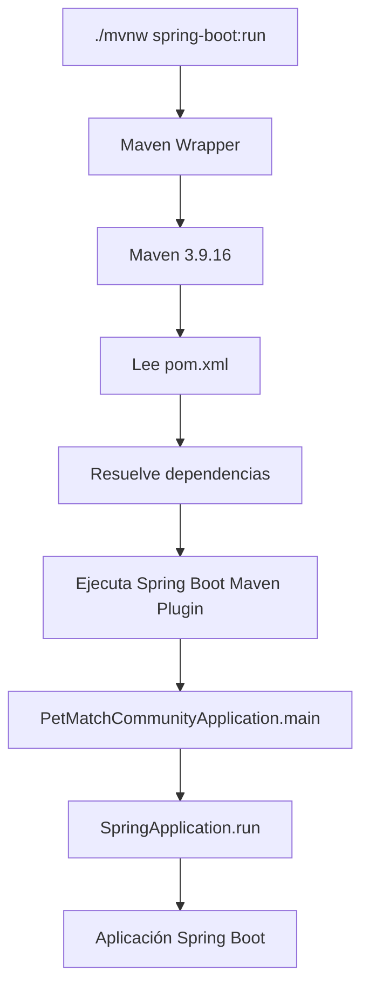

# 05 — Maven y dependencias

Ya sabemos cómo está organizado PetMatch y dónde se encuentra cada responsabilidad principal.

Ahora vamos a estudiar uno de los archivos más importantes del repositorio:

```text
pom.xml
```

Cuando un aprendiz empieza con Spring Boot puede ver Maven como una herramienta misteriosa que “descarga cosas”. Esa descripción es demasiado pobre.

La pregunta central de este capítulo es:

> **¿cómo sabe PetMatch qué librerías necesita, qué versión de Java utiliza, qué plugin debe ejecutar y cómo construir la aplicación de forma reproducible?**

La respuesta está en Maven, el `pom.xml` y el Maven Wrapper.

---

## ¿Qué problema estamos resolviendo?

Imagina construir PetMatch manualmente.

Necesitamos componentes para:

- Spring Boot;
- Spring MVC;
- JPA;
- Hibernate;
- seguridad;
- validación;
- Thymeleaf;
- integración de Thymeleaf con Spring Security;
- MySQL;
- pruebas web;
- pruebas de seguridad;
- pruebas de persistencia;
- empaquetado/ejecución de Spring Boot.

Sin una herramienta de construcción tendríamos que:

1. localizar cada archivo `.jar`;
2. descargar la versión correcta;
3. comprobar compatibilidad entre versiones;
4. configurar el classpath;
5. repetir el proceso en cada equipo;
6. recordar comandos de compilación y pruebas;
7. preparar el empaquetado final.

Eso sería frágil y difícil de reproducir.

Maven permite describir el proyecto de forma declarativa.

```text
"Este proyecto es PetMatch"
"usa Java 21"
"se basa en Spring Boot 4.1.1"
"necesita estas capacidades"
"usa estos plugins"
```

A partir de esa descripción Maven puede resolver dependencias y ejecutar el ciclo de construcción.

---

# 1. ¿Qué es Maven?

## Idea intuitiva

Maven es una herramienta que ayuda a **describir, construir y administrar dependencias de un proyecto Java**.

No escribe la aplicación por nosotros.

Se encarga de tareas como:

- resolver dependencias;
- compilar;
- ejecutar pruebas;
- empaquetar;
- ejecutar plugins;
- aplicar convenciones de estructura.

## Definición técnica

**Apache Maven** es una herramienta de automatización y gestión de proyectos Java basada en un modelo declarativo descrito principalmente mediante un archivo `pom.xml`.

POM significa:

```text
Project Object Model
```

---

# 2. El `pom.xml` real de PetMatch

Ruta:

```text
pom.xml
```

Su estructura general es:

```xml
<project>
    <modelVersion>...</modelVersion>

    <parent>...</parent>

    <groupId>...</groupId>
    <artifactId>...</artifactId>
    <version>...</version>

    <properties>...</properties>

    <dependencies>...</dependencies>

    <build>
        <plugins>...</plugins>
    </build>
</project>
```

No necesitas memorizar XML. Necesitas entender qué expresa cada bloque.

---

# 3. Coordenadas Maven: `groupId`, `artifactId`, `version`

PetMatch declara:

```xml
<groupId>com.petmatch</groupId>
<artifactId>petmatch-community</artifactId>
<version>0.0.1-SNAPSHOT</version>
```

Estas tres piezas identifican un artefacto Maven.

## `groupId`

```text
com.petmatch
```

Representa el grupo, organización o espacio lógico al que pertenece el proyecto.

## `artifactId`

```text
petmatch-community
```

Es el identificador concreto del artefacto/proyecto.

## `version`

```text
0.0.1-SNAPSHOT
```

Identifica la versión.

La palabra `SNAPSHOT` indica una versión en desarrollo, no una versión final inmutable publicada como release.

Podemos leer las coordenadas así:

```text
com.petmatch
    └── petmatch-community
            └── 0.0.1-SNAPSHOT
```

---

# 4. ¿Qué es un artefacto?

En Maven, un **artefacto** es una unidad identificable que puede ser construida, instalada o distribuida, normalmente asociada a coordenadas Maven.

Una dependencia también se identifica mediante coordenadas.

Ejemplo real:

```xml
<dependency>
    <groupId>com.mysql</groupId>
    <artifactId>mysql-connector-j</artifactId>
    <scope>runtime</scope>
</dependency>
```

Aquí Maven sabe qué componente buscar gracias a:

```text
groupId + artifactId + versión resuelta
```

En este caso la versión no aparece escrita directamente porque la gestión de versiones está siendo heredada del parent de Spring Boot.

---

# 5. El parent de Spring Boot

PetMatch declara:

```xml
<parent>
    <groupId>org.springframework.boot</groupId>
    <artifactId>spring-boot-starter-parent</artifactId>
    <version>4.1.1</version>
    <relativePath/>
</parent>
```

Esto significa que el proyecto hereda configuración y gestión de dependencias del parent de Spring Boot **4.1.1**.

Una consecuencia importante es que muchas dependencias no necesitan declarar manualmente su versión.

Por ejemplo:

```xml
<dependency>
    <groupId>org.springframework.boot</groupId>
    <artifactId>spring-boot-starter-security</artifactId>
</dependency>
```

No aparece:

```xml
<version>...</version>
```

Eso reduce el riesgo de combinar versiones incompatibles arbitrariamente.

> [!IMPORTANT]
> Que una dependencia no muestre `<version>` no significa que “no tenga versión”. Significa que Maven puede obtenerla desde la gestión de dependencias heredada.

---

# 6. La versión de Java

PetMatch declara:

```xml
<properties>
    <java.version>21</java.version>
</properties>
```

Esto expresa que el proyecto está configurado para Java 21 dentro del modelo de Spring Boot/Maven utilizado.

Además, el README principal pide JDK 21.

Por tanto, si un aprendiz intenta ejecutar PetMatch con un JDK incompatible, la causa del problema puede estar en el entorno y no en el código de negocio.

---

# 7. ¿Qué es una dependencia?

En Maven, una dependencia es una biblioteca o componente externo que el proyecto necesita para compilar, ejecutar o probar determinada funcionalidad.

Las dependencias se declaran dentro de:

```xml
<dependencies>
    ...
</dependencies>
```

PetMatch no descarga “Spring completo” como una única caja.

Declara capacidades concretas.

---

# 8. Los starters de Spring Boot

PetMatch utiliza varios starters.

Un starter representa una forma conveniente de incorporar un conjunto coherente de dependencias para una capacidad.

La idea mental es:

```text
necesito JPA
→ starter Data JPA

necesito seguridad
→ starter Security

necesito web MVC
→ starter Web MVC
```

Vamos a revisar cada dependencia real del proyecto.

---

# 9. `spring-boot-starter-data-jpa`

Código real:

```xml
<dependency>
    <groupId>org.springframework.boot</groupId>
    <artifactId>spring-boot-starter-data-jpa</artifactId>
</dependency>
```

## ¿Qué habilita?

Proporciona la base necesaria para trabajar con Spring Data JPA y un proveedor ORM compatible dentro de la aplicación Boot.

## ¿Dónde se usa en PetMatch?

En:

```text
model/
repository/
service/
```

Ejemplos reales:

```java
@Entity
public class Pet {
```

```java
public interface PetRepository extends JpaRepository<Pet, Long> {
```

```java
@Transactional
public Pet create(...) {
```

## ¿Qué ocurriría si se eliminara?

El proyecto perdería las clases y auto-configuración necesarias para su capa JPA actual. Las imports como `JpaRepository`, anotaciones JPA relacionadas y configuración de persistencia dejarían de tener el soporte esperado.

## ¿Por qué está en PetMatch?

Porque el proyecto persiste:

- usuarios;
- mascotas;
- solicitudes;
- postulaciones.

Más adelante estudiaremos JPA/Hibernate con profundidad.

---

# 10. `spring-boot-starter-security`

```xml
<dependency>
    <groupId>org.springframework.boot</groupId>
    <artifactId>spring-boot-starter-security</artifactId>
</dependency>
```

## ¿Qué habilita?

La infraestructura principal de Spring Security dentro de la aplicación Boot.

## ¿Dónde se usa?

Archivos reales:

```text
config/SecurityConfig.java
security/DatabaseUserDetailsService.java
service/UserService.java
controllers que reciben Authentication
```

Ejemplos:

```java
SecurityFilterChain
PasswordEncoder
Authentication
UserDetailsService
```

## ¿Por qué PetMatch la necesita?

Porque la aplicación implementa:

- login;
- logout;
- autenticación por email/password;
- sesión web;
- autorización;
- roles;
- ownership;
- HTTP Basic para API.

## Si la elimináramos

Toda la integración con Spring Security dejaría de compilar/funcionar según la implementación actual.

---

# 11. `spring-boot-starter-thymeleaf`

```xml
<dependency>
    <groupId>org.springframework.boot</groupId>
    <artifactId>spring-boot-starter-thymeleaf</artifactId>
</dependency>
```

## ¿Qué habilita?

Integración de Thymeleaf con Spring Boot para renderizar vistas HTML del lado del servidor.

## ¿Dónde aparece?

En:

```text
src/main/resources/templates/
```

Y en Controllers que retornan nombres de vista:

```java
return "pets/list";
```

## ¿Por qué se eligió?

PetMatch tiene una interfaz web server-side rendered sin frontend SPA separado.

---

# 12. `spring-boot-starter-validation`

```xml
<dependency>
    <groupId>org.springframework.boot</groupId>
    <artifactId>spring-boot-starter-validation</artifactId>
</dependency>
```

## ¿Qué habilita?

Integración con Bean Validation/Jakarta Validation.

## ¿Dónde aparece?

Ejemplos reales:

```java
@NotBlank
@Size
@NotNull
@Min
@Email
@Future
```

Y en Controllers:

```java
@Valid PetForm petForm
```

O en REST:

```java
@Valid @RequestBody PetApiRequest request
```

## ¿Por qué es importante?

Permite separar validaciones estructurales de entrada de reglas de negocio más profundas.

---

# 13. `spring-boot-starter-webmvc`

```xml
<dependency>
    <groupId>org.springframework.boot</groupId>
    <artifactId>spring-boot-starter-webmvc</artifactId>
</dependency>
```

## ¿Qué habilita?

Las capacidades necesarias para una aplicación basada en Spring MVC.

## ¿Dónde aparece?

En anotaciones y tipos como:

```java
@Controller
@RestController
@GetMapping
@PostMapping
@RequestMapping
Model
ResponseEntity
```

Y en las rutas web/REST de PetMatch.

## ¿Por qué es central?

Porque las dos interfaces de PetMatch —MVC y REST— dependen de infraestructura HTTP basada en Spring MVC.

---

# 14. `thymeleaf-extras-springsecurity6`

```xml
<dependency>
    <groupId>org.thymeleaf.extras</groupId>
    <artifactId>thymeleaf-extras-springsecurity6</artifactId>
</dependency>
```

Esta dependencia no es un starter de Spring Boot.

## ¿Qué problema resuelve?

Permite integrar información de Spring Security dentro de templates Thymeleaf.

## ¿Dónde se usa realmente?

En:

```text
src/main/resources/templates/fragments/navigation.html
```

Allí aparece:

```html
xmlns:sec="https://www.thymeleaf.org/extras/spring-security"
```

Y expresiones como:

```html
sec:authorize="isAuthenticated()"
```

```html
sec:authentication="name"
```

## ¿Por qué no basta con Thymeleaf solo?

Thymeleaf renderiza templates, pero esta dependencia agrega utilidades específicas para integrar el estado de Spring Security en la vista.

---

# 15. `spring-boot-devtools`

```xml
<dependency>
    <groupId>org.springframework.boot</groupId>
    <artifactId>spring-boot-devtools</artifactId>
    <scope>runtime</scope>
    <optional>true</optional>
</dependency>
```

Esta dependencia está orientada al desarrollo.

## Detalles importantes

Tiene:

```xml
<scope>runtime</scope>
```

Y:

```xml
<optional>true</optional>
```

Eso ya nos introduce dos conceptos Maven.

### `runtime`

Significa que la dependencia es necesaria durante la ejecución, pero no se trata como una dependencia que el código de producción necesite directamente para compilar sus imports habituales.

### `optional`

Indica que se considera opcional para consumidores transitivos del proyecto.

## ¿Por qué está en PetMatch?

Para mejorar la experiencia de desarrollo sin convertir DevTools en una dependencia funcional del dominio.

> [!NOTE]
> DevTools no es una parte necesaria de las reglas de negocio de PetMatch.

---

# 16. `mysql-connector-j`

```xml
<dependency>
    <groupId>com.mysql</groupId>
    <artifactId>mysql-connector-j</artifactId>
    <scope>runtime</scope>
</dependency>
```

## ¿Qué habilita?

El driver JDBC necesario para que Java/Spring pueda comunicarse con MySQL según la configuración del datasource.

## ¿Dónde se conecta con PetMatch?

En:

```text
src/main/resources/application.yaml
```

PetMatch espera:

```yaml
spring:
  datasource:
    url: ${DB_URL}
    username: ${DB_USERNAME}
    password: ${DB_PASSWORD}
```

## ¿Por qué scope `runtime`?

La aplicación necesita el driver cuando se conecta realmente a MySQL durante la ejecución. El código del dominio no importa clases del driver MySQL para escribir sus reglas.

---

# 17. Dependencias de prueba

PetMatch declara varias dependencias con:

```xml
<scope>test</scope>
```

Eso significa que están orientadas al código y ejecución de pruebas, no al runtime normal de producción.

Veamos las reales.

---

## `spring-boot-starter-data-jpa-test`

```xml
<dependency>
    <groupId>org.springframework.boot</groupId>
    <artifactId>spring-boot-starter-data-jpa-test</artifactId>
    <scope>test</scope>
</dependency>
```

Apoya pruebas relacionadas con la capa de datos/JPA.

PetMatch tiene pruebas de integración que usan repositories y transacciones reales dentro del contexto de Spring.

---

## `spring-boot-starter-security-test`

```xml
<dependency>
    <groupId>org.springframework.boot</groupId>
    <artifactId>spring-boot-starter-security-test</artifactId>
    <scope>test</scope>
</dependency>
```

Aporta utilidades de prueba para Spring Security.

Uso real visible en:

```text
src/test/java/com/petmatch/community/integration/RestApiIntegrationTests.java
```

Con:

```java
httpBasic(email, password)
```

---

## `spring-boot-starter-thymeleaf-test`

```xml
<dependency>
    <groupId>org.springframework.boot</groupId>
    <artifactId>spring-boot-starter-thymeleaf-test</artifactId>
    <scope>test</scope>
</dependency>
```

Forma parte del soporte de pruebas relacionado con la capa Thymeleaf en el stack utilizado.

> [!IMPORTANT]
> Que una dependencia de test exista no significa que PetMatch tenga necesariamente un test dedicado para cada capacidad de esa dependencia. Documentamos lo que la dependencia aporta y distinguimos eso de los tests concretos presentes.

---

## `spring-boot-starter-validation-test`

```xml
<dependency>
    <groupId>org.springframework.boot</groupId>
    <artifactId>spring-boot-starter-validation-test</artifactId>
    <scope>test</scope>
</dependency>
```

Apoya pruebas relacionadas con validación dentro del stack de Spring Boot utilizado.

PetMatch verifica validación HTTP de forma visible en `RestApiIntegrationTests` cuando envía una mascota inválida y espera `400 Bad Request` con errores.

---

## `spring-boot-starter-webmvc-test`

```xml
<dependency>
    <groupId>org.springframework.boot</groupId>
    <artifactId>spring-boot-starter-webmvc-test</artifactId>
    <scope>test</scope>
</dependency>
```

Aporta infraestructura de pruebas MVC.

PetMatch utiliza realmente:

```java
MockMvc
```

Y:

```java
@AutoConfigureMockMvc
```

En:

```text
RestApiIntegrationTests.java
```

---

# 18. ¿Qué es un `scope`?

El `scope` indica en qué contexto participa una dependencia.

En el `pom.xml` de PetMatch observamos tres situaciones.

## Sin scope explícito

Ejemplo:

```xml
<artifactId>spring-boot-starter-security</artifactId>
```

Esto usa el scope por defecto de Maven, normalmente `compile`.

La dependencia está disponible para compilación y también participa en runtime según las reglas de Maven.

## `runtime`

Ejemplos:

```text
spring-boot-devtools
mysql-connector-j
```

Se necesitan principalmente al ejecutar.

## `test`

Ejemplos:

```text
spring-boot-starter-security-test
spring-boot-starter-webmvc-test
```

Se utilizan en el código/ejecución de pruebas.

Un mapa simplificado:

| Scope utilizado | Uso mental |
|---|---|
| compile/default | código principal y ejecución |
| runtime | necesario al ejecutar |
| test | solo durante pruebas |

---

# 19. Dependencias directas vs transitivas

Cuando PetMatch declara:

```xml
<artifactId>spring-boot-starter-data-jpa</artifactId>
```

no significa que esa sea la única biblioteca utilizada.

Un starter puede depender de otras bibliotecas, y esas dependencias pueden a su vez depender de más componentes.

Esas se llaman **dependencias transitivas**.

La idea es:

```text
PetMatch
↓ declara
starter-data-jpa
↓ depende de
otras bibliotecas JPA/Spring/Hibernate...
```

Maven resuelve ese grafo.

Eso explica por qué el `pom.xml` puede ser relativamente corto aunque la aplicación use muchas clases externas.

> [!WARNING]
> No confundas “no está escrito directamente en el POM” con “no está presente en el classpath”. Puede llegar transitivamente.

---

# 20. ¿Por qué no debemos poner versiones al azar?

Un principiante puede intentar resolver un error agregando versiones manuales a cada dependencia.

Por ejemplo:

```xml
<version>alguna-version</version>
```

Eso puede romper la compatibilidad administrada por Spring Boot.

PetMatch utiliza:

```text
spring-boot-starter-parent 4.1.1
```

como fuente central de gestión de versiones para muchas dependencias.

Una práctica razonable es no sobreescribir versiones administradas sin una razón técnica concreta y verificada.

---

# 21. ¿Qué es un plugin de Maven?

Una dependencia es código que la aplicación utiliza.

Un **plugin** de Maven participa en el proceso de construcción.

PetMatch declara:

```xml
<build>
    <plugins>
        <plugin>
            <groupId>org.springframework.boot</groupId>
            <artifactId>spring-boot-maven-plugin</artifactId>
        </plugin>
    </plugins>
</build>
```

El `spring-boot-maven-plugin` integra tareas de Spring Boot con Maven.

Por ejemplo, el proyecto puede ejecutarse con:

```bash
./mvnw spring-boot:run
```

El concepto importante es:

```text
dependency
→ biblioteca/capacidad que usa el proyecto

plugin
→ herramienta que participa en el build
```

---

# 22. Maven Wrapper

PetMatch no exige una instalación global de Maven.

Incluye:

```text
mvnw
mvnw.cmd
.mvn/wrapper/maven-wrapper.properties
```

La configuración real apunta a:

```text
Apache Maven 3.9.16
```

con Wrapper:

```text
wrapperVersion=3.3.4
```

## ¿Qué problema resuelve?

Sin Wrapper podrías tener:

```text
Instructor: Maven X
Aprendiz A: Maven Y
Aprendiz B: Maven Z
```

Con Wrapper, el repositorio define una forma más reproducible de ejecutar Maven.

## Comandos

Linux/macOS/WSL:

```bash
./mvnw spring-boot:run
./mvnw clean test
```

Windows PowerShell/CMD:

```powershell
.\mvnw.cmd spring-boot:run
.\mvnw.cmd clean test
```

---

# 23. ¿Qué significa `clean test`?

Cuando ejecutamos:

```bash
./mvnw clean test
```

estamos invocando fases del ciclo de vida Maven.

## `clean`

Elimina resultados generados por builds anteriores, normalmente bajo `target/`.

## `test`

Compila lo necesario y ejecuta las pruebas correspondientes a esa fase.

No significa “solo ejecutar un archivo de test”. Maven usa convenciones y plugins asociados a su ciclo de vida.

---

# 24. La carpeta `target/`

Aunque no forma parte del código fuente versionado, Maven genera resultados de construcción normalmente en:

```text
target/
```

El `.gitignore` real de PetMatch incluye:

```text
target/
```

Eso evita subir artefactos generados al repositorio.

La idea es:

```text
src/
→ fuente

target/
→ resultado generado
```

> [!IMPORTANT]
> El código fuente debe poder reconstruir los artefactos generados. No deberíamos depender de archivos de `target/` guardados manualmente en Git.

---

# 25. ¿De dónde descarga Maven las dependencias?

Maven utiliza repositorios de artefactos.

El Wrapper real de PetMatch apunta a Maven Central para descargar la distribución Maven:

```text
https://repo.maven.apache.org/maven2/...
```

Y Maven normalmente resuelve dependencias desde repositorios configurados, incluyendo Maven Central según la configuración habitual.

No necesitas descargar manualmente cada `.jar` desde una página web.

---

# 26. ¿Qué sucede cuando ejecutamos PetMatch?

Podemos conectar lo aprendido hasta ahora:



Este diagrama conecta Maven con el capítulo anterior.

Maven no reemplaza `main()`.

Maven prepara y ejecuta el proyecto de acuerdo con su modelo de construcción.

---

# 27. ¿Qué pasaría si una dependencia falta?

Ejemplo conceptual: si el proyecto usa:

```java
@RestController
```

pero la capacidad web MVC requerida no está disponible en el classpath, el proyecto no tendría las clases/configuración necesarias para ese código.

Otro ejemplo:

Si quitamos el conector MySQL pero seguimos intentando conectar el datasource a MySQL, la aplicación no tendría el driver necesario en runtime.

Una estrategia útil de diagnóstico es:

```text
error de clase/import/configuración
        ↓
¿la dependencia correcta está declarada?
        ↓
¿scope correcto?
        ↓
¿versión gestionada correctamente?
```

---

# 28. ¿Agregar una dependencia implementa una funcionalidad?

No.

Esto es fundamental.

Agregar:

```xml
<artifactId>spring-boot-starter-security</artifactId>
```

no implementa automáticamente:

- registro de usuarios;
- ownership;
- reglas del dominio;
- roles concretos;
- login personalizado.

La dependencia ofrece infraestructura.

Nuestro código debe usarla/configurarla.

De la misma forma, agregar una dependencia de almacenamiento no significaría que F11 estuviera implementada.

> [!WARNING]
> “Existe la dependencia” y “existe la funcionalidad completa” son afirmaciones distintas.

---

# 29. ¿Por qué no hay Lombok?

El `pom.xml` real no declara Lombok.

Por eso las entidades y DTO de clase tradicional tienen getters/setters/constructores escritos explícitamente.

Esto es una decisión útil pedagógicamente porque permite ver Java sin generación adicional de código mediante Lombok.

No significa que Lombok sea “incorrecto”; significa que **PetMatch no lo utiliza**.

---

# 30. ¿Por qué no hay Flyway o Liquibase?

El POM tampoco declara:

```text
Flyway
Liquibase
```

Por tanto, no debemos afirmar que el proyecto utiliza migraciones controladas con esas herramientas.

El README las menciona únicamente como posibles alternativas futuras al uso de:

```yaml
spring.jpa.hibernate.ddl-auto: update
```

Esa distinción entre tecnología presente y tecnología propuesta debe mantenerse en todo el libro.

---

# 31. ¿Por qué no hay Testcontainers?

Tampoco aparece una dependencia de Testcontainers.

Las pruebas de integración existen, pero eso no permite concluir que usen contenedores de base de datos.

Regla documental:

```text
prueba de integración presente
≠
Testcontainers presente
```

---

# 32. Cómo leer una dependencia desconocida

Cuando encuentres una dependencia nueva en un proyecto, evita memorizar su nombre aislado.

Haz estas preguntas:

1. ¿cuál es su `groupId`?
2. ¿cuál es su `artifactId`?
3. ¿tiene versión explícita o administrada?
4. ¿qué scope tiene?
5. ¿qué problema resuelve?
6. ¿qué imports/anotaciones/clases del proyecto dependen de ella?
7. ¿es necesaria en runtime, compile o test?
8. ¿qué dejaría de funcionar si se elimina?

Ese método convierte el POM en documentación de arquitectura.

---

# 33. Tabla completa de dependencias de PetMatch

| Dependencia | Scope | Uso principal en el proyecto |
|---|---|---|
| `spring-boot-starter-data-jpa` | default | JPA, repositories, persistencia |
| `spring-boot-starter-security` | default | autenticación/autorización |
| `spring-boot-starter-thymeleaf` | default | vistas HTML server-side |
| `spring-boot-starter-validation` | default | Bean Validation |
| `spring-boot-starter-webmvc` | default | Controllers MVC/REST, HTTP |
| `thymeleaf-extras-springsecurity6` | default | expresiones Security en templates |
| `spring-boot-devtools` | runtime, optional | experiencia de desarrollo |
| `mysql-connector-j` | runtime | driver MySQL |
| `spring-boot-starter-data-jpa-test` | test | soporte de tests de datos/JPA |
| `spring-boot-starter-security-test` | test | soporte de tests Security |
| `spring-boot-starter-thymeleaf-test` | test | soporte de tests Thymeleaf |
| `spring-boot-starter-validation-test` | test | soporte de tests Validation |
| `spring-boot-starter-webmvc-test` | test | MockMvc y testing MVC |

Esta tabla describe lo que existe actualmente en el `pom.xml`.

---

# 34. ⚠️ Errores frecuentes

## “Maven es Spring”

No. Maven es una herramienta de construcción/gestión de proyectos. Spring Boot es el framework/plataforma de aplicación utilizada.

## “Una dependencia sin `<version>` no tiene versión”

Falso. Puede estar administrada por el parent/BOM.

## “Debo instalar Maven globalmente”

No para PetMatch. El repositorio incluye Maven Wrapper.

## “Todos deben tener cualquier versión de Maven”

El Wrapper existe precisamente para mejorar reproducibilidad.

## “Agregar una dependencia implementa la funcionalidad”

No. Solo incorpora capacidad técnica disponible para ser utilizada.

## “Todas las dependencias deben tener scope `compile`”

No. PetMatch usa `runtime` y `test` donde corresponde.

## “Plugin y dependency son lo mismo”

No. Los plugins participan en el build; las dependencias forman parte del classpath según su scope.

## “Si no veo Hibernate en una línea directa del POM, entonces no se usa”

Incorrecto. Puede llegar como dependencia transitiva mediante el starter JPA.

---

# 35. 🛠 Prueba en el código

Abre:

```text
pom.xml
```

Haz una tabla manual con estas columnas:

```text
artifactId | scope | ¿para qué lo usa PetMatch?
```

Completa las trece dependencias.

Después abre:

```text
.mvn/wrapper/maven-wrapper.properties
```

Identifica:

1. versión del Wrapper;
2. versión de Maven solicitada;
3. URL de distribución.

Finalmente abre:

```text
.gitignore
```

Comprueba que `target/` está ignorado.

---

# 36. 🧪 Comprueba que entendiste

1. ¿qué significa POM?
2. ¿qué identifican `groupId`, `artifactId` y `version`?
3. ¿qué versión de Spring Boot usa PetMatch?
4. ¿qué versión de Java declara?
5. ¿por qué muchas dependencias no escriben `<version>`?
6. ¿qué es un starter?
7. ¿qué diferencia hay entre dependency y plugin?
8. ¿qué scope tiene MySQL Connector?
9. ¿qué scope tienen las dependencias de pruebas?
10. ¿qué problema resuelve Maven Wrapper?
11. ¿qué versión de Maven descarga el Wrapper actual?
12. ¿agregar una dependencia significa que una feature ya está implementada?
13. ¿PetMatch usa Lombok?
14. ¿PetMatch usa Flyway/Liquibase actualmente?
15. ¿PetMatch usa Testcontainers según el POM actual?

### Respuestas esperadas

1. Project Object Model.
2. Las coordenadas de un artefacto Maven.
3. Spring Boot 4.1.1.
4. Java 21.
5. Porque el parent de Spring Boot administra muchas versiones.
6. Una dependencia que agrupa capacidades/dependencias coherentes para un propósito.
7. La dependencia aporta código al proyecto; el plugin participa en el proceso de build.
8. `runtime`.
9. `test`.
10. Permitir una ejecución Maven más reproducible sin requerir instalación global manual compatible.
11. Maven 3.9.16.
12. No.
13. No aparece en el POM actual.
14. No.
15. No.

---

# 37. ✅ Qué debes recordar

1. **Maven describe y construye el proyecto; no es Spring.**
2. **`pom.xml` es el Project Object Model.**
3. **PetMatch usa Spring Boot 4.1.1 y Java 21.**
4. **`groupId`, `artifactId` y `version` identifican artefactos.**
5. **El parent de Spring Boot administra versiones compatibles de muchas dependencias.**
6. **Los starters incorporan capacidades coherentes sin listar manualmente cada dependencia transitiva.**
7. **`scope` determina en qué contexto participa una dependencia.**
8. **PetMatch usa scopes default, `runtime` y `test`.**
9. **El Maven Wrapper del proyecto apunta a Maven 3.9.16.**
10. **`spring-boot-maven-plugin` es un plugin de build, no una dependencia de negocio.**
11. **`target/` es contenido generado y está ignorado por Git.**
12. **Una dependencia disponible no equivale a una funcionalidad implementada.**
13. **El POM real no incluye Lombok, Flyway, Liquibase ni Testcontainers.**
14. **Leer el POM es una forma de entender la arquitectura técnica del proyecto.**

---

# 🔗 Continúa con

Ya sabemos:

```text
qué arranca PetMatch
+
cómo está organizado
+
qué dependencias permiten construirlo
```

El siguiente paso es estudiar cómo la aplicación obtiene valores como:

```text
DB_URL
DB_USERNAME
DB_PASSWORD
server.port
open-in-view
```

Continúa con:

**[Capítulo 06 — Configuración y `application.yaml` →](06-configuracion-y-application-yaml.md)**

---

[← Capítulo 04 — Estructura del proyecto](04-estructura-del-proyecto.md) · [Índice del bloque](README.md) · [Índice general](../README.md) · [Siguiente → Capítulo 06](06-configuracion-y-application-yaml.md)
