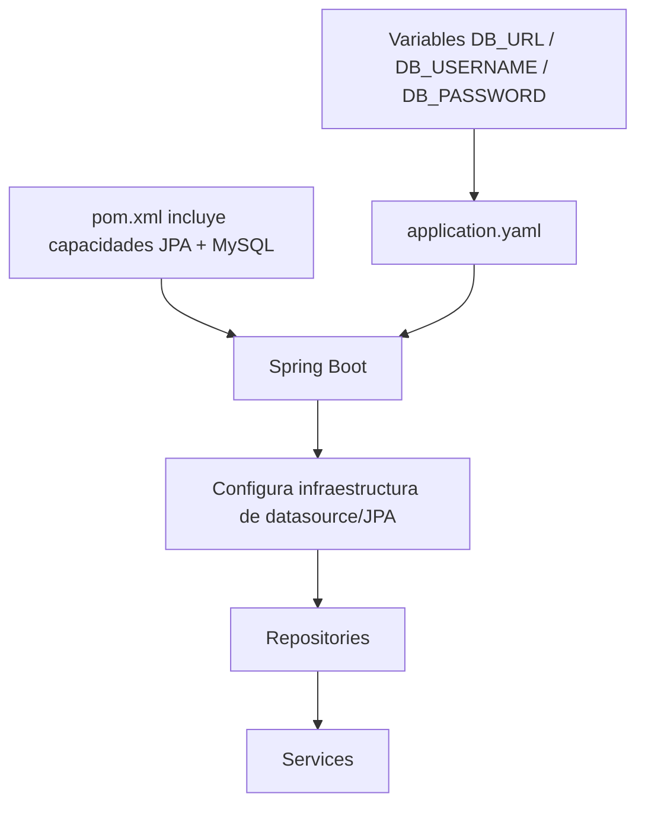
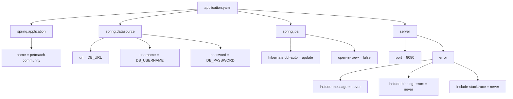

# 06 — Configuración y `application.yaml`

En los capítulos anteriores vimos que Spring Boot puede arrancar una aplicación completa y que Maven declara las capacidades disponibles en el proyecto.

Ahora aparece otra pregunta inevitable:

> **¿Dónde guardamos los valores que cambian entre entornos o que pertenecen a la infraestructura y no a la lógica de negocio?**

PetMatch necesita saber, entre otras cosas:

- cómo se llama la aplicación;
- a qué base de datos conectarse;
- qué usuario de base de datos utilizar;
- qué contraseña utilizar;
- cómo debe comportarse Hibernate frente al esquema;
- si JPA puede mantener abierta la sesión durante la vista;
- en qué puerto HTTP escuchar;
- qué información debe ocultar al producir errores.

Sería una mala idea repartir esas decisiones entre Controllers y Services.

Spring Boot ofrece un sistema de **configuración externa** y PetMatch lo utiliza mediante:

```text
src/main/resources/application.yaml
```

Este capítulo explica ese archivo completo, línea por línea, sin asumir configuraciones que no existen en el repositorio.

---

# 1. El problema: código y configuración no son lo mismo

Imagina que `PetService` contuviera algo así:

> [!NOTE]
> El siguiente fragmento es un ejemplo incorrecto y **no pertenece a PetMatch**.

```java
String databaseUrl = "jdbc:mysql://localhost:3306/petmatch";
String databaseUser = "root";
String databasePassword = "123456";
```

Aparecerían varios problemas.

## Problema 1 — El Service conocería infraestructura que no le corresponde

`PetService` debería concentrarse en operaciones sobre mascotas, no en construir conexiones MySQL.

## Problema 2 — Cambiar de entorno obligaría a modificar código

La base de datos local de un aprendiz puede tener credenciales distintas a las de otro equipo o servidor.

## Problema 3 — Podríamos publicar secretos en Git

Una contraseña real escrita directamente en un archivo versionado puede terminar en el historial del repositorio.

## Problema 4 — La misma aplicación necesita valores diferentes

El código Java puede ser el mismo aunque cambien:

```text
máquina local
servidor de pruebas
servidor de producción
```

La solución conceptual es separar:

```text
Código de aplicación
        ≠
Configuración de entorno
```

---

# 2. ¿Qué significa configuración externa?

**Externalized Configuration** es la capacidad de mantener valores de configuración fuera de las clases que implementan la lógica funcional y permitir que Spring Boot los obtenga desde diferentes fuentes.

En PetMatch vemos una combinación muy sencilla:

```text
application.yaml
        +
variables de entorno
```

El archivo define **qué propiedades necesita la aplicación** y algunas propiedades contienen referencias a variables externas.

Por ejemplo:

```yaml
spring:
  datasource:
    url: ${DB_URL}
```

No dice cuál es la URL concreta.

Dice:

> para `spring.datasource.url`, utiliza el valor de `DB_URL`.

---

# 3. 🔎 El archivo real de PetMatch

Ruta:

```text
src/main/resources/application.yaml
```

Contenido real:

```yaml
spring:
  application:
    name: petmatch-community

  datasource:
    url: ${DB_URL}
    username: ${DB_USERNAME}
    password: ${DB_PASSWORD}

  jpa:
    hibernate:
      ddl-auto: update
    open-in-view: false

server:
  port: 8080
  error:
    include-message: never
    include-binding-errors: never
    include-stacktrace: never
```

Este archivo es pequeño.

Eso es útil para aprender porque podemos comprenderlo completo sin ocultar partes importantes.

---

# 4. ¿Por qué está en `src/main/resources`?

En una estructura Maven estándar, los recursos de ejecución viven en:

```text
src/main/resources/
```

Allí PetMatch también contiene:

```text
templates/
```

Spring Boot busca de forma convencional archivos de configuración con nombres conocidos como `application.properties` o `application.yaml` en ubicaciones de configuración soportadas.

PetMatch eligió YAML:

```text
application.yaml
```

No existe en el árbol actual un `application.properties` alternativo que debamos estudiar.

---

# 5. ¿Qué es YAML?

YAML es un formato de datos legible por humanos basado principalmente en pares clave–valor y estructuras definidas por indentación.

Ejemplo:

```yaml
server:
  port: 8080
```

Podemos leerlo conceptualmente como:

```text
server.port = 8080
```

Y:

```yaml
spring:
  datasource:
    username: ${DB_USERNAME}
```

como:

```text
spring.datasource.username = ${DB_USERNAME}
```

La indentación es significativa.

> [!WARNING]
> En YAML, mover una propiedad al nivel incorrecto puede cambiar completamente su significado. No uses tabulaciones para “alinear visualmente”; conserva una indentación consistente con espacios.

---

# 6. Primera sección: nombre de la aplicación

Código real:

```yaml
spring:
  application:
    name: petmatch-community
```

La propiedad equivalente es:

```text
spring.application.name
```

Valor:

```text
petmatch-community
```

Esta propiedad identifica el nombre lógico de la aplicación dentro del entorno Spring.

No debemos confundirla con:

- el nombre del repositorio GitHub;
- el `artifactId` de Maven;
- el nombre de una clase Java.

En PetMatch los nombres son parecidos por coherencia, pero representan conceptos distintos.

En `pom.xml` existe:

```xml
<artifactId>petmatch-community</artifactId>
<name>PetMatch Community</name>
```

Y en `application.yaml`:

```yaml
name: petmatch-community
```

La similitud es una decisión de nomenclatura, no una obligación de que sean la misma propiedad.

---

# 7. Segunda sección: datasource

Código real:

```yaml
spring:
  datasource:
    url: ${DB_URL}
    username: ${DB_USERNAME}
    password: ${DB_PASSWORD}
```

Estas propiedades configuran el acceso de la aplicación a la fuente de datos.

## `spring.datasource.url`

Indica la URL JDBC utilizada para conectarse con la base de datos.

PetMatch no fija la URL en el repositorio.

La obtiene de:

```text
DB_URL
```

## `spring.datasource.username`

Obtiene el usuario de base de datos desde:

```text
DB_USERNAME
```

## `spring.datasource.password`

Obtiene la contraseña desde:

```text
DB_PASSWORD
```

---

# 8. ¿Qué significa `${...}`?

La expresión:

```yaml
url: ${DB_URL}
```

utiliza un **placeholder de propiedad**.

Podemos leerlo así:

```text
${DB_URL}
   ↓
busca un valor con ese nombre en las fuentes de configuración disponibles
   ↓
úsalo como valor de spring.datasource.url
```

En el uso documentado por PetMatch, esos valores se suministran mediante variables de entorno.

Ejemplo conceptual de valores:

```text
DB_URL=jdbc:mysql://localhost:3306/petmatch
DB_USERNAME=usuario_local
DB_PASSWORD=una_clave_local
```

> [!IMPORTANT]
> Esos valores son ejemplos. El repositorio no contiene una contraseña oficial que debas copiar.

---

# 9. ¿Por qué no escribir la contraseña en Git?

La contraseña es una credencial.

El repositorio contiene además en `.gitignore` una entrada para:

```text
.env
```

Eso refuerza la intención de no versionar archivos locales de secretos.

La separación correcta es:

```text
Git
├── código
├── pom.xml
└── application.yaml con placeholders

Entorno local/servidor
├── DB_URL
├── DB_USERNAME
└── DB_PASSWORD
```

> [!WARNING]
> Agregar una contraseña a Git y borrarla en el siguiente commit no garantiza que haya desaparecido: puede permanecer en el historial. La prevención es mucho mejor que intentar limpiar secretos después.

---

# 10. ¿Qué ocurre si falta una variable obligatoria?

En PetMatch los placeholders están escritos sin valor por defecto:

```yaml
${DB_URL}
${DB_USERNAME}
${DB_PASSWORD}
```

Eso expresa que el entorno debe proporcionar los valores necesarios para configurar correctamente el datasource.

Si la aplicación no puede resolver/configurar correctamente la conexión requerida, el arranque puede fallar al construir la infraestructura de persistencia.

Esto conecta con una idea del capítulo 03:

> muchos errores de Spring Boot aparecen durante el arranque porque el contexto intenta preparar sus componentes e infraestructura antes de recibir peticiones.

---

# 11. Base de datos utilizada en las pruebas

En algunos tutoriales de Spring se utiliza H2 como base de datos en memoria.

También existen herramientas como Testcontainers.

En PetMatch conviene diferenciar:

```text
algo común en otros proyectos
```

de:

```text
algo implementado aquí
```

En el árbol actual de PetMatch no hay una configuración de test específica que declare H2 ni Testcontainers.

El proyecto no configura H2 ni un contenedor MySQL automático para las pruebas.

Cuando estudiemos pruebas de integración volveremos a esta consecuencia.

---

# 12. Tercera sección: JPA

Código real:

```yaml
spring:
  jpa:
    hibernate:
      ddl-auto: update
    open-in-view: false
```

Aquí aparecen dos decisiones importantes.

Todavía no dominamos JPA ni Hibernate; esos conceptos tendrán capítulos completos en el bloque de dominio y persistencia.

En este capítulo solo necesitamos comprender **qué se está configurando** y por qué la propiedad vive fuera de un Service.

---

# 13. `spring.jpa.hibernate.ddl-auto: update`

Código real:

```yaml
hibernate:
  ddl-auto: update
```

La propiedad controla cómo Hibernate trata el esquema de base de datos al arrancar con respecto al modelo mapeado.

PetMatch utiliza:

```text
update
```

En términos pedagógicos, esta opción permite que Hibernate intente ajustar el esquema a partir del modelo durante el desarrollo.

Eso resulta cómodo para una aplicación demostrativa porque reduce trabajo manual mientras el modelo cambia.

Pero comodidad y estrategia de producción no son lo mismo.

> [!WARNING]
> `ddl-auto: update` no debe confundirse con una estrategia completa de migraciones de base de datos. El repositorio actual no instala Flyway ni Liquibase. Si esas herramientas se mencionan, será como una posible evolución y no como parte de la implementación actual.

Más adelante estudiaremos qué significa que clases como `Pet` sean entidades JPA y cómo Hibernate relaciona esas clases con tablas.

---

# 14. ¿Qué significa DDL?

DDL significa **Data Definition Language**.

Se refiere a instrucciones SQL relacionadas con la definición de estructuras, por ejemplo:

```sql
CREATE TABLE ...
ALTER TABLE ...
DROP TABLE ...
```

No es lo mismo que manipular filas con:

```sql
INSERT
UPDATE
DELETE
```

Por eso una propiedad llamada `ddl-auto` está relacionada con la estructura del esquema y no directamente con cada operación de negocio.

---

# 15. `spring.jpa.open-in-view: false`

Código real:

```yaml
open-in-view: false
```

Esta propiedad desactiva el patrón conocido como **Open Session/EntityManager in View** para JPA.

Todavía no vamos a explicar completamente lazy loading, sesión de persistencia o `EntityGraph`; hacerlo ahora obligaría a introducir demasiados conceptos sin haber estudiado entidades.

Lo importante en este punto es reconocer una decisión arquitectónica:

```text
la capa de vista no debe depender de mantener abierta automáticamente
la sesión de persistencia para cargar relaciones tarde
```

Esa elección tendrá consecuencias que PetMatch resuelve mediante consultas y `@EntityGraph` en determinados repositories.

Habrá un capítulo dedicado a:

```text
LAZY
open-in-view=false
EntityGraph
```

en el bloque de dominio y persistencia.

> [!IMPORTANT]
> No memorices todavía “`open-in-view=false` es bueno” como regla universal. Primero necesitaremos entender el problema técnico que está resolviendo.

---

# 16. Cuarta sección: puerto del servidor

Código real:

```yaml
server:
  port: 8080
```

Esta propiedad configura el puerto HTTP donde escucha la aplicación.

Por eso el README del proyecto indica una URL como:

```text
http://localhost:8080
```

Podemos descomponerla:

```text
http://localhost:8080
│      │         │
│      │         └── puerto
│      └──────────── host local
└─────────────────── protocolo
```

Un puerto permite diferenciar servicios que se ejecutan en la misma máquina.

Por ejemplo, dos aplicaciones no pueden normalmente escuchar simultáneamente en la misma combinación de dirección y puerto.

---

# 17. ¿Qué pasa si el puerto 8080 ya está ocupado?

Un error típico al aprender Spring Boot es intentar arrancar la aplicación y encontrar un mensaje indicando que el puerto ya está en uso.

Eso no implica necesariamente un error en `PetController` o `PetService`.

Puede significar simplemente que otro proceso ya escucha en:

```text
8080
```

La lección es importante:

```text
error de arranque
≠
siempre error de lógica Java
```

Debes leer el mensaje y distinguir:

- problema de código;
- problema de configuración;
- problema de infraestructura;
- recurso externo no disponible.

---

# 18. Quinta sección: configuración de errores del servidor

Código real:

```yaml
server:
  error:
    include-message: never
    include-binding-errors: never
    include-stacktrace: never
```

PetMatch decide no incluir automáticamente determinada información interna en las respuestas de error generadas por la infraestructura del servidor.

## `include-message: never`

Evita incluir automáticamente el mensaje de excepción en la respuesta de error estándar.

## `include-binding-errors: never`

Evita incluir automáticamente detalles de errores de binding en esa respuesta estándar.

## `include-stacktrace: never`

Evita exponer automáticamente el stack trace.

---

# 19. ¿Por qué ocultar información de error?

Durante desarrollo, un stack trace es muy útil para el programador.

Pero enviarlo al cliente como parte de una respuesta HTTP puede revelar detalles internos innecesarios:

```text
nombres de clases
métodos
estructura interna
mensajes técnicos
rutas de ejecución
```

La idea es separar:

```text
información útil para diagnosticar en servidor
```

de:

```text
información apropiada para devolver al cliente
```

Más adelante veremos que la API de PetMatch tiene su propio:

```text
ApiExceptionHandler
```

que construye errores REST mediante `ProblemDetail`.

Eso permite controlar conscientemente la información que se expone.

---

# 20. Configuración no es lo mismo que manejo de errores

Es importante no mezclar responsabilidades.

Estas propiedades:

```yaml
server:
  error:
    ...
```

configuran comportamiento general del servidor.

Mientras que:

```text
src/main/java/com/petmatch/community/controller/api/ApiExceptionHandler.java
```

contiene lógica explícita para convertir determinadas excepciones de la API en respuestas HTTP concretas.

Son mecanismos distintos que colaboran.

---

# 21. Propiedades jerárquicas: aprende a leer de izquierda a derecha

Cuando veas:

```yaml
spring:
  jpa:
    hibernate:
      ddl-auto: update
```

entrena tu mente para convertirlo en:

```text
spring.jpa.hibernate.ddl-auto=update
```

Y:

```yaml
server:
  error:
    include-stacktrace: never
```

en:

```text
server.error.include-stacktrace=never
```

Esta técnica ayuda a:

- buscar documentación;
- leer mensajes de error;
- comparar YAML con ejemplos `.properties`;
- entender la jerarquía.

---

# 22. YAML vs `.properties`

PetMatch usa YAML.

Un equivalente conceptual de parte de su archivo sería:

```properties
spring.application.name=petmatch-community
spring.datasource.url=${DB_URL}
spring.datasource.username=${DB_USERNAME}
spring.datasource.password=${DB_PASSWORD}
spring.jpa.hibernate.ddl-auto=update
spring.jpa.open-in-view=false
server.port=8080
```

> [!NOTE]
> Este bloque `.properties` es una traducción didáctica. PetMatch no utiliza ese archivo en el repositorio actual.

Ambos estilos pueden representar propiedades de Spring Boot. El proyecto eligió YAML por su estructura jerárquica legible.

---

# 23. ¿Dónde se utilizan estas propiedades?

Una duda natural es:

> “Si ninguna clase hace `new DataSource(...)`, ¿quién lee `spring.datasource.*`?”

Aquí conectamos con auto-configuración.

Conceptualmente:



Las propiedades forman parte del entorno de configuración que Spring Boot utiliza para preparar infraestructura compatible con las dependencias presentes.

El `Service` no necesita leer manualmente `DB_URL`.

---

# 24. Configuración Java y configuración YAML pueden coexistir

PetMatch no configura todo exclusivamente mediante YAML.

También tiene:

```text
src/main/java/com/petmatch/community/config/SecurityConfig.java
```

Allí aparece:

```java
@Configuration
public class SecurityConfig {
```

y Beans como:

```java
@Bean
PasswordEncoder passwordEncoder() {
    return PasswordEncoderFactories.createDelegatingPasswordEncoder();
}
```

Entonces existen, simplificando, dos clases de decisiones:

```text
Valores / propiedades de entorno
→ application.yaml

Configuración programática de componentes/políticas
→ clases @Configuration
```

No es una frontera matemática absoluta, pero es un buen modelo inicial.

---

# 25. ¿Por qué la seguridad no está toda en YAML?

La política de seguridad real de PetMatch expresa reglas como:

```text
/api/** → autenticado + stateless + HTTP Basic
/admin/** → ROLE_ADMIN
/login y /register → permitidos
resto web → autenticado
```

Esas reglas tienen una estructura programática más rica que un simple valor como:

```text
server.port=8080
```

Por eso PetMatch utiliza `SecurityConfig.java` para declarar cadenas de filtros y políticas.

Más adelante habrá capítulos específicos de Spring Security.

---

# 26. ¿Qué NO hay en `application.yaml`?

Leer un archivo también significa observar ausencias.

El archivo actual no contiene, por ejemplo:

```text
JWT secret
OAuth2 client configuration
S3 configuration
Cloudinary configuration
Flyway configuration
Liquibase configuration
mail configuration
observability configuration
```

Esas capacidades no forman parte de la implementación actual.

Tampoco vemos un archivo como:

```text
application-test.yaml
```

ni una carpeta de recursos de test con configuración alternativa en el proyecto actual.

> [!IMPORTANT]
> En documentación técnica, “no lo veo en la implementación actual” es una conclusión más responsable que rellenar el vacío con lo que normalmente haría otro proyecto.

---

# 27. ¿Qué es un perfil de Spring?

Spring soporta **profiles** para activar configuraciones diferentes según un entorno o contexto.

Por ejemplo, conceptualmente podrían existir configuraciones distintas para:

```text
dev
test
prod
```

Pero esta capacidad general de Spring **no significa que PetMatch la esté utilizando actualmente**.

En el árbol actual no hay archivos de configuración específicos de perfiles que debamos enseñar como parte del diseño implementado.

Este es un buen ejemplo de la regla del libro:

```text
concepto disponible en Spring
≠
concepto implementado en PetMatch
```

---

# 28. Configuración y seguridad de secretos

Utilizar variables de entorno es mejor que escribir credenciales directamente en el repositorio, pero no debemos saltar a una conclusión exagerada:

```text
variables de entorno
≠
sistema completo de gestión de secretos
```

PetMatch no contiene actualmente integración con un secrets manager especializado.

Para el alcance didáctico actual basta con aprender:

1. no hardcodear secretos;
2. separar valores de entorno;
3. no versionar `.env`;
4. leer las variables desde configuración externa.

---

# 29. Un mapa completo de `application.yaml`



Si puedes explicar este diagrama con tus propias palabras, ya comprendes el archivo completo del proyecto.

---

# 30. Del archivo a una petición real

Imagina que ejecutas PetMatch.

Antes de que un usuario haga:

```text
GET /pets
```

la aplicación necesita haber resuelto su infraestructura.

Conceptualmente:

```text
application.yaml
        ↓
DB_* del entorno
        ↓
configuración de datasource
        ↓
JPA/Hibernate
        ↓
Repositories disponibles
        ↓
Services disponibles
        ↓
Controllers disponibles
        ↓
servidor en puerto 8080
        ↓
puede llegar GET /pets
```

Esto muestra por qué la configuración no es un detalle secundario: forma parte de las condiciones necesarias para que la aplicación pueda funcionar.

---

# 31. ⚠️ Errores frecuentes

## Error 1 — Hardcodear credenciales

Incorrecto:

```yaml
password: mi-clave-real-super-secreta
```

si ese archivo va al repositorio.

PetMatch usa:

```yaml
password: ${DB_PASSWORD}
```

## Error 2 — Suponer que `${DB_URL}` es la URL literal

No. Es un placeholder que debe resolverse con un valor externo.

## Error 3 — Confundir YAML con Java

`application.yaml` no contiene lógica de negocio. Contiene datos de configuración.

## Error 4 — Cambiar indentación sin comprender jerarquía

En YAML la indentación cambia la estructura.

## Error 5 — Creer que `ddl-auto: update` es una migración profesional completa

No. Es una estrategia de manejo automático del esquema y no sustituye por sí sola un sistema explícito de migraciones.

## Error 6 — Afirmar que PetMatch usa Flyway porque “sería recomendable”

No. El POM actual no lo declara.

## Error 7 — Afirmar que los tests usan H2

No hay evidencia de esa configuración en el árbol actual.

## Error 8 — Devolver stack traces al cliente para “facilitar debugging”

La aplicación configura explícitamente:

```yaml
include-stacktrace: never
```

El diagnóstico debe ocurrir de forma apropiada del lado del servidor.

## Error 9 — Confundir `open-in-view: false` con una explicación completa de lazy loading

Es solo una pieza. El problema completo se estudiará después de aprender JPA.

---

# 32. 🛠 Prueba en el código

## Actividad 1 — Traduce YAML a claves planas

Abre:

```text
src/main/resources/application.yaml
```

y convierte cada propiedad a notación con puntos.

Debes obtener claves como:

```text
spring.application.name
spring.datasource.url
spring.jpa.open-in-view
server.error.include-stacktrace
```

## Actividad 2 — Clasifica cada propiedad

Crea cuatro grupos:

```text
identidad de aplicación
base de datos
JPA/Hibernate
servidor/errores
```

Ubica cada propiedad en uno.

## Actividad 3 — Encuentra los valores externos

Localiza todos los `${...}` y responde:

1. ¿cuántos hay?
2. ¿qué configuración producen?
3. ¿por qué esos valores no están escritos directamente?

## Actividad 4 — Revisa `.gitignore`

Busca:

```text
.env
```

Explica por qué esa exclusión tiene relación con este capítulo.

## Actividad 5 — Conecta Maven y configuración

Vuelve a `pom.xml` e identifica:

```text
spring-boot-starter-data-jpa
mysql-connector-j
```

Luego explica qué relación conceptual tienen con:

```text
spring.datasource.*
spring.jpa.*
```

---

# 33. 🧪 Comprueba que entendiste

1. ¿Por qué una contraseña de base de datos no debería vivir dentro de `PetService`?
2. ¿Dónde está el archivo principal de configuración de PetMatch?
3. ¿Qué significa `${DB_URL}`?
4. ¿Cuáles son las tres variables de entorno de base de datos que espera el archivo?
5. ¿Qué valor tiene `spring.jpa.hibernate.ddl-auto`?
6. ¿Debemos afirmar que PetMatch usa Flyway?
7. ¿Qué valor tiene `spring.jpa.open-in-view`?
8. ¿En qué puerto se configura PetMatch?
9. ¿Qué tres tipos de información de error se configuran como `never`?
10. ¿Existe en el árbol actual una configuración H2 o Testcontainers que podamos enseñar como implementada?
11. ¿Qué diferencia inicial puedes establecer entre `application.yaml` y `SecurityConfig.java`?
12. ¿Por qué configuración externa no significa que todas las configuraciones deban estar en YAML?

### Respuestas esperadas

1. Porque es infraestructura/secreto y mezclaría responsabilidades además de arriesgar la credencial.
2. `src/main/resources/application.yaml`.
3. Es un placeholder que debe resolverse desde una fuente de configuración; PetMatch lo usa para una variable de entorno.
4. `DB_URL`, `DB_USERNAME`, `DB_PASSWORD`.
5. `update`.
6. No; no está declarado como dependencia actual.
7. `false`.
8. `8080`.
9. message, binding errors y stacktrace.
10. No según el árbol actual.
11. YAML contiene principalmente propiedades/valores; `SecurityConfig` declara configuración programática y Beans de seguridad.
12. Porque Spring permite combinar fuentes y mecanismos según el tipo de decisión que se necesita expresar.

---

# 34. ✅ Qué debes recordar

- **Configuración y lógica de negocio deben permanecer separadas.**
- PetMatch utiliza `src/main/resources/application.yaml`.
- YAML representa jerarquías mediante indentación.
- `${DB_URL}`, `${DB_USERNAME}` y `${DB_PASSWORD}` son placeholders para valores externos.
- Las credenciales no están hardcodeadas en el repositorio.
- `ddl-auto` vale `update` en la implementación actual.
- `open-in-view` está desactivado con `false`.
- El servidor escucha en el puerto `8080` según la configuración.
- PetMatch evita incluir automáticamente message, binding errors y stacktrace en errores estándar.
- Spring Boot utiliza estas propiedades para configurar infraestructura junto con las capacidades presentes en el proyecto.
- `SecurityConfig.java` demuestra que configuración externa y configuración Java pueden coexistir.
- No hay que inventar perfiles, H2, Flyway, Liquibase o Testcontainers que el repositorio no implementa.

---

# 🔗 Continúa con

Ya sabemos:

```text
qué arranca la aplicación
+
qué dependencias tiene
+
qué configuración utiliza
```

Ahora necesitamos comprender cómo se reparten las responsabilidades entre sus clases.

El siguiente capítulo responde:

> **¿por qué PetMatch separa Controller, Service, Repository, Entity, DTO y View en lugar de poner toda la lógica en una sola clase?**

**[Capítulo 07 — Arquitectura por capas →](07-arquitectura-por-capas.md)**

---

[← Capítulo 05 — Maven y dependencias](05-maven-y-dependencias.md) · [Índice del bloque](README.md) · [Índice general](../README.md) · [Siguiente → Capítulo 07](07-arquitectura-por-capas.md)
