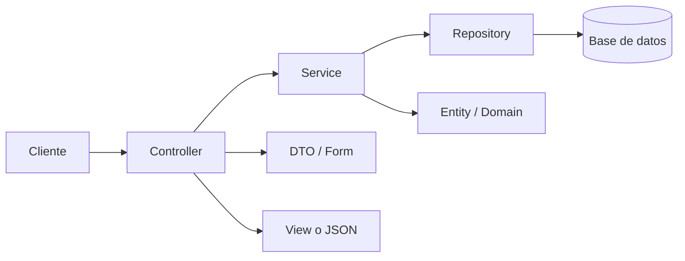
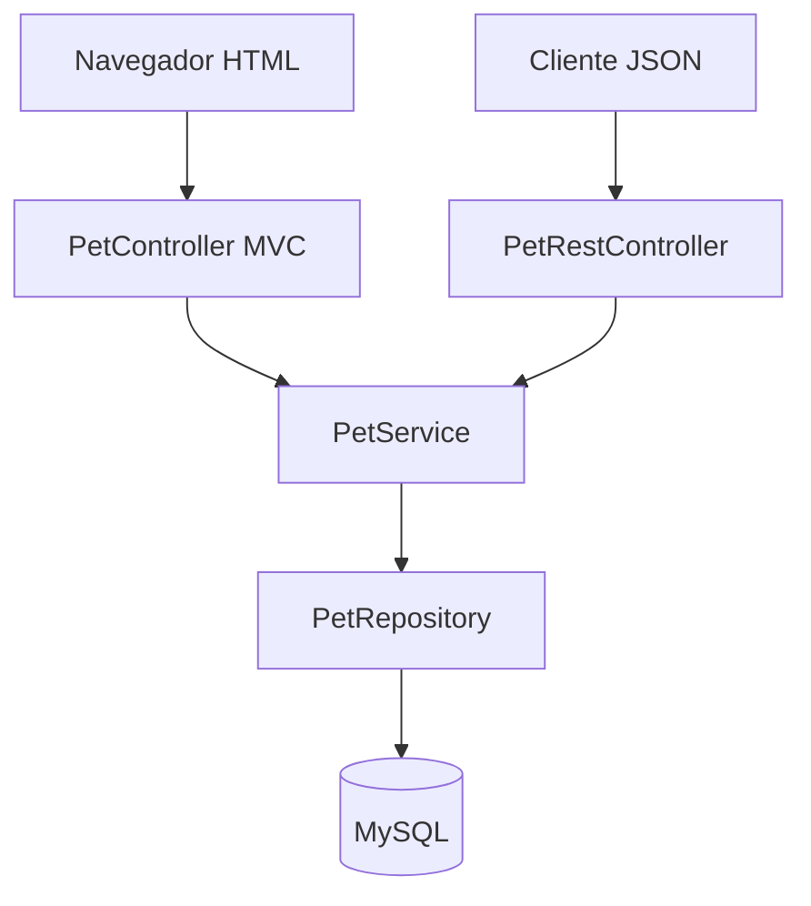
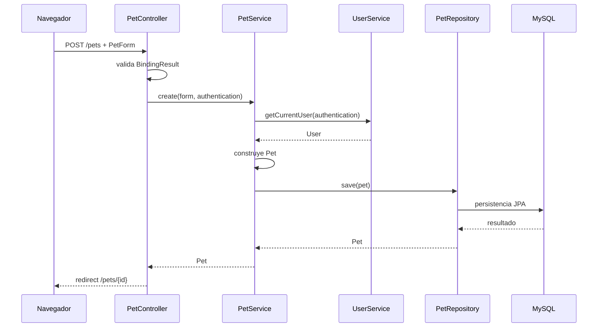
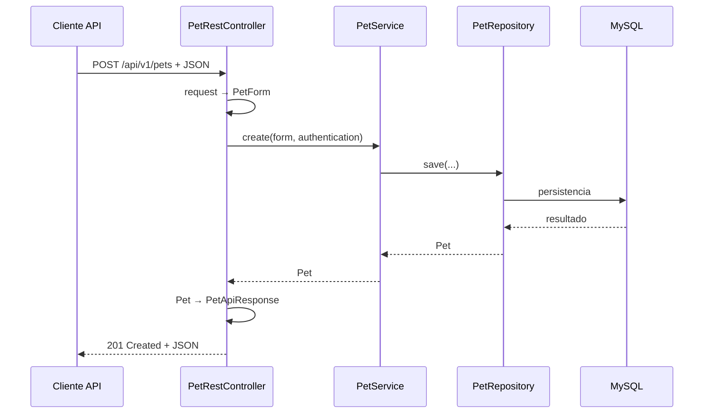
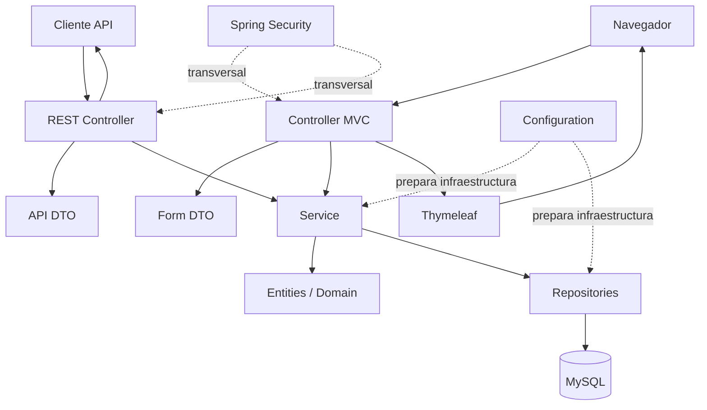

# 07 — Arquitectura por capas

Hasta ahora hemos estudiado el arranque, la estructura física del repositorio, Maven y la configuración externa.

Ahora necesitamos responder una pregunta más profunda:

> **¿Por qué PetMatch distribuye el código entre Controller, Service, Repository, Entity, DTO y View en lugar de resolver todo dentro de una sola clase?**

La respuesta nos lleva a una idea central del diseño de aplicaciones: **separar responsabilidades**.

Este capítulo no pretende presentar una “arquitectura perfecta” aplicable a cualquier sistema. Estudiaremos la arquitectura que realmente existe en PetMatch y qué problema resuelve cada parte.

---

# 1. El problema: una clase que hace de todo

Imagina que una única clase recibiera una petición para registrar una mascota y además:

- validara el formulario;
- buscara el usuario autenticado;
- comprobara ownership;
- normalizara los datos;
- construyera la entidad;
- ejecutara SQL;
- decidiera qué vista HTML devolver;
- manejara errores;
- generara JSON;
- aplicara seguridad.

El resultado sería una clase difícil de leer, probar y cambiar.

Un ejemplo conceptual incorrecto sería:

```java
public class PetEverythingController {
    public Object createPet(...) {
        // seguridad
        // validación
        // SQL
        // reglas de negocio
        // creación de objeto
        // render HTML
        // JSON
        // errores
    }
}
```

> [!NOTE]
> Este código es pseudocódigo. No existe en PetMatch.

La dificultad no es solamente que la clase sea larga. El verdadero problema es que **mezcla razones diferentes para cambiar**.

---

# 2. Separación de responsabilidades

Una responsabilidad es una razón coherente por la cual una parte del software existe o debería cambiar.

En PetMatch podemos reconocer responsabilidades distintas:

```text
recibir HTTP
coordinar un caso de uso
aplicar reglas de negocio
consultar/persistir datos
representar el dominio
transportar datos de entrada/salida
renderizar HTML
configurar infraestructura
```

La arquitectura distribuye esas responsabilidades entre piezas diferentes.

Un mapa inicial:



Este diagrama es simplificado, pero nos sirve como guía de lectura.

---

# 3. ¿Qué significa “arquitectura por capas”?

En una arquitectura por capas agrupamos responsabilidades relacionadas y establecemos direcciones de colaboración relativamente claras.

En PetMatch podemos reconocer, de forma pedagógica, capas o zonas como:

```text
Presentación / entrada HTTP
        ↓
Aplicación / negocio
        ↓
Persistencia
        ↓
Base de datos
```

Con elementos transversales como:

```text
seguridad
validación
configuración
manejo de errores
```

No todas las carpetas equivalen exactamente a una “capa” formal. Algunas son tipos de objetos o infraestructura de apoyo.

Por eso es mejor preguntar:

> **¿qué responsabilidad tiene esta pieza y de qué otras piezas depende?**

---

# 4. La capa Controller

Los Controllers viven principalmente en:

```text
src/main/java/com/petmatch/community/controller/
```

Y los REST Controllers en:

```text
src/main/java/com/petmatch/community/controller/api/
```

Un Controller está cerca de HTTP.

Entre sus responsabilidades habituales en PetMatch están:

- recibir una ruta;
- leer parámetros o body;
- recibir el usuario autenticado;
- trabajar con DTO/formularios;
- llamar Services;
- preparar Model, redirección o respuesta HTTP.

---

# 5. 🔎 `PetController`: presentación MVC

Ruta real:

```text
src/main/java/com/petmatch/community/controller/PetController.java
```

Código real:

```java
@Controller
@RequestMapping("/pets")
public class PetController {

    private final PetService petService;

    public PetController(PetService petService) {
        this.petService = petService;
    }
```

Observa algo importante:

```text
PetController
    ↓
conoce PetService
```

Pero no vemos:

```text
PetController
    ↓
conexión JDBC manual
```

ni:

```text
PetController
    ↓
SQL escrito directamente
```

El Controller delega el trabajo de negocio.

Por ejemplo:

```java
@GetMapping
public String list(Authentication authentication, Model model) {
    model.addAttribute("pets", petService.findCurrentUserPets(authentication));
    return "pets/list";
}
```

Su responsabilidad es cercana a la web:

```text
recibir petición
↓
obtener datos mediante Service
↓
ponerlos en Model
↓
devolver nombre de vista
```

---

# 6. El Controller no debería convertirse en el negocio

Otro método real:

```java
@PostMapping
public String create(
    @Valid PetForm petForm,
    BindingResult bindingResult,
    Authentication authentication,
    Model model,
    RedirectAttributes redirectAttributes
) {
    if (bindingResult.hasErrors()) {
        model.addAttribute("editing", false);
        return "pets/form";
    }

    Pet pet = petService.create(petForm, authentication);
    redirectAttributes.addFlashAttribute(
        "successMessage",
        "Mascota registrada correctamente."
    );
    return "redirect:/pets/" + pet.getId();
}
```

El Controller decide asuntos propios de la interacción web:

- si vuelve a mostrar el formulario;
- qué mensaje flash crear;
- a qué URL redirigir.

Pero la creación de la mascota se delega a:

```java
petService.create(...)
```

Eso mantiene la frontera entre presentación y negocio.

---

# 7. La capa Service

Los Services viven en:

```text
src/main/java/com/petmatch/community/service/
```

Ejemplos:

```text
PetService
UserService
SupportRequestService
SupportApplicationService
```

En PetMatch los Services contienen principalmente:

- casos de uso;
- reglas de negocio;
- coordinación entre repositories;
- verificación de ownership;
- transacciones;
- cambios de estado;
- normalización relacionada con el caso de uso.

---

# 8. 🔎 `PetService`: negocio y coordinación

Código real:

```java
@Service
public class PetService {

    private final PetRepository petRepository;
    private final SupportRequestRepository supportRequestRepository;
    private final UserService userService;
```

Ya podemos reconocer una dirección:

```text
Controller
    ↓
Service
    ↓
Repository
```

El método de creación real:

```java
@Transactional
public Pet create(PetForm form, Authentication authentication) {
    User owner = userService.getCurrentUser(authentication);
    Pet pet = new Pet(
        normalize(form.getName()),
        normalize(form.getSpecies()),
        form.getAge(),
        normalizeNullable(form.getDescription()),
        owner
    );
    return petRepository.save(pet);
}
```

Este método coordina varias responsabilidades del caso de uso:

```text
identificar usuario
↓
normalizar datos
↓
crear entidad
↓
persistir entidad
```

El Controller no necesita conocer esos detalles.

---

# 9. Un ejemplo de regla que pertenece al Service

En `PetService.delete(...)` aparece:

```java
if (supportRequestRepository.existsByPetId(pet.getId())) {
    throw new PetDeletionException(pet.getId());
}
```

La regla es:

> una mascota con solicitudes de apoyo asociadas no se elimina libremente.

Eso es una decisión del comportamiento de PetMatch, no una decisión de HTML ni de SQL.

Por eso tiene sentido que viva cerca de la lógica de aplicación/negocio.

---

# 10. La capa Repository

Los repositories viven en:

```text
src/main/java/com/petmatch/community/repository/
```

Ejemplo real:

```java
public interface PetRepository extends JpaRepository<Pet, Long> {

    List<Pet> findByOwnerIdOrderByNameAsc(Long ownerId);

    Optional<Pet> findByIdAndOwnerId(Long id, Long ownerId);
}
```

Su responsabilidad está cerca del acceso a datos.

Un Repository expresa consultas u operaciones de persistencia necesarias para el dominio/aplicación.

El Service puede decir:

```java
petRepository.findByIdAndOwnerId(petId, owner.getId())
```

sin escribir SQL dentro del Service.

---

# 11. Repository no significa “toda la lógica”

Un error frecuente es mover reglas de negocio al Repository porque “ahí está la base de datos”.

Pero estas responsabilidades son diferentes.

El Repository puede responder:

```text
¿existe una solicitud para esta mascota?
```

mediante:

```java
supportRequestRepository.existsByPetId(...)
```

El Service decide:

```text
si existe → impedir borrado
```

La consulta y la decisión no son exactamente la misma responsabilidad.

---

# 12. Entity / modelo de dominio

Las entidades viven en:

```text
src/main/java/com/petmatch/community/model/
```

Ejemplos reales:

```text
User
Pet
SupportRequest
SupportApplication
```

Estas clases representan conceptos persistentes del dominio de PetMatch.

Una `Pet` no es “una fila” solamente.

Es una representación Java del concepto mascota dentro del sistema, con datos y relaciones.

Más adelante estudiaremos sus anotaciones JPA, relaciones y ciclo de persistencia.

Por ahora la idea es:

```text
Entity
→ representa estado del dominio persistente
```

---

# 13. DTO y Form DTO

Los DTO viven bajo:

```text
src/main/java/com/petmatch/community/dto/
```

PetMatch separa distintos propósitos.

Ejemplos:

```text
RegistrationForm
PetForm
SupportRequestForm
SupportApplicationForm
```

Y para la API:

```text
PetApiRequest
PetApiResponse
SupportRequestApiRequest
SupportRequestApiResponse
...
```

Un DTO sirve para transportar datos entre fronteras sin obligar a exponer directamente una Entity.

La distinción completa:

```text
Entity
≠
Form DTO
≠
API DTO
```

se estudiará en capítulos específicos.

---

# 14. La View

Las vistas viven en:

```text
src/main/resources/templates/
```

PetMatch utiliza Thymeleaf.

Por ejemplo:

```text
templates/pets/list.html
templates/pets/form.html
templates/pets/detail.html
```

La View tiene una responsabilidad cercana a la presentación HTML.

Conceptualmente:

```text
Controller
↓
Model
↓
Thymeleaf template
↓
HTML
```

La vista no debería convertirse en el lugar donde se decide si una postulación puede ser aceptada o si una solicitud puede cambiar de estado.

---

# 15. MVC y REST comparten Service

Una de las decisiones más importantes de PetMatch es que la interfaz web y la API REST no implementan dos veces la lógica de negocio.

MVC:

```java
@Controller
@RequestMapping("/pets")
public class PetController {

    private final PetService petService;
```

REST:

```java
@RestController
@RequestMapping("/api/v1/pets")
public class PetRestController {

    private final PetService petService;
```

Ambos dependen de:

```text
PetService
```

Esto produce una arquitectura como:



> [!IMPORTANT]
> La lógica de negocio compartida no debe duplicarse solo porque cambie el canal de entrada.

---

# 16. ¿Qué cambia entre MVC y REST?

La necesidad del usuario puede ser parecida:

```text
crear mascota
```

Pero la representación cambia.

## MVC

Entrada:

```text
formulario HTML
```

Salida:

```text
redirección / vista HTML
```

## REST

Entrada:

```text
JSON
```

Salida:

```text
JSON + status HTTP
```

El Service puede seguir resolviendo el mismo caso de uso.

---

# 17. Flujo MVC real de creación de mascota

Podemos seguir una operación completa.



Este diagrama muestra responsabilidades, no todos los detalles internos de Spring/Hibernate.

---

# 18. Flujo REST real de creación de mascota

`PetRestController` recibe:

```java
@Valid @RequestBody PetApiRequest request
```

Luego ejecuta:

```java
Pet pet = petService.create(toPetForm(request), authentication);
```

Y devuelve:

```java
return ResponseEntity.created(
    URI.create("/api/v1/pets/" + pet.getId())
).body(toPetResponse(pet));
```

El flujo conceptual:



La diferencia principal está en la frontera de presentación.

---

# 19. ¿Por qué esta separación facilita cambios?

Imagina que cambiamos el HTML de la lista de mascotas.

La modificación debería concentrarse en:

```text
template
Controller si cambia el modelo de vista
```

No deberíamos tener que reescribir la consulta principal de persistencia solo porque cambió el diseño visual.

Ahora imagina que optimizamos una consulta JPA.

El cambio debería concentrarse cerca de:

```text
Repository
```

sin obligar a cambiar el endpoint REST o el template si el contrato sigue igual.

---

# 20. ¿Por qué facilita pruebas?

La separación permite probar piezas con distintos niveles.

Por ejemplo, `SupportRequestServiceTests` puede aislar un Service usando mocks de repositories y otros services.

Eso sería más difícil si el Service construyera directamente infraestructura web o conexiones de base de datos.

Luego las pruebas de integración pueden verificar varias capas juntas.

La arquitectura no elimina la necesidad de pruebas; hace posible elegir **qué nivel quieres probar**.

---

# 21. Dependencias y dirección

En el flujo principal de PetMatch vemos normalmente:

```text
Controller
   ↓
Service
   ↓
Repository
```

Esto es una dirección útil porque las capas más cercanas a HTTP delegan hacia la lógica y esta delega hacia persistencia.

Pero debemos evitar convertirla en una regla simplista como:

> “ninguna clase puede jamás colaborar con otra del mismo nivel”.

Por ejemplo, `PetService` depende de `UserService`.

Código real:

```java
private final UserService userService;
```

Un Service puede coordinarse con otro Service cuando el caso de uso lo requiere.

Lo importante es que las dependencias tengan sentido respecto a responsabilidades.

---

# 22. `PetService` depende de más de un Repository

Código real:

```java
private final PetRepository petRepository;
private final SupportRequestRepository supportRequestRepository;
private final UserService userService;
```

¿Por qué necesita `SupportRequestRepository` si se llama `PetService`?

Porque al eliminar una mascota debe comprobar una regla relacionada con solicitudes:

```java
if (supportRequestRepository.existsByPetId(pet.getId())) {
    throw new PetDeletionException(pet.getId());
}
```

Esto muestra que una arquitectura por capas no significa que cada Service solo pueda conocer un Repository con el mismo nombre.

La pregunta correcta es:

```text
¿qué necesita este caso de uso para aplicar correctamente sus reglas?
```

---

# 23. ¿Qué papel tienen las excepciones?

Las excepciones propias viven en:

```text
src/main/java/com/petmatch/community/exception/
```

Ejemplos:

```text
PetNotFoundException
PetDeletionException
SupportRequestStateException
SupportApplicationRuleException
```

Permiten expresar fallos del dominio/aplicación con significado más específico.

Un Service puede lanzar una excepción sin decidir necesariamente cómo se transformará en HTML o JSON.

Eso permite que otra capa interprete el error según el canal.

---

# 24. Configuración como preocupación transversal

`SecurityConfig` no encaja simplemente en:

```text
Controller → Service → Repository
```

Pertenece a infraestructura/configuración transversal.

Ruta:

```text
src/main/java/com/petmatch/community/config/SecurityConfig.java
```

Allí PetMatch define, entre otras cosas:

- un `PasswordEncoder`;
- una cadena de seguridad para `/api/**`;
- otra cadena para la web;
- autenticación HTTP Basic para API;
- form login para web.

La seguridad afecta varias rutas y capas, por eso la consideramos una preocupación transversal y tendrá su propio bloque.

---

# 25. Seguridad en URL no sustituye ownership

Una arquitectura organizada también ayuda a distinguir tipos de autorización.

`SecurityConfig` puede decir:

```text
cualquier /api/** requiere autenticación
```

Pero eso no responde:

```text
¿esta mascota específica pertenece a este usuario?
```

Esa regla aparece en lógica como:

```java
petRepository.findByIdAndOwnerId(petId, owner.getId())
```

utilizada desde `PetService.findOwnedPet(...)`.

Por tanto:

```text
seguridad global de rutas
≠
autorización sobre un recurso concreto
```

Esta distinción será fundamental en el bloque de seguridad.

---

# 26. Las capas no deben duplicar reglas

Supón que la regla “solo el propietario puede editar una mascota” estuviera implementada:

```text
una vez en MVC Controller
otra vez en REST Controller
otra vez en template
```

Sería fácil que una versión quedara desactualizada.

PetMatch centraliza ownership de mascota mediante `PetService.findOwnedPet(...)`:

```java
public Pet findOwnedPet(Long petId, Authentication authentication) {
    User owner = userService.getCurrentUser(authentication);
    return petRepository.findByIdAndOwnerId(petId, owner.getId())
        .orElseThrow(() -> new PetNotFoundException(petId));
}
```

Así ambos canales pueden reutilizar la misma protección de negocio.

---

# 27. La View no protege el backend

Un template puede ocultar un botón.

Eso mejora la experiencia de usuario, pero no constituye por sí solo autorización.

¿Por qué?

Porque un cliente puede intentar enviar manualmente una petición HTTP.

La regla debe existir en backend.

Esta idea encaja perfectamente con capas:

```text
View
→ presentación

Service / consultas ownership
→ protección del recurso y regla funcional
```

---

# 28. Arquitectura por capas no significa arquitectura distribuida

PetMatch está organizado en capas dentro de una misma aplicación.

Eso no significa que sea un sistema de microservicios.

Tenemos paquetes diferentes, pero forman parte del mismo proyecto Spring Boot.

```text
package controller
package service
package repository
```

no equivalen a:

```text
servicio desplegable independiente A
servicio desplegable independiente B
servicio desplegable independiente C
```

> [!IMPORTANT]
> Separación lógica de responsabilidades y separación física en microservicios son conceptos distintos.

---

# 29. ¿Por qué no llamar al Repository directamente desde el Controller?

Podríamos técnicamente inyectar `PetRepository` en `PetController`.

Pero entonces el Controller empezaría a asumir responsabilidad sobre:

- ownership;
- reglas de borrado;
- normalización;
- coordinación con otros repositories;
- transacciones del caso de uso.

Además, `PetRestController` podría repetir esa lógica.

El Service ofrece un punto común para los casos de uso.

---

# 30. ¿Debe todo pasar por un Service?

No conviertas la arquitectura en una ceremonia automática.

La razón para usar un Service no es:

> “porque Spring exige tres capas”.

Spring no obliga a tener exactamente Controller → Service → Repository para cada método.

PetMatch utiliza esa separación porque sus casos de uso tienen reglas, ownership, transacciones y reutilización entre MVC/REST.

La arquitectura debe justificarse por responsabilidades, no por repetir una plantilla sin pensar.

---

# 31. ¿Dónde está la lógica de negocio más importante de PetMatch?

Principalmente en:

```text
PetService
UserService
SupportRequestService
SupportApplicationService
```

Los capítulos posteriores estudiarán especialmente los dos últimos porque contienen reglas como:

```text
solo OPEN permite ciertas acciones
no aplicar a solicitud propia
no duplicar aplicación
aceptar una → IN_PROGRESS
rechazar otras PENDING
completar solo IN_PROGRESS
```

Eso confirma que el Service no es solo un puente vacío entre Controller y Repository.

---

# 32. Un mapa de responsabilidades de PetMatch

| Pieza | Responsabilidad principal |
|---|---|
| Controller MVC | HTTP web, Model, redirect, vistas |
| REST Controller | HTTP API, JSON, status codes, DTO REST |
| Service | casos de uso, reglas, coordinación, transacciones |
| Repository | acceso a persistencia y consultas |
| Entity/model | estado persistente del dominio |
| Form DTO | entrada de formularios MVC |
| API DTO | contrato de entrada/salida REST |
| Template | presentación HTML |
| Exception | expresar condiciones de error específicas |
| Config | configurar infraestructura/políticas |
| Security service/config | autenticación y seguridad transversal |

Esta tabla es una guía de lectura, no una definición universal para todos los sistemas Spring.

---

# 33. Un mapa completo de flujo



---

# 34. Cómo leer una funcionalidad desconocida

Cuando abras una feature nueva en un proyecto Spring, puedes seguir este método:

## Paso 1 — Encuentra la entrada

Busca:

```text
@GetMapping
@PostMapping
@PutMapping
@DeleteMapping
```

## Paso 2 — Mira qué Service se invoca

Pregunta:

```text
¿qué caso de uso está delegando?
```

## Paso 3 — Abre el Service

Busca:

- reglas;
- excepciones;
- transacciones;
- otros Services;
- repositories.

## Paso 4 — Abre los repositories involucrados

Pregunta:

```text
¿qué datos necesita consultar o persistir?
```

## Paso 5 — Revisa Entity/DTO

Pregunta:

```text
¿qué estructura entra?
¿qué estructura persiste?
¿qué estructura sale?
```

## Paso 6 — Revisa View o respuesta REST

Pregunta:

```text
¿cómo se presenta el resultado?
```

Este método será usado continuamente en el libro.

---

# 35. ⚠️ Errores frecuentes

## Error 1 — Poner toda la lógica en el Controller

Produce Controllers difíciles de reutilizar y probar.

## Error 2 — Crear Services vacíos que solo llaman Repository sin aportar ninguna responsabilidad

La capa Service debe tener sentido. En PetMatch sí existe negocio real que justificar.

## Error 3 — Escribir reglas del dominio solamente en la vista

Ocultar botones no protege endpoints.

## Error 4 — Duplicar la misma regla en MVC y REST

El Service compartido permite evitar gran parte de esa duplicación.

## Error 5 — Confundir Entity con DTO

Son responsabilidades distintas. PetMatch separa Form DTO y API DTO.

## Error 6 — Pensar que un Repository es “la base de datos”

Es una abstracción de acceso a persistencia. La base real configurada es MySQL.

## Error 7 — Creer que paquetes diferentes son microservicios

Siguen siendo partes de una sola aplicación Spring Boot.

## Error 8 — Seguir una arquitectura por costumbre sin entenderla

Cada capa debe justificarse por responsabilidades concretas.

---

# 36. 🛠 Prueba en el código

## Actividad 1 — Sigue `GET /pets`

Abre:

```text
PetController.java
PetService.java
PetRepository.java
```

Identifica:

1. ruta HTTP;
2. método del Controller;
3. método del Service;
4. método del Repository;
5. dato que termina en `Model`.

## Actividad 2 — Compara MVC y REST

Abre:

```text
PetController.java
PetRestController.java
```

Responde:

1. ¿qué Service comparten?
2. ¿qué tipo de salida produce cada uno?
3. ¿qué DTO utiliza REST?
4. ¿qué formulario utiliza MVC?

## Actividad 3 — Busca una regla de negocio

En `PetService.delete(...)`, explica qué hace:

```java
supportRequestRepository.existsByPetId(...)
```

Separa mentalmente:

```text
consulta
```

de:

```text
decisión
```

## Actividad 4 — Ownership

En `PetService.findOwnedPet(...)` localiza:

```java
findByIdAndOwnerId(...)
```

Explica por qué esto protege más que ocultar un enlace en HTML.

---

# 37. 🧪 Comprueba que entendiste

1. ¿Qué problema resuelve separar responsabilidades?
2. ¿Qué responsabilidad principal tiene un Controller?
3. ¿Qué responsabilidad principal tiene un Service en PetMatch?
4. ¿Qué responsabilidad principal tiene un Repository?
5. ¿Dónde viven las entidades?
6. ¿Entity y Form DTO son lo mismo?
7. ¿Por qué MVC y REST comparten `PetService`?
8. ¿Qué cambia entre MVC y REST aunque compartan el mismo Service?
9. ¿Por qué una regla de ownership debe existir en backend?
10. ¿PetMatch es un conjunto de microservicios porque tiene paquetes separados?
11. ¿Qué clase contiene la regla que impide borrar una mascota con solicitudes asociadas?
12. ¿Qué método del Repository ayuda a comprobar ownership de una mascota?

### Respuestas esperadas

1. Evita mezclar razones diferentes para cambiar y mejora mantenibilidad, pruebas y reutilización.
2. Gestionar la frontera HTTP/presentación.
3. Ejecutar casos de uso, reglas, coordinación y transacciones.
4. Acceso a persistencia/consultas.
5. `model/`.
6. No.
7. Para reutilizar la misma lógica de negocio desde dos canales.
8. Entrada/salida y representación HTTP: HTML/formulario vs JSON/status.
9. Porque un cliente puede llamar el endpoint directamente aunque la vista oculte un botón.
10. No.
11. `PetService`.
12. `findByIdAndOwnerId(...)`.

---

# 38. ✅ Qué debes recordar

- **Arquitectura por capas significa separar responsabilidades, no acumular carpetas por costumbre.**
- Los Controllers están cerca de HTTP y presentación.
- Los Services concentran casos de uso y reglas de negocio.
- Los Repositories expresan acceso a persistencia.
- Las Entities representan estado persistente del dominio.
- DTO y Entity no son sinónimos.
- Thymeleaf pertenece a la presentación HTML.
- MVC y REST de PetMatch reutilizan Services comunes.
- La seguridad de rutas no sustituye reglas de ownership del recurso.
- La View no debe ser la única barrera de autorización.
- Las capas de PetMatch pertenecen a una sola aplicación, no a microservicios.
- Una arquitectura útil puede seguirse desde HTTP → Controller → Service → Repository → DB y de regreso a la respuesta.

---

# 🔗 Continúa con

Ya entendemos **qué responsabilidad tiene cada pieza**.

Ahora falta profundizar en cómo Spring logra conectar esas piezas sin que Controllers y Services construyan manualmente sus colaboradores.

El siguiente capítulo cierra el bloque de Fundamentos:

**[Capítulo 08 — Inyección de dependencias →](08-inyeccion-de-dependencias.md)**

---

[← Capítulo 06 — Configuración y `application.yaml`](06-configuracion-y-application-yaml.md) · [Índice del bloque](README.md) · [Índice general](../README.md) · [Siguiente → Capítulo 08](08-inyeccion-de-dependencias.md)
