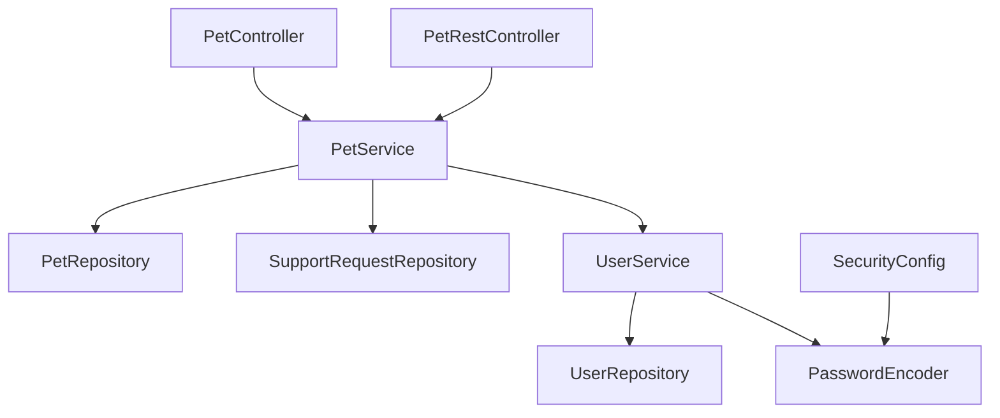
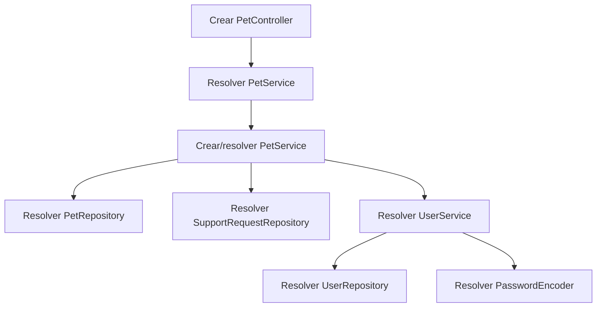
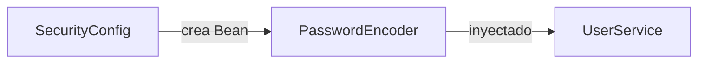
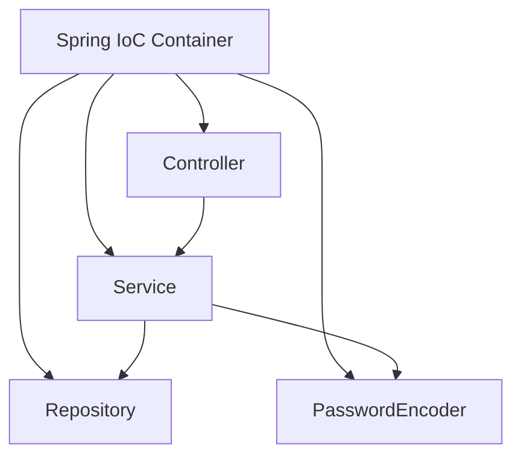
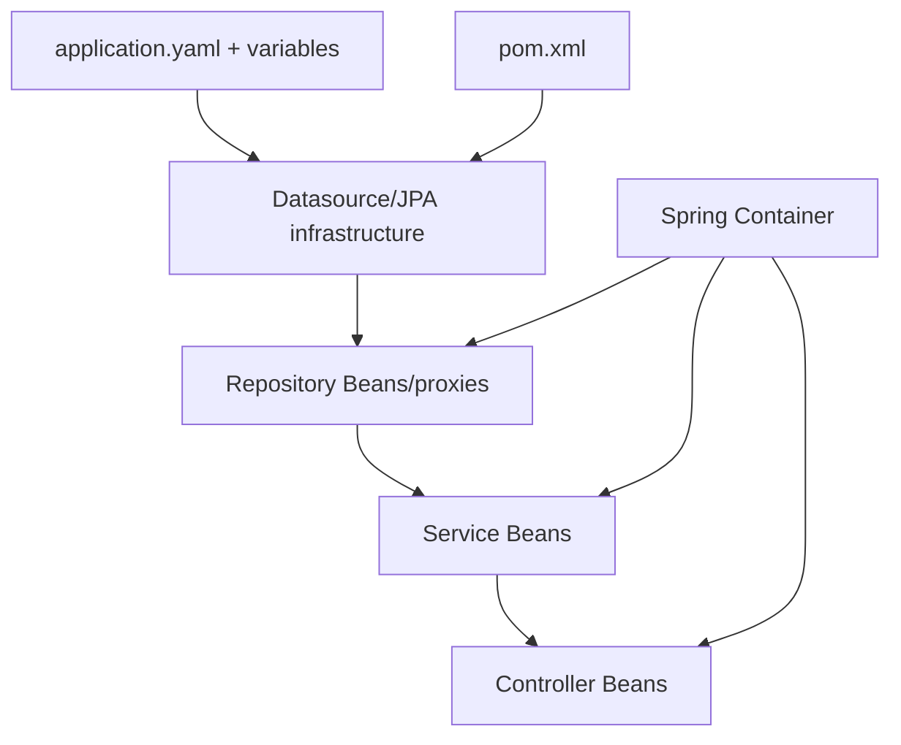

# 08 — Inyección de dependencias en PetMatch

El capítulo 02 introdujo la idea de Dependency Injection desde el problema de construir objetos manualmente.

Ahora, después de haber estudiado Spring Boot, Maven, configuración y arquitectura por capas, podemos volver al tema con una visión mucho más concreta:

> **¿Cómo conecta Spring realmente los Controllers, Services, Repositories y componentes de configuración de PetMatch?**

Este capítulo cierra el bloque de Fundamentos conectando cuatro conceptos:

```text
Bean
IoC Container
Dependency Injection
constructor injection
```

Y los estudiaremos directamente sobre clases reales del proyecto.

---

# 1. El problema reaparece en la arquitectura

En el capítulo anterior vimos una dirección típica:

```text
Controller
   ↓
Service
   ↓
Repository
```

Pero esa imagen es conceptual.

Para que funcione, alguien debe crear los objetos y conectarlos.

Por ejemplo:

```text
PetController necesita PetService
PetService necesita PetRepository
PetService necesita SupportRequestRepository
PetService necesita UserService
UserService necesita UserRepository
UserService necesita PasswordEncoder
```

Si lo hiciéramos manualmente, necesitaríamos conocer el orden completo de construcción.

Spring evita que cada clase tenga que ensamblar su propio árbol de dependencias.

---

# 2. El grafo real de una parte de PetMatch

Podemos visualizar una parte del sistema así:



Este grafo no muestra todos los Beans del contexto. Solo representa relaciones relevantes que aparecen directamente en el código de PetMatch.

---

# 3. ¿Qué es nuevamente Dependency Injection?

## Definición sencilla

Una clase recibe desde afuera los colaboradores que necesita.

Ejemplo real:

```java
public PetController(PetService petService) {
    this.petService = petService;
}
```

`PetController` no decide cómo crear `PetService`.

## Definición técnica

Dependency Injection es un patrón en el cual las dependencias de un objeto son suministradas externamente en lugar de ser construidas o localizadas internamente por ese objeto.

Spring implementa este patrón mediante su contenedor IoC.

---

# 4. Constructor injection en `PetController`

Código real:

```java
@Controller
@RequestMapping("/pets")
public class PetController {

    private final PetService petService;

    public PetController(PetService petService) {
        this.petService = petService;
    }
}
```

Este diseño expresa tres cosas.

## 1. Existe una dependencia obligatoria

```text
PetController → PetService
```

## 2. La dependencia se establece al construir el objeto

No se asigna posteriormente mediante un setter.

## 3. El campo puede ser `final`

```java
private final PetService petService;
```

Eso comunica que la referencia no debería cambiar durante la vida normal del Controller.

---

# 5. ¿Por qué no aparece `@Autowired`?

Muchos tutoriales antiguos muestran:

```java
@Autowired
private PetService petService;
```

o:

```java
@Autowired
public PetController(PetService petService) {
    this.petService = petService;
}
```

PetMatch utiliza constructor injection sin escribir `@Autowired` en estos constructores.

Cuando una clase gestionada por Spring tiene un único constructor adecuado, Spring puede utilizarlo automáticamente para resolver sus dependencias.

Por eso esto funciona:

```java
public PetController(PetService petService) {
    this.petService = petService;
}
```

> [!IMPORTANT]
> La ausencia de `@Autowired` no significa ausencia de Dependency Injection.

---

# 6. Constructor injection en `PetService`

Código real:

```java
@Service
public class PetService {

    private final PetRepository petRepository;
    private final SupportRequestRepository supportRequestRepository;
    private final UserService userService;

    public PetService(
        PetRepository petRepository,
        SupportRequestRepository supportRequestRepository,
        UserService userService
    ) {
        this.petRepository = petRepository;
        this.supportRequestRepository = supportRequestRepository;
        this.userService = userService;
    }
}
```

El constructor funciona como una declaración explícita de requisitos:

```text
Para existir correctamente,
PetService necesita:

- PetRepository
- SupportRequestRepository
- UserService
```

Eso hace que el diseño sea legible incluso antes de estudiar los métodos.

---

# 7. El constructor como mapa de arquitectura

Una técnica muy útil al leer código Spring es:

> **abre una clase y mira primero sus campos `final` y su constructor.**

En `PetService` puedes inferir rápidamente:

```text
trabaja con mascotas
consulta solicitudes
necesita identificar usuarios
```

Antes incluso de leer `create()`, `update()` o `delete()`.

En `UserService`:

```java
private final UserRepository userRepository;
private final PasswordEncoder passwordEncoder;
```

puedes inferir:

```text
persistencia de usuarios
+
tratamiento de contraseñas
```

El constructor se convierte en documentación viva de colaboraciones.

---

# 8. ¿Qué es un Bean en este contexto?

Recordemos la definición:

> Un Bean es un objeto gestionado por el contenedor de Spring.

En PetMatch, clases como:

```text
PetController
PetService
UserService
SecurityConfig
```

forman parte del contexto porque Spring las detecta/configura como componentes.

También existen Beans creados explícitamente mediante métodos `@Bean`.

---

# 9. Componentes detectados por estereotipos

`PetService` está marcado:

```java
@Service
public class PetService {
```

`PetController`:

```java
@Controller
public class PetController {
```

`PetRestController`:

```java
@RestController
public class PetRestController {
```

Estas anotaciones son especializaciones del concepto de componente gestionado por Spring.

Durante el component scanning, Spring puede registrar esas clases como Beans del contexto.

---

# 10. Repositories: una diferencia importante

`PetRepository` no está implementado manualmente como una clase concreta.

Código real:

```java
public interface PetRepository extends JpaRepository<Pet, Long> {

    List<Pet> findByOwnerIdOrderByNameAsc(Long ownerId);

    Optional<Pet> findByIdAndOwnerId(Long id, Long ownerId);
}
```

No hay en el repositorio una clase:

```text
PetRepositoryImpl.java
```

escrita manualmente para implementar los métodos básicos.

Spring Data JPA crea infraestructura/proxies para las interfaces Repository compatibles.

Eso permite que Spring pueda inyectar un objeto que cumple `PetRepository` en:

```java
public PetService(PetRepository petRepository, ...)
```

El detalle completo de Spring Data JPA se estudiará después.

---

# 11. ¿Qué significa resolver una dependencia?

Supongamos que Spring está creando `PetController`.

Encuentra este constructor:

```java
public PetController(PetService petService)
```

Entonces necesita resolver:

```text
¿qué Bean del contexto puede suministrarse como PetService?
```

Existe una clase:

```java
@Service
public class PetService
```

Spring puede utilizar ese Bean.

Conceptualmente:

```text
crear PetController
↓
necesita PetService
↓
buscar/resolver Bean compatible
↓
inyectarlo en constructor
```

---

# 12. Una cadena completa de resolución

Cuando Spring crea una parte del contexto, las necesidades se encadenan.



Esto explica por qué una dependencia faltante puede provocar un error de arranque incluso antes de recibir una petición HTTP.

---

# 13. `PasswordEncoder`: un Bean definido explícitamente

No todos los Beans nacen de una clase marcada con `@Service` o `@Controller`.

PetMatch define explícitamente uno en:

```text
src/main/java/com/petmatch/community/config/SecurityConfig.java
```

Código real:

```java
@Configuration
public class SecurityConfig {

    @Bean
    PasswordEncoder passwordEncoder() {
        return PasswordEncoderFactories.createDelegatingPasswordEncoder();
    }
```

Aquí el método devuelve un objeto que Spring registra como Bean.

---

# 14. ¿Quién consume ese `PasswordEncoder`?

`UserService`:

```java
@Service
public class UserService {

    private final UserRepository userRepository;
    private final PasswordEncoder passwordEncoder;

    public UserService(
        UserRepository userRepository,
        PasswordEncoder passwordEncoder
    ) {
        this.userRepository = userRepository;
        this.passwordEncoder = passwordEncoder;
    }
}
```

La relación real es:



`UserService` no necesita saber que el encoder se construye mediante:

```java
PasswordEncoderFactories.createDelegatingPasswordEncoder()
```

Solo depende de la abstracción:

```text
PasswordEncoder
```

---

# 15. Separar uso de construcción

Este ejemplo muestra una ventaja esencial.

`UserService` conoce:

```java
passwordEncoder.encode(...)
```

pero no decide cómo construir el encoder.

Entonces separamos:

```text
USO
UserService
```

de:

```text
CONSTRUCCIÓN / CONFIGURACIÓN
SecurityConfig
```

Esa separación reduce acoplamiento con detalles concretos de creación.

---

# 16. Dependency Injection no significa depender de todo por interfaces

Una simplificación frecuente es afirmar:

> “DI significa que todo debe ser una interfaz”.

No.

`PetController` depende directamente de la clase:

```text
PetService
```

Y Spring la inyecta correctamente.

En cambio, `UserService` depende de la interfaz:

```text
PasswordEncoder
```

Y `PetService` depende de interfaces Repository.

La decisión entre interfaz y clase depende del diseño, no de una obligación universal de DI.

---

# 17. ¿Por qué `final` es útil?

PetMatch declara dependencias como:

```java
private final PetService petService;
```

El campo `final` comunica que la referencia queda establecida en construcción.

Eso ayuda a expresar una clase con dependencias obligatorias e inmutables en cuanto a referencia.

No significa que el objeto `PetService` sea completamente inmutable internamente.

Significa que `PetController` no reasigna arbitrariamente su referencia a otro Service después.

---

# 18. Field injection vs constructor injection

## Field injection

Ejemplo conceptual:

```java
@Autowired
private PetService petService;
```

## Constructor injection

Estilo real de PetMatch:

```java
private final PetService petService;

public PetController(PetService petService) {
    this.petService = petService;
}
```

Ventajas pedagógicas y de diseño del constructor:

- dependencias visibles;
- campos `final`;
- objeto difícil de construir de forma incompleta;
- pruebas más directas;
- menos dependencia de reflexión/inyección oculta para construir manualmente la clase.

PetMatch adopta este segundo estilo en sus Controllers y Services principales.

---

# 19. ¿Y setter injection?

Otra posibilidad conceptual sería:

```java
public void setPetService(PetService petService) {
    this.petService = petService;
}
```

Puede tener sentido para dependencias realmente opcionales o configurables después de la construcción en algunos diseños.

Pero las dependencias principales de PetMatch son obligatorias.

Por eso el constructor comunica mejor la intención.

---

# 20. DI y pruebas unitarias

Dependency Injection resulta especialmente útil cuando queremos probar una clase aislada.

PetMatch tiene pruebas que usan Mockito.

Por ejemplo, conceptualmente:

```java
@Mock
private SupportRequestRepository supportRequestRepository;

@InjectMocks
private SupportRequestService supportRequestService;
```

La idea es que el Service puede construirse con colaboradores controlados por la prueba en lugar de infraestructura real.

Eso es posible porque sus dependencias son externas y explícitas.

---

# 21. ¿Por qué un `new` interno puede dificultar pruebas?

Imagina un Service escrito así:

> [!NOTE]
> Ejemplo incorrecto, no código real de PetMatch.

```java
public class UserService {

    private final UserRepository userRepository = new MySqlUserRepository();
    private final PasswordEncoder passwordEncoder = new SomeEncoder();
}
```

La clase queda atada a implementaciones concretas.

Para una prueba tendríamos más dificultad al sustituir esos colaboradores.

Con constructor injection:

```java
public UserService(
    UserRepository userRepository,
    PasswordEncoder passwordEncoder
)
```

la clase declara qué necesita y permite suministrar colaboradores diferentes en distintos contextos.

---

# 22. DI no significa “no usar `new`”

PetMatch utiliza `new` correctamente para objetos del dominio y DTO.

Ejemplo real en `PetService.create(...)`:

```java
Pet pet = new Pet(
    normalize(form.getName()),
    normalize(form.getSpecies()),
    form.getAge(),
    normalizeNullable(form.getDescription()),
    owner
);
```

Ese `Pet` representa una entidad creada durante un caso de uso.

No necesitamos pedir al contenedor un Bean global por cada mascota registrada.

Una distinción útil:

```text
Componentes de aplicación de larga colaboración
→ candidatos a gestión por Spring

Objetos de dominio/datos creados durante operaciones
→ normalmente se crean como objetos Java normales
```

---

# 23. Bean no significa singleton por definición absoluta

En la configuración habitual, muchos Beans de aplicación usan scope singleton por defecto dentro del contexto.

Pero Spring soporta diferentes scopes.

No debemos convertir:

```text
Bean
```

en sinónimo universal de:

```text
singleton de Java
```

Para este proyecto, basta con comprender que los Services/Controllers principales son gestionados por Spring y reutilizados según su scope configurado por defecto.

---

# 24. ¿Qué pasa si hay dos Beans compatibles?

Imagina que existen dos implementaciones de una misma interfaz y una clase pide:

```java
SomeInterface dependency
```

Spring necesita saber cuál debe inyectar.

En esos casos pueden entrar herramientas como:

```text
@Primary
@Qualifier
```

PetMatch resuelve `PetService`, `UserService` y `PasswordEncoder` sin necesitar esas anotaciones en sus casos principales.

> [!IMPORTANT]
> `@Qualifier` no es necesario en la implementación actual solo porque es una capacidad útil de Spring.

---

# 25. ¿Qué ocurre si falta un Bean?

Imagina que `UserService` declara:

```java
PasswordEncoder passwordEncoder
```

pero no existe ningún Bean compatible en el contexto.

Spring no podría completar correctamente la creación de `UserService`.

Eso puede causar un error durante el arranque del contexto.

Por eso `SecurityConfig` contiene:

```java
@Bean
PasswordEncoder passwordEncoder()
```

La cadena queda completa.

---

# 26. ¿Qué ocurre si aparece una dependencia circular?

Ejemplo conceptual:

```text
ServiceA necesita ServiceB
ServiceB necesita ServiceA
```

Eso forma un ciclo.

Las dependencias circulares suelen indicar que las responsabilidades están demasiado entrelazadas o que el diseño necesita revisión.

No debemos usar DI como excusa para crear grafos arbitrariamente complejos.

En PetMatch, los ejemplos principales estudiados siguen una dirección comprensible.

---

# 27. DI no corrige una mala arquitectura

Una clase puede tener veinte dependencias perfectamente inyectadas y seguir siendo una mala clase.

Por ejemplo:

```text
MegaService(
  UserRepository,
  PetRepository,
  SupportRequestRepository,
  SupportApplicationRepository,
  PasswordEncoder,
  MailClient,
  PaymentClient,
  ...
)
```

El contenedor podría intentar construirla, pero eso no significa que sus responsabilidades estén bien diseñadas.

DI resuelve composición.

No reemplaza el diseño de responsabilidades.

---

# 28. La conexión entre arquitectura y DI

El capítulo anterior decía:

```text
Controller → Service → Repository
```

Este capítulo añade:

```text
Spring Container
        ↓
crea/resuelve componentes
        ↓
inyecta sus dependencias
```

Podemos unir ambos mapas:



La arquitectura define **quién debería colaborar con quién**.

DI facilita **cómo se conectan esas colaboraciones**.

---

# 29. La conexión con `@SpringBootApplication`

En el capítulo 03 vimos:

```java
@SpringBootApplication
public class PetMatchCommunityApplication
```

y explicamos component scanning.

Ahora podemos cerrar el círculo.

La clase principal está en:

```text
com.petmatch.community
```

Los componentes viven debajo:

```text
com.petmatch.community.controller
com.petmatch.community.service
com.petmatch.community.config
...
```

El escaneo permite descubrir componentes y construir el contexto.

Después el contenedor puede resolver e inyectar dependencias.

---

# 30. La conexión con auto-configuración

No todos los objetos necesarios están escritos manualmente por nosotros.

Spring Boot y Spring Data aportan infraestructura que se registra/configura según las capacidades del proyecto.

Por ejemplo, PetMatch escribe:

```java
public interface PetRepository extends JpaRepository<Pet, Long>
```

pero no escribe toda la implementación de JPA necesaria para que el Repository funcione.

La auto-configuración y Spring Data colaboran con el contenedor para hacer disponible esa infraestructura.

---

# 31. La conexión con configuración externa

`PetRepository` necesita infraestructura JPA.

La infraestructura JPA necesita datasource.

El datasource necesita valores como:

```text
DB_URL
DB_USERNAME
DB_PASSWORD
```

Por tanto, todo lo aprendido se conecta:



Dependency Injection no existe aislada: forma parte del proceso completo de arranque/configuración de la aplicación.

---

# 32. Dos Controllers, una misma dependencia

MVC:

```java
public PetController(PetService petService) {
    this.petService = petService;
}
```

REST:

```java
public PetRestController(PetService petService) {
    this.petService = petService;
}
```

Ambos reciben el mismo tipo de colaboración.

Eso muestra que el Service no pertenece “al Controller MVC” ni “al Controller REST”.

Es un componente de negocio reutilizable por distintas entradas.

---

# 33. DI y bajo acoplamiento: una precisión importante

A veces se afirma:

> “DI elimina el acoplamiento”.

Eso es incorrecto.

`PetController` sigue acoplado a la API pública de `PetService`.

Lo que DI ayuda a reducir es el acoplamiento con **la construcción y localización de dependencias**.

La meta no es cero acoplamiento.

La meta es acoplamiento comprensible y controlado.

---

# 34. Service Locator vs Dependency Injection

Otra forma de obtener dependencias sería que cada clase preguntara a un contenedor:

> “dame un `PetService`”.

Ese estilo puede ocultar dependencias dentro de los métodos.

PetMatch prefiere declararlas explícitamente en el constructor.

Así, al leer:

```java
public PetController(PetService petService)
```

sabemos inmediatamente qué necesita la clase.

---

# 35. ¿Debemos inyectar Entities?

No.

Una entidad como `Pet` no representa un servicio global del sistema.

Se crea para representar datos concretos de una operación.

Código real:

```java
Pet pet = new Pet(...);
```

Intentar algo como:

```java
public PetService(Pet pet)
```

para representar “la mascota actual” sería conceptualmente incorrecto en este diseño.

Spring administra componentes; JPA administra el ciclo de persistencia de entidades en otro sentido diferente.

---

# 36. ¿Debemos inyectar DTO?

Normalmente tampoco.

`PetForm`, por ejemplo, representa los datos de una petición/formulario concreto.

El Controller recibe o crea esos objetos para cada interacción.

No son servicios compartidos de la aplicación.

La distinción es:

```text
Bean de aplicación
≠
objeto de datos de una petición
```

---

# 37. ¿Qué dependencias deberías ver en PetMatch?

Ejemplos claros:

## `PetController`

```text
PetService
```

## `PetRestController`

```text
PetService
```

## `PetService`

```text
PetRepository
SupportRequestRepository
UserService
```

## `UserService`

```text
UserRepository
PasswordEncoder
```

## `DatabaseUserDetailsService`

Depende de:

```text
UserRepository
```

Estos constructores forman una excelente actividad para aprender a leer arquitectura sin ejecutar la aplicación.

---

# 38. Un procedimiento para diagnosticar errores de DI

Si Spring informa que no puede crear un Bean o resolver una dependencia, sigue una secuencia como esta:

```text
1. ¿Qué clase estaba intentando crear?
2. ¿Qué parámetro del constructor no pudo resolver?
3. ¿Existe un Bean compatible?
4. ¿La clase está dentro del component scan?
5. ¿Falta una anotación/configuración?
6. ¿La dependencia viene de auto-configuración y falta otra dependencia/propiedad?
7. ¿Existen varios candidatos ambiguos?
8. ¿Hay una dependencia circular?
```

No intentes solucionar el error agregando `@Autowired` al azar.

Primero entiende qué relación falta.

---

# 39. ⚠️ Errores frecuentes

## Error 1 — “Si no veo `@Autowired`, no hay DI”

Falso. PetMatch utiliza constructor injection sin esa anotación en los constructores principales.

## Error 2 — “DI significa no usar `new`”

Falso. PetMatch usa `new` para entidades y DTO cuando corresponde.

## Error 3 — “Todo debe ser Bean”

No. Los Beans son componentes gestionados; no cada objeto de datos.

## Error 4 — “Todo debe ser interfaz”

No. `PetController` depende directamente de `PetService`.

## Error 5 — “`@Service` inyecta automáticamente todas las cosas”

`@Service` ayuda a registrar el componente; las dependencias siguen necesitando candidatos resolubles en el contexto.

## Error 6 — “El Repository tiene implementación manual escondida en el proyecto”

No para `PetRepository`: la infraestructura se genera/proporciona mediante Spring Data JPA.

## Error 7 — “DI garantiza buena arquitectura”

No. Una clase con responsabilidades excesivas sigue mal diseñada.

## Error 8 — “`final` vuelve inmutable el Service completo”

No. Solo impide reasignar esa referencia de campo después de la construcción.

## Error 9 — “Un Bean y una Entity son lo mismo porque ambos los maneja Spring”

No. Son conceptos y ciclos diferentes.

---

# 40. 🛠 Prueba en el código

## Actividad 1 — Mapa de constructores

Abre:

```text
PetController.java
PetRestController.java
PetService.java
UserService.java
DatabaseUserDetailsService.java
```

Haz una tabla:

```text
Clase | Dependencias del constructor | Tipo de componente
```

## Actividad 2 — Sigue `PasswordEncoder`

Abre:

```text
SecurityConfig.java
UserService.java
```

Encuentra:

```java
@Bean
PasswordEncoder passwordEncoder()
```

y después:

```java
public UserService(..., PasswordEncoder passwordEncoder)
```

Dibuja la relación.

## Actividad 3 — Busca field injection

En los Controllers y Services principales de PetMatch busca:

```java
@Autowired
```

Compara con los constructores reales.

## Actividad 4 — Repository sin implementación manual

Abre:

```text
PetRepository.java
```

Confirma que es una interfaz.

Después busca si existe:

```text
PetRepositoryImpl.java
```

Analiza por qué el proyecto puede inyectar `PetRepository` aunque no hayas escrito una implementación CRUD completa.

## Actividad 5 — `new` correcto

Busca en `PetService.create(...)`:

```java
new Pet(...)
```

Explica por qué eso no contradice Dependency Injection.

---

# 41. 🧪 Comprueba que entendiste

1. ¿Qué es Dependency Injection?
2. ¿Qué tipo de inyección utiliza principalmente PetMatch?
3. ¿Por qué los constructores principales no necesitan `@Autowired` explícito?
4. ¿Qué dependencias recibe `PetService`?
5. ¿Qué dependencias recibe `UserService`?
6. ¿Dónde se crea el Bean `PasswordEncoder`?
7. ¿Quién consume `PasswordEncoder`?
8. ¿Por qué `PetRepository` puede inyectarse aunque sea una interfaz?
9. ¿DI significa que nunca debemos usar `new`?
10. ¿Una Entity debería ser un Bean de Service por cada registro?
11. ¿DI elimina completamente el acoplamiento?
12. ¿Qué relación existe entre component scanning y DI?
13. ¿Qué relación existe entre configuración externa, JPA y Repository injection?
14. ¿Por qué constructor injection facilita pruebas?
15. ¿Qué harías primero si Spring dice que no encuentra un Bean para un parámetro del constructor?

### Respuestas esperadas

1. Suministrar dependencias desde afuera en lugar de construirlas/localizarlas internamente.
2. Constructor injection.
3. Porque Spring puede usar automáticamente un único constructor adecuado de un componente gestionado.
4. `PetRepository`, `SupportRequestRepository`, `UserService`.
5. `UserRepository`, `PasswordEncoder`.
6. En `SecurityConfig.passwordEncoder()` con `@Bean`.
7. `UserService`.
8. Spring Data JPA aporta la infraestructura/proxy para el Repository.
9. No.
10. No.
11. No; reduce especialmente el acoplamiento con construcción/localización de dependencias.
12. El escaneo ayuda a registrar componentes que luego el contenedor puede crear e inyectar.
13. Las propiedades configuran datasource/JPA; esa infraestructura permite disponer de repositories que luego se inyectan.
14. Porque permite suministrar mocks/stubs/controlados al construir el objeto bajo prueba.
15. Identificar exactamente qué dependencia falta y verificar si existe un Bean compatible/configurable.

---

# 42. ✅ Qué debes recordar

- **Dependency Injection significa recibir dependencias, no construirlas internamente.**
- PetMatch utiliza principalmente **constructor injection**.
- La ausencia de `@Autowired` no implica ausencia de DI.
- Los constructores son un mapa rápido de la arquitectura.
- `@Controller`, `@RestController` y `@Service` permiten registrar componentes gestionados.
- Los Spring Data repositories se pueden inyectar aunque su implementación CRUD no esté escrita manualmente.
- `@Bean` permite registrar objetos creados mediante métodos de configuración.
- `SecurityConfig` produce el `PasswordEncoder` que consume `UserService`.
- DI separa el uso de una dependencia de su construcción/configuración.
- DI facilita pruebas al permitir sustituir colaboradores.
- No todo objeto debe ser un Bean.
- Entities y DTO se crean como objetos de datos según la operación; no contradicen DI.
- DI no sustituye un buen diseño de responsabilidades.
- La arquitectura define colaboraciones; el contenedor ayuda a materializarlas.
- Component scanning, auto-configuración, configuración externa y DI forman parte del mismo proceso de arranque de PetMatch.

---

# Cierre del bloque 01 — Fundamentos

Con este capítulo ya puedes conectar las ideas principales del primer bloque:

```mermaid
flowchart TD
    A[Problema real de PetMatch] --> B[Dependencias entre clases]
    B --> C[IoC y DI]
    C --> D[Spring Framework]
    D --> E[Spring Boot]
    E --> F[@SpringBootApplication]
    F --> G[Maven + starters]
    G --> H[application.yaml]
    H --> I[Arquitectura por capas]
    I --> J[Constructor injection]
    J --> K[Aplicación ensamblada por Spring]
```

Antes de continuar deberías poder abrir una clase como `PetService` y responder:

```text
¿Qué responsabilidad tiene?
¿Qué necesita?
¿Quién se lo proporciona?
¿De qué capa depende?
¿Dónde está su configuración?
¿Cómo llega una petición hasta ella?
```

Si puedes responder esas preguntas, ya tienes la base conceptual necesaria para entrar en JPA, Hibernate y persistencia sin reducir Spring a una colección de anotaciones.

---

# 🔗 Siguiente bloque

El siguiente bloque ya está disponible:

**[02 — Dominio y persistencia →](../02-dominio-y-persistencia/README.md)**

Comienza con:

- [09 — Modelo de dominio](../02-dominio-y-persistencia/09-modelo-de-dominio.md)
- [10 — JPA y Hibernate](../02-dominio-y-persistencia/10-jpa-y-hibernate.md)
- [11 — Relaciones JPA](../02-dominio-y-persistencia/11-relaciones-jpa.md)

El objetivo cambia de pregunta:

```text
¿Cómo se ensambla la aplicación?
```

hacia:

```text
¿Cómo se representa y persiste el dominio?
```

---

[← Capítulo 07 — Arquitectura por capas](07-arquitectura-por-capas.md) · [Índice del bloque](README.md) · [Índice general](../README.md) · [Siguiente bloque → Dominio y persistencia](../02-dominio-y-persistencia/README.md)
