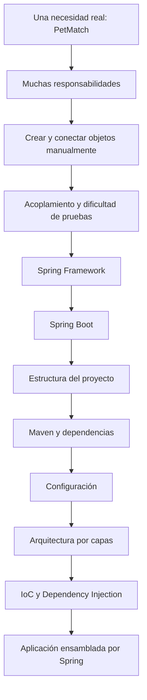

# Bloque 01 — Fundamentos

Este bloque responde una pregunta esencial:

> **¿Por qué existe Spring y cómo se organiza una aplicación Spring Boot antes de entrar en JPA, seguridad o REST?**

No empezamos memorizando anotaciones. Primero entendemos el problema que aparece cuando una aplicación Java comienza a crecer y muchas clases dependen unas de otras; después conectamos ese problema con Spring Framework, Spring Boot y la arquitectura real de PetMatch.

> [!IMPORTANT]
> Este bloque está **completo**. Los ocho capítulos forman una secuencia y se recomienda leerlos en orden la primera vez.

---

## Qué aprenderás en este bloque

Al terminar Fundamentos deberías poder explicar:

- qué problema resuelve PetMatch como aplicación;
- qué responsabilidades principales aparecen en su flujo;
- qué ocurre si intentamos construir una aplicación creciente creando objetos manualmente;
- qué significa acoplamiento en un ejemplo concreto;
- por qué separar responsabilidades facilita cambios y pruebas;
- qué son Spring Framework y Spring Boot y en qué se diferencian;
- qué papel cumplen `SpringApplication.run(...)` y `@SpringBootApplication`;
- cómo está organizado el repositorio;
- qué resuelve Maven;
- cómo interpretar las dependencias importantes de `pom.xml`;
- cómo leer `application.yaml`;
- cómo PetMatch obtiene configuración de base de datos mediante variables de entorno;
- por qué PetMatch utiliza una arquitectura por capas;
- cómo MVC y REST reutilizan la misma lógica de negocio;
- qué significan IoC, Dependency Injection, Container y Bean;
- por qué el proyecto utiliza constructor injection;
- cómo `SecurityConfig` produce un Bean que después consume `UserService`;
- cómo component scanning, auto-configuración, configuración externa y DI se conectan durante el arranque.

---

## Prerrequisitos

Antes de entrar en este bloque basta con comprender en Java:

- clase;
- objeto;
- constructor;
- método;
- atributo;
- interfaz a nivel básico.

No necesitas conocer Spring.

Si todavía no has leído la guía general, empieza por:

**[Cómo usar este libro](../00-como-usar-este-libro.md)**

---

## Capítulos

### Disponibles

1. [PetMatch y el problema](01-petmatch-y-el-problema.md)
2. [Antes de Spring](02-antes-de-spring.md)
3. [Spring y Spring Boot](03-spring-y-spring-boot.md)
4. [Estructura del proyecto](04-estructura-del-proyecto.md)
5. [Maven y dependencias](05-maven-y-dependencias.md)
6. [Configuración y `application.yaml`](06-configuracion-y-application-yaml.md)
7. [Arquitectura por capas](07-arquitectura-por-capas.md)
8. [Inyección de dependencias en PetMatch](08-inyeccion-de-dependencias.md)

---

## El recorrido mental del bloque



> [!NOTE]
> Algunos conceptos aparecen primero como problema o intuición y después se formalizan. La intención es que cada término técnico llegue cuando ya exista una necesidad concreta que lo haga comprensible.

---

## Archivos reales que deberías reconocer al terminar

Durante este bloque aparecen, entre otros:

```text
pom.xml
.mvn/wrapper/maven-wrapper.properties
src/main/resources/application.yaml
src/main/java/com/petmatch/community/PetMatchCommunityApplication.java
src/main/java/com/petmatch/community/config/SecurityConfig.java
src/main/java/com/petmatch/community/controller/PetController.java
src/main/java/com/petmatch/community/controller/api/PetRestController.java
src/main/java/com/petmatch/community/service/PetService.java
src/main/java/com/petmatch/community/service/UserService.java
src/main/java/com/petmatch/community/repository/PetRepository.java
src/main/java/com/petmatch/community/model/Pet.java
```

Al terminar no necesitas dominar aún JPA, MVC, Thymeleaf o Security en profundidad, pero sí deberías poder responder:

```text
¿qué responsabilidad tiene esta clase?
¿quién la crea o administra?
¿de qué depende?
¿en qué parte del flujo participa?
¿qué configuración necesita?
```

---

## Una regla para este bloque

Cuando encuentres una anotación como:

```java
@Controller
@Service
@Bean
@SpringBootApplication
```

no la memorices aislada.

Pregunta primero:

> **¿qué problema resuelve, qué objeto participa y cómo se conecta con el resto de la aplicación?**

Ese enfoque será el mismo durante todo el libro.

---

## Actividad de cierre

### 🛠 Recorre una funcionalidad sin ejecutar la aplicación

Abre:

```text
PetMatchCommunityApplication.java
PetController.java
PetRestController.java
PetService.java
PetRepository.java
UserService.java
SecurityConfig.java
application.yaml
pom.xml
```

Explica con tus propias palabras:

1. cómo arranca PetMatch;
2. qué papel tiene Maven;
3. dónde obtiene la configuración de base de datos;
4. quién recibe `/pets` en la web;
5. quién recibe `/api/v1/pets` en REST;
6. qué Service comparten ambos Controllers;
7. de qué depende `PetService`;
8. cómo llega `PasswordEncoder` a `UserService`;
9. por qué `PetRepository` puede inyectarse aunque sea una interfaz;
10. qué parte pertenece a presentación, negocio y persistencia.

Si puedes explicar ese recorrido sin reducirlo a “Spring hace magia”, el objetivo del bloque se cumplió.

---

## Resultado esperado

Al finalizar Fundamentos, PetMatch debería dejar de parecerte “muchas carpetas de Spring” y empezar a verse como un sistema de responsabilidades conectadas:

```text
Spring Boot arranca
↓
Maven aporta capacidades
↓
la configuración prepara infraestructura
↓
Spring descubre y conecta Beans
↓
Controller recibe HTTP
↓
Service ejecuta el caso de uso
↓
Repository accede a persistencia
```

Ese mapa conceptual es necesario antes de estudiar cómo las clases del dominio se convierten en entidades persistentes.

---

## Continúa con

Puedes recorrer el bloque completo desde:

- [Capítulo 01 — PetMatch y el problema](01-petmatch-y-el-problema.md)
- [Capítulo 02 — Antes de Spring](02-antes-de-spring.md)
- [Capítulo 03 — Spring y Spring Boot](03-spring-y-spring-boot.md)
- [Capítulo 04 — Estructura del proyecto](04-estructura-del-proyecto.md)
- [Capítulo 05 — Maven y dependencias](05-maven-y-dependencias.md)
- [Capítulo 06 — Configuración y `application.yaml`](06-configuracion-y-application-yaml.md)
- [Capítulo 07 — Arquitectura por capas](07-arquitectura-por-capas.md)
- [Capítulo 08 — Inyección de dependencias](08-inyeccion-de-dependencias.md)

El siguiente bloque ya está disponible:

**[Bloque 02 — Dominio y persistencia →](../02-dominio-y-persistencia/README.md)**

Comienza con:

**[Capítulo 09 — Modelo de dominio →](../02-dominio-y-persistencia/09-modelo-de-dominio.md)**

---

[← Cómo usar este libro](../00-como-usar-este-libro.md) · [Índice general](../README.md) · [Empezar → Capítulo 01](01-petmatch-y-el-problema.md) · [Siguiente bloque → Dominio y persistencia](../02-dominio-y-persistencia/README.md)
