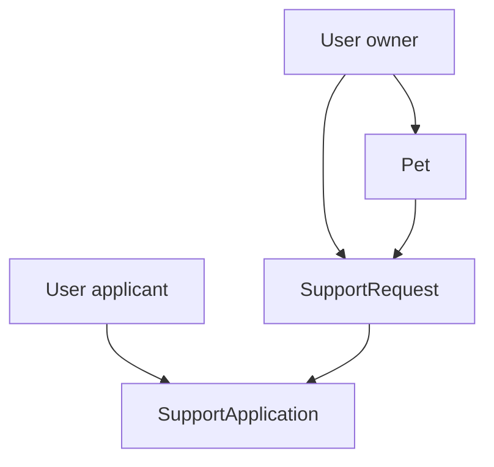
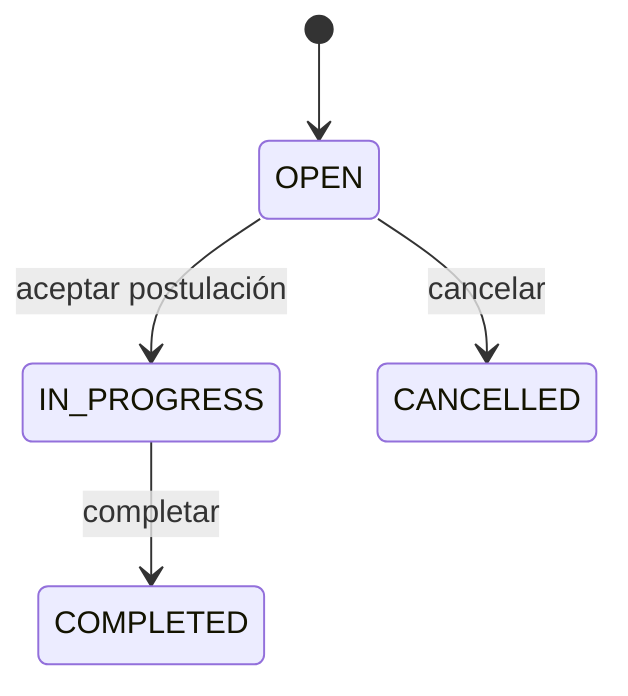
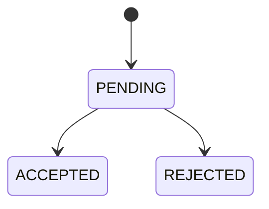
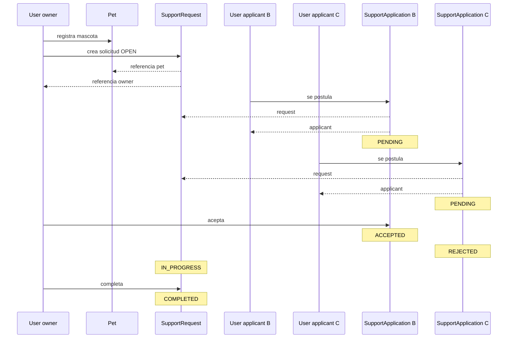

# 09 — Modelo de dominio

Hasta ahora hemos hablado de Spring, configuración y arquitectura. Pero una aplicación no existe para demostrar frameworks: existe para representar y resolver un problema.

En PetMatch Community, ese problema gira alrededor de usuarios que tienen mascotas, publican solicitudes de apoyo y reciben postulaciones de otros usuarios.

La pregunta central de este capítulo es:

> **¿Cómo convertimos ese problema real en un modelo que el software pueda entender sin perder el significado del dominio?**

La respuesta empieza por cuatro conceptos principales:

```text
User
Pet
SupportRequest
SupportApplication
```

Antes de aprender JPA, necesitamos entender qué representa cada uno y cómo se relacionan.

---

# 1. ¿Qué es un dominio?

En desarrollo de software, el **dominio** es el área del problema que la aplicación intenta representar y resolver.

En PetMatch el dominio no es:

```text
Spring Boot
JPA
HTTP
Thymeleaf
```

Esos son mecanismos técnicos.

El dominio es algo más cercano a:

```text
personas
mascotas
solicitudes de apoyo
postulaciones
aceptación o rechazo
estados de una solicitud
```

La tecnología existe para implementar ese dominio.

---

# 2. ¿Qué es un modelo de dominio?

Un **modelo de dominio** es una representación en software de los conceptos relevantes del problema y de las relaciones y reglas que existen entre ellos.

No intenta representar todo el mundo real.

Representa solo lo necesario para el alcance de la aplicación.

Por ejemplo, una mascota real tiene una enorme cantidad de características:

```text
peso
vacunas
raza
microchip
historial veterinario
alimentación
color
```

Pero `Pet` en PetMatch solo mantiene:

```text
id
name
species
age
description
owner
supportRequests
```

Eso no significa que el modelo sea “incompleto” en sentido negativo.

Significa que está recortado al problema que PetMatch necesita resolver.

---

# 3. El núcleo del dominio de PetMatch

Las cuatro entidades persistentes principales son:

```text
User
Pet
SupportRequest
SupportApplication
```

Podemos leerlas como una historia:

```text
User
  └── tiene Pet
          └── recibe SupportRequest
                  └── recibe SupportApplication de otros User
```

Pero hay una precisión importante:

`SupportRequest` también almacena directamente su `owner`.

Entonces el modelo real es:



---

# 4. `User`: la identidad del participante

Ruta:

```text
src/main/java/com/petmatch/community/model/User.java
```

Campos reales:

```java
private Long id;
private String name;
private String email;
private String passwordHash;
private Role role;
private boolean active;
private LocalDateTime registeredAt;
```

Asociaciones:

```java
private List<Pet> pets = new ArrayList<>();
private List<SupportRequest> supportRequests = new ArrayList<>();
private List<SupportApplication> supportApplications = new ArrayList<>();
```

## ¿Qué representa?

Un usuario registrado capaz de:

- autenticarse;
- ser propietario de mascotas;
- crear solicitudes de apoyo;
- postularse a solicitudes de otros usuarios.

---

# 5. Identidad de `User`

Código real:

```java
@Id
@GeneratedValue(strategy = GenerationType.IDENTITY)
private Long id;
```

Aunque todavía no estudiamos JPA en detalle, podemos interpretar el significado del dominio:

```text
cada User persistido tiene una identidad propia
```

No debemos usar el email como si fuera la identidad técnica primaria simplemente porque sea único.

El modelo distingue:

```text
id
```

de:

```text
email
```

El email tiene una restricción única, pero el identificador de la entidad es `id`.

---

# 6. El email como restricción de negocio/datos

`User` declara:

```java
@Table(
    name = "users",
    uniqueConstraints = @UniqueConstraint(
        name = "uk_users_email",
        columnNames = "email"
    )
)
```

Y el campo:

```java
@NotBlank
@Email
@Size(max = 150)
@Column(nullable = false, length = 150)
private String email;
```

Aquí observamos varias capas de preocupación:

```text
valor con formato de email
+
longitud máxima
+
columna obligatoria
+
restricción UNIQUE en base de datos
```

Además `UserService` verifica previamente si el email ya existe antes de persistir.

Eso nos muestra una idea que profundizaremos después:

> una misma regla importante puede tener protección en más de un nivel.

---

# 7. `passwordHash`, no `password`

El modelo no contiene:

```java
private String password;
```

Contiene:

```java
@Column(name = "password_hash", nullable = false, length = 255)
private String passwordHash;
```

Eso refleja una decisión importante del dominio técnico de autenticación:

```text
la entidad persistida guarda el resultado codificado
no la contraseña en texto plano
```

La transformación ocurre antes, en `UserService`, usando `PasswordEncoder`.

No profundizaremos todavía en seguridad; aquí importa entender que **el modelo persistido refleja una decisión de seguridad**.

---

# 8. `Role`

`User` contiene:

```java
private Role role;
```

El enum real es:

```java
public enum Role {
    USER,
    ADMIN
}
```

Por tanto el modelo contempla dos valores posibles.

> [!IMPORTANT]
> Que exista `Role.ADMIN` no significa que el repositorio tenga un módulo administrativo completo. El rol y una regla `/admin/**` existen, pero la implementación actual no incluye un módulo administrativo completo.

---

# 9. Valores iniciales de `User`

Código real:

```java
@PrePersist
void initializeDefaults() {
    if (role == null) {
        role = Role.USER;
    }
    active = true;
    if (registeredAt == null) {
        registeredAt = LocalDateTime.now();
    }
}
```

Antes de persistirse por primera vez:

```text
role → USER si no fue definido
active → true
registeredAt → fecha/hora actual si falta
```

Esto es parte del comportamiento de inicialización del objeto persistente.

Más adelante veremos qué significa exactamente `@PrePersist`.

---

# 10. `Pet`: una mascota perteneciente a un usuario

Ruta:

```text
src/main/java/com/petmatch/community/model/Pet.java
```

Campos:

```java
private Long id;
private String name;
private String species;
private Integer age;
private String description;
private User owner;
private List<SupportRequest> supportRequests = new ArrayList<>();
```

## ¿Qué representa?

Una mascota registrada por un usuario autenticado.

PetMatch no modela una mascota huérfana o global sin propietario.

La relación `owner` es obligatoria.

---

# 11. ¿Por qué `Pet` necesita `owner`?

Código real:

```java
@NotNull
@ManyToOne(fetch = FetchType.LAZY, optional = false)
@JoinColumn(name = "owner_id", nullable = false)
private User owner;
```

Desde el dominio:

```text
Pet no existe en PetMatch de forma independiente de un User owner
```

Desde las reglas de aplicación, esto permite preguntar:

```text
¿esta mascota pertenece al usuario autenticado?
```

Eso es fundamental para ownership.

Por ejemplo `PetService` busca:

```java
petRepository.findByIdAndOwnerId(petId, owner.getId())
```

No basta con conocer el id de la mascota.

El dominio necesita saber **quién la posee**.

---

# 12. ¿Por qué `species` es `String` y no enum?

El modelo real contiene:

```java
private String species;
```

No existe un `Species` enum en el proyecto.

Eso significa que PetMatch permite representar la especie como texto dentro de sus validaciones de longitud.

Podría haberse diseñado con un enum o catálogo, pero eso sería una alternativa, no la implementación actual.

> [!NOTE]
> Una decisión de modelado siempre implica trade-offs. Un `String` es flexible; un enum restringiría valores. El proyecto actual eligió flexibilidad.

---

# 13. `SupportRequest`: la necesidad publicada

Ruta:

```text
src/main/java/com/petmatch/community/model/SupportRequest.java
```

Campos principales:

```java
private Long id;
private String title;
private String description;
private SupportType supportType;
private LocalDateTime createdAt;
private LocalDateTime serviceDate;
private SupportRequestStatus status;
private Pet pet;
private User owner;
private List<SupportApplication> applications = new ArrayList<>();
```

Esta entidad es el centro del flujo funcional.

Representa una solicitud publicada por el propietario de una mascota para recibir un tipo de apoyo en una fecha determinada.

---

# 14. `SupportType`

Enum real:

```java
public enum SupportType {
    WALK,
    TEMPORARY_CARE,
    FEEDING,
    COMPANIONSHIP,
    TRANSPORTATION,
    OTHER
}
```

Estos son los únicos valores implementados actualmente.

Podemos interpretarlos como:

| Valor | Idea funcional |
|---|---|
| `WALK` | paseo |
| `TEMPORARY_CARE` | cuidado temporal |
| `FEEDING` | alimentación |
| `COMPANIONSHIP` | compañía |
| `TRANSPORTATION` | transporte |
| `OTHER` | otro tipo de apoyo |

El enum evita guardar cualquier texto arbitrario como tipo de apoyo.

---

# 15. `createdAt` vs `serviceDate`

`SupportRequest` distingue:

```java
private LocalDateTime createdAt;
private LocalDateTime serviceDate;
```

No representan lo mismo.

## `createdAt`

```text
cuándo se creó la solicitud
```

## `serviceDate`

```text
cuándo se necesita el apoyo
```

Esta diferencia parece pequeña, pero es importante para el dominio.

Una solicitud puede crearse hoy para un servicio futuro.

---

# 16. Estado inicial de una solicitud

Código real:

```java
@PrePersist
void initializeDefaults() {
    if (createdAt == null) {
        createdAt = LocalDateTime.now();
    }
    if (status == null) {
        status = SupportRequestStatus.OPEN;
    }
}
```

Una nueva solicitud comienza en:

```text
OPEN
```

No empieza en `IN_PROGRESS` ni `COMPLETED`.

Esto refleja una regla natural del proceso:

```text
crear solicitud
→ todavía está abierta para recibir postulaciones
```

---

# 17. Estados de `SupportRequest`

Enum real:

```java
public enum SupportRequestStatus {
    OPEN,
    IN_PROGRESS,
    COMPLETED,
    CANCELLED
}
```

Una primera lectura:



> [!NOTE]
> Este diagrama refleja las transiciones principales implementadas por los Services actuales. El capítulo 15 estudiará formalmente las máquinas de estado y qué transiciones están permitidas.

---

# 18. ¿Por qué `SupportRequest` tiene `pet` y `owner`?

Código real:

```java
private Pet pet;
private User owner;
```

A primera vista alguien podría decir:

> “Si Pet ya tiene owner, guardar owner también en SupportRequest parece redundante”.

Pero el modelo actual lo hace explícitamente.

Eso permite consultar y proteger solicitudes directamente por su propietario sin tener que depender siempre de navegar:

```text
request → pet → owner
```

En el código se utilizan queries como:

```text
findByIdAndOwnerId(...)
```

El diseño prioriza tener ownership explícito en la propia solicitud.

> [!IMPORTANT]
> Las explicaciones de este capítulo corresponden al modelo implementado actualmente en el código.

---

# 19. `SupportApplication`: una postulación

Ruta:

```text
src/main/java/com/petmatch/community/model/SupportApplication.java
```

Campos:

```java
private Long id;
private String message;
private LocalDateTime appliedAt;
private SupportApplicationStatus status;
private User applicant;
private SupportRequest supportRequest;
```

## ¿Qué representa?

La intención de un usuario de ayudar en una solicitud concreta.

No es un mensaje de chat ni una tarea independiente.

Es una relación con estado entre:

```text
User applicant
+
SupportRequest
```

---

# 20. La postulación como entidad, no simple many-to-many

Podríamos imaginar una relación conceptual:

```text
muchos User
↔
muchas SupportRequest
```

Pero PetMatch no usa una tabla intermedia anónima.

Usa una entidad completa:

```text
SupportApplication
```

¿Por qué?

Porque la relación tiene información propia:

```text
message
appliedAt
status
```

Cuando una relación entre dos conceptos necesita atributos y comportamiento propio, suele ser más expresivo modelarla como entidad.

---

# 21. Estado inicial de una postulación

Código real:

```java
@PrePersist
void initializeDefaults() {
    if (appliedAt == null) {
        appliedAt = LocalDateTime.now();
    }
    if (status == null) {
        status = SupportApplicationStatus.PENDING;
    }
}
```

Toda nueva postulación comienza como:

```text
PENDING
```

Después podrá llegar a:

```text
ACCEPTED
```

o:

```text
REJECTED
```

---

# 22. Estados de `SupportApplication`

Enum real:

```java
public enum SupportApplicationStatus {
    PENDING,
    ACCEPTED,
    REJECTED
}
```

Mapa básico:



La aceptación de una postulación además cambia el estado de la solicitud principal.

Eso demuestra que el modelo no son entidades aisladas; sus estados están coordinados por reglas de negocio.

---

# 23. La restricción más importante de `SupportApplication`

La tabla declara:

```java
@UniqueConstraint(
    name = "uk_support_applications_applicant_request",
    columnNames = {"applicant_id", "support_request_id"}
)
```

Significado:

```text
un mismo applicant
no puede tener dos filas de postulación
para la misma support request
```

Conceptualmente:

```text
(applicant_id, support_request_id)
→ combinación única
```

Esto protege la regla incluso a nivel de base de datos.

El Service además evita duplicados antes de llegar a esa restricción.

---

# 24. Un mismo `User` puede tener dos roles en el dominio

No hablamos aquí de `Role.USER`/`Role.ADMIN`, sino de **roles funcionales dentro de una interacción**.

Un usuario puede ser:

```text
owner
```

de una solicitud.

Otro puede ser:

```text
applicant
```

En una interacción distinta, esos papeles pueden invertirse.

El mismo `User` puede publicar una solicitud propia y postularse a solicitudes de otros usuarios.

Esto es más flexible que crear clases distintas como:

```text
OwnerUser
ApplicantUser
```

que el proyecto no necesita.

---

# 25. Modelo completo del flujo MVP



Este flujo será reutilizado durante todo el libro.

---

# 26. ¿Dónde están las reglas del dominio?

No todas las reglas viven dentro de las entidades.

En PetMatch muchas reglas se implementan en Services.

Por ejemplo:

```text
no postularse a la propia solicitud
no postularse dos veces
solo aceptar una postulación PENDING
aceptar → request IN_PROGRESS
otras PENDING → REJECTED
```

Eso significa que el modelo de dominio del proyecto se distribuye entre:

```text
Entities
+
Enums
+
Services
+
restricciones de base de datos
```

No debemos reducir “dominio” a la carpeta `model/`.

---

# 27. Entity vs DTO

Este punto es crítico.

`Pet` es una Entity persistente.

Pero el formulario web usa:

```text
PetForm
```

Y la API usa:

```text
PetApiRequest
PetApiResponse
```

Entonces:

```text
Pet
≠
PetForm
≠
PetApiRequest
≠
PetApiResponse
```

Todos hablan de la misma parte funcional, pero tienen responsabilidades distintas.

La Entity representa estado persistente y relaciones del dominio.

Los DTO representan contratos de entrada/salida.

Profundizaremos esta separación más adelante.

---

# 28. Validación del modelo vs reglas de negocio

Las entidades contienen anotaciones como:

```java
@NotBlank
@Size(max = 100)
@NotNull
@Min(0)
```

Estas restricciones expresan condiciones estructurales.

Pero una regla como:

```text
no puedes postularte a tu propia solicitud
```

no puede representarse simplemente con:

```java
@NotNull
```

Necesita comparar objetos y contexto.

Por eso aparece en el Service.

Una separación útil:

```text
restricción estructural
→ validación

regla contextual del caso de uso
→ Service
```

---

# 29. Los enums evitan estados arbitrarios

Sin enum podríamos modelar:

```java
private String status;
```

Y accidentalmente guardar:

```text
"OPENN"
"done"
"accepted maybe"
```

Con enum, Java restringe los valores válidos del tipo.

PetMatch usa:

```text
Role
SupportType
SupportRequestStatus
SupportApplicationStatus
```

Eso mejora expresividad y reduce estados textuales inválidos dentro del código.

---

# 30. ¿Por qué persistir enums como STRING?

Las entidades utilizan:

```java
@Enumerated(EnumType.STRING)
```

Por ejemplo:

```java
@Enumerated(EnumType.STRING)
@Column(nullable = false, length = 20)
private SupportRequestStatus status;
```

Eso hace que la base de datos represente valores como:

```text
OPEN
IN_PROGRESS
COMPLETED
CANCELLED
```

En lugar de depender de posiciones numéricas del enum.

Esto será explicado técnicamente en el siguiente capítulo, pero ya podemos apreciar la intención: el valor persistido conserva significado legible.

---

# 31. Objetos obligatorios vs opcionales

El modelo expresa varias asociaciones como obligatorias.

Ejemplo `Pet.owner`:

```java
@NotNull
@ManyToOne(fetch = FetchType.LAZY, optional = false)
@JoinColumn(name = "owner_id", nullable = false)
private User owner;
```

Hay protección en varios niveles:

```text
@NotNull
optional = false
nullable = false
```

Aunque pertenecen a mecanismos diferentes, todos apuntan a una misma idea del dominio:

```text
una mascota debe tener owner
```

---

# 32. ¿Qué campos sí pueden ser nulos?

Por ejemplo `Pet.description`:

```java
@Size(max = 1000)
@Column(length = 1000)
private String description;
```

No tiene:

```text
@NotNull
nullable = false
```

Por tanto el modelo permite ausencia de descripción.

Lo mismo ocurre con el `message` de una postulación.

Esto también es dominio:

```text
mensaje opcional
≠
solicitud sin applicant
```

---

# 33. ¿Por qué los timestamps no tienen setters públicos?

`registeredAt`, `createdAt` y `appliedAt` tienen getter, pero no setters públicos equivalentes en las entidades mostradas.

Su valor se establece automáticamente antes de persistir.

Eso evita que el código normal trate esos timestamps como atributos arbitrariamente editables.

La ausencia de setter también comunica intención.

---

# 34. Entidades mutables

Las entidades de PetMatch sí contienen setters para muchos campos:

```text
name
species
age
description
status
pet
owner
```

No siguen un modelo completamente inmutable.

Por ejemplo `PetService.update(...)` obtiene una entidad y modifica campos mediante setters.

Eso tendrá importancia cuando estudiemos JPA y dirty checking.

---

# 35. ¿Qué NO modela PetMatch?

El modelo actual no incluye entidades como:

```text
ChatMessage
Payment
Adoption
StoreProduct
Inventory
PetImage
Geolocation
Notification
Review
```

Por tanto el libro no las tratará como componentes existentes.

Esto mantiene el alcance real:

```text
apoyo temporal comunitario para mascotas
```

---

# 36. Cómo evaluar un modelo de dominio

Cuando diseñes otro proyecto, no copies las cuatro entidades de PetMatch.

Haz preguntas como:

1. ¿Cuáles son los sustantivos importantes del problema?
2. ¿Cuáles tienen identidad propia?
3. ¿Cuáles necesitan persistirse?
4. ¿Qué relaciones existen?
5. ¿Qué información pertenece a la relación misma?
6. ¿Qué estados son válidos?
7. ¿Qué transiciones existen?
8. ¿Qué combinaciones deben ser únicas?
9. ¿Qué información es obligatoria?
10. ¿Qué reglas no pueden expresarse solo con columnas?

Ese proceso produce un modelo; copiar tablas no.

---

# 37. ⚠️ Errores frecuentes

## Error 1 — Diseñar desde las pantallas

“Necesito una pantalla de mascotas, entonces creo una tabla `pet_screen`”.

Incorrecto.

Las pantallas son interfaces. El modelo representa el problema.

## Error 2 — Confundir Entity con DTO

Una Entity no debería definirse únicamente según los campos que necesita un formulario.

## Error 3 — Crear una clase por cada rol temporal

Owner y applicant son papeles que un mismo `User` puede asumir según la interacción.

## Error 4 — Usar `String` para cualquier estado

Si existe un conjunto cerrado y significativo, un enum puede representar mejor el dominio.

## Error 5 — Inventar atributos “porque una mascota real los tiene”

El modelo solo necesita lo que el alcance funcional requiere.

## Error 6 — Creer que todas las reglas deben estar dentro de la Entity

PetMatch implementa muchas reglas de casos de uso en Services.

## Error 7 — Creer que `Role.ADMIN` implica un módulo administrativo

No. El enum existe; la funcionalidad administrativa completa no aparece en el árbol actual.

## Error 8 — Confundir relación conceptual con cascade

Que `User` tenga muchas mascotas no significa que eliminar un usuario borre automáticamente mascotas en este proyecto.

---

# 38. 🛠 Prueba en el código

## Actividad 1 — Reconstruye el modelo

Sin mirar el diagrama de este capítulo, abre:

```text
User.java
Pet.java
SupportRequest.java
SupportApplication.java
```

y dibuja las relaciones.

Marca:

```text
1
0..*
```

según corresponda.

## Actividad 2 — Clasifica atributos

Para cada entidad, separa:

```text
identidad
atributos propios
enums
fechas
relaciones
```

## Actividad 3 — Busca restricciones únicas

Encuentra en el código:

```text
uk_users_email
uk_support_applications_applicant_request
```

Explica qué problema del dominio protege cada una.

## Actividad 4 — Inicialización automática

Busca todos los métodos:

```java
@PrePersist
void initializeDefaults()
```

y construye una tabla:

| Entity | Valor inicial |
|---|---|
| User | ... |
| SupportRequest | ... |
| SupportApplication | ... |

## Actividad 5 — Busca opcionales

Compara:

```text
Pet.description
SupportApplication.message
```

con:

```text
Pet.owner
SupportRequest.pet
SupportRequest.owner
SupportApplication.applicant
```

Explica cuáles son opcionales en el modelo actual.

---

# 39. 🧪 Comprueba que entendiste

1. ¿Qué diferencia hay entre dominio y tecnología?
2. ¿Cuáles son las cuatro entidades principales de PetMatch?
3. ¿Por qué `SupportApplication` merece ser entidad y no una simple lista de ids?
4. ¿Qué información propia tiene una postulación?
5. ¿Cuáles son los estados de una solicitud?
6. ¿Cuáles son los estados de una postulación?
7. ¿Qué tipos de apoyo existen actualmente?
8. ¿Qué rol recibe por defecto un usuario nuevo?
9. ¿Qué estado recibe una solicitud nueva?
10. ¿Qué estado recibe una postulación nueva?
11. ¿Qué combinación es UNIQUE en `SupportApplication`?
12. ¿Por qué `SupportRequest` guarda `owner` además de `pet`?
13. ¿Entity y DTO son sinónimos?
14. ¿PetMatch modela imágenes de mascota actualmente?
15. ¿Que `User` tenga muchas mascotas implica cascade automático?

### Respuestas esperadas

1. El dominio representa el problema; la tecnología implementa mecanismos para resolverlo.
2. `User`, `Pet`, `SupportRequest`, `SupportApplication`.
3. Porque la relación tiene `message`, `appliedAt` y `status` propios.
4. Mensaje, fecha de postulación, estado, applicant y request.
5. `OPEN`, `IN_PROGRESS`, `COMPLETED`, `CANCELLED`.
6. `PENDING`, `ACCEPTED`, `REJECTED`.
7. `WALK`, `TEMPORARY_CARE`, `FEEDING`, `COMPANIONSHIP`, `TRANSPORTATION`, `OTHER`.
8. `USER`.
9. `OPEN`.
10. `PENDING`.
11. `applicant_id + support_request_id`.
12. El modelo hace ownership explícito y permite consultas/reglas directas por owner.
13. No.
14. No.
15. No; no hay cascade explícito declarado en esas asociaciones.

---

# 40. ✅ Qué debes recordar

- **El dominio es el problema; Spring es infraestructura.**
- El núcleo persistente de PetMatch es `User`, `Pet`, `SupportRequest` y `SupportApplication`.
- El modelo solo representa atributos necesarios para el alcance actual.
- `User` puede ser owner o applicant según la interacción.
- `Pet` pertenece obligatoriamente a un `User`.
- `SupportRequest` pertenece a una `Pet` y a un `User owner`.
- `SupportApplication` conecta un applicant con una solicitud y tiene datos propios.
- Las solicitudes comienzan en `OPEN`; las postulaciones en `PENDING`.
- Los estados y tipos se modelan con enums.
- El email es único y la combinación applicant/request también es única.
- Entity, DTO y View son responsabilidades diferentes.
- Muchas reglas de negocio viven en Services, no únicamente en entidades.
- El modelo actual no contiene imágenes, pagos, chat ni adopción.
- Las relaciones actuales no declaran cascade explícito.

---

# 🔗 Continúa con

Ya entendemos **qué objetos existen y por qué**.

Ahora necesitamos responder:

> **¿Cómo consigue Java que esos objetos puedan guardarse y recuperarse desde tablas relacionales sin escribir manualmente todo el SQL y toda la conversión objeto↔fila?**

Eso nos lleva a:

**[Capítulo 10 — JPA y Hibernate →](10-jpa-y-hibernate.md)**

---

[← Índice del bloque](README.md) · [Índice general](../README.md) · [Siguiente → Capítulo 10](10-jpa-y-hibernate.md)
