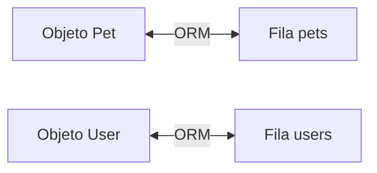
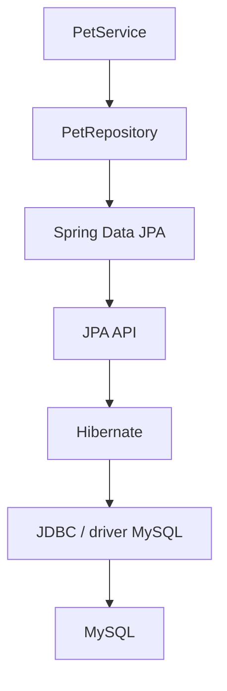
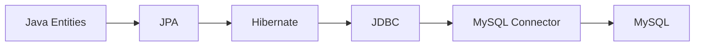
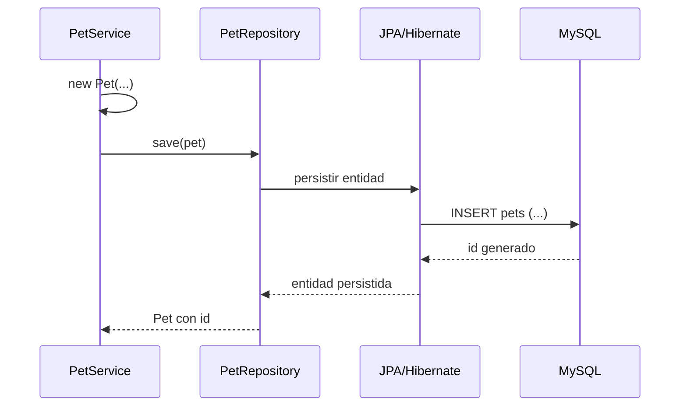
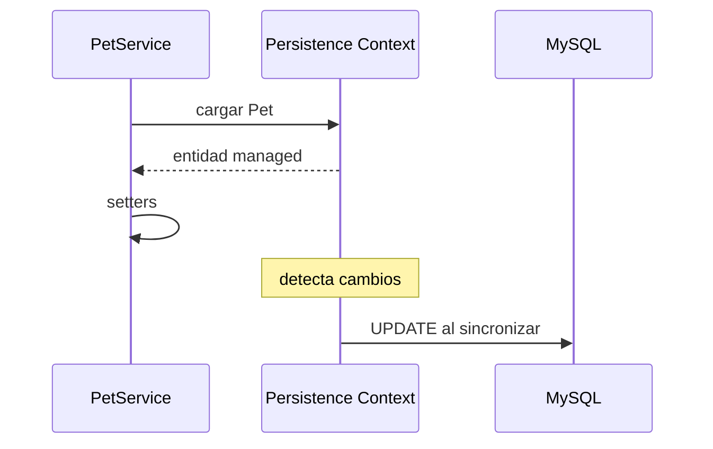

# 10 — JPA y Hibernate

En el capítulo anterior construimos el modelo de dominio de PetMatch sin reducirlo a tablas ni anotaciones.

Ahora aparece el siguiente problema:

> **¿Cómo hacemos para que objetos Java como `User`, `Pet`, `SupportRequest` y `SupportApplication` puedan persistirse en una base de datos relacional?**

Podríamos escribir JDBC y SQL manualmente para cada operación.

Pero PetMatch utiliza otro enfoque:

```text
JPA
+
Hibernate
+
Spring Data JPA
```

En este capítulo aprenderemos qué significa cada pieza y cómo aparecen en las entidades reales del proyecto.

> [!IMPORTANT]
> **JPA, Hibernate y Spring Data JPA no son sinónimos.** Entender sus responsabilidades por separado evita mucha confusión posterior.

---

# 1. El problema objeto ↔ tabla

En Java trabajamos con objetos:

```java
Pet pet = new Pet(...);
```

En una base de datos relacional trabajamos con filas y columnas:

```text
pets
-----------------------------------------
id | name | species | age | owner_id | ...
```

Los modelos no son idénticos.

Java tiene:

```text
objetos
referencias
colecciones
enums
herencia
tipos
```

SQL tiene:

```text
tablas
filas
columnas
primary keys
foreign keys
constraints
```

Alguien debe convertir entre ambos mundos.

---

# 2. ¿Qué es ORM?

**ORM** significa:

```text
Object-Relational Mapping
```

Es una técnica para mapear objetos de un lenguaje orientado a objetos a estructuras de una base de datos relacional.

Una representación simplificada:



El ORM intenta resolver preguntas como:

```text
¿Qué tabla representa esta clase?
¿Qué columna representa este campo?
¿Cuál es la primary key?
¿Cómo se representa una referencia a otro objeto?
¿Cómo se convierte un enum?
¿Cómo se detectan cambios?
```

---

# 3. ¿Qué es JPA?

JPA significa:

```text
Jakarta Persistence API
```

Es una **especificación/API estándar** para persistencia ORM en Java/Jakarta.

JPA define conceptos, contratos y anotaciones como:

```java
@Entity
@Id
@Table
@Column
@ManyToOne
@OneToMany
@JoinColumn
@Enumerated
@PrePersist
```

En PetMatch los imports confirman que se utiliza la API Jakarta Persistence:

```java
import jakarta.persistence.Entity;
import jakarta.persistence.Id;
import jakarta.persistence.ManyToOne;
```

JPA define **cómo debería expresarse** el mapeo y el modelo de persistencia.

Pero JPA por sí sola no es la implementación que ejecuta todo ese comportamiento.

---

# 4. ¿Qué es Hibernate?

Hibernate es una implementación ORM ampliamente utilizada que implementa las capacidades de persistencia definidas por Jakarta Persistence y aporta funcionalidades adicionales propias.

En PetMatch, Hibernate llega a través del stack de Spring Data JPA/Spring Boot.

La relación mental correcta es:

```text
JPA
→ contrato/especificación

Hibernate
→ implementación ORM que ejecuta ese contrato
```

Una analogía aproximada:

```text
interfaz
→ JPA

implementación
→ Hibernate
```

No es una equivalencia perfecta de Java, pero ayuda a separar los conceptos.

---

# 5. ¿Dónde entra Spring Data JPA?

Spring Data JPA se sitúa en otro nivel.

Ayuda a construir la capa de acceso a datos utilizando JPA mediante repositories.

PetMatch contiene interfaces como:

```java
public interface PetRepository extends JpaRepository<Pet, Long> {
```

Podemos visualizar:



Este capítulo se concentra en JPA/Hibernate. Spring Data JPA tendrá su propio capítulo 12.

---

# 6. ¿Qué aporta Maven?

El `pom.xml` real contiene:

```xml
<dependency>
    <groupId>org.springframework.boot</groupId>
    <artifactId>spring-boot-starter-data-jpa</artifactId>
</dependency>
```

Y para MySQL:

```xml
<dependency>
    <groupId>com.mysql</groupId>
    <artifactId>mysql-connector-j</artifactId>
    <scope>runtime</scope>
</dependency>
```

Esto conecta varias capas técnicas:

```text
starter-data-jpa
→ Spring Data JPA + infraestructura JPA/ORM

mysql-connector-j
→ driver JDBC de MySQL en runtime
```

---

# 7. Primera anotación: `@Entity`

Todas las entidades principales contienen:

```java
@Entity
```

Ejemplo real:

```java
@Entity
@Table(name = "pets")
public class Pet {
```

`@Entity` marca una clase como entidad persistente gestionada por JPA.

No significa simplemente:

> “esta clase es una tabla”.

Más precisamente:

> esta clase participa en el modelo de persistencia y sus instancias pueden tener identidad persistente y ser gestionadas por un contexto de persistencia.

---

# 8. `@Table`

PetMatch utiliza nombres de tabla explícitos.

Ejemplos:

```java
@Table(name = "users")
```

```java
@Table(name = "pets")
```

```java
@Table(name = "support_requests")
```

```java
@Table(name = "support_applications")
```

Esto evita depender exclusivamente de convenciones de naming para determinar el nombre físico esperado.

Mapa:

| Entity | Tabla |
|---|---|
| `User` | `users` |
| `Pet` | `pets` |
| `SupportRequest` | `support_requests` |
| `SupportApplication` | `support_applications` |

---

# 9. `@Id`: identidad persistente

Código real:

```java
@Id
@GeneratedValue(strategy = GenerationType.IDENTITY)
private Long id;
```

Aparece en las cuatro entidades.

`@Id` identifica la propiedad que funciona como primary key de la entidad.

Conceptualmente:

```text
Objeto Java
Pet{id=42, ...}

↕

Fila SQL
pets.id = 42
```

La identidad es fundamental porque JPA necesita distinguir una entidad persistida de otra.

---

# 10. `@GeneratedValue(strategy = IDENTITY)`

PetMatch usa:

```java
@GeneratedValue(strategy = GenerationType.IDENTITY)
```

Esto indica que la generación del identificador utiliza una estrategia de identidad delegada a la base de datos.

Para el aprendiz, la idea práctica es:

```text
antes de persistir
id puede ser null

tras insertar/obtener identidad
id recibe un valor generado
```

Por eso los constructores de dominio no reciben `id`.

Ejemplo:

```java
public Pet(String name, String species, Integer age, String description, User owner) {
    ...
}
```

No contiene:

```java
Long id
```

---

# 11. `@Column`

`@Column` permite expresar detalles del mapeo a una columna.

Ejemplo real:

```java
@Column(nullable = false, length = 100)
private String name;
```

Podemos leerlo:

```text
columna para name
→ no nullable
→ longitud máxima física declarada: 100
```

Otro ejemplo:

```java
@Column(name = "password_hash", nullable = false, length = 255)
private String passwordHash;
```

Aquí se define explícitamente el nombre SQL:

```text
password_hash
```

mientras la propiedad Java se llama:

```text
passwordHash
```

---

# 12. Nombre Java vs nombre SQL

El modelo muestra varias conversiones explícitas:

```text
Java               SQL
--------------------------------
passwordHash   →   password_hash
registeredAt   →   registered_at
supportType    →   support_type
createdAt      →   created_at
serviceDate    →   service_date
appliedAt      →   applied_at
```

JPA permite que el nombre orientado a objetos y el nombre relacional no tengan que ser idénticos.

---

# 13. `nullable = false` no es lo mismo que `@NotNull`

Observa:

```java
@NotNull
@Column(nullable = false)
private Integer age;
```

Estas dos anotaciones pertenecen a responsabilidades distintas.

## `@NotNull`

Viene de Bean Validation:

```text
jakarta.validation.constraints.NotNull
```

Expresa una restricción de validación.

## `nullable = false`

Forma parte del mapeo JPA:

```text
jakarta.persistence.Column
```

Expresa que la columna no debe permitir `NULL` dentro del modelo del esquema generado/mapeado.

La regla puede estar protegida en distintos niveles.

---

# 14. Longitud de validación vs longitud de columna

Ejemplo:

```java
@Size(max = 100)
@Column(nullable = false, length = 100)
private String name;
```

De nuevo vemos dos capas:

```text
@Size(max = 100)
→ validación de dato

@Column(length = 100)
→ mapeo de columna
```

Mantenerlas alineadas evita permitir en la aplicación algo que la base de datos no pueda representar correctamente.

---

# 15. Constructor protegido vacío

Las cuatro entidades tienen un constructor sin argumentos como:

```java
protected Pet() {
}
```

O:

```java
protected User() {
}
```

¿Por qué existe?

JPA necesita poder instanciar entidades mediante un constructor sin argumentos con visibilidad pública o protegida.

El proyecto lo declara `protected` para satisfacer esa necesidad sin presentarlo como el constructor principal de uso del dominio.

Luego ofrece un constructor significativo, por ejemplo:

```java
public Pet(String name, String species, Integer age, String description, User owner)
```

La idea es:

```text
constructor protegido vacío
→ infraestructura JPA

constructor público con datos necesarios
→ creación desde lógica de aplicación
```

---

# 16. ¿Qué es el contexto de persistencia?

Este es uno de los conceptos más importantes de JPA.

Un **persistence context** es un entorno en el que JPA mantiene y gestiona entidades persistentes durante una unidad de trabajo.

Dentro de ese contexto, una entidad puede estar en distintos estados.

Una simplificación útil:

```text
transient/new
managed
removed
 detached
```

No intentaremos memorizar todo el ciclo completo todavía. Nos concentraremos en el estado **managed** porque explica el comportamiento de `update(...)` en PetMatch.

---

# 17. Entidad nueva: transient

Cuando PetMatch ejecuta:

```java
Pet pet = new Pet(...);
```

acaba de crear un objeto Java.

Ese objeto todavía no representa por sí solo una fila persistida.

Después el Service llama:

```java
return petRepository.save(pet);
```

Spring Data JPA utiliza la infraestructura JPA para persistirlo.

Conceptualmente:

```text
new Pet(...)
→ objeto nuevo
→ persistencia
→ INSERT
→ entidad con id
```

El detalle exacto de `save(...)` se estudiará en el capítulo de Spring Data JPA.

---

# 18. Entidad managed

Una entidad cargada dentro de un contexto de persistencia activo puede quedar **managed**.

Eso significa que JPA/Hibernate realiza seguimiento de su estado.

Este seguimiento permite una característica muy importante:

```text
dirty checking
```

---

# 19. ¿Qué es dirty checking?

Dirty checking es el mecanismo mediante el cual Hibernate puede detectar cambios realizados sobre una entidad managed y sincronizarlos con la base de datos durante el flush/commit correspondiente.

PetMatch tiene un ejemplo excelente en:

```text
PetService.update(...)
```

Código real:

```java
@Transactional
public Pet update(Long petId, PetForm form, Authentication authentication) {
    Pet pet = findOwnedPet(petId, authentication);
    pet.setName(normalize(form.getName()));
    pet.setSpecies(normalize(form.getSpecies()));
    pet.setAge(form.getAge());
    pet.setDescription(normalizeNullable(form.getDescription()));
    return pet;
}
```

Observa lo que **no** aparece al final:

```java
petRepository.save(pet);
```

Eso es intencional.

La entidad obtenida dentro de la transacción está gestionada; Hibernate detecta los cambios y puede generar el `UPDATE` al sincronizar la transacción.

> [!IMPORTANT]
> Este comportamiento depende del contexto transaccional/persistente. No significa que cualquier objeto modificado en cualquier parte de Java se guarde mágicamente.

---

# 20. Transacción y contexto

`PetService.update(...)` está marcado:

```java
@Transactional
```

Esto ayuda a definir una unidad de trabajo dentro de la cual la entidad puede cargarse, modificarse y sincronizarse consistentemente.

El capítulo 14 estudiará transacciones con profundidad.

Por ahora conserva:

```text
transacción
→ contexto de persistencia activo
→ entidad managed
→ cambios detectables
```

---

# 21. ¿Qué es flush?

**Flush** es el proceso de sincronizar cambios pendientes del contexto de persistencia con la base de datos mediante SQL.

No es exactamente lo mismo que commit.

Simplificando:

```text
modificar entidad managed
        ↓
Hibernate detecta cambio
        ↓
flush
        ↓
SQL UPDATE/INSERT/DELETE necesario
        ↓
commit de la transacción
```

El framework puede decidir momentos de flush según el contexto y la operación.

Para un principiante, la idea importante es que no necesitas escribir manualmente un `UPDATE pets SET ...` en `PetService.update(...)`.

---

# 22. ¿JPA elimina SQL?

No.

La base de datos sigue trabajando con SQL.

Lo que cambia es quién lo construye en muchas operaciones.

Con ORM:

```text
PetService modifica objeto
→ JPA/Hibernate interpreta el cambio
→ genera/ejecuta SQL adecuado
→ MySQL modifica fila
```

Eso reduce mucho código repetitivo, pero no elimina la necesidad de entender SQL.

> [!TIP]
> Saber SQL sigue siendo muy valioso para diagnosticar rendimiento, consultas, índices, constraints y problemas de datos en aplicaciones JPA.

---

# 23. `@Enumerated(EnumType.STRING)`

PetMatch utiliza enums persistentes como:

```java
@Enumerated(EnumType.STRING)
@Column(nullable = false, length = 20)
private SupportRequestStatus status;
```

Con `EnumType.STRING`, valores Java como:

```java
SupportRequestStatus.IN_PROGRESS
```

se representan de forma textual como:

```text
IN_PROGRESS
```

---

# 24. ¿Por qué no `ORDINAL`?

La alternativa `EnumType.ORDINAL` persiste la posición numérica del enum.

Conceptualmente:

```text
OPEN = 0
IN_PROGRESS = 1
COMPLETED = 2
CANCELLED = 3
```

Eso puede ser frágil si el orden del enum cambia.

Con `STRING`, la base almacena el nombre semántico.

PetMatch eligió explícitamente:

```java
EnumType.STRING
```

para:

- `Role`;
- `SupportType`;
- `SupportRequestStatus`;
- `SupportApplicationStatus`.

---

# 25. `@PrePersist`

Algunas entidades necesitan inicializar valores justo antes de su primera persistencia.

PetMatch usa:

```java
@PrePersist
```

Ejemplo `SupportRequest`:

```java
@PrePersist
void initializeDefaults() {
    if (createdAt == null) {
        createdAt = LocalDateTime.now();
    }
    if (status == null) {
        status = SupportRequestStatus.OPEN;
    }
}
```

`@PrePersist` representa un callback del ciclo de vida JPA que se ejecuta antes de persistir por primera vez la entidad.

---

# 26. Callbacks reales de PetMatch

## `User`

Inicializa:

```text
role = USER
active = true
registeredAt = now
```

## `SupportRequest`

Inicializa:

```text
createdAt = now
status = OPEN
```

## `SupportApplication`

Inicializa:

```text
appliedAt = now
status = PENDING
```

`Pet` no declara `@PrePersist` en la implementación actual.

---

# 27. Restricciones únicas con `@Table`

`User` declara:

```java
uniqueConstraints = @UniqueConstraint(
    name = "uk_users_email",
    columnNames = "email"
)
```

`SupportApplication` declara:

```java
uniqueConstraints = @UniqueConstraint(
    name = "uk_support_applications_applicant_request",
    columnNames = {"applicant_id", "support_request_id"}
)
```

Estas restricciones forman parte del esquema relacional y protegen invariantes importantes incluso si dos operaciones concurrentes logran pasar una validación previa en aplicación.

---

# 28. `ddl-auto: update`

El archivo real:

```text
src/main/resources/application.yaml
```

contiene:

```yaml
spring:
  jpa:
    hibernate:
      ddl-auto: update
```

Eso permite que Hibernate intente actualizar el esquema en función del modelo mapeado.

Para una aplicación didáctica/desarrollo resulta cómodo.

Pero no debemos confundirlo con una estrategia de migraciones explícitas.

PetMatch no declara actualmente Flyway o Liquibase.

---

# 29. ¿Qué significa que Hibernate “genere esquema”?

A partir de metadatos como:

```java
@Table(name = "pets")
@Column(nullable = false, length = 100)
@JoinColumn(name = "owner_id", nullable = false)
```

Hibernate puede inferir estructuras SQL necesarias para el esquema según la estrategia configurada.

Eso no significa que debamos ignorar el diseño de base de datos.

Las anotaciones **son decisiones de esquema** aunque estén escritas en Java.

---

# 30. Hibernate no reemplaza MySQL

Otra confusión común:

```text
Hibernate = base de datos
```

No.

En PetMatch:

```text
Hibernate
→ ORM

MySQL
→ motor de base de datos

mysql-connector-j
→ driver JDBC
```

Mapa:



---

# 31. EntityManager: el concepto que está debajo

La API JPA utiliza `EntityManager` como interfaz central para interactuar con el contexto de persistencia.

En PetMatch no ves código de negocio escribiendo:

```java
entityManager.persist(...)
```

porque el proyecto trabaja principalmente mediante Spring Data repositories.

Pero conceptualmente Spring Data JPA utiliza la infraestructura JPA/EntityManager por debajo.

> [!NOTE]
> Que una clase no importe `EntityManager` directamente no significa que JPA no lo utilice internamente.

---

# 32. ¿Por qué no vemos implementaciones Hibernate en las Entities?

Las entidades dependen principalmente de anotaciones estándar:

```text
jakarta.persistence.*
```

Eso reduce el acoplamiento directo del modelo con APIs específicas de Hibernate.

El proveedor ORM puede ser Hibernate, pero el mapeo básico está expresado con JPA.

Esta separación es una de las razones por las que es importante distinguir especificación e implementación.

---

# 33. Persistencia automática no significa reglas automáticas

Hibernate puede persistir cambios, pero no sabe por sí solo que:

```text
una solicitud solo puede completarse si está IN_PROGRESS
```

Ni que:

```text
un usuario no puede postularse a su propia solicitud
```

Esas reglas pertenecen al dominio y son implementadas por Services.

La persistencia responde:

```text
¿cómo guardar el estado?
```

El Service responde:

```text
¿qué cambios de estado están permitidos?
```

---

# 34. Validación tampoco es persistencia

Anotaciones como:

```java
@NotBlank
@NotNull
@Size
```

pertenecen a Bean Validation.

Anotaciones como:

```java
@Entity
@Id
@Column
@ManyToOne
```

pertenecen a JPA.

En la misma clase pueden convivir, pero resuelven problemas distintos.

Tabla mental:

| Pregunta | Mecanismo |
|---|---|
| ¿Este dato cumple una restricción de entrada/modelo? | Bean Validation |
| ¿Cómo se mapea a base de datos? | JPA |
| ¿Quién ejecuta ORM? | Hibernate |
| ¿Cómo accedo mediante repositories? | Spring Data JPA |
| ¿Qué cambios permite el negocio? | Service |

---

# 35. ¿Qué ocurre al crear una mascota?

Código real simplificado:

```java
@Transactional
public Pet create(PetForm form, Authentication authentication) {
    User owner = userService.getCurrentUser(authentication);
    Pet pet = new Pet(
        normalize(form.getName()),
        normalize(form.getSpecies()),
        form.getAge(),
        normalizeNullable(form.getDescription()),
        owner
    );
    return petRepository.save(pet);
}
```

Podemos recorrer capas:



El diagrama es conceptual; Spring Data/Hibernate contienen detalles internos adicionales.

---

# 36. ¿Qué ocurre al actualizar una mascota?

PetMatch hace:

```java
Pet pet = findOwnedPet(...);
pet.setName(...);
pet.setSpecies(...);
pet.setAge(...);
pet.setDescription(...);
return pet;
```

Conceptualmente:



Este es uno de los primeros comportamientos que hace que JPA deje de parecer “solo anotaciones”.

---

# 37. ¿Qué ocurre al eliminar?

`PetService.delete(...)` llama:

```java
petRepository.delete(pet);
```

Pero antes aplica una regla:

```java
if (supportRequestRepository.existsByPetId(pet.getId())) {
    throw new PetDeletionException(pet.getId());
}
```

Esto muestra la separación:

```text
Service
→ decide si la eliminación está permitida

JPA/Hibernate
→ ejecuta la eliminación persistente cuando corresponde
```

---

# 38. No hay cascade explícito

Aunque este punto se explicará mejor en el capítulo 11, conviene registrarlo desde ahora.

Las relaciones actuales no declaran:

```java
cascade = CascadeType.ALL
```

ni otras estrategias de cascade explícitas.

Por tanto no debemos enseñar que:

```text
save(user)
→ guarda automáticamente todas sus mascotas
```

ni:

```text
delete(user)
→ borra automáticamente todo el grafo
```

Eso no está configurado de esa forma en el código actual.

---

# 39. ¿Qué significa `FetchType.LAZY`?

Varias relaciones many-to-one declaran:

```java
fetch = FetchType.LAZY
```

Eso indica que la asociación puede cargarse de forma diferida en lugar de traer siempre el objeto relacionado inmediatamente.

Por ejemplo:

```java
private User owner;
```

no necesariamente obliga a cargar todos los datos de `User` en el mismo instante de cada consulta de `Pet`.

Este mecanismo será estudiado en profundidad en el capítulo 17 junto con:

```text
open-in-view=false
EntityGraph
```

No lo reduzcas todavía a “LAZY es mejor”. Tiene ventajas, riesgos y contexto.

---

# 40. ¿Qué significa entidad detached?

Una entidad puede dejar de estar asociada al contexto de persistencia que la gestionaba.

En ese caso hablamos de una entidad **detached**.

Modificar un objeto detached no produce por sí mismo el mismo comportamiento automático que modificar una entidad managed dentro de una transacción activa.

Esto explica por qué el contexto y las transacciones importan tanto.

No necesitas dominar todavía `merge`; PetMatch trabaja de forma que sus Services transaccionales cargan y modifican entidades dentro de unidades de trabajo controladas.

---

# 41. Qué NO necesitamos en las Entities

PetMatch no contiene:

```text
@Repository dentro de Entities
SQL manual dentro de Entities
DataSource dentro de Entities
HttpServletRequest dentro de Entities
controllers dentro de Entities
```

Las Entities representan estado persistente y relaciones; no deben absorber todas las responsabilidades de la aplicación.

---

# 42. JPA y el modelo relacional siguen necesitando diseño

ORM facilita conversión, pero no evita preguntas importantes:

```text
¿Qué debe ser UNIQUE?
¿Qué foreign keys existen?
¿Qué columnas son obligatorias?
¿Qué tamaño necesitan?
¿Qué relaciones deben cargarse?
¿Qué operaciones deben estar en una transacción?
```

PetMatch ya responde varias mediante sus anotaciones.

---

# 43. ⚠️ Errores frecuentes

## Error 1 — “JPA es Hibernate”

No. JPA es la API/especificación; Hibernate es una implementación ORM utilizada por el proyecto.

## Error 2 — “Hibernate es MySQL”

No. Hibernate es ORM; MySQL es la base de datos.

## Error 3 — “`@Entity` crea automáticamente toda la lógica de negocio”

No. Define participación en persistencia.

## Error 4 — “Si modifico cualquier objeto Java, se actualiza la base”

No. Dirty checking requiere una entidad managed dentro del contexto adecuado.

## Error 5 — “Siempre debo llamar `save()` después de cada setter”

No necesariamente. El `update(...)` real de PetMatch demuestra dirty checking dentro de `@Transactional`.

## Error 6 — “`@NotNull` y `nullable=false` son exactamente lo mismo”

No. Uno pertenece a validación; el otro al mapeo de columna.

## Error 7 — “Un enum se persiste como texto automáticamente siempre”

No. PetMatch lo especifica con `@Enumerated(EnumType.STRING)`.

## Error 8 — “`ddl-auto:update` es igual a Flyway”

No.

## Error 9 — “ORM significa que ya no necesito entender SQL”

Incorrecto.

## Error 10 — “Las relaciones se guardan/borran en cascade automáticamente”

No en el modelo actual; no hay cascade explícito en esas asociaciones.

---

# 44. 🛠 Prueba en el código

## Actividad 1 — Identifica anotaciones JPA

En cada Entity busca:

```text
@Entity
@Table
@Id
@GeneratedValue
@Column
```

Haz una tabla con el uso real.

## Actividad 2 — Traduce Entity → tabla

Para `Pet`, dibuja:

```text
pets
```

con sus columnas aproximadas a partir de:

```java
name
species
age
description
owner
```

No inventes columnas que no aparecen.

## Actividad 3 — Dirty checking

Abre:

```text
PetService.update(...)
```

Responde:

1. ¿dónde se carga la entidad?
2. ¿qué setters se ejecutan?
3. ¿hay `save(pet)` al final?
4. ¿por qué puede persistirse el cambio?

## Actividad 4 — Callbacks

Busca `@PrePersist` en las cuatro Entities y registra exactamente qué campos inicializa cada una.

## Actividad 5 — Enum mapping

Busca todas las apariciones de:

```java
@Enumerated(EnumType.STRING)
```

Relaciona cada una con su enum.

---

# 45. 🧪 Comprueba que entendiste

1. ¿Qué significa ORM?
2. ¿Qué es JPA?
3. ¿Qué es Hibernate en relación con JPA?
4. ¿Qué papel cumple Spring Data JPA?
5. ¿Qué indica `@Entity`?
6. ¿Qué indica `@Id`?
7. ¿Qué estrategia de generación de ids usa PetMatch?
8. ¿Por qué las Entities tienen constructor protegido vacío?
9. ¿Qué diferencia hay entre `@NotNull` y `nullable=false`?
10. ¿Qué significa que una entidad esté managed?
11. ¿Qué es dirty checking?
12. ¿Qué método de PetMatch demuestra actualización sin `save()` explícito?
13. ¿Qué hace `@PrePersist`?
14. ¿Cómo se persisten los enums de PetMatch?
15. ¿Qué valor tiene `ddl-auto`?
16. ¿PetMatch usa Flyway/Liquibase actualmente?
17. ¿Hibernate reemplaza MySQL?
18. ¿Las relaciones actuales declaran cascade explícito?

### Respuestas esperadas

1. Object-Relational Mapping.
2. Jakarta Persistence API, especificación/API estándar para persistencia.
3. Es la implementación ORM que ejecuta el modelo JPA utilizado por el proyecto.
4. Simplifica acceso a JPA mediante repositories y abstracciones Spring Data.
5. Que la clase participa como entidad persistente JPA.
6. La propiedad de identidad/primary key.
7. `GenerationType.IDENTITY`.
8. Porque JPA necesita un constructor sin argumentos público o protegido para instanciar entidades.
9. Validación vs mapeo/constraint de columna.
10. Que el contexto de persistencia gestiona y rastrea esa entidad.
11. Detección de cambios sobre entidades managed para sincronizarlos.
12. `PetService.update(...)`.
13. Ejecuta lógica del callback justo antes de la primera persistencia.
14. Con `EnumType.STRING`.
15. `update`.
16. No.
17. No.
18. No.

---

# 46. ✅ Qué debes recordar

- **ORM conecta objetos con tablas relacionales.**
- **JPA es la API/especificación; Hibernate es la implementación ORM.**
- **Spring Data JPA agrega una capa de repositories sobre JPA.**
- `@Entity` identifica clases persistentes.
- `@Table`, `@Column`, `@Id` y `@GeneratedValue` describen mapeo relacional.
- PetMatch usa ids `Long` con `GenerationType.IDENTITY`.
- Las Entities tienen constructor protegido sin argumentos para JPA.
- Bean Validation y JPA pueden expresar restricciones relacionadas pero no son el mismo mecanismo.
- Un persistence context administra entidades.
- Una entidad managed puede participar en dirty checking.
- `PetService.update(...)` modifica una entidad managed sin un `save()` explícito final.
- `@PrePersist` inicializa valores antes de la primera persistencia.
- Los enums se persisten como `STRING`.
- Hibernate sigue ejecutando SQL contra MySQL; ORM no elimina SQL.
- `ddl-auto: update` es la configuración actual, no una solución de migraciones completa.
- Las relaciones actuales no declaran cascade explícito.

---

# 🔗 Continúa con

Ahora sabemos cómo una Entity participa en persistencia.

Pero todavía falta entender la parte más difícil del modelo:

> **¿Cómo representa JPA relaciones como “muchas mascotas pertenecen a un usuario” o “una solicitud tiene muchas postulaciones”?**

Eso nos lleva a:

**[Capítulo 11 — Relaciones JPA →](11-relaciones-jpa.md)**

---

[← Capítulo 09 — Modelo de dominio](09-modelo-de-dominio.md) · [Índice del bloque](README.md) · [Índice general](../README.md) · [Siguiente → Capítulo 11](11-relaciones-jpa.md)
