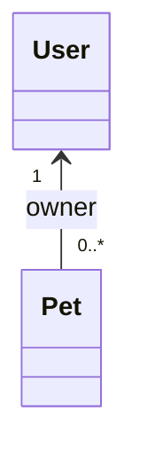
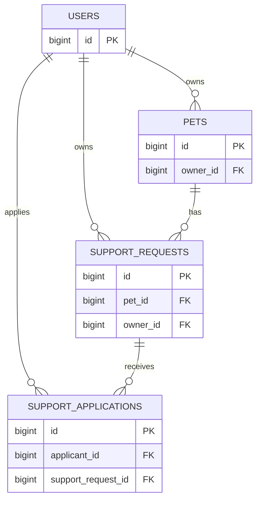

# 11 — Relaciones JPA

En el capítulo anterior vimos cómo una clase Java se convierte en una Entity persistente y cómo Hibernate puede mapear atributos simples a columnas.

Ahora llegamos a una parte más desafiante:

> **¿Cómo se representa en objetos Java una relación que en SQL utiliza foreign keys?**

PetMatch tiene varias relaciones reales:

```text
User 1 ── N Pet
User 1 ── N SupportRequest
User 1 ── N SupportApplication
Pet 1 ── N SupportRequest
SupportRequest 1 ── N SupportApplication
```

JPA permite modelarlas como referencias y colecciones de objetos.

Este capítulo explica las asociaciones reales del proyecto, el significado de `@ManyToOne`, `@OneToMany`, `@JoinColumn`, `mappedBy`, lado propietario, fetch y cascade.

---

# 1. El problema relacional

En Java queremos escribir:

```java
Pet pet = request.getPet();
User owner = pet.getOwner();
```

Pero una base de datos no guarda “referencias a objetos Java”.

Guarda claves.

Una representación simplificada:

```text
users
----------------
id | name | ...

pets
---------------------------
id | name | owner_id | ...
```

El vínculo es:

```text
pets.owner_id
      ↓
users.id
```

JPA debe traducir entre:

```text
private User owner;
```

y:

```text
owner_id BIGINT
FOREIGN KEY → users(id)
```

---

# 2. Cardinalidad antes de anotaciones

Antes de leer `@ManyToOne`, pregunta siempre:

> **¿Cuántos objetos de un lado pueden relacionarse con cuántos del otro?**

Para `User` y `Pet`:

```text
un User puede tener muchas Pet
una Pet pertenece a un User
```

Entonces:

```text
User 1 : N Pet
```

Desde `Pet` hacia `User`:

```text
muchas Pet → un User
```

Eso explica:

```java
@ManyToOne
private User owner;
```

Desde `User` hacia `Pet`:

```text
un User → muchas Pet
```

Eso explica:

```java
@OneToMany
private List<Pet> pets;
```

---

# 3. Relación `User` ↔ `Pet`

En `Pet`:

```java
@NotNull
@ManyToOne(fetch = FetchType.LAZY, optional = false)
@JoinColumn(name = "owner_id", nullable = false)
private User owner;
```

En `User`:

```java
@OneToMany(mappedBy = "owner")
private List<Pet> pets = new ArrayList<>();
```

Es la misma relación vista desde dos direcciones.



---

# 4. ¿Qué significa `@ManyToOne`?

Código:

```java
@ManyToOne(fetch = FetchType.LAZY, optional = false)
private User owner;
```

Significa que **muchas instancias de la Entity actual pueden referenciar una misma instancia de la otra Entity**.

En este caso:

```text
Pet A ─┐
Pet B ─┼──→ User 7
Pet C ─┘
```

Cada Pet tiene un solo `owner`, pero el mismo owner puede aparecer en muchas mascotas.

---

# 5. ¿Qué significa `@JoinColumn`?

Código real:

```java
@JoinColumn(name = "owner_id", nullable = false)
```

Esta anotación indica la columna que almacena la foreign key de la asociación.

Para `Pet`:

```text
pets.owner_id
```

apunta a la identidad de:

```text
users.id
```

Podemos leer:

```java
private User owner;
```

como objeto y:

```text
owner_id
```

como representación relacional.

---

# 6. `optional = false` vs `nullable = false`

En la misma relación vemos:

```java
@ManyToOne(optional = false)
@JoinColumn(nullable = false)
```

Ambas apuntan a que la relación es obligatoria, pero operan en niveles diferentes.

## `optional = false`

Expresa en el modelo JPA que la asociación no es opcional.

## `nullable = false`

Expresa en la columna de join que la foreign key no debe ser `NULL`.

Además PetMatch añade:

```java
@NotNull
```

como restricción de validación.

Tres mecanismos, una intención funcional:

```text
Pet debe tener owner
```

---

# 7. ¿Qué significa `@OneToMany`?

En `User`:

```java
@OneToMany(mappedBy = "owner")
private List<Pet> pets = new ArrayList<>();
```

Significa:

```text
un User
→ puede estar relacionado con muchas Pet
```

La colección permite navegar desde Java:

```java
user.getPets()
```

Pero hay una pregunta clave:

> ¿Dónde está realmente la foreign key?

No está en `users`.

Está en:

```text
pets.owner_id
```

Eso nos lleva al concepto de **lado propietario de la relación JPA**.

---

# 8. Lado propietario de una relación

En JPA, una relación bidireccional tiene un lado que controla el mapeo de la foreign key.

Para `User` ↔ `Pet`, el lado propietario es `Pet.owner` porque contiene:

```java
@JoinColumn(name = "owner_id")
```

El lado inverso es `User.pets` porque contiene:

```java
mappedBy = "owner"
```

> [!IMPORTANT]
> **“Owner de JPA” y “owner del dominio” no son el mismo concepto.** En este ejemplo coinciden terminológicamente de forma confusa: el campo se llama `owner` porque representa al propietario de la mascota, y además ese campo está en el lado propietario del mapeo JPA. Son ideas distintas.

---

# 9. ¿Qué significa `mappedBy`?

Código:

```java
@OneToMany(mappedBy = "owner")
```

`mappedBy` no contiene el nombre de la columna SQL.

Contiene el **nombre del atributo Java del otro lado de la relación**.

En `Pet` existe:

```java
private User owner;
```

Por eso `User` escribe:

```java
mappedBy = "owner"
```

No escribe:

```java
mappedBy = "owner_id"
```

porque `owner_id` es el nombre de columna, no el nombre del atributo Java.

---

# 10. Error mental frecuente con `mappedBy`

Incorrecto:

```text
mappedBy = nombre de foreign key
```

Correcto:

```text
mappedBy = nombre del campo Java que posee el mapeo
```

Para verificarlo, busca el texto exacto después de `mappedBy` en la otra Entity.

---

# 11. Relación `User` ↔ `SupportRequest`

En `SupportRequest`:

```java
@NotNull
@ManyToOne(fetch = FetchType.LAZY, optional = false)
@JoinColumn(name = "owner_id", nullable = false)
private User owner;
```

En `User`:

```java
@OneToMany(mappedBy = "owner")
private List<SupportRequest> supportRequests = new ArrayList<>();
```

Cardinalidad:

```text
un User puede crear muchas SupportRequest
cada SupportRequest tiene un User owner
```

Foreign key:

```text
support_requests.owner_id
→ users.id
```

---

# 12. Relación `Pet` ↔ `SupportRequest`

En `SupportRequest`:

```java
@NotNull
@ManyToOne(fetch = FetchType.LAZY, optional = false)
@JoinColumn(name = "pet_id", nullable = false)
private Pet pet;
```

En `Pet`:

```java
@OneToMany(mappedBy = "pet")
private List<SupportRequest> supportRequests = new ArrayList<>();
```

Cardinalidad:

```text
una Pet puede tener muchas solicitudes a lo largo del tiempo
cada SupportRequest corresponde a una Pet
```

Foreign key:

```text
support_requests.pet_id
→ pets.id
```

---

# 13. Una solicitud tiene dos relaciones obligatorias

`SupportRequest` contiene simultáneamente:

```java
private Pet pet;
private User owner;
```

Su fila necesita conceptualmente:

```text
pet_id
owner_id
```

Por tanto, el modelo relacional aproximado incluye:

```text
support_requests
-----------------------------------------
id
...
pet_id
owner_id
```

La solicitud no depende únicamente de navegar desde la mascota al usuario; almacena ambas asociaciones explícitamente.

---

# 14. Relación `User` ↔ `SupportApplication`

En `SupportApplication`:

```java
@NotNull
@ManyToOne(fetch = FetchType.LAZY, optional = false)
@JoinColumn(name = "applicant_id", nullable = false)
private User applicant;
```

En `User`:

```java
@OneToMany(mappedBy = "applicant")
private List<SupportApplication> supportApplications = new ArrayList<>();
```

Cardinalidad:

```text
un User puede presentar muchas postulaciones
cada SupportApplication tiene un applicant
```

Foreign key:

```text
support_applications.applicant_id
→ users.id
```

Observa que `mappedBy` es:

```java
"applicant"
```

porque así se llama el campo en `SupportApplication`.

---

# 15. Relación `SupportRequest` ↔ `SupportApplication`

En `SupportApplication`:

```java
@NotNull
@ManyToOne(fetch = FetchType.LAZY, optional = false)
@JoinColumn(name = "support_request_id", nullable = false)
private SupportRequest supportRequest;
```

En `SupportRequest`:

```java
@OneToMany(mappedBy = "supportRequest")
private List<SupportApplication> applications = new ArrayList<>();
```

Cardinalidad:

```text
una SupportRequest puede recibir muchas postulaciones
cada SupportApplication pertenece a una SupportRequest
```

Foreign key:

```text
support_applications.support_request_id
→ support_requests.id
```

---

# 16. Mapa completo de foreign keys



El diagrama se concentra en claves y relaciones; no muestra todas las columnas de cada tabla.

---

# 17. ¿Por qué las relaciones son bidireccionales?

PetMatch permite navegar en ambos sentidos.

Ejemplo:

```text
Pet → owner
User → pets
```

Y:

```text
SupportApplication → supportRequest
SupportRequest → applications
```

Eso se denomina **relación bidireccional** a nivel del modelo de objetos.

No todas las relaciones JPA necesitan ser bidireccionales en cualquier proyecto.

PetMatch las modela así porque necesita/naturaliza navegación desde ambos lados del dominio.

---

# 18. Bidireccional no significa dos foreign keys

Este es un error muy común.

Para:

```text
User ↔ Pet
```

no necesitamos:

```text
users.pet_id
+
pets.owner_id
```

Solo existe la foreign key del lado many:

```text
pets.owner_id
```

La colección `User.pets` se resuelve a partir de esa relación.

---

# 19. Mantener ambos lados en memoria

En una relación bidireccional, JPA conoce el mapeo, pero tu código Java también puede necesitar mantener coherentes ambas referencias en memoria.

Por ejemplo, si ejecutaras conceptualmente:

```java
pet.setOwner(user);
```

eso no significa automáticamente que la colección Java ya existente:

```java
user.getPets()
```

haya sido modificada en memoria por un método helper del dominio.

PetMatch no define actualmente helpers como:

```java
user.addPet(pet)
```

que sincronicen ambos lados.

> [!NOTE]
> El modelo funciona con los flujos actuales porque las asociaciones se establecen en los constructores/Services y las colecciones se consultan mediante persistencia. Si diseñaras un dominio con manipulación intensa en memoria, podrías considerar métodos de conveniencia para mantener ambos lados consistentes.

---

# 20. ¿Qué es `FetchType.LAZY`?

Todas las relaciones `@ManyToOne` de las entidades actuales declaran explícitamente:

```java
fetch = FetchType.LAZY
```

Ejemplos:

```java
Pet.owner
SupportRequest.pet
SupportRequest.owner
SupportApplication.applicant
SupportApplication.supportRequest
```

**Lazy loading** significa que la asociación está configurada para cargarse de forma diferida cuando sea necesaria, en lugar de forzar siempre su carga inmediata junto con la entidad principal.

---

# 21. ¿Por qué usar LAZY?

Imagina consultar 100 solicitudes.

Cada una tiene:

```text
Pet
User owner
Applications
```

Y cada aplicación tiene:

```text
User applicant
SupportRequest
```

Si cargar una entidad significara traer todo el grafo relacionado siempre, podríamos terminar cargando mucha información innecesaria.

`LAZY` ayuda a controlar esa expansión.

Pero introduce una nueva responsabilidad:

```text
cargar explícitamente lo que la operación realmente necesita
```

Por eso más adelante estudiaremos `@EntityGraph`.

---

# 22. ¿Los `@OneToMany` son LAZY?

En PetMatch los `@OneToMany` no escriben un `fetch` explícito:

```java
@OneToMany(mappedBy = "owner")
```

Según el comportamiento estándar de JPA, `OneToMany` utiliza lazy fetching por defecto.

La distinción documental es importante:

```text
ManyToOne
→ PetMatch declara LAZY explícitamente

OneToMany
→ PetMatch no escribe fetch; aplica el default JPA
```

---

# 23. `open-in-view: false` cambia el contexto

`application.yaml` contiene:

```yaml
spring:
  jpa:
    open-in-view: false
```

Eso significa que PetMatch no mantiene el contexto de persistencia abierto automáticamente a través de toda la fase de renderizado web para resolver asociaciones lazy a demanda.

Consecuencia pedagógica:

```text
Service/Repository deben pensar qué datos necesita la operación
```

No es conveniente confiar en que la vista pueda navegar cualquier relación en cualquier momento.

El capítulo 17 estudiará el problema completo.

---

# 24. LazyInitializationException: el problema que aparecerá después

Si una asociación lazy no fue cargada mientras existe un contexto de persistencia adecuado y luego intentas accederla fuera de ese contexto, puedes encontrar problemas como una `LazyInitializationException` de Hibernate.

PetMatch reduce ese riesgo mediante diseño transaccional y consultas con `@EntityGraph` en repositories donde necesita relaciones concretas.

No debemos “solucionar” automáticamente todo cambiando a `EAGER`.

---

# 25. ¿Qué es `EAGER`?

`FetchType.EAGER` indica que una asociación debe estar disponible de forma inmediata según el contrato de carga correspondiente.

Un error típico al enfrentar lazy loading es cambiar todo a:

```java
fetch = FetchType.EAGER
```

Eso puede trasladar el problema hacia:

- exceso de datos;
- consultas más costosas;
- grafos grandes;
- N+1 u otras ineficiencias según cómo se consulte.

PetMatch adopta una estrategia más explícita: asociaciones many-to-one lazy y carga dirigida cuando una consulta la necesita.

---

# 26. Cascade: un concepto distinto de relación

**Cascade** define si ciertas operaciones aplicadas a una Entity deben propagarse a Entities relacionadas.

Ejemplos de operaciones JPA que pueden participar en cascade incluyen conceptualmente:

```text
PERSIST
MERGE
REMOVE
REFRESH
DETACH
ALL
```

Por ejemplo, en otro diseño podrías encontrar:

```java
@OneToMany(cascade = CascadeType.ALL)
```

Eso no aparece en las asociaciones actuales de PetMatch.

---

# 27. PetMatch NO declara cascade explícito

Revisemos ejemplos reales:

```java
@OneToMany(mappedBy = "owner")
private List<Pet> pets = new ArrayList<>();
```

```java
@ManyToOne(fetch = FetchType.LAZY, optional = false)
@JoinColumn(name = "owner_id", nullable = false)
private User owner;
```

No aparece:

```java
cascade = ...
```

Por tanto la documentación correcta es:

> Las relaciones existen y tienen cardinalidad, pero **PetMatch no configura propagación cascade explícita** en estas asociaciones.

---

# 28. ¿Por qué importa no asumir cascade?

Supón que documentamos falsamente:

> “Al eliminar una mascota, JPA elimina automáticamente todas sus solicitudes gracias a cascade”.

Eso sería incorrecto y además contradice la regla real de negocio.

`PetService.delete(...)` hace:

```java
if (supportRequestRepository.existsByPetId(pet.getId())) {
    throw new PetDeletionException(pet.getId());
}
```

Es decir:

```text
si hay SupportRequest relacionadas
→ bloquear eliminación de Pet
```

No:

```text
eliminar Pet
→ borrar automáticamente requests
```

---

# 29. `orphanRemoval` tampoco está configurado

JPA permite opciones como:

```java
orphanRemoval = true
```

para determinados one-to-many/one-to-one.

PetMatch no lo declara en las asociaciones actuales.

Por tanto tampoco debemos enseñar que quitar un elemento de una colección elimina automáticamente la fila relacionada.

---

# 30. Many-to-many: por qué PetMatch no lo usa aquí

Podríamos modelar conceptualmente:

```text
User N ↔ N SupportRequest
```

para representar postulaciones.

Pero una many-to-many directa escondería información esencial de la relación.

PetMatch usa:

```text
User
  1
  |
  N
SupportApplication
  N
  |
  1
SupportRequest
```

Porque `SupportApplication` necesita:

```text
message
appliedAt
status
```

Esto se conoce a menudo como modelar una entidad de asociación explícita.

---

# 31. Restricción UNIQUE y relación

`SupportApplication` añade:

```java
@UniqueConstraint(
    name = "uk_support_applications_applicant_request",
    columnNames = {"applicant_id", "support_request_id"}
)
```

Esto complementa las foreign keys.

Las foreign keys dicen:

```text
applicant debe existir
request debe existir
```

La restricción UNIQUE dice:

```text
la combinación applicant + request no puede repetirse
```

La estructura relacional protege parte de la regla de dominio.

---

# 32. Relación no equivale a ownership de seguridad

Otra palabra que puede confundir es **ownership**.

En seguridad decimos:

```text
esta Pet pertenece a este User
```

En JPA decimos:

```text
este lado es owner del relationship mapping
```

No son sinónimos.

El ownership de seguridad se verifica, por ejemplo, mediante:

```java
findByIdAndOwnerId(petId, owner.getId())
```

El ownership JPA se determina por qué lado contiene el `@JoinColumn` o controla el mapeo.

---

# 33. ¿Qué pasa con las colecciones vacías?

Las entidades inicializan colecciones así:

```java
private List<Pet> pets = new ArrayList<>();
```

Y:

```java
private List<SupportApplication> applications = new ArrayList<>();
```

Eso evita que una instancia recién construida tenga una colección Java `null` antes de que la infraestructura de persistencia la gestione.

Así conceptualmente podemos preferir:

```text
sin elementos → lista vacía
```

sobre:

```text
sin elementos → null
```

---

# 34. ¿Por qué usar `List`?

PetMatch utiliza:

```java
List<Pet>
List<SupportRequest>
List<SupportApplication>
```

No utiliza `Set` en esas asociaciones.

Eso es una decisión concreta del modelo Java actual.

No debemos reemplazarla en la documentación por otra colección “porque suele recomendarse”.

La colección elegida forma parte de la implementación actual.

---

# 35. La relación y la consulta son problemas distintos

Definir:

```java
@OneToMany(mappedBy = "owner")
```

no significa que todos los casos de uso deban navegar mediante:

```java
user.getPets()
```

PetMatch tiene queries específicas como:

```java
findByOwnerIdOrderByNameAsc(ownerId)
```

¿Por qué?

Porque el modelo de relaciones describe asociaciones, mientras el Repository describe formas eficientes/intencionadas de recuperar datos para casos de uso.

---

# 36. N+1: una advertencia temprana

Con asociaciones lazy, un patrón peligroso puede ser:

```text
consultar lista de requests
→ por cada request cargar owner
→ por cada request cargar pet
→ muchas consultas adicionales
```

Esto puede producir el conocido problema **N+1 selects**.

PetMatch utiliza `@EntityGraph` en varios métodos de Repository para cargar relaciones necesarias en consultas concretas.

No profundizaremos todavía; el capítulo 17 lo hará después de estudiar Spring Data JPA y transacciones.

---

# 37. ¿Qué relaciones usa `@EntityGraph` después?

En los repositories reales aparecen grafos con asociaciones como:

```text
pet
owner
applicant
supportRequest
supportRequest.pet
supportRequest.owner
```

Esto demuestra por qué primero necesitábamos comprender los nombres exactos de las relaciones Java.

`EntityGraph` trabaja con atributos del modelo, no con nuestra intuición sobre la tabla.

---

# 38. Modelo objeto vs modelo SQL

Una manera útil de leer las relaciones:

## Java

```java
SupportApplication application;
application.getApplicant();
application.getSupportRequest();
```

## SQL mental

```text
support_applications.applicant_id
support_applications.support_request_id
```

El ORM conecta ambos.

Cuando tengas un bug de relación, intenta traducir siempre entre esos dos niveles.

---

# 39. ¿Dónde debería estar la foreign key?

Regla práctica para relaciones one-to-many / many-to-one:

```text
la foreign key suele estar en la tabla del lado many
```

Ejemplo:

```text
User 1 ── N Pet
```

La FK está en:

```text
pets.owner_id
```

No en:

```text
users.pet_id
```

Esta regla te ayuda a reconstruir el esquema mental antes de escribir anotaciones.

---

# 40. Diseño de relación paso a paso

Si necesitaras modelar una relación nueva en otro proyecto:

1. define el significado del dominio;
2. determina cardinalidad;
3. decide si necesitas navegación en uno o ambos sentidos;
4. identifica dónde estaría la foreign key SQL;
5. coloca el `@ManyToOne`/`@JoinColumn` en el lado adecuado;
6. si haces la relación bidireccional, agrega el `@OneToMany(mappedBy=...)` correspondiente;
7. decide conscientemente fetch;
8. decide conscientemente cascade, no por costumbre;
9. piensa en restricciones UNIQUE/NOT NULL;
10. revisa cómo se consultará en casos reales.

---

# 41. Relaciones actuales resumidas

| Entity con FK | Campo Java | Columna FK | Destino |
|---|---|---|---|
| `Pet` | `owner` | `owner_id` | `User` |
| `SupportRequest` | `pet` | `pet_id` | `Pet` |
| `SupportRequest` | `owner` | `owner_id` | `User` |
| `SupportApplication` | `applicant` | `applicant_id` | `User` |
| `SupportApplication` | `supportRequest` | `support_request_id` | `SupportRequest` |

Y los lados inversos:

| Entity | Colección | `mappedBy` |
|---|---|---|
| `User` | `pets` | `owner` |
| `User` | `supportRequests` | `owner` |
| `User` | `supportApplications` | `applicant` |
| `Pet` | `supportRequests` | `pet` |
| `SupportRequest` | `applications` | `supportRequest` |

---

# 42. ⚠️ Errores frecuentes

## Error 1 — Leer `@ManyToOne` sin pensar en cardinalidad

Primero entiende la relación del dominio.

## Error 2 — Poner `mappedBy = "owner_id"`

Incorrecto. `mappedBy` usa el nombre del atributo Java, por ejemplo `owner`.

## Error 3 — Creer que una relación bidireccional crea dos foreign keys

No.

## Error 4 — Confundir owner de JPA con propietario funcional del recurso

Son conceptos diferentes.

## Error 5 — Cambiar todo a EAGER para evitar lazy loading

Puede causar otros problemas y no es la estrategia de PetMatch.

## Error 6 — Agregar `CascadeType.ALL` por costumbre

Cascade debe responder a semántica real del ciclo de vida. PetMatch no lo declara actualmente.

## Error 7 — Creer que remover un elemento de una colección lo borra de DB

No hay `orphanRemoval=true` configurado.

## Error 8 — Modelar postulaciones con `@ManyToMany`

Perderíamos los atributos propios de `SupportApplication`.

## Error 9 — Suponer que una colección siempre se carga inmediatamente

Los `OneToMany` usan lazy por defecto en JPA y PetMatch trabaja con `open-in-view=false`.

## Error 10 — Usar la relación como sustituto de una consulta adecuada

Las asociaciones y las estrategias de consulta son decisiones relacionadas, pero diferentes.

---

# 43. 🛠 Prueba en el código

## Actividad 1 — Encuentra todos los `@ManyToOne`

Busca en `model/`:

```java
@ManyToOne
```

Construye una tabla con:

```text
Entity | campo | JoinColumn | destino
```

Debes encontrar cinco asociaciones many-to-one.

## Actividad 2 — Resuelve cada `mappedBy`

Para cada:

```java
@OneToMany(mappedBy = "...")
```

abre la otra Entity y localiza el campo exacto con ese nombre.

## Actividad 3 — Dibuja foreign keys

Sin mirar el diagrama del capítulo, dibuja las cuatro tablas y estas FKs:

```text
owner_id
pet_id
applicant_id
support_request_id
```

Ten en cuenta que `owner_id` aparece en más de una tabla.

## Actividad 4 — Busca cascade

Busca en todo `model/`:

```text
cascade
```

Registra el resultado y explica por qué es importante documentar la ausencia.

## Actividad 5 — Busca `FetchType.LAZY`

Identifica las cinco asociaciones que lo declaran explícitamente.

Después revisa los `OneToMany` y observa que no escriben `fetch`.

---

# 44. 🧪 Comprueba que entendiste

1. ¿Qué significa cardinalidad?
2. ¿Qué cardinalidad existe entre User y Pet?
3. ¿Dónde está la foreign key de User/Pet?
4. ¿Qué indica `@ManyToOne`?
5. ¿Qué indica `@OneToMany`?
6. ¿Qué hace `@JoinColumn`?
7. ¿Qué valor recibe `mappedBy`?
8. ¿Cuál es el lado propietario JPA de User/Pet?
9. ¿Bidireccional significa dos foreign keys?
10. ¿Qué relaciones many-to-one son LAZY explícitamente en PetMatch?
11. ¿Qué fetch usan por defecto los OneToMany según JPA?
12. ¿Qué es cascade?
13. ¿PetMatch declara cascade explícito en estas asociaciones?
14. ¿Usa `orphanRemoval=true`?
15. ¿Por qué `SupportApplication` no es una many-to-many simple?
16. ¿Qué constraint evita duplicar applicant/request?
17. ¿Qué relación existe entre `open-in-view=false` y lazy loading?
18. ¿Qué herramienta de Spring Data usa PetMatch después para cargar asociaciones concretas?

### Respuestas esperadas

1. Cuántas instancias de un lado pueden relacionarse con cuántas del otro.
2. Un User puede tener muchas Pet; cada Pet tiene un User.
3. `pets.owner_id`.
4. Muchas instancias de la Entity actual pueden apuntar a una misma Entity relacionada.
5. Una Entity puede estar relacionada con muchas del otro tipo.
6. Define la columna de unión/foreign key.
7. El nombre del atributo Java del lado propietario, no el nombre de columna.
8. `Pet.owner` porque contiene `@JoinColumn`.
9. No.
10. `Pet.owner`, `SupportRequest.pet`, `SupportRequest.owner`, `SupportApplication.applicant`, `SupportApplication.supportRequest`.
11. LAZY.
12. Propagación de ciertas operaciones de persistencia a entidades relacionadas.
13. No.
14. No.
15. Porque la relación tiene `message`, `appliedAt` y `status` propios.
16. `uk_support_applications_applicant_request`.
17. Las asociaciones lazy deben cargarse dentro de un contexto apropiado; la vista no puede depender de una sesión abierta automáticamente.
18. `@EntityGraph`.

---

# 45. ✅ Qué debes recordar

- **Primero se entiende la cardinalidad; después se eligen anotaciones.**
- `@ManyToOne` suele estar en el lado que contiene la foreign key.
- `@JoinColumn` define la columna FK.
- `@OneToMany(mappedBy=...)` representa el lado inverso.
- `mappedBy` usa un nombre de atributo Java, no una columna SQL.
- Las relaciones bidireccionales de PetMatch tienen una sola foreign key por asociación.
- Todas las many-to-one actuales declaran `FetchType.LAZY`.
- Los one-to-many no declaran fetch y usan el default LAZY de JPA.
- `open-in-view=false` hace importante planificar qué asociaciones necesita cada operación.
- Cascade es propagación de operaciones, no cardinalidad.
- PetMatch **no declara cascade explícito** en estas asociaciones.
- PetMatch tampoco declara `orphanRemoval=true`.
- `SupportApplication` modela explícitamente la relación entre applicant y request porque tiene atributos propios.
- Las relaciones describen el modelo; los repositories deciden cómo recuperar datos para cada caso de uso.

---

# 🔗 Continúa con

Con los capítulos 09–11 ya entendemos:

```text
qué entidades existen
+
cómo JPA las mapea
+
cómo se relacionan
```

Ahora podemos estudiar cómo PetMatch obtiene, filtra y guarda esas entidades mediante interfaces Repository.

**[Capítulo 12 — Spring Data JPA →](12-spring-data-jpa.md)**

---

[← Capítulo 10 — JPA y Hibernate](10-jpa-y-hibernate.md) · [Índice del bloque](README.md) · [Índice general](../README.md) · [Siguiente → Capítulo 12](12-spring-data-jpa.md)
