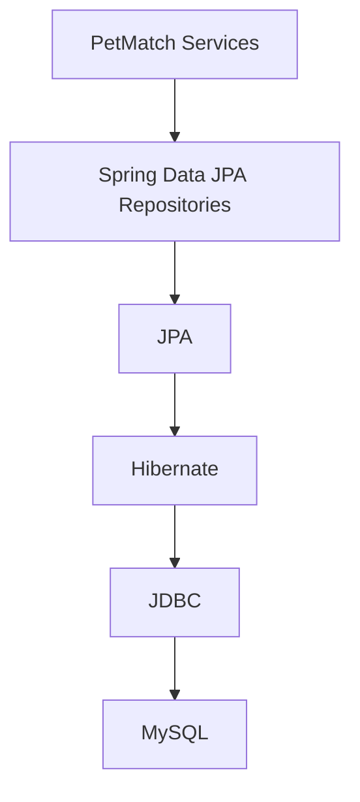

# 12 — Spring Data JPA

En los capítulos anteriores aprendimos tres cosas fundamentales:

```text
09 → qué conceptos existen en el dominio
10 → cómo JPA/Hibernate mapean objetos a persistencia
11 → cómo se representan las relaciones entre entidades
```

Ahora aparece una necesidad práctica:

> **¿Cómo consulta y persiste PetMatch esas entidades sin escribir manualmente una clase DAO con SQL/JDBC para cada operación?**

La respuesta es **Spring Data JPA**.

Este capítulo no tratará `Repository` como una palabra mágica. Vamos a separar con claridad:

- JPA;
- Hibernate;
- Spring Data JPA;
- `JpaRepository`;
- métodos heredados;
- query derivation;
- `Optional`;
- `existsBy...`;
- `countBy...`;
- `@Query`;
- `@EntityGraph`;
- `@Lock`;
- y la responsabilidad real de un Repository dentro de PetMatch.

---

# 1. El problema antes de Spring Data JPA

Supón que queremos recuperar una mascota por id y propietario.

En SQL conceptual podríamos escribir:

```sql
SELECT *
FROM pets
WHERE id = ?
  AND owner_id = ?;
```

Y luego tendríamos que:

1. abrir/usar una conexión;
2. preparar la sentencia;
3. asignar parámetros;
4. ejecutar la consulta;
5. leer el `ResultSet`;
6. reconstruir un objeto `Pet`;
7. manejar errores;
8. cerrar recursos correctamente;
9. repetir algo parecido para cada entidad y consulta.

JPA/Hibernate ya reducen gran parte de ese trabajo de mapeo.

Spring Data JPA agrega otra capa que reduce el código repetitivo de acceso a datos mediante interfaces Repository.

---

# 2. JPA, Hibernate y Spring Data JPA no son lo mismo

Conserva este mapa:



## JPA

Define APIs y conceptos estándar de persistencia ORM.

## Hibernate

Es el proveedor ORM que implementa JPA en el stack utilizado por PetMatch.

## Spring Data JPA

Construye sobre JPA para facilitar la capa de acceso a datos mediante repositories, generación de implementación, derivación de consultas y otras utilidades.

> [!IMPORTANT]
> `JpaRepository` no reemplaza JPA. Se apoya en JPA.

---

# 3. Los cuatro repositories reales

PetMatch contiene:

```text
src/main/java/com/petmatch/community/repository/
├── UserRepository.java
├── PetRepository.java
├── SupportRequestRepository.java
└── SupportApplicationRepository.java
```

No existe una clase manual como:

```text
PetRepositoryImpl.java
```

para implementar el CRUD básico.

Las cuatro interfaces extienden `JpaRepository`.

---

# 4. `PetRepository`

Código real:

```java
public interface PetRepository extends JpaRepository<Pet, Long> {

    List<Pet> findByOwnerIdOrderByNameAsc(Long ownerId);

    Optional<Pet> findByIdAndOwnerId(Long id, Long ownerId);
}
```

Archivo:

```text
src/main/java/com/petmatch/community/repository/PetRepository.java
```

La declaración contiene mucha información.

---

# 5. ¿Qué significa `JpaRepository<Pet, Long>`?

Los dos tipos genéricos indican:

```text
Pet  → tipo de Entity administrada
Long → tipo de su identificador
```

Esto coincide con `Pet`:

```java
@Id
@GeneratedValue(strategy = GenerationType.IDENTITY)
private Long id;
```

Por eso podemos leer:

```java
JpaRepository<Pet, Long>
```

como:

> repository de entidades `Pet` cuyo id es `Long`.

---

# 6. ¿Qué obtiene PetRepository sin escribir métodos?

Por extender `JpaRepository`, la interfaz hereda operaciones de persistencia comunes.

Entre las que PetMatch utiliza encontramos conceptos como:

```text
save(...)
findById(...)
delete(...)
```

Por ejemplo, `PetService.create(...)` usa:

```java
return petRepository.save(pet);
```

Y `PetService.delete(...)`:

```java
petRepository.delete(pet);
```

No fue necesario declarar esos métodos dentro de `PetRepository` porque ya son parte del contrato heredado.

---

# 7. ¿Quién implementa la interfaz?

El aprendiz puede preguntar:

> “¿Cómo puede Java ejecutar una interfaz si yo no escribí la clase?”

Spring Data crea en runtime una implementación/proxy adecuada para la interfaz Repository.

Conceptualmente:

```text
PetRepository interface
        ↓
Spring Data JPA
        ↓
genera/proporciona implementación
        ↓
Spring registra el objeto como componente utilizable
        ↓
PetService recibe PetRepository por DI
```

Por eso esto funciona:

```java
public PetService(
    PetRepository petRepository,
    SupportRequestRepository supportRequestRepository,
    UserService userService
) {
    this.petRepository = petRepository;
    ...
}
```

---

# 8. Query derivation: consultas a partir del nombre

Una característica muy visible de Spring Data es **query derivation**.

Observa:

```java
findByOwnerIdOrderByNameAsc(Long ownerId)
```

El nombre describe la intención de la consulta.

Podemos segmentarlo:

```text
find
By Owner Id
Order By Name Asc
```

Interpretación:

```text
buscar Pet
cuyo owner.id coincida
ordenados por name ascendente
```

No hay una cadena SQL escrita manualmente.

---

# 9. Navegar propiedades en el nombre

`Pet` no tiene un campo:

```java
Long ownerId;
```

Tiene:

```java
private User owner;
```

Y `User` tiene:

```java
private Long id;
```

Spring Data puede interpretar:

```text
OwnerId
```

como navegación conceptual:

```text
pet.owner.id
```

Eso permite escribir:

```java
findByOwnerIdOrderByNameAsc(Long ownerId)
```

sin crear un campo duplicado `ownerId` en la Entity.

---

# 10. `findByIdAndOwnerId`: consulta y autorización por ownership

Código real:

```java
Optional<Pet> findByIdAndOwnerId(Long id, Long ownerId);
```

Esta consulta no es solo comodidad de persistencia.

Tiene valor de seguridad de negocio.

`PetService.findOwnedPet(...)` hace:

```java
return petRepository.findByIdAndOwnerId(petId, owner.getId())
    .orElseThrow(() -> new PetNotFoundException(petId));
```

En vez de:

```text
1. buscar Pet por id
2. devolverla
3. confiar en que alguien compruebe owner después
```

la consulta incorpora el ownership requerido:

```text
id = petId
AND
owner.id = currentUser.id
```

Esto reduce el riesgo de recuperar un recurso que no pertenece al usuario y olvidarse de validarlo.

---

# 11. `Optional<T>`

Muchos métodos que pueden no encontrar una fila devuelven:

```java
Optional<Pet>
Optional<User>
Optional<SupportRequest>
Optional<SupportApplication>
```

`Optional<T>` representa explícitamente:

```text
puede existir un T
ó
puede no existir
```

Por ejemplo:

```java
Optional<User> findByEmailIgnoreCase(String email);
```

`UserService` decide qué hacer si no existe:

```java
return userRepository.findByEmailIgnoreCase(normalizeEmail(email))
    .orElseThrow(() -> new UsernameNotFoundException("User not found"));
```

El Repository describe acceso a datos.

El Service interpreta la ausencia según el caso de uso.

---

# 12. `UserRepository`

Código real:

```java
public interface UserRepository extends JpaRepository<User, Long> {

    Optional<User> findByEmailIgnoreCase(String email);

    boolean existsByEmailIgnoreCase(String email);
}
```

Hay dos intenciones diferentes.

## Encontrar el usuario

```java
findByEmailIgnoreCase(...)
```

Devuelve la Entity si existe.

## Preguntar si existe

```java
existsByEmailIgnoreCase(...)
```

Devuelve solamente:

```text
true / false
```

Cuando solo necesitas saber si existe, `existsBy...` expresa mejor la intención que recuperar toda la entidad solo para comprobar presencia.

---

# 13. ¿Qué significa `IgnoreCase`?

La parte:

```text
IgnoreCase
```

indica una comparación ignorando diferencias de mayúsculas/minúsculas según la traducción soportada por Spring Data/proveedor/base de datos.

PetMatch además normaliza el email en `UserService`:

```java
return email.trim().toLowerCase(Locale.ROOT);
```

Y la base de datos mantiene una restricción única en `users.email`.

Tenemos protección en distintos niveles:

```text
normalización
+
consulta case-insensitive
+
UNIQUE de base de datos
```

---

# 14. `SupportRequestRepository`: un repository más rico

Código real resumido:

```java
public interface SupportRequestRepository
    extends JpaRepository<SupportRequest, Long> {

    List<SupportRequest> findByOwnerIdOrderByCreatedAtDesc(Long ownerId);

    List<SupportRequest> findByStatusAndServiceDateAfterOrderByServiceDateAsc(
        SupportRequestStatus status,
        LocalDateTime serviceDate
    );

    Optional<SupportRequest> findByIdAndOwnerId(Long id, Long ownerId);

    Optional<SupportRequest> findByIdForUpdate(Long id);

    List<SupportRequest> findByStatus(SupportRequestStatus status);
    List<SupportRequest> findBySupportType(SupportType supportType);
    List<SupportRequest> findByPetId(Long petId);
    boolean existsByPetId(Long petId);

    List<SupportRequest> findByStatusAndSupportType(...);
}
```

Aquí podemos estudiar varios operadores de query derivation.

---

# 15. `OrderBy...Desc`

```java
findByOwnerIdOrderByCreatedAtDesc(Long ownerId)
```

Significa conceptualmente:

```text
WHERE owner_id = ?
ORDER BY created_at DESC
```

El Service lo usa para mostrar solicitudes del usuario desde las más recientes.

---

# 16. `After`

Método real:

```java
findByStatusAndServiceDateAfterOrderByServiceDateAsc(
    SupportRequestStatus status,
    LocalDateTime serviceDate
)
```

`SupportRequestService.findOpenRequests()` llama:

```java
return supportRequestRepository
    .findByStatusAndServiceDateAfterOrderByServiceDateAsc(
        SupportRequestStatus.OPEN,
        LocalDateTime.now()
    );
```

Interpretación:

```text
status = OPEN
AND serviceDate > ahora
ORDER BY serviceDate ASC
```

Esto significa que la definición de “solicitudes abiertas listables” incluye dos condiciones:

```text
estado OPEN
+
fecha de servicio futura
```

---

# 17. `existsByPetId`

Código real:

```java
boolean existsByPetId(Long petId);
```

Uso en `PetService.delete(...)`:

```java
if (supportRequestRepository.existsByPetId(pet.getId())) {
    throw new PetDeletionException(pet.getId());
}
```

La intención del Service es:

> no permitir eliminar una mascota que ya participa en solicitudes de apoyo.

El Repository ofrece la pregunta de datos eficiente y expresiva:

```text
¿existe alguna SupportRequest con pet.id = X?
```

---

# 18. `SupportApplicationRepository`

Código real relevante:

```java
Optional<SupportApplication> findByApplicantIdAndSupportRequestId(
    Long applicantId,
    Long supportRequestId
);

boolean existsByApplicantIdAndSupportRequestId(
    Long applicantId,
    Long supportRequestId
);

long countBySupportRequestIdAndStatus(
    Long supportRequestId,
    SupportApplicationStatus status
);

List<SupportApplication> findBySupportRequestIdAndStatus(
    Long supportRequestId,
    SupportApplicationStatus status
);
```

Aquí aparecen tres tipos de intención:

```text
find → recuperar
exists → comprobar existencia
count → contar
```

---

# 19. `countBy...`

El método:

```java
long countBySupportRequestIdAndStatus(
    Long supportRequestId,
    SupportApplicationStatus status
);
```

se usa durante la aceptación de una postulación:

```java
if (supportApplicationRepository.countBySupportRequestIdAndStatus(
    request.getId(),
    SupportApplicationStatus.ACCEPTED
) > 0) {
    throw new SupportApplicationStateException(applicationId);
}
```

La regla es:

```text
no debe existir ya otra postulación ACCEPTED
```

El Repository responde una pregunta cuantitativa.

El Service decide qué significa ese resultado para el negocio.

---

# 20. Repository no debería decidir reglas de negocio

Un error común sería colocar dentro del Repository una intención como:

```text
acceptApplicationAndRejectAllOthers(...)
```

Eso mezcla acceso a datos con una regla compleja de negocio.

En PetMatch la separación es mejor:

```text
Repository
→ consultar/guardar datos necesarios

Service
→ coordinar esas consultas y aplicar reglas
```

Ejemplo en `SupportApplicationService.accept(...)`:

```text
buscar application propiedad del owner
buscar request con lock
comprobar estados
contar aceptadas
marcar selected ACCEPTED
marcar request IN_PROGRESS
buscar otras PENDING
marcarlas REJECTED
```

El Repository aporta operaciones de datos.

El Service aporta el caso de uso.

---

# 21. Métodos derivados largos: ¿son siempre buenos?

Spring Data permite nombres expresivos como:

```java
findByStatusAndServiceDateAfterOrderByServiceDateAsc(...)
```

Tienen una ventaja:

- la intención está en el nombre;
- no hace falta escribir JPQL para casos simples.

Pero un nombre puede crecer demasiado si la consulta es muy compleja.

En ese caso pueden existir alternativas como:

- `@Query`;
- Specifications;
- Criteria API;
- QueryDSL;
- repositories personalizados.

PetMatch no necesita esas alternativas para la mayoría de consultas actuales.

No debemos introducir complejidad solo por evitar un método derivado legible.

---

# 22. `@Query`: cuando el método derivado no es la mejor expresión

PetMatch utiliza una consulta explícita en:

```java
@Lock(LockModeType.PESSIMISTIC_WRITE)
@Query("select sr from SupportRequest sr where sr.id = :id")
Optional<SupportRequest> findByIdForUpdate(@Param("id") Long id);
```

Aquí `@Query` contiene:

```text
select sr from SupportRequest sr where sr.id = :id
```

Eso es **JPQL**, no SQL nativo.

Observa que consulta:

```text
SupportRequest
```

el nombre de la Entity, no:

```text
support_requests
```

el nombre físico de la tabla.

---

# 23. SQL vs JPQL

Comparación conceptual:

## SQL

```sql
SELECT *
FROM support_requests
WHERE id = ?;
```

Piensa en:

```text
tablas
columnas
```

## JPQL

```text
select sr from SupportRequest sr where sr.id = :id
```

Piensa en:

```text
entidades
atributos
```

Hibernate traduce JPQL a SQL adecuado para la base de datos.

---

# 24. `@Param`

Código real:

```java
@Param("id") Long id
```

se relaciona con:

```text
:id
```

en la consulta JPQL.

Eso permite nombrar el parámetro en lugar de depender de una posición numérica.

---

# 25. ¿Por qué `findByIdForUpdate` no es solo otro `findById`?

Porque tiene:

```java
@Lock(LockModeType.PESSIMISTIC_WRITE)
```

La intención es obtener la solicitud con un bloqueo de escritura pesimista durante la transacción.

PetMatch utiliza este método cuando acepta una postulación.

¿Por qué?

Porque dos operaciones concurrentes de aceptación podrían competir por la misma solicitud.

El lock se estudiará profundamente en:

```text
16 — Concurrencia y locking
```

En este capítulo basta con reconocer:

```text
Repository también puede declarar requisitos de acceso a datos
como locking
```

sin convertir la regla de negocio en una query.

---

# 26. `@EntityGraph`

`SupportRequestRepository` contiene, por ejemplo:

```java
@EntityGraph(attributePaths = {"pet", "owner"})
List<SupportRequest> findByOwnerIdOrderByCreatedAtDesc(Long ownerId);
```

Y `SupportApplicationRepository` contiene:

```java
@EntityGraph(attributePaths = {
    "applicant",
    "supportRequest",
    "supportRequest.pet",
    "supportRequest.owner"
})
List<SupportApplication> findByApplicantIdOrderByAppliedAtDesc(Long applicantId);
```

Recordemos que muchas asociaciones fueron definidas como `LAZY`.

`@EntityGraph` permite indicar relaciones que deben cargarse en una consulta concreta.

Esto ayuda a controlar qué datos relacionados estarán disponibles sin convertir todas las asociaciones en `EAGER` globalmente.

La interacción completa entre:

```text
LAZY
open-in-view=false
EntityGraph
N+1
```

se estudiará en el capítulo 17.

---

# 27. Sobrescribir `findById`

`SupportRequestRepository` declara:

```java
@Override
@EntityGraph(attributePaths = {"pet", "owner"})
Optional<SupportRequest> findById(Long id);
```

`findById` ya existe en `JpaRepository`.

¿Por qué redeclararlo?

No para cambiar su nombre, sino para asociarle comportamiento metadata adicional:

```text
@EntityGraph(pet, owner)
```

La operación sigue representando buscar por id, pero esta interfaz indica que esa consulta debe cargar además determinadas relaciones.

---

# 28. Repository y colecciones

Algunas consultas devuelven:

```java
List<SupportRequest>
```

Esto expresa:

```text
puede haber cero, una o muchas coincidencias
```

En una colección vacía no hace falta representar ausencia con `Optional<List<...>>`.

Por eso un método como:

```java
findByStatus(...)
```

puede devolver una lista vacía si no hay coincidencias.

---

# 29. ¿Repository debe devolver DTO?

Spring Data puede soportar proyecciones y otras técnicas, pero los repositories actuales de PetMatch devuelven principalmente Entities o valores simples:

```text
User
Pet
SupportRequest
SupportApplication
boolean
long
```

El proyecto no basa estos repositories en DTO de API.

Eso mantiene la API REST desacoplada de la persistencia.

Los DTO REST se crean/mapean en otra capa.

---

# 30. ¿Por qué no hay SQL en los Services?

`PetService` no hace:

```java
connection.prepareStatement(...)
```

`SupportApplicationService` tampoco.

Eso es consecuencia de la separación por responsabilidades:

```text
Service
→ reglas y casos de uso

Repository
→ acceso a datos

JPA/Hibernate
→ persistencia ORM
```

El Service habla en términos del dominio.

---

# 31. ¿Qué significa una consulta “derivada” realmente?

No significa que Java ejecute literalmente el nombre del método como SQL.

Spring Data analiza la firma y construye una representación de la consulta según sus reglas.

Ejemplo:

```text
findByStatusAndSupportType
```

puede interpretarse conceptualmente como:

```text
status = ? AND supportType = ?
```

Después JPA/Hibernate participan en la ejecución sobre la base de datos.

---

# 32. Nombres de propiedades deben coincidir con el modelo

Si escribes:

```text
findByOwnerId...
```

Spring Data necesita poder resolver `owner.id` a partir del modelo.

Si renombraras la propiedad `owner` en la Entity sin ajustar el Repository, el método dejaría de ser coherente con el modelo.

Eso muestra que los nombres de métodos derivados están acoplados intencionalmente a las propiedades de las Entities.

---

# 33. ¿Por qué existen métodos aparentemente no usados por el flujo principal?

`SupportRequestRepository` también declara:

```java
findByStatus(...)
findBySupportType(...)
findByPetId(...)
findByStatusAndSupportType(...)
```

Aunque no todos sean protagonistas del flujo MVC/REST principal que hemos seguido hasta ahora, forman parte del Repository actual.

El libro puede documentar que existen.

Lo que no debe hacer es inventar una pantalla o endpoint que los use si ese consumidor no existe.

---

# 34. `save()` en creación

Cuando PetMatch crea una Entity nueva utiliza explícitamente `save`.

Ejemplo:

```java
return supportApplicationRepository.save(
    new SupportApplication(
        normalizeNullable(form.getMessage()),
        applicant,
        request
    )
);
```

Aquí la intención es persistir una nueva postulación.

---

# 35. ¿Por qué algunos updates no llaman `save()`?

`PetService.update(...)` hace:

```java
Pet pet = findOwnedPet(petId, authentication);
pet.setName(...);
pet.setSpecies(...);
pet.setAge(...);
pet.setDescription(...);
return pet;
```

No termina con:

```java
petRepository.save(pet);
```

Esto no es un olvido.

La Entity obtenida dentro de la transacción está managed por el persistence context y Hibernate puede detectar sus cambios mediante dirty checking.

Esto conecta Spring Data JPA con el capítulo anterior sobre JPA/Hibernate.

---

# 36. Repository y transacciones

El Repository no define por sí solo el caso de uso completo.

Los límites transaccionales visibles de PetMatch están principalmente en los métodos de Service:

```java
@Transactional
public void accept(...)
```

Dentro de esa transacción pueden ocurrir varias consultas y modificaciones coordinadas.

El siguiente capítulo 14 profundizará esta relación.

---

# 37. Repository no reemplaza el Service

Una tentación frecuente es hacer:

```text
Controller → Repository
```

directamente para “ahorrar una clase”.

Eso puede parecer práctico para CRUD mínimo, pero en PetMatch muchas operaciones necesitan reglas:

```text
ownership
estado actual
fecha futura
no duplicar postulación
no aceptar dos postulaciones
rechazar otras pendientes
```

Si Controllers accedieran directamente a repositories, esas reglas tenderían a dispersarse entre interfaces web y REST.

PetMatch mantiene:

```text
MVC Controller ─┐
                ├→ Service → Repository
REST Controller ┘
```

---

# 38. El Repository como frontera de persistencia

Una buena forma de leer la arquitectura es:

```text
Service conoce operaciones de datos necesarias
↓
Repository expresa esas operaciones
↓
Spring Data/JPA/Hibernate resuelven persistencia
↓
MySQL conserva el estado
```

El Service no necesita saber cómo se construye cada `SELECT` SQL concreto.

---

# 39. Tabla de repositories de PetMatch

| Repository | Entity | Consultas propias destacadas |
|---|---|---|
| `UserRepository` | `User` | email, existencia por email |
| `PetRepository` | `Pet` | pets por owner, pet por id+owner |
| `SupportRequestRepository` | `SupportRequest` | owner, estado/fecha, pet, filtros, lock |
| `SupportApplicationRepository` | `SupportApplication` | applicant, request, owner de request, existencia, count, status |

---

# 40. Mapa de tipos de método

```mermaid
flowchart TD
    R[Repository methods]

    R --> H[Heredados]
    H --> H1[save]
    H --> H2[findById]
    H --> H3[delete]

    R --> D[Derivados por nombre]
    D --> D1[findByOwnerId...]
    D --> D2[existsBy...]
    D --> D3[countBy...]

    R --> Q[Explícitos / metadata]
    Q --> Q1[@Query]
    Q --> Q2[@EntityGraph]
    Q --> Q3[@Lock]
```

Esta clasificación es más útil que memorizar cada método de forma aislada.

---

# 41. ⚠️ Errores frecuentes

## Error 1 — “Spring Data JPA es Hibernate”

No. Son capas diferentes que colaboran.

## Error 2 — “Si Repository es interfaz, no puede ejecutarse”

Spring Data proporciona la implementación/proxy correspondiente.

## Error 3 — “Debo escribir `save()` después de cualquier setter”

No necesariamente. En una Entity managed dentro de una transacción, dirty checking puede persistir cambios.

## Error 4 — “Todos los métodos deben llevar `@Query`”

No. Muchas consultas simples pueden derivarse del nombre.

## Error 5 — “`findByIdAndOwnerId` solo es estilo”

No. En PetMatch también ayuda a incorporar ownership en el acceso al recurso.

## Error 6 — “`existsBy...` recupera toda la Entity y yo debo comprobar null”

Su intención es devolver un booleano.

## Error 7 — “JPQL usa nombres de tablas”

Normalmente JPQL trabaja con Entities y atributos.

## Error 8 — “`@EntityGraph` convierte la relación en EAGER para siempre”

No. Define un plan de carga para consultas concretas donde se aplica.

## Error 9 — “`@Lock` es una regla de negocio”

Es una estrategia de acceso/concurrencia de persistencia que soporta una regla de negocio.

## Error 10 — “Repository puede reemplazar Service”

No en un dominio con reglas como PetMatch sin dispersar lógica en otras capas.

---

# 42. 🛠 Prueba en el código

## Actividad 1 — Clasifica todos los métodos

Abre los cuatro repositories y clasifica cada método como:

```text
heredado
derivado
@Query
metadata @EntityGraph
locking
```

## Actividad 2 — Descompón nombres

Explica palabra por palabra:

```text
findByStatusAndServiceDateAfterOrderByServiceDateAsc
```

Luego tradúcelo a una condición SQL conceptual.

## Actividad 3 — Ownership

Compara:

```java
findById(Long id)
```

con:

```java
findByIdAndOwnerId(Long id, Long ownerId)
```

Explica por qué el segundo es valioso para recursos privados.

## Actividad 4 — `exists`, `count` y `find`

Busca un ejemplo real de cada prefijo:

```text
find
exists
count
```

y explica qué tipo devuelve.

## Actividad 5 — Encuentra JPQL

Localiza:

```java
@Query("select sr from SupportRequest sr where sr.id = :id")
```

Identifica:

- Entity;
- alias;
- atributo;
- parámetro.

## Actividad 6 — EntityGraph

Haz una tabla con los métodos que cargan:

```text
pet
owner
applicant
supportRequest
```

No intentes todavía optimizar nada; solo identifica el plan de carga declarado.

---

# 43. 🧪 Comprueba que entendiste

1. ¿Qué diferencia hay entre JPA, Hibernate y Spring Data JPA?
2. ¿Qué significa `JpaRepository<Pet, Long>`?
3. ¿Quién aporta la implementación de `PetRepository`?
4. ¿Qué es query derivation?
5. ¿Cómo interpreta Spring Data `OwnerId` en `PetRepository`?
6. ¿Qué diferencia funcional hay entre `findBy...`, `existsBy...` y `countBy...`?
7. ¿Para qué usa PetMatch `findByIdAndOwnerId`?
8. ¿Qué devuelve un `Optional<T>`?
9. ¿Qué consulta usa PetMatch para listar solicitudes OPEN con fecha futura?
10. ¿Qué es JPQL?
11. ¿Por qué `findByIdForUpdate` usa `@Query` y `@Lock`?
12. ¿Para qué se usa `@EntityGraph` en los repositories actuales?
13. ¿Por qué `PetService.update` puede modificar una Entity sin llamar `save` al final?
14. ¿Repository debería contener la regla “aceptar una y rechazar las otras”? 
15. ¿Spring Data JPA elimina la necesidad de comprender SQL y bases de datos?

### Respuestas esperadas

1. JPA define la API/especificación; Hibernate la implementa; Spring Data JPA facilita repositories y consultas sobre JPA.
2. Repository de `Pet` con id `Long`.
3. Spring Data JPA proporciona la implementación/proxy en runtime.
4. Construir una consulta a partir de una firma/nombre que sigue convenciones.
5. Como navegación `owner.id`.
6. Recuperar, comprobar existencia y contar respectivamente.
7. Para recuperar únicamente una mascota que pertenece al owner indicado.
8. Presencia o ausencia explícita de un valor.
9. `findByStatusAndServiceDateAfterOrderByServiceDateAsc`.
10. Lenguaje de consultas orientado a Entities/atributos de JPA.
11. Para obtener la solicitud concreta con bloqueo pesimista de escritura.
12. Para cargar relaciones concretas en determinadas consultas.
13. Porque está managed dentro de una transacción y Hibernate puede aplicar dirty checking.
14. No; esa coordinación pertenece al Service.
15. No.

---

# 44. ✅ Qué debes recordar

- **Spring Data JPA se apoya en JPA; no es sinónimo de Hibernate.**
- Los repositories de PetMatch son interfaces que extienden `JpaRepository`.
- Spring Data proporciona las implementaciones/proxies.
- `JpaRepository<Entity, IdType>` declara Entity y tipo de id.
- `save`, `findById` y `delete` son ejemplos de operaciones heredadas.
- Spring Data puede derivar consultas desde nombres de métodos.
- `findByIdAndOwnerId` combina acceso con ownership.
- `Optional` representa presencia/ausencia de una coincidencia individual.
- `existsBy...` responde una pregunta booleana.
- `countBy...` devuelve una cantidad.
- `@Query` permite declarar JPQL explícito.
- JPQL piensa en Entities y atributos, no directamente en tablas/columnas.
- `@EntityGraph` controla carga de relaciones para consultas específicas.
- `@Lock(PESSIMISTIC_WRITE)` aparece en `findByIdForUpdate` para soportar concurrencia al aceptar postulaciones.
- Repository se ocupa de acceso a datos; Service coordina reglas y casos de uso.
- Una Entity managed puede actualizarse por dirty checking sin `save()` explícito al final.

---

# 🔗 Continúa con

Ahora sabemos **cómo PetMatch obtiene y persiste datos**.

La siguiente pregunta es más importante:

> **¿Quién decide qué operaciones están permitidas y qué reglas deben cumplirse antes de usar esos repositories?**

Eso nos lleva a:

**[Capítulo 13 — Service y reglas de negocio →](13-service-y-reglas-de-negocio.md)**

---

[← Capítulo 11 — Relaciones JPA](11-relaciones-jpa.md) · [Índice del bloque](README.md) · [Índice general](../README.md) · [Siguiente → Capítulo 13](13-service-y-reglas-de-negocio.md)
