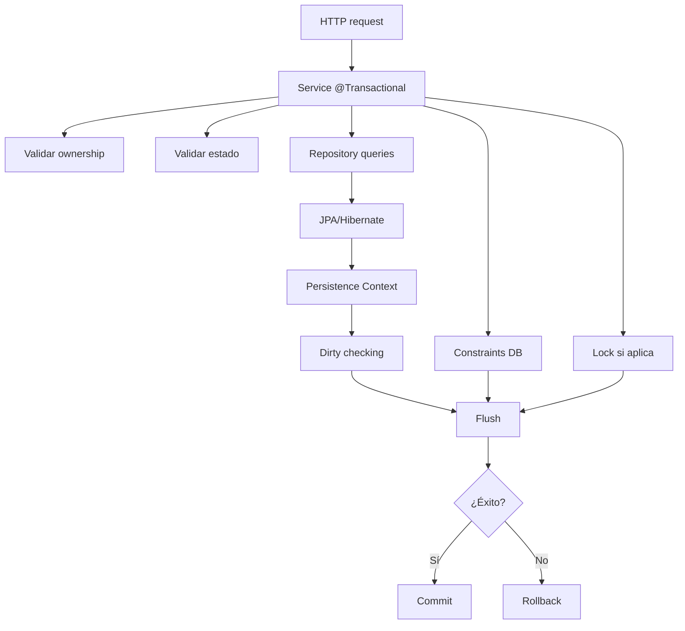

# 14 — Transacciones y consistencia

En el capítulo anterior vimos reglas que modifican varias entidades dentro de una misma operación.

Ejemplos:

```text
cancelar una request
→ request CANCELLED
→ applications PENDING REJECTED
```

```text
aceptar una application
→ selected ACCEPTED
→ request IN_PROGRESS
→ otras PENDING REJECTED
```

Ahora aparece una pregunta fundamental:

> **¿Qué ocurre si una de esas operaciones falla cuando ya se hicieron algunos cambios?**

Si guardáramos cada paso de forma independiente podríamos terminar con datos contradictorios.

PetMatch utiliza **transacciones** para tratar ciertos casos de uso como unidades coherentes.

---

# 1. ¿Qué es una transacción?

Una transacción de base de datos agrupa operaciones que deben considerarse como una unidad lógica.

La idea intuitiva es:

```text
TODO sale bien
→ confirmar cambios

algo falla
→ deshacer la unidad
```

En términos comunes:

```text
commit
rollback
```

No significa que toda la aplicación funcione dentro de una única transacción gigante.

Los límites deben corresponder a operaciones coherentes.

---

# 2. El problema de las actualizaciones parciales

Imagina aceptar una postulación con pasos independientes:

```text
1. selected → ACCEPTED
2. request → IN_PROGRESS
3. otras → REJECTED
```

¿Qué ocurriría si el paso 3 falla después de confirmar 1 y 2?

Podríamos quedar con:

```text
selected = ACCEPTED
request = IN_PROGRESS
other = PENDING
```

Eso viola la regla funcional esperada.

La operación necesita consistencia global.

---

# 3. `@Transactional` en PetMatch

Los Services reales utilizan:

```java
@Transactional
```

y:

```java
@Transactional(readOnly = true)
```

Ejemplo en `SupportApplicationService`:

```java
@Transactional
public void accept(Long applicationId, Authentication authentication) {
    ...
}
```

La anotación declara un límite transaccional alrededor del método gestionado por Spring.

---

# 4. ¿Por qué el límite está en Service?

Un caso de uso puede necesitar varios repositories.

Por ejemplo `accept(...)` usa:

```text
SupportApplicationRepository
SupportRequestRepository
```

Si la transacción estuviera limitada a cada llamada individual de Repository, perderíamos la unidad de negocio completa.

El Service conoce dónde comienza y termina el caso de uso.

Por eso es un lugar natural para declarar:

```text
esta operación completa debe ser consistente
```

---

# 5. `readOnly = true`

PetMatch utiliza:

```java
@Transactional(readOnly = true)
```

en métodos de consulta.

Ejemplos:

```text
findCurrentUserPets
findOwnedPet
findOpenRequests
findCurrentUserRequests
findById
findVisibleRequest
findOwnedRequest
findCurrentUserApplications
findReceivedApplications
hasApplied
findByEmail
getCurrentUser
```

La intención es comunicar:

```text
esta operación es de lectura
```

Esto puede permitir optimizaciones/semántica apropiada al stack de persistencia.

> [!IMPORTANT]
> `readOnly=true` no debe interpretarse como una barrera de seguridad absoluta que haga físicamente imposible cualquier modificación en todos los proveedores. Es principalmente una declaración transaccional de intención.

---

# 6. Transacción y persistence context

En JPA, dentro de una transacción normalmente trabajamos con un **persistence context**.

Las Entities cargadas pueden quedar `managed`.

Eso permite algo como:

```java
Pet pet = findOwnedPet(petId, authentication);
pet.setName(...);
pet.setSpecies(...);
return pet;
```

sin `save()` final explícito.

Hibernate detecta cambios de una Entity managed y puede sincronizarlos al hacer flush/commit.

---

# 7. Dirty checking revisitado

`PetService.update(...)`:

```java
@Transactional
public Pet update(Long petId, PetForm form, Authentication authentication) {
    Pet pet = findOwnedPet(petId, authentication);
    pet.setName(normalize(form.getName()));
    pet.setSpecies(normalize(form.getSpecies()));
    pet.setAge(form.getAge());
    pet.setDescription(normalizeNullable(form.getDescription()));
    return pet;
}
```

No llama:

```java
petRepository.save(pet)
```

porque la Entity recuperada forma parte del contexto de persistencia activo.

Esta es una diferencia importante frente a un objeto Java desconectado cualquiera.

---

# 8. ¿Cuándo usamos `save()` explícito?

PetMatch sí usa `save()` para nuevas Entities.

Ejemplo:

```java
return petRepository.save(pet);
```

O:

```java
return supportApplicationRepository.save(
    new SupportApplication(...)
);
```

Una nueva instancia todavía necesita entrar en el ciclo de persistencia.

Para updates de Entities managed, dirty checking puede bastar.

---

# 9. El caso `cancel(...)`

Código real:

```java
@Transactional
public void cancel(Long requestId, Authentication authentication) {
    SupportRequest request = findOwnedRequest(requestId, authentication);
    requireOpen(request);
    request.setStatus(SupportRequestStatus.CANCELLED);

    supportApplicationRepository
        .findBySupportRequestIdAndStatus(
            request.getId(),
            SupportApplicationStatus.PENDING
        )
        .forEach(application ->
            application.setStatus(SupportApplicationStatus.REJECTED)
        );
}
```

Dentro del mismo método:

```text
request cambia
+
varias applications cambian
```

Ese conjunto representa una unidad funcional.

---

# 10. Consistencia del caso `cancel`

Estado esperado después:

```text
request = CANCELLED
pending applications = REJECTED
```

No queremos:

```text
request = CANCELLED
pending applications = PENDING
```

La transacción ayuda a tratar la operación como una unidad.

---

# 11. El caso `accept(...)`

Código conceptual real resumido:

```java
@Transactional
public void accept(...) {
    User owner = ...;
    SupportApplication application = ...;
    SupportRequest request = ...;

    validar estados;
    comprobar ACCEPTED existentes;

    application.setStatus(ACCEPTED);
    request.setStatus(IN_PROGRESS);

    buscar otras PENDING
        → setStatus(REJECTED);
}
```

Este caso es todavía más sensible a consistencia.

---

# 12. ¿Qué debe confirmarse junto?

Si `accept(...)` termina correctamente, queremos:

```text
selected application = ACCEPTED
request = IN_PROGRESS
all other pending = REJECTED
```

Esas modificaciones describen un solo hecho del dominio:

> el owner eligió a una persona para atender la solicitud.

No son tres eventos independientes.

---

# 13. Rollback: la idea central

Si durante una operación transaccional ocurre una excepción que activa rollback, los cambios pendientes de la transacción no deberían confirmarse parcialmente.

Modelo mental:

```text
BEGIN
  cambio A
  cambio B
  error
ROLLBACK
```

En lugar de:

```text
A confirmado
B falló
```

---

# 14. Rollback y excepciones en Spring

En el comportamiento transaccional habitual de Spring, las excepciones unchecked (`RuntimeException` y derivadas) provocan rollback por defecto.

Las excepciones de negocio de PetMatch utilizadas en estos Services son excepciones runtime del proyecto.

Eso permite que una regla inválida interrumpa la operación antes de confirmar cambios incoherentes.

> [!NOTE]
> Las reglas exactas de rollback pueden configurarse con atributos de `@Transactional`. PetMatch no utiliza personalizaciones `rollbackFor`/`noRollbackFor` en estos métodos.

---

# 15. Validar antes de modificar

Una buena práctica visible en `accept(...)` es comprobar precondiciones antes de cambiar estados principales.

Primero:

```text
request OPEN?
application PENDING?
existe otra ACCEPTED?
```

Después:

```text
cambiar estados
```

Esto reduce trabajo que después tendría que deshacerse y hace el flujo más claro.

---

# 16. Pero la validación sola no sustituye transacción

Aunque validemos todo antes, todavía pueden existir:

```text
errores de base de datos
concurrencia
constraints
fallos inesperados
```

Por eso:

```text
validaciones previas
+
transacción
```

son mecanismos complementarios.

---

# 17. Consistencia no significa solo “sin errores SQL”

En PetMatch consistencia también significa que los estados del dominio tengan sentido entre sí.

Ejemplos:

```text
CANCELLED + PENDING
→ inconsistente funcionalmente
```

```text
IN_PROGRESS + ninguna ACCEPTED
→ sospechoso/inconsistente para este flujo
```

```text
IN_PROGRESS + dos ACCEPTED
→ inválido
```

La transacción protege el conjunto de cambios; las reglas del Service definen qué conjunto es válido.

---

# 18. ACID: marco conceptual

Las transacciones de bases de datos suelen explicarse mediante ACID:

```text
A → Atomicity
C → Consistency
I → Isolation
D → Durability
```

No necesitamos convertir estas palabras en teoría aislada. Podemos conectarlas con PetMatch.

---

# 19. Atomicity

**Atomicidad**: la operación se considera una unidad.

En `accept(...)`:

```text
ACCEPTED
+
IN_PROGRESS
+
REJECTED para otras
```

se tratan como parte de un mismo caso.

Mentalmente:

```text
todo o nada
```

---

# 20. Consistency

**Consistencia**: la transacción lleva la base desde un estado válido hacia otro estado válido, respetando reglas y restricciones.

PetMatch combina:

```text
reglas Service
constraints DB
estados permitidos
```

La base no inventa por sí sola todas las reglas funcionales.

---

# 21. Isolation

**Aislamiento** trata cómo interactúan transacciones concurrentes.

Aquí aparece un problema importante:

```text
dos owners/sesiones intentando aceptar al mismo tiempo
```

o, más exactamente, dos transacciones compitiendo sobre la misma request.

PetMatch usa:

```java
@Lock(LockModeType.PESSIMISTIC_WRITE)
```

para una consulta concreta.

El aislamiento y locking se estudian con detalle en el [capítulo 16](16-concurrencia-y-locking.md).

---

# 22. Durability

**Durabilidad** significa que, una vez confirmada una transacción, los cambios persistidos deben sobrevivir según las garantías del sistema de base de datos.

Para el desarrollador de Service, la idea práctica es:

```text
commit exitoso
→ estado persistido
```

La garantía exacta depende también del motor de base de datos e infraestructura.

---

# 23. `@Transactional` no es “guardar automáticamente cualquier cosa”

La anotación no convierte cualquier objeto Java en Entity persistente.

Para que dirty checking funcione necesitamos trabajar con entidades gestionadas por JPA.

Un DTO como:

```text
PetForm
```

no se guarda solo por estar dentro de un método transaccional.

La transacción coordina persistencia; no sustituye el mapeo JPA.

---

# 24. Propagación: concepto inicial

Un método transaccional puede llamar a otro método transaccional.

Por ejemplo:

```text
SupportRequestService.create
→ PetService.findOwnedPet
→ UserService.getCurrentUser
```

Spring Transaction Management tiene reglas de **propagation** que determinan cómo se relacionan esas llamadas con una transacción existente.

La propagación por defecto habitual es:

```text
REQUIRED
```

Conceptualmente:

```text
si ya hay transacción → participar
si no hay → crear una
```

PetMatch no especifica propagaciones personalizadas en los métodos actuales.

---

# 25. Una precisión: proxy y llamadas internas

Spring aplica `@Transactional` normalmente mediante proxies/interceptores alrededor de Beans gestionados.

Esto tiene una consecuencia avanzada:

> una llamada interna de un método de la misma instancia a otro método `@Transactional` puede no pasar por el proxy de la misma forma que una llamada externa entre Beans.

En PetMatch, muchos métodos públicos transaccionales llaman helpers/otros métodos del mismo Service.

No necesitamos rediseñarlos ahora, pero es importante no creer que `@Transactional` es una instrucción Java que el compilador ejecuta directamente.

---

# 26. Ejemplo: `update` llama `findOwnedPet`

`PetService.update(...)`:

```java
@Transactional
public Pet update(...) {
    Pet pet = findOwnedPet(...);
    ...
}
```

`findOwnedPet(...)` tiene:

```java
@Transactional(readOnly = true)
```

Como la llamada ocurre dentro del mismo Bean, la transacción relevante para la operación externa es la iniciada alrededor de `update(...)`.

La idea útil es:

```text
no pienses cada anotación interna como una transacción independiente automática
```

---

# 27. ¿Por qué no poner `@Transactional` en Controller?

Si el Controller mantuviera una transacción abierta mientras:

```text
procesa vista
construye modelo
coordina HTTP
```

mezclaríamos el límite de persistencia con detalles de presentación.

PetMatch coloca los límites en Service, cerca del caso de uso.

Además `open-in-view: false` refuerza la intención de no extender la sesión de persistencia hasta la vista.

---

# 28. ¿Por qué `open-in-view: false` importa aquí?

Configuración real:

```yaml
spring:
  jpa:
    open-in-view: false
```

Esto evita depender de una sesión JPA abierta durante renderizado de vistas para resolver asociaciones LAZY arbitrariamente.

Consecuencia:

```text
Service/Repository debe obtener los datos necesarios
antes de salir del contexto adecuado
```

Por eso `@EntityGraph` aparece en consultas concretas.

El [capítulo 17](17-lazy-loading-y-entitygraph.md) profundiza esta relación.

---

# 29. `readOnly` y lazy loading

Una transacción `readOnly` sigue proporcionando un contexto en el que pueden resolverse relaciones según el plan de carga y acceso permitido.

Pero no debemos usar eso como excusa para recorrer grafos arbitrarios sin pensar en consultas.

El diseño actual usa `EntityGraph` en listados relevantes para traer relaciones necesarias de forma explícita.

---

# 30. Transacción y constraint UNIQUE

`UserService.register(...)` hace:

```text
existsByEmailIgnoreCase
→ si no existe
→ save(user)
```

Pero entre:

```text
comprobar
```

y:

```text
guardar
```

puede existir concurrencia.

Por eso la restricción UNIQUE de base de datos sigue siendo importante como garantía final.

La transacción no elimina la necesidad de constraints.

---

# 31. Check-then-act

Un patrón como:

```text
if not exists
then insert
```

se llama a menudo **check-then-act**.

Bajo concurrencia:

```text
T1 comprueba → no existe
T2 comprueba → no existe
T1 inserta
T2 intenta insertar
```

La constraint UNIQUE evita terminar con dos filas válidas duplicadas.

Este ejemplo muestra:

```text
regla de aplicación
+
garantía de base de datos
```

---

# 32. Aceptación concurrente: otro check-then-act

`accept(...)` comprueba:

```java
countBySupportRequestIdAndStatus(... ACCEPTED) > 0
```

Sin coordinación concurrente dos transacciones podrían leer cero casi al mismo tiempo.

PetMatch responde además cargando la request mediante:

```java
findByIdForUpdate(...)
```

con lock pesimista.

Esto se estudia en profundidad en el [capítulo 16](16-concurrencia-y-locking.md).

---

# 33. ¿Por qué transacción + lock?

La transacción define la unidad.

El lock ayuda a coordinar acceso concurrente a un recurso dentro de esa unidad.

```text
@Transactional
→ cuánto debe ser una unidad coherente

PESSIMISTIC_WRITE
→ cómo evitar competencia simultánea específica
```

Son conceptos relacionados pero no iguales.

---

# 34. Flush vs commit

Simplificando:

## Flush

Sincroniza cambios pendientes del persistence context con la base de datos.

## Commit

Confirma la transacción.

Un flush puede ocurrir antes del commit.

Por eso un error de constraint puede aparecer antes del final visible del método o al finalizar la transacción, dependiendo del caso.

No debemos asumir:

```text
SQL solo ocurre exactamente en la línea de save()
```

Hibernate puede diferir operaciones.

---

# 35. `save()` no equivale automáticamente a commit

Dentro de una transacción:

```java
repository.save(entity)
```

no debe interpretarse como:

```text
commit inmediato e irreversible
```

La transacción externa todavía puede hacer rollback.

Esto es esencial para coordinar varias operaciones de Repository.

---

# 36. Caso conceptual de rollback

Supón este pseudocódigo:

```text
@Transactional
accept():
    selected = ACCEPTED
    request = IN_PROGRESS
    throw RuntimeException
    other = REJECTED
```

La intención transaccional es evitar confirmar los primeros cambios si la operación aborta.

> [!NOTE]
> Este ejemplo es pseudocódigo didáctico. No describe un fallo real existente en PetMatch.

---

# 37. Excepciones de negocio antes del cambio

`SupportApplicationService.apply(...)` lanza excepciones si:

```text
request no acepta applications
self-apply
duplicado
```

Como esas validaciones ocurren antes de `save`, no hay nueva application que revertir en esos caminos.

Esto es un diseño claro:

```text
validar primero
persistir después
```

---

# 38. Excepción de estado durante `accept`

Antes de cambiar:

```java
application.setStatus(...)
request.setStatus(...)
```

se verifica:

```text
request OPEN
application PENDING
no accepted previa
```

La operación no intenta “arreglar” estados inválidos silenciosamente.

Aborta con una excepción específica.

---

# 39. Transacciones y tiempo

Una transacción no debería durar más de lo necesario.

Mantenerla abierta mientras hacemos operaciones lentas externas podría:

- retener conexiones;
- mantener locks;
- aumentar competencia;
- empeorar rendimiento.

PetMatch no integra dentro de estos Services operaciones como:

```text
llamadas a APIs remotas
subidas a S3
pagos
```

por lo que las transacciones distribuidas no forman parte de este diseño.

---

# 40. Transacción de base de datos no cubre todo sistema externo

Si en el futuro una operación hiciera:

```text
DB update
+
email
+
servicio externo
```

una transacción JPA normal no convierte automáticamente todo eso en una única transacción distribuida.

Es un concepto importante para no sobreestimar `@Transactional`.

En PetMatch actual, el caso principal se concentra en persistencia MySQL/JPA.

---

# 41. Consistencia mediante constraints

La base de datos también protege:

```text
users.email UNIQUE
```

y:

```text
(applicant_id, support_request_id) UNIQUE
```

Las foreign keys derivadas de relaciones obligatorias también ayudan a impedir referencias inexistentes según el esquema generado/configurado.

Transacciones y constraints colaboran.

---

# 42. Consistencia mediante estados

Los Services protegen transiciones:

```text
OPEN → CANCELLED
OPEN → IN_PROGRESS
IN_PROGRESS → COMPLETED
```

Y applications:

```text
PENDING → ACCEPTED
PENDING → REJECTED
```

Esta consistencia es lógica de dominio, no solo constraint relacional.

El [capítulo 15](15-maquinas-de-estado.md) formaliza estas transiciones como máquinas de estado.

---

# 43. Consistencia mediante ownership

Otra dimensión:

```text
solo owner correcto puede operar el recurso
```

Una transacción perfectamente atómica podría seguir siendo funcionalmente inválida si permitiera que el usuario equivocado modificara una request.

Por eso consistencia de negocio combina:

```text
transacción
+
estados
+
ownership
+
constraints
```

---

# 44. Consistencia mediante locking

Para reglas bajo concurrencia, algunas validaciones simples no bastan.

PetMatch usa lock pesimista al aceptar:

```java
@Lock(LockModeType.PESSIMISTIC_WRITE)
```

Esto añade otra capa:

```text
transacción
+
regla
+
lock
```

No todas las operaciones necesitan lock explícito.

---

# 45. Mapa completo



No todos los caminos ocurren en todos los métodos, pero el diagrama resume las piezas que ya hemos encontrado en PetMatch.

---

# 46. ¿Cómo decidir si un método debe ser transaccional?

Preguntas útiles:

1. ¿consulta Entities que deben mantenerse consistentes durante la operación?
2. ¿modifica una o varias Entities?
3. ¿varias modificaciones forman una única regla?
4. ¿necesita dirty checking?
5. ¿necesita locking?
6. ¿qué debería ocurrir si una parte falla?

No agregues `@Transactional` indiscriminadamente “porque es Spring”.

Define límites según casos de uso y persistencia.

---

# 47. Métodos sin `@Transactional`

No todos los métodos de Service necesitan transacción propia.

Por ejemplo helpers de conversión pura como:

```java
public PetForm toForm(Pet pet)
```

no realizan persistencia.

Agregar una transacción allí no aportaría valor evidente.

---

# 48. Transacción y testing

Las pruebas unitarias con Mockito verifican reglas del Service sin ejecutar realmente una transacción de base de datos.

En cambio las pruebas de integración con `@SpringBootTest` y `@Transactional` ejercitan el contexto real y persistencia configurada.

Esto muestra que hay dos preguntas distintas:

```text
¿la regla está bien?
```

y:

```text
¿la integración transaccional/persistencia funciona realmente?
```

Ambas son necesarias.

---

# 49. ⚠️ Errores frecuentes

## Error 1 — “`@Transactional` significa que cada `save()` hace commit”

No. La transacción puede abarcar varias operaciones.

## Error 2 — Llamar `save()` después de cada setter por miedo

No es necesario para una Entity managed dentro de una transacción.

## Error 3 — Poner transacciones en Controllers

Desdibuja el límite del caso de uso y puede mantener persistencia abierta durante presentación.

## Error 4 — Creer que `readOnly=true` es seguridad absoluta contra escrituras

Es una declaración de intención/optimización transaccional, no una política de autorización.

## Error 5 — Creer que transacción reemplaza constraints

No. UNIQUE sigue siendo esencial bajo concurrencia.

## Error 6 — Creer que constraints reemplazan Services

La DB no conoce por sí sola todas las reglas de estados/ownership.

## Error 7 — Confundir transacción con lock

La transacción define unidad; el lock coordina acceso concurrente específico.

## Error 8 — Mantener transacciones abiertas durante trabajo externo lento

Aumenta uso de recursos y riesgo de contention.

## Error 9 — Pensar que `@Transactional` cubre automáticamente emails/APIs externas

No.

## Error 10 — Ignorar el efecto de llamadas internas/proxies

La anotación es aplicada por infraestructura Spring, no por sintaxis Java directa.

---

# 50. 🛠 Prueba en el código

## Actividad 1 — Clasifica métodos

Abre los Services y clasifica cada método:

```text
@Transactional
@Transactional(readOnly = true)
sin anotación
```

Explica por qué crees que pertenece a esa categoría.

## Actividad 2 — Dirty checking

Compara:

```text
PetService.create
```

con:

```text
PetService.update
```

Responde:

1. ¿cuál llama `save()`?
2. ¿cuál no?
3. ¿por qué?

## Actividad 3 — Unidad transaccional

Para `SupportRequestService.cancel`, escribe todas las Entities potencialmente modificadas dentro de la misma transacción.

## Actividad 4 — Accept

Dibuja:

```text
BEGIN
↓
checks
↓
selected ACCEPTED
↓
request IN_PROGRESS
↓
others REJECTED
↓
COMMIT
```

Luego marca dónde podría necesitarse rollback.

## Actividad 5 — Constraints

Relaciona:

```text
existsByEmailIgnoreCase
```

con:

```text
UNIQUE users.email
```

y explica por qué existen ambos.

---

# 51. 🧪 Comprueba que entendiste

1. ¿Qué problema resuelve una transacción?
2. ¿Por qué `accept(...)` debe ser una unidad coherente?
3. ¿Qué significa commit?
4. ¿Qué significa rollback?
5. ¿Qué intención expresa `readOnly=true`?
6. ¿Qué es dirty checking?
7. ¿Por qué `PetService.update` no necesita `save()` al final?
8. ¿Por qué `cancel(...)` modifica request y applications dentro de la misma operación?
9. ¿Qué papel tienen las RuntimeException en rollback por defecto de Spring?
10. ¿Qué significa propagación `REQUIRED` conceptualmente?
11. ¿Por qué una llamada interna entre métodos del mismo Bean merece atención con `@Transactional`?
12. ¿Qué diferencia hay entre flush y commit?
13. ¿Por qué una UNIQUE constraint sigue siendo necesaria aunque el Service haga `existsBy...`?
14. ¿Qué diferencia hay entre transacción y lock?
15. ¿Qué parte de ACID se relaciona más directamente con “todo o nada”? 

### Respuestas esperadas

1. Evitar que una operación lógica deje cambios parciales/incoherentes.
2. Porque cambia selected application, request y otras applications como un solo hecho funcional.
3. Confirmar la transacción.
4. Deshacer/no confirmar la unidad fallida.
5. Que la operación está destinada a lectura.
6. Detección de cambios en Entities managed para sincronizarlos.
7. Porque la Entity está managed dentro del contexto transaccional.
8. Porque CANCELLED y PENDING simultáneos serían incoherentes en ese flujo.
9. Por defecto las unchecked suelen provocar rollback.
10. Participar en una transacción existente o crear una si no existe.
11. Porque Spring aplica transacciones mediante proxies y una llamada interna no cruza necesariamente el proxy.
12. Flush sincroniza cambios; commit confirma la transacción.
13. Para garantizar integridad final incluso bajo carreras concurrentes.
14. La transacción define unidad; el lock coordina acceso concurrente.
15. Atomicity.

---

# 52. ✅ Qué debes recordar

- **Una transacción agrupa operaciones que deben confirmarse de forma coherente.**
- PetMatch declara límites transaccionales principalmente en Services.
- `readOnly=true` expresa operaciones de consulta.
- JPA mantiene Entities managed dentro del persistence context.
- Dirty checking permite persistir cambios sin `save()` final explícito.
- `save()` dentro de una transacción no significa commit inmediato.
- `cancel(...)` actualiza request y pending applications como una unidad.
- `accept(...)` coordina varias modificaciones críticas.
- Las excepciones unchecked provocan rollback por defecto en el comportamiento habitual de Spring.
- Validaciones y transacciones se complementan.
- Constraints de DB siguen siendo necesarias.
- Transacción y locking no son lo mismo.
- `open-in-view=false` mantiene el trabajo de persistencia fuera de la vista.
- Flush y commit son conceptos distintos.
- ACID ayuda a razonar sobre atomicidad, consistencia, aislamiento y durabilidad.
- Una transacción JPA no incluye automáticamente servicios externos.

---

# 🔗 Continúa con

Con las transacciones ya entendemos cómo mantener una operación coherente.

Ahora vamos a formalizar una idea que ha aparecido repetidamente:

```text
OPEN
IN_PROGRESS
COMPLETED
CANCELLED
```

y:

```text
PENDING
ACCEPTED
REJECTED
```

**[Capítulo 15 — Máquinas de estado →](15-maquinas-de-estado.md)**

---

[← Capítulo 13 — Service y reglas de negocio](13-service-y-reglas-de-negocio.md) · [Índice del bloque](README.md) · [Índice general](../README.md) · [Siguiente → Capítulo 15](15-maquinas-de-estado.md)
