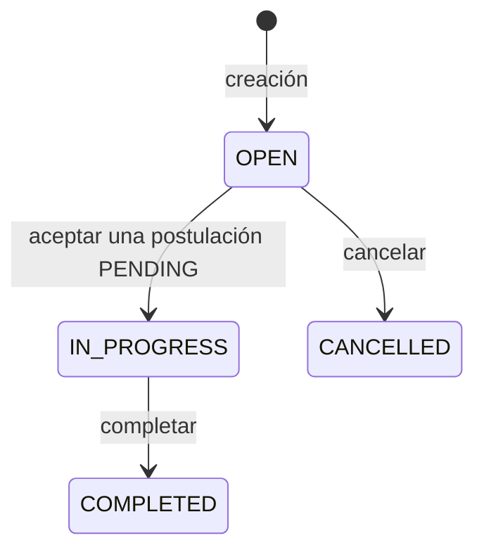
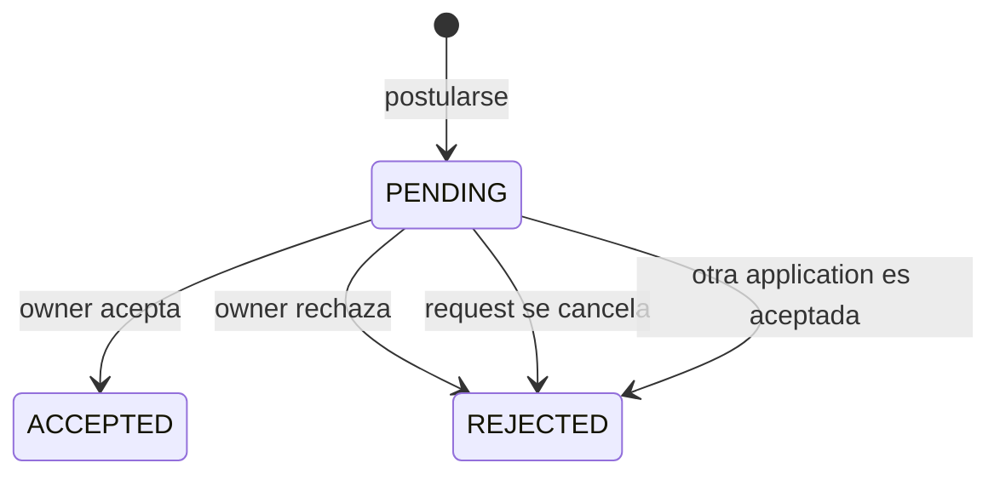
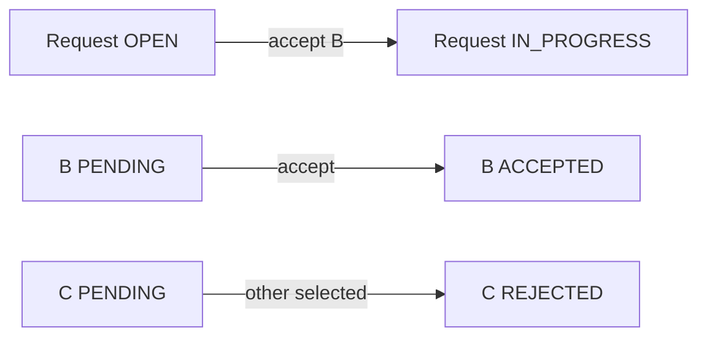
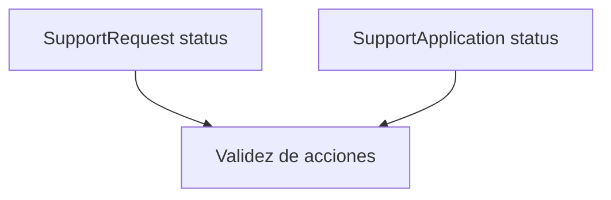
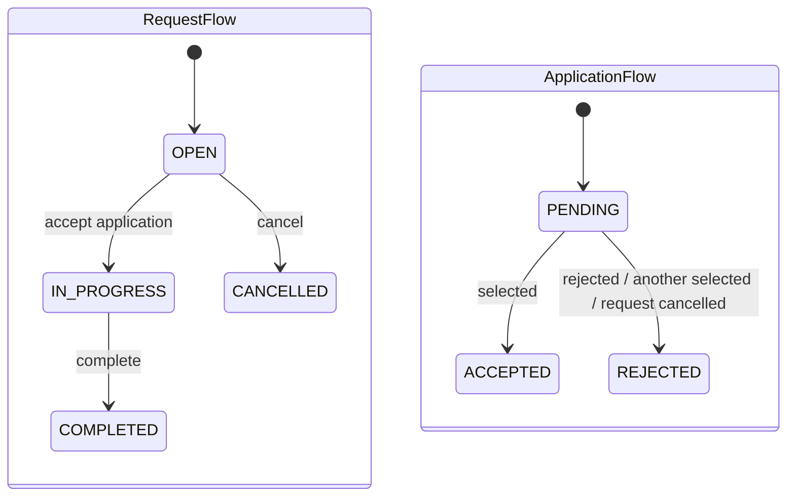

# 15 — Máquinas de estado

En PetMatch Community no todas las operaciones son CRUD libre.

Una solicitud no puede editarse en cualquier momento. Una postulación no puede aceptarse después de haber sido rechazada. Una solicitud no puede completarse si nunca estuvo en progreso.

Eso significa que el sistema no solo guarda datos: también controla **en qué estado está cada proceso y qué cambios de estado son válidos**.

La pregunta central de este capítulo es:

> **¿Cómo representa PetMatch los ciclos de vida de `SupportRequest` y `SupportApplication`, y dónde se impiden las transiciones inválidas?**

PetMatch no utiliza una librería especializada como Spring Statemachine. La máquina de estados está implementada de forma explícita mediante:

```text
Enums
+
valores iniciales de las Entities
+
reglas en Services
+
excepciones de estado
+
transacciones
```

---

# 1. ¿Qué es un estado?

Un **estado** representa una condición significativa en la que se encuentra un objeto o proceso en un momento determinado.

Una solicitud de PetMatch puede estar:

```text
OPEN
IN_PROGRESS
COMPLETED
CANCELLED
```

Una postulación puede estar:

```text
PENDING
ACCEPTED
REJECTED
```

Estos valores no son simples etiquetas visuales.

Cambian qué acciones están permitidas.

Por ejemplo:

```text
SupportRequest OPEN
→ puede editarse
→ puede cancelarse
→ puede recibir postulaciones válidas

SupportRequest IN_PROGRESS
→ ya no se edita como solicitud abierta
→ puede completarse
```

---

# 2. ¿Qué es una transición?

Una **transición de estado** es el paso permitido desde un estado hacia otro provocado por una acción o evento.

Ejemplo:

```text
OPEN
  ↓ aceptar una postulación
IN_PROGRESS
```

No basta con conocer el destino.

Una transición completa tiene al menos estas preguntas:

```text
¿estado actual?
¿acción solicitada?
¿condiciones adicionales?
¿nuevo estado?
¿qué otros objetos deben cambiar?
```

---

# 3. ¿Qué es una máquina de estados?

Una **máquina de estados finitos** es un modelo en el cual:

- existe un conjunto limitado de estados;
- existen transiciones permitidas;
- ciertas acciones solo son válidas desde determinados estados;
- una transición puede depender de condiciones adicionales.

PetMatch tiene un conjunto cerrado porque utiliza enums.

---

# 4. Estados de `SupportRequest`

Enum real:

```java
public enum SupportRequestStatus {
    OPEN,
    IN_PROGRESS,
    COMPLETED,
    CANCELLED
}
```

Ruta:

```text
src/main/java/com/petmatch/community/model/enums/SupportRequestStatus.java
```

El campo en la Entity se persiste como texto:

```java
@Enumerated(EnumType.STRING)
@Column(nullable = false, length = 20)
private SupportRequestStatus status;
```

---

# 5. Estado inicial de una solicitud

`SupportRequest` contiene:

```java
@PrePersist
void initializeDefaults() {
    if (createdAt == null) {
        createdAt = LocalDateTime.now();
    }
    if (status == null) {
        status = SupportRequestStatus.OPEN;
    }
}
```

Por tanto, una solicitud nueva comienza como:

```text
OPEN
```

Esto representa que todavía está disponible para participar en el flujo de postulaciones.

---

# 6. Máquina de estados real de `SupportRequest`

A partir de los Services actuales podemos reconstruir:



No aparecen en el código actual transiciones como:

```text
CANCELLED → OPEN
COMPLETED → OPEN
COMPLETED → IN_PROGRESS
IN_PROGRESS → CANCELLED
```

Por tanto no debemos enseñarlas como si existieran.

---

# 7. `OPEN` no significa solamente “mostrar badge OPEN”

El estado `OPEN` controla varias operaciones.

`SupportRequestService` tiene:

```java
private void requireOpen(SupportRequest request) {
    if (request.getStatus() != SupportRequestStatus.OPEN) {
        throw new SupportRequestStateException(request.getId());
    }
}
```

Este helper se utiliza antes de modificar o cancelar una solicitud.

Así:

```text
update(request)
→ requireOpen

cancel(request)
→ requireOpen
```

La regla está en backend, no solo en la interfaz.

---

# 8. Editar no es una transición de estado

`SupportRequestService.update(...)` exige:

```java
requireOpen(request);
```

pero después cambia:

```text
title
description
supportType
serviceDate
pet
```

No cambia:

```text
status
```

Por eso:

```text
OPEN --editar--> OPEN
```

No toda acción produce un nuevo estado.

Una máquina de estados también puede tener acciones permitidas que conservan el estado actual.

---

# 9. Cancelar: `OPEN → CANCELLED`

Código real:

```java
@Transactional
public void cancel(Long requestId, Authentication authentication) {
    SupportRequest request = findOwnedRequest(requestId, authentication);
    requireOpen(request);
    request.setStatus(SupportRequestStatus.CANCELLED);

    supportApplicationRepository
        .findBySupportRequestIdAndStatus(
            request.getId(),
            SupportApplicationStatus.PENDING
        )
        .forEach(application ->
            application.setStatus(SupportApplicationStatus.REJECTED)
        );
}
```

La transición principal es:

```text
SupportRequest
OPEN → CANCELLED
```

Pero no ocurre sola.

Las postulaciones todavía `PENDING` pasan a:

```text
REJECTED
```

---

# 10. Una transición puede afectar varias entidades

Cancelar muestra una idea importante:

```text
estado de Request
+
estados de Applications
```

deben permanecer coherentes.

Sería extraño tener:

```text
SupportRequest = CANCELLED
SupportApplication = PENDING
```

si esa postulación ya no puede ser atendida.

Por eso el Service coordina ambos cambios dentro del mismo caso de uso.

---

# 11. Completar: `IN_PROGRESS → COMPLETED`

Código real:

```java
@Transactional
public void complete(Long requestId, Authentication authentication) {
    SupportRequest request = findOwnedRequest(requestId, authentication);
    if (request.getStatus() != SupportRequestStatus.IN_PROGRESS) {
        throw new SupportRequestStateException(requestId);
    }
    request.setStatus(SupportRequestStatus.COMPLETED);
}
```

La transición permitida es:

```text
IN_PROGRESS → COMPLETED
```

Si la solicitud está:

```text
OPEN
CANCELLED
COMPLETED
```

la operación lanza:

```text
SupportRequestStateException
```

---

# 12. ¿Por qué no se puede completar una solicitud OPEN?

Porque el estado expresa una historia del proceso.

Completar significa que el apoyo ya estuvo realizándose.

El flujo implementado exige primero:

```text
OPEN
↓ aceptar una postulación
IN_PROGRESS
↓ completar
COMPLETED
```

Permitir:

```text
OPEN → COMPLETED
```

saltaría una etapa significativa del dominio.

---

# 13. `CANCELLED` y `COMPLETED` son estados terminales actuales

En la implementación actual, una vez una solicitud llega a:

```text
CANCELLED
```

o:

```text
COMPLETED
```

no existe un método Service que la lleve a otro estado.

Podemos tratarlos como **estados terminales del flujo implementado**.

> [!IMPORTANT]
> “Terminal” aquí describe el comportamiento actual de PetMatch. No significa que toda aplicación del mundo deba impedir reabrir una solicitud.

---

# 14. Estados de `SupportApplication`

Enum real:

```java
public enum SupportApplicationStatus {
    PENDING,
    ACCEPTED,
    REJECTED
}
```

Ruta:

```text
src/main/java/com/petmatch/community/model/enums/SupportApplicationStatus.java
```

---

# 15. Estado inicial de una postulación

`SupportApplication` contiene:

```java
@PrePersist
void initializeDefaults() {
    if (appliedAt == null) {
        appliedAt = LocalDateTime.now();
    }
    if (status == null) {
        status = SupportApplicationStatus.PENDING;
    }
}
```

Por tanto:

```text
nueva SupportApplication
→ PENDING
```

---

# 16. Máquina de estados de `SupportApplication`

Según el código actual:



No existe un método actual para:

```text
ACCEPTED → PENDING
REJECTED → PENDING
ACCEPTED → REJECTED
```

como operación normal de negocio.

---

# 17. Postularse también depende del estado de la solicitud

`SupportApplicationService.apply(...)` verifica:

```java
if (request.getStatus() != SupportRequestStatus.OPEN
    || !request.getServiceDate().isAfter(LocalDateTime.now())) {
    throw new SupportApplicationRuleException(
        "La solicitud ya no acepta postulaciones."
    );
}
```

No basta con que la postulación nueva vaya a comenzar en `PENDING`.

La solicitud debe estar:

```text
OPEN
```

y además su fecha de servicio debe seguir en el futuro.

Esto es una **guard condition** o condición de guarda conceptual.

---

# 18. ¿Qué es una guarda?

Una **guarda** es una condición que debe cumplirse antes de permitir una transición o acción.

Ejemplo conceptual:

```text
acción: apply

GUARDAS:
request.status == OPEN
serviceDate > now
applicant != owner
no existe postulación previa
```

Solo si todas se cumplen se crea:

```text
SupportApplication PENDING
```

---

# 19. Self-application no es un estado, es una regla

Código:

```java
if (request.getOwner().getId().equals(applicant.getId())) {
    throw new SupportApplicationRuleException(
        "No puedes postularte a tu propia solicitud."
    );
}
```

Esta condición no agrega otro estado como:

```text
SELF_REJECTED
```

Simplemente impide crear la postulación.

Esto demuestra que:

```text
máquina de estados
≠
todas las reglas del dominio
```

Las máquinas de estado representan ciclo de vida; otras reglas regulan quién puede iniciar acciones.

---

# 20. Aceptar es la transición coordinada más importante

Código real resumido:

```java
if (request.getStatus() != SupportRequestStatus.OPEN
    || application.getStatus() != SupportApplicationStatus.PENDING) {
    throw new SupportApplicationStateException(applicationId);
}

if (supportApplicationRepository.countBySupportRequestIdAndStatus(
    request.getId(),
    SupportApplicationStatus.ACCEPTED
) > 0) {
    throw new SupportApplicationStateException(applicationId);
}

application.setStatus(SupportApplicationStatus.ACCEPTED);
request.setStatus(SupportRequestStatus.IN_PROGRESS);

supportApplicationRepository
    .findBySupportRequestIdAndStatus(
        request.getId(),
        SupportApplicationStatus.PENDING
    )
    .stream()
    .filter(other -> !other.getId().equals(applicationId))
    .forEach(other ->
        other.setStatus(SupportApplicationStatus.REJECTED)
    );
```

Aquí varias máquinas cambian juntas.

---

# 21. Aceptación como transición múltiple

Antes:

```text
Request = OPEN
Application B = PENDING
Application C = PENDING
```

Después de aceptar B:

```text
Request = IN_PROGRESS
Application B = ACCEPTED
Application C = REJECTED
```

Diagrama:



Esta es una de las razones por las que el caso debe permanecer en el Service y dentro de una transacción.

---

# 22. ¿Por qué comprobar que no existe otra ACCEPTED?

PetMatch pregunta:

```java
countBySupportRequestIdAndStatus(
    request.getId(),
    SupportApplicationStatus.ACCEPTED
)
```

Y exige que el resultado sea cero antes de aceptar.

La invariante buscada es:

```text
por cada SupportRequest
→ como máximo una SupportApplication ACCEPTED
```

Esta regla conecta estado y consistencia.

El capítulo 16 explicará por qué además se usa locking.

---

# 23. Rechazar: solo `PENDING → REJECTED`

Código real:

```java
if (application.getSupportRequest().getStatus()
        != SupportRequestStatus.OPEN
    || application.getStatus()
        != SupportApplicationStatus.PENDING) {
    throw new SupportApplicationStateException(applicationId);
}

application.setStatus(SupportApplicationStatus.REJECTED);
```

La operación requiere simultáneamente:

```text
request = OPEN
application = PENDING
```

No basta con mirar únicamente el estado de la postulación.

---

# 24. Las máquinas están relacionadas

PetMatch no tiene dos ciclos de vida completamente independientes.

El estado de `SupportRequest` condiciona acciones sobre `SupportApplication`.

Por ejemplo:

```text
Request CANCELLED
→ no aceptar Application

Request IN_PROGRESS
→ no rechazar una PENDING mediante el flujo normal

Request OPEN
→ aún puede operar sobre postulaciones PENDING
```

Una buena forma de pensarlo es:



---

# 25. Tabla completa de transiciones de Request

| Acción | Estado requerido | Estado final | Otros efectos |
|---|---|---|---|
| crear | nueva Entity | `OPEN` | fija `createdAt` |
| editar | `OPEN` | `OPEN` | modifica datos, no status |
| cancelar | `OPEN` | `CANCELLED` | PENDING → REJECTED |
| aceptar una postulación | `OPEN` | `IN_PROGRESS` | una ACCEPTED, otras PENDING → REJECTED |
| completar | `IN_PROGRESS` | `COMPLETED` | ninguno adicional visible |

---

# 26. Tabla de transiciones de Application

| Acción | Request requerida | Application requerida | Resultado |
|---|---|---|---|
| crear postulación | `OPEN` + fecha futura | nueva | `PENDING` |
| aceptar | `OPEN` | `PENDING` | `ACCEPTED` |
| rechazar manualmente | `OPEN` | `PENDING` | `REJECTED` |
| aceptar otra | `OPEN` al iniciar operación | `PENDING` | `REJECTED` |
| cancelar request | `OPEN` al iniciar cancelación | `PENDING` | `REJECTED` |

---

# 27. Excepciones de estado

PetMatch diferencia excepciones específicas:

```text
SupportRequestStateException
SupportApplicationStateException
```

Esto permite expresar:

```text
el recurso existe
pero la operación no es válida en su estado actual
```

Eso es diferente de:

```text
recurso no encontrado
```

Y también diferente de algunas reglas más generales representadas por:

```text
SupportApplicationRuleException
```

---

# 28. Estado inválido vs recurso inexistente

Ejemplo:

```text
request id 10 no existe
→ SupportRequestNotFoundException
```

Mientras:

```text
request id 10 existe pero está COMPLETED
y alguien intenta cancelarla
→ SupportRequestStateException
```

Esa distinción mejora la semántica del código.

---

# 29. El Controller puede anticipar una regla, pero no sustituirla

`SupportRequestController.editForm(...)` comprueba:

```java
if (request.getStatus() != SupportRequestStatus.OPEN) {
    ...
}
```

Esto ayuda a la experiencia web.

Pero `SupportRequestService.update(...)` vuelve a ejecutar:

```java
requireOpen(request);
```

¿Por qué duplicar aparentemente la condición?

Porque:

```text
Controller
→ experiencia/interfaz

Service
→ regla autoritativa
```

Un cliente REST o una llamada interna no pasa necesariamente por esa pantalla MVC.

---

# 30. Ocultar un botón no implementa una máquina de estados

Una interfaz puede ocultar “Completar” cuando la request está `OPEN`.

Eso es útil.

Pero un usuario podría intentar enviar directamente:

```text
POST /support-requests/{id}/complete
```

La protección real está en:

```java
if (request.getStatus() != SupportRequestStatus.IN_PROGRESS) {
    throw new SupportRequestStateException(requestId);
}
```

La máquina de estados debe protegerse en backend.

---

# 31. Estado y visibilidad

`SupportRequestService.findVisibleRequest(...)` contiene:

```java
if (request.getStatus() != SupportRequestStatus.OPEN
    && !owner
    && !applicant) {
    throw new SupportRequestNotFoundException(requestId);
}
```

Eso significa:

```text
OPEN
→ puede ser visible más ampliamente

no OPEN
→ solo owner o applicant relacionado
```

El estado también participa en reglas de acceso/visibilidad.

No es solamente parte de las transiciones.

---

# 32. El tiempo puede comportarse como una condición de estado

Una request puede conservar:

```text
status = OPEN
```

pero si:

```text
serviceDate <= now
```

`apply(...)` rechaza nuevas postulaciones.

Además `findOpenRequests()` filtra:

```java
SupportRequestStatus.OPEN,
LocalDateTime.now()
```

mediante:

```text
findByStatusAndServiceDateAfterOrderByServiceDateAsc
```

Entonces “abierta para postularse” significa más que leer una sola columna.

---

# 33. Estado persistido vs estado derivado

PetMatch persiste explícitamente:

```text
OPEN
IN_PROGRESS
COMPLETED
CANCELLED
```

Pero una condición como:

```text
OPEN pero serviceDate vencida
```

se deriva combinando status y fecha.

No existe un enum adicional:

```text
EXPIRED
```

`EXPIRED` no forma parte de los estados implementados.

---

# 34. ¿Por qué usar enum?

Sin enum podríamos tener:

```java
private String status;
```

Y valores inválidos como:

```text
"open"
"OPENED"
"DONE"
"in progress"
```

Con enum:

```java
SupportRequestStatus.OPEN
```

el compilador ayuda a restringir el conjunto de estados posibles en Java.

---

# 35. `EnumType.STRING`

PetMatch persiste los enums como:

```java
@Enumerated(EnumType.STRING)
```

Eso conserva en base de datos valores significativos como:

```text
OPEN
IN_PROGRESS
```

en lugar de depender de la posición numérica del enum.

Esto es importante para un estado porque su significado debe permanecer claro.

---

# 36. La Entity permite `setStatus`, el Service controla cuándo

Las Entities tienen setters como:

```java
public void setStatus(SupportRequestStatus status) {
    this.status = status;
}
```

Eso técnicamente permitiría asignar distintos estados desde código Java.

Pero los casos de uso normales centralizan las decisiones en Services.

Por tanto:

```text
setter
→ mecanismo de modificación

Service
→ autorización semántica para modificar
```

No confundas capacidad técnica con regla de negocio.

---

# 37. ¿Es esta una “State Machine” de Spring?

No.

El proyecto no incluye una dependencia o configuración de Spring Statemachine.

La expresión **máquina de estados** en este capítulo describe el modelo conceptual implementado por enums y reglas explícitas.

Eso es suficiente para el tamaño actual del dominio.

Una librería especializada podría ser una alternativa en sistemas con procesos mucho más complejos, pero no forma parte de PetMatch.

---

# 38. ¿Cuándo una máquina explícita puede crecer demasiado?

Si un sistema tuviera:

```text
30 estados
50 eventos
transiciones temporizadas
subestados
compensaciones
workflows externos
```

muchos `if` distribuidos podrían resultar difíciles de mantener.

En PetMatch el ciclo actual es pequeño y legible.

La decisión correcta depende de complejidad real, no del deseo de usar una herramienta más sofisticada.

---

# 39. Estado e invariantes

Una **invariante** es una condición que debería mantenerse verdadera en los estados válidos del sistema.

Ejemplos del flujo PetMatch:

```text
Request IN_PROGRESS
→ debe corresponder al proceso de una postulación aceptada
```

```text
por Request
→ no más de una Application ACCEPTED
```

```text
Request CANCELLED
→ las Applications que seguían PENDING pasan a REJECTED
```

Las transiciones existen para preservar esas condiciones.

---

# 40. Estado y transacción

Una transición coordinada como aceptar modifica varias Entities.

Si solo guardáramos:

```text
Application = ACCEPTED
```

pero fallara antes de:

```text
Request = IN_PROGRESS
```

el sistema quedaría incoherente.

Por eso el capítulo 14 explicó que las transiciones importantes viven dentro de:

```java
@Transactional
```

Máquinas de estado y transacciones colaboran.

---

# 41. Estado y concurrencia

Incluso con reglas correctas, dos peticiones concurrentes podrían intentar:

```text
aceptar Application B
```

y:

```text
aceptar Application C
```

sobre la misma request casi al mismo tiempo.

Ambas podrían preguntar:

```text
¿Request está OPEN?
¿hay ACCEPTED?
```

Ese es un problema distinto: **concurrencia**.

PetMatch usa locking pesimista en esa ruta.

Será el tema del capítulo 16.

---

# 42. Pruebas como especificación de transición

`SupportApplicationServiceTests` contiene un test cuyo nombre expresa:

```text
acceptMovesRequestToInProgressAndRejectsOtherPendingApplications
```

Y verifica:

```text
selected → ACCEPTED
request → IN_PROGRESS
otherPending → REJECTED
```

`SupportRequestServiceTests` verifica:

```text
cancelRejectsPendingApplications
```

Estas pruebas sirven como documentación ejecutable del ciclo de vida esperado.

---

# 43. Mapa completo del flujo principal



Debes leer ambos diagramas juntos.

---

# 44. ⚠️ Errores frecuentes

## Error 1 — Tratar `status` como texto decorativo

El estado determina acciones válidas.

## Error 2 — Permitir cualquier `setStatus(...)` desde Controllers

Las transiciones deben controlarse mediante casos de uso.

## Error 3 — Proteger solo la interfaz

Ocultar botones no reemplaza las reglas del Service.

## Error 4 — Crear un estado para cada error

“No puedes postularte a tu solicitud” es una regla, no necesariamente un estado.

## Error 5 — Inventar `EXPIRED`

PetMatch no tiene ese enum; la expiración se deriva de `serviceDate`.

## Error 6 — Permitir `OPEN → COMPLETED`

No existe esa transición en el Service actual.

## Error 7 — Olvidar efectos secundarios de una transición

Cancelar también rechaza pendientes; aceptar también rechaza otras pendientes.

## Error 8 — Creer que `@Transactional` evita automáticamente carreras concurrentes

Atomicidad y concurrencia son problemas relacionados pero distintos.

## Error 9 — Decir que PetMatch usa Spring Statemachine

No existe esa implementación.

---

# 45. 🛠 Prueba en el código

## Actividad 1 — Reconstruye la máquina

Abre:

```text
SupportRequestService.java
SupportApplicationService.java
```

Dibuja todos los cambios de `setStatus(...)`.

## Actividad 2 — Tabla de guardas

Para estas acciones:

```text
apply
update request
cancel request
complete request
accept application
reject application
```

escribe:

```text
estado requerido
regla adicional
excepción si falla
```

## Actividad 3 — Busca estados inexistentes

Comprueba si existen enums para:

```text
EXPIRED
ARCHIVED
WITHDRAWN
REOPENED
```

No los uses en diagramas si no existen.

## Actividad 4 — Sigue una cancelación

Parte de:

```text
OPEN + dos Applications PENDING
```

y escribe el resultado exacto después de `cancel(...)`.

## Actividad 5 — Sigue una aceptación

Parte de:

```text
Request OPEN
A PENDING
B PENDING
C REJECTED
```

Acepta B y predice el estado final de los cuatro objetos.

---

# 46. 🧪 Comprueba que entendiste

1. ¿Qué es un estado?
2. ¿Qué es una transición?
3. ¿Cuáles son los estados reales de `SupportRequest`?
4. ¿Cuál es su estado inicial?
5. ¿Cuáles son las transiciones que cambian su estado?
6. ¿Puede una request `OPEN` completarse directamente?
7. ¿Qué ocurre con las applications PENDING cuando se cancela una request?
8. ¿Cuáles son los estados de `SupportApplication`?
9. ¿Cuál es su estado inicial?
10. ¿Qué condiciones exige `apply(...)` sobre la request?
11. ¿Qué ocurre con las otras PENDING cuando una es aceptada?
12. ¿Qué invariante intenta proteger el count de ACCEPTED?
13. ¿Existe `EXPIRED` como enum?
14. ¿PetMatch usa Spring Statemachine?
15. ¿Por qué una comprobación en el Controller no reemplaza la comprobación del Service?
16. ¿Por qué aceptar requiere una transacción?
17. ¿Qué problema adicional aparece cuando dos aceptaciones ocurren concurrentemente?

### Respuestas esperadas

1. Condición significativa actual de un proceso/objeto.
2. Cambio permitido desde un estado a otro.
3. `OPEN`, `IN_PROGRESS`, `COMPLETED`, `CANCELLED`.
4. `OPEN`.
5. cancelar, aceptar una postulación y completar.
6. No; `complete` exige `IN_PROGRESS`.
7. Pasan a `REJECTED`.
8. `PENDING`, `ACCEPTED`, `REJECTED`.
9. `PENDING`.
10. `OPEN` y `serviceDate` futura, además de reglas de applicant.
11. Pasan a `REJECTED`.
12. Como máximo una application ACCEPTED por request.
13. No.
14. No.
15. Porque el Service es la protección compartida por distintos clientes/interfaces.
16. Porque cambia coordinadamente varias Entities que deben quedar consistentes.
17. Una race condition; ambas operaciones podrían evaluar condiciones sobre el mismo estado.

---

# 47. ✅ Qué debes recordar

- **Los estados de PetMatch son reglas de ciclo de vida, no etiquetas visuales.**
- `SupportRequest` empieza en `OPEN`.
- `OPEN → IN_PROGRESS` ocurre al aceptar una postulación.
- `OPEN → CANCELLED` ocurre al cancelar.
- `IN_PROGRESS → COMPLETED` ocurre al completar.
- `SupportApplication` empieza en `PENDING`.
- `PENDING → ACCEPTED` o `PENDING → REJECTED` son las transiciones implementadas.
- Cancelar una request rechaza sus postulaciones pendientes.
- Aceptar una postulación rechaza las otras pendientes.
- `serviceDate` futura funciona como condición adicional para postularse.
- `EXPIRED` no es un estado implementado.
- Las reglas autoritativas están en Services aunque la UI también anticipe algunas.
- Las transiciones coordinadas necesitan transacciones.
- La invariante crítica es que no haya más de una postulación aceptada para una solicitud.
- PetMatch implementa estas máquinas explícitamente; no usa Spring Statemachine.
- Una transacción no basta por sí sola para resolver carreras concurrentes.

---

# 🔗 Continúa con

Ya sabemos qué transición es válida.

Ahora debemos responder:

> **¿Qué ocurre si dos transacciones intentan ejecutar una transición válida al mismo tiempo sobre la misma solicitud?**

Eso nos lleva a:

**[Capítulo 16 — Concurrencia y locking →](16-concurrencia-y-locking.md)**

---

[← Capítulo 14 — Transacciones y consistencia](14-transacciones-y-consistencia.md) · [Índice del bloque](README.md) · [Índice general](../README.md) · [Siguiente → Capítulo 16](16-concurrencia-y-locking.md)
