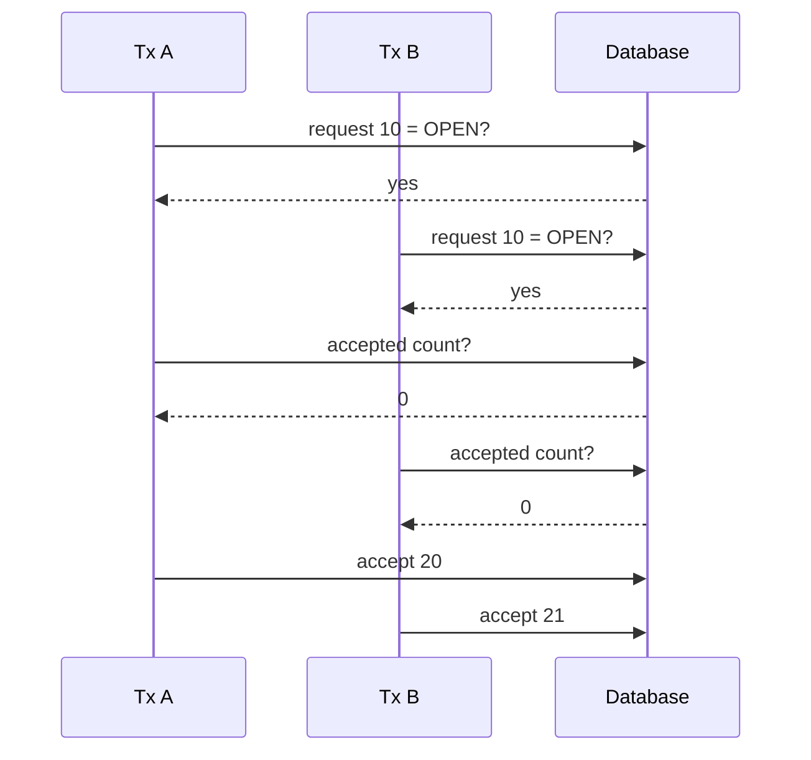
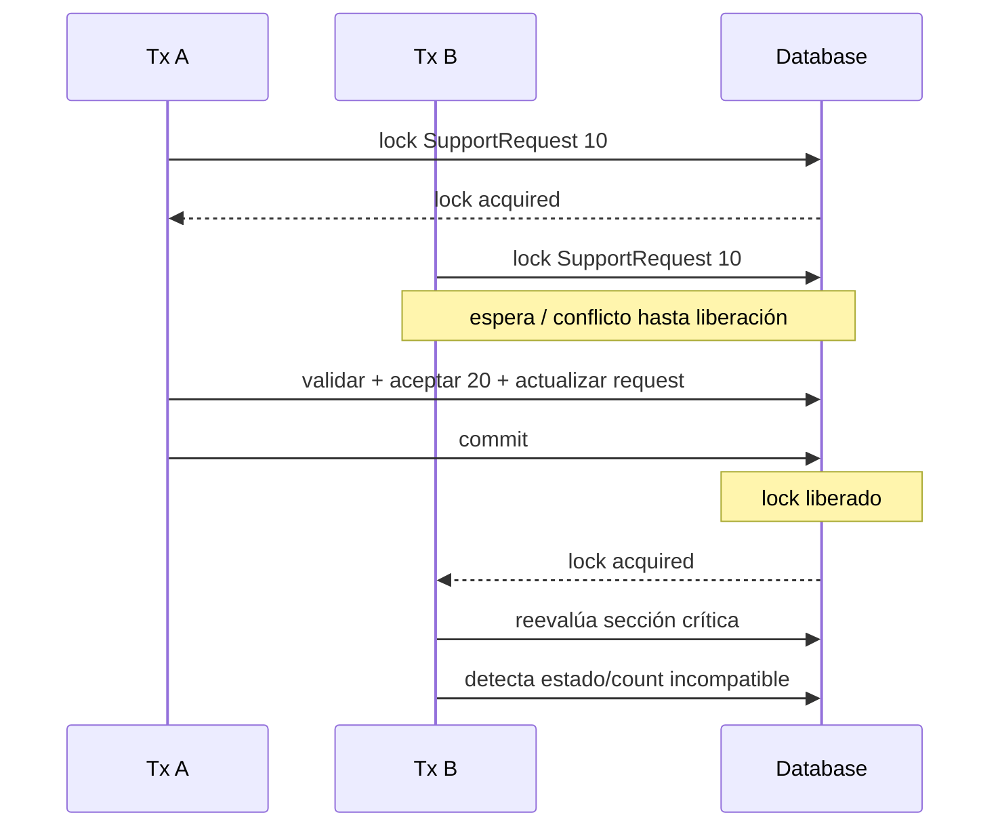

# 16 — Concurrencia y locking

En el capítulo anterior reconstruimos una regla crítica de PetMatch:

```text
por cada SupportRequest
→ como máximo una SupportApplication ACCEPTED
```

En una ejecución secuencial parece sencillo:

```text
1. comprobar que la request está OPEN
2. comprobar que la application está PENDING
3. comprobar que todavía no existe otra ACCEPTED
4. aceptar una
5. pasar la request a IN_PROGRESS
6. rechazar las demás PENDING
```

Pero una aplicación web no atiende necesariamente una petición a la vez.

Dos peticiones pueden llegar casi simultáneamente.

La pregunta central de este capítulo es:

> **¿Qué ocurre si dos transacciones intentan aceptar postulaciones diferentes de la misma solicitud al mismo tiempo?**

Ese problema se llama **concurrencia** y PetMatch lo aborda explícitamente mediante un **pessimistic write lock** sobre `SupportRequest`.

---

# 1. Secuencial vs concurrente

## Ejecución secuencial

```text
Operación A termina
↓
Operación B comienza
```

Es fácil razonar porque B ve el resultado final de A.

## Ejecución concurrente

```text
Operación A empieza
         ↘
           se solapa
         ↗
Operación B empieza
```

Ambas pueden leer datos antes de que la otra haya terminado.

Ahí aparece el riesgo.

---

# 2. El caso real que debemos proteger

Supón esta situación:

```text
SupportRequest 10 = OPEN
Application 20 = PENDING
Application 21 = PENDING
Accepted count = 0
```

Dos peticiones llegan casi a la vez:

```text
Transacción A
→ aceptar Application 20

Transacción B
→ aceptar Application 21
```

La regla deseada sigue siendo:

```text
solo una puede terminar ACCEPTED
```

---

# 3. Race condition

Una **race condition** ocurre cuando el resultado depende del orden/intercalado temporal de operaciones concurrentes sobre estado compartido.

Sin coordinación, podría ocurrir conceptualmente:

```text
A lee request = OPEN
B lee request = OPEN

A cuenta ACCEPTED = 0
B cuenta ACCEPTED = 0

A acepta 20
B acepta 21
```

Si ambas decisiones se tomaran sobre la misma fotografía antigua, podríamos terminar violando:

```text
máximo una ACCEPTED
```

Ese patrón se conoce como **check-then-act**:

```text
comprobar condición
↓
actuar
```

La dificultad es que otra transacción puede cambiar el mundo entre la comprobación y la acción.

---

# 4. `@Transactional` no resuelve por sí sola todas las carreras

`SupportApplicationService.accept(...)` está marcado:

```java
@Transactional
public void accept(Long applicationId, Authentication authentication) {
```

Eso proporciona una unidad transaccional.

Pero dos transacciones distintas pueden existir al mismo tiempo.

Cada una puede ser atómica internamente y aun así competir con la otra.

Por tanto:

```text
atomicidad
≠
serialización automática de todas las operaciones concurrentes
```

Necesitamos una estrategia adicional.

---

# 5. La estrategia real: bloquear la `SupportRequest`

`SupportRequestRepository` declara:

```java
@Lock(LockModeType.PESSIMISTIC_WRITE)
@Query("select sr from SupportRequest sr where sr.id = :id")
Optional<SupportRequest> findByIdForUpdate(@Param("id") Long id);
```

Ruta:

```text
src/main/java/com/petmatch/community/repository/SupportRequestRepository.java
```

Y `accept(...)` la utiliza:

```java
SupportRequest request = supportRequestRepository
    .findByIdForUpdate(application.getSupportRequest().getId())
    .orElseThrow(() -> new SupportRequestNotFoundException(
        application.getSupportRequest().getId()
    ));
```

---

# 6. ¿Qué significa `PESSIMISTIC_WRITE`?

Un **pessimistic write lock** parte de una idea conservadora:

> “Voy a modificar este dato crítico; mientras mi transacción lo utiliza, otras transacciones no deberían poder adquirir un lock incompatible para modificarlo concurrentemente”.

Conceptualmente:

```text
Transacción A
→ adquiere lock sobre SupportRequest 10
→ ejecuta sección crítica
→ commit/rollback
→ libera lock

Transacción B
→ intenta adquirir lock incompatible sobre SupportRequest 10
→ debe esperar o fallar según DB/configuración
→ continúa cuando puede obtenerlo
```

Los detalles exactos de espera, timeout y SQL emitido dependen del proveedor JPA y de la base de datos.

La idea arquitectónica sí es clara:

```text
la misma request es el recurso compartido que serializa la aceptación
```

---

# 7. ¿Por qué bloquear la request y no una application individual?

El conflicto real no es:

```text
“dos personas modifican la misma SupportApplication”
```

Puede ser:

```text
A modifica Application 20
B modifica Application 21
```

Son filas diferentes.

Pero ambas decisiones compiten por la misma regla:

```text
SupportRequest 10
→ solo puede tener una aceptada
```

Por eso la request es el **aggregate/shared coordination point** natural del caso.

Bloquear solamente cada application por separado no coordinaría dos applications distintas pertenecientes a la misma request.

---

# 8. Orden real de `accept(...)`

El método realiza:

```text
1. identificar current owner
2. recuperar application verificando owner de la request
3. recuperar la request con PESSIMISTIC_WRITE
4. comprobar request OPEN
5. comprobar application PENDING
6. contar applications ACCEPTED
7. selected → ACCEPTED
8. request → IN_PROGRESS
9. otras PENDING → REJECTED
```

Código central:

```java
SupportApplication application = supportApplicationRepository
    .findByIdAndSupportRequestOwnerId(applicationId, owner.getId())
    .orElseThrow(() -> new SupportApplicationNotFoundException(applicationId));

SupportRequest request = supportRequestRepository
    .findByIdForUpdate(application.getSupportRequest().getId())
    .orElseThrow(() -> new SupportRequestNotFoundException(
        application.getSupportRequest().getId()
    ));
```

El lock aparece **antes de las comprobaciones críticas que deben coordinarse**.

---

# 9. Sección crítica

Una **sección crítica** es la parte del código que opera sobre un recurso compartido y necesita coordinación para evitar interferencia concurrente.

En PetMatch podemos pensar en:

```text
LOCK request
↓
validar estado
↓
verificar que no hay accepted
↓
aceptar una
↓
cambiar request
↓
rechazar otras
↓
commit
```

Ese conjunto constituye la región crítica de la aceptación.

---

# 10. Línea de tiempo sin coordinación

Un escenario peligroso conceptual:



Este diagrama no representa el comportamiento actual protegido; representa el problema que el lock intenta evitar.

---

# 11. Línea de tiempo con lock pesimista

Modelo conceptual del diseño actual:



La segunda transacción ya no debería tomar su decisión como si fuera la única operando sobre la request.

---

# 12. El segundo control: contar `ACCEPTED`

Después de adquirir la request con lock, PetMatch ejecuta:

```java
if (supportApplicationRepository.countBySupportRequestIdAndStatus(
    request.getId(),
    SupportApplicationStatus.ACCEPTED
) > 0) {
    throw new SupportApplicationStateException(applicationId);
}
```

Esto protege directamente la invariante:

```text
accepted count debe ser 0 antes de aceptar otra
```

Es importante porque la regla no depende únicamente de leer `request.status`.

---

# 13. Defensa en profundidad dentro del caso de uso

La aceptación tiene varias barreras:

```text
ownership
↓
request lock
↓
request debe estar OPEN
↓
application debe estar PENDING
↓
accepted count debe ser 0
↓
transición coordinada
```

Cada verificación protege una dimensión diferente.

No son duplicaciones inútiles.

---

# 14. ¿Por qué el lock debe vivir dentro de una transacción?

Un lock de base de datos tiene sentido mientras existe una unidad transaccional que lo mantiene.

`accept(...)` está marcado:

```java
@Transactional
```

El lock se adquiere durante esa transacción y permanece asociado a ella hasta su finalización según las reglas del proveedor/base de datos.

Si intentáramos obtener un pessimistic lock sin un contexto transaccional apropiado, no tendríamos el mismo modelo de exclusión útil para coordinar el caso completo.

---

# 15. Lock no significa `synchronized` de Java

Podríamos pensar en:

```java
synchronized
```

pero no es equivalente.

Un `synchronized` local coordina threads **dentro de una misma JVM y sobre un monitor concreto**.

Una aplicación desplegada podría tener:

```text
instancia A
instancia B
misma base de datos
```

Un lock a nivel de base de datos coordina sobre el recurso persistido compartido, no solo dentro de una instancia Java.

> [!IMPORTANT]
> PetMatch implementa locking JPA/DB, no un `synchronized` alrededor de `accept(...)`.

---

# 16. ¿Qué pasa si dos users aceptan desde dos navegadores?

Aunque el owner funcional sea el mismo usuario autenticado, puede tener:

```text
pestaña A
pestaña B
```

o incluso dos sesiones/dispositivos.

La UI no puede asumir:

```text
“el usuario solo hará clic una vez”
```

La protección debe vivir en backend y persistencia.

---

# 17. Doble clic también es concurrencia posible

Incluso un doble clic rápido puede producir dos requests HTTP separadas.

No toda concurrencia requiere miles de usuarios.

Puede ocurrir con:

```text
un usuario
+
dos peticiones casi simultáneas
```

Por eso las reglas críticas deben ser idempotentes o estar coordinadas apropiadamente según el caso.

`accept(...)` rechaza una segunda aceptación cuando el estado ya no permite la transición.

---

# 18. Lock pesimista vs optimista

Hay dos familias comunes de estrategias.

## Pessimistic locking

Idea:

```text
bloqueo antes de modificar
```

PetMatch usa:

```java
LockModeType.PESSIMISTIC_WRITE
```

## Optimistic locking

Idea general:

```text
permitir trabajo concurrente
+
detectar conflicto al actualizar
```

JPA suele implementarlo mediante un campo anotado con:

```java
@Version
```

Pero PetMatch **no contiene actualmente un campo `@Version`**.

Por tanto no debemos afirmar que utiliza optimistic locking.

---

# 19. ¿Por qué no agregar `@Version` en la documentación?

Porque este libro documenta la implementación real.

`@Version` podría ser una alternativa válida en otro diseño, pero cambiaría el modelo y la estrategia de concurrencia.

La implementación actual eligió explícitamente:

```text
pessimistic write lock
sobre SupportRequest
para accept(...)
```

Eso es lo que debemos comprender.

---

# 20. Trade-off del locking pesimista

Ventaja conceptual:

```text
reduce la ventana de carrera al serializar acceso crítico
```

Costo:

```text
una transacción puede tener que esperar a otra
```

Locks mantenidos demasiado tiempo pueden afectar throughput y aumentar riesgos de contención.

Por eso una buena práctica conceptual es:

```text
transacción crítica
→ suficientemente corta
→ sin trabajo externo lento innecesario
```

`accept(...)` trabaja esencialmente con base de datos y cambios de estado locales.

---

# 21. No hacer llamadas remotas lentas mientras mantienes un lock

Imagina —como ejemplo no implementado— que dentro de `accept(...)` hiciéramos:

```text
adquirir lock
↓
llamar a una API externa que tarda 20 segundos
↓
enviar archivo
↓
consultar otro servicio
↓
commit
```

Mantendríamos el recurso bloqueado durante trabajo que no necesita exclusión de DB.

PetMatch no hace eso en este flujo.

La lección general es mantener la sección crítica tan enfocada como sea razonable.

---

# 22. Deadlock: concepto que debemos conocer

Un **deadlock** puede aparecer cuando transacciones adquieren locks en órdenes incompatibles y cada una espera un recurso retenido por la otra.

Ejemplo conceptual:

```text
Tx A bloquea X, luego espera Y
Tx B bloquea Y, luego espera X
```

La base de datos suele detectar situaciones de este tipo y abortar alguna transacción.

PetMatch no contiene una lógica especial de deadlock recovery que debamos documentar.

La enseñanza aquí es simplemente:

```text
locking resuelve problemas
pero introduce responsabilidades de diseño
```

---

# 23. ¿Hay timeout de lock configurado?

En los archivos actuales no existe una configuración específica de timeout para este lock.

El método declara:

```java
@Lock(LockModeType.PESSIMISTIC_WRITE)
```

pero no añade hints específicos de timeout.

Por tanto el libro no debe inventar un tiempo de espera concreto.

El comportamiento final depende de JPA/Hibernate/MySQL y configuración del entorno.

---

# 24. La query bloqueada

Código real:

```java
@Query("select sr from SupportRequest sr where sr.id = :id")
```

Es JPQL.

El lock se aplica a la Entity `SupportRequest` seleccionada por ese query.

El SQL concreto generado por Hibernate puede variar según dialecto/proveedor.

No es necesario fijar un `SELECT ... FOR UPDATE` exacto para explicar el concepto, aunque ese sea el tipo de mecanismo SQL que normalmente sustenta un pessimistic write lock en bases relacionales compatibles.

---

# 25. ¿Por qué no bloquear todas las lecturas?

PetMatch no aplica `PESSIMISTIC_WRITE` a:

```text
findOpenRequests
findCurrentUserRequests
findById normal
```

Esas operaciones son lecturas normales.

El lock aparece en el caso donde existe una decisión concurrente crítica:

```text
aceptar una postulación única
```

Bloquear indiscriminadamente todas las consultas empeoraría concurrencia sin necesidad.

---

# 26. Concurrencia en `apply(...)`

Otro patrón sensible es:

```java
if (supportApplicationRepository
    .existsByApplicantIdAndSupportRequestId(applicant.getId(), requestId)) {
    throw ...;
}

supportApplicationRepository.save(new SupportApplication(...));
```

Dos peticiones concurrentes del mismo applicant podrían, conceptualmente, pasar el `exists` antes de que ninguna inserción sea visible.

¿Existe otra defensa?

Sí: la tabla tiene una restricción UNIQUE real sobre:

```text
applicant_id + support_request_id
```

---

# 27. UNIQUE como barrera final contra duplicados

`SupportApplication` declara:

```java
@UniqueConstraint(
    name = "uk_support_applications_applicant_request",
    columnNames = {"applicant_id", "support_request_id"}
)
```

Por tanto:

```text
Service check
→ buena experiencia / regla explícita

DB UNIQUE
→ última barrera estructural ante duplicado concurrente
```

Este es un ejemplo excelente de defensa en varios niveles.

---

# 28. Check previo no reemplaza constraint

Si solo existiera:

```text
exists(...)
↓
insert
```

sin UNIQUE, una carrera todavía podría crear duplicados.

La base de datos es el único componente que ve todas las transacciones que compiten por la misma unicidad persistente.

Por eso una regla de unicidad importante suele merecer una restricción real de DB además de una validación previa.

---

# 29. ¿Existe una restricción UNIQUE para una ACCEPTED por request?

No vemos en el modelo actual una constraint de base de datos que diga:

```text
solo una fila con status = ACCEPTED por support_request_id
```

La protección implementada para esa regla está en el caso de uso:

```text
lock de request
+
status checks
+
count ACCEPTED
+
transacción
```

El proyecto no define un índice parcial o constraint adicional para este caso.

---

# 30. Consistencia lógica vs constraint estructural

Comparación:

## Duplicar postulación del mismo applicant

Tiene:

```text
Service exists check
+
DB UNIQUE(applicant_id, support_request_id)
```

## Tener dos ACCEPTED

Tiene:

```text
Service rule
+
pessimistic lock
+
count
+
transaction
```

Son dos problemas de consistencia resueltos con estrategias diferentes.

---

# 31. ¿Qué pasa después de que A hace commit?

La transacción B que estaba esperando puede continuar.

En ese momento la sección crítica vuelve a evaluar condiciones como:

```text
request status
accepted count
```

El detalle exacto de refresh/visibilidad de Entities ya cargadas depende del persistence context, proveedor e isolation level.

Lo importante del diseño es que B **no puede atravesar simultáneamente la región bloqueada sobre la misma request** y además vuelve a consultar el conteo de aceptadas antes de modificar.

> [!NOTE]
> Evitamos afirmar detalles internos de refresh que el código no configura explícitamente.

---

# 32. Isolation level

Las bases de datos ofrecen niveles de aislamiento transaccional.

PetMatch no configura explícitamente un isolation level particular para estos métodos.

Por tanto no debemos afirmar:

```text
“accept usa SERIALIZABLE”
```

o:

```text
“usa REPEATABLE_READ porque lo configuramos”
```

El proyecto se apoya en el lock explícito para la fila crítica, además del comportamiento transaccional del datasource/base de datos.

---

# 33. Locking y rollback

Si la operación lanza una RuntimeException y la transacción hace rollback, los cambios no se confirman.

El lock asociado a esa transacción también deja de mantenerse cuando la transacción finaliza.

Así una operación fallida no debería mantener indefinidamente el bloqueo por el simple hecho de haber lanzado una excepción normal de aplicación.

---

# 34. Locking y dirty checking

Después de adquirir la request y validar:

```java
application.setStatus(SupportApplicationStatus.ACCEPTED);
request.setStatus(SupportRequestStatus.IN_PROGRESS);
```

No vemos `save()` para cada cambio.

Las Entities están managed dentro de la transacción y Hibernate puede persistir modificaciones mediante dirty checking.

El lock protege la región concurrente; dirty checking persiste el estado modificado.

Son responsabilidades distintas.

---

# 35. Locking y otras PENDING

Después de aceptar:

```java
supportApplicationRepository
    .findBySupportRequestIdAndStatus(
        request.getId(),
        SupportApplicationStatus.PENDING
    )
    .stream()
    .filter(other -> !other.getId().equals(applicationId))
    .forEach(other ->
        other.setStatus(SupportApplicationStatus.REJECTED)
    );
```

El lock de la request protege el punto común del proceso mientras se transforma el conjunto de applications asociado.

No hay un lock explícito individual sobre cada application en este método.

---

# 36. ¿Por qué el Controller no debe resolver la concurrencia?

El Controller solo recibe la petición HTTP.

No puede garantizar que no exista simultáneamente otra petición en:

```text
otro thread
otra pestaña
otra instancia
```

La coordinación debe ocurrir donde existe el estado compartido:

```text
transacción + base de datos
```

---

# 37. ¿Y el frontend deshabilitando el botón?

Es útil para UX, pero no para integridad.

Un botón deshabilitado puede reducir dobles clics, pero:

```text
no protege API
no protege requests manuales
no protege múltiples pestañas
no protege múltiples instancias
```

El backend sigue siendo autoritativo.

---

# 38. Pruebas y concurrencia

Las pruebas unitarias actuales verifican la transición funcional de `accept(...)`:

```text
selected ACCEPTED
request IN_PROGRESS
otherPending REJECTED
```

Las pruebas actuales no constituyen una prueba concurrente de dos transacciones reales compitiendo por el mismo lock.

> [!IMPORTANT]
> No debemos afirmar que la carrera está cubierta por un test concurrente si ese test no existe.

El código sí contiene la estrategia de locking que hemos analizado.

---

# 39. Cómo probarías conceptualmente un lock

Una prueba de concurrencia real tendría que coordinar, por ejemplo:

```text
Tx A adquiere lock y se detiene temporalmente
Tx B intenta adquirir el mismo lock
verificar que B no atraviesa la sección crítica simultáneamente
liberar A
verificar resultado final
```

Eso requiere una prueba de integración con base de datos y coordinación de threads/transacciones.

PetMatch no contiene actualmente una prueba de ese tipo en los archivos actuales.

---

# 40. Locking no es una licencia para ignorar constraints

Incluso usando locks, las restricciones de base de datos siguen siendo valiosas.

Ejemplos actuales:

```text
users.email UNIQUE
support_applications(applicant_id, support_request_id) UNIQUE
foreign keys / NOT NULL
```

Cada mecanismo protege una clase de invariantes.

---

# 41. Mapa de protección de consistencia

```mermaid
flowchart TD
    A[Regla crítica]

    A --> B[Service checks]
    A --> C[@Transactional]
    A --> D[PESSIMISTIC_WRITE]
    A --> E[DB constraints]

    B --> F[Semántica del dominio]
    C --> G[Atomicidad]
    D --> H[Coordinación concurrente]
    E --> I[Integridad estructural]
```

No existe una única herramienta que resuelva todas las dimensiones.

---

# 42. ¿Cuándo considerar optimistic locking?

Como concepto general, optimistic locking suele resultar atractivo cuando:

```text
los conflictos son poco frecuentes
+
queremos evitar bloquear anticipadamente
```

El sistema detecta si otra transacción cambió la fila desde que fue leída.

Pero adoptar esa estrategia requeriría cambios como un `@Version` y manejo de conflictos.

PetMatch no lo hace actualmente.

---

# 43. ¿Cuándo considerar pessimistic locking?

Conceptualmente puede ser razonable cuando:

```text
la decisión crítica debe serializarse
+
el conflicto sería costoso
+
el recurso compartido está claramente identificado
```

En PetMatch:

```text
shared resource = SupportRequest
critical decision = elegir una única accepted
```

El diseño actual encaja con esa necesidad.

---

# 44. No bloquear más de lo necesario

Una estrategia sana es identificar:

```text
¿Qué dato compartido representa la exclusión?
```

En vez de bloquear tablas completas o colecciones amplias.

PetMatch apunta a una request concreta por id:

```java
where sr.id = :id
```

Eso acota el recurso lógico de coordinación.

---

# 45. ⚠️ Errores frecuentes

## Error 1 — “`@Transactional` evita cualquier race condition”

No.

## Error 2 — Bloquear cada Application por separado

No coordinaría dos applications distintas que compiten por la misma request.

## Error 3 — Usar `synchronized` como sustituto automático de DB locking

No coordina múltiples instancias JVM.

## Error 4 — Afirmar que PetMatch usa optimistic locking

No existe `@Version`.

## Error 5 — Decir que el lock dura X segundos

No hay timeout específico configurado en los archivos actuales.

## Error 6 — Mantener locks mientras se hacen llamadas externas lentas

Aumenta innecesariamente contención.

## Error 7 — Confiar en el botón deshabilitado

La integridad debe protegerse en backend.

## Error 8 — Creer que el check `exists` garantiza unicidad bajo concurrencia

La UNIQUE constraint es la barrera persistente final para applicant/request duplicado.

## Error 9 — Inventar una UNIQUE constraint para `ACCEPTED`

No existe en el modelo actual.

## Error 10 — Afirmar que existe un test concurrente del lock

Las pruebas actuales verifican reglas, no una carrera real entre transacciones.

---

# 46. 🛠 Prueba en el código

## Actividad 1 — Localiza el recurso bloqueado

Abre:

```text
SupportRequestRepository.java
```

y responde:

```text
¿Qué Entity se bloquea?
¿Qué id la selecciona?
¿Qué LockModeType se usa?
```

## Actividad 2 — Sigue la sección crítica

Abre `SupportApplicationService.accept(...)` y numera cada operación desde la adquisición del lock hasta el final.

## Actividad 3 — Simula dos transacciones

Escribe en dos columnas:

```text
Tx A acepta 20
Tx B acepta 21
```

Marca dónde B debe esperar al intentar obtener la misma request.

## Actividad 4 — Busca optimistic locking

Busca en el proyecto:

```java
@Version
```

Explica por qué su ausencia importa para describir la estrategia actual.

## Actividad 5 — Encuentra la UNIQUE de apply

Localiza:

```text
uk_support_applications_applicant_request
```

y explica qué race condition ayuda a contener aunque dos `existsBy...` concurrentes devuelvan false.

---

# 47. 🧪 Comprueba que entendiste

1. ¿Qué es concurrencia?
2. ¿Qué es una race condition?
3. ¿Por qué dos `@Transactional` pueden competir?
4. ¿Qué Entity bloquea PetMatch durante `accept(...)`?
5. ¿Qué modo de lock utiliza?
6. ¿Por qué no basta con bloquear cada application individualmente?
7. ¿Qué es la sección crítica de aceptación?
8. ¿Qué comprobación adicional hace después del lock?
9. ¿Qué invariante protege?
10. ¿PetMatch usa `@Version`?
11. ¿Qué estrategia de locking usa actualmente: optimista o pesimista?
12. ¿Por qué un `synchronized` local no sería equivalente en un despliegue con múltiples instancias?
13. ¿Qué constraint protege contra dos postulaciones del mismo applicant a la misma request?
14. ¿Existe una constraint DB de “solo una ACCEPTED”?
15. ¿Se configura un timeout concreto de lock en el código actual?
16. ¿Las pruebas actuales ejecutan una carrera real entre transacciones?
17. ¿Por qué conviene mantener corta una transacción con pessimistic lock?

### Respuestas esperadas

1. Ejecución solapada de operaciones.
2. Resultado dependiente del orden temporal de operaciones concurrentes sobre estado compartido.
3. Porque son transacciones separadas y pueden ejecutarse simultáneamente.
4. `SupportRequest`.
5. `PESSIMISTIC_WRITE`.
6. Porque dos applications diferentes compiten por una regla común de la misma request.
7. Validar y ejecutar la elección única mientras se mantiene coordinada la request.
8. Cuenta cuántas applications `ACCEPTED` existen.
9. Máximo una accepted por request.
10. No.
11. Pesimista.
12. Porque solo coordina threads dentro de la misma JVM/monitor, no el estado compartido de DB entre instancias.
13. `uk_support_applications_applicant_request`.
14. No en el modelo actual.
15. No.
16. No según las pruebas actuales.
17. Para reducir espera, contención y riesgos asociados a locks largos.

---

# 48. ✅ Qué debes recordar

- **Una transacción no elimina automáticamente las carreras concurrentes.**
- El caso crítico es aceptar dos postulaciones distintas de la misma request.
- PetMatch bloquea la `SupportRequest`, que es el recurso compartido de coordinación.
- Usa `@Lock(LockModeType.PESSIMISTIC_WRITE)`.
- El lock se obtiene dentro de `accept(...)`, que es `@Transactional`.
- Después del lock se validan estados y se cuenta si ya existe una `ACCEPTED`.
- El objetivo es preservar “máximo una accepted por request”.
- Pessimistic locking y optimistic locking son estrategias distintas.
- PetMatch no usa `@Version`, por tanto no implementa optimistic locking.
- `synchronized` no reemplaza automáticamente un lock de DB en despliegues distribuidos.
- La UNIQUE applicant/request protege otra clase de carrera: postulaciones duplicadas.
- No existe una UNIQUE específica para status `ACCEPTED` en el modelo actual.
- No hay timeout de lock explícito ni test concurrente real que debamos inventar.
- Locks deben mantenerse dentro de transacciones enfocadas y razonablemente cortas.
- Service rules, transaction, locking y DB constraints colaboran para mantener consistencia.

---

# 🔗 Continúa con

Ya sabemos cómo PetMatch protege una transición concurrente crítica.

Falta cerrar el bloque respondiendo:

> **¿Cómo cargar asociaciones JPA de forma segura y eficiente cuando son LAZY y `open-in-view` está desactivado?**

Eso nos lleva a:

**[Capítulo 17 — Lazy loading y EntityGraph →](17-lazy-loading-y-entitygraph.md)**

---

[← Capítulo 15 — Máquinas de estado](15-maquinas-de-estado.md) · [Índice del bloque](README.md) · [Índice general](../README.md) · [Siguiente → Capítulo 17](17-lazy-loading-y-entitygraph.md)
