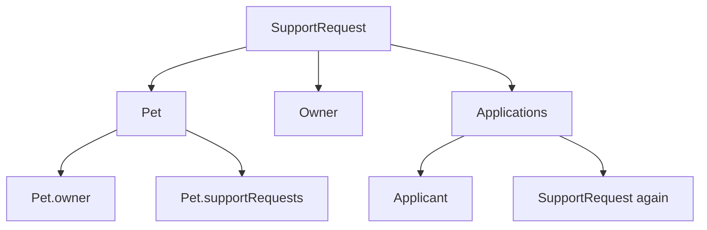
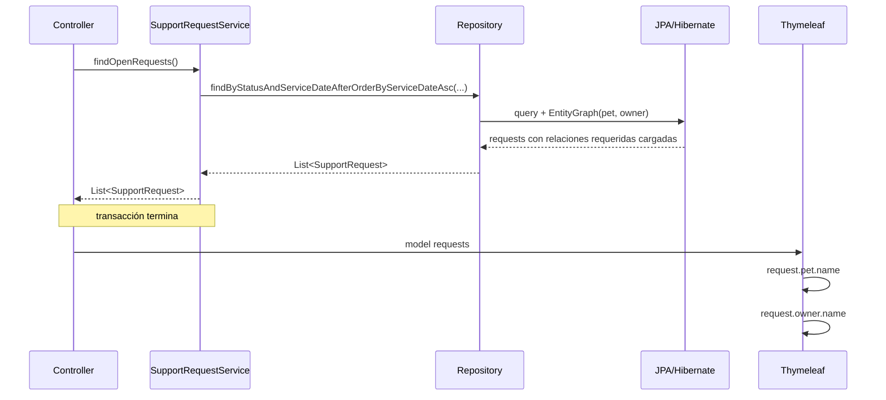
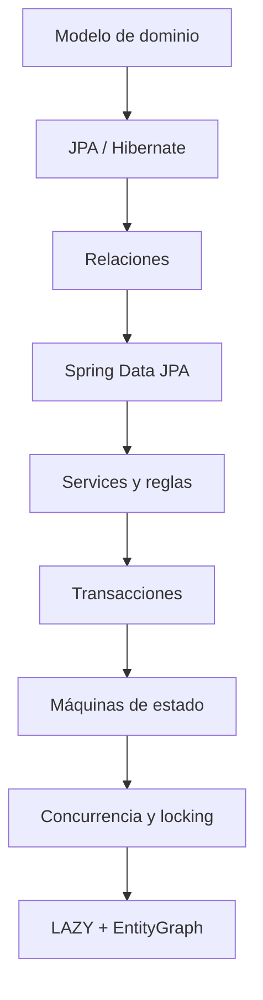

# 17 — Lazy loading y `@EntityGraph`

Este capítulo cierra el bloque de Dominio y persistencia.

Ya sabemos que las Entities de PetMatch están relacionadas. También sabemos que cargar indiscriminadamente todo el grafo de objetos puede resultar costoso.

Por eso aparece una decisión explícita en el modelo:

```java
@ManyToOne(fetch = FetchType.LAZY, ...)
```

Y otra decisión igualmente importante en configuración:

```yaml
spring:
  jpa:
    open-in-view: false
```

Entonces surge la pregunta central:

> **Si las relaciones son LAZY y la sesión de persistencia no permanece abierta durante la vista, ¿cómo consigue PetMatch que Controllers y templates reciban las relaciones que realmente necesitan?**

La respuesta está en combinar:

```text
LAZY por defecto/intención
+
transacciones en Services
+
queries diseñadas para el caso de uso
+
@EntityGraph para relaciones concretas
```

---

# 1. El problema de cargar grafos de objetos

Una `SupportRequest` tiene:

```text
pet
owner
applications
```

Una `Pet` tiene:

```text
owner
supportRequests
```

Una `SupportApplication` tiene:

```text
applicant
supportRequest
```

Y esa `supportRequest` a su vez tiene:

```text
pet
owner
applications
```

Si al cargar una sola request cargáramos automáticamente todo lo relacionado y después todo lo relacionado con lo relacionado, el grafo podría expandirse rápidamente.



Necesitamos controlar **qué relaciones se cargan para cada caso de uso**.

---

# 2. ¿Qué es fetching?

**Fetching** describe cómo/cuándo JPA obtiene datos relacionados de la base de datos.

Dos conceptos habituales son:

```text
LAZY
EAGER
```

No significan simplemente:

```text
LAZY = malo
EAGER = bueno
```

o al revés.

Representan estrategias diferentes con consecuencias distintas.

---

# 3. `FetchType.LAZY`

Una asociación lazy está configurada para no exigir que el objeto relacionado se cargue inmediatamente junto con la Entity principal.

Ejemplo real:

```java
@NotNull
@ManyToOne(fetch = FetchType.LAZY, optional = false)
@JoinColumn(name = "pet_id", nullable = false)
private Pet pet;
```

En `SupportRequest`.

La idea conceptual es:

```text
cargar SupportRequest
≠
obligatoriamente cargar Pet en ese mismo momento
```

JPA/Hibernate pueden representar temporalmente esa relación de una manera que permita resolverla cuando sea necesaria dentro de un contexto de persistencia adecuado.

---

# 4. Relaciones `ManyToOne` LAZY reales

PetMatch declara explícitamente `FetchType.LAZY` en:

```text
Pet.owner
SupportRequest.pet
SupportRequest.owner
SupportApplication.applicant
SupportApplication.supportRequest
```

Esto no es una recomendación abstracta: está escrito en las Entities reales.

---

# 5. ¿Y las colecciones `OneToMany`?

Las relaciones como:

```java
@OneToMany(mappedBy = "supportRequest")
private List<SupportApplication> applications = new ArrayList<>();
```

no escriben un `fetch` explícito.

Según JPA, `OneToMany` utiliza lazy fetching por defecto.

Por tanto:

```text
ManyToOne
→ LAZY explícito en PetMatch

OneToMany
→ LAZY por default JPA
```

---

# 6. ¿Qué problema intenta evitar LAZY?

Supongamos una página con 50 solicitudes abiertas.

La vista necesita tal vez:

```text
title
serviceDate
pet.name
owner.name
```

No necesita necesariamente:

```text
todas las applications
cada applicant
las otras requests de cada pet
las otras applications de cada user
```

Una estrategia de carga indiscriminada podría traer mucho más estado del necesario.

LAZY ayuda a evitar que toda relación se expanda automáticamente.

---

# 7. Pero LAZY introduce una responsabilidad

Si una relación no se cargó inmediatamente, alguien debe decidir cuándo obtenerla.

Con un persistence context abierto podríamos acceder conceptualmente:

```java
request.getPet().getName()
```

y Hibernate podría cargar `pet` al necesitarlo.

Pero ¿qué pasa si el contexto ya terminó?

Ahí aparece el problema de lazy loading fuera de sesión.

---

# 8. Persistence context y vida de una Entity

Mientras una Entity está `managed` dentro de un persistence context, Hibernate puede coordinar:

```text
cambios
lazy associations
identity
queries
```

Cuando la transacción termina y el objeto queda fuera de ese contexto, las relaciones que nunca fueron inicializadas ya no tienen necesariamente un contexto activo desde el cual obtenerse.

Eso puede producir errores como:

```text
LazyInitializationException
```

si intentamos navegar una asociación lazy no cargada después.

---

# 9. `open-in-view`

Spring Boot tiene una opción conocida como **Open EntityManager in View**.

De forma conceptual, mantenerlo activo permite que el contexto de persistencia permanezca disponible más allá de la capa de Service, durante la fase web/renderizado.

Eso puede hacer que una vista dispare cargas lazy.

PetMatch decide explícitamente no utilizar ese modelo.

---

# 10. Configuración real de PetMatch

`application.yaml` contiene:

```yaml
spring:
  jpa:
    open-in-view: false
```

Esto significa que la aplicación no quiere depender de mantener automáticamente el contexto JPA abierto durante el renderizado de la vista.

La consecuencia arquitectónica es importante:

> **los datos que necesita la capa web deben estar preparados antes de abandonar la capa transaccional apropiada.**

---

# 11. ¿Por qué `open-in-view=false` puede ser una decisión útil?

Ayuda a mantener una frontera más clara:

```text
Service / Repository
→ deciden qué datos cargar

Controller / View
→ consumen datos ya preparados
```

En lugar de:

```text
Template toca una relación
→ aparece una query inesperada
```

Esto mejora la visibilidad sobre el costo y momento del acceso a datos.

Pero exige diseñar bien las queries.

---

# 12. El problema concreto en la lista de solicitudes

`SupportRequestController.openRequests(...)` hace:

```java
model.addAttribute(
    "requests",
    supportRequestService.findOpenRequests()
);
return "support-requests/list";
```

El Service devuelve una lista y su transacción `readOnly` termina antes del render completo de Thymeleaf.

Ahora mira el template real:

```html
<p th:text="${request.pet.name}"></p>
...
<dd th:text="${request.owner.name}"></dd>
```

La vista necesita navegar:

```text
request.pet
request.owner
```

Pero ambas relaciones son `LAZY`.

¿Cómo se resuelve?

---

# 13. `@EntityGraph` en la consulta de solicitudes abiertas

El Repository declara:

```java
@EntityGraph(attributePaths = {"pet", "owner"})
List<SupportRequest>
findByStatusAndServiceDateAfterOrderByServiceDateAsc(
    SupportRequestStatus status,
    LocalDateTime serviceDate
);
```

Eso le dice a Spring Data/JPA que para esa consulta concreta el fetch plan debe incluir:

```text
pet
owner
```

Precisamente las relaciones que la lista necesita.

---

# 14. El flujo real completo



La vista no depende de abrir nuevas cargas lazy para esas relaciones.

---

# 15. `@EntityGraph` no cambia el mapping global

La Entity sigue declarando:

```java
@ManyToOne(fetch = FetchType.LAZY)
```

`@EntityGraph` no convierte permanentemente `pet` y `owner` en EAGER para todos los casos.

Define un fetch plan específico para la consulta donde se aplica.

Eso permite:

```text
modelo global prudente
+
carga específica por caso de uso
```

---

# 16. Por qué no cambiar todo a `EAGER`

Una solución rápida a problemas lazy sería:

```java
@ManyToOne(fetch = FetchType.EAGER)
```

para todas las asociaciones.

Pero eso significaría que **todas las consultas** tendrían que considerar esa relación como eager, incluso cuando no la necesitan.

El costo puede aparecer en:

- más datos cargados;
- grafos innecesarios;
- consultas difíciles de controlar;
- problemas de rendimiento.

PetMatch prefiere carga dirigida.

---

# 17. `findByOwnerIdOrderByCreatedAtDesc`

Para “Mis solicitudes”:

```java
@EntityGraph(attributePaths = {"pet", "owner"})
List<SupportRequest> findByOwnerIdOrderByCreatedAtDesc(Long ownerId);
```

Aunque ya conocemos el owner por el filtro, la Entity relacionada sigue siendo útil para la capa que presenta los datos.

Además `pet` es necesaria para mostrar información de la mascota.

---

# 18. `findByIdAndOwnerId`

Código:

```java
@EntityGraph(attributePaths = {"pet", "owner"})
Optional<SupportRequest> findByIdAndOwnerId(
    Long id,
    Long ownerId
);
```

Este método combina dos propósitos:

```text
ownership filter
+
fetch plan
```

Así el Service obtiene únicamente la request del owner y además tiene cargadas relaciones comunes que necesitará después.

---

# 19. El caso `toForm(...)`

`SupportRequestService.toForm(...)` no tiene `@Transactional`:

```java
public SupportRequestForm toForm(SupportRequest request) {
    SupportRequestForm form = new SupportRequestForm();
    ...
    form.setPetId(request.getPet().getId());
    return form;
}
```

El Controller primero obtiene:

```java
SupportRequest request = findOwnedRequest(...);
```

Ese método utiliza:

```text
findByIdAndOwnerId
+
@EntityGraph(pet, owner)
```

Por tanto `request.getPet()` ya fue preparado por la consulta antes de que `toForm` lo navegue fuera de aquella transacción.

Este es un ejemplo muy concreto de por qué el fetch plan importa.

---

# 20. Sobrescribir `findById`

`SupportRequestRepository` redeclara:

```java
@Override
@EntityGraph(attributePaths = {"pet", "owner"})
Optional<SupportRequest> findById(Long id);
```

`JpaRepository` ya tiene `findById`.

La redeclaración permite agregar metadata de carga.

Entonces cualquier uso de este `findById` dentro del Repository específico obtiene el fetch plan declarado.

---

# 21. `findVisibleRequest(...)`

`SupportRequestService.findVisibleRequest(...)` llama:

```java
SupportRequest request = findById(requestId);
```

Y luego usa:

```java
request.getOwner().getId()
```

Además devuelve la request al Controller para que la vista de detalle la consuma.

Gracias al `findById` redeclarado con `@EntityGraph`, `pet` y `owner` están incluidos en el plan de carga.

---

# 22. `SupportApplication` necesita un grafo más profundo

Una postulación no se muestra aislada.

Por ejemplo, el template “Mis postulaciones” hace:

```html
<strong
    th:text="${supportApplication.supportRequest.pet.name}">
</strong>

<a
    th:text="${supportApplication.supportRequest.title}">
</a>
```

La navegación es:

```text
SupportApplication
→ supportRequest
→ pet
```

Por eso el Repository necesita preparar más relaciones.

---

# 23. EntityGraph real para applications

`SupportApplicationRepository` declara:

```java
@EntityGraph(attributePaths = {
    "applicant",
    "supportRequest",
    "supportRequest.pet",
    "supportRequest.owner"
})
List<SupportApplication>
findByApplicantIdOrderByAppliedAtDesc(Long applicantId);
```

El grafo dice:

```text
application.applicant
application.supportRequest
application.supportRequest.pet
application.supportRequest.owner
```

No es una lista de columnas SQL.

Son **attribute paths del modelo JPA**.

---

# 24. Attribute paths anidados

Ejemplo:

```text
supportRequest.pet
```

significa navegar:

```java
supportApplication.getSupportRequest().getPet()
```

Mientras:

```text
supportRequest.owner
```

representa:

```java
supportApplication.getSupportRequest().getOwner()
```

Esto demuestra por qué es importante conocer los nombres exactos de las propiedades Java.

---

# 25. EntityGraph de postulaciones recibidas

También aparece en:

```java
@EntityGraph(attributePaths = {
    "applicant",
    "supportRequest",
    "supportRequest.pet",
    "supportRequest.owner"
})
List<SupportApplication>
findBySupportRequestIdOrderByAppliedAtAsc(Long supportRequestId);
```

La pantalla del owner necesita conocer quién se postuló y a qué request pertenece cada application.

El grafo prepara esos datos dentro de la consulta.

---

# 26. EntityGraph y ownership de application

Método real:

```java
@EntityGraph(attributePaths = {
    "applicant",
    "supportRequest",
    "supportRequest.pet",
    "supportRequest.owner"
})
Optional<SupportApplication>
findByIdAndSupportRequestOwnerId(Long id, Long ownerId);
```

Se usa en `accept(...)` y `reject(...)`.

Combina:

```text
filtrar application por owner de su request
+
cargar relaciones necesarias para operar
```

---

# 27. `@EntityGraph` no garantiza “una sola query” universalmente

Es tentador decir:

> “EntityGraph hace un JOIN y trae todo en una consulta”.

Eso es demasiado absoluto.

`@EntityGraph` declara un **fetch plan**.

La estrategia SQL concreta puede depender de:

- Hibernate;
- asociación;
- query;
- dialecto;
- versión/configuración.

Lo correcto es afirmar:

> PetMatch indica qué relaciones deben cargarse para esa consulta concreta.

No necesitamos prometer una forma SQL exacta.

---

# 28. N+1 selects

Uno de los problemas clásicos de ORM aparece cuando:

```text
1 query obtiene N entidades
+
por cada entidad se ejecuta otra query para una relación
```

Ejemplo conceptual:

```text
1 query → 20 SupportRequest
20 queries → Pet de cada request
20 queries → Owner de cada request
```

Eso podría producir:

```text
1 + N + N
```

consultas.

---

# 29. ¿Por qué se llama N+1?

Forma simplificada:

```text
1 query principal
+
N queries relacionadas
```

No siempre el problema real tiene exactamente esa forma numérica, pero el término describe el patrón de cargas repetidas por elemento.

Es especialmente fácil provocarlo al iterar una lista y tocar asociaciones lazy una por una.

---

# 30. La lista Thymeleaf como ejemplo mental

Template:

```html
<article th:each="request : ${requests}">
    <p th:text="${request.pet.name}"></p>
    ...
    <dd th:text="${request.owner.name}"></dd>
</article>
```

Sin un plan de carga adecuado, esa iteración podría intentar resolver relaciones para cada elemento.

Con `open-in-view=false`, además, no queremos que el template sea el lugar que dispare esas consultas.

Por eso el Repository declara:

```text
EntityGraph(pet, owner)
```

para el caso de lista.

---

# 31. `open-in-view=false` ayuda a detectar diseño deficiente temprano

Con Open Session in View habilitado, un template podría navegar relaciones y “funcionar” mientras genera queries invisibles para quien diseñó el Service.

Al desactivarlo, una asociación no preparada puede fallar en la capa web.

Aunque al principio resulte incómodo, obliga a preguntar:

```text
¿Qué necesita realmente este caso de uso?
¿Dónde debe cargarse?
```

Eso favorece límites más explícitos.

---

# 32. Service transaction como frontera

Muchos métodos de consulta de PetMatch usan:

```java
@Transactional(readOnly = true)
```

Por ejemplo:

```java
public List<SupportRequest> findOpenRequests()
```

Dentro de ese límite:

```text
Repository consulta
↓
JPA/Hibernate cargan Entities + graph
↓
Service devuelve resultado
↓
transacción termina
```

El Controller no debería depender de cargar asociaciones adicionales después.

---

# 33. ¿Por qué no mapear siempre a DTO dentro del Service?

Otra arquitectura podría decidir:

```text
Repository → Entity
Service → DTO completo
Controller/View → DTO
```

Eso evita exponer Entities fuera de la capa transaccional.

PetMatch no adopta esa estrategia de forma general para MVC: sus Controllers reciben Entities desde Services.

Por eso `@EntityGraph` es especialmente relevante en su diseño actual.

> [!NOTE]
> No presentamos DTO de vista como “corrección obligatoria”; es una alternativa arquitectónica que el proyecto actual no aplica en todos estos flujos.

---

# 34. MVC y REST no tienen exactamente la misma necesidad

La API REST usa DTO específicos y un mapper:

```text
Entity
→ ApiDtoMapper
→ ApiResponse
```

La web MVC utiliza muchas Entities directamente como model attributes para Thymeleaf.

Esto hace que el problema de asociaciones lazy sea especialmente visible en MVC.

Aun así, los mismos Services son compartidos.

---

# 35. EntityGraph vs DTO projection

Como alternativas generales para optimizar lecturas pueden existir:

```text
@EntityGraph
fetch joins JPQL
DTO projections
interface projections
queries específicas
```

PetMatch utiliza `@EntityGraph` en sus repositories actuales.

No debemos afirmar que utiliza proyecciones DTO de Spring Data porque no aparecen en estos repositories.

---

# 36. EntityGraph vs `JOIN FETCH`

Una query JPQL podría escribir conceptualmente:

```text
join fetch
```

para indicar carga de relaciones.

PetMatch, en las consultas estudiadas, utiliza `@EntityGraph` en lugar de llenar cada método con JPQL fetch joins.

Ventaja conceptual:

```text
consulta derivada conserva su intención
+
metadata define fetch plan
```

---

# 37. ¿Por qué no poner EntityGraph en todos los métodos?

Porque cada caso de uso necesita datos diferentes.

Por ejemplo:

```java
boolean existsByApplicantIdAndSupportRequestId(...)
```

solo necesita responder:

```text
true / false
```

No tendría sentido cargar:

```text
applicant
request
pet
owner
```

para una mera comprobación de existencia.

La optimización comienza por **no cargar lo que no se necesita**.

---

# 38. Queries de estado sin graph

`SupportApplicationRepository` tiene:

```java
List<SupportApplication>
findBySupportRequestIdAndStatus(
    Long supportRequestId,
    SupportApplicationStatus status
);
```

Se usa para modificar estados de las applications.

El Service no necesita navegar todo el grafo para ejecutar:

```java
application.setStatus(REJECTED)
```

Por eso este método no declara el gran `EntityGraph` de las pantallas.

---

# 39. Fetch plan según intención

Comparación:

```text
Mostrar applications al usuario
→ necesito request, pet, owner/applicant
→ EntityGraph amplio

Cambiar status de PENDING a REJECTED
→ necesito las applications
→ no necesariamente todo el grafo
```

Este es el principio central del capítulo.

---

# 40. Lazy no significa nunca cargar

Una asociación lazy puede cargarse cuando:

- se accede dentro de un persistence context activo;
- una query usa un fetch plan como EntityGraph;
- otra estrategia de consulta la carga explícitamente.

Por tanto:

```text
LAZY
≠
prohibido cargar
```

Significa que la carga no debe asumirse globalmente desde el mapping.

---

# 41. EAGER no significa una query perfecta

Otro error:

```text
EAGER = siempre un JOIN eficiente
```

No.

EAGER expresa una obligación de disponibilidad, no garantiza una estrategia SQL óptima.

Por eso cambiar asociaciones a EAGER para “arreglar” un problema puede ocultar la verdadera necesidad de diseñar la consulta.

---

# 42. LazyInitializationException no se arregla abriendo sesiones indefinidamente

Ante el error, un principiante puede intentar:

```text
activar open-in-view
```

o:

```text
convertir todo a EAGER
```

sin analizar el caso de uso.

Una mejor secuencia es:

```text
1. ¿qué relación necesita realmente la operación?
2. ¿en qué método se carga la Entity?
3. ¿sigue activo el persistence context cuando se accede?
4. ¿debería cargarla explícitamente en Repository?
5. ¿conviene EntityGraph, fetch join o DTO?
```

---

# 43. Debugging de lazy loading

Si una vista falla al acceder a:

```text
request.pet.name
```

revisa:

1. `SupportRequest.pet` — ¿es LAZY?
2. `application.yaml` — ¿open-in-view está false?
3. qué Service entrega la request;
4. qué Repository method la obtiene;
5. si ese método tiene `@EntityGraph(attributePaths={"pet"})`;
6. si existe otra ruta de código que usa un método diferente sin graph.

Este procedimiento es más útil que cambiar anotaciones al azar.

---

# 44. Cómo inspeccionar un N+1

En un entorno de desarrollo podrías observar SQL/logging/profiling para comparar:

```text
número de registros principales
vs
número de queries ejecutadas
```

PetMatch no configura actualmente propiedades de logging SQL en `application.yaml` que debamos enseñar como parte del proyecto.

Por tanto cualquier activación de logging sería una técnica de diagnóstico adicional, no configuración actual.

---

# 45. Rendimiento y límites de la medición

El uso de EntityGraph indica una intención de carga.

Pero sin mediciones no debemos afirmar:

```text
“esto hace PetMatch 10 veces más rápido”
```

o:

```text
“elimina exactamente 50 queries”
```

Al analizar el diseño conviene distinguir:

```text
diseño actual
```

de:

```text
benchmark medido
```

El proyecto no incluye un benchmark de rendimiento.

---

# 46. Mapa de EntityGraphs de `SupportRequestRepository`

| Método | Graph |
|---|---|
| `findByOwnerIdOrderByCreatedAtDesc` | `pet`, `owner` |
| `findByStatusAndServiceDateAfterOrderByServiceDateAsc` | `pet`, `owner` |
| `findByIdAndOwnerId` | `pet`, `owner` |
| `findById` | `pet`, `owner` |
| `findByIdForUpdate` | sin EntityGraph declarado |
| filtros simples restantes | sin EntityGraph declarado |

Esto muestra que no todos los métodos se tratan igual.

---

# 47. Mapa de EntityGraphs de `SupportApplicationRepository`

El mismo graph aparece en:

```text
findBySupportRequestIdOrderByAppliedAtAsc
findByApplicantIdOrderByAppliedAtDesc
findByIdAndSupportRequestOwnerId
```

Con:

```text
applicant
supportRequest
supportRequest.pet
supportRequest.owner
```

Mientras métodos como:

```text
existsByApplicantIdAndSupportRequestId
countBySupportRequestIdAndStatus
findBySupportRequestIdAndStatus
```

no declaran ese graph.

---

# 48. ¿Por qué `findByIdForUpdate` no lleva EntityGraph?

El método crítico es:

```java
@Lock(LockModeType.PESSIMISTIC_WRITE)
@Query("select sr from SupportRequest sr where sr.id = :id")
Optional<SupportRequest> findByIdForUpdate(@Param("id") Long id);
```

Su objetivo principal es:

```text
obtener/bloquear la request concreta
```

En `accept(...)`, la `SupportApplication` ya fue obtenida mediante:

```text
findByIdAndSupportRequestOwnerId
```

que sí tiene un graph profundo.

El proyecto separa así la intención de carga para presentación/navegación y la intención de locking de la query crítica.

---

# 49. Cuidado con asumir estado del persistence context

En una misma transacción puede haber Entities ya cargadas cuando ejecutas otra query que referencia la misma identidad.

JPA mantiene identidad dentro del persistence context.

Por eso no conviene construir explicaciones simplistas como:

```text
“cada Repository call siempre crea un objeto Java nuevo”
```

No es así.

El persistence context coordina la identidad de Entities managed.

---

# 50. EntityGraph y seguridad

Un graph no autoriza nada.

Por ejemplo:

```java
findByIdAndSupportRequestOwnerId(id, ownerId)
```

protege ownership mediante su condición de consulta.

El `@EntityGraph` solamente define qué relaciones cargar.

No confundamos:

```text
WHERE / método derivado
→ qué recursos puedes obtener

EntityGraph
→ qué asociaciones traer con ellos
```

---

# 51. EntityGraph y transacciones

El graph se aplica durante la consulta.

La transacción del Service proporciona el contexto en el que esas Entities se obtienen y gestionan.

Después, al terminar la transacción, las relaciones ya cargadas pueden seguir siendo leídas como datos disponibles en los objetos devueltos.

Las relaciones no inicializadas siguen siendo el riesgo si se intentan navegar fuera de contexto.

---

# 52. ¿Por qué la vista no debería decidir fetch?

Thymeleaf conoce presentación:

```text
mostrar pet.name
mostrar owner.name
```

No debería decidir:

```text
cómo consultar MySQL
qué join ejecutar
qué lock usar
```

La capa de persistencia debe preparar los datos.

Eso mantiene la arquitectura:

```text
View
← datos preparados
← Controller
← Service
← Repository
```

---

# 53. Una estrategia mental para diseñar una nueva pantalla

Supón una pantalla nueva que necesita:

```text
SupportRequest
Pet
Owner
Accepted Applicant
```

Antes de programarla pregunta:

1. ¿qué Entity principal consulta?
2. ¿qué relaciones exactas necesita?
3. ¿son lazy?
4. ¿se consumirán fuera de la transacción?
5. ¿hay un Repository method adecuado?
6. ¿EntityGraph sirve o necesito otra query/projection?
7. ¿estoy cargando colecciones enormes innecesariamente?

No empieces cambiando Entities a EAGER.

---

# 54. ⚠️ Errores frecuentes

## Error 1 — “LAZY significa que la relación nunca se carga”

No.

## Error 2 — “EAGER siempre es más sencillo y eficiente”

No.

## Error 3 — Activar `open-in-view` para ocultar cualquier problema

Puede volver a permitir queries durante el renderizado y ocultar un fetch plan mal diseñado.

## Error 4 — Acceder a una asociación lazy no inicializada después de la transacción

Puede producir `LazyInitializationException`.

## Error 5 — Decir que `@EntityGraph` cambia el mapping global

No; aplica un fetch plan a consultas concretas.

## Error 6 — Prometer que EntityGraph siempre produce un único JOIN SQL

La estrategia SQL concreta depende del proveedor/contexto.

## Error 7 — Poner el graph más grande posible en todo

Cargar información innecesaria también tiene costo.

## Error 8 — Agregar EntityGraph a `existsBy...`

No tiene sentido cargar un grafo completo para responder true/false.

## Error 9 — Confundir fetch con autorización

EntityGraph no decide qué usuario puede ver el recurso.

## Error 10 — Afirmar mejoras de performance sin medir

El proyecto no contiene benchmarks que soporten cifras.

---

# 55. 🛠 Prueba en el código

## Actividad 1 — Encuentra todas las asociaciones LAZY

Busca:

```java
FetchType.LAZY
```

en `model/`.

Construye una tabla:

```text
Entity | atributo | Entity destino
```

## Actividad 2 — Sigue la lista de solicitudes

Abre:

```text
SupportRequestController.java
SupportRequestService.java
SupportRequestRepository.java
templates/support-requests/list.html
```

Traza:

```text
GET
→ Service
→ Repository
→ EntityGraph
→ Model
→ Thymeleaf
```

Identifica exactamente dónde se usan `pet` y `owner`.

## Actividad 3 — Sigue “Mis postulaciones”

Abre:

```text
SupportApplicationRepository.java
templates/support-applications/mine.html
```

Relaciona:

```text
supportRequest.pet
```

del graph con:

```text
supportApplication.supportRequest.pet.name
```

del template.

## Actividad 4 — Clasifica repositories

Para cada método con `@EntityGraph`, responde:

```text
¿qué caso de uso lo consume?
¿qué relación necesita ese caso?
```

## Actividad 5 — Busca `open-in-view`

Confirma en `application.yaml`:

```yaml
open-in-view: false
```

y explica cómo cambia tu estrategia de diseño.

---

# 56. 🧪 Comprueba que entendiste

1. ¿Qué significa lazy loading?
2. ¿Qué relaciones ManyToOne son LAZY explícitamente en PetMatch?
3. ¿Qué fetch utiliza `OneToMany` por defecto en JPA?
4. ¿Qué valor tiene `spring.jpa.open-in-view`?
5. ¿Qué riesgo existe al acceder a una asociación lazy no inicializada fuera del persistence context?
6. ¿Qué hace `@EntityGraph`?
7. ¿Cambia globalmente una asociación a EAGER?
8. ¿Qué graph usa `SupportRequestRepository` para sus consultas principales?
9. ¿Qué relaciones necesita el template de solicitudes abiertas?
10. ¿Qué graph usa `SupportApplicationRepository` para pantallas principales?
11. ¿Qué significa `supportRequest.pet` como attribute path?
12. ¿Qué es el problema N+1?
13. ¿EntityGraph garantiza exactamente una sola query SQL?
14. ¿Por qué no se aplica el graph grande a `existsBy...`?
15. ¿EntityGraph implementa ownership?
16. ¿Por qué `toForm` puede acceder a `request.getPet()` después de `findOwnedRequest`?
17. ¿Qué estrategia general usa PetMatch para combinar LAZY y open-in-view=false?

### Respuestas esperadas

1. Cargar una asociación de forma diferida cuando se necesita en un contexto adecuado.
2. `Pet.owner`, `SupportRequest.pet`, `SupportRequest.owner`, `SupportApplication.applicant`, `SupportApplication.supportRequest`.
3. LAZY.
4. `false`.
5. `LazyInitializationException` u otro problema de inicialización lazy.
6. Declara relaciones que deben formar parte del fetch plan de una consulta concreta.
7. No.
8. `pet` y `owner`.
9. Entre otras, `request.pet.name` y `request.owner.name`.
10. `applicant`, `supportRequest`, `supportRequest.pet`, `supportRequest.owner`.
11. Navegar desde application a request y después a pet.
12. Una query principal seguida por consultas repetidas para relaciones de N elementos.
13. No; define fetch plan, no una forma SQL universal.
14. Porque solo devuelve un booleano y no necesita Entities relacionadas.
15. No; ownership viene de condiciones/query/reglas.
16. Porque `findByIdAndOwnerId` aplica un EntityGraph que incluye `pet`.
17. Asociaciones lazy + Service transactions + queries con EntityGraph específico según el caso de uso.

---

# 57. ✅ Qué debes recordar

- **LAZY permite controlar cuándo se cargan relaciones.**
- PetMatch declara LAZY explícito en sus ManyToOne principales.
- Los OneToMany usan el default LAZY de JPA.
- `open-in-view` está desactivado.
- Por eso la vista no debe depender de ejecutar cargas lazy después del Service.
- `@EntityGraph` permite definir un fetch plan por consulta.
- Los graphs de SupportRequest cargan `pet` y `owner`.
- Los graphs de SupportApplication cargan `applicant`, `supportRequest`, `supportRequest.pet` y `supportRequest.owner`.
- Los attribute paths utilizan propiedades Java del modelo.
- EntityGraph no cambia globalmente LAZY a EAGER.
- EntityGraph tampoco autoriza recursos ni reemplaza filtros de ownership.
- N+1 aparece cuando navegar relaciones provoca consultas repetidas por cada elemento.
- No debemos afirmar un SQL exacto o mejora cuantitativa sin medir.
- No todas las queries necesitan un graph; `exists` y `count` deben permanecer ligeras cuando corresponda.
- Con `open-in-view=false`, el diseño de Repository/Service determina qué datos estarán disponibles para MVC.

---

# Cierre del bloque 02 — Dominio y persistencia

Con este capítulo podemos conectar todo el bloque:



Ahora deberías poder seguir una operación y responder:

```text
¿Qué Entity representa el dato?
¿Cómo se relaciona con las demás?
¿Qué Repository la consulta?
¿Qué regla aplica el Service?
¿Dónde está la transacción?
¿Qué estado permite la operación?
¿Puede haber una carrera concurrente?
¿Qué asociaciones necesita cargar antes de salir de la transacción?
```

Ese conjunto de preguntas es una base sólida para entrar a la capa web.

---

# 🔗 Siguiente bloque

Continúa con:

**[Bloque 03 — Web MVC →](../03-web-mvc/README.md)**

Comienza con:

**[Capítulo 18 — Spring MVC →](../03-web-mvc/18-spring-mvc.md)**

---

[← Capítulo 16 — Concurrencia y locking](16-concurrencia-y-locking.md) · [Índice del bloque](README.md) · [Índice general](../README.md) · [Siguiente bloque → Web MVC](../03-web-mvc/README.md)
