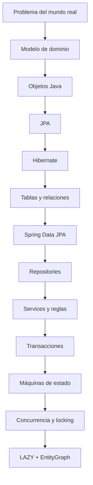
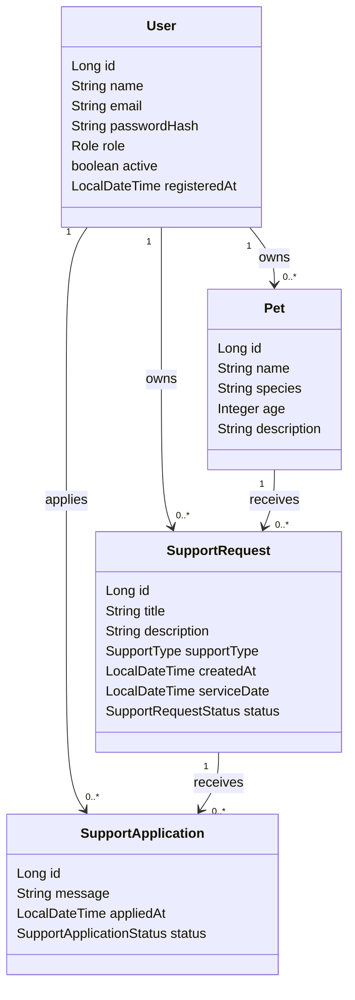

# Bloque 02 — Dominio y persistencia

En el bloque anterior aprendimos a orientarnos dentro de PetMatch Community: qué problema resuelve Spring, cómo arranca Spring Boot, cómo Maven declara dependencias, cómo se configura la aplicación y cómo colaboran Controller, Service y Repository mediante inyección de dependencias.

Este bloque responde una pregunta más profunda:

> **¿Cómo pasan los objetos Java del dominio a persistirse en una base de datos relacional y cómo mantenemos consistentes sus reglas incluso cuando existen estados, relaciones y concurrencia?**

La secuencia no empieza memorizando `JpaRepository`. Primero entiende **qué información representa el sistema**, después cómo se mapea, cómo se relaciona, cómo se consulta, dónde se aplican las reglas y qué mecanismos mantienen consistencia.

---

## Estado del bloque

**Bloque 02 completo.**

Los capítulos 09–17 están disponibles y enlazados en orden.

---

## Qué aprenderás en este bloque

Al terminar Dominio y persistencia deberías poder explicar, usando código real de PetMatch:

- qué es un modelo de dominio;
- cuáles son las cuatro entidades principales;
- qué son JPA, Hibernate y ORM y cómo se relacionan;
- qué significan `@Entity`, `@Table`, `@Id`, `@GeneratedValue` y `@Column`;
- cómo se representan many-to-one y one-to-many;
- qué significa el lado propietario de una relación JPA y qué hace `mappedBy`;
- qué papel cumple `@JoinColumn`;
- qué significa `FetchType.LAZY`;
- qué es cascade y qué **no** está configurado como cascade en PetMatch;
- cómo Spring Data JPA implementa interfaces Repository;
- cómo funcionan `JpaRepository`, métodos heredados y query derivation;
- para qué sirven `Optional`, `existsBy...` y `countBy...`;
- qué diferencia hay entre una query derivada y `@Query` con JPQL;
- dónde viven las reglas de negocio;
- cómo los Services protegen ownership y estados;
- qué problema resuelve `@Transactional`;
- cómo funciona dirty checking sobre Entities managed;
- qué significan commit, rollback y flush;
- cómo se modelan las transiciones `OPEN`, `IN_PROGRESS`, `COMPLETED` y `CANCELLED`;
- cómo se coordinan `PENDING`, `ACCEPTED` y `REJECTED`;
- qué es una race condition;
- por qué `@Transactional` no resuelve por sí solo toda concurrencia;
- cómo funciona el `PESSIMISTIC_WRITE` usado durante `accept(...)`;
- por qué el lock recae sobre la `SupportRequest`;
- qué diferencia hay entre pessimistic y optimistic locking;
- por qué PetMatch no debe describirse como si utilizara `@Version`;
- cómo `open-in-view: false` cambia la estrategia de carga;
- cómo `@EntityGraph` prepara relaciones concretas para Controllers y Thymeleaf;
- qué es el problema N+1 y por qué no se soluciona convirtiendo todo a EAGER.

---

## Prerrequisitos

Antes de comenzar este bloque deberías comprender:

- [arquitectura por capas](../01-fundamentos/07-arquitectura-por-capas.md);
- [inyección de dependencias](../01-fundamentos/08-inyeccion-de-dependencias.md);
- [configuración con `application.yaml`](../01-fundamentos/06-configuracion-y-application-yaml.md);
- [Maven y dependencias](../01-fundamentos/05-maven-y-dependencias.md).

También es útil tener nociones básicas de SQL:

```text
tabla
fila
columna
primary key
foreign key
UNIQUE
NOT NULL
SELECT / INSERT / UPDATE / DELETE
```

No necesitas conocer JPA ni Hibernate previamente.

---

## Capítulos

1. [09 — Modelo de dominio](09-modelo-de-dominio.md)
2. [10 — JPA y Hibernate](10-jpa-y-hibernate.md)
3. [11 — Relaciones JPA](11-relaciones-jpa.md)
4. [12 — Spring Data JPA](12-spring-data-jpa.md)
5. [13 — Service y reglas de negocio](13-service-y-reglas-de-negocio.md)
6. [14 — Transacciones y consistencia](14-transacciones-y-consistencia.md)
7. [15 — Máquinas de estado](15-maquinas-de-estado.md)
8. [16 — Concurrencia y locking](16-concurrencia-y-locking.md)
9. [17 — Lazy loading y `EntityGraph`](17-lazy-loading-y-entitygraph.md)

---

## El recorrido mental del bloque



La secuencia es deliberada: cada mecanismo técnico aparece después del problema que lo hace necesario.

---

# El dominio real de PetMatch

El núcleo persistente está formado por cuatro Entities:

```text
User
Pet
SupportRequest
SupportApplication
```

Y cuatro enums:

```text
Role
SupportType
SupportRequestStatus
SupportApplicationStatus
```

Rutas:

```text
src/main/java/com/petmatch/community/model/
src/main/java/com/petmatch/community/model/enums/
```

---

## Mapa de entidades



> [!IMPORTANT]
> **Cardinalidad y cascade son conceptos diferentes.** Las Entities actuales no declaran `cascade` explícito en estas asociaciones.

---

# Del modelo al caso de uso

```mermaid
flowchart TD
    A[Controller MVC / REST] --> B[Service]
    B --> C[Reglas de negocio]
    B --> D[@Transactional]
    B --> E[Repository]
    E --> F[Spring Data JPA]
    F --> G[JPA / Hibernate]
    G --> H[MySQL]
```

Aceptar una postulación, por ejemplo, no es simplemente un `UPDATE`:

```text
validar owner
→ recuperar application
→ bloquear request compartida
→ validar request OPEN
→ validar application PENDING
→ comprobar que no exista otra ACCEPTED
→ selected ACCEPTED
→ request IN_PROGRESS
→ otras PENDING REJECTED
```

Ese caso conecta prácticamente todos los conceptos del bloque.

---

# Repositories reales

```text
repository/UserRepository.java
repository/PetRepository.java
repository/SupportRequestRepository.java
repository/SupportApplicationRepository.java
```

Todos extienden `JpaRepository` y combinan, según el caso:

```text
métodos heredados
queries derivadas
exists/count
@EntityGraph
@Query
@Lock
```

Consulta el [capítulo 12](12-spring-data-jpa.md).

---

# Services reales

```text
service/UserService.java
service/PetService.java
service/SupportRequestService.java
service/SupportApplicationService.java
```

El [capítulo 13](13-service-y-reglas-de-negocio.md) muestra reglas como:

- email no duplicado;
- ownership de mascotas/solicitudes;
- no borrar mascotas con solicitudes;
- no postularse a una solicitud propia;
- no duplicar postulaciones;
- editar/cancelar solo `OPEN`;
- completar solo `IN_PROGRESS`;
- aceptar una sola postulación y rechazar las demás pendientes.

---

# Transacciones, estados y concurrencia

El [capítulo 14](14-transacciones-y-consistencia.md) conecta `@Transactional` con:

```text
persistence context
dirty checking
commit
rollback
flush
constraints
```

El [capítulo 15](15-maquinas-de-estado.md) formaliza:

```text
SupportRequest:
OPEN → IN_PROGRESS → COMPLETED
OPEN → CANCELLED

SupportApplication:
PENDING → ACCEPTED
PENDING → REJECTED
```

El [capítulo 16](16-concurrencia-y-locking.md) explica por qué aceptar una postulación necesita además:

```text
@Lock(PESSIMISTIC_WRITE)
```

sobre la `SupportRequest` compartida.

> [!IMPORTANT]
> PetMatch no utiliza `@Version`; el modelo actual no implementa optimistic locking.

---

# LAZY, open-in-view y EntityGraph

Configuración real:

```yaml
spring:
  jpa:
    open-in-view: false
```

Las asociaciones `ManyToOne` principales están configuradas como `LAZY`, y los `OneToMany` usan el default lazy de JPA.

El [capítulo 17](17-lazy-loading-y-entitygraph.md) muestra cómo los repositories preparan relaciones específicas mediante `@EntityGraph`.

Ejemplos:

```text
SupportRequest
→ pet
→ owner
```

Y para applications:

```text
applicant
supportRequest
supportRequest.pet
supportRequest.owner
```

Esto permite que las vistas consuman datos ya preparados sin depender de una sesión JPA abierta durante Thymeleaf.

---

# Tres niveles que no debemos confundir

## 1. Dominio

```text
usuario
mascota
solicitud
postulación
```

## 2. Modelo Java/JPA

```text
User
Pet
SupportRequest
SupportApplication
```

## 3. Modelo relacional

```text
users
pets
support_requests
support_applications
```

ORM conecta estos niveles; no los vuelve idénticos.

---

# Qué NO debemos atribuir a PetMatch

Este bloque no afirma que el proyecto utilice:

- MongoDB;
- Redis;
- Flyway;
- Liquibase;
- Testcontainers;
- Hibernate Envers;
- segunda caché de Hibernate;
- soft delete automático;
- `CascadeType.ALL`;
- orphan removal;
- optimistic locking con `@Version`;
- Spring Statemachine;
- repositories JDBC escritos manualmente;
- múltiples datasources;
- perfiles específicos de DB para test;
- benchmarks de rendimiento;
- tests concurrentes reales del lock.

---

# Cómo estudiar este bloque

Para cada capítulo:

1. abre los archivos indicados;
2. localiza el fragmento real;
3. traduce entre objeto Java y SQL mental;
4. identifica qué parte es persistencia y qué parte es regla;
5. sigue el caso de uso desde Service hacia Repository;
6. identifica el límite transaccional;
7. reconstruye estados y guardas;
8. pregunta si existe una carrera concurrente;
9. revisa qué asociaciones debe cargar la operación;
10. ejecuta las actividades y preguntas de comprobación.

---

# Resultado esperado al finalizar el bloque

Deberías poder abrir `SupportApplicationService.accept(...)` y explicar:

```text
por qué está en Service
qué ownership valida
qué estados exige
qué repositories necesita
por qué es @Transactional
por qué bloquea SupportRequest
qué protege el count de ACCEPTED
qué cambios dependen de dirty checking
por qué otras PENDING pasan a REJECTED
qué relaciones llegan cargadas mediante EntityGraph
qué ocurriría si dos transacciones compitieran
```

Y deberías poder abrir una pantalla Thymeleaf que navega `request.pet.name` y rastrear qué Repository preparó esa relación antes de terminar la transacción.

---

# Comienza aquí

**[Capítulo 09 — Modelo de dominio →](09-modelo-de-dominio.md)**

Si deseas revisar el cierre del bloque:

**[Capítulo 17 — Lazy loading y `EntityGraph` →](17-lazy-loading-y-entitygraph.md)**

---

[← Bloque 01 — Fundamentos](../01-fundamentos/README.md) · [Índice general](../README.md) · [Siguiente → Capítulo 09](09-modelo-de-dominio.md)
