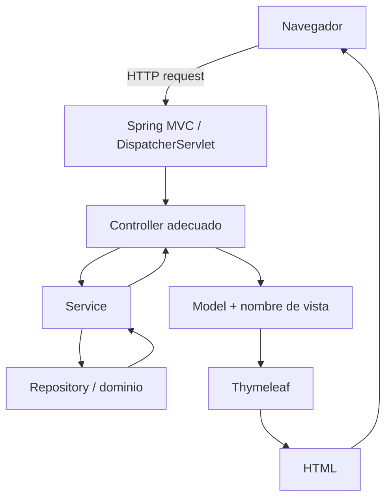
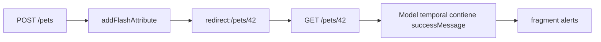
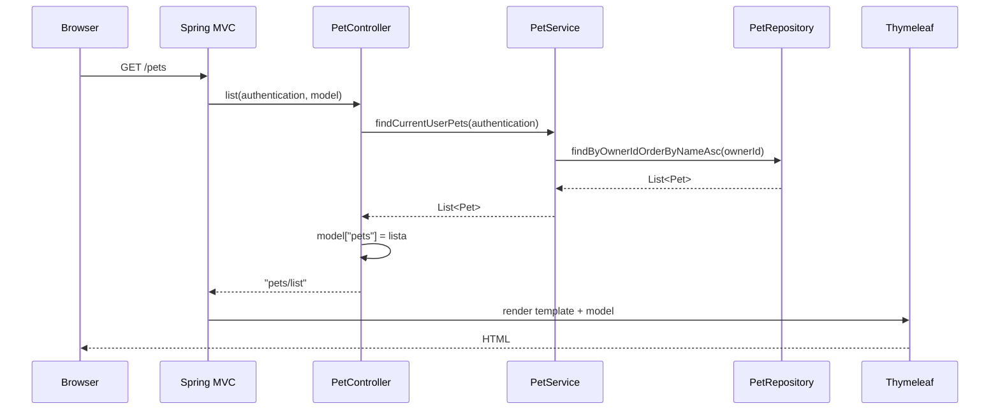
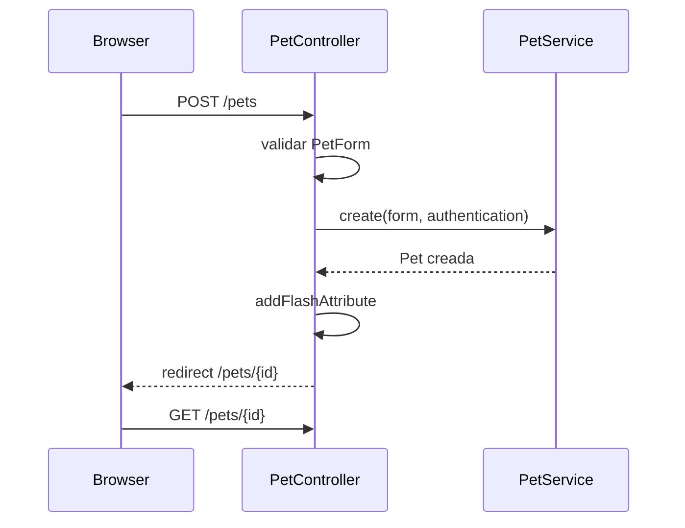

# 18 — Spring MVC

Hasta ahora PetMatch ya sabe representar dominio, persistir datos y ejecutar reglas. Pero un usuario no llama directamente a `PetService` desde el navegador.

Hace peticiones HTTP como:

```text
GET /pets
GET /support-requests/10
POST /pets
POST /support-requests/10/cancel
```

La pregunta de este capítulo es:

> **¿Cómo convierte Spring una petición HTTP en una llamada a un método Java y luego en una respuesta web?**

La respuesta en PetMatch es **Spring MVC**.

---

# 1. ¿Qué significa MVC?

MVC significa:

```text
Model
View
Controller
```

En PetMatch podemos usar este modelo mental:

```text
Controller
→ recibe la petición HTTP
→ llama Services
→ prepara datos

Model
→ transporta datos hacia la vista

View
→ template Thymeleaf que genera HTML
```

> [!IMPORTANT]
> MVC no significa que la lógica de negocio deba vivir en el Controller. En PetMatch los Controllers delegan en Services.

---

# 2. Flujo general de una petición MVC



El `DispatcherServlet` es el front controller de Spring MVC: conceptualmente recibe las peticiones web y coordina qué handler debe procesarlas.

PetMatch no lo instancia manualmente en sus clases. Spring Boot configura la infraestructura MVC a partir de las dependencias del proyecto.

---

# 3. Dependencia real de MVC

En `pom.xml` aparece:

```xml
<dependency>
    <groupId>org.springframework.boot</groupId>
    <artifactId>spring-boot-starter-webmvc</artifactId>
</dependency>
```

Eso aporta la infraestructura Spring MVC usada por los Controllers web.

PetMatch también incluye:

```text
spring-boot-starter-thymeleaf
```

para resolver las vistas HTML.

---

# 4. El Controller más pequeño: `HomeController`

Ruta:

```text
src/main/java/com/petmatch/community/controller/HomeController.java
```

Código real:

```java
@Controller
public class HomeController {

    @GetMapping("/")
    public String home() {
        return "home";
    }
}
```

Este ejemplo permite entender el flujo mínimo.

---

# 5. `@Controller`

```java
@Controller
public class HomeController
```

`@Controller` marca una clase como componente de la capa web MVC.

Spring puede detectarla mediante component scanning y registrar sus métodos de manejo de peticiones.

No significa:

```text
esta clase contiene toda la lógica de aplicación
```

Significa:

```text
esta clase participa en la interfaz web MVC
```

---

# 6. `@GetMapping("/")`

```java
@GetMapping("/")
public String home()
```

Relaciona:

```text
HTTP GET /
```

con:

```text
HomeController.home()
```

Cuando llega una petición GET a `/`, Spring MVC puede seleccionar ese método.

---

# 7. ¿Qué significa `return "home"`?

No significa que el navegador reciba literalmente:

```text
home
```

como cuerpo de respuesta.

En un `@Controller`, ese `String` se interpreta como **nombre lógico de vista**.

Conceptualmente:

```text
return "home"
↓
View Resolver / Thymeleaf
↓
src/main/resources/templates/home.html
↓
HTML renderizado
```

Esto será profundizado en el capítulo 19.

---

# 8. Un Controller real más completo: `PetController`

Ruta:

```text
src/main/java/com/petmatch/community/controller/PetController.java
```

Comienza así:

```java
@Controller
@RequestMapping("/pets")
public class PetController {
```

`@RequestMapping("/pets")` define una ruta base para la clase.

Entonces:

```java
@GetMapping
```

sobre un método significa:

```text
GET /pets
```

Mientras:

```java
@GetMapping("/{petId}")
```

significa:

```text
GET /pets/{petId}
```

---

# 9. Ruta de clase + ruta de método

Piensa en una suma:

```text
@RequestMapping("/pets")
+
@GetMapping("/{petId}")
=
GET /pets/{petId}
```

Y:

```text
@RequestMapping("/pets")
+
@PostMapping("/{petId}/delete")
=
POST /pets/{petId}/delete
```

Este patrón aparece en varios Controllers de PetMatch.

---

# 10. `GET /pets`: un recorrido completo

Código real:

```java
@GetMapping
public String list(Authentication authentication, Model model) {
    model.addAttribute(
        "pets",
        petService.findCurrentUserPets(authentication)
    );
    return "pets/list";
}
```

Podemos seguirlo paso a paso.

```text
GET /pets
↓
PetController.list(...)
↓
PetService.findCurrentUserPets(authentication)
↓
resultado List<Pet>
↓
model.addAttribute("pets", ...)
↓
return "pets/list"
↓
templates/pets/list.html
```

---

# 11. ¿Qué es `Model`?

`Model` es un contenedor de atributos que el Controller entrega a la vista.

Aquí:

```java
model.addAttribute("pets", ...);
```

crea conceptualmente:

```text
clave: "pets"
valor: List<Pet>
```

Después Thymeleaf puede acceder a:

```text
${pets}
```

El nombre debe coincidir.

---

# 12. Model no es Entity ni base de datos

No confundas:

```text
Model de Spring MVC
```

con:

```text
modelo de dominio
```

El `Model` MVC es una estructura temporal para transportar datos hacia una vista.

Una Entity como `Pet` representa dominio persistente.

Podemos tener:

```text
Model["pets"] = List<Pet>
```

pero el Model y la Entity no son el mismo concepto.

---

# 13. `Authentication` como argumento

`PetController.list(...)` recibe:

```java
Authentication authentication
```

Spring Security puede suministrar la autenticación actual al método del Controller.

PetMatch no usa ese objeto para decidir directamente toda la autorización allí.

Lo pasa al Service:

```java
petService.findCurrentUserPets(authentication)
```

El Service obtiene el usuario y aplica ownership.

---

# 14. `@PathVariable`

Método real:

```java
@GetMapping("/{petId}")
public String detail(
    @PathVariable Long petId,
    Authentication authentication,
    Model model
) {
    model.addAttribute("pet", findOwnedPet(petId, authentication));
    return "pets/detail";
}
```

Si la URL es:

```text
GET /pets/42
```

Spring toma:

```text
42
```

y lo enlaza al parámetro:

```java
Long petId
```

---

# 15. Parámetros de ruta vs query parameters

`@PathVariable` se usa para segmentos de ruta como:

```text
/pets/42
```

PetMatch también utiliza `@RequestParam`.

Ejemplo en `SupportRequestController`:

```java
@GetMapping("/new")
public String createForm(
    @RequestParam(required = false) Long petId,
    ...
)
```

Eso permite una URL conceptual como:

```text
/support-requests/new?petId=42
```

Entonces:

```text
@PathVariable
→ parte estructural del path

@RequestParam
→ parámetro de query/form según el caso
```

---

# 16. GET y POST tienen intenciones distintas

PetMatch usa:

```text
GET
```

para consultar o mostrar páginas/formularios.

Ejemplos:

```text
GET /pets
GET /pets/new
GET /pets/{id}
GET /pets/{id}/edit
```

Y usa:

```text
POST
```

para operaciones que cambian estado:

```text
POST /pets
POST /pets/{id}
POST /pets/{id}/delete
```

No significa que HTTP solo permita esos dos métodos; es el diseño MVC actual de PetMatch.

---

# 17. Mostrar formulario vs procesar formulario

Para crear una mascota existen dos métodos distintos.

## Mostrar formulario

```java
@GetMapping("/new")
public String createForm(Model model) {
    model.addAttribute("petForm", new PetForm());
    model.addAttribute("editing", false);
    return "pets/form";
}
```

## Procesar envío

```java
@PostMapping
public String create(...) {
    ...
}
```

Eso separa:

```text
GET
→ mostrar interfaz

POST
→ procesar datos enviados
```

El capítulo 20 explicará el binding de formularios en profundidad.

---

# 18. Renderizar vista vs redirect

Comparemos:

```java
return "pets/form";
```

con:

```java
return "redirect:/pets/" + pet.getId();
```

## Vista

```text
"pets/form"
→ renderizar un template
```

## Redirect

```text
"redirect:/pets/42"
→ enviar una respuesta de redirección al navegador
→ navegador realiza otra petición
```

Son comportamientos HTTP distintos.

---

# 19. Patrón Post/Redirect/Get

Después de crear una mascota:

```java
Pet pet = petService.create(...);
return "redirect:/pets/" + pet.getId();
```

El flujo es:

```text
POST /pets
↓
crear
↓
respuesta redirect
↓
GET /pets/{id}
```

Esto evita que la página final sea directamente el resultado del POST y reduce problemas de reenviar accidentalmente un formulario al refrescar.

El patrón suele conocerse como:

```text
Post / Redirect / Get
```

---

# 20. `RedirectAttributes`

PetMatch usa:

```java
RedirectAttributes redirectAttributes
```

por ejemplo:

```java
redirectAttributes.addFlashAttribute(
    "successMessage",
    "Mascota registrada correctamente."
);
```

Un **flash attribute** permite transportar temporalmente un mensaje a través del redirect.

Después el template puede mostrar:

```text
successMessage
```

sin convertirlo en parámetro visible permanente de la URL.

---

# 21. Flujo de un flash message



Los fragments de Thymeleaf se estudiarán en el capítulo 19.

---

# 22. Controller y excepciones

`PetController` tiene un helper:

```java
private Pet findOwnedPet(Long petId, Authentication authentication) {
    try {
        return petService.findOwnedPet(petId, authentication);
    } catch (PetNotFoundException exception) {
        throw new ResponseStatusException(HttpStatus.NOT_FOUND);
    }
}
```

El Service expresa una excepción del dominio/aplicación:

```text
PetNotFoundException
```

El Controller la traduce a una preocupación HTTP:

```text
404 NOT FOUND
```

Esto conserva responsabilidades.

---

# 23. Excepción de negocio vs HTTP

El Service no debería depender de:

```text
HTML
redirects
HTTP status
```

Su lenguaje es:

```text
PetNotFoundException
PetDeletionException
SupportRequestStateException
```

La capa web decide cómo representar esos resultados al usuario.

Por ejemplo:

```java
catch (PetDeletionException exception) {
    redirectAttributes.addFlashAttribute(
        "errorMessage",
        "No puedes eliminar esta mascota porque tiene solicitudes de apoyo asociadas."
    );
}
```

Aquí no se cambia la regla; solo se adapta a la experiencia MVC.

---

# 24. Un Controller no debe acceder directamente al Repository

`PetController` depende de:

```text
PetService
```

No de:

```text
PetRepository
```

Esto conserva la arquitectura:

```text
HTTP
↓
Controller
↓
Service
↓
Repository
```

Si el Controller consultara directamente el Repository, podría saltarse reglas compartidas con la API REST.

---

# 25. Caso real: detalle de una SupportRequest

`SupportRequestController.detail(...)`:

```java
@GetMapping("/{requestId}")
public String detail(
    @PathVariable Long requestId,
    Authentication authentication,
    Model model
) {
    try {
        SupportRequest request =
            supportRequestService.findVisibleRequest(
                requestId,
                authentication
            );

        model.addAttribute("request", request);
        model.addAttribute(
            "ownerView",
            supportRequestService.isOwner(request, authentication)
        );

        return "support-requests/detail";
    } catch (SupportRequestNotFoundException exception) {
        throw new ResponseStatusException(HttpStatus.NOT_FOUND);
    }
}
```

Aquí el Model contiene dos piezas:

```text
request
ownerView
```

La vista usa ambas.

---

# 26. ¿Por qué `ownerView` está en el Model?

La vista necesita tomar decisiones visuales como:

```text
mostrar opciones del propietario
```

El Controller calcula ese dato mediante el Service y lo expone como:

```java
model.addAttribute("ownerView", ...)
```

Después Thymeleaf puede preguntar:

```text
${ownerView}
```

Pero esto no reemplaza el ownership del Service.

---

# 27. La vista puede anticipar estados

`SupportRequestController.editForm(...)` comprueba si una request está `OPEN` para decidir experiencia de navegación.

Sin embargo `SupportRequestService.update(...)` también valida el estado.

La regla autoritativa es la del Service.

Podemos resumir:

```text
Controller
→ flujo HTTP y UX

Service
→ regla real
```

---

# 28. `BindingResult`: vista previa

En métodos POST aparece:

```java
@Valid PetForm petForm,
BindingResult bindingResult
```

Y luego:

```java
if (bindingResult.hasErrors()) {
    ...
    return "pets/form";
}
```

Esto pertenece al flujo de validación de formularios.

Por ahora basta entender:

```text
datos enviados
↓
binding/validación
↓
si hay errores
→ volver a renderizar formulario
```

Los capítulos 20 y 21 lo explicarán paso a paso.

---

# 29. ¿Por qué no redirect cuando hay errores de validación?

En PetMatch, si el formulario tiene errores:

```java
return "pets/form";
```

La misma petición renderiza nuevamente la vista con:

```text
objeto del formulario
+
errores de BindingResult
```

Si se hiciera un redirect simple sin transportar ese estado, los errores podrían perderse.

---

# 30. Rutas MVC de `PetController`

| Método HTTP | Ruta | Propósito |
|---|---|---|
| GET | `/pets` | listar mascotas propias |
| GET | `/pets/new` | mostrar formulario de creación |
| POST | `/pets` | crear mascota |
| GET | `/pets/{petId}` | detalle de mascota propia |
| GET | `/pets/{petId}/edit` | mostrar edición |
| POST | `/pets/{petId}` | actualizar |
| POST | `/pets/{petId}/delete` | eliminar |

Esta tabla puede reconstruirse leyendo únicamente las anotaciones del Controller.

---

# 31. MVC no es solamente “Controller + HTML”

Para que `GET /pets` funcione intervienen muchas piezas ya estudiadas:

```text
Spring Security
↓
Spring MVC
↓
PetController
↓
PetService
↓
UserService
↓
PetRepository
↓
JPA / Hibernate
↓
MySQL
↓
resultado
↓
Model
↓
Thymeleaf
↓
HTML
```

MVC es la capa de entrada/salida web dentro de una arquitectura mayor.

---

# 32. Controller MVC vs REST Controller

PetMatch también tiene:

```text
PetRestController
```

La diferencia principal de interfaz es:

```text
PetController
→ nombre de vista + Model + redirects

PetRestController
→ objetos/ResponseEntity serializados como JSON
```

Ambos reutilizan:

```text
PetService
```

El bloque REST estudiará esa segunda interfaz después.

---

# 33. `@Controller` vs `@RestController`

Una simplificación útil:

```text
@Controller
→ normalmente participa en resolución de vistas

@RestController
→ normalmente serializa el valor devuelto como cuerpo HTTP
```

Por eso:

```java
return "pets/list";
```

en MVC tiene un significado diferente al de devolver un `String` desde un endpoint REST.

---

# 34. MVC server-side

PetMatch renderiza HTML en el servidor.

El navegador recibe el resultado ya procesado por Thymeleaf.

No existe en la implementación actual un frontend SPA separado con:

```text
React
Vue
Angular
```

La arquitectura es:

```text
Browser
↔
Spring MVC + Thymeleaf
↔
Services
```

---

# 35. Flujo real `GET /pets`



---

# 36. Flujo real de un POST exitoso



Esta separación será importante para comprender formularios.

---

# 37. Errores frecuentes

## Error 1 — Pensar que `return "home"` devuelve texto

En un MVC `@Controller`, normalmente representa nombre de vista.

## Error 2 — Poner SQL en el Controller

El acceso a persistencia pertenece a Repository/Service según la arquitectura.

## Error 3 — Poner reglas de ownership solo en el Controller

La API REST podría saltárselas. Deben vivir en Service.

## Error 4 — Confundir `Model` con modelo de dominio

Son conceptos diferentes.

## Error 5 — Confundir redirect con render

`redirect:/...` provoca otra petición del navegador.

## Error 6 — Usar GET para operaciones destructivas

PetMatch usa POST para delete/cancel/complete.

## Error 7 — Suponer que ocultar un botón protege el endpoint

La protección real debe estar en backend.

## Error 8 — Devolver la Entity como si el Controller MVC fuera REST

El Controller MVC prepara una vista; el REST Controller tiene otro contrato.

---

# 38. 🛠 Prueba en el código

## Actividad 1 — Mapea rutas

Abre:

```text
PetController.java
SupportRequestController.java
SupportApplicationController.java
```

y crea una tabla con:

```text
HTTP method | URL | método Java | vista/redirect
```

## Actividad 2 — Sigue el Model

Para `GET /pets` identifica:

```text
nombre del atributo
valor
nombre de vista
template final
```

## Actividad 3 — Path y query

Encuentra un ejemplo de:

```text
@PathVariable
@RequestParam
```

y escribe una URL concreta que podría producir cada valor.

## Actividad 4 — Redirect

Busca todas las cadenas:

```text
redirect:
```

en `PetController`.

Explica qué ocurre después en el navegador.

## Actividad 5 — Excepciones

Busca dónde:

```text
PetNotFoundException
```

se convierte en:

```text
HttpStatus.NOT_FOUND
```

Identifica qué capa conoce el dominio y cuál conoce HTTP.

---

# 39. 🧪 Comprueba que entendiste

1. ¿Qué significa MVC?
2. ¿Qué papel cumple conceptualmente el DispatcherServlet?
3. ¿Qué significa `@Controller`?
4. ¿Cómo se combina `@RequestMapping("/pets")` con `@GetMapping("/{petId}")`?
5. ¿Qué representa `Model`?
6. ¿Qué significa `return "pets/list"`?
7. ¿Qué diferencia hay entre `@PathVariable` y `@RequestParam`?
8. ¿Por qué `PetController` llama `PetService` y no `PetRepository`?
9. ¿Qué diferencia hay entre render y redirect?
10. ¿Qué problema ayuda a resolver Post/Redirect/Get?
11. ¿Para qué sirve un flash attribute?
12. ¿Quién convierte `PetNotFoundException` en un 404 en el flujo MVC mostrado?
13. ¿Ocultar un botón implementa autorización?
14. ¿Por qué el Controller puede comprobar estado y el Service volver a comprobarlo?
15. ¿Qué ocurre cuando `BindingResult` tiene errores en los formularios actuales?

### Respuestas esperadas

1. Model–View–Controller.
2. Recibir/coordinador central de peticiones y selección de handlers MVC.
3. Marca un componente de interfaz web MVC.
4. Produce `GET /pets/{petId}`.
5. Datos temporales entregados a la vista.
6. Nombre lógico de template, no texto literal.
7. Uno obtiene segmentos del path; el otro parámetros de request/query según el caso.
8. Para conservar reglas y arquitectura compartidas.
9. Render procesa una vista en la misma petición; redirect ordena al navegador hacer otra petición.
10. Evitar que la vista final permanezca como respuesta directa al POST y reducir reenvíos accidentales.
11. Transportar temporalmente datos como mensajes entre redirect y siguiente request.
12. El Controller mediante `ResponseStatusException`.
13. No.
14. Controller mejora UX; Service mantiene la regla autoritativa compartida.
15. Se vuelve a renderizar el formulario con el estado de errores.

---

# 40. ✅ Qué debes recordar

- **Spring MVC conecta HTTP con métodos Java y vistas.**
- `@Controller` identifica componentes MVC.
- `@RequestMapping` puede definir una ruta base.
- `@GetMapping` y `@PostMapping` vinculan métodos HTTP con handlers.
- `@PathVariable` extrae segmentos del path.
- `@RequestParam` extrae parámetros de request.
- `Model` transporta datos hacia Thymeleaf.
- Un `String` devuelto por un Controller puede representar un nombre lógico de vista.
- `redirect:/...` no renderiza un template; provoca otra petición.
- `RedirectAttributes` permite flash messages.
- Controllers adaptan excepciones/reglas a HTTP y UX.
- Services siguen siendo la fuente autoritativa de reglas.
- MVC es una capa encima del dominio y persistencia ya estudiados.
- PetMatch usa server-side rendering, no una SPA frontend separada.

---

# 🔗 Continúa con

Ya sabemos cómo una petición llega al Controller y cómo éste devuelve un nombre de vista.

La siguiente pregunta es:

> **¿Cómo convierte Thymeleaf esa vista y el Model en HTML dinámico?**

**[Capítulo 19 — Thymeleaf →](19-thymeleaf.md)**

---

[← Bloque 03 — Web MVC](README.md) · [Índice general](../README.md) · [Siguiente → Capítulo 19](19-thymeleaf.md)
