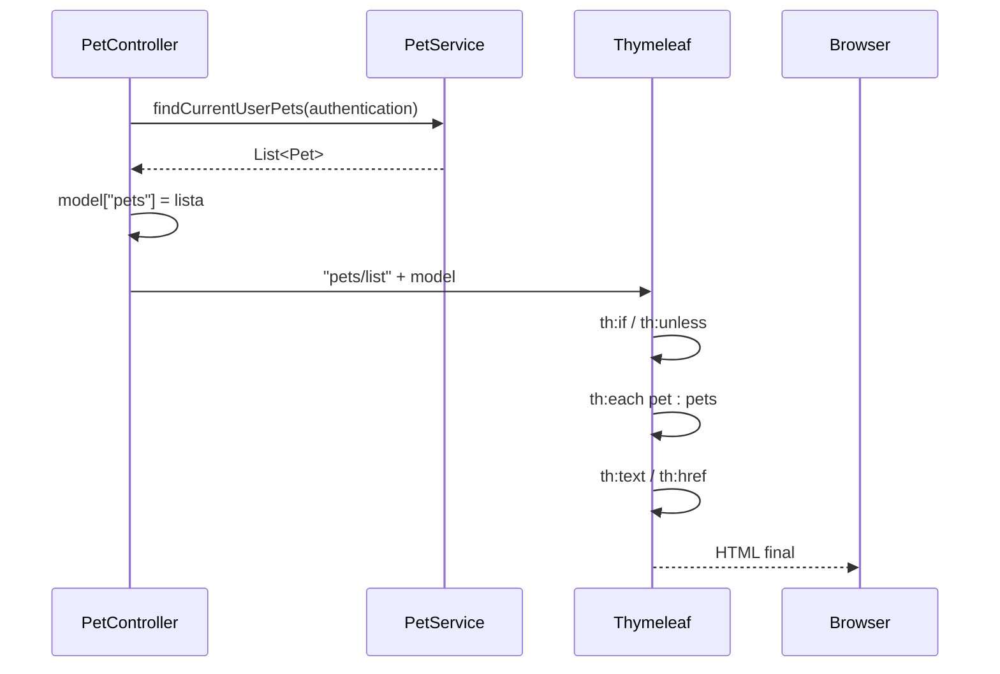
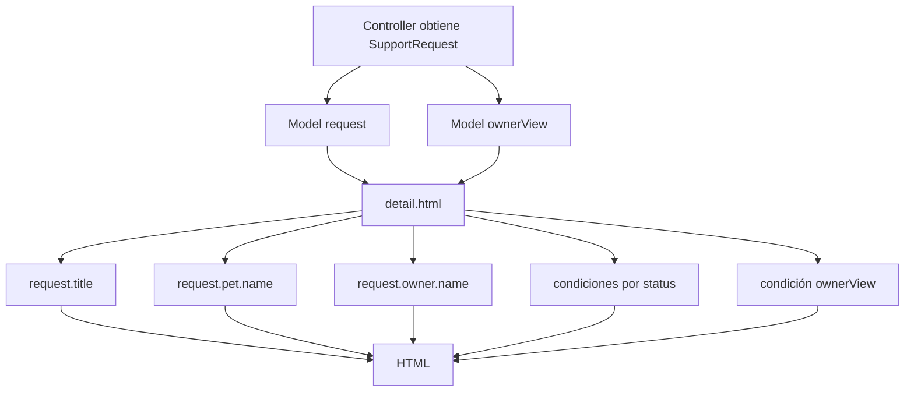

# 19 — Thymeleaf

En el capítulo anterior vimos que un Controller MVC puede hacer algo como:

```java
model.addAttribute("pets", ...);
return "pets/list";
```

Pero todavía falta una parte:

> **¿Cómo se convierte ese nombre lógico de vista y ese Model en HTML real para el navegador?**

PetMatch utiliza **Thymeleaf** como motor de plantillas server-side.

Este capítulo estudia Thymeleaf sobre los templates reales del proyecto y conecta directamente con lo aprendido sobre MVC, lazy loading y `EntityGraph`.

---

# 1. ¿Qué es un motor de plantillas?

Un motor de plantillas toma:

```text
plantilla HTML
+
datos
```

y produce:

```text
HTML final
```

En PetMatch:

```text
Controller
→ Model
→ Thymeleaf template
→ HTML
→ navegador
```

El navegador no ejecuta expresiones como:

```text
${pet.name}
```

Esas expresiones son procesadas en el servidor por Thymeleaf antes de enviar la respuesta.

---

# 2. Dependencia real

`pom.xml` contiene:

```xml
<dependency>
    <groupId>org.springframework.boot</groupId>
    <artifactId>spring-boot-starter-thymeleaf</artifactId>
</dependency>
```

También incluye:

```xml
<dependency>
    <groupId>org.thymeleaf.extras</groupId>
    <artifactId>thymeleaf-extras-springsecurity6</artifactId>
</dependency>
```

La primera aporta integración Thymeleaf con Spring Boot.

La segunda permite expresiones específicas de Spring Security en templates, como las usadas en la navegación.

---

# 3. ¿Dónde están los templates?

PetMatch los ubica en:

```text
src/main/resources/templates/
```

Ejemplos:

```text
home.html
pets/list.html
pets/detail.html
pets/form.html
support-requests/list.html
support-requests/detail.html
support-applications/mine.html
fragments/head.html
fragments/navigation.html
fragments/alerts.html
```

Cuando un Controller devuelve:

```java
return "pets/list";
```

la vista corresponde a:

```text
templates/pets/list.html
```

---

# 4. Namespace de Thymeleaf

Los templates incluyen:

```html
<html lang="es" xmlns:th="http://www.thymeleaf.org">
```

El prefijo:

```text
th:
```

identifica atributos procesados por Thymeleaf.

Ejemplos reales:

```text
th:text
th:if
th:unless
th:each
th:href
th:replace
th:object
th:field
th:errors
```

---

# 5. HTML normal + atributos dinámicos

Una ventaja pedagógica de Thymeleaf es que el template sigue siendo reconocible como HTML.

Ejemplo:

```html
<h2 class="mt-4 text-2xl font-bold text-white"
    th:text="${pet.name}"></h2>
```

La etiqueta sigue siendo:

```html
<h2>
```

Thymeleaf cambia su contenido usando:

```text
${pet.name}
```

---

# 6. `${...}`: expresiones de variables

En Thymeleaf, una expresión como:

```text
${pets}
```

busca un dato disponible en el contexto de renderizado.

Esto conecta directamente con Spring MVC.

Controller:

```java
model.addAttribute("pets", ...);
```

Template:

```text
${pets}
```

El nombre debe coincidir.

---

# 7. Ejemplo real: lista de mascotas

`PetController.list(...)` agrega:

```java
model.addAttribute(
    "pets",
    petService.findCurrentUserPets(authentication)
);
```

`pets/list.html` utiliza:

```html
<section th:if="${#lists.isEmpty(pets)}">
```

Y:

```html
<article th:each="pet : ${pets}">
```

La vista recibe la lista preparada por el Controller.

---

# 8. `th:each`

Código real:

```html
<article th:each="pet : ${pets}">
```

Puede leerse como:

```text
para cada pet dentro de pets
→ renderizar este article
```

Dentro del bloque se puede usar:

```text
${pet.name}
${pet.species}
${pet.age}
${pet.description}
${pet.id}
```

---

# 9. `th:text`

Código real:

```html
<h2 th:text="${pet.name}"></h2>
```

`th:text` establece el contenido textual del elemento.

Otro ejemplo:

```html
<span th:text="${pet.age}"></span>
```

Thymeleaf procesa el valor en servidor y genera texto HTML escapado de acuerdo con su comportamiento de renderizado textual.

> [!IMPORTANT]
> Para contenido normal procedente de datos, `th:text` es preferible a intentar construir HTML manual desde el Controller.

---

# 10. Expresiones con propiedades

Cuando escribimos:

```text
${pet.name}
```

Thymeleaf puede resolver la propiedad Java correspondiente.

Conceptualmente equivale a acceder a:

```java
pet.getName()
```

Y:

```text
${request.owner.name}
```

navega conceptualmente:

```java
request.getOwner().getName()
```

Esta navegación será especialmente importante al conectarla con JPA lazy loading.

---

# 11. `th:if`

Código real en `pets/list.html`:

```html
<section th:if="${#lists.isEmpty(pets)}">
```

Si la expresión es verdadera, el bloque se renderiza.

Si no, se omite del HTML final.

Otro ejemplo en detalle de solicitud:

```html
<div th:if="${ownerView}">
```

Eso muestra acciones específicas cuando el Controller indicó que se trata de la vista del owner.

---

# 12. `th:unless`

Código real:

```html
<section th:unless="${#lists.isEmpty(pets)}">
```

Puede leerse como:

```text
renderiza este bloque a menos que la condición sea true
```

En este caso:

```text
si la lista NO está vacía
→ mostrar las cards de mascotas
```

`th:if` y `th:unless` permiten mantener ramas visuales claras.

---

# 13. Utility objects como `#lists`

PetMatch usa:

```text
#lists.isEmpty(pets)
```

`#lists` es un objeto de utilidad disponible en expresiones Thymeleaf para trabajar con colecciones.

No es una clase creada por PetMatch.

La expresión permite decidir visualmente entre:

```text
estado vacío
```

y:

```text
lista de resultados
```

---

# 14. Expresión ternaria

Código real:

```html
th:text="${pet.description != null
    ? pet.description
    : 'Sin descripción adicional.'}"
```

Conceptualmente:

```text
si description no es null
→ mostrar description
si no
→ mostrar texto alternativo
```

PetMatch también utiliza ternarios para títulos y botones del formulario.

---

# 15. `@{...}`: expresiones de URL

En lugar de construir links a mano, Thymeleaf ofrece expresiones de URL.

Ejemplo:

```html
<a th:href="@{/pets/new}">
```

Genera una URL hacia:

```text
/pets/new
```

---

# 16. URLs con parámetros de path

Código real:

```html
<a th:href="@{/pets/{id}(id=${pet.id})}">
```

Si:

```text
pet.id = 42
```

la URL resultante será conceptualmente:

```text
/pets/42
```

La sintaxis separa:

```text
plantilla de ruta
+
valor del parámetro
```

---

# 17. Controller y link deben coincidir

El template puede generar:

```text
/pets/42
```

porque el Controller tiene:

```java
@GetMapping("/{petId}")
```

bajo:

```java
@RequestMapping("/pets")
```

La vista y el Controller forman un contrato de navegación.

Si cambias una ruta Java sin actualizar links, puedes romper la aplicación web.

---

# 18. Templates de detalle

`support-requests/detail.html` recibe:

```text
request
ownerView
```

Y utiliza propiedades como:

```text
${request.supportType}
${request.status}
${request.title}
${request.pet.name}
${request.owner.name}
${request.serviceDate}
${request.description}
```

Este template es un excelente ejemplo de View consumiendo un objeto preparado por el Service/Repository.

---

# 19. Condiciones según estado

Código real:

```html
<a th:if="${request.status.name() == 'OPEN'}"
   ...>
    Editar solicitud
</a>
```

Y:

```html
<form th:if="${request.status.name() == 'IN_PROGRESS'}"
      ...>
    <button>Marcar como completada</button>
</form>
```

La vista adapta las acciones disponibles al estado.

Pero debemos recordar el capítulo 15:

```text
la View refleja la máquina de estados
no la implementa como única protección
```

El Service vuelve a validar las transiciones.

---

# 20. Lógica de presentación vs lógica de negocio

Es apropiado que Thymeleaf decida:

```text
mostrar u ocultar botón
mostrar texto alternativo
iterar una lista
seleccionar una clase/label
```

No debería decidir por sí solo:

```text
si el usuario realmente puede modificar una Entity
si se permite una transición de negocio
si la base debe guardar un cambio
```

Una regla visual no sustituye al backend.

---

# 21. Fragments: evitar repetición

PetMatch tiene:

```text
fragments/head.html
fragments/navigation.html
fragments/alerts.html
```

Sin fragments, cada página tendría que copiar:

```text
<head>
navegación
mensajes de éxito/error
```

Eso aumenta duplicación y hace más difícil cambiar la interfaz de forma coherente.

---

# 22. `th:fragment`

En `head.html`:

```html
<head th:fragment="head(pageTitle)">
```

Esto define un fragmento llamado:

```text
head
```

que recibe un parámetro:

```text
pageTitle
```

Después otra vista puede usarlo.

---

# 23. `th:replace`

En `pets/list.html`:

```html
<head th:replace="~{fragments/head :: head('Mis mascotas | PetMatch Community')}"></head>
```

Conceptualmente:

```text
reemplaza este elemento
con el fragmento head
ubicado en fragments/head
pasándole el título indicado
```

---

# 24. Título dinámico del fragmento

En `head.html`:

```html
<title th:text="${pageTitle}">PetMatch Community</title>
```

El template consumidor suministra:

```text
'Mis mascotas | PetMatch Community'
```

Entonces un solo fragmento puede producir distintos títulos según la página.

---

# 25. Tailwind CSS real del proyecto

`head.html` contiene:

```html
<script src="https://cdn.jsdelivr.net/npm/@tailwindcss/browser@4"></script>
```

Por tanto PetMatch carga Tailwind mediante CDN/browser script.

La implementación actual no incluye un pipeline de frontend con:

```text
npm
Vite
PostCSS
Tailwind CLI
```

No forma parte de la implementación actual.

---

# 26. Fragmento de navegación

`navigation.html` define:

```html
<nav th:fragment="appNavigation">
```

Y otras vistas hacen:

```html
<nav th:replace="~{fragments/navigation :: appNavigation}"></nav>
```

Así todas reutilizan la misma navegación principal.

---

# 27. Thymeleaf + Spring Security

El fragmento declara:

```html
xmlns:sec="https://www.thymeleaf.org/extras/spring-security"
```

Y usa:

```html
<div sec:authorize="isAuthenticated()">
```

También:

```html
<span sec:authentication="name"></span>
```

Estas expresiones son posibles por la integración:

```text
thymeleaf-extras-springsecurity6
```

El bloque de seguridad las explicará con mayor profundidad.

---

# 28. Mostrar usuario autenticado

Código real:

```html
<span class="text-sm text-slate-500"
      sec:authentication="name"></span>
```

Esto permite mostrar el nombre principal de autenticación disponible para la sesión actual.

En PetMatch, el username de Spring Security corresponde al email según la configuración/user details del proyecto.

---

# 29. Logout en la vista

El fragmento contiene:

```html
<form th:action="@{/logout}" method="post">
```

La acción se genera con Thymeleaf y se envía mediante POST.

La lógica de logout no está implementada manualmente en un `LogoutController` del proyecto; Spring Security configura ese flujo.

El capítulo de seguridad web profundizará en sesión y CSRF.

---

# 30. Fragmento de alertas

`alerts.html` define:

```html
<div th:fragment="alerts">
```

Y contiene:

```html
<div th:if="${successMessage}"
     th:text="${successMessage}"></div>
```

Y:

```html
<div th:if="${errorMessage}"
     th:text="${errorMessage}"></div>
```

Eso conecta directamente con los flash attributes del Controller.

---

# 31. Flash attribute → fragment

Controller:

```java
redirectAttributes.addFlashAttribute(
    "successMessage",
    "Mascota registrada correctamente."
);
```

Template:

```html
<div th:replace="~{fragments/alerts :: alerts}"></div>
```

Fragment:

```html
<div th:if="${successMessage}"
     th:text="${successMessage}"></div>
```

Este es un flujo completo Controller → redirect → View.

---

# 32. `th:object` y `th:field`: vista previa

En `pets/form.html` aparece:

```html
<form ... th:object="${petForm}" method="post">
```

Y campos como:

```html
<input th:field="*{name}">
```

Aquí:

```text
${petForm}
```

es el objeto principal del formulario.

Y:

```text
*{name}
```

se interpreta relativamente a ese objeto.

El [capítulo 20](20-formularios-y-form-dto.md) explica este binding con detalle.

---

# 33. `*{...}` vs `${...}`

Una primera aproximación:

```text
${...}
→ expresión sobre variables del contexto

*{...}
→ selección relativa al objeto definido con th:object
```

Ejemplo:

```html
<form th:object="${petForm}">
    <input th:field="*{name}">
</form>
```

El mecanismo completo se desarrolla en el capítulo 20.

---

# 34. Errores de formulario: vista previa

PetMatch usa:

```html
<p th:if="${#fields.hasErrors('name')}"
   th:errors="*{name}"></p>
```

Esto se relaciona con:

```java
@Valid PetForm petForm,
BindingResult bindingResult
```

del Controller.

El [capítulo 21](21-validacion.md) explica cómo Bean Validation produce esos errores y cómo Thymeleaf los muestra.

---

# 35. Thymeleaf y lazy loading

Aquí conectamos con el capítulo 17.

La vista de solicitudes abiertas contiene:

```html
th:text="${request.pet.name}"
```

y:

```html
th:text="${request.owner.name}"
```

Eso significa que durante renderizado la View necesita:

```text
request.pet
request.owner
```

Pero PetMatch tiene:

```yaml
open-in-view: false
```

Entonces no conviene depender de cargar esas relaciones por primera vez desde el template.

---

# 36. Repository prepara lo que la vista necesita

`SupportRequestRepository` usa:

```java
@EntityGraph(attributePaths = {"pet", "owner"})
```

en consultas principales.

Esto hace explícito un diseño importante:

```text
Repository/Service
→ preparar grafo necesario

Thymeleaf
→ consumirlo
```

No:

```text
Thymeleaf
→ iniciar consultas JPA improvisadas
```

---

# 37. Ejemplo “Mis postulaciones”

El template usa:

```html
th:text="${supportApplication.supportRequest.pet.name}"
```

Por tanto necesita navegar:

```text
SupportApplication
→ SupportRequest
→ Pet
```

`SupportApplicationRepository` declara un EntityGraph que incluye:

```text
supportRequest
supportRequest.pet
```

La View y el fetch plan están alineados.

---

# 38. Thymeleaf no debería consultar Repository

Un template no debería contener algo equivalente a:

```text
repository.find...
```

Su responsabilidad es presentar datos disponibles.

La arquitectura continúa:

```text
View
← Model
← Controller
← Service
← Repository
```

No debemos invertirla.

---

# 39. Thymeleaf no es un frontend SPA

Thymeleaf se ejecuta del lado servidor.

El flujo es:

```text
request
↓
Spring MVC
↓
Thymeleaf procesa template
↓
HTML completo
↓
navegador
```

No funciona como React/Vue donde una aplicación JavaScript cliente maneja todo el rendering de componentes después de cargar la página.

---

# 40. HTML natural y fallback visual

Ejemplo:

```html
<title th:text="${pageTitle}">PetMatch Community</title>
```

El contenido:

```text
PetMatch Community
```

es HTML válido incluso antes de que Thymeleaf lo procese.

Cuando el motor procesa la plantilla, `th:text` reemplaza ese contenido.

Este estilo ayuda a mantener templates legibles.

---

# 41. Expresiones no deben convertirse en lógica excesiva

Es técnicamente posible escribir expresiones complejas en templates.

Pero una View difícil de leer como:

```text
condiciones largas
cálculos complejos
reglas de negocio
```

indica que parte del trabajo podría pertenecer a Controller/Service o a un modelo de presentación mejor preparado.

PetMatch mantiene principalmente lógica visual simple:

```text
mostrar
iterar
condicionar
construir URLs
```

---

# 42. Estado y presentación

En `support-requests/detail.html` se evalúa:

```text
request.status.name() == 'OPEN'
```

para mostrar acciones.

Esto es apropiado como adaptación visual del estado.

Pero el capítulo 15 ya demostró que las transiciones se verifican en Service.

Regla:

```text
View puede reflejar el estado
Service debe proteger el estado
```

---

# 43. `ownerView` como dato preparado

El Controller agrega:

```java
model.addAttribute(
    "ownerView",
    supportRequestService.isOwner(request, authentication)
);
```

Y el template usa:

```html
<div th:if="${ownerView}">
```

Esto evita que el template tenga que reconstruir por sí solo toda la lógica de ownership.

Aun así, el Service valida nuevamente cuando ocurre una operación.

---

# 44. Seguridad visual vs seguridad real

El fragmento de navegación puede ocultar elementos según autenticación.

El detalle puede ocultar botones según ownership/status.

Pero:

```text
visibilidad del HTML
≠
autorización backend
```

Un atacante no necesita hacer clic en tu botón; puede construir una petición HTTP manualmente.

Los capítulos de Spring Security profundizarán esta diferencia.

---

# 45. Templates de error

PetMatch contiene:

```text
templates/errors/404.html
templates/errors/500.html
```

Esto demuestra que la interfaz web contempla páginas HTML de error.

El capítulo MVC ya mostró cómo algunos Controllers producen `ResponseStatusException(HttpStatus.NOT_FOUND)`.

La infraestructura web puede resolver la presentación apropiada de errores según configuración y flujo.

---

# 46. Fragmentos no son componentes Spring

Un fragmento Thymeleaf como:

```text
appNavigation
```

no es un Bean de Spring ni una clase `@Component`.

Es una unidad reutilizable de template.

No confundas:

```text
Spring component
```

con:

```text
Thymeleaf fragment
```

Ambos reutilizan cosas, pero en capas diferentes.

---

# 47. Flujo real de `pets/list`



---

# 48. Flujo real de `support-requests/detail`



---

# 49. Errores frecuentes

## Error 1 — Creer que `${...}` se ejecuta en el navegador

No. Thymeleaf lo procesa en servidor.

## Error 2 — Escribir lógica de negocio en el template

La View debe presentar, no decidir reglas autoritativas.

## Error 3 — Confundir `th:if` con autorización

Ocultar HTML no protege un endpoint.

## Error 4 — Copiar navegación en cada página

PetMatch usa fragments para evitar duplicación.

## Error 5 — Confundir `${...}` con `*{...}`

`*{...}` se usa relativamente a un objeto seleccionado con `th:object`.

## Error 6 — Hacer todas las relaciones JPA EAGER para que el template “funcione”

PetMatch usa LAZY + `open-in-view=false` + EntityGraphs específicos.

## Error 7 — Afirmar que EntityGraph siempre produce un único JOIN SQL

Define el fetch plan; no implica un SQL exacto.

## Error 8 — Asumir un build de Tailwind

PetMatch carga Tailwind mediante CDN/browser script.

## Error 9 — Confundir fragment con Bean de Spring

Son mecanismos de capas diferentes.

---

# 50. 🛠 Prueba en el código

## Actividad 1 — Sigue un atributo

Parte de:

```java
model.addAttribute("pets", ...)
```

y encuentra todos los usos de:

```text
${pets}
```

en `pets/list.html`.

## Actividad 2 — Identifica directivas

En `pets/list.html`, encuentra un ejemplo de:

```text
th:replace
th:if
th:unless
th:each
th:text
th:href
```

Explica qué hace cada uno.

## Actividad 3 — Fragments

Abre:

```text
fragments/head.html
fragments/navigation.html
fragments/alerts.html
```

y encuentra dónde se consumen desde otras vistas.

## Actividad 4 — Lazy + View

En `support-requests/list.html`, localiza:

```text
request.pet.name
request.owner.name
```

Luego abre `SupportRequestRepository` y encuentra el EntityGraph que prepara esas relaciones.

## Actividad 5 — Estado visual

En `support-requests/detail.html`, identifica qué botones dependen de:

```text
OPEN
IN_PROGRESS
ownerView
```

Después encuentra la validación real correspondiente en los Services.

---

# 51. 🧪 Comprueba que entendiste

1. ¿Qué es Thymeleaf?
2. ¿Dónde viven los templates de PetMatch?
3. ¿Qué hace `${pets}`?
4. ¿Qué hace `th:each`?
5. ¿Qué hace `th:text`?
6. ¿Qué diferencia hay entre `th:if` y `th:unless`?
7. ¿Para qué sirve `@{...}`?
8. ¿Qué es un fragment?
9. ¿Qué hace `th:replace`?
10. ¿Qué fragments compartidos tiene PetMatch?
11. ¿Qué dependencia permite `sec:authorize` y `sec:authentication`?
12. ¿Por qué `ownerView` puede ser útil en el template?
13. ¿Ocultar un botón protege el endpoint?
14. ¿Qué relación existe entre `request.pet.name` y `@EntityGraph("pet")`?
15. ¿Qué significa `*{name}` dentro de un formulario con `th:object="${petForm}"`?
16. ¿Dónde se profundizan `th:field` y errores de validación?
17. ¿PetMatch compila Tailwind mediante Vite/npm?

### Respuestas esperadas

1. Motor de plantillas server-side usado para generar HTML dinámico.
2. `src/main/resources/templates/`.
3. Accede al atributo `pets` disponible en el contexto/modelo.
4. Itera una colección para repetir un fragmento HTML.
5. Establece contenido textual dinámico.
6. Uno renderiza si la condición es true; el otro cuando no lo es.
7. Construir URLs de contexto/ruta con Thymeleaf.
8. Una parte reutilizable de template.
9. Reemplaza un elemento con un fragmento reutilizable.
10. `head`, `appNavigation`, `alerts`.
11. `thymeleaf-extras-springsecurity6`.
12. Para controlar presentación específica del owner sin reconstruir toda la lógica en HTML.
13. No.
14. La View necesita esa relación y el Repository la incluye en el fetch plan antes del renderizado.
15. Campo `name` relativo al objeto seleccionado `petForm`.
16. Capítulos 20 y 21.
17. No; usa Tailwind mediante CDN/browser script.

---

# 52. ✅ Qué debes recordar

- **Thymeleaf transforma templates + datos en HTML server-side.**
- Los templates están bajo `src/main/resources/templates`.
- `${...}` accede a variables del contexto.
- `th:each` itera colecciones.
- `th:text` renderiza texto dinámico.
- `th:if` y `th:unless` controlan presentación condicional.
- `@{...}` construye URLs.
- Fragments evitan duplicar partes comunes.
- PetMatch reutiliza `head`, navegación y alertas.
- `thymeleaf-extras-springsecurity6` aporta expresiones `sec:*`.
- Flash attributes pueden terminar en el fragmento de alertas.
- La View refleja ownership y estados, pero no sustituye las reglas del backend.
- LAZY + `open-in-view=false` obliga a preparar relaciones antes del renderizado.
- Los EntityGraphs de PetMatch están alineados con relaciones consumidas por las vistas.
- `th:object`, `th:field` y `th:errors` conectan Thymeleaf con los formularios y validación desarrollados en los capítulos 20–21.
- PetMatch usa Tailwind vía CDN, no una cadena Node/Vite.

---

# 🔗 Continúa con

Ya entendemos cómo Spring MVC recibe peticiones y cómo Thymeleaf convierte el Model en HTML.

Ahora sigue el circuito de entrada:

```text
HTML form
→ HTTP POST
→ Form DTO
→ binding
→ Controller
→ Service
```

Continúa con:

**[Capítulo 20 — Formularios y Form DTO →](20-formularios-y-form-dto.md)**

---

[← Capítulo 18 — Spring MVC](18-spring-mvc.md) · [Índice del bloque](README.md) · [Índice general](../README.md) · [Siguiente → Capítulo 20](20-formularios-y-form-dto.md)
