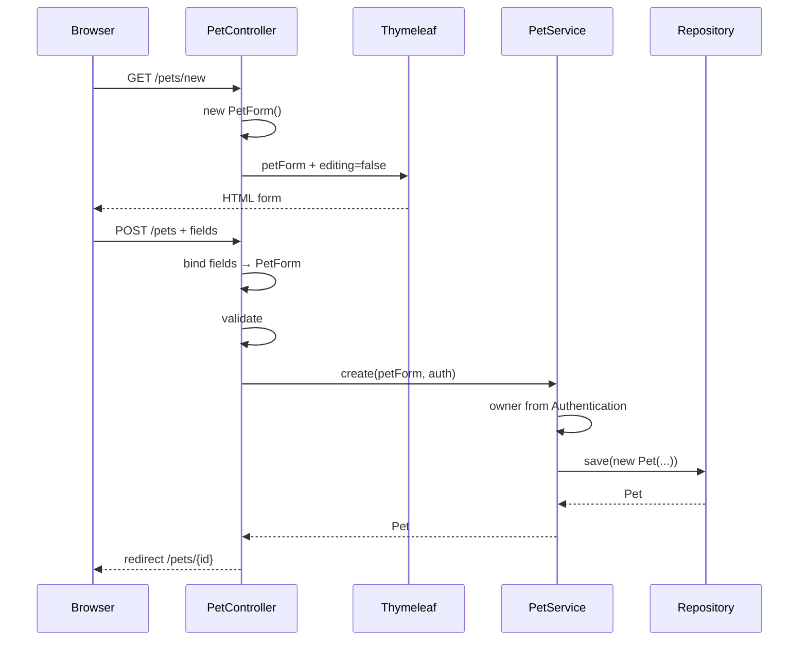

# 20 — Formularios y Form DTO

En los capítulos 18 y 19 vimos el recorrido de una página MVC:

```text
HTTP request
→ Controller
→ Service
→ Model
→ Thymeleaf
→ HTML
```

Pero una aplicación web no solo muestra información.

También necesita recibir datos del usuario.

En PetMatch ocurre cuando alguien:

- se registra;
- registra una mascota;
- edita una mascota;
- crea una solicitud de apoyo;
- edita una solicitud;
- envía una postulación.

La pregunta central de este capítulo es:

> **¿Cómo pasan los valores de un `<form>` HTML a un objeto Java que el Controller pueda validar y entregar al Service sin usar directamente la Entity como contrato de entrada?**

PetMatch responde con una separación clara:

```text
HTML form
→ Form DTO
→ Controller
→ Service
→ Entity
```

---

# 1. El problema de recibir formularios

Considera un formulario HTML conceptual:

```html
<form method="post">
    <input name="name">
    <input name="species">
    <input name="age">
    <textarea name="description"></textarea>
</form>
```

Cuando el navegador lo envía, el servidor recibe valores asociados a nombres de campos.

Necesitamos convertir algo parecido a:

```text
name=Luna
species=Gato
age=3
description=Tranquila
```

hacia un objeto Java.

PetMatch no procesa manualmente cada parámetro con código como:

```java
request.getParameter("name")
```

Spring MVC realiza **data binding** hacia objetos de formulario.

---

# 2. Los Form DTO reales de PetMatch

El proyecto tiene:

```text
src/main/java/com/petmatch/community/dto/
```

con Form DTO como:

```text
auth/RegistrationForm
pet/PetForm
supportrequest/SupportRequestForm
supportapplication/SupportApplicationForm
```

Estos objetos representan **datos de entrada de formularios**, no filas de base de datos.

---

# 3. ¿Qué significa DTO?

DTO significa:

```text
Data Transfer Object
```

Es un objeto diseñado para transportar datos entre límites o capas.

En este caso:

```text
navegador
→ Spring MVC
→ Controller/Service
```

Un Form DTO responde a la pregunta:

> **¿Qué datos necesita entregar este formulario para ejecutar el caso de uso?**

No:

> **¿Qué columnas tiene la tabla?**

---

# 4. Entity y Form DTO no son lo mismo

Para mascotas existen:

```text
Pet
```

y:

```text
PetForm
```

`Pet` contiene, entre otras cosas:

```text
id
name
species
age
description
owner
supportRequests
```

Mientras `PetForm` contiene:

```java
private String name;
private String species;
private Integer age;
private String description;
```

No contiene:

```text
id
owner
supportRequests
```

Esto es intencional.

---

# 5. ¿Por qué no pedir `owner` en el formulario?

El usuario no debería enviar libremente:

```text
ownerId=123
```

para decidir quién será el propietario de la mascota.

`PetService.create(...)` obtiene el owner desde:

```text
Authentication
→ UserService.getCurrentUser(...)
```

Conceptualmente:

```text
campos editables por usuario
→ PetForm

identidad del owner
→ contexto autenticado
```

Separar ambos reduce el riesgo de aceptar datos sensibles controlados por el cliente.

---

# 6. `PetForm` real

Ruta:

```text
src/main/java/com/petmatch/community/dto/pet/PetForm.java
```

Estructura:

```java
public class PetForm {

    private String name;
    private String species;
    private Integer age;
    private String description;

    // getters y setters
}
```

Además contiene constraints de validación que estudiaremos formalmente en el capítulo 21.

Por ahora importa observar que es un POJO simple creado para la entrada web.

---

# 7. El objeto aparece primero en GET `/pets/new`

`PetController` prepara el formulario:

```java
@GetMapping("/new")
public String createForm(Model model) {
    model.addAttribute("petForm", new PetForm());
    model.addAttribute("editing", false);
    return "pets/form";
}
```

Flujo:

```text
GET /pets/new
↓
new PetForm()
↓
Model["petForm"]
↓
pets/form.html
```

La View recibe un objeto inicialmente vacío que servirá como backing object del formulario.

---

# 8. `th:object`

En `pets/form.html`:

```html
<form
    th:object="${petForm}"
    method="post">
```

`th:object` establece el objeto del formulario.

Podemos leerlo como:

```text
este form trabaja principalmente con petForm
```

Dentro de ese bloque, Thymeleaf puede referirse a sus propiedades mediante expresiones de selección.

---

# 9. `th:field`

Código real:

```html
<input id="name"
       type="text"
       th:field="*{name}">
```

Como el formulario tiene:

```html
th:object="${petForm}"
```

entonces:

```text
*{name}
```

se refiere conceptualmente a:

```text
petForm.name
```

Thymeleaf genera/coordinada atributos HTML necesarios para enlazar ese campo.

---

# 10. `${...}` vs `*{...}`

Regla mental:

```text
${...}
→ variable/expresión del contexto general

*{...}
→ propiedad relativa al objeto seleccionado por th:object
```

Ejemplo:

```html
<form th:object="${petForm}">
    <input th:field="*{name}">
</form>
```

Puede leerse:

```text
contexto → petForm
campo relativo → name
```

---

# 11. Del input al objeto Java

Cuando el usuario envía:

```text
name=Luna
species=Gato
age=3
```

Spring MVC enlaza esos valores a propiedades compatibles del objeto Java.

Conceptualmente:

```text
name
→ setName(...)

species
→ setSpecies(...)

age
→ conversión a Integer
→ setAge(...)
```

Por eso los Form DTO actuales tienen getters y setters.

---

# 12. POST `/pets`

Controller real:

```java
@PostMapping
public String create(
    @Valid PetForm petForm,
    BindingResult bindingResult,
    Authentication authentication,
    Model model,
    RedirectAttributes redirectAttributes
) {
    ...
}
```

Al llegar al método, Spring MVC ya ha intentado construir/bindear un `PetForm` con los datos enviados.

Después `@Valid` solicita validación.

---

# 13. ¿Por qué el parámetro se llama `petForm`?

La View espera:

```text
${petForm}
```

Y el método recibe:

```java
PetForm petForm
```

Spring MVC puede manejar el objeto como atributo de modelo para este tipo de binding.

En `AuthController`, el proyecto lo hace aún más explícito:

```java
@Valid
@ModelAttribute("registrationForm")
RegistrationForm form
```

Ambos patrones existen en el código real.

---

# 14. `@ModelAttribute` explícito

`AuthController` usa:

```java
@Valid
@ModelAttribute("registrationForm")
RegistrationForm form
```

Eso declara explícitamente:

```text
crear/bindear un RegistrationForm
+
exponerlo como registrationForm
```

La plantilla de registro trabaja con ese mismo nombre.

---

# 15. ¿Por qué un Form DTO es una frontera útil?

Porque permite decidir exactamente qué puede enviar el cliente.

Ejemplo `PetForm`:

```text
name
species
age
description
```

Mientras propiedades sensibles/no editables permanecen fuera:

```text
id
owner
supportRequests
```

Esto ayuda contra problemas de **over-posting** o **mass assignment conceptual**: aceptar más campos del cliente de los que el caso de uso debería permitir.

---

# 16. Form DTO no significa “copiar toda la Entity”

Si creáramos:

```text
PetForm
```

con todos los campos de `Pet`, incluidos:

```text
owner
supportRequests
```

perderíamos gran parte de la ventaja.

El DTO debe responder al contrato del formulario, no duplicar mecánicamente la Entity.

---

# 17. `SupportRequestForm`: un ejemplo aún mejor

Ruta:

```text
src/main/java/com/petmatch/community/dto/supportrequest/SupportRequestForm.java
```

Campos:

```java
private String title;
private String description;
private SupportType supportType;
private LocalDateTime serviceDate;
private Long petId;
```

Observa el último:

```java
private Long petId;
```

No contiene:

```java
private Pet pet;
```

---

# 18. ¿Por qué `petId` y no `Pet`?

El navegador puede enviar una selección como:

```text
petId=42
```

Pero el Service debe decidir si esa mascota realmente pertenece al usuario autenticado.

`SupportRequestService.create(...)` hace conceptualmente:

```java
Pet pet = petService.findOwnedPet(
    form.getPetId(),
    authentication
);
```

Por tanto:

```text
Form DTO transporta id solicitado
↓
Service resuelve Entity autorizada
↓
Entity se usa para crear SupportRequest
```

Esto es mucho más seguro que confiar ciegamente en un objeto `Pet` construido desde el request.

---

# 19. El `<select>` de mascotas

Template real:

```html
<select id="petId" th:field="*{petId}">
    <option value="">Selecciona</option>
    <option
        th:each="pet : ${pets}"
        th:value="${pet.id}"
        th:text="${pet.name + ' · ' + pet.species}">
    </option>
</select>
```

La View muestra información amigable:

```text
Luna · Gato
```

pero envía:

```text
pet.id
```

al Form DTO.

---

# 20. ¿De dónde sale `${pets}`?

`SupportRequestController` prepara opciones mediante un helper:

```java
private void populateFormOptions(
    Authentication authentication,
    Model model
) {
    List<Pet> pets = petService.findCurrentUserPets(authentication);
    model.addAttribute("pets", pets);
    model.addAttribute("supportTypes", SupportType.values());
}
```

Así el template recibe:

```text
supportRequestForm
pets
supportTypes
editing
```

No todo proviene del Form DTO.

---

# 21. Form backing object vs datos auxiliares de la vista

En el formulario de solicitud:

```text
supportRequestForm
→ datos editables/enviados

pets
→ opciones visuales

supportTypes
→ opciones visuales

editing
→ modo de presentación

request
→ necesario en edición para construir URL
```

Esta separación es importante.

El `Model` puede contener más datos que el objeto del formulario.

---

# 22. Crear y editar pueden compartir template

`pets/form.html` utiliza:

```text
editing = false
```

para creación y:

```text
editing = true
```

para edición.

Ejemplo:

```html
th:text="${editing ? 'Editar información' : 'Registrar mascota'}"
```

Y la acción cambia según el modo.

Esto permite reutilizar un mismo template.

---

# 23. Acción dinámica del formulario

Código real:

```html
<form
    th:action="${editing}
        ? @{/pets/{id}(id=${pet.id})}
        : @{/pets}"
    th:object="${petForm}"
    method="post">
```

En creación:

```text
POST /pets
```

En edición:

```text
POST /pets/{id}
```

PetMatch no usa aquí `PUT` desde el formulario HTML MVC.

La API REST sí tendrá contratos HTTP distintos, pero eso pertenece al bloque REST.

---

# 24. Prellenar un formulario de edición

Para editar una mascota, el Controller obtiene la Entity y hace:

```java
model.addAttribute(
    "petForm",
    petService.toForm(pet)
);
```

`PetService.toForm(...)` copia hacia el DTO los valores editables.

Flujo:

```text
Pet Entity existente
↓
toForm(...)
↓
PetForm
↓
Model
↓
th:field
↓
inputs prellenados
```

---

# 25. ¿Por qué no pasar la Entity directamente al form?

Una alternativa sería:

```html
th:object="${pet}"
```

Pero eso acoplaría más directamente el contrato web al modelo persistente.

Con `PetForm`, PetMatch puede mantener fuera:

```text
owner
id
relaciones
campos no editables
```

y aplicar validación específica de entrada.

---

# 26. `toForm` es mapping

`PetService.toForm(...)` y `SupportRequestService.toForm(...)` realizan un mapeo sencillo:

```text
Entity
→ Form DTO
```

En creación ocurre la dirección contraria conceptualmente:

```text
Form DTO
→ datos normalizados
→ constructor/setters de Entity
```

No existe una librería automática de mapping para estos Form DTO en PetMatch.

El código lo hace explícitamente.

---

# 27. `SupportRequestService.toForm(...)`

Este mapper copia:

```text
title
description
supportType
serviceDate
pet.id → petId
```

La transformación:

```text
Pet
→ Long petId
```

muestra nuevamente que Entity y Form DTO tienen estructuras distintas.

---

# 28. `SupportApplicationForm`

Es el Form DTO más pequeño:

```java
public class SupportApplicationForm {

    private String message;
}
```

El usuario únicamente entrega un mensaje opcional.

No envía desde el formulario:

```text
status
applicant
supportRequest object
appliedAt
```

---

# 29. ¿De dónde salen applicant y request?

`SupportApplicationService.apply(...)` obtiene:

```text
applicant
→ usuario autenticado

request
→ requestId del path + Repository
```

Y crea:

```java
new SupportApplication(
    normalizeNullable(form.getMessage()),
    applicant,
    request
)
```

El Form DTO solo controla el dato que el usuario realmente puede introducir.

---

# 30. `RegistrationForm`

Registro necesita:

```text
name
email
password
confirmPassword
```

La Entity `User` no tiene:

```text
confirmPassword
```

porque ese valor solo existe durante el proceso de registro.

Esta es una demostración perfecta de por qué un Form DTO no debe confundirse con Entity.

---

# 31. `confirmPassword` no debe persistirse

Su función es:

```text
usuario escribe password
usuario la repite
Controller compara ambas
```

Después, `UserService` utiliza únicamente:

```text
password
```

para generar:

```text
passwordHash
```

`confirmPassword` desaparece al terminar el caso de uso.

---

# 32. Campo de formulario ≠ columna de base de datos

Ejemplos:

```text
RegistrationForm.confirmPassword
→ no es columna
```

```text
SupportRequestForm.petId
→ representa selección de una relación
```

```text
PetForm.description
→ sí corresponde conceptualmente a dato persistente
```

Un Form DTO pertenece al contrato web, no al esquema SQL.

---

# 33. Conversión de tipos

El navegador envía texto HTTP.

Pero el DTO puede declarar:

```java
Integer age;
Long petId;
SupportType supportType;
LocalDateTime serviceDate;
```

Spring MVC intenta convertir los valores recibidos a esos tipos.

Si una conversión no es posible, el binding puede producir errores antes incluso de las reglas del Service.

---

# 34. `@DateTimeFormat`

`SupportRequestForm` declara:

```java
@DateTimeFormat(pattern = "yyyy-MM-dd'T'HH:mm")
private LocalDateTime serviceDate;
```

El template usa:

```html
<input
    id="serviceDate"
    type="datetime-local"
    th:field="*{serviceDate}">
```

Ambos lados están alineados con un formato como:

```text
2026-09-10T14:30
```

---

# 35. ¿Qué pasa si binding/validación falla?

El Controller recibe:

```java
BindingResult bindingResult
```

Y puede comprobar:

```java
if (bindingResult.hasErrors()) {
    ...
}
```

Si hay errores, normalmente vuelve a renderizar el mismo template.

No llama al Service de creación/actualización.

El capítulo 21 estudiará ese ciclo en profundidad.

---

# 36. Conservar los valores ingresados

Cuando se vuelve al mismo template con errores, el Form DTO permanece asociado al Model/binding result.

Eso permite que `th:field` muestre de nuevo los valores que el usuario intentó enviar, junto con errores.

La experiencia sería mucho peor si cada error devolviera un formulario completamente vacío.

---

# 37. Datos auxiliares deben repoblarse al fallar

En `SupportRequestController.create(...)`, si hay errores:

```java
if (bindingResult.hasErrors()) {
    populateFormOptions(authentication, model);
    model.addAttribute("editing", false);
    return "support-requests/form";
}
```

¿Por qué volver a cargar `pets` y `supportTypes`?

Porque esos datos no pertenecen a `SupportRequestForm`, pero el template los necesita para renderizar sus `<select>`.

---

# 38. Error frecuente: volver sin reconstruir el Model

Si un formulario necesita:

```text
countries
categories
pets
supportTypes
```

y ante un error solo haces:

```java
return "form";
```

sin reponer esas listas, el template puede quedar incompleto o fallar.

PetMatch reconstruye las opciones necesarias en esos caminos.

---

# 39. Binding no es autorización

Supón que el usuario envía:

```text
petId=999
```

Y 999 pertenece a otra persona.

El binding puede convertir correctamente:

```text
"999" → Long 999
```

pero eso **no significa** que el usuario tenga permiso para usar esa Pet.

El Service ejecuta:

```text
findOwnedPet(...)
```

Por tanto:

```text
binding válido
≠
autorización válida
```

---

# 40. Binding no es regla de negocio

Un `SupportRequestForm` puede ser estructuralmente válido:

```text
title no vacío
serviceDate futura
petId presente
```

pero la mascota indicada puede no pertenecer al usuario.

La validación del DTO y las reglas de negocio se complementan.

---

# 41. Form DTO vs API DTO

PetMatch también tiene DTO para REST.

Por ejemplo:

```text
PetForm
```

no es lo mismo que:

```text
PetApiRequest
PetApiResponse
```

Aunque puedan compartir campos.

Cada contrato pertenece a una interfaz distinta:

```text
MVC HTML form
→ Form DTO

REST JSON
→ API DTO
```

El capítulo 28 profundizará la segunda familia.

---

# 42. ¿Por qué no reutilizar siempre el mismo DTO?

Porque los contratos pueden evolucionar de manera diferente.

La web podría necesitar:

```text
confirmPassword
petId seleccionado desde un select
campos auxiliares de edición
```

Mientras una API puede requerir otro formato de request/response.

Reutilizar por coincidencia accidental puede crear acoplamiento innecesario.

---

# 43. El Form DTO como documentación del caso de uso

Abrir `PetForm` permite responder rápidamente:

> ¿Qué información debe introducir un usuario para registrar/editar una mascota?

Abrir `RegistrationForm`:

> ¿Qué pide el registro?

Abrir `SupportRequestForm`:

> ¿Qué datos necesita una solicitud?

El DTO es también una forma de documentación del contrato de entrada.

---

# 44. Flujo completo de creación de mascota



---

# 45. Flujo completo de edición

```text
GET /pets/{id}/edit
↓
findOwnedPet
↓
Pet Entity
↓
toForm
↓
PetForm
↓
render form prellenado
↓
POST /pets/{id}
↓
binding → PetForm
↓
validación
↓
PetService.update
↓
Entity managed modificada
↓
redirect
```

Aquí se conectan MVC, DTO, ownership y JPA dirty checking.

---

# 46. Form DTO y normalización

Los DTO contienen los datos tal como llegan tras binding/conversión.

Después Services normalizan algunos valores.

Ejemplos:

```text
trim()
lowercase email
string vacío opcional → null
```

No debemos asumir que el binding hace automáticamente toda normalización de negocio.

---

# 47. ¿Dónde debería ocurrir cada responsabilidad?

Una guía útil basada en PetMatch:

```text
Template
→ captura/muestra datos

Spring MVC binding
→ convierte request a objeto Java

Form DTO
→ contrato de entrada

Validation
→ restricciones estructurales

Controller
→ coordina respuesta web y errores de binding

Service
→ reglas, ownership, normalización y persistencia

Entity
→ estado persistente/relaciones
```

---

# 48. ⚠️ Errores frecuentes

## Error 1 — Usar Entity directamente para todos los formularios

Puede exponer campos y acoplar demasiado persistencia con entrada web.

## Error 2 — Poner `ownerId` editable en `PetForm`

El owner debe derivarse del usuario autenticado.

## Error 3 — Recibir `Pet` directamente desde un `<select>` y confiar en ella

PetMatch recibe `petId` y el Service resuelve una Pet owned.

## Error 4 — Pensar que `th:field` guarda datos en base de datos

Solo participa en binding HTML/objeto.

## Error 5 — Confundir `${...}` con `*{...}`

`*{...}` es relativo al `th:object`.

## Error 6 — Olvidar repoblar listas cuando el formulario vuelve con errores

Los datos auxiliares del Model no forman parte automáticamente del Form DTO.

## Error 7 — Confundir binding con autorización

Convertir `petId=999` a `Long` no verifica ownership.

## Error 8 — Persistir `confirmPassword`

Es un dato temporal del caso de registro.

## Error 9 — Reutilizar Form DTO como API DTO solo porque los campos se parecen

Son contratos de interfaces diferentes.

## Error 10 — Copiar mecánicamente todos los campos de Entity al DTO

Un DTO debe diseñarse según el caso de uso.

---

# 49. 🛠 Prueba en el código

## Actividad 1 — Entity vs Form DTO

Compara:

```text
Pet.java
PetForm.java
```

Construye dos listas:

```text
campos compartidos
campos solo de Entity
```

Explica por qué `owner` no está en el formulario.

## Actividad 2 — Sigue `petId`

Traza:

```text
<option th:value="${pet.id}">
↓
SupportRequestForm.petId
↓
form.getPetId()
↓
PetService.findOwnedPet
↓
SupportRequest.pet
```

## Actividad 3 — Registro

Compara:

```text
RegistrationForm.password
RegistrationForm.confirmPassword
User.passwordHash
```

Explica por qué son tres conceptos diferentes.

## Actividad 4 — Edición

Localiza:

```text
PetService.toForm
SupportRequestService.toForm
```

y anota qué conversiones Entity → DTO realizan.

## Actividad 5 — Datos auxiliares

En `support-requests/form.html`, clasifica cada variable:

```text
supportRequestForm
pets
supportTypes
editing
request
```

como:

```text
form data
view support data
```

---

# 50. 🧪 Comprueba que entendiste

1. ¿Qué es un Form DTO?
2. ¿Por qué `PetForm` no contiene `owner`?
3. ¿Qué hace `th:object`?
4. ¿Qué significa `*{name}` dentro de `th:object="${petForm}"`?
5. ¿Qué hace data binding?
6. ¿Qué diferencia hay entre `${...}` y `*{...}`?
7. ¿Por qué `SupportRequestForm` contiene `petId` y no `Pet`?
8. ¿Quién verifica que esa mascota pertenezca al usuario?
9. ¿Para qué sirve `toForm(...)`?
10. ¿Por qué `RegistrationForm` tiene `confirmPassword` pero `User` no?
11. ¿Qué hace `@DateTimeFormat` en `serviceDate`?
12. ¿Qué ocurre con listas auxiliares como `pets` cuando vuelve un formulario con errores?
13. ¿Binding correcto significa autorización correcta?
14. ¿Form DTO y API DTO son necesariamente el mismo objeto?
15. ¿Qué riesgo reduce usar un DTO que solo expone campos permitidos?

### Respuestas esperadas

1. Objeto que representa los datos de entrada de un formulario/caso de uso web.
2. Porque el owner viene del usuario autenticado y no debe ser libremente controlado por el cliente.
3. Define el objeto principal al que se enlaza el formulario Thymeleaf.
4. La propiedad `name` del objeto seleccionado.
5. Convierte/asigna valores HTTP hacia propiedades de un objeto Java compatible.
6. `${}` usa el contexto general; `*{}` es relativo al objeto seleccionado.
7. El navegador envía una identidad; el Service debe resolver la Entity y validar ownership.
8. `PetService.findOwnedPet(...)` dentro del caso de uso.
9. Convertir una Entity existente en un Form DTO para edición.
10. Porque confirmación es un dato temporal de entrada, no estado persistente.
11. Define el formato esperado para convertir el valor web hacia `LocalDateTime`.
12. El Controller debe reconstruirlas cuando el template las necesita.
13. No.
14. No.
15. Over-posting/mass assignment conceptual y acoplamiento innecesario.

---

# 51. ✅ Qué debes recordar

- **Un Form DTO representa el contrato de entrada de una pantalla, no la tabla.**
- PetMatch tiene `RegistrationForm`, `PetForm`, `SupportRequestForm` y `SupportApplicationForm`.
- `th:object` selecciona el backing object del formulario.
- `th:field="*{...}"` enlaza controles a sus propiedades.
- Spring MVC realiza binding de valores HTTP hacia el Form DTO.
- `PetForm` no expone owner/id/relaciones.
- `SupportRequestForm` recibe `petId`; el Service resuelve y verifica la `Pet` real.
- `RegistrationForm.confirmPassword` existe solo para el caso de registro.
- `toForm(...)` permite prellenar edición mediante Entity → DTO.
- El Model puede contener datos auxiliares además del Form DTO.
- Ante errores, esos datos auxiliares deben volver a cargarse cuando el template los necesita.
- Binding, validación y autorización son problemas distintos.
- Form DTO y API DTO pertenecen a contratos diferentes.
- Los Services siguen siendo responsables de ownership, reglas y normalización.

---

# 🔗 Continúa con

Ya sabemos cómo llega un formulario hasta un objeto Java.

Ahora falta responder:

> **¿Cómo decide PetMatch si los datos recibidos son estructuralmente válidos, cómo se acumulan los errores y cómo los muestra Thymeleaf sin perder lo que el usuario escribió?**

Eso nos lleva a:

**[Capítulo 21 — Validación →](21-validacion.md)**

---

[← Capítulo 19 — Thymeleaf](19-thymeleaf.md) · [Índice del bloque](README.md) · [Índice general](../README.md) · [Siguiente → Capítulo 21](21-validacion.md)
