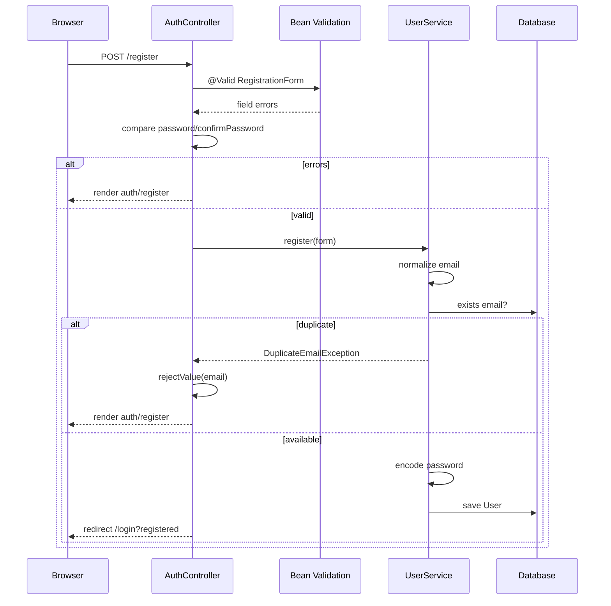
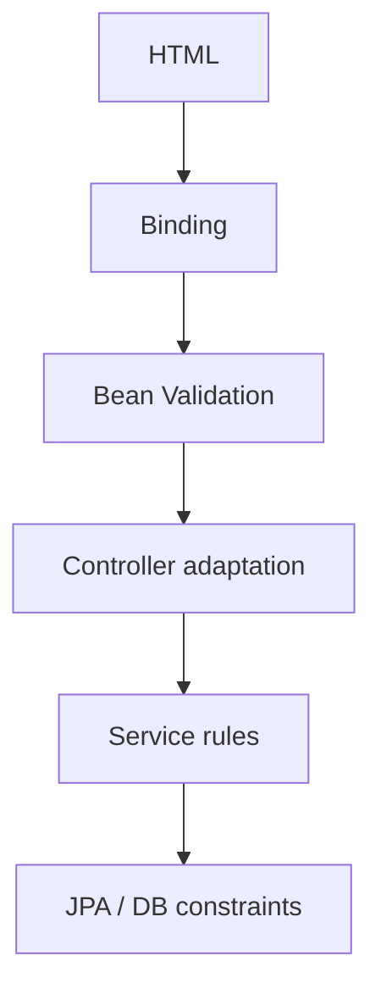
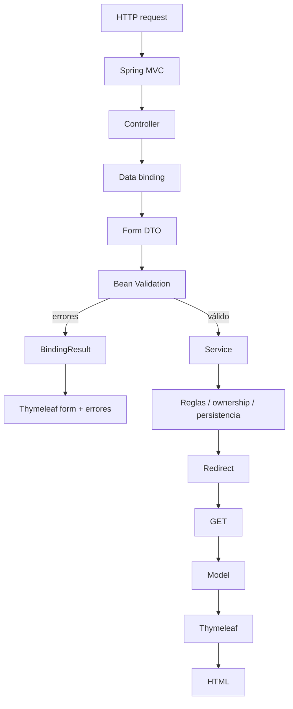

# 21 — Validación

En el capítulo anterior vimos cómo Spring MVC convierte datos HTTP en Form DTO mediante data binding.

Pero recibir un objeto Java no significa que sus datos sean válidos.

Un usuario puede enviar:

```text
name = ""
age = -4
serviceDate = ayer
email = "esto-no-es-correo"
password = "123"
```

O incluso datos que cumplen las reglas sintácticas pero violan reglas del caso de uso:

```text
confirmPassword != password
email ya registrado
petId pertenece a otro usuario
request ya no está OPEN
```

La pregunta central de este capítulo es:

> **¿Cómo valida PetMatch los datos de entrada, cómo acumula errores en `BindingResult`, cómo los muestra Thymeleaf y cómo se diferencia la validación de las reglas de negocio?**

---

# 1. Validar no es una sola cosa

En PetMatch aparecen varios niveles:

```text
HTML constraints
↓
Spring MVC data binding
↓
Bean Validation
↓
BindingResult
↓
reglas manuales de Controller
↓
reglas de Service
↓
constraints de base de datos
```

Cada nivel protege algo distinto.

---

# 2. Bean Validation

PetMatch usa Jakarta Bean Validation mediante anotaciones como:

```text
@NotBlank
@NotNull
@Size
@Min
@Email
@Future
```

Estas anotaciones describen restricciones declarativas sobre propiedades de objetos de entrada.

Ejemplo real en `PetForm`:

```java
@NotBlank(message = "El nombre es obligatorio")
@Size(max = 100, message = "El nombre no puede superar los 100 caracteres")
private String name;
```

---

# 3. `@Valid`

El Controller activa la validación declarativa mediante:

```java
@Valid PetForm petForm
```

O:

```java
@Valid
@ModelAttribute("registrationForm")
RegistrationForm form
```

Conceptualmente:

```text
bind request → object
↓
validate object
↓
collect errors
```

---

# 4. `BindingResult`

Después del parámetro validado aparece:

```java
BindingResult bindingResult
```

Este objeto contiene los errores producidos durante:

```text
binding
+
validation
+
errores añadidos manualmente
```

El Controller puede consultar:

```java
bindingResult.hasErrors()
```

---

# 5. El orden del parámetro importa conceptualmente

En PetMatch se usa:

```java
@Valid PetForm petForm,
BindingResult bindingResult
```

Esto permite que el Controller examine el resultado asociado al objeto validado.

La idea pedagógica útil es:

```text
objeto validado
→ resultado de binding/validation inmediatamente disponible
```

---

# 6. `PetForm`: restricciones reales

Código real:

```java
@NotBlank(message = "El nombre es obligatorio")
@Size(max = 100, message = "El nombre no puede superar los 100 caracteres")
private String name;

@NotBlank(message = "La especie es obligatoria")
@Size(max = 80, message = "La especie no puede superar los 80 caracteres")
private String species;

@NotNull(message = "La edad es obligatoria")
@Min(value = 0, message = "La edad no puede ser negativa")
private Integer age;

@Size(max = 1000, message = "La descripción no puede superar los 1000 caracteres")
private String description;
```

---

# 7. `@NotBlank` vs `@NotNull`

No significan lo mismo.

## `@NotNull`

Impide:

```text
null
```

pero no necesariamente una cadena vacía.

## `@NotBlank`

Se aplica a texto y exige contenido no blanco significativo.

Por eso PetMatch usa:

```text
name → @NotBlank
species → @NotBlank
```

Y:

```text
age → @NotNull
```

---

# 8. `@Size`

Ejemplo:

```java
@Size(max = 100)
private String name;
```

Limita la longitud del valor.

Esto protege el contrato de entrada antes de llegar al Service.

No debe confundirse con:

```java
@Column(length = 100)
```

de la Entity.

Son capas diferentes.

---

# 9. `@Min`

`PetForm.age` usa:

```java
@Min(value = 0, message = "La edad no puede ser negativa")
```

Así un valor como:

```text
-2
```

produce error de validación.

---

# 10. `SupportRequestForm`: validación temporal

Código real:

```java
@NotNull(message = "La fecha del servicio es obligatoria")
@Future(message = "La fecha del servicio debe estar en el futuro")
@DateTimeFormat(pattern = "yyyy-MM-dd'T'HH:mm")
private LocalDateTime serviceDate;
```

Aquí aparecen dos responsabilidades distintas:

```text
@DateTimeFormat
→ conversión/formato

@Future
→ restricción semántica de entrada
```

---

# 11. `@Future`

La fecha debe ser posterior al momento actual.

Si el usuario intenta crear una solicitud para una fecha pasada, Bean Validation puede impedir que el Controller llame al Service.

Pero el Service también protege reglas temporales en otros casos, por ejemplo al postularse.

---

# 12. Validación duplicada aparente vs defensa por capas

Puede parecer redundante tener:

```text
@Future en SupportRequestForm
```

y además reglas de fecha en Services.

Pero no son exactamente el mismo caso.

El DTO protege la entrada del formulario de creación/edición.

El Service protege el comportamiento del dominio en operaciones posteriores y frente a otros clientes.

---

# 13. `RegistrationForm`

Restricciones reales:

```java
@NotBlank(message = "El nombre es obligatorio")
@Size(max = 100, message = "El nombre no puede superar los 100 caracteres")
private String name;

@NotBlank(message = "El correo es obligatorio")
@Email(message = "Ingresa un correo válido")
@Size(max = 150, message = "El correo no puede superar los 150 caracteres")
private String email;

@NotBlank(message = "La contraseña es obligatoria")
@Size(min = 8, max = 72,
      message = "La contraseña debe tener entre 8 y 72 caracteres")
private String password;

@NotBlank(message = "Confirma la contraseña")
private String confirmPassword;
```

---

# 14. `@Email`

`@Email` verifica que el texto tenga una estructura compatible con email según la implementación de Bean Validation.

No comprueba:

```text
que el correo realmente exista
que pertenezca al usuario
que no esté registrado
```

Esas son preguntas distintas.

---

# 15. Validación de formato vs unicidad

En registro:

```text
@Email
→ formato
```

Mientras:

```text
UserService.register(...)
→ existsByEmailIgnoreCase
```

protege duplicidad a nivel de aplicación.

Y la base de datos mantiene:

```text
UNIQUE users.email
```

Tres mecanismos, tres capas.

---

# 16. Confirmación de contraseña no se expresa con una anotación actual

PetMatch compara manualmente:

```java
if (!form.getPassword().equals(form.getConfirmPassword())) {
    bindingResult.rejectValue(
        "confirmPassword",
        "password.mismatch",
        "Las contraseñas no coinciden"
    );
}
```

Esta es una validación **cross-field**:

```text
password
vs
confirmPassword
```

El constraint depende de dos campos.

---

# 17. `rejectValue(...)`

Firma conceptual usada:

```java
bindingResult.rejectValue(
    "confirmPassword",
    "password.mismatch",
    "Las contraseñas no coinciden"
);
```

Los argumentos representan:

```text
field
error code
mensaje por defecto
```

El error queda asociado específicamente a:

```text
confirmPassword
```

---

# 18. Error de email duplicado

Después de pasar validación declarativa, `UserService.register(form)` puede lanzar:

```text
DuplicateEmailException
```

El Controller traduce esa regla a un error de campo:

```java
bindingResult.rejectValue(
    "email",
    "email.duplicate",
    "Ya existe una cuenta con este correo"
);
```

Y vuelve a:

```text
auth/register
```

---

# 19. Regla Service → error de formulario

Este patrón es importante:

```text
Service detecta regla
↓
lanza excepción de negocio
↓
Controller la adapta a UX web
↓
BindingResult recibe error
↓
Thymeleaf muestra mensaje
```

El Service no debería conocer HTML.

El Controller traduce la excepción al contrato de la interfaz MVC.

---

# 20. `BindingResult.hasErrors()`

Ejemplo real:

```java
if (bindingResult.hasErrors()) {
    return "auth/register";
}
```

En mascotas:

```java
if (bindingResult.hasErrors()) {
    model.addAttribute("editing", false);
    return "pets/form";
}
```

La idea es:

```text
si la entrada no es válida
→ no ejecutar caso de uso persistente
→ volver al formulario
```

---

# 21. No hacer redirect cuando queremos conservar errores de binding

Cuando hay errores, PetMatch normalmente devuelve directamente el template:

```java
return "pets/form";
```

No:

```java
return "redirect:/pets/new";
```

¿Por qué?

Porque queremos conservar:

```text
Form DTO
BindingResult
valores ingresados
errores
```

para renderizar la misma respuesta.

---

# 22. Render con errores vs redirect tras éxito

Patrón real:

```text
ERROR
→ render same form

SUCCESS
→ redirect
```

Ejemplo:

```text
POST /pets
  inválido → pets/form
  válido   → redirect:/pets/{id}
```

Esto combina validación con Post/Redirect/Get.

---

# 23. Thymeleaf muestra errores de campo

`pets/form.html` contiene:

```html
<p
    th:if="${#fields.hasErrors('name')}"
    th:errors="*{name}">
</p>
```

Hay dos partes:

```text
#fields.hasErrors('name')
→ pregunta si ese field tiene errores

th:errors="*{name}"
→ renderiza mensajes asociados
```

---

# 24. `#fields`

`#fields` es un objeto de utilidad de Thymeleaf/Spring integration para consultar errores del formulario actual.

No es una variable creada manualmente por el Controller.

Está vinculada al binding/validation result disponible para el objeto del formulario.

---

# 25. `th:errors`

Si el campo `name` viola:

```java
@NotBlank(message = "El nombre es obligatorio")
```

Thymeleaf puede mostrar:

```text
El nombre es obligatorio
```

mediante:

```html
th:errors="*{name}"
```

---

# 26. Valores ingresados y errores juntos

`th:field` participa tanto en:

```text
render inicial
```

como en:

```text
redisplay después de error
```

Esto permite conservar el valor intentado por el usuario mientras se muestran los mensajes de validación.

---

# 27. Errores de conversión

No todos los errores provienen de anotaciones.

Supón:

```text
age=abc
```

pero el DTO declara:

```java
Integer age;
```

Spring MVC no puede convertir correctamente ese texto a `Integer`.

El binding puede registrar un error de tipo/conversión en `BindingResult`.

Por eso:

```text
BindingResult
≠
solo Bean Validation
```

---

# 28. Validación HTML no sustituye backend

El template puede incluir:

```html
maxlength="100"
min="0"
type="number"
```

Eso mejora experiencia del navegador.

Pero un cliente puede construir manualmente una petición HTTP ignorando esos atributos.

La validación autoritativa debe existir también en backend.

---

# 29. `maxlength` y `@Size`

En `pets/form.html` encontramos:

```html
maxlength="100"
```

Y en `PetForm`:

```java
@Size(max = 100)
```

Podemos leerlo como defensa complementaria:

```text
HTML
→ feedback temprano

Bean Validation
→ protección server-side
```

---

# 30. `min="0"` y `@Min(0)`

Igualmente:

```html
<input type="number" min="0">
```

y:

```java
@Min(0)
```

El atributo HTML no hace innecesaria la validación Java.

---

# 31. Validación estructural vs regla de negocio

Una distinción central:

## Validación estructural

```text
name requerido
email con formato
age >= 0
serviceDate futura
longitud máxima
```

## Regla de negocio

```text
pet pertenece al usuario
request está OPEN
usuario no puede postularse a su propia request
no duplicar postulación
solo una ACCEPTED
```

La primera encaja muy bien en DTO/Bean Validation.

La segunda pertenece principalmente al Service.

---

# 32. ¿Por qué no poner ownership como anotación simple en `petId`?

Podrías imaginar:

```text
@OwnedPet
Long petId
```

pero la regla depende de:

```text
usuario autenticado
base de datos
recurso existente
```

PetMatch la resuelve explícitamente en Service mediante:

```text
findOwnedPet(...)
```

El proyecto no define una custom validation annotation para este caso.

---

# 33. `SupportRequestController`: error de mascota inválida

Cuando `SupportRequestService.create(...)` detecta que la mascota no existe/no pertenece al usuario, el Controller captura:

```text
PetNotFoundException
```

y añade:

```java
bindingResult.rejectValue(
    "petId",
    "pet.invalid",
    "Selecciona una mascota que te pertenezca."
);
```

Luego reconstruye opciones y vuelve al formulario.

---

# 34. Adaptar una regla de dominio a un field error

Esto es valioso porque el Service solo sabe:

```text
la Pet solicitada no es válida para este usuario
```

Mientras el Controller MVC sabe que la mejor experiencia es señalar:

```text
campo petId
```

La adaptación pertenece a la interfaz.

---

# 35. Validación de `SupportApplicationForm`

Este DTO solo declara:

```java
@Size(max = 1000,
      message = "El mensaje no puede superar los 1000 caracteres")
private String message;
```

El mensaje es opcional.

Por eso no tiene:

```text
@NotBlank
```

Un valor vacío puede normalizarse a `null` en el Service.

---

# 36. Opcional no significa sin límites

`message` puede faltar, pero si existe no puede superar 1000 caracteres.

Eso muestra que:

```text
optional
≠
sin reglas
```

---

# 37. `SupportApplicationRuleException`

Después de Bean Validation, `apply(...)` puede fallar porque:

```text
request no está OPEN
fecha ya pasó
self-apply
postulación duplicada
```

El Controller captura:

```text
SupportApplicationRuleException
```

y usa:

```java
bindingResult.reject(
    "application.rule",
    exception.getMessage()
);
```

---

# 38. `reject(...)` vs `rejectValue(...)`

## `rejectValue(...)`

Asocia error a un field específico:

```text
email
confirmPassword
petId
```

## `reject(...)`

Agrega un error global del objeto/formulario.

Una regla como:

```text
No puedes postularte a tu propia solicitud
```

no corresponde necesariamente a un único campo `message`.

Por eso tiene sentido como error global.

---

# 39. Errores globales

Un error global representa:

```text
el objeto/caso de uso completo es inválido
```

más que:

```text
este field individual tiene un valor inválido
```

El template debe decidir cómo mostrar esos errores globales si los necesita.

PetMatch usa `bindingResult.reject(...)` en el flujo de postulación.

---

# 40. Validation messages están en código

Los mensajes actuales aparecen directamente en las anotaciones:

```java
@NotBlank(message = "El nombre es obligatorio")
```

El proyecto no incorpora un sistema externo de mensajes/i18n específico para estas constraints.

Los message bundles no forman parte de la implementación actual.

---

# 41. ¿Bean Validation normaliza strings?

No.

`@NotBlank` puede validar contenido, pero el Service sigue haciendo operaciones como:

```text
trim()
lowercase email
vacío opcional → null
```

Validar y normalizar son responsabilidades distintas.

---

# 42. `@Valid` no ejecuta reglas del Service

Cuando Spring procesa:

```java
@Valid SupportRequestForm form
```

no sabe automáticamente:

```text
si petId pertenece al current user
si request puede editarse
```

Eso requiere lógica de aplicación.

---

# 43. `BindingResult` no reemplaza excepciones de dominio

El Service es compartido por:

```text
MVC
REST
posibles llamadas internas
```

Por eso no debería recibir un `BindingResult` de MVC para reportar reglas.

Patrón actual:

```text
Service → excepción
Controller MVC → BindingResult
REST Controller/Advice → HTTP error
```

Cada interfaz adapta el mismo dominio de forma diferente.

---

# 44. Validación y API REST

Los DTO REST también usan Bean Validation.

Eso demuestra que:

```text
Bean Validation
```

no pertenece exclusivamente a Thymeleaf.

Es una herramienta para validar contratos de entrada Java.

El bloque REST estudiará su tratamiento JSON/HTTP.

---

# 45. ¿Dónde termina la validación?

No existe un único punto final.

Una entrada puede superar:

```text
binding
Bean Validation
```

y aun así fallar en:

```text
Service rule
DB constraint
```

Diseñar bien implica saber qué garantía pertenece a cada capa.

---

# 46. Ejemplo completo: registro



---

# 47. Ejemplo completo: solicitud de apoyo

```text
POST form
↓
bind SupportRequestForm
↓
@NotBlank / @NotNull / @Future / @Size
↓
BindingResult
↓
si error → rebuild pets/supportTypes → render
↓
si válido → Service.create
↓
findOwnedPet(petId)
↓
si inválida → PetNotFoundException
↓
Controller rejectValue("petId")
↓
render
↓
si todo válido → persist → redirect
```

Este flujo muestra la diferencia entre validación estructural y ownership.

---

# 48. Validación y seguridad

Validación responde:

```text
¿el dato tiene forma/valor aceptable?
```

Seguridad/autorización responde:

```text
¿este usuario puede ejecutar esta acción sobre este recurso?
```

Un dato puede ser perfectamente válido y aun así estar prohibido.

Ejemplo:

```text
petId=42
```

puede ser un `Long` válido pero pertenecer a otra persona.

---

# 49. Validación y base de datos

La Entity/base también contienen restricciones.

Ejemplo:

```text
email UNIQUE
```

Y columnas `nullable=false`.

Bean Validation permite dar errores tempranos y amigables.

La DB sigue siendo la última barrera de integridad estructural frente a carreras o caminos alternativos.

---

# 50. Defensa por capas

Una forma de pensar PetMatch:



No todas las reglas aparecen en todos los niveles.

La clave es colocar cada una donde tenga sentido.

---

# 51. ⚠️ Errores frecuentes

## Error 1 — Confiar solo en `required`, `maxlength` o `min` del HTML

El cliente puede omitirlos o construir requests manuales.

## Error 2 — Pensar que `@Valid` valida ownership

No conoce automáticamente al usuario ni las reglas del Service.

## Error 3 — Poner toda regla de negocio como annotation del DTO

Puede acoplar validación a persistencia/autenticación innecesariamente.

## Error 4 — Hacer redirect cuando hay errores y perder BindingResult

PetMatch vuelve a renderizar el template en esos caminos.

## Error 5 — Olvidar reconstruir datos auxiliares del formulario

Los selects pueden quedarse sin opciones.

## Error 6 — Confundir `reject` con `rejectValue`

Uno es global; el otro está asociado a un field.

## Error 7 — Pensar que `@Email` comprueba existencia real o unicidad

No.

## Error 8 — Pensar que `@NotNull` y `@NotBlank` son equivalentes

No.

## Error 9 — Enviar `BindingResult` hacia el Service

Acoplaría la lógica de negocio a Spring MVC.

## Error 10 — Creer que la DB ya no necesita constraints porque usamos Bean Validation

Bajo concurrencia y caminos alternativos la DB sigue siendo crítica.

---

# 52. 🛠 Prueba en el código

## Actividad 1 — Clasifica constraints

Construye una tabla:

```text
DTO | field | annotation | regla
```

para:

```text
PetForm
SupportRequestForm
SupportApplicationForm
RegistrationForm
```

## Actividad 2 — Sigue un error

Toma:

```text
age = -1
```

y sigue:

```text
request
→ binding
→ PetForm.age
→ @Min
→ BindingResult
→ #fields.hasErrors('age')
→ th:errors
```

## Actividad 3 — Errores manuales

Encuentra ejemplos reales de:

```text
rejectValue
reject
```

y explica por qué uno es field error y otro global.

## Actividad 4 — Duplicado de email

Dibuja las tres capas:

```text
@Email
existsByEmailIgnoreCase
UNIQUE email
```

y explica qué protege cada una.

## Actividad 5 — Ownership

Explica por qué:

```text
@NotNull petId
```

no sustituye:

```text
findOwnedPet(petId, authentication)
```

---

# 53. 🧪 Comprueba que entendiste

1. ¿Qué hace `@Valid`?
2. ¿Qué contiene `BindingResult`?
3. ¿Qué diferencia hay entre `@NotNull` y `@NotBlank`?
4. ¿Para qué sirve `@Size`?
5. ¿Qué protege `@Future`?
6. ¿Qué diferencia hay entre `@DateTimeFormat` y `@Future`?
7. ¿Qué valida `@Email` y qué no valida?
8. ¿Cómo se valida actualmente que password y confirmPassword coincidan?
9. ¿Qué hace `rejectValue(...)`?
10. ¿Qué hace `reject(...)`?
11. ¿Por qué PetMatch renderiza el mismo form en lugar de redirect cuando hay errores?
12. ¿Cómo muestra Thymeleaf un error de field?
13. ¿Qué es `#fields`?
14. ¿Bean Validation comprueba ownership?
15. ¿Por qué el Service no debe depender de `BindingResult`?
16. ¿Por qué siguen siendo importantes constraints de DB?
17. ¿Qué diferencia hay entre validación y autorización?

### Respuestas esperadas

1. Solicita validación del objeto tras binding usando Bean Validation.
2. Errores de binding, conversión, validation y errores añadidos manualmente.
3. `NotNull` impide null; `NotBlank` exige texto no blanco.
4. Limitar tamaño/longitud según tipo soportado.
5. Que una fecha/instante sea futuro.
6. Uno controla conversión/formato; el otro validez temporal.
7. Formato compatible con email; no existencia ni unicidad.
8. Comparación manual en `AuthController` + `rejectValue`.
9. Añade un error asociado a un field.
10. Añade un error global del objeto.
11. Para conservar Form DTO, valores y BindingResult en la misma respuesta.
12. `#fields.hasErrors(...)` + `th:errors`.
13. Utility object de Thymeleaf/Spring para consultar errores del form.
14. No.
15. Porque BindingResult pertenece a MVC y el Service es compartido por otras interfaces.
16. Son garantía final de integridad, especialmente bajo concurrencia/caminos alternativos.
17. Validación pregunta si el dato es aceptable; autorización si el usuario puede ejecutar la acción.

---

# 54. ✅ Qué debes recordar

- **Data binding y validation son pasos distintos.**
- PetMatch usa Jakarta Bean Validation en sus Form DTO.
- `@Valid` activa la validación declarativa en Controllers MVC.
- `BindingResult` acumula errores de binding/validation y errores manuales.
- `@NotBlank`, `@NotNull`, `@Size`, `@Min`, `@Email` y `@Future` aparecen realmente en el proyecto.
- `@DateTimeFormat` ayuda a convertir `datetime-local` a `LocalDateTime`.
- Password confirmation se valida manualmente con `rejectValue`.
- Email duplicado se detecta en Service y el Controller lo transforma en field error.
- `rejectValue` es para campos; `reject` para errores globales.
- Ante error, PetMatch renderiza el mismo form para conservar datos y mensajes.
- Thymeleaf usa `#fields.hasErrors(...)` y `th:errors`.
- Validación HTML es útil pero no suficiente.
- Bean Validation no reemplaza ownership ni reglas de estado.
- El Service no debe depender de `BindingResult`.
- Constraints de base de datos siguen siendo una defensa necesaria.
- Validación, reglas de negocio, autorización y persistencia son capas relacionadas pero distintas.

---

# Cierre del bloque 03 — Web MVC

Con los capítulos 18–21 podemos recorrer una pantalla completa:



Ahora ya deberías poder distinguir con claridad:

```text
Controller
View
Form DTO
Binding
Validation
Service rule
Entity
```

El siguiente bloque estudia otra dimensión transversal a todos esos flujos: **seguridad**.

---

# 🔗 Siguiente bloque

Continúa con:

**[Bloque 04 — Seguridad →](../04-seguridad/README.md)**

---

[← Capítulo 20 — Formularios y Form DTO](20-formularios-y-form-dto.md) · [Índice del bloque](README.md) · [Índice general](../README.md) · [Siguiente bloque → Seguridad](../04-seguridad/README.md)
