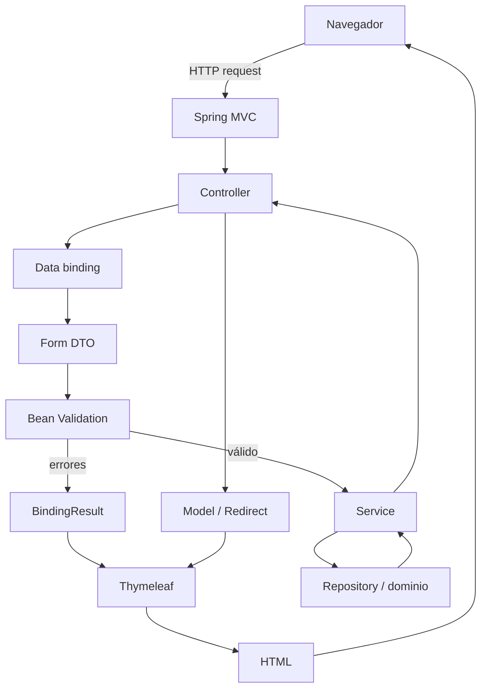

# Bloque 03 — Web MVC

En los dos primeros bloques construimos la parte interna de PetMatch Community:

```text
Spring Boot
→ arquitectura
→ dominio
→ JPA/Hibernate
→ repositories
→ Services
→ transacciones
→ estados
→ locking
→ carga de relaciones
```

Ahora cambia la perspectiva.

Ya no preguntaremos solamente:

> **¿Cómo funciona el dominio por dentro?**

Sino:

> **¿Cómo entra una petición HTTP, cómo se ejecuta un caso de uso y cómo termina convirtiéndose en una página HTML para el usuario?**

Este bloque estudia la interfaz web server-side de PetMatch mediante **Spring MVC + Thymeleaf** y completa el recorrido de formularios, data binding y validación.

---

## Estado del bloque

> [!IMPORTANT]
> **Bloque 03 completo.** Los capítulos 18–21 ya están disponibles y conectados entre sí.

---

## Qué aprenderás en este bloque

Al terminar Web MVC deberías poder explicar, usando código real del proyecto:

- qué problema resuelve Spring MVC;
- qué significa el patrón Model–View–Controller;
- qué papel cumple el `DispatcherServlet` conceptualmente;
- qué es un `@Controller`;
- cómo se combinan `@RequestMapping`, `@GetMapping` y `@PostMapping`;
- cómo se extraen valores con `@PathVariable` y `@RequestParam`;
- qué representa `Authentication` como argumento de Controller;
- para qué sirve `Model`;
- por qué devolver `"pets/list"` no devuelve literalmente ese texto al navegador;
- cómo Spring resuelve un nombre lógico hacia un template Thymeleaf;
- qué diferencia hay entre **renderizar una vista** y **hacer redirect**;
- qué son los flash attributes;
- cómo un Controller traduce determinadas excepciones a respuestas HTTP;
- qué es Thymeleaf y por qué PetMatch lo usa como motor de plantillas server-side;
- qué significan `th:text`, `th:if`, `th:unless`, `th:each`, `th:href`, `th:replace` y `th:fragment`;
- cómo funcionan las expresiones `${...}`, `*{...}` y `@{...}`;
- qué problema resuelven los fragments;
- cómo PetMatch reutiliza `head`, navegación y alertas;
- cómo una vista consume relaciones de Entities ya preparadas por Service/Repository;
- por qué la lógica visual no debe convertirse en la única protección de reglas;
- qué es un Form DTO;
- por qué PetMatch no enlaza cualquier Entity directamente al formulario;
- cómo funciona `th:object` y `th:field`;
- qué es data binding;
- cómo se usa `@ModelAttribute`;
- cómo se prellena un formulario de edición mediante `toForm(...)`;
- cómo se convierten `petId`, `SupportType`, `Integer` y `LocalDateTime` desde valores HTTP;
- qué hace Bean Validation;
- qué papel cumplen `@Valid` y `BindingResult`;
- qué diferencia hay entre errores de field y errores globales;
- cómo Thymeleaf muestra errores mediante `#fields` y `th:errors`;
- por qué validación, autorización, reglas de negocio y constraints de base de datos son capas diferentes.

---

## Prerrequisitos

Antes de este bloque deberías entender al menos:

- [arquitectura por capas](../01-fundamentos/07-arquitectura-por-capas.md);
- [inyección de dependencias](../01-fundamentos/08-inyeccion-de-dependencias.md);
- [Service y reglas de negocio](../02-dominio-y-persistencia/13-service-y-reglas-de-negocio.md);
- [transacciones](../02-dominio-y-persistencia/14-transacciones-y-consistencia.md);
- [máquinas de estado](../02-dominio-y-persistencia/15-maquinas-de-estado.md);
- [lazy loading y EntityGraph](../02-dominio-y-persistencia/17-lazy-loading-y-entitygraph.md).

No necesitas dominar previamente HTML dinámico ni Thymeleaf.

Sí ayuda conocer HTML básico:

```text
html
head
body
form
input
select
textarea
a
section
div
```

---

## Capítulos

18. [Spring MVC](18-spring-mvc.md)
19. [Thymeleaf](19-thymeleaf.md)
20. [Formularios y Form DTO](20-formularios-y-form-dto.md)
21. [Validación](21-validacion.md)

---

# El recorrido mental del bloque



La idea más importante es que MVC **no reemplaza** la arquitectura anterior.

La capa web se apoya sobre ella.

---

# Las dos interfaces de PetMatch

PetMatch tiene dos formas de exponer buena parte de la misma lógica:

```text
Web MVC + Thymeleaf
```

y:

```text
REST + JSON
```

En este bloque estudiamos la primera.

Ejemplo:

```text
PetController
        ↓
     PetService
        ↑
PetRestController
```

La interfaz cambia.

Las reglas centrales del Service no deberían duplicarse.

---

# Controllers MVC reales

En:

```text
src/main/java/com/petmatch/community/controller/
```

PetMatch contiene:

```text
AuthController
HomeController
PetController
SupportRequestController
SupportApplicationController
```

El capítulo 18 comienza con el Controller más pequeño:

```java
@Controller
public class HomeController {

    @GetMapping("/")
    public String home() {
        return "home";
    }
}
```

y avanza después a Controllers que usan:

```text
Model
Authentication
@PathVariable
@RequestParam
BindingResult
RedirectAttributes
ResponseStatusException
```

---

# Templates reales

Los HTML de Thymeleaf viven en:

```text
src/main/resources/templates/
```

Con áreas como:

```text
auth/
errors/
fragments/
pets/
support-applications/
support-requests/
home.html
```

Ejemplo:

```java
return "pets/list";
```

apunta conceptualmente a:

```text
src/main/resources/templates/pets/list.html
```

---

# Fragments compartidos

PetMatch reutiliza:

```text
templates/fragments/head.html
templates/fragments/navigation.html
templates/fragments/alerts.html
```

Ejemplo:

```html
<head th:replace="~{fragments/head :: head('Mis mascotas | PetMatch Community')}"></head>
```

Y:

```html
<nav th:replace="~{fragments/navigation :: appNavigation}"></nav>
```

---

# Thymeleaf consume el Model

En `PetController.list(...)` aparece:

```java
model.addAttribute(
    "pets",
    petService.findCurrentUserPets(authentication)
);

return "pets/list";
```

Después `pets/list.html` utiliza:

```html
<article th:each="pet : ${pets}">
    <h2 th:text="${pet.name}"></h2>
</article>
```

La relación conceptual es:

```text
model.addAttribute("pets", valor)
             ↓
          ${pets}
             ↓
       template HTML
```

---

# Formularios y Form DTO

PetMatch separa los contratos de formulario de las Entities persistentes.

DTO actuales:

```text
RegistrationForm
PetForm
SupportRequestForm
SupportApplicationForm
```

Ejemplo:

```text
Pet Entity
→ id, owner, relaciones, estado persistente

PetForm
→ name, species, age, description
```

El formulario no permite decidir libremente el `owner`; ese dato se deriva de `Authentication` en el backend.

---

# `th:object` y `th:field`

En `pets/form.html`:

```html
<form th:object="${petForm}" method="post">
    <input th:field="*{name}">
</form>
```

Esto conecta:

```text
HTML form
→ PetForm.name
→ Spring MVC data binding
```

El capítulo 20 desarrolla el flujo completo de creación y edición.

---

# Validación

Los Form DTO usan constraints reales como:

```text
@NotBlank
@NotNull
@Size
@Min
@Email
@Future
```

Y los Controllers usan:

```java
@Valid
BindingResult
```

Thymeleaf muestra errores mediante:

```html
#fields.hasErrors(...)
th:errors="*{...}"
```

Además PetMatch agrega errores manuales con:

```text
bindingResult.rejectValue(...)
bindingResult.reject(...)
```

cuando una regla no se expresa únicamente con annotations del DTO.

---

# El Controller no debería convertirse en Service

Aunque el Controller decide:

- qué endpoint atiende;
- qué parámetros recibe;
- qué vista devuelve;
- qué atributos necesita la vista;
- cómo adapta errores a la interfaz;
- si hace redirect;

las reglas siguen delegándose al Service.

Ejemplo:

```java
petService.delete(petId, authentication);
```

La regla:

```text
no eliminar una mascota con solicitudes asociadas
```

está en `PetService`, no únicamente en la plantilla ni en el Controller.

---

# Binding y validation tampoco son autorización

Un formulario puede enviar:

```text
petId=42
```

Spring puede convertirlo correctamente a `Long` y Bean Validation puede comprobar que no sea `null`.

Pero todavía falta responder:

```text
¿Pet 42 pertenece al usuario autenticado?
```

Eso lo verifica el Service mediante ownership.

```text
binding válido
+
validation válida
≠
autorización válida
```

---

# La vista tampoco es seguridad

`support-requests/detail.html` contiene condiciones como:

```html
<div th:if="${ownerView}">
```

Y muestra botones dependiendo del estado.

Eso mejora la experiencia visual.

Pero la verdadera protección sigue en backend:

```text
autenticación
ownership
estado
reglas
```

que los Services validan aunque un usuario intente construir la petición manualmente.

---

# MVC y `open-in-view=false`

El bloque anterior terminó con:

```yaml
spring:
  jpa:
    open-in-view: false
```

Una vista Thymeleaf puede leer:

```text
request.pet.name
request.owner.name
```

pero no debería depender de abrir nuevas cargas lazy durante el renderizado.

Por eso los repositories usan `@EntityGraph` para preparar relaciones antes de llegar a la vista.

---

# Archivos centrales del bloque

## Controllers

```text
src/main/java/com/petmatch/community/controller/
```

## Form DTO

```text
src/main/java/com/petmatch/community/dto/
```

## Templates

```text
src/main/resources/templates/
```

## Services

```text
src/main/java/com/petmatch/community/service/
```

## Dependencias relacionadas

En `pom.xml`:

```text
spring-boot-starter-webmvc
spring-boot-starter-thymeleaf
thymeleaf-extras-springsecurity6
spring-boot-starter-validation
```

---

# Qué NO vamos a asumir

Este bloque no presenta como parte de la implementación actual:

- React;
- Vue;
- Angular;
- frontend SPA separado;
- WebFlux;
- JSP;
- FreeMarker;
- Mustache;
- una API GraphQL;
- Tailwind compilado con Node/Vite/PostCSS.

PetMatch usa renderizado HTML en servidor con Thymeleaf y carga Tailwind mediante CDN en el fragmento `head`.

---

# Cómo estudiar este bloque

Para cada endpoint MVC:

1. identifica método HTTP y URL;
2. localiza el método del Controller;
3. identifica parámetros y Form DTO;
4. observa el binding y `@Valid`;
5. revisa `BindingResult`;
6. sigue la llamada al Service;
7. observa qué entra al `Model`;
8. localiza el template retornado;
9. busca en HTML los atributos del Model/Form DTO;
10. identifica errores, condiciones, links dinámicos y si la respuesta es render o redirect.

---

# Resultado esperado del bloque

Ahora deberías poder seguir mentalmente tanto una lectura como una escritura.

## Lectura

```text
GET /pets
↓
PetController.list
↓
PetService.findCurrentUserPets
↓
model["pets"]
↓
return "pets/list"
↓
Thymeleaf
↓
HTML
```

## Escritura

```text
POST /pets
↓
data binding
↓
PetForm
↓
@Valid
↓
BindingResult
↓
si error → render pets/form
↓
si válido → PetService.create
↓
persistencia
↓
redirect:/pets/{id}
```

Ese recorrido completa la base necesaria para estudiar seguridad.

---

# Comienza aquí

**[Capítulo 18 — Spring MVC →](18-spring-mvc.md)**

Y después continúa en orden hasta:

**[Capítulo 21 — Validación](21-validacion.md)**

---

# Siguiente bloque

**[Bloque 04 — Seguridad →](../04-seguridad/README.md)**

---

[← Bloque 02 — Dominio y persistencia](../02-dominio-y-persistencia/README.md) · [Índice general](../README.md) · [Siguiente bloque → Seguridad](../04-seguridad/README.md)
