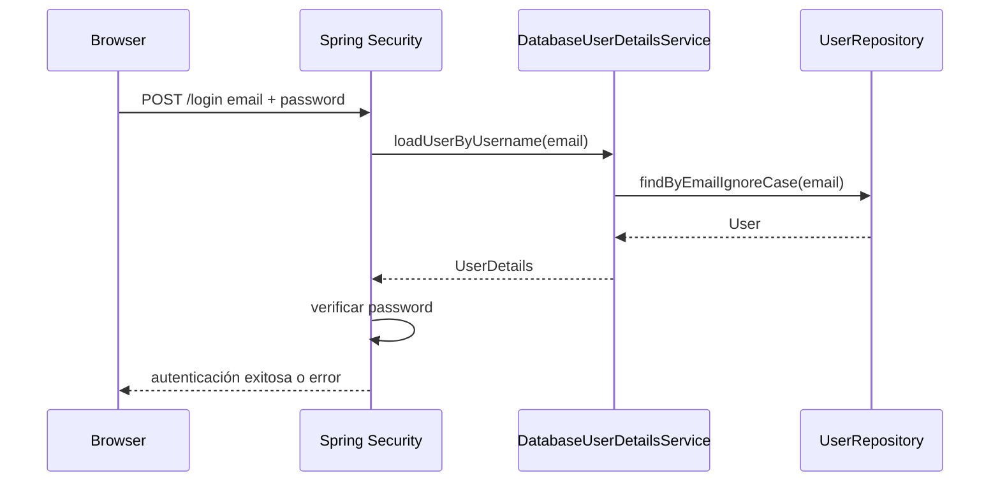
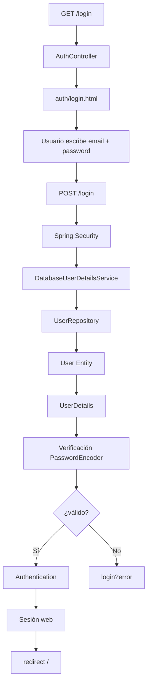
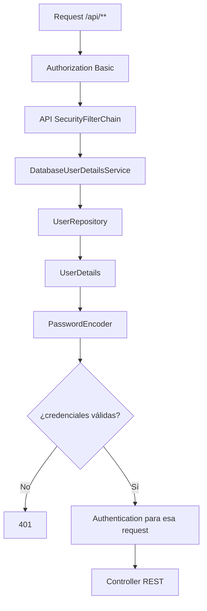

# 22 — Autenticación

Hasta ahora hemos usado muchas veces un parámetro como:

```java
Authentication authentication
```

Los Services de PetMatch lo utilizan para saber quién está ejecutando una operación.

Pero todavía no hemos explicado de dónde sale.

La pregunta central de este capítulo es:

> **¿Cómo pasa PetMatch de recibir un email y una contraseña a tener un usuario autenticado que Spring puede representar mediante `Authentication`?**

Antes de entrar en filtros y configuración avanzada, necesitamos separar conceptos que suelen confundirse cuando se aprende seguridad por primera vez.

---

# 1. Identificación, autenticación y autorización

Estas tres preguntas son diferentes.

## Identificación

> ¿Quién dices ser?

En PetMatch el usuario escribe un email:

```text
ana@example.com
```

## Autenticación

> ¿Puedes demostrar que realmente eres esa cuenta?

El usuario presenta:

```text
email
+
contraseña
```

Spring Security verifica las credenciales contra los datos registrados.

## Autorización

> Una vez sabemos quién eres, ¿puedes realizar esta acción?

Ejemplos:

```text
¿puede abrir una ruta autenticada?
¿tiene ROLE_ADMIN?
¿esa mascota le pertenece?
¿esa solicitud es suya?
```

La autorización se profundizará en el capítulo 25.

---

# 2. Registro no es autenticación

Un error frecuente es pensar:

```text
registrarse = iniciar sesión
```

En PetMatch son procesos distintos.

## Registro

```text
POST /register
↓
AuthController
↓
RegistrationForm
↓
UserService.register(...)
↓
User persistido
```

## Login

```text
POST /login
↓
Spring Security
↓
DatabaseUserDetailsService
↓
UserRepository
↓
verificación de credenciales
↓
Authentication
```

El `AuthController` **no contiene un método `@PostMapping("/login")`**.

Eso es importante.

---

# 3. `AuthController` solo sirve la página de login

Código real:

```java
@GetMapping("/login")
public String login() {
    return "auth/login";
}
```

Ruta:

```text
src/main/java/com/petmatch/community/controller/AuthController.java
```

Este método hace solamente:

```text
GET /login
→ render auth/login.html
```

No compara contraseñas.

No consulta directamente `UserRepository`.

No crea manualmente una sesión.

---

# 4. El formulario real de login

`templates/auth/login.html` contiene:

```html
<form th:action="@{/login}" method="post">
```

Y los campos:

```html
<input
    id="email"
    name="email"
    type="email">

<input
    id="password"
    name="password"
    type="password">
```

Observa una diferencia frente a los formularios del capítulo 20:

```text
no usa th:object
no usa RegistrationForm
no llega a un @PostMapping propio
```

Spring Security intercepta el POST de autenticación.

---

# 5. ¿Por qué el campo se llama `email`?

La configuración web contiene:

```java
.formLogin(form -> form
    .loginPage("/login")
    .usernameParameter("email")
    .defaultSuccessUrl("/", true)
    .permitAll()
)
```

Spring Security usa históricamente el concepto genérico de **username** como identificador principal.

PetMatch decide que ese identificador será el email.

Por eso configura:

```java
.usernameParameter("email")
```

Y el formulario debe enviar:

```html
name="email"
```

---

# 6. El nombre del parámetro debe coincidir

Si la configuración dice:

```text
usernameParameter = email
```

pero el formulario enviara:

```html
name="username"
```

la autenticación no recibiría el identificador donde la configuración espera encontrarlo.

Este es un contrato entre:

```text
SecurityConfig
↔
login.html
```

---

# 7. ¿Quién procesa `POST /login`?

No hay un Controller propio para ese POST.

La petición entra en la infraestructura de Spring Security.

Modelo mental simplificado:



Es una simplificación pedagógica del pipeline interno, no una lista exhaustiva de filtros/clases internas.

---

# 8. `UserDetailsService`

PetMatch implementa:

```java
public class DatabaseUserDetailsService
    implements UserDetailsService
```

Ruta:

```text
src/main/java/com/petmatch/community/security/DatabaseUserDetailsService.java
```

Su responsabilidad principal es responder:

> Dado el identificador de login, ¿qué usuario de seguridad corresponde?

---

# 9. `loadUserByUsername(...)`

Método real:

```java
@Override
public UserDetails loadUserByUsername(String username)
    throws UsernameNotFoundException {

    User user = userRepository.findByEmailIgnoreCase(username)
        .orElseThrow(() ->
            new UsernameNotFoundException("User not found")
        );

    ...
}
```

Aunque el parámetro se llama:

```text
username
```

el valor real en PetMatch es:

```text
email
```

porque así se configuró el login.

---

# 10. `UserRepository` participa en autenticación

Repository real:

```java
Optional<User> findByEmailIgnoreCase(String email);
```

El flujo es:

```text
email del login
↓
DatabaseUserDetailsService
↓
findByEmailIgnoreCase(email)
↓
User Entity
```

Si no existe:

```java
throw new UsernameNotFoundException("User not found");
```

Spring Security interpreta ese fallo dentro del proceso de autenticación.

---

# 11. Entity `User` no es `UserDetails`

PetMatch tiene una Entity propia:

```java
com.petmatch.community.model.User
```

Spring Security trabaja con el contrato:

```java
org.springframework.security.core.userdetails.UserDetails
```

Son objetos con responsabilidades diferentes.

## `User`

Representa estado persistente del dominio:

```text
id
name
email
passwordHash
role
active
registeredAt
relaciones
```

## `UserDetails`

Representa los datos que el mecanismo de seguridad necesita para autenticar y autorizar.

---

# 12. El adaptador entre ambos modelos

Código real:

```java
return org.springframework.security.core.userdetails.User
    .withUsername(user.getEmail())
    .password(user.getPasswordHash())
    .roles(user.getRole().name())
    .disabled(!user.isActive())
    .build();
```

Mapa:

```text
User.email
→ UserDetails.username

User.passwordHash
→ UserDetails.password

User.role
→ authorities/roles

User.active
→ disabled(!active)
```

`DatabaseUserDetailsService` actúa como puente entre dominio y seguridad.

---

# 13. ¿Por qué no hacer que `User` implemente `UserDetails`?

Esa sería una alternativa posible en otros proyectos.

PetMatch no lo hace.

Ventaja del diseño actual:

```text
Entity del dominio
≠
contrato de Spring Security
```

Esto reduce acoplamiento directo entre el modelo persistente y una API específica de seguridad.

No significa que la alternativa sea siempre incorrecta; simplemente no es la decisión actual de PetMatch.

---

# 14. El campo `active`

La Entity `User` tiene:

```java
@Column(nullable = false)
private boolean active;
```

Y en `@PrePersist`:

```java
active = true;
```

Un usuario nuevo comienza activo.

Después el adaptador hace:

```java
.disabled(!user.isActive())
```

Por tanto:

```text
active = true
→ disabled = false

active = false
→ disabled = true
```

---

# 15. `active` sí influye en autenticación

El campo no es solamente informativo.

Forma parte del `UserDetails` construido para Spring Security.

Eso significa que el estado de la cuenta puede impedir una autenticación válida aunque el email y la contraseña correspondan.

> [!IMPORTANT]
> El proyecto contiene el campo y su mapeo a `disabled`, pero no incluye una pantalla administrativa para desactivar usuarios.

---

# 16. El rol también se carga al autenticar

La Entity tiene:

```java
private Role role;
```

Enum real:

```java
public enum Role {
    USER,
    ADMIN
}
```

Y `DatabaseUserDetailsService` usa:

```java
.roles(user.getRole().name())
```

Spring Security puede utilizar después esa información para autorización.

La diferencia entre:

```text
ROLE_USER
ROLE_ADMIN
```

y ownership se estudiará en el capítulo 25.

---

# 17. Rol inicial de un usuario nuevo

`User.initializeDefaults()` contiene:

```java
if (role == null) {
    role = Role.USER;
}
```

Por tanto el registro normal crea usuarios con:

```text
Role.USER
```

si no se asignó otro valor antes de persistir.

No hay un campo de registro que permita escoger `ADMIN`.

Esto es correcto desde el punto de vista de seguridad: el cliente público no debería poder elevar su propio rol mediante el formulario.

---

# 18. Autenticación exitosa

Cuando las credenciales son válidas, Spring Security puede construir un estado autenticado representado durante la petición mediante conceptos como:

```text
SecurityContext
Authentication
principal
authorities
```

Para trabajar con el código de PetMatch basta inicialmente con este modelo:

```text
credenciales válidas
↓
Spring Security reconoce la identidad
↓
Authentication disponible
```

El capítulo 23 profundizará la filter chain que hace posible este flujo.

---

# 19. `Authentication` en Controllers

Después de iniciar sesión, Controllers de PetMatch reciben:

```java
Authentication authentication
```

Por ejemplo:

```java
public String list(
    Authentication authentication,
    Model model
)
```

Spring MVC puede proporcionar el objeto asociado al contexto de seguridad de la petición.

El Controller no necesita buscar una cookie manualmente ni parsear la sesión por su cuenta.

---

# 20. `authentication.getName()`

`UserService.getCurrentUser(...)` hace:

```java
return findByEmail(authentication.getName());
```

¿Por qué funciona?

Porque el `UserDetails` fue construido con:

```java
.withUsername(user.getEmail())
```

Así:

```text
authentication.getName()
→ email
```

para el diseño actual de PetMatch.

---

# 21. De `Authentication` de vuelta a la Entity

Flujo real:

```text
Authentication
↓
getName() = email
↓
UserService.findByEmail(email)
↓
UserRepository.findByEmailIgnoreCase(email)
↓
User Entity
```

Esto es necesario porque Services de dominio necesitan atributos como:

```text
user.id
```

para ownership y consultas.

---

# 22. ¿Por qué no guardar simplemente el `User` entero en Controllers?

El contexto de seguridad trabaja con una representación de principal/autenticación.

La capa de dominio necesita su propia Entity.

PetMatch mantiene una conversión clara:

```text
security identity
→ email
→ UserService
→ domain User
```

Eso evita que cada Controller repita consultas directas al `UserRepository`.

---

# 23. Validación inicial de `Authentication`

`UserService.getCurrentUser(...)` verifica:

```java
if (authentication == null
    || !authentication.isAuthenticated()) {
    throw new UsernameNotFoundException(
        "No authenticated user"
    );
}
```

Esto expresa una precondición defensiva:

```text
el caso de uso necesita identidad autenticada
```

Aunque la filter chain ya protege muchas rutas, el Service no asume ciegamente que siempre recibió un objeto válido.

---

# 24. Login exitoso: destino

La configuración dice:

```java
.defaultSuccessUrl("/", true)
```

Después de autenticarse correctamente, el flujo web dirige al usuario a:

```text
/
```

El segundo argumento `true` indica que ese destino se fuerza como URL de éxito configurada.

---

# 25. Login fallido en la vista

`login.html` contiene:

```html
<p th:if="${param.error}">
    Correo o contraseña incorrectos.
</p>
```

La plantilla no recibe un `BindingResult` propio para el login.

En cambio observa parámetros del flujo de Spring Security.

Esto confirma nuevamente que el POST `/login` no es un formulario MVC manejado como `RegistrationForm`.

---

# 26. Mensaje después de registro

El registro exitoso devuelve:

```java
return "redirect:/login?registered";
```

Y `login.html` usa:

```html
<p th:if="${param.registered}">
    Tu cuenta fue creada correctamente.
</p>
```

Así:

```text
crear cuenta
→ redirect login
→ mostrar confirmación
→ usuario decide iniciar sesión
```

PetMatch no realiza auto-login después del registro.

---

# 27. Logout y autenticación

La configuración contiene:

```java
.logout(logout -> logout
    .logoutSuccessUrl("/?logout")
)
```

Y la navegación usa un formulario POST a:

```text
/logout
```

Después del logout exitoso el usuario vuelve a:

```text
/?logout
```

La página de login, por su parte, también tiene soporte visual para `param.logout` si se llega con ese parámetro.

El funcionamiento de sesión y CSRF alrededor del logout se estudiará en el capítulo 26.

---

# 28. Autenticación web vs autenticación API

PetMatch tiene dos interfaces.

## Web

```text
form login
→ sesión
→ Authentication disponible en peticiones posteriores
```

## API

```text
HTTP Basic
→ credenciales en la petición
→ autenticación stateless
```

Ambas pueden utilizar el mismo origen de usuarios de base de datos mediante Spring Security.

---

# 29. HTTP Basic también autentica contra usuarios reales

La API se configura con:

```java
.httpBasic(Customizer.withDefaults())
```

Y las pruebas usan:

```java
.with(httpBasic(email, password))
```

El test registra primero un usuario mediante:

```java
userService.register(form);
```

Después esa misma cuenta puede autenticarse contra `/api/v1/pets`.

Esto conecta registro, password encoder y seguridad API.

---

# 30. Evidencia en pruebas de integración

`RestApiIntegrationTests` comprueba:

```java
mockMvc.perform(get("/api/v1/pets"))
    .andExpect(status().isUnauthorized());
```

Y luego:

```java
mockMvc.perform(
    get("/api/v1/pets")
        .with(httpBasic(email, password))
)
.andExpect(status().isOk());
```

El resultado esperado es:

```text
sin autenticación → 401
con credenciales válidas → 200
```

---

# 31. `401 Unauthorized` y el nombre confuso

HTTP utiliza el status:

```text
401 Unauthorized
```

principalmente cuando falta autenticación válida.

Aunque el nombre diga “Unauthorized”, pedagógicamente conviene distinguir:

```text
401
→ no autenticado / credenciales inválidas

403
→ autenticado pero sin permiso
```

Los detalles de autorización aparecerán después.

---

# 32. Autenticación no implica ownership

Después de login sabemos:

```text
este usuario es ana@example.com
```

Pero todavía no sabemos si puede modificar:

```text
Pet id 42
```

Para eso el Service usa ownership:

```text
findByIdAndOwnerId(...)
```

Por tanto:

```text
autenticado
≠
autorizado sobre cualquier recurso
```

---

# 33. Autenticación no implica rol ADMIN

Un usuario nuevo obtiene por defecto:

```text
USER
```

La autenticación solo confirma su identidad y carga sus authorities.

Que exista:

```text
ADMIN
```

no convierte a todos los autenticados en administradores.

---

# 34. ¿PetMatch usa JWT para autenticarse?

No.

La implementación actual usa:

```text
Web → form login + sesión
API → HTTP Basic + stateless
```

La implementación actual no incluye:

```text
JWT filter
JWT provider
Bearer token flow
refresh tokens
OAuth2 login
```

No debemos agregar esos conceptos al flujo actual.

---

# 35. ¿PetMatch usa OAuth2 o login social?

No.

La cuenta se autentica contra usuarios almacenados por la propia aplicación.

El origen actual es:

```text
UserRepository
→ base de datos
```

No Google, GitHub, Facebook, LDAP u otro identity provider.

---

# 36. Qué ocurre con la contraseña

`DatabaseUserDetailsService` entrega a Spring Security:

```java
.password(user.getPasswordHash())
```

Nunca necesita recuperar la contraseña original.

Durante registro se almacena una representación codificada mediante `PasswordEncoder`.

El capítulo 24 explicará por qué la verificación se realiza comparando de forma segura contra el hash, no “desencriptando” la contraseña.

---

# 37. Modelo completo del login web



---

# 38. Modelo del login API



La API no conserva una sesión de autenticación para reutilizarla en la siguiente petición.

---

# 39. ⚠️ Errores frecuentes

## Error 1 — Crear un `@PostMapping("/login")` y comparar passwords manualmente

PetMatch delega el login a Spring Security.

## Error 2 — Confundir registro con login

El registro crea la cuenta; la autenticación verifica credenciales de una cuenta existente.

## Error 3 — Pensar que `loadUserByUsername` obliga a usar un username distinto del email

El identificador puede ser email; PetMatch lo configura así.

## Error 4 — Usar `User` Entity como si fuera automáticamente `UserDetails`

PetMatch usa un adaptador explícito.

## Error 5 — Ignorar `active`

Se mapea a `disabled(!active)`.

## Error 6 — Permitir elegir `ADMIN` durante registro público

El formulario actual no lo permite y el default es `USER`.

## Error 7 — Creer que autenticación concede acceso a cualquier Entity

Ownership sigue siendo necesario.

## Error 8 — Decir que la API usa JWT

Usa HTTP Basic stateless.

## Error 9 — Guardar/reconstruir manualmente la sesión desde Controller

Spring Security gestiona el contexto de autenticación web.

## Error 10 — Confundir 401 y 403

401 está asociado principalmente a falta/fallo de autenticación; 403 a acceso prohibido para una identidad ya autenticada.

---

# 40. 🛠 Prueba en el código

## Actividad 1 — Sigue el email

Traza:

```text
login.html name="email"
↓
usernameParameter("email")
↓
loadUserByUsername(username)
↓
findByEmailIgnoreCase(username)
↓
User.email
↓
UserDetails.username
↓
Authentication.getName()
```

## Actividad 2 — Compara registro y login

Haz una tabla con:

```text
ruta
quién procesa
DTO
Repository
PasswordEncoder
resultado
```

para:

```text
POST /register
POST /login
```

## Actividad 3 — Entity vs UserDetails

Relaciona:

```text
email
passwordHash
role
active
```

con el builder de `UserDetails`.

## Actividad 4 — Usuario inactivo

Explica qué produce:

```java
.disabled(!user.isActive())
```

para `active=true` y `active=false`.

## Actividad 5 — Prueba API

Lee `RestApiIntegrationTests.webAndApiSecurityCoexist` y explica por qué cada uno de estos resultados es distinto:

```text
GET /
GET /api/v1/pets sin Basic
GET /api/v1/pets con Basic
```

---

# 41. 🧪 Comprueba que entendiste

1. ¿Qué diferencia hay entre identificación, autenticación y autorización?
2. ¿Registro y login son el mismo proceso?
3. ¿Qué Controller sirve GET `/login`?
4. ¿Existe un `@PostMapping("/login")` propio en PetMatch?
5. ¿Quién procesa el POST de login?
6. ¿Por qué el campo principal se llama `email`?
7. ¿Qué hace `DatabaseUserDetailsService`?
8. ¿Qué Repository method utiliza para buscar la cuenta?
9. ¿`User` y `UserDetails` son el mismo tipo?
10. ¿Cómo se mapea `active`?
11. ¿Qué role obtiene una cuenta nueva por defecto?
12. ¿Qué devuelve conceptualmente una autenticación exitosa a las siguientes capas?
13. ¿Qué valor representa `authentication.getName()` en PetMatch?
14. ¿Por qué el Service vuelve a buscar la Entity `User`?
15. ¿Qué usa la API para autenticarse?
16. ¿PetMatch usa JWT?
17. ¿Autenticarse permite editar cualquier mascota?

### Respuestas esperadas

1. Identidad declarada, verificación de identidad y decisión de permisos respectivamente.
2. No.
3. `AuthController`.
4. No.
5. Spring Security.
6. Porque `usernameParameter("email")` define el identificador del form login.
7. Carga el `User` persistente y lo adapta a `UserDetails`.
8. `findByEmailIgnoreCase`.
9. No.
10. `disabled(!active)`.
11. `USER`.
12. Una identidad autenticada representada por el contexto/`Authentication`.
13. El email.
14. Para trabajar con la Entity del dominio, especialmente su id/ownership.
15. HTTP Basic en una cadena stateless.
16. No.
17. No; ownership sigue siendo necesario.

---

# 42. ✅ Qué debes recordar

- **Autenticar significa comprobar identidad; no decidir todos los permisos.**
- PetMatch identifica usuarios mediante email.
- `AuthController` sirve la página de login pero no procesa manualmente las credenciales.
- Spring Security procesa `POST /login`.
- `usernameParameter("email")` conecta la configuración con `name="email"` del formulario.
- `DatabaseUserDetailsService` implementa `UserDetailsService`.
- `findByEmailIgnoreCase` carga la cuenta desde la base.
- `User` Entity y `UserDetails` son modelos distintos.
- El adaptador mapea email, passwordHash, role y active.
- Un usuario nuevo comienza con `Role.USER` y `active=true`.
- `active=false` se transforma en usuario disabled para Spring Security.
- Una autenticación web exitosa se conserva mediante sesión.
- `Authentication.getName()` representa el email en PetMatch.
- La API utiliza HTTP Basic y es stateless.
- Las pruebas comprueban 401 sin Basic y 200 con credenciales válidas.
- PetMatch no usa JWT, OAuth2 ni login social.
- Autenticación no reemplaza autorización ni ownership.

---

# 🔗 Continúa con

Ahora sabemos **qué identidad autentica PetMatch y cómo se carga desde la base de datos**.

El siguiente paso es entender la infraestructura que decide:

```text
qué requests pasan por qué cadena
qué rutas son públicas
qué rutas requieren login
por qué /api/** usa otra política
cómo intervienen los filtros antes del Controller
```

Continúa con:

**[Capítulo 23 — Spring Security →](23-spring-security.md)**

---

[← Bloque 03 — Web MVC](../03-web-mvc/README.md) · [Índice del bloque](README.md) · [Índice general](../README.md) · [Siguiente → Capítulo 23](23-spring-security.md)
