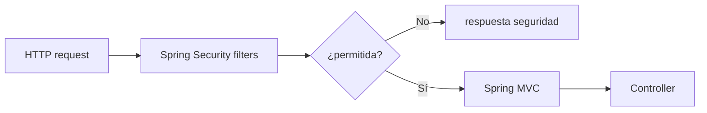
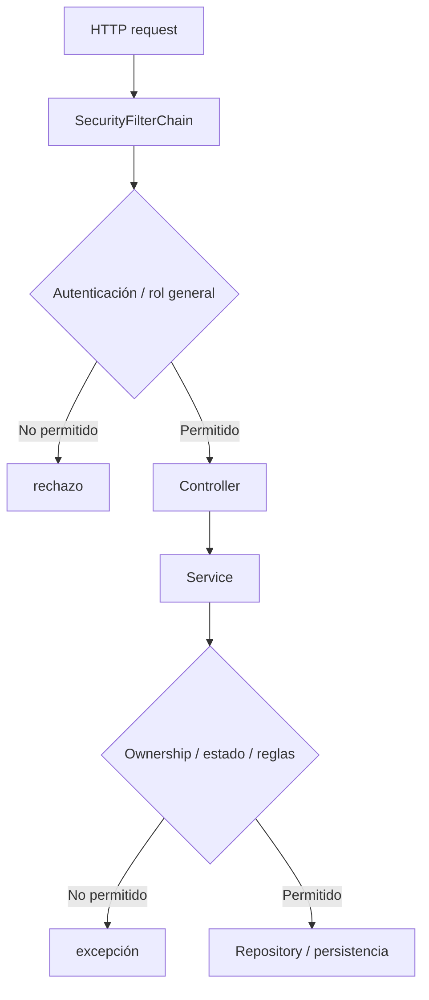

# 23 — Spring Security

En el capítulo anterior seguimos el login hasta `Authentication`.

Ahora aparece una pregunta más amplia:

> **¿Cómo decide Spring Security qué política aplicar a cada petición antes de que llegue a un Controller?**

PetMatch tiene una característica especialmente útil para aprender este tema:

```text
no usa una sola política de seguridad
```

Tiene dos interfaces con necesidades diferentes:

```text
Web MVC
API REST
```

Y configura dos `SecurityFilterChain` distintas.

Este capítulo estudia esa arquitectura sobre el código real de `SecurityConfig`.

---

# 1. La seguridad ocurre antes del Controller

Cuando llega una petición como:

```text
GET /pets
```

no deberíamos imaginar inmediatamente:

```text
PetController.list(...)
```

Antes existe infraestructura web que puede:

```text
inspeccionar la request
identificar la política aplicable
intentar autenticar
comprobar permisos
rechazar o continuar
```

Modelo mental:



---

# 2. ¿Qué es una filter chain?

En una aplicación Servlet, una petición puede atravesar una secuencia de filtros antes de llegar al endpoint final.

Spring Security construye una cadena de filtros que implementa responsabilidades de seguridad.

No necesitamos memorizar todas sus clases internas para entender PetMatch.

La idea útil es:

```text
request
↓
filtros de seguridad
↓
autenticación/autorización
↓
Controller si se permite
```

---

# 3. `SecurityFilterChain`

PetMatch declara Beans de tipo:

```java
SecurityFilterChain
```

Ruta:

```text
src/main/java/com/petmatch/community/config/SecurityConfig.java
```

Código estructural:

```java
@Bean
@Order(1)
SecurityFilterChain apiSecurityFilterChain(HttpSecurity http)
    throws Exception {
    ...
}

@Bean
@Order(2)
SecurityFilterChain webSecurityFilterChain(HttpSecurity http)
    throws Exception {
    ...
}
```

Spring utiliza estas definiciones para construir las políticas de seguridad HTTP.

---

# 4. ¿Por qué dos cadenas?

Porque las interfaces tienen necesidades distintas.

## Web MVC

```text
navegador
formularios HTML
login una vez
sesión
CSRF
redirect a login
```

## API

```text
cliente REST
credenciales HTTP Basic
sin sesión de login reutilizada
respuesta 401 si falta autenticación
CSRF desactivado en esa chain
```

Una configuración única podría mezclar comportamientos difíciles de razonar.

PetMatch separa ambas políticas.

---

# 5. Orden de las cadenas

La API usa:

```java
@Order(1)
```

La web:

```java
@Order(2)
```

Conceptualmente, Spring evalúa primero la cadena de prioridad más alta.

Esto importa porque la cadena API tiene un matcher específico:

```java
.securityMatcher("/api/**")
```

Si una petición coincide con `/api/**`, esa cadena debe aplicar antes de que la cadena general web pueda tratarla.

---

# 6. `securityMatcher("/api/**")`

Código real:

```java
http
    .securityMatcher("/api/**")
```

Esto limita esa `SecurityFilterChain` a rutas bajo:

```text
/api/**
```

Ejemplos:

```text
/api/v1/pets
/api/v1/support-requests
/api/v1/support-applications/mine
```

Una ruta como:

```text
/pets
```

no coincide con este matcher.

---

# 7. Matcher de cadena vs reglas internas

Hay dos niveles que conviene separar.

## Selección de chain

```java
.securityMatcher("/api/**")
```

Responde:

> ¿Esta cadena aplica a esta request?

## Autorización dentro de la chain

```java
.authorizeHttpRequests(authorize -> authorize
    .anyRequest().authenticated()
)
```

Responde:

> Una vez esta cadena aplica, ¿qué requisito tiene la request?

No confundas ambos conceptos.

---

# 8. Política de autenticación de la API

Código real:

```java
.authorizeHttpRequests(authorize -> authorize
    .anyRequest().authenticated()
)
```

Dentro de `/api/**`:

```text
cualquier request
→ requiere autenticación
```

No existe en esta chain una lista de endpoints API públicos.

---

# 9. API stateless

Configuración:

```java
.sessionManagement(session -> session
    .sessionCreationPolicy(SessionCreationPolicy.STATELESS)
)
```

La intención es que la API no utilice una sesión de autenticación de servidor como mecanismo para conservar identidad entre requests.

Modelo mental:

```text
request API 1
→ debe poder autenticarse por sí misma

request API 2
→ vuelve a autenticarse según sus credenciales
```

---

# 10. HTTP Basic

La chain API habilita:

```java
.httpBasic(Customizer.withDefaults())
```

Esto permite autenticación HTTP Basic.

Una petición lleva conceptualmente:

```text
Authorization: Basic <credenciales codificadas para transporte HTTP>
```

> [!IMPORTANT]
> Basic no significa que la base de datos guarde la contraseña en texto plano. La contraseña almacenada sigue protegida mediante `PasswordEncoder`.

---

# 11. Basic y HTTPS

HTTP Basic no cifra por sí mismo el canal de transporte.

En un despliegue real debe utilizarse sobre HTTPS para proteger las credenciales en tránsito.

El repositorio documenta/desarrolla el mecanismo de autenticación; no contiene una infraestructura TLS que debamos presentar como implementada dentro de la aplicación.

---

# 12. CSRF desactivado solo en la API

Código:

```java
.csrf(csrf -> csrf.disable())
```

aparece dentro de:

```text
apiSecurityFilterChain
```

No aparece en la chain web.

Por tanto no debemos resumir:

```text
“PetMatch tiene CSRF desactivado”
```

La afirmación correcta es:

```text
API /api/**
→ CSRF disabled

Web
→ conserva la configuración de CSRF de Spring Security
```

El capítulo 26 profundizará esta diferencia.

---

# 13. Prueba real de la chain API

`RestApiIntegrationTests` contiene:

```java
mockMvc.perform(get("/api/v1/pets"))
    .andExpect(status().isUnauthorized());
```

Sin credenciales:

```text
401
```

Después:

```java
mockMvc.perform(
    get("/api/v1/pets")
        .with(httpBasic(email, password))
)
.andExpect(status().isOk());
```

Con credenciales válidas:

```text
200
```

La prueba confirma el comportamiento configurado.

---

# 14. Prueba real de CSRF API

Otra prueba ejecuta:

```java
mockMvc.perform(
    post("/api/v1/pets")
        .with(httpBasic(email, password))
        .contentType(MediaType.APPLICATION_JSON)
        .content(body)
)
.andExpect(status().isCreated());
```

No agrega token CSRF.

Eso es coherente con:

```java
.csrf(csrf -> csrf.disable())
```

para `/api/**`.

---

# 15. La chain web

Segunda configuración:

```java
@Bean
@Order(2)
SecurityFilterChain webSecurityFilterChain(HttpSecurity http)
    throws Exception {
    ...
}
```

No declara:

```java
.securityMatcher(...)
```

como la API.

Por tanto actúa como política web general para requests no capturadas por la chain API, según la selección de cadenas de Spring Security.

---

# 16. Rutas web públicas

Código real:

```java
.requestMatchers(
    "/",
    "/login",
    "/register",
    "/error",
    "/css/**",
    "/js/**"
).permitAll()
```

Estas rutas no requieren que el usuario ya esté autenticado.

Tiene sentido para:

```text
home
login
registro
manejo de error
recursos estáticos indicados
```

---

# 17. Dispatcher de error

También existe:

```java
.dispatcherTypeMatchers(DispatcherType.ERROR)
.permitAll()
```

Esto permite dispatches de tipo ERROR sin exigir autenticación adicional que pueda interferir con la presentación del error.

No es una ruta normal escrita por el usuario; se refiere al tipo de dispatch Servlet.

---

# 18. `/admin/**`

Código:

```java
.requestMatchers("/admin/**")
.hasRole("ADMIN")
```

Significa que las rutas que coincidan con ese patrón requieren el rol correspondiente.

Pero debemos separar configuración y funcionalidad existente.

El repositorio tiene:

```text
Role.ADMIN
regla /admin/**
```

pero no se observó un módulo administrativo MVC implementado que debamos enseñar como funcionalidad existente.

---

# 19. `hasRole("ADMIN")` y prefijo `ROLE_`

El `DatabaseUserDetailsService` usa:

```java
.roles(user.getRole().name())
```

Y la configuración usa:

```java
.hasRole("ADMIN")
```

Estas APIs trabajan con la convención de roles de Spring Security.

Pedagógicamente podemos pensar:

```text
Role.ADMIN del dominio
↓
rol ADMIN en UserDetails
↓
regla hasRole("ADMIN")
```

El capítulo 25 profundizará authorities, roles y ownership.

---

# 20. El resto de la web requiere login

Después de las excepciones anteriores aparece:

```java
.anyRequest().authenticated()
```

Esto significa que rutas web como:

```text
/pets
/pets/new
/support-requests
/support-applications/mine
```

requieren una identidad autenticada.

---

# 21. ¿Qué pasa si un usuario no autenticado abre `/pets`?

La web tiene form login configurado.

El flujo esperado conceptualmente es:

```text
GET /pets
↓
web security chain
↓
anyRequest().authenticated()
↓
no hay Authentication válida
↓
flujo de login
↓
/login
```

La infraestructura de Spring Security maneja esa entrada al proceso de autenticación.

---

# 22. `formLogin(...)`

Configuración real:

```java
.formLogin(form -> form
    .loginPage("/login")
    .usernameParameter("email")
    .defaultSuccessUrl("/", true)
    .permitAll()
)
```

Cada línea tiene una responsabilidad.

---

# 23. `loginPage("/login")`

PetMatch usa una página propia:

```text
GET /login
→ AuthController
→ auth/login.html
```

Spring Security no necesita generar su formulario por defecto porque la aplicación proporciona uno.

---

# 24. `usernameParameter("email")`

El campo del form es:

```html
<input name="email">
```

La configuración dice:

```java
.usernameParameter("email")
```

Por tanto Spring usa ese parámetro como identificador principal.

---

# 25. `defaultSuccessUrl("/", true)`

Tras autenticación web exitosa:

```text
→ /
```

El `true` indica que ese destino se usa como URL de éxito configurada de forma forzada, en lugar de depender de una request previa guardada.

---

# 26. `permitAll()` dentro de form login

El flujo de login debe ser accesible para alguien que todavía no está autenticado.

La configuración lo permite explícitamente.

Sería contradictorio exigir login para poder abrir/procesar el propio login.

---

# 27. Logout configurado por Spring Security

Código:

```java
.logout(logout -> logout
    .logoutSuccessUrl("/?logout")
)
```

No existe un Controller manual como:

```text
LogoutController
```

para ejecutar el logout.

La navegación envía un POST hacia `/logout` y Spring Security gestiona el proceso.

---

# 28. Seguridad declarativa vs Controller

En PetMatch no encontramos Controllers llenos de código como:

```java
if (!loggedIn) {
    return "redirect:/login";
}
```

para cada endpoint.

La política general vive en:

```text
SecurityConfig
```

Eso evita repetir reglas de acceso HTTP en cada Controller.

---

# 29. Pero la filter chain no conoce todo el dominio

La chain sabe reglas como:

```text
público
autenticado
rol ADMIN
```

No conoce por sí sola:

```text
¿Pet 42 pertenece a este usuario?
¿Request 10 es propiedad de este owner?
¿Application 7 pertenece a una request de este owner?
```

Eso requiere autorización a nivel de recurso/ownership.

---

# 30. Dos niveles de seguridad



Este modelo explica por qué “estar autenticado” no concede acceso a todos los datos.

---

# 31. `SecurityConfig` es configuración Spring

La clase está anotada:

```java
@Configuration
```

Y declara Beans mediante:

```java
@Bean
```

Esto conecta con los capítulos de IoC/DI.

Spring crea y administra objetos como:

```text
PasswordEncoder
SecurityFilterChain
```

que luego utiliza la infraestructura.

---

# 32. `HttpSecurity`

Los métodos reciben:

```java
HttpSecurity http
```

Y construyen la política mediante una API fluida:

```java
http
    .securityMatcher(...)
    .authorizeHttpRequests(...)
    .sessionManagement(...)
    .csrf(...)
    .httpBasic(...);
```

No es un objeto que el Controller cree por request.

Forma parte de la configuración de seguridad de la aplicación.

---

# 33. No confundas filter chain con filtros de consulta

En el capítulo de Spring Data usamos palabras como:

```text
filter by status
filter by owner
```

Aquí `filter` significa un componente Servlet que intercepta requests HTTP.

Son conceptos completamente diferentes.

---

# 34. Autenticación y autorización dentro de la chain

Una filter chain puede incluir mecanismos relacionados con:

```text
extraer credenciales
crear Authentication
manejar SecurityContext
comprobar autorización
proteger CSRF
manejar excepciones de seguridad
```

La configuración de alto nivel de PetMatch activa/combine esos mecanismos sin escribir cada filtro manualmente.

---

# 35. No hay un filtro JWT propio

Una arquitectura JWT suele introducir componentes específicos para:

```text
Bearer token
validación token
claims
filtro/token authentication
```

PetMatch no tiene esos componentes.

La chain API habilita:

```java
httpBasic(...)
```

No debemos dibujar un “JWT filter” inexistente en la arquitectura.

---

# 36. No hay OAuth2 login

Tampoco aparece configuración como:

```text
oauth2Login
client registration
OIDC
```

La identidad proviene de la base de datos de PetMatch mediante `UserDetailsService`.

---

# 37. Web y API comparten usuarios, no estado de sesión

Ambas políticas pueden autenticar una misma cuenta almacenada.

Pero el mecanismo de persistencia de autenticación es distinto.

```text
Web
→ sesión entre requests

API
→ STATELESS
```

No confundas:

```text
mismo UserRepository
```

con:

```text
misma estrategia de sesión
```

---

# 38. Prueba de coexistencia

El test:

```text
webAndApiSecurityCoexist
```

resume muy bien el diseño.

```java
GET /
→ 200
```

porque `/` está permitido públicamente en la web.

```java
GET /api/v1/pets
→ 401
```

porque la chain API exige autenticación.

```java
GET /api/v1/pets + HTTP Basic
→ 200
```

porque las credenciales permiten autenticar esa request.

---

# 39. ¿Qué chain atiende cada ejemplo?

| Request | Chain | Motivo |
|---|---|---|
| `/api/v1/pets` | API | coincide con `/api/**` |
| `/api/v1/support-requests` | API | coincide con `/api/**` |
| `/login` | Web | no coincide con `/api/**` |
| `/register` | Web | no coincide con `/api/**` |
| `/pets` | Web | no coincide con `/api/**` |
| `/support-requests` | Web | no coincide con `/api/**` |

Este ejercicio mental ayuda a diagnosticar configuraciones complejas.

---

# 40. ¿Qué ocurriría si el orden/matcher fuera incorrecto?

Podríamos terminar aplicando una política equivocada.

Por ejemplo, conceptualmente:

```text
API tratada como web
→ redirect/form login inesperado
```

O:

```text
web tratada como API
→ 401 Basic en lugar de sesión/login HTML
```

El diseño actual evita mezclar esos modelos mediante matcher + orden.

---

# 41. Seguridad de ruta no sustituye seguridad de recurso

La chain web puede garantizar:

```text
solo usuarios autenticados entran a /pets/**
```

Pero si `PetController` recibiera:

```text
/pets/999/edit
```

la filter chain no sabe quién es owner de Pet 999.

`PetService.findOwnedPet(...)` resuelve ese problema.

El capítulo 25 conectará ambas capas.

---

# 42. Seguridad visual tampoco sustituye filter chain

`navigation.html` puede usar:

```text
sec:authorize="isAuthenticated()"
```

Eso decide qué HTML mostrar.

Pero la seguridad real de URL sigue configurada en `SecurityFilterChain`.

El usuario podría escribir una URL manualmente.

---

# 43. Filter chain y errores HTTP

En API una request sin autenticación válida produce:

```text
401
```

En web, una request protegida puede iniciar el flujo de login.

La diferencia no proviene del Controller de negocio.

Proviene del tipo de política de seguridad configurada para cada interfaz.

---

# 44. `permitAll` no significa “sin Spring Security”

Una ruta marcada:

```java
permitAll()
```

sigue atravesando infraestructura de seguridad aplicable.

Simplemente la regla de autorización permite acceso sin exigir autenticación para esa ruta.

Esto es diferente de remover completamente Spring Security de la request.

---

# 45. `authenticated()` no significa “ROLE_USER”

La regla:

```java
.authenticated()
```

solo exige una identidad autenticada.

No exige específicamente:

```text
USER
```

ni:

```text
ADMIN
```

Una regla de rol se expresa de manera diferente, como:

```java
.hasRole("ADMIN")
```

---

# 46. `ADMIN` no es ownership universal

Incluso si un usuario tiene rol ADMIN, no debemos inferir automáticamente reglas de dominio que el código no implementa.

PetMatch solo muestra una regla HTTP para:

```text
/admin/**
```

No hay evidencia de que `ADMIN` pueda saltarse todos los `findByIdAndOwnerId(...)` de Services.

Esa política no forma parte de la configuración actual.

---

# 47. Mapa completo de la configuración

```mermaid
flowchart TD
    A[Request] --> B{Coincide /api/**?}

    B -->|Sí| C[Chain @Order 1]
    C --> C1[anyRequest authenticated]
    C --> C2[STATELESS]
    C --> C3[CSRF disabled]
    C --> C4[HTTP Basic]

    B -->|No| D[Chain @Order 2]
    D --> D1[/, login, register, error, css/js → permitAll]
    D --> D2[/admin/** → ADMIN]
    D --> D3[resto → authenticated]
    D --> D4[form login]
    D --> D5[logout]
```

Este diagrama debe poder reconstruirse directamente desde `SecurityConfig.java`.

---

# 48. ⚠️ Errores frecuentes

## Error 1 — Pensar que Spring Security solo sirve para login

También controla autorización HTTP, sesiones, CSRF y otros mecanismos.

## Error 2 — Creer que las dos chains se ejecutan completas para cada request

Spring selecciona la cadena aplicable según matcher/orden.

## Error 3 — Confundir `securityMatcher` con `requestMatchers`

Uno selecciona la chain; los otros declaran reglas dentro de ella.

## Error 4 — Decir que toda la aplicación es stateless

Solo la chain API declara `STATELESS`.

## Error 5 — Decir que todo PetMatch tiene CSRF desactivado

Solo `/api/**` lo desactiva en su chain.

## Error 6 — Confundir `authenticated()` con `hasRole("USER")`

No son la misma regla.

## Error 7 — Creer que `/admin/**` prueba que existe un panel admin

Solo demuestra una regla configurada y un rol existente.

## Error 8 — Crear checks repetidos de login en todos los Controllers

La filter chain centraliza el control HTTP general.

## Error 9 — Creer que la chain resuelve ownership de cualquier Entity

Eso pertenece a reglas de recurso en Service/Repository.

## Error 10 — Documentar un filtro JWT inexistente

La API actual usa HTTP Basic.

---

# 49. 🛠 Prueba en el código

## Actividad 1 — Clasifica requests

Para estas rutas:

```text
/
/login
/pets
/admin/users
/api/v1/pets
/api/v1/support-requests
```

responde:

```text
¿qué chain?
¿qué regla?
¿requiere autenticación?
```

## Actividad 2 — Dibuja el orden

Parte de:

```text
@Order(1)
@Order(2)
```

y explica por qué `/api/**` debe quedar separado antes de la política general web.

## Actividad 3 — Busca las diferencias

Compara ambas chains y crea una tabla:

```text
Matcher
Session
CSRF
Authentication mechanism
Authorization
```

## Actividad 4 — Test de coexistencia

Lee:

```text
RestApiIntegrationTests.webAndApiSecurityCoexist
```

y relaciona cada assertion con una línea de `SecurityConfig`.

## Actividad 5 — Ownership

Explica por qué:

```java
.anyRequest().authenticated()
```

no sustituye:

```java
findByIdAndOwnerId(...)
```

---

# 50. 🧪 Comprueba que entendiste

1. ¿Qué es una `SecurityFilterChain`?
2. ¿Por qué PetMatch tiene dos?
3. ¿Qué hace `@Order(1)` conceptualmente?
4. ¿Qué hace `securityMatcher("/api/**")`?
5. ¿Cuál es la diferencia entre `securityMatcher` y `requestMatchers`?
6. ¿Qué exige la API para cualquier request?
7. ¿Qué significa `STATELESS` en esta arquitectura?
8. ¿Qué mecanismo de autenticación usa la API?
9. ¿Dónde se desactiva CSRF?
10. ¿Qué rutas web son públicas?
11. ¿Qué exige `/admin/**`?
12. ¿Qué exige el resto de rutas web?
13. ¿Qué configura `formLogin`?
14. ¿Qué ocurre tras login exitoso?
15. ¿Quién maneja logout?
16. ¿Por qué `authenticated()` no reemplaza ownership?
17. ¿Las pruebas confirman la separación web/API?

### Respuestas esperadas

1. Definición de la política/filtros de seguridad aplicable a requests HTTP.
2. Porque Web MVC y API tienen modelos de autenticación/sesión distintos.
3. Da prioridad a esa chain frente a la de orden posterior.
4. Limita la chain API a rutas `/api/**`.
5. El primero selecciona la chain; los segundos expresan reglas dentro de una chain.
6. Autenticación.
7. Que la API no conserva autenticación mediante sesión entre requests.
8. HTTP Basic.
9. Solo en la chain API.
10. `/`, `/login`, `/register`, `/error`, `/css/**`, `/js/**` y error dispatcher.
11. Rol ADMIN.
12. Estar autenticado.
13. Página de login, parámetro email, URL de éxito y acceso al flujo.
14. Redirect configurado a `/`.
15. Spring Security según la configuración.
16. Porque ownership depende del recurso concreto y del usuario actual.
17. Sí: 200 web pública, 401 API sin Basic, 200 API con Basic.

---

# 51. ✅ Qué debes recordar

- **Spring Security actúa antes del Controller mediante infraestructura de filtros.**
- PetMatch tiene dos `SecurityFilterChain`.
- `/api/**` usa la chain `@Order(1)`.
- La web usa la chain `@Order(2)` para las requests restantes.
- `securityMatcher` selecciona la chain.
- Las reglas `requestMatchers`/`anyRequest` autorizan dentro de la chain.
- Toda la API requiere autenticación.
- La API usa HTTP Basic, `STATELESS` y CSRF desactivado.
- La web usa form login y sesión.
- `/`, `/login`, `/register`, `/error`, `/css/**` y `/js/**` son públicos.
- `/admin/**` exige rol ADMIN, pero no prueba que exista un módulo admin implementado.
- El resto de rutas web exige autenticación.
- Login y logout web son gestionados por Spring Security.
- `authenticated()` no significa `ROLE_USER`.
- Filter chain no sustituye ownership ni reglas de estado.
- PetMatch no implementa JWT/OAuth2 en la configuración actual.
- Las pruebas de integración verifican que seguridad web y API coexisten.

---

# 🔗 Continúa con

Ya sabemos **cómo se selecciona y aplica la política de seguridad HTTP**.

Ahora falta estudiar una pieza fundamental de la autenticación:

> **¿Por qué PetMatch almacena `passwordHash` en lugar de la contraseña y cómo colaboran `PasswordEncoder.encode(...)` y la verificación de Spring Security?**

Continúa con:

**[Capítulo 24 — Contraseñas y PasswordEncoder →](24-contrasenas-y-password-encoder.md)**

---

[← Capítulo 22 — Autenticación](22-autenticacion.md) · [Índice del bloque](README.md) · [Índice general](../README.md) · [Siguiente → Capítulo 24](24-contrasenas-y-password-encoder.md)
