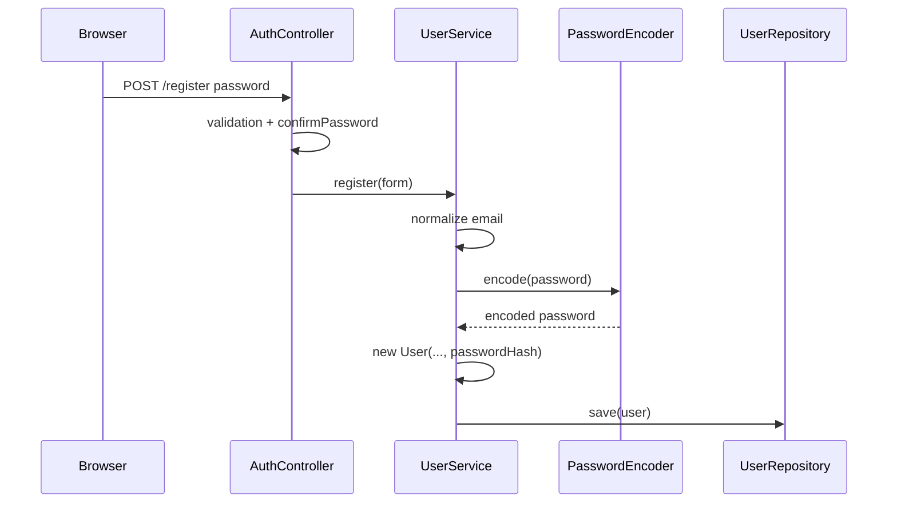
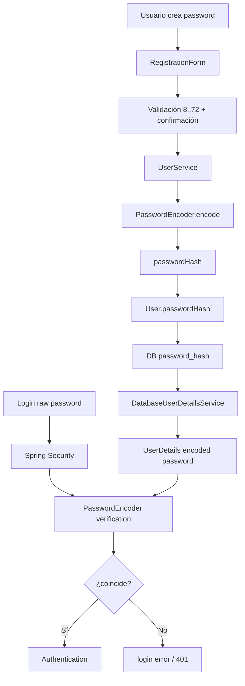

# 24 — Contraseñas y `PasswordEncoder`

En los capítulos anteriores vimos que Spring Security recibe una contraseña durante el login y que `DatabaseUserDetailsService` devuelve:

```java
.password(user.getPasswordHash())
```

Pero la base de datos no contiene la contraseña original.

La pregunta central de este capítulo es:

> **¿Cómo puede Spring Security verificar una contraseña si PetMatch no guarda el secreto original?**

La respuesta está en el uso de un `PasswordEncoder` y en una idea fundamental:

```text
una contraseña no debe persistirse como texto plano
```

---

# 1. El problema de guardar contraseñas

Imagina una tabla insegura:

```text
email               password
ana@example.com     mipassword123
luis@example.com    qwerty456
```

Si alguien obtiene una copia de esa base de datos, obtiene inmediatamente las credenciales reales.

Además muchas personas reutilizan contraseñas en otros servicios.

Una filtración podría comprometer mucho más que PetMatch.

Por eso el sistema no debería necesitar recuperar la contraseña original.

---

# 2. Lo que realmente almacena `User`

La Entity tiene:

```java
@Column(
    name = "password_hash",
    nullable = false,
    length = 255
)
private String passwordHash;
```

No existe un campo:

```java
private String password;
```

dentro de la Entity persistente.

La elección del nombre es importante:

```text
passwordHash
```

comunica que se conserva una representación protegida, no el secreto original.

---

# 3. Password del formulario vs `passwordHash` persistido

En registro tenemos dos modelos distintos.

## `RegistrationForm`

```text
password
confirmPassword
```

Son datos temporales de entrada.

## `User`

```text
passwordHash
```

Es el estado persistente.

Flujo:

```text
password del usuario
↓
PasswordEncoder.encode(...)
↓
passwordHash
↓
User
↓
base de datos
```

`confirmPassword` nunca necesita persistirse.

---

# 4. Bean `PasswordEncoder`

`SecurityConfig` declara:

```java
@Bean
PasswordEncoder passwordEncoder() {
    return PasswordEncoderFactories
        .createDelegatingPasswordEncoder();
}
```

Spring registra este objeto como Bean.

Después puede inyectarlo donde se necesite.

---

# 5. Inyección en `UserService`

Constructor real:

```java
public UserService(
    UserRepository userRepository,
    PasswordEncoder passwordEncoder
) {
    this.userRepository = userRepository;
    this.passwordEncoder = passwordEncoder;
}
```

Esto conecta con DI:

```text
SecurityConfig crea PasswordEncoder Bean
↓
Spring Container
↓
UserService recibe PasswordEncoder
```

El Service no hace:

```java
new AlgoritmoDeHash(...)
```

manualmente.

---

# 6. Registro: dónde se codifica la contraseña

Código real:

```java
User user = new User(
    form.getName().trim(),
    normalizedEmail,
    passwordEncoder.encode(form.getPassword())
);
```

La contraseña del formulario pasa por:

```java
passwordEncoder.encode(...)
```

antes de entrar en la Entity.

Por tanto el constructor recibe:

```text
passwordHash
```

no el texto plano.

---

# 7. Flujo de registro completo



La contraseña original solo es necesaria como entrada durante el caso de registro/autenticación.

---

# 8. Hash/codificación de contraseña no es cifrado reversible

Para un principiante es común decir:

```text
“Spring encripta la contraseña”
```

pero eso puede producir un modelo mental incorrecto.

En un esquema correcto de password hashing:

```text
contraseña
→ transformación unidireccional diseñada para passwords
→ valor almacenado
```

No queremos un mecanismo donde la aplicación pueda hacer:

```text
passwordHash
→ descifrar
→ contraseña original
```

La aplicación necesita **verificar**, no recuperar el secreto.

---

# 9. Entonces, ¿cómo se verifica el login?

Modelo conceptual:

```text
password escrito ahora
+
passwordHash almacenado
↓
PasswordEncoder verifica si corresponden
↓
true / false
```

La API de `PasswordEncoder` incluye conceptualmente operaciones como:

```java
encode(rawPassword)
matches(rawPassword, encodedPassword)
```

PetMatch llama directamente a `encode(...)` durante registro.

Durante el login, Spring Security utiliza el `PasswordEncoder` configurado dentro de su proceso de autenticación; PetMatch no implementa manualmente la comparación en `AuthController`.

---

# 10. Lo que NO debe hacerse

Nunca necesitamos código como:

```java
if (formPassword.equals(user.getPasswordHash())) {
    ...
}
```

Eso compararía:

```text
texto plano
```

con:

```text
representación codificada
```

y además ignoraría el contrato del encoder.

La verificación debe pasar por el mecanismo de `PasswordEncoder` que entiende cómo interpretar el valor almacenado.

---

# 11. `DelegatingPasswordEncoder`

La factory usada por PetMatch es:

```java
PasswordEncoderFactories
    .createDelegatingPasswordEncoder()
```

La idea de un **delegating encoder** es permitir que un valor codificado identifique el esquema con el que debe verificarse y delegar en el encoder correspondiente.

Esto facilita evolución/migración de formatos de contraseña sin diseñar un sistema propio.

> [!IMPORTANT]
> PetMatch no fija manualmente en `SecurityConfig` un algoritmo concreto mediante `new ...PasswordEncoder()`. El libro no debe afirmar un algoritmo específico como decisión explícita del proyecto cuando el código utiliza la factory delegating.

---

# 12. ¿Por qué es útil poder evolucionar el esquema?

Los algoritmos/recomendaciones de almacenamiento de contraseñas cambian con el tiempo.

Un sistema puede necesitar:

```text
usuarios antiguos → hash con formato A
usuarios nuevos → hash con formato B
```

Una estrategia delegating ayuda a reconocer distintos formatos de valores codificados.

Eso es mucho más flexible que almacenar hashes sin información suficiente para saber cómo verificarlos.

---

# 13. Formato almacenado y límites de la implementación

El repositorio declara:

```java
createDelegatingPasswordEncoder()
```

pero no contiene una muestra de registros reales de producción ni una prueba que fije en documentación un string concreto de `password_hash`.

Por tanto este libro debe enseñar:

```text
PasswordEncoder
DelegatingPasswordEncoder
encode / match
```

sin inventar un hash real o asumir un valor exacto almacenado para una cuenta concreta.

---

# 14. Password hashing usa mecanismos diseñados para ser costosos

Las contraseñas son secretos de baja entropía comparadas con claves criptográficas aleatorias.

Por eso los password encoders modernos suelen utilizar funciones deliberadamente costosas para hacer más caro probar grandes cantidades de candidatos.

La idea de seguridad es:

```text
login legítimo
→ costo aceptable una vez

ataque masivo de guesses
→ costo multiplicado muchas veces
```

No necesitamos implementar este mecanismo manualmente: Spring Security proporciona el contrato y los encoders.

---

# 15. Salts: concepto

Un password hashing seguro normalmente incorpora un valor aleatorio conocido como **salt**.

El objetivo conceptual es impedir que dos cuentas con la misma contraseña produzcan necesariamente una representación trivial idéntica reutilizable y dificultar tablas precalculadas.

La administración concreta del formato/salt corresponde al encoder utilizado.

PetMatch no genera un salt manual con código propio.

> [!WARNING]
> No agregues una columna `salt` manualmente solo porque aprendiste el término. El encoder elegido debe gestionar correctamente el esquema que utiliza.

---

# 16. No hashear con SHA-256 “a mano”

Un error común sería escribir:

```text
SHA-256(password)
```

y almacenarlo directamente.

Aunque SHA-256 es una función hash criptográfica general, no está diseñada por sí sola como mecanismo completo de password hashing lento/adaptativo.

PetMatch evita implementar criptografía casera y usa:

```text
PasswordEncoder
```

de Spring Security.

---

# 17. No cifrar para poder recuperar la contraseña

Otro diseño incorrecto sería:

```text
AES(password)
→ guardar ciphertext
→ guardar key
→ decrypt cuando haga falta
```

La aplicación no necesita recuperar la contraseña original.

Si el sistema puede descifrar todas las passwords, comprometer la clave de cifrado expone todos los secretos.

El objetivo correcto es verificación unidireccional.

---

# 18. Longitud aceptada por el formulario

`RegistrationForm` contiene:

```java
@NotBlank(message = "La contraseña es obligatoria")
@Size(
    min = 8,
    max = 72,
    message = "La contraseña debe tener entre 8 y 72 caracteres"
)
private String password;
```

Esto es una regla de **entrada de PetMatch**.

No debemos confundirla con la lógica interna del hash.

---

# 19. ¿Por qué existe `confirmPassword`?

El formulario contiene:

```java
private String confirmPassword;
```

Y `AuthController` compara:

```java
if (!form.getPassword()
        .equals(form.getConfirmPassword())) {
    bindingResult.rejectValue(
        "confirmPassword",
        "password.mismatch",
        "Las contraseñas no coinciden"
    );
}
```

Esto evita un error de digitación durante registro.

No fortalece criptográficamente el password.

Es una regla de UX/validación del registro.

---

# 20. `confirmPassword` desaparece después

Flujo:

```text
password
confirmPassword
↓
comparar
↓
si coinciden
↓
UserService recibe RegistrationForm
↓
encode(password)
↓
solo passwordHash persiste
```

No existe razón para guardar la confirmación.

---

# 21. Email duplicado y contraseña son problemas separados

`UserService.register(...)` primero normaliza y comprueba email:

```java
if (userRepository
    .existsByEmailIgnoreCase(normalizedEmail)) {
    throw new DuplicateEmailException(normalizedEmail);
}
```

Después crea el `User` con password codificado.

Por tanto:

```text
unicidad de identidad
```

y:

```text
protección del secreto
```

son responsabilidades diferentes dentro del mismo caso de registro.

---

# 22. La Entity refuerza la intención con el nombre

```java
private String passwordHash;
```

es mejor que un campo ambiguo como:

```java
private String password;
```

si el valor persistido nunca debe ser la contraseña original.

El nombre ayuda a evitar que otro desarrollador asuma equivocadamente qué contiene la columna.

---

# 23. Columna de base de datos

Mapping real:

```java
@Column(
    name = "password_hash",
    nullable = false,
    length = 255
)
private String passwordHash;
```

Esto muestra que el diseño se refleja también en el esquema:

```text
password_hash
```

No:

```text
password_plaintext
```

---

# 24. ¿Por qué longitud 255?

La Entity reserva hasta:

```text
255 caracteres
```

para el valor codificado.

No debemos inferir que la contraseña original pueda tener 255 caracteres; el `RegistrationForm` limita la entrada actual a 72.

Son longitudes de datos distintos:

```text
raw password
→ regla del form

encoded password
→ almacenamiento
```

---

# 25. `UserDetails` recibe el hash

`DatabaseUserDetailsService` hace:

```java
.password(user.getPasswordHash())
```

Spring Security espera en `UserDetails.password` el valor codificado que debe utilizar durante la verificación.

No debería recibir el texto plano original porque ese texto ya no existe en la base de datos.

---

# 26. El login no vuelve a ejecutar `encode` para comparar strings

Un error conceptual sería pensar:

```text
encode(password recibida)
==
passwordHash almacenado
```

como comparación manual genérica.

Los password hashing schemes pueden incorporar salts y otros parámetros, por lo que la verificación debe usar el método de matching del encoder.

Modelo correcto:

```text
matches(raw, encoded)
```

Spring Security integra esa verificación durante autenticación.

---

# 27. Mismo password no implica comparación directa de hashes nuevos

Precisamente por características como salts, volver a ejecutar `encode` puede producir una representación distinta incluso para la misma contraseña, dependiendo del encoder.

Por eso:

```text
encode(raw).equals(stored)
```

no es el contrato correcto de verificación.

Utiliza:

```text
PasswordEncoder.matches(...)
```

o deja que Spring Security lo haga dentro de su pipeline de autenticación.

---

# 28. ¿Dónde se usa `matches(...)` en el código de PetMatch?

No aparece una llamada manual visible en `AuthController` o `UserService`.

Eso es intencional.

El login se delega a Spring Security, que utiliza la infraestructura de autenticación y el `PasswordEncoder` configurado.

Por tanto el libro no debe inventar:

```java
passwordEncoder.matches(...)
```

dentro de un Controller que no existe.

---

# 29. Registro y login comparten el mismo contrato de encoding

Registro:

```text
PasswordEncoder.encode(raw)
→ encoded almacenado
```

Login:

```text
raw presentado
+
encoded almacenado
→ PasswordEncoder verification
```

Si cada lado usara estrategias incompatibles, ningún usuario podría autenticarse correctamente.

El Bean centralizado evita esa dispersión.

---

# 30. `PasswordEncoder` también es una dependencia de arquitectura

Su ubicación no pertenece a:

```text
Controller
```

sino a configuración/Service.

¿Por qué?

Porque proteger credenciales es parte del caso de creación de usuario y del subsistema de seguridad, no de la presentación HTML.

`AuthController` no necesita conocer detalles del encoder.

---

# 31. ¿Debe un Controller recibir el hash?

No en el flujo actual.

El Controller trabaja con:

```text
RegistrationForm.password
```

El Service transforma el secreto antes de crear la Entity.

Esto mantiene:

```text
presentación
→ raw input temporal

Service/security
→ encoding

Entity/DB
→ encoded value
```

---

# 32. No devolver `passwordHash` en una vista/API

Una representación codificada sigue siendo información sensible.

Aunque no permita “descifrar” directamente la contraseña, no hay motivo para exponerla al cliente.

Los DTO públicos no deberían incluirla.

PetMatch no necesita mostrar `passwordHash` en sus templates ni en respuestas REST.

---

# 33. Logs y contraseñas

Otra regla importante:

```text
no registrar passwords en logs
```

Ni raw passwords ni encoded passwords deberían imprimirse como parte de depuración ordinaria.

La implementación actual no incorpora logging de contraseñas.

---

# 34. Excepciones no deberían revelar si password o email falló

El template de login muestra:

```text
Correo o contraseña incorrectos.
```

No distingue públicamente:

```text
“ese email no existe”
```

de:

```text
“password incorrecta”
```

Eso evita dar información innecesaria durante el proceso de autenticación.

El registro sí puede reportar email duplicado porque es otro caso de uso con objetivos diferentes.

---

# 35. Login y enumeración de cuentas

Mostrar un mensaje genérico en autenticación reduce información útil para quien intenta averiguar qué cuentas existen.

No significa que el sistema sea inmune a toda técnica de enumeración; simplemente es una práctica coherente con no revelar más detalle del necesario.

No debemos atribuir al proyecto rate limiting, CAPTCHA o detección de ataques porque no están implementados.

---

# 36. ¿PetMatch tiene recuperación de contraseña?

No se observa en la implementación actual un flujo de:

```text
forgot password
reset token
email de recuperación
```

El proyecto no implementa actualmente un mecanismo de reset de contraseña.

Podrá aparecer como evolución futura, no como parte del flujo actual.

---

# 37. ¿Tiene cambio de contraseña?

Tampoco se ha identificado un caso de uso/pantalla para cambiar la contraseña de una cuenta autenticada.

El uso actual de `PasswordEncoder` está claramente verificado en:

```text
registro
+
autenticación gestionada por Spring Security
```

No existen endpoints adicionales para este flujo.

---

# 38. ¿Hay 2FA?

No.

La autenticación actual depende de:

```text
email
+
password
```

No existen componentes para:

```text
TOTP
SMS OTP
WebAuthn
segunda etapa
```

---

# 39. ¿Hay políticas de bloqueo por intentos?

No se observan contadores de intentos, timestamps de lockout o reglas de rate limiting en el código actual.

El campo:

```text
active
```

puede deshabilitar una cuenta desde el modelo de seguridad, pero eso no equivale a un sistema automático de lockout por intentos fallidos.

---

# 40. Flujo completo de contraseña



---

# 41. Defensa por capas alrededor de credenciales

PetMatch combina:

```text
RegistrationForm validation
→ longitud y presencia

confirmPassword
→ reducir errores de digitación

PasswordEncoder
→ proteger valor persistido

DatabaseUserDetailsService
→ entregar encoded password a Security

Spring Security
→ verificar autenticación

SecurityFilterChain
→ decidir acceso HTTP
```

Ninguna de estas piezas sustituye a todas las demás.

---

# 42. ¿Por qué no escribir criptografía propia?

La criptografía es un área donde pequeños errores pueden tener consecuencias graves.

Usar la abstracción estándar del framework permite:

```text
algoritmos soportados
formato consistente
evolución
integración con autenticación
```

sin diseñar manualmente:

```text
salts
comparación
parámetros
formato persistido
```

---

# 43. PasswordEncoder vs cifrado de otros datos

`PasswordEncoder` está diseñado para contraseñas.

No debe generalizarse a:

```text
“cualquier dato sensible debe pasarse por PasswordEncoder”
```

Otros datos pueden requerir necesidades distintas:

```text
cifrado reversible
hashing
masking
tokenization
```

PetMatch utiliza `PasswordEncoder` específicamente para password authentication.

---

# 44. Contraseña fuerte vs almacenamiento seguro

Son dos problemas diferentes.

```text
password elegida por usuario
→ calidad/secreto

passwordHash almacenado
→ protección en reposo
```

PetMatch impone actualmente una regla de longitud de 8 a 72 caracteres en el formulario.

No se observa un medidor de fortaleza, lista de passwords comprometidas o reglas complejas de composición.

Esas capacidades no forman parte de la implementación actual.

---

# 45. El nombre `passwordHash` también ayuda en revisiones de código

Cuando un desarrollador ve:

```java
user.getPasswordHash()
```

sabe que no debería:

```text
mostrarlo
enviarlo como DTO
compararlo con raw mediante equals
```

Los nombres forman parte de la seguridad mantenible.

---

# 46. Testing de autenticación indirectamente valida el encoding

`RestApiIntegrationTests` registra un usuario con:

```java
userService.register(form);
```

Después autentica con:

```java
httpBasic(email, password)
```

Y espera:

```text
200 OK
```

Esto demuestra de forma integrada que:

```text
password raw de registro
→ encoded persistido
→ UserDetails
→ verificación HTTP Basic
```

funcionan de forma compatible.

---

# 47. No necesitamos conocer el hash para testear login

El test no consulta:

```text
password_hash
```

ni reconstruye el algoritmo.

Hace lo que haría un cliente:

```text
presentar email + raw password
```

Y observa si la autenticación funciona.

Ese es un test más valioso del comportamiento público.

---

# 48. ⚠️ Errores frecuentes

## Error 1 — Guardar password en texto plano

Nunca debe ser el diseño normal.

## Error 2 — Decir “se encripta y luego se desencripta”

Password hashing está pensado para verificación unidireccional.

## Error 3 — Comparar `raw.equals(passwordHash)`

Ignora el `PasswordEncoder`.

## Error 4 — Comparar `encode(raw).equals(stored)` como estrategia genérica

La verificación correcta usa el contrato `matches` del encoder.

## Error 5 — Implementar SHA-256 manual como password storage

Una función hash general no sustituye un password encoder adecuado.

## Error 6 — Generar salts manualmente sin entender el encoder

La estrategia debe gestionarse por el mecanismo de password hashing utilizado.

## Error 7 — Exponer `passwordHash` en DTO o HTML

Sigue siendo información sensible.

## Error 8 — Loggear passwords

No.

## Error 9 — Afirmar un algoritmo concreto que `SecurityConfig` no declara explícitamente

El proyecto usa `createDelegatingPasswordEncoder()`.

## Error 10 — Inventar reset password, 2FA o lockout

No aparecen en la implementación actual.

---

# 49. 🛠 Prueba en el código

## Actividad 1 — Sigue el secreto

Traza:

```text
register.html
↓
RegistrationForm.password
↓
UserService.register
↓
PasswordEncoder.encode
↓
User.passwordHash
↓
users.password_hash
```

## Actividad 2 — Busca lo que NO existe

Comprueba que `User` no tenga:

```text
password
confirmPassword
```

como campos persistentes.

## Actividad 3 — Registro vs login

Señala dónde ocurre:

```text
encode
```

y quién se ocupa conceptualmente de:

```text
matches
```

durante autenticación.

## Actividad 4 — Form vs Entity

Compara las longitudes:

```text
RegistrationForm.password → 8..72
User.passwordHash → columna length 255
```

Explica por qué no son contradictorias.

## Actividad 5 — Test integrado

Explica por qué registrar con `UserService` y después autenticar con HTTP Basic prueba indirectamente que el encoder de registro y el de autenticación son compatibles.

---

# 50. 🧪 Comprueba que entendiste

1. ¿Por qué no debe guardarse la contraseña en texto plano?
2. ¿Qué campo almacena `User`?
3. ¿Dónde se declara el `PasswordEncoder` Bean?
4. ¿Qué factory utiliza PetMatch?
5. ¿Dónde se llama `encode(...)` explícitamente?
6. ¿Qué diferencia hay entre hashing de password y cifrado reversible?
7. ¿Por qué no necesitamos recuperar la contraseña original?
8. ¿Qué operación conceptual verifica raw vs encoded?
9. ¿Por qué no debemos comparar `encode(raw)` con `stored` mediante `equals`?
10. ¿Qué aporta un `DelegatingPasswordEncoder` conceptualmente?
11. ¿PetMatch genera salts manualmente?
12. ¿Por qué no deberíamos implementar SHA-256 directo para passwords?
13. ¿Cuál es la longitud permitida en `RegistrationForm.password`?
14. ¿Por qué `confirmPassword` no se persiste?
15. ¿Debe exponerse `passwordHash` en API/templates?
16. ¿PetMatch implementa reset password o 2FA?
17. ¿Qué prueba integra registro + password encoding + autenticación API?

### Respuestas esperadas

1. Porque una filtración revelaría inmediatamente los secretos originales.
2. `passwordHash`.
3. En `SecurityConfig`.
4. `PasswordEncoderFactories.createDelegatingPasswordEncoder()`.
5. En `UserService.register(...)`.
6. El password hash está pensado para verificación unidireccional; el cifrado permite recuperación con una clave.
7. Solo necesitamos comprobar que la credencial presentada corresponde.
8. `PasswordEncoder.matches(raw, encoded)` conceptualmente.
9. Los esquemas pueden usar salt/parámetros; el contrato correcto es `matches`.
10. Permite delegar verificación según el formato/esquema codificado y facilitar evolución.
11. No.
12. Porque una función hash general rápida no constituye por sí sola un password hashing adecuado.
13. Entre 8 y 72 caracteres.
14. Solo confirma la entrada durante registro.
15. No.
16. No en la implementación actual.
17. `RestApiIntegrationTests` registra y luego usa HTTP Basic con el raw password.

---

# 51. ✅ Qué debes recordar

- **PetMatch nunca necesita persistir la contraseña original.**
- `RegistrationForm` recibe `password` y `confirmPassword`.
- `User` persiste únicamente `passwordHash`.
- `SecurityConfig` declara un `PasswordEncoder` Bean.
- El proyecto usa `PasswordEncoderFactories.createDelegatingPasswordEncoder()`.
- `UserService.register(...)` ejecuta `passwordEncoder.encode(...)`.
- Password hashing no debe describirse como cifrado reversible.
- Verificar una password significa comparar raw vs encoded mediante el contrato del encoder.
- No se debe usar `equals` contra el hash ni implementar hashing casero.
- Un delegating encoder facilita compatibilidad/evolución de formatos.
- PetMatch no genera salts manualmente en su Service.
- La contraseña del Form tiene regla actual de 8–72 caracteres.
- La columna `password_hash` admite hasta 255 caracteres porque almacena otro tipo de dato.
- `DatabaseUserDetailsService` entrega el hash a Spring Security.
- El login no implementa manualmente `matches` en un Controller.
- `passwordHash` no debe exponerse en vistas, DTO públicos o logs.
- No hay reset password, cambio de password, 2FA o lockout automático implementado.
- Las pruebas de API verifican indirectamente la compatibilidad entre registro y autenticación.

---

# 🔗 Continúa con

Ya entendemos:

```text
quién se autentica
cómo se selecciona la política HTTP
cómo se protege su contraseña
```

Ahora podemos responder la siguiente pregunta:

> **¿Por qué estar autenticado no permite editar cualquier Pet o SupportRequest y cómo PetMatch combina roles con consultas por owner?**

Continúa con:

**[Capítulo 25 — Autorización y ownership →](25-autorizacion-y-ownership.md)**

---

[← Capítulo 23 — Spring Security](23-spring-security.md) · [Índice del bloque](README.md) · [Índice general](../README.md) · [Siguiente → Capítulo 25](25-autorizacion-y-ownership.md)
