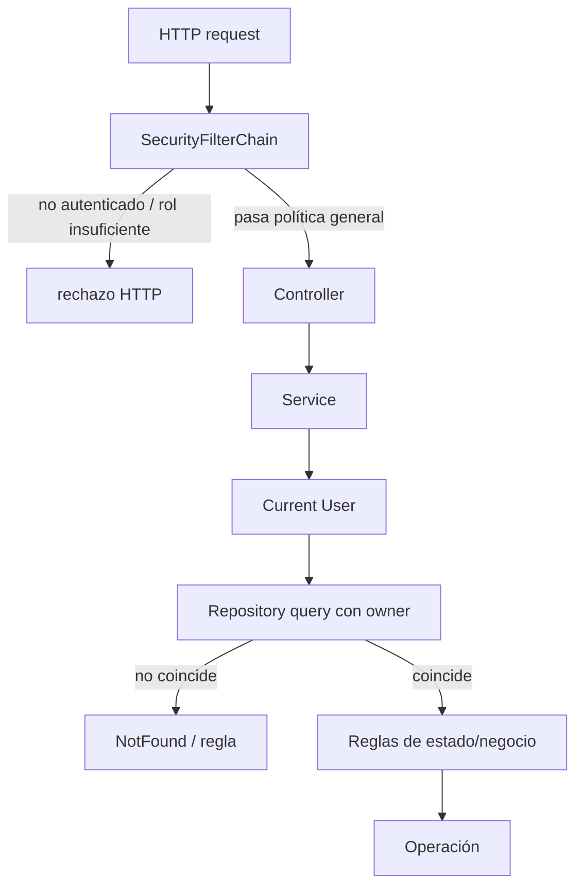

# 25 — Autorización y ownership

En el capítulo 22 respondimos:

> **¿Quién es el usuario autenticado?**

En el capítulo 23 vimos que Spring Security puede decidir si una ruta exige autenticación o un rol.

Pero todavía queda una pregunta más precisa:

> **Si Ana y Bruno están autenticados, ¿cómo evita PetMatch que Bruno edite la mascota, la solicitud o las postulaciones que pertenecen a Ana simplemente cambiando un id en la URL?**

Este problema no se resuelve solamente con:

```java
.anyRequest().authenticated()
```

PetMatch combina dos niveles de autorización:

```text
SecurityFilterChain
→ autorización general por ruta / autenticación / rol

Service + Repository
→ autorización sobre el recurso concreto mediante ownership
```

---

# 1. Autenticación no es autorización

Autenticación responde:

```text
¿quién eres?
```

Autorización responde:

```text
¿puedes hacer esto?
```

Ejemplo:

```text
Bruno está autenticado
```

no implica:

```text
Bruno puede editar Pet 42
```

Para editarla debemos saber además:

```text
¿Pet 42 pertenece a Bruno?
```

---

# 2. Autorización por ruta vs autorización por recurso

Spring Security puede proteger una familia de URLs:

```text
/pets/**
→ authenticated
```

Pero la ruta:

```text
/pets/42/edit
```

contiene un recurso específico:

```text
Pet id 42
```

La filter chain no conoce por sí sola la relación de base de datos:

```text
Pet.owner.id
```

Por eso el Service/Repository debe incorporar ownership.

---

# 3. ¿Qué significa ownership?

En este libro llamamos **ownership** a la regla:

> **un recurso pertenece o está asociado a un usuario concreto y ciertas acciones solo pueden ser ejecutadas por ese usuario.**

Ejemplos reales:

```text
Pet.owner
SupportRequest.owner
SupportApplication.applicant
SupportApplication.supportRequest.owner
```

No es una anotación especial de Spring Security en PetMatch.

Es una regla implementada mediante:

```text
Authentication
+
User actual
+
consultas por id y owner
+
reglas del Service
```

---

# 4. Primer nivel: filter chain

La cadena web termina con:

```java
.anyRequest().authenticated()
```

Eso significa que rutas web no públicas como:

```text
/pets
/support-requests/mine
/support-applications/mine
```

requieren una identidad autenticada.

Pero esta regla solo responde:

```text
¿hay un usuario autenticado?
```

No:

```text
¿el recurso solicitado es suyo?
```

---

# 5. El rol `ADMIN`

`SecurityConfig` contiene:

```java
.requestMatchers("/admin/**").hasRole("ADMIN")
```

Y el enum contiene:

```java
public enum Role {
    USER,
    ADMIN
}
```

Esto es autorización basada en rol.

La pregunta es:

```text
¿la identidad tiene ROLE_ADMIN?
```

---

# 6. `hasRole("ADMIN")` y prefijo `ROLE_`

`DatabaseUserDetailsService` construye authorities mediante:

```java
.roles(user.getRole().name())
```

Conceptualmente, `roles(...)` utiliza el modelo de roles de Spring Security y genera authorities con el prefijo habitual:

```text
ROLE_USER
ROLE_ADMIN
```

Por eso:

```java
hasRole("ADMIN")
```

corresponde conceptualmente a:

```text
ROLE_ADMIN
```

La configuración actual no contiene:

```java
hasRole("ROLE_ADMIN")
```

como si fuera el código de PetMatch.

---

# 7. Pero PetMatch no usa roles para ownership

Una mascota normal no requiere:

```text
ROLE_PET_OWNER
```

Una solicitud normal tampoco requiere:

```text
ROLE_REQUEST_OWNER
```

Ambas personas pueden tener:

```text
ROLE_USER
```

pero poseer recursos diferentes.

Por eso:

```text
rol
≠
ownership
```

---

# 8. Ejemplo: dos usuarios con el mismo rol

Supongamos:

```text
Ana
ROLE_USER
Pet 10

Bruno
ROLE_USER
Pet 20
```

Los dos pueden acceder a rutas `/pets/**` porque están autenticados.

Pero:

```text
Ana → Pet 10 ✅
Ana → Pet 20 ❌
Bruno → Pet 20 ✅
Bruno → Pet 10 ❌
```

La diferencia no está en el rol.

Está en:

```text
Pet.owner.id
```

---

# 9. `PetService.findOwnedPet(...)`

Código real:

```java
@Transactional(readOnly = true)
public Pet findOwnedPet(
    Long petId,
    Authentication authentication
) {
    User owner = userService.getCurrentUser(authentication);

    return petRepository
        .findByIdAndOwnerId(petId, owner.getId())
        .orElseThrow(() -> new PetNotFoundException(petId));
}
```

Este método es una pieza central de autorización.

---

# 10. La consulta incorpora identidad + recurso

Repository real:

```java
Optional<Pet> findByIdAndOwnerId(
    Long id,
    Long ownerId
);
```

La pregunta a la base no es:

```text
¿existe Pet 42?
```

Sino:

```text
¿existe Pet 42 cuyo owner.id sea el current user?
```

Eso reduce el riesgo de cargar primero un recurso ajeno y olvidarse de comprobar después su propietario.

---

# 11. El id de la URL nunca es suficiente

Un usuario puede modificar manualmente:

```text
/pets/10/edit
```

por:

```text
/pets/20/edit
```

Por tanto jamás debemos interpretar:

```text
petId recibido
```

como:

```text
pet autorizado
```

PetMatch lo convierte en recurso autorizado mediante:

```text
petId
+
currentUser.id
↓
findByIdAndOwnerId
```

---

# 12. Editar una Pet reutiliza la misma protección

`PetService.update(...)` comienza con:

```java
Pet pet = findOwnedPet(
    petId,
    authentication
);
```

Solo después modifica:

```text
name
species
age
description
```

El orden importa:

```text
1. resolver recurso autorizado
2. modificar
```

No al revés.

---

# 13. Eliminar también reutiliza ownership

`PetService.delete(...)` hace:

```java
Pet pet = findOwnedPet(petId, authentication);
```

Después aplica otra regla:

```java
if (supportRequestRepository.existsByPetId(pet.getId())) {
    throw new PetDeletionException(pet.getId());
}
```

Aquí vemos dos controles distintos:

```text
ownership
→ ¿puedo actuar sobre esta Pet?

business rule
→ ¿puede eliminarse en su estado relacional actual?
```

---

# 14. Autorización y reglas de negocio se complementan

Un owner válido todavía puede recibir un rechazo por una regla de negocio.

Ejemplo:

```text
soy owner ✅
pero la Pet tiene SupportRequest asociadas ❌ delete
```

O:

```text
soy owner de la SupportRequest ✅
pero está COMPLETED ❌ update/cancel
```

Por tanto:

```text
autorizado sobre recurso
≠
operación válida en cualquier estado
```

---

# 15. `SupportRequest.findOwnedRequest(...)`

Código real:

```java
@Transactional(readOnly = true)
public SupportRequest findOwnedRequest(
    Long requestId,
    Authentication authentication
) {
    User owner = userService.getCurrentUser(authentication);

    return supportRequestRepository
        .findByIdAndOwnerId(requestId, owner.getId())
        .orElseThrow(() ->
            new SupportRequestNotFoundException(requestId)
        );
}
```

Repository:

```java
Optional<SupportRequest> findByIdAndOwnerId(
    Long id,
    Long ownerId
);
```

Mismo patrón de seguridad.

---

# 16. Una función reusable reduce olvidos

`SupportRequestService` utiliza `findOwnedRequest(...)` en:

```text
update
cancel
complete
```

Esto evita repetir manualmente en cada método:

```text
load request
load current user
compare ids
throw
```

Centralizar el patrón reduce la probabilidad de que una operación futura olvide ownership.

---

# 17. Crear una solicitud tiene dos ownership checks

`SupportRequestService.create(...)` obtiene:

```java
User owner = userService.getCurrentUser(authentication);
```

Y después:

```java
Pet pet = petService.findOwnedPet(
    form.getPetId(),
    authentication
);
```

Eso protege una regla importante:

> Un usuario solo puede crear una solicitud para una mascota propia.

Aunque el formulario envíe un `petId` válido de otra persona, el Service no acepta esa Pet.

---

# 18. Editar una solicitud vuelve a comprobar la Pet seleccionada

`update(...)` hace:

```text
findOwnedRequest(requestId)
↓
requireOpen(request)
↓
findOwnedPet(form.petId)
```

Hay tres preguntas diferentes:

```text
¿la request es mía?
¿la request está OPEN?
¿la nueva Pet seleccionada también es mía?
```

Un solo `authenticated()` no puede sustituir esas tres reglas.

---

# 19. `SupportApplication` tiene dos relaciones de usuario

Una postulación conecta:

```text
applicant
```

con:

```text
supportRequest.owner
```

Por tanto dos personas tienen permisos diferentes sobre la misma `SupportApplication`.

Ejemplo:

```text
Applicant
→ puede verla en “Mis postulaciones”

Owner de la request
→ puede verla como recibida y aceptar/rechazar
```

---

# 20. “Mis postulaciones” usa applicant ownership

`SupportApplicationService.findCurrentUserApplications(...)`:

```java
User applicant = userService.getCurrentUser(authentication);

return supportApplicationRepository
    .findByApplicantIdOrderByAppliedAtDesc(
        applicant.getId()
    );
```

La lista está limitada por:

```text
applicant.id = currentUser.id
```

---

# 21. Postulaciones recibidas usan request ownership

`findReceivedApplications(...)` primero hace:

```java
User owner = userService.getCurrentUser(authentication);

SupportRequest request = supportRequestRepository
    .findByIdAndOwnerId(requestId, owner.getId())
    .orElseThrow(...);
```

Solo después consulta:

```java
findBySupportRequestIdOrderByAppliedAtAsc(...)
```

Así un usuario no puede consultar la lista de postulantes de una request ajena simplemente cambiando el `requestId`.

---

# 22. Aceptar: ownership dentro de la consulta

Código real:

```java
SupportApplication application =
    supportApplicationRepository
        .findByIdAndSupportRequestOwnerId(
            applicationId,
            owner.getId()
        )
        .orElseThrow(() ->
            new SupportApplicationNotFoundException(applicationId)
        );
```

El método pregunta:

```text
¿existe esta Application
cuya SupportRequest pertenece al current user?
```

Solo ese owner puede llegar a la lógica de aceptación.

---

# 23. Rechazar usa la misma protección

`reject(...)` utiliza igualmente:

```java
findByIdAndSupportRequestOwnerId(
    applicationId,
    owner.getId()
)
```

Por tanto el permiso no depende de que el botón aparezca en una página concreta.

Está incorporado en la capa de acceso usada por el Service.

---

# 24. ¿Por qué filtrar en Repository puede ser robusto?

Una implementación alternativa podría hacer:

```java
SupportApplication app = repository.findById(id);

if (!app.getSupportRequest()
        .getOwner()
        .getId()
        .equals(currentUser.getId())) {
    throw ...;
}
```

Eso puede funcionar si siempre se recuerda la comprobación.

PetMatch usa consultas como:

```text
findByIdAndSupportRequestOwnerId
```

que hacen que el recurso no sea devuelto si ownership no coincide.

La propia forma de consultar incorpora parte de la política.

---

# 25. “No encontrado” para recurso ajeno

Observa `findOwnedPet(...)`:

```java
.orElseThrow(() -> new PetNotFoundException(petId));
```

Un id inexistente y un id existente pero propiedad de otro usuario producen, desde ese caso de uso:

```text
PetNotFoundException
```

Algo equivalente ocurre con `SupportRequestNotFoundException` y `SupportApplicationNotFoundException` en los métodos de ownership.

---

# 26. ¿Por qué puede ser útil no distinguirlo?

Si una respuesta dijera:

```text
“Pet 42 existe, pero pertenece a otro usuario”
```

revelaría que:

```text
Pet 42 existe
```

aunque el solicitante no deba tener acceso a ella.

El patrón actual reduce esa exposición de información.

No significa que todo sistema deba usar siempre 404 para todo caso de autorización; describe la semántica elegida por los Services actuales.

---

# 27. Visibilidad de solicitudes abiertas

`SupportRequestService.findVisibleRequest(...)` tiene una regla más rica.

Primero carga la request.

Después calcula:

```java
boolean owner =
    request.getOwner().getId().equals(currentUser.getId());

boolean applicant =
    supportApplicationRepository
        .existsByApplicantIdAndSupportRequestId(
            currentUser.getId(),
            requestId
        );
```

Y aplica:

```java
if (request.getStatus() != SupportRequestStatus.OPEN
    && !owner
    && !applicant) {
    throw new SupportRequestNotFoundException(requestId);
}
```

---

# 28. Regla de visibilidad completa

Podemos expresarla así:

```text
Request OPEN
→ usuario autenticado puede verla
```

Mientras:

```text
Request != OPEN
→ owner puede verla
→ applicant relacionado puede verla
→ outsider no puede verla
```

Aquí autorización depende de:

```text
estado
+
ownership / participación
```

---

# 29. La seguridad puede depender del estado del dominio

Una request `OPEN` forma parte del catálogo de solicitudes disponibles.

Cuando pasa a:

```text
IN_PROGRESS
COMPLETED
CANCELLED
```

PetMatch restringe su visibilidad a participantes relacionados.

Eso demuestra que autorización no siempre puede modelarse solo con roles globales.

A veces depende de:

```text
quién
+
qué recurso
+
qué relación tiene
+
en qué estado está
```

---

# 30. Applicant no es owner

Un applicant aceptado puede ver una solicitud no abierta por la regla de visibilidad.

Pero eso no significa que pueda:

```text
editarla
cancelarla
completarla
aceptar otras postulaciones
```

Esas acciones siguen usando métodos de owner.

Por tanto los permisos pueden ser distintos sobre el mismo recurso:

```text
VIEW
≠
EDIT
≠
CANCEL
≠
COMPLETE
```

---

# 31. “Participar” tampoco concede todos los permisos

`existsByApplicantIdAndSupportRequestId(...)` sirve para la visibilidad de una request no abierta.

No se reutiliza como permiso de administración.

Esto evita una deducción peligrosa:

```text
me postulé
→ ahora soy co-owner
```

No.

La relación de applicant tiene un alcance distinto.

---

# 32. El owner no puede postularse a sí mismo

`SupportApplicationService.apply(...)` comprueba:

```java
if (request.getOwner().getId().equals(applicant.getId())) {
    throw new SupportApplicationRuleException(
        "No puedes postularte a tu propia solicitud."
    );
}
```

Esta no es exactamente una regla de ownership del tipo “solo owner puede actuar”.

Es la regla inversa:

```text
owner NO puede ser applicant de su propia request
```

La identidad sigue siendo parte de la decisión.

---

# 33. IDOR: el riesgo que evita este diseño

Un problema común en aplicaciones web se conoce como **Insecure Direct Object Reference (IDOR)** o, en clasificación más amplia, fallos de autorización sobre objetos.

Escenario:

```text
usuario puede acceder a /pets/10
↓
cambia manualmente 10 por 11
↓
backend solo hace findById(11)
↓
obtiene recurso ajeno
```

PetMatch evita ese patrón en operaciones owned usando:

```text
findByIdAndOwnerId
```

---

# 34. El frontend no es una frontera de seguridad

Una vista puede ocultar “Editar” si:

```text
ownerView = false
```

Pero un usuario puede construir manualmente:

```text
POST /support-requests/42/cancel
```

Por eso la verdadera decisión vive en:

```text
SecurityFilterChain
+
Service
+
Repository ownership query
```

---

# 35. `ownerView` sirve para UX, no para autorización final

`SupportRequestController` agrega:

```java
model.addAttribute(
    "ownerView",
    supportRequestService.isOwner(request, authentication)
);
```

Thymeleaf puede usar:

```html
<div th:if="${ownerView}">
```

para mostrar acciones del owner.

Pero cuando el usuario ejecuta una acción, el Service vuelve a verificar ownership.

Eso es correcto.

---

# 36. `sec:authorize` tampoco sustituye al backend

La navegación usa:

```html
sec:authorize="isAuthenticated()"
```

Esto decide si renderizar parte del HTML.

No bloquea por sí mismo una request construida manualmente.

La filter chain sí opera antes del Controller.

Y ownership se vuelve a resolver en Service/Repository.

---

# 37. Tres capas de decisión

Un flujo protegido puede verse así:



Cada capa responde a preguntas diferentes.

---

# 38. Ruta protegida no significa operación autorizada

Ejemplo:

```text
POST /pets/42/delete
```

La filter chain puede decir:

```text
usuario autenticado ✅
```

Después el Service pregunta:

```text
Pet 42 pertenece al current user? ✅/❌
```

Y después:

```text
tiene SupportRequests asociadas? ✅/❌
```

La request puede superar una capa y fallar en la siguiente.

---

# 39. Roles y ownership son ortogonales

Podemos pensar en dos ejes:

```text
rol global
→ USER / ADMIN

relación con recurso
→ owner / applicant / outsider
```

Un sistema puede necesitar ambos.

Ejemplo conceptual:

```text
ADMIN + outsider
USER + owner
USER + applicant
```

PetMatch implementa una regla explícita por rol para `/admin/**` y múltiples reglas por relación en sus Services.

---

# 40. No existe method security central con `@PreAuthorize`

Los Services actuales no utilizan un modelo central basado en anotaciones como:

```java
@PreAuthorize(...)
```

PetMatch implementa ownership mediante código de Service y queries del Repository.

Por tanto no debemos enseñar:

```text
@PreAuthorize es el mecanismo que PetMatch usa para proteger cada método
```

porque no es cierto en el estado actual.

---

# 41. No existe ACL framework implementado

Tampoco aparece una infraestructura Spring Security ACL que modele permisos por objeto mediante tablas de ACL.

El proyecto mantiene una solución más directa:

```text
currentUser.id
+
foreign keys del dominio
+
queries específicas
```

Eso es suficiente para las reglas actuales.

---

# 42. ¿Por qué ownership en Service y Repository?

Porque Controllers MVC y REST comparten Services.

Si ownership viviera únicamente en:

```text
PetController
```

entonces:

```text
PetRestController
```

podría necesitar duplicarlo o podría olvidarlo.

Con la regla en Service/Repository:

```text
MVC
→ mismo Service

REST
→ mismo Service
```

la política se reutiliza.

---

# 43. Ownership y DTO

El capítulo 20 explicó que `SupportRequestForm` recibe:

```text
petId
```

No recibe un indicador confiable como:

```text
petBelongsToMe=true
```

El cliente nunca debe decidir su propia autorización.

El Service resuelve:

```text
petId
→ findOwnedPet(...)
```

---

# 44. Ownership y lazy loading

Algunos controles necesitan navegar relaciones como:

```text
request.owner.id
application.supportRequest.owner.id
```

Los Repositories de PetMatch usan `@EntityGraph` en consultas relevantes para preparar relaciones necesarias.

Pero recuerda:

```text
EntityGraph
→ fetch plan

ownership condition
→ autorización del recurso
```

No son lo mismo.

---

# 45. Ownership y locking

Aceptar una postulación hace primero:

```text
findByIdAndSupportRequestOwnerId
```

para ownership.

Después:

```text
findByIdForUpdate
```

para locking de concurrencia.

Esto muestra nuevamente responsabilidades separadas:

```text
ownership
→ quién puede intentar la operación

lock
→ cómo coordinar intentos concurrentes
```

Un lock no autoriza al usuario.

---

# 46. Evidencia: `MvpFlowIntegrationTests`

La prueba integral crea:

```text
owner
applicant B
applicant C
outsider
```

Todos son usuarios autenticados de prueba.

Después verifica que applicant B no pueda obtener la Pet del owner mediante:

```java
petService.findOwnedPet(
    pet.getId(),
    applicantBAuth
)
```

El resultado esperado es:

```text
PetNotFoundException
```

---

# 47. Evidencia: visibilidad de request no abierta

Después de aceptar una postulación, la request pasa a:

```text
IN_PROGRESS
```

La prueba confirma que applicant B sí puede verla:

```java
supportRequestService.findVisibleRequest(
    request.getId(),
    applicantBAuth
)
```

Pero el outsider provoca:

```text
SupportRequestNotFoundException
```

Eso prueba que la política de visibilidad depende de la relación del usuario con el recurso.

---

# 48. Evidencia: el owner no puede auto-postularse

La prueba ejecuta:

```java
supportApplicationService.apply(
    request.getId(),
    ...,
    ownerAuth
)
```

y espera:

```text
SupportApplicationRuleException
```

Así se verifica otra regla basada en identidad.

---

# 49. ¿404 o 403?

En HTTP, una aplicación podría representar ciertas denegaciones como:

```text
403 Forbidden
```

o deliberadamente ocultar existencia mediante:

```text
404 Not Found
```

En los Services de ownership de PetMatch, el patrón predominante es lanzar excepciones `NotFound` cuando el recurso no aparece bajo la identidad actual.

No debemos reescribir ese comportamiento documentalmente como si PetMatch devolviera siempre 403 para recursos ajenos.

---

# 50. Principio de mínimo privilegio

Una forma de interpretar el diseño:

```text
usuario solo recibe acceso necesario para su relación actual
```

Ejemplos:

```text
owner de Pet
→ administrar esa Pet

owner de Request
→ editar/cancelar/completar según estado

applicant
→ ver su postulación y request relacionada según reglas

outsider
→ solo recursos públicamente visibles dentro del flujo autenticado
```

No todos los usuarios autenticados reciben el mismo alcance sobre todos los objetos.

---

# 51. Matriz simplificada de permisos

| Acción | Owner | Applicant relacionado | Otro autenticado |
|---|---:|---:|---:|
| gestionar su propia Pet | ✅ | — | ❌ |
| editar/cancelar request propia OPEN | ✅ | ❌ | ❌ |
| completar request propia IN_PROGRESS | ✅ | ❌ | ❌ |
| ver request OPEN | ✅ | ✅ | ✅ |
| ver request no OPEN | ✅ | ✅ si se postuló | ❌ |
| postularse a request ajena OPEN/futura | ❌ por self-apply | ✅ | ✅ |
| ver aplicaciones recibidas | ✅ owner request | ❌ | ❌ |
| aceptar/rechazar application | ✅ owner request | ❌ | ❌ |

> [!NOTE]
> La tabla resume los casos estudiados. Cada operación conserva además reglas de estado y tiempo explicadas en capítulos anteriores.

---

# 52. Cómo diseñar una nueva operación owned

Antes de implementar una nueva acción pregunta:

```text
1. ¿requiere autenticación?
2. ¿qué relación debe tener current user con el recurso?
3. ¿puedo expresar esa relación en la query?
4. ¿qué pasa si no coincide?
5. ¿hay reglas de estado adicionales?
6. ¿MVC y REST usarán el mismo Service?
7. ¿la UI solo refleja la regla o intenta reemplazarla?
```

Este checklist ayuda a evitar autorizaciones incompletas.

---

# 53. ⚠️ Errores frecuentes

## Error 1 — “Está autenticado, entonces puede editarlo”

No. Falta ownership.

## Error 2 — Confiar en el id recibido por URL/form

Los ids son controlados por el cliente.

## Error 3 — Hacer `findById(id)` y olvidar comparar owner

PetMatch usa consultas que incorporan owner en operaciones sensibles.

## Error 4 — Creer que `ROLE_USER` identifica al owner

Varios usuarios tienen el mismo rol.

## Error 5 — Ocultar el botón y considerar terminada la autorización

El request puede construirse manualmente.

## Error 6 — Permitir `ownerId` enviado por el cliente como referencia principal

La identidad debe salir de `Authentication`/current user.

## Error 7 — Confundir applicant con owner

Son relaciones y permisos distintos.

## Error 8 — Confundir `@EntityGraph` con autorización

EntityGraph controla carga, no permiso.

## Error 9 — Confundir lock con autorización

Lock controla concurrencia.

## Error 10 — Documentar `@PreAuthorize` como mecanismo actual

No es el enfoque implementado en los Services actuales.

---

# 54. 🛠 Prueba en el código

## Actividad 1 — Sigue una Pet ajena

Parte de:

```text
GET /pets/{petId}
```

Sigue hasta:

```text
findOwnedPet
→ findByIdAndOwnerId
```

y explica qué ocurriría si `petId` existe pero pertenece a otro usuario.

## Actividad 2 — Sigue una request

Para:

```text
update
cancel
complete
```

encuentra dónde se ejecuta `findOwnedRequest`.

Después identifica la regla de estado adicional.

## Actividad 3 — Applications

Compara:

```text
findByApplicantIdOrderByAppliedAtDesc
findByIdAndSupportRequestOwnerId
```

¿Qué relación de usuario representa cada método?

## Actividad 4 — Visibilidad

Construye una tabla para una request:

```text
OPEN
IN_PROGRESS
COMPLETED
CANCELLED
```

y marca si pueden verla:

```text
owner
applicant
outsider
```

según `findVisibleRequest`.

## Actividad 5 — Prueba integral

En `MvpFlowIntegrationTests`, localiza las tres verificaciones de identidad/ownership:

```text
foreign Pet
self-apply
outsider visibility
```

---

# 55. 🧪 Comprueba que entendiste

1. ¿Qué diferencia hay entre autenticación y autorización?
2. ¿Qué diferencia hay entre autorización por ruta y por recurso?
3. ¿Qué significa ownership en PetMatch?
4. ¿Por qué `authenticated()` no basta para `/pets/{id}`?
5. ¿Qué método protege una Pet concreta?
6. ¿Qué Repository query utiliza?
7. ¿Qué métodos reutilizan `findOwnedPet`?
8. ¿Cómo protege PetMatch una SupportRequest concreta?
9. ¿Quién puede aceptar una SupportApplication?
10. ¿Qué query protege `accept`/`reject`?
11. ¿Por qué un applicant puede ver algunas requests no OPEN sin convertirse en owner?
12. ¿Qué ocurre a un outsider con una request no OPEN?
13. ¿Ocultar un botón con Thymeleaf es autorización suficiente?
14. ¿Qué diferencia hay entre role y ownership?
15. ¿EntityGraph implementa autorización?
16. ¿Pessimistic lock implementa autorización?
17. ¿PetMatch usa `@PreAuthorize` como mecanismo central actual?

### Respuestas esperadas

1. La primera verifica identidad; la segunda decide permisos.
2. La primera protege familias de endpoints; la segunda decide acceso a un objeto concreto.
3. Relación entre current user y una Entity/recurso que condiciona acciones.
4. Porque cualquier autenticado podría cambiar el id por el de otro usuario.
5. `PetService.findOwnedPet`.
6. `findByIdAndOwnerId`.
7. Lectura owned, update, delete y selección de Pet para SupportRequest.
8. `findOwnedRequest` + `findByIdAndOwnerId`.
9. El owner de la SupportRequest asociada, sujeto además a reglas de estado.
10. `findByIdAndSupportRequestOwnerId`.
11. Porque `findVisibleRequest` reconoce participación para visibilidad, no ownership total.
12. `SupportRequestNotFoundException` según el Service actual.
13. No.
14. Rol es autoridad global; ownership depende de la relación con un recurso particular.
15. No.
16. No.
17. No.

---

# 56. ✅ Qué debes recordar

- **Estar autenticado no concede acceso a todos los recursos.**
- La filter chain protege acceso general; Services/Repositories protegen objetos concretos.
- PetMatch deriva identidad desde `Authentication`, no desde un `ownerId` confiado al cliente.
- `findByIdAndOwnerId` es el patrón central para Pets y SupportRequests owned.
- `findByIdAndSupportRequestOwnerId` protege accept/reject de applications.
- Applicant y owner son relaciones diferentes.
- La visibilidad de SupportRequest depende también de estado y participación.
- Un outsider no puede ver una request no OPEN mediante `findVisibleRequest`.
- Los recursos ajenos suelen representarse como `NotFound` en los Services actuales.
- Ocultar botones mejora UX pero no implementa seguridad final.
- `sec:authorize`, EntityGraph y locking cumplen responsabilidades distintas.
- Ownership vive en Service/Repository para ser reutilizado por MVC y REST.
- El rol `ADMIN` existe y protege `/admin/**`, pero no reemplaza ownership de recursos normales.
- PetMatch no usa `@PreAuthorize` o ACL framework como mecanismo central actual.
- Las pruebas de integración verifican ownership y visibilidad con varios usuarios reales del flujo.

---

# 🔗 Continúa con

Ya sabemos:

```text
quién es el usuario
qué rutas puede atravesar
qué recursos concretos puede usar
```

Falta estudiar cómo la autenticación web se conserva entre requests y cómo se protegen los POST frente a solicitudes forjadas desde otros sitios.

Continúa con:

**[Capítulo 26 — CSRF, sesión y seguridad web →](26-csrf-sesion-y-seguridad-web.md)**

---

[← Capítulo 24 — Contraseñas y PasswordEncoder](24-contrasenas-y-password-encoder.md) · [Índice del bloque](README.md) · [Índice general](../README.md) · [Siguiente → Capítulo 26](26-csrf-sesion-y-seguridad-web.md)
