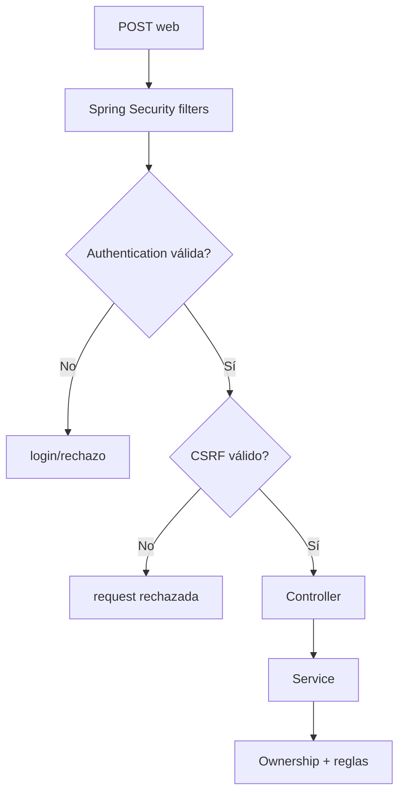
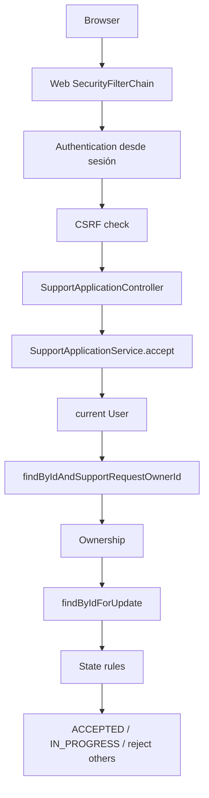
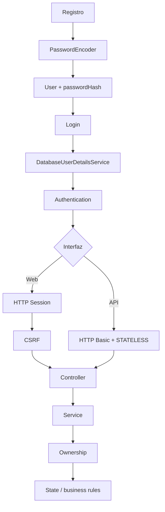

# 26 — CSRF, sesión y seguridad web

Este capítulo cierra el bloque de Seguridad.

Ya sabemos que la web de PetMatch usa:

```text
form login
+
usuarios de base de datos
+
PasswordEncoder
+
SecurityFilterChain
+
ownership en Services
```

Pero falta entender una diferencia fundamental frente a la API:

> **Después de iniciar sesión una vez, ¿cómo recuerda la web quién es el usuario en las siguientes peticiones y cómo evita que otro sitio aproveche esa sesión para enviar operaciones POST en su nombre?**

La respuesta combina dos mecanismos distintos:

```text
HTTP Session
+
CSRF protection
```

---

# 1. El problema de recordar autenticación

Imagina que el usuario inicia sesión correctamente:

```text
POST /login
email + password válidos
```

Después visita:

```text
GET /pets
GET /support-requests
POST /support-requests/42/cancel
```

Sería incómodo e inseguro exigir que el navegador reenviara manualmente:

```text
email
password
```

en cada formulario.

La web usa una sesión autenticada.

---

# 2. Estado web vs stateless API

PetMatch tiene dos modelos distintos.

## Web

```text
form login
→ autenticación persistida entre requests
→ HTTP Session
```

## API `/api/**`

```text
HTTP Basic
→ credenciales por request
→ SessionCreationPolicy.STATELESS
```

No debemos mezclar ambos modelos.

---

# 3. La evidencia en `SecurityConfig`

La cadena API declara explícitamente:

```java
.sessionManagement(session -> session
    .sessionCreationPolicy(
        SessionCreationPolicy.STATELESS
    )
)
```

La cadena web no contiene esa configuración.

Además usa:

```java
.formLogin(...)
```

Por tanto el diseño observable es:

```text
API
→ stateless explícito

Web
→ form login con persistencia de autenticación de sesión estándar
```

---

# 4. ¿Qué es una HTTP Session?

Una sesión permite asociar varias peticiones HTTP del mismo cliente con estado mantenido por el servidor.

Modelo mental:

```text
Request 1: login válido
↓
servidor asocia autenticación a una sesión
↓
cliente conserva identificador de sesión
↓
Request 2 /pets
↓
servidor recupera contexto autenticado
```

El protocolo HTTP por sí mismo es stateless; la sesión añade una capa de continuidad.

---

# 5. `Authentication` vuelve a estar disponible

Después del login, un Controller puede recibir:

```java
Authentication authentication
```

sin volver a procesar el formulario de login.

Los Services hacen después:

```java
userService.getCurrentUser(authentication)
```

Eso permite mantener el flujo:

```text
sesión autenticada
→ Authentication
→ current User
→ ownership
```

---

# 6. SecurityContext

Spring Security representa la identidad actual mediante conceptos como:

```text
SecurityContext
Authentication
principal
authorities
```

Para el aprendiz, una primera relación útil es:

```text
SecurityContext
└── Authentication
    ├── principal
    ├── authorities
    └── estado authenticated
```

En el flujo web estándar, Spring Security puede persistir y restaurar ese contexto entre requests.

---

# 7. PetMatch no administra la sesión manualmente

El proyecto no contiene código como:

```java
request.getSession().setAttribute(
    "currentUser",
    user
);
```

ni Controllers que reconstruyan manualmente la autenticación en cada request.

El framework gestiona esa infraestructura.

Esto mantiene los Controllers enfocados en MVC y los Services en negocio.

---

# 8. La sesión no guarda necesariamente la Entity `User`

Un error conceptual sería pensar:

```text
la sesión de PetMatch guarda toda la Entity User
```

El código del proyecto no hace eso manualmente.

Lo que los Services reciben es:

```text
Authentication
```

Y `UserService` vuelve a resolver la Entity por email:

```text
Authentication.getName()
↓
findByEmail(...)
↓
User Entity
```

---

# 9. ¿Por qué volver a la base?

La identidad de seguridad y la Entity de dominio cumplen roles diferentes.

```text
Authentication
→ quién está autenticado

User Entity
→ id, relaciones y estado persistente del dominio
```

Eso permite que ownership use siempre el usuario persistente actual.

---

# 10. Logout

La navegación real contiene:

```html
<form th:action="@{/logout}" method="post">
    <button type="submit">
        Cerrar sesión
    </button>
</form>
```

Y `SecurityConfig` contiene:

```java
.logout(logout -> logout
    .logoutSuccessUrl("/?logout")
)
```

No existe un `LogoutController` propio.

Spring Security gestiona el endpoint de logout configurado.

---

# 11. ¿Por qué logout es POST?

Cerrar sesión modifica estado de seguridad.

En PetMatch se envía mediante:

```text
POST /logout
```

no mediante un simple link GET.

Esto se alinea con la idea general:

```text
GET
→ lectura/navegación

POST
→ operación que cambia estado
```

Y hace relevante la protección CSRF.

---

# 12. El problema CSRF

CSRF significa:

```text
Cross-Site Request Forgery
```

O falsificación de petición entre sitios.

Escenario conceptual:

1. Ana inicia sesión en PetMatch.
2. Su navegador conserva la sesión autenticada.
3. Ana visita otro sitio controlado por un atacante.
4. Ese sitio intenta provocar una petición hacia PetMatch.
5. El navegador podría adjuntar automáticamente credenciales asociadas al sitio destino, como cookies de sesión, según las reglas del navegador.
6. Sin una defensa adicional, PetMatch podría confundir la petición forjada con una acción intencional de Ana.

---

# 13. Ejemplo conceptual de ataque

Un sitio malicioso podría intentar incluir algo como:

```html
<form
    action="https://petmatch.example/support-requests/42/cancel"
    method="post">
</form>
```

y provocar su envío.

El atacante no necesita conocer necesariamente la contraseña del usuario si consigue aprovechar credenciales que el navegador adjunta automáticamente.

Ese es el problema que CSRF intenta mitigar.

---

# 14. ¿Qué aporta un token CSRF?

Además de la sesión, el servidor exige un valor que el atacante externo no debería poder conocer/producir correctamente para esa sesión/request.

Modelo mental simplificado:

```text
session cookie válida
+
CSRF token válido
→ POST aceptable
```

Mientras:

```text
session cookie válida
+
token ausente/incorrecto
→ request rechazada
```

---

# 15. CSRF no autentica al usuario

El token CSRF no reemplaza:

```text
login
password
Authentication
```

Responde a otra pregunta:

> **¿Esta operación mutante proviene de un flujo legítimo asociado a la aplicación/sesión y no solo de una petición forjada desde otro origen?**

Por tanto:

```text
Authentication
≠
CSRF protection
```

---

# 16. CSRF tampoco autoriza ownership

Una request puede traer un token CSRF válido y aun así intentar:

```text
POST /pets/999/delete
```

si Pet 999 pertenece a otra persona.

Entonces:

```text
CSRF ✅
Authentication ✅
Ownership ❌
```

Y `PetService.findOwnedPet(...)` debe rechazar el recurso.

---

# 17. La cadena web NO desactiva CSRF

`webSecurityFilterChain(...)` no contiene:

```java
.csrf(csrf -> csrf.disable())
```

Por tanto PetMatch conserva la protección CSRF estándar de Spring Security en la web.

Esto es una diferencia explícita frente a `/api/**`.

---

# 18. La cadena API sí desactiva CSRF

Código real:

```java
.csrf(csrf -> csrf.disable())
```

pero únicamente dentro de:

```java
@Order(1)
SecurityFilterChain apiSecurityFilterChain(...)
```

que tiene:

```java
.securityMatcher("/api/**")
```

Así:

```text
/api/**
→ CSRF deshabilitado por esa chain
```

No significa:

```text
CSRF deshabilitado globalmente en toda PetMatch
```

---

# 19. ¿Por qué web y API son diferentes?

La web se autentica mediante una sesión que el navegador utiliza automáticamente en navegación y formularios posteriores.

La API actual usa:

```text
HTTP Basic
+
STATELESS
```

Cada request API presenta sus propias credenciales de autenticación y la chain no mantiene una sesión de seguridad para las siguientes llamadas.

Por eso PetMatch configura CSRF de forma diferente en cada interfaz.

---

# 20. No generalices “REST nunca necesita CSRF”

La conclusión correcta no es:

```text
REST = CSRF off siempre
```

La pregunta relevante es:

```text
¿cómo se autentica el cliente?
¿qué credenciales adjunta automáticamente el navegador?
¿hay cookies/sesión involucradas?
```

PetMatch desactiva CSRF en su API porque su implementación actual es HTTP Basic + stateless.

Otros diseños pueden requerir otro análisis.

---

# 21. ¿Dónde está `_csrf` en los templates?

Al inspeccionar el repositorio no encontramos campos escritos manualmente como:

```html
<input
    type="hidden"
    name="_csrf"
    ...>
```

Eso no significa que la web haya desactivado CSRF.

La configuración demuestra lo contrario.

---

# 22. Integración Thymeleaf + Spring Security

Spring Security se integra con Spring MVC y tecnologías de vista como Thymeleaf para incorporar el token CSRF en formularios con métodos inseguros durante el renderizado.

Por eso un template fuente puede verse así:

```html
<form th:action="@{/logout}" method="post">
```

sin contener manualmente un `<input name="_csrf">`, mientras el HTML renderizado para el cliente puede incluir el campo necesario mediante la infraestructura del framework.

> [!IMPORTANT]
> Distinción:
>
> ```text
> archivo .html del repositorio
> ≠
> HTML final después de Thymeleaf/Spring Security
> ```

Referencia oficial: [Spring Security — CSRF / HTML Forms](https://docs.spring.io/spring-security/reference/7.1/servlet/exploits/csrf.html).

---

# 23. Token CSRF y código fuente de los formularios

Sería incorrecto documentar:

> “`navigation.html` contiene `<input name="_csrf">`”.

No lo contiene.

Lo correcto es:

> “La web mantiene CSRF y la integración de Spring Security con Thymeleaf puede añadir el token necesario al HTML renderizado para formularios POST”.

Esta precisión separa código fuente de comportamiento del framework.

---

# 24. Formularios POST sensibles de PetMatch

La web realiza cambios mediante POST, por ejemplo:

```text
POST /pets
POST /pets/{id}
POST /pets/{id}/delete
POST /support-requests
POST /support-requests/{id}
POST /support-requests/{id}/cancel
POST /support-requests/{id}/complete
POST /support-applications/request/{id}
POST /support-applications/{id}/accept
POST /support-applications/{id}/reject
POST /logout
```

Son precisamente operaciones para las que una sesión autenticada robada/aprovechada por una petición forjada sería peligrosa.

---

# 25. CSRF actúa antes del Service

Modelo conceptual:



La request no debería llegar a la lógica de negocio si falla una protección previa del filtro.

---

# 26. CSRF no reemplaza validación

Supón un formulario de mascota con:

```text
CSRF válido
```

pero:

```text
age = -5
```

El token solo indica legitimidad del request respecto al mecanismo CSRF.

Después Bean Validation aún debe rechazar:

```text
@Min(0)
```

Por tanto:

```text
CSRF
≠
validation
```

---

# 27. Una defensa por capas

Una operación web mutante atraviesa varias barreras:

```text
SecurityFilterChain
↓
Authentication
↓
CSRF
↓
MVC binding
↓
Bean Validation
↓
Service ownership
↓
reglas de estado
↓
DB constraints / transaction
```

Cada una resuelve un problema diferente.

---

# 28. Sesión y ownership trabajan juntas

La sesión permite recuperar:

```text
Authentication
```

`UserService` convierte:

```text
Authentication.getName()
→ current User
```

Y los Services usan:

```text
currentUser.id
```

para queries como:

```text
findByIdAndOwnerId
```

Por tanto la sesión no es el final de la seguridad; es la fuente de identidad para controles posteriores.

---

# 29. Session fixation

Existe un riesgo llamado **session fixation**:

```text
atacante intenta hacer que la víctima use
un identificador de sesión conocido por él
↓
víctima inicia sesión
↓
atacante intenta reutilizar esa misma sesión autenticada
```

Spring Security aplica protección contra session fixation en su flujo estándar de autenticación de sesión.

En entornos Servlet modernos, la estrategia estándar puede cambiar el identificador de la sesión al autenticarse.

PetMatch no define una estrategia personalizada en `SecurityConfig`, por lo que no debemos atribuirle una configuración manual que no existe.

Referencia oficial: [Spring Security — Authentication Persistence and Session Management](https://docs.spring.io/spring-security/reference/7.1/servlet/authentication/session-management.html).

---

# 30. Framework default vs código del proyecto

Distinguimos:

## Configuración actual de PetMatch

```text
formLogin configurado
web no es STATELESS
web no desactiva CSRF
logout configurado
```

## Comportamiento estándar de Spring Security

```text
persistencia/restauración del contexto de autenticación
integración CSRF con Thymeleaf
protección de session fixation
```

## Configuración personalizada no presente

```text
maximumSessions
custom session fixation strategy
custom SecurityContextRepository
remember-me
custom CSRF token repository
```

---

# 31. PetMatch no configura concurrencia de sesiones

No aparece algo como:

```java
.maximumSessions(...)
```

Por tanto el código actual no define explícitamente:

```text
máximo una sesión por usuario
expulsar sesiones anteriores
```

Esas políticas no están configuradas en el proyecto.

---

# 32. PetMatch no implementa Remember Me

No aparece:

```java
.rememberMe(...)
```

Así que no documentamos una cookie persistente de “recordarme” como funcionalidad actual.

La continuidad web estudiada aquí es la sesión normal de autenticación.

---

# 33. PetMatch no configura timeout de sesión propio

`application.yaml` no define una política explícita de timeout de sesión.

Por tanto no debemos afirmar:

```text
“la sesión expira exactamente en 30 minutos”
```

como decisión propia del proyecto.

El comportamiento efectivo dependerá de defaults/configuración del entorno si no se especifica otra cosa.

---

# 34. No asumir nombre exacto de cookie como decisión de PetMatch

En aplicaciones Servlet es común encontrar un identificador de sesión transportado en una cookie como `JSESSIONID`.

Pero PetMatch no contiene una configuración personalizada de nombre de cookie que debamos enseñar como parte del diseño propio.

La idea importante para este libro es:

```text
el navegador conserva un identificador de sesión
```

no memorizar un nombre de cookie como si fuera lógica del proyecto.

---

# 35. Logout y limpieza de contexto

La finalidad del logout es terminar la autenticación web activa de ese flujo y dirigir después al usuario a:

```text
/?logout
```

El framework gestiona el proceso de seguridad.

No debemos simular logout con algo como:

```text
redirigir a /login
```

sin invalidar el estado autenticado.

---

# 36. El botón de logout solo aparece autenticado

`navigation.html` contiene:

```html
<div sec:authorize="isAuthenticated()">
```

Dentro aparecen:

```text
email/principal
form de logout
```

Esto es UX basada en seguridad.

El endpoint sigue protegido por el mecanismo real de Spring Security, no por la mera visibilidad del botón.

---

# 37. `sec:authentication="name"`

La navegación muestra:

```html
<span sec:authentication="name"></span>
```

En el diseño actual:

```text
authentication name
→ email
```

porque el `UserDetails` se construye con el email como username.

Así la sesión autenticada también puede reflejar identidad en la UI.

---

# 38. API sin sesión de seguridad reutilizable

La cadena API contiene:

```text
SessionCreationPolicy.STATELESS
```

Eso expresa que Spring Security no debe usar una sesión de autenticación como mecanismo para conservar el login entre requests API.

Por eso un cliente API debe presentar autenticación de nuevo en cada request según el mecanismo actual:

```text
HTTP Basic
```

---

# 39. Evidencia en `RestApiIntegrationTests`

La prueba hace:

```java
mockMvc.perform(
    post("/api/v1/pets")
        .with(httpBasic(email, password))
        ...
)
.andExpect(status().isCreated());
```

El test se llama:

```text
authenticatedUserCanCreatePetThroughApiWithoutCsrfToken
```

Esto confirma el comportamiento esperado de la chain `/api/**`:

```text
Basic válido
+
sin token CSRF
→ request API permitida
```

---

# 40. Lo que esa prueba NO demuestra

No demuestra:

```text
CSRF está desactivado en la web
```

porque la request probada es:

```text
/api/v1/pets
```

Y esa URL cae en la chain API específica.

Esta distinción entre cadenas es esencial.

---

# 41. ¿Hay una prueba web CSRF explícita?

Las pruebas actuales no incluyen una prueba dedicada del tipo:

```text
POST web sin csrf → 403
POST web con csrf → éxito
```

Por tanto no debemos afirmar que existe esa cobertura automatizada concreta.

La protección web se deduce de:

```text
SecurityConfig
+
comportamiento estándar de Spring Security
+
integración Thymeleaf
```

no de un test web CSRF dedicado.

---

# 42. ¿Debería probarse CSRF explícitamente?

Como práctica de calidad, podría ser útil añadir pruebas que verifiquen la política web de seguridad.

Pero eso sería una mejora futura de cobertura.

No forma parte de la implementación de tests que estamos documentando como existente.

---

# 43. Sesión ≠ base de datos

La sesión mantiene contexto de interacción/autenticación.

La base de datos mantiene estado persistente del dominio.

Ejemplo:

```text
sesión
→ quién está autenticado ahora

users table
→ cuenta persistente

pets table
→ mascotas

support_requests
→ solicitudes
```

No deben confundirse.

---

# 44. Sesión ≠ caché de dominio

Tampoco deberíamos usar la sesión como solución para guardar:

```text
todas las Pets
SupportRequests
SupportApplications
```

El proyecto consulta esos datos mediante Services/Repositories.

La sesión se relaciona aquí principalmente con la continuidad de autenticación web.

---

# 45. CSRF ≠ CORS

Son problemas diferentes.

## CSRF

```text
impedir operaciones forjadas que aprovechan credenciales del usuario
```

## CORS

```text
política del navegador para permitir/restringir ciertas solicitudes cross-origin accesibles desde scripts
```

PetMatch no contiene una configuración CORS que debamos desarrollar como parte central de este bloque.

No uses ambos términos como sinónimos.

---

# 46. CSRF ≠ XSS

También son riesgos diferentes.

## CSRF

```text
forzar request usando contexto autenticado de la víctima
```

## XSS

```text
inyectar/ejecutar script no confiable en una página
```

El uso de `th:text` explicado en Thymeleaf ayuda a escapar texto en presentación, pero no convierte este capítulo en un análisis completo de XSS.

---

# 47. HTTPS sigue siendo necesario

CSRF y password hashing no sustituyen HTTPS.

Credenciales, cookies y datos de usuario deben viajar sobre transporte seguro en un despliegue real.

El proyecto no contiene una terminación TLS/HTTPS propia como parte de su infraestructura.

Por tanto tratamos HTTPS como requisito operacional general, no como feature implementada por código en PetMatch.

---

# 48. Seguridad web completa de una operación

Ejemplo:

```text
POST /support-applications/{applicationId}/accept
```

Recorrido:



Este único flujo conecta prácticamente todos los bloques anteriores.

---

# 49. Defensa por capas de `accept`

| Capa | Pregunta |
|---|---|
| Filter chain | ¿está autenticado? |
| Session | ¿qué identidad corresponde a esta navegación? |
| CSRF | ¿el POST web tiene token válido? |
| Controller | ¿qué endpoint/param se invocó? |
| Service ownership | ¿el current user es owner de la request? |
| State machine | ¿request OPEN y application PENDING? |
| Lock | ¿cómo serializamos aceptación concurrente? |
| Transaction | ¿cómo agrupamos el cambio? |
| DB | ¿cómo persistimos integridad? |

Seguridad no es una única anotación.

---

# 50. ⚠️ Errores frecuentes

## Error 1 — “Ya tengo sesión, no necesito CSRF”

Precisamente las credenciales automáticas de sesión hacen relevante CSRF.

## Error 2 — Desactivar CSRF globalmente porque molesta en formularios

PetMatch solo lo desactiva en la chain `/api/**`.

## Error 3 — Escribir un `_csrf` fijo en HTML

El token debe corresponder al mecanismo del framework/request, no ser una constante.

## Error 4 — Decir que el template fuente ya contiene `_csrf`

No aparece escrito manualmente en el repositorio.

## Error 5 — Pensar que token CSRF autoriza el recurso

Ownership sigue siendo necesario.

## Error 6 — Pensar que CSRF valida campos

Bean Validation sigue siendo necesaria.

## Error 7 — Hacer logout con un redirect sin limpiar autenticación

Debe intervenir el mecanismo de logout de seguridad.

## Error 8 — Decir que la API reutiliza la sesión web

La chain API es `STATELESS`.

## Error 9 — Confundir CSRF con CORS o XSS

Son problemas diferentes.

## Error 10 — Inventar timeout, remember-me o máximo de sesiones

No están configurados explícitamente en el proyecto actual.

---

# 51. 🛠 Prueba en el código

## Actividad 1 — Compara las chains

En `SecurityConfig`, construye una tabla:

| Propiedad | Web | API |
|---|---|---|
| matcher | fallback web | `/api/**` |
| login | form login | HTTP Basic |
| session | stateful estándar | STATELESS |
| CSRF | habilitado por default | disabled |

## Actividad 2 — Busca `_csrf`

Busca literalmente:

```text
_csrf
```

en `templates/`.

Comprueba que no está escrito manualmente.

Luego explica por qué eso no significa que la protección web esté apagada.

## Actividad 3 — Logout

Sigue:

```text
navigation.html
→ POST /logout
→ SecurityConfig.logout
→ /?logout
```

Identifica qué parte implementa UI y qué parte implementa seguridad.

## Actividad 4 — API sin CSRF

Abre:

```text
RestApiIntegrationTests
```

y explica por qué:

```text
POST /api/v1/pets
```

puede funcionar sin token CSRF pero requiere HTTP Basic.

## Actividad 5 — Operación completa

Dibuja `accept` incluyendo:

```text
session
CSRF
Controller
Service
ownership
lock
state
transaction
```

---

# 52. 🧪 Comprueba que entendiste

1. ¿Para qué sirve una sesión web después del login?
2. ¿PetMatch guarda manualmente la Entity User en `HttpSession`?
3. ¿Qué objeto reciben Controllers para conocer la identidad?
4. ¿Qué diferencia hay entre web y API respecto a session state?
5. ¿Qué significa CSRF?
6. ¿Por qué una sesión autenticada puede hacer relevante CSRF?
7. ¿La chain web desactiva CSRF?
8. ¿Dónde se desactiva explícitamente?
9. ¿Los templates contienen `_csrf` escrito manualmente?
10. ¿Cómo puede aparecer entonces el token en formularios renderizados?
11. ¿Un token CSRF válido concede ownership?
12. ¿CSRF reemplaza Bean Validation?
13. ¿Qué endpoint usa PetMatch para logout?
14. ¿Existe `LogoutController` propio?
15. ¿PetMatch configura maximum sessions?
16. ¿Configura remember-me?
17. ¿Existe una prueba web CSRF explícita?
18. ¿Por qué el test API sin CSRF no demuestra que CSRF esté desactivado globalmente?
19. ¿Qué diferencia hay entre CSRF y CORS?
20. ¿Qué diferencia hay entre sesión y base de datos?

### Respuestas esperadas

1. Mantener/restaurar identidad autenticada entre requests web.
2. No en el código actual.
3. `Authentication`.
4. Web conserva autenticación por sesión; API declara `STATELESS`.
5. Cross-Site Request Forgery.
6. Porque el navegador puede adjuntar automáticamente credenciales de sesión a peticiones hacia el sitio.
7. No.
8. En `apiSecurityFilterChain` para `/api/**`.
9. No.
10. Mediante integración Spring Security/Spring MVC/Thymeleaf durante renderizado.
11. No.
12. No.
13. `POST /logout`.
14. No.
15. No de forma explícita.
16. No.
17. No en las pruebas actuales.
18. Porque el request pertenece a `/api/**`, cuya chain específica desactiva CSRF.
19. CSRF protege contra requests forjadas con credenciales; CORS controla acceso cross-origin del navegador a respuestas/requests según política.
20. La sesión mantiene contexto temporal de interacción/autenticación; DB mantiene estado persistente del dominio.

---

# 53. ✅ Qué debes recordar

- **La web de PetMatch usa autenticación persistida entre requests; la API usa seguridad stateless.**
- `Authentication` se recupera para la request web sin reenviar password en cada operación.
- PetMatch no administra manualmente `HttpSession` en sus Controllers.
- La chain web conserva CSRF; la chain `/api/**` lo desactiva explícitamente.
- CSRF protege operaciones frente a requests forjadas que intentan aprovechar credenciales del navegador.
- CSRF no autentica, no autoriza ownership y no valida campos.
- Los templates no contienen `_csrf` escrito manualmente.
- La integración con Thymeleaf puede incorporar automáticamente el token en el HTML renderizado de formularios POST.
- Archivo fuente y HTML renderizado no son lo mismo.
- Logout se realiza con `POST /logout` y es gestionado por Spring Security.
- Spring Security proporciona comportamiento estándar de persistencia del contexto y protección contra session fixation; PetMatch no configura estrategias personalizadas para este comportamiento.
- No hay `maximumSessions`, remember-me ni timeout propio documentado en el código actual.
- El test REST confirma POST API sin CSRF, no ausencia global de CSRF.
- CSRF, CORS y XSS son problemas distintos.
- Una operación segura combina filtros, sesión, CSRF, validation, ownership, estados, transacción y DB.

---

# Cierre del bloque 04 — Seguridad

Con los capítulos 22–26 podemos recorrer la seguridad completa de PetMatch:



Ahora deberías poder responder:

```text
¿quién es el usuario?
¿cómo se verificó su password?
¿qué chain recibió la request?
¿se conserva sesión o es stateless?
¿requiere CSRF?
¿qué rol posee?
¿es owner/applicant/outsider respecto al recurso?
¿el estado permite la acción?
```

Con eso podemos entrar al siguiente bloque y estudiar formalmente la segunda interfaz de PetMatch: **REST + JSON**.

---

# 🔗 Siguiente bloque

Continúa con:

**[Bloque 05 — REST →](../05-rest/README.md)**

Comienza con:

**[Capítulo 27 — REST API →](../05-rest/27-rest-api.md)**

---

[← Capítulo 25 — Autorización y ownership](25-autorizacion-y-ownership.md) · [Índice del bloque](README.md) · [Índice general](../README.md) · [Siguiente bloque → REST](../05-rest/README.md)