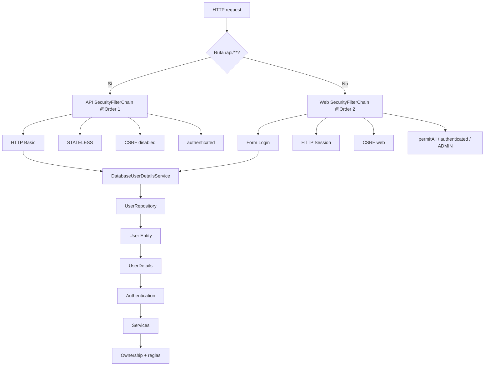
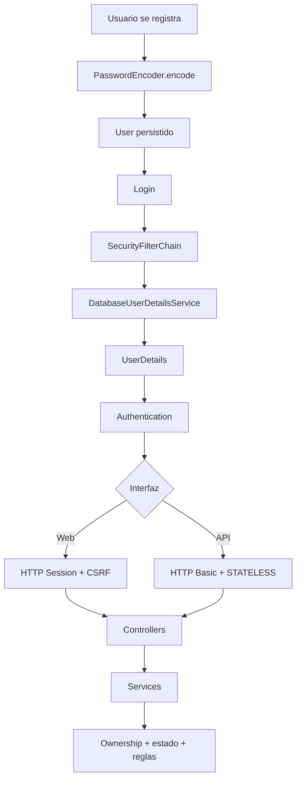

# Bloque 04 — Seguridad

Hasta aquí PetMatch ya puede:

```text
recibir peticiones HTTP
→ mostrar HTML
→ procesar formularios
→ validar entrada
→ ejecutar Services
→ persistir datos
```

Pero una aplicación multiusuario necesita responder preguntas adicionales:

> **¿Quién es el usuario? ¿Cómo demuestra su identidad? ¿Qué rutas puede abrir? ¿Qué recursos puede modificar? ¿Cómo se protege su contraseña? ¿Qué diferencia hay entre seguridad web con sesión y seguridad REST stateless?**

Este bloque estudia la implementación real de **Spring Security** en PetMatch Community.

> [!IMPORTANT]
> **Bloque 04 completo.** Los capítulos 22–26 están disponibles y forman un recorrido continuo desde autenticación hasta sesión, CSRF y ownership.

---

## Qué aprenderás en este bloque

Al terminar Seguridad deberías poder explicar, usando código real del proyecto:

- qué diferencia hay entre autenticación y autorización;
- cómo PetMatch registra usuarios y cómo luego Spring Security los autentica;
- qué papel cumple `DatabaseUserDetailsService`;
- por qué `UserDetailsService` recibe un username aunque PetMatch use email para iniciar sesión;
- cómo se transforma una Entity `User` en `UserDetails`;
- cómo el campo `active` termina afectando `disabled(...)`;
- qué es un `SecurityFilterChain`;
- por qué PetMatch tiene dos filter chains distintas;
- qué hacen `@Order(1)` y `@Order(2)` conceptualmente;
- cómo `securityMatcher("/api/**")` separa la política REST;
- qué rutas web son públicas;
- qué rutas requieren autenticación;
- qué significa `hasRole("ADMIN")`;
- por qué la regla `/admin/**` no implica un módulo administrativo implementado;
- cómo funciona el login por formulario;
- por qué el parámetro de username se llama `email`;
- cómo Spring Security gestiona el logout;
- qué es un `PasswordEncoder`;
- por qué PetMatch no guarda contraseñas en texto plano;
- qué aporta un `DelegatingPasswordEncoder`;
- qué diferencia hay entre password hashing y cifrado reversible;
- qué significa ownership y por qué no se resuelve solamente con roles;
- cómo Services verifican recursos del usuario actual;
- por qué ocultar botones con Thymeleaf no sustituye autorización backend;
- qué papel cumple la sesión HTTP en la interfaz web;
- qué es CSRF y por qué importa para formularios autenticados;
- por qué la web mantiene CSRF mientras `/api/**` lo desactiva;
- por qué la API usa `SessionCreationPolicy.STATELESS`;
- cómo funciona HTTP Basic en la API actual;
- por qué PetMatch no usa JWT/OAuth2 en la implementación actual.

---

## Prerrequisitos

Antes de este bloque conviene dominar:

- [inyección de dependencias](../01-fundamentos/08-inyeccion-de-dependencias.md);
- [Service y reglas de negocio](../02-dominio-y-persistencia/13-service-y-reglas-de-negocio.md);
- [máquinas de estado](../02-dominio-y-persistencia/15-maquinas-de-estado.md);
- [Spring MVC](../03-web-mvc/18-spring-mvc.md);
- [Thymeleaf](../03-web-mvc/19-thymeleaf.md);
- [Form DTO](../03-web-mvc/20-formularios-y-form-dto.md);
- [Validación](../03-web-mvc/21-validacion.md).

---

## Capítulos

22. [Autenticación](22-autenticacion.md)
23. [Spring Security](23-spring-security.md)
24. [Contraseñas y `PasswordEncoder`](24-contrasenas-y-password-encoder.md)
25. [Autorización y ownership](25-autorizacion-y-ownership.md)
26. [CSRF, sesión y seguridad web](26-csrf-sesion-y-seguridad-web.md)

---

# El mapa de seguridad real

La configuración principal está en:

```text
src/main/java/com/petmatch/community/config/SecurityConfig.java
```

Y la carga de usuarios para autenticación está en:

```text
src/main/java/com/petmatch/community/security/DatabaseUserDetailsService.java
```

La arquitectura básica es:



---

# 1. Dos `SecurityFilterChain`

PetMatch no usa una única política para todo.

## API

```java
@Bean
@Order(1)
SecurityFilterChain apiSecurityFilterChain(HttpSecurity http)
```

Se aplica a:

```java
.securityMatcher("/api/**")
```

Y configura:

```text
cualquier request API → authenticated
SessionCreationPolicy.STATELESS
CSRF disabled
HTTP Basic
```

## Web

```java
@Bean
@Order(2)
SecurityFilterChain webSecurityFilterChain(HttpSecurity http)
```

Configura:

```text
rutas públicas
rutas autenticadas
/admin/** con rol ADMIN
form login
logout
CSRF estándar
sesión web
```

El [capítulo 23](23-spring-security.md) explica cómo matcher, orden y reglas internas determinan qué política recibe cada request.

---

# 2. Autenticación

El login web real se configura con:

```java
.formLogin(form -> form
    .loginPage("/login")
    .usernameParameter("email")
    .defaultSuccessUrl("/", true)
    .permitAll()
)
```

No existe un Controller que procese manualmente el POST de credenciales y compare passwords.

Spring Security gestiona ese flujo.

`AuthController` sirve GET `/login` y maneja registro.

El [capítulo 22](22-autenticacion.md) sigue el recorrido:

```text
login.html
→ POST /login
→ Spring Security
→ DatabaseUserDetailsService
→ UserRepository
→ UserDetails
→ Authentication
```

---

# 3. Entity `User` vs `UserDetails`

`DatabaseUserDetailsService` adapta:

```text
user.email        → username
user.passwordHash → password
user.role         → roles(...)
user.active       → disabled(!active)
```

No son el mismo modelo:

```text
User Entity
→ dominio/persistencia

UserDetails
→ contrato de seguridad
```

---

# 4. Contraseñas

`SecurityConfig` declara:

```java
@Bean
PasswordEncoder passwordEncoder() {
    return PasswordEncoderFactories
        .createDelegatingPasswordEncoder();
}
```

Y `UserService.register(...)` utiliza:

```java
passwordEncoder.encode(form.getPassword())
```

La Entity almacena:

```text
passwordHash
```

no texto plano.

El [capítulo 24](24-contrasenas-y-password-encoder.md) conecta:

```text
raw password
→ encode
→ passwordHash
→ UserDetails
→ verificación de login
```

sin inventar un algoritmo concreto como decisión explícita del proyecto.

---

# 5. Rol vs ownership

PetMatch tiene:

```text
USER
ADMIN
```

pero muchas autorizaciones no dependen del rol global.

Dependen de la relación con un recurso:

```text
Pet.owner
SupportRequest.owner
SupportApplication.applicant
SupportApplication.supportRequest.owner
```

El [capítulo 25](25-autorizacion-y-ownership.md) desarrolla el patrón:

```text
Authentication
→ current User
→ currentUser.id
→ findByIdAndOwnerId(...)
```

y variantes como:

```text
findByIdAndSupportRequestOwnerId(...)
```

---

# 6. Autorización en dos niveles

PetMatch combina:

```text
SecurityFilterChain
→ acceso general por ruta / autenticación / rol
```

con:

```text
Service + Repository
→ ownership + estado + reglas del recurso
```

Ejemplo:

```text
usuario autenticado
≠
puede editar cualquier mascota
```

La filter chain permite llegar a `/pets/**` a un usuario autenticado, pero `PetService.findOwnedPet(...)` determina qué Pet concreta pertenece al usuario actual.

---

# 7. Visibilidad también es autorización

`SupportRequestService.findVisibleRequest(...)` permite:

```text
request OPEN
→ visible para usuarios autenticados del flujo
```

Y cuando deja de estar OPEN:

```text
owner → visible
applicant relacionado → visible
outsider → NotFound
```

Esto demuestra que autorización puede depender de:

```text
identidad
+
relación con recurso
+
estado
```

---

# 8. Sesión web

La web usa form login y no configura `STATELESS`.

Spring Security conserva/restaura la autenticación web mediante su infraestructura estándar de sesión.

Eso permite:

```text
login una vez
→ /pets
→ /support-requests
→ /support-applications
```

sin reenviar la contraseña en cada formulario.

El [capítulo 26](26-csrf-sesion-y-seguridad-web.md) explica la relación:

```text
HTTP Session
→ Authentication
→ current User
→ ownership
```

---

# 9. CSRF web

En la chain web no aparece:

```java
csrf.disable()
```

Por tanto se conserva la protección CSRF estándar.

En cambio `/api/**` declara explícitamente:

```java
.csrf(csrf -> csrf.disable())
```

El capítulo 26 explica por qué:

```text
web con sesión
```

y:

```text
API HTTP Basic + STATELESS
```

requieren un análisis diferente.

También documenta con precisión que los templates fuente no contienen un `<input name="_csrf">` escrito manualmente: la integración Spring Security/Thymeleaf puede incorporar el token al HTML renderizado.

---

# 10. Logout

La navegación usa:

```html
<form th:action="@{/logout}" method="post">
```

Y la configuración:

```java
.logout(logout -> logout
    .logoutSuccessUrl("/?logout")
)
```

No existe un `LogoutController` propio.

Spring Security gestiona el proceso.

---

# 11. Seguridad visual vs seguridad real

Thymeleaf usa:

```text
sec:authorize="isAuthenticated()"
sec:authentication="name"
ownerView
condiciones por estado
```

Eso mejora UX.

Pero:

```text
ocultar botón
≠
proteger endpoint
```

Una petición puede construirse manualmente.

La protección real se mantiene en:

```text
SecurityFilterChain
+
CSRF
+
Service
+
Repository ownership query
+
reglas de estado
```

---

# 12. Evidencia en pruebas

`RestApiIntegrationTests` comprueba:

```text
GET /
→ 200

GET /api/v1/pets sin Basic
→ 401

GET /api/v1/pets con Basic válido
→ 200
```

Y confirma que un POST API autenticado puede ejecutarse sin token CSRF, coherente con la chain `/api/**`.

`MvpFlowIntegrationTests` comprueba, entre otras cosas:

```text
usuario ajeno no obtiene Pet owned
owner no puede auto-postularse
applicant relacionado puede ver request no OPEN
outsider no puede verla
```

Por tanto el repositorio tiene evidencia tanto de autenticación API como de ownership/visibilidad de negocio.

---

# Archivos centrales del bloque

```text
src/main/java/com/petmatch/community/config/SecurityConfig.java
src/main/java/com/petmatch/community/security/DatabaseUserDetailsService.java
src/main/java/com/petmatch/community/service/UserService.java
src/main/java/com/petmatch/community/service/PetService.java
src/main/java/com/petmatch/community/service/SupportRequestService.java
src/main/java/com/petmatch/community/service/SupportApplicationService.java
src/main/java/com/petmatch/community/model/User.java
src/main/java/com/petmatch/community/model/enums/Role.java
src/main/java/com/petmatch/community/repository/UserRepository.java
src/main/java/com/petmatch/community/repository/PetRepository.java
src/main/java/com/petmatch/community/repository/SupportRequestRepository.java
src/main/java/com/petmatch/community/repository/SupportApplicationRepository.java
src/main/java/com/petmatch/community/controller/AuthController.java
src/main/resources/templates/auth/login.html
src/main/resources/templates/auth/register.html
src/main/resources/templates/fragments/navigation.html
```

---

# Qué NO vamos a asumir

Este bloque no presenta como implementado:

- JWT;
- OAuth2;
- OpenID Connect;
- login con Google/GitHub/Facebook;
- 2FA;
- refresh tokens;
- API keys;
- SSO;
- LDAP;
- secrets manager;
- rate limiting;
- un módulo administrativo completo;
- method security con `@PreAuthorize` como mecanismo central actual;
- Spring Security ACL;
- recuperación/cambio de contraseña;
- lockout automático por intentos fallidos;
- remember-me;
- maximum sessions personalizado;
- timeout de sesión propio;
- configuración CORS propia.

Si alguna de estas ideas aparece después será únicamente como evolución no implementada.

---

# Recorrido mental del bloque



---

# Cómo estudiar este bloque

Para cada operación protegida pregunta:

1. ¿qué filter chain atiende la ruta?
2. ¿la ruta es pública o requiere autenticación?
3. ¿cómo se obtuvo el principal?
4. ¿qué `UserDetails` se cargó?
5. ¿qué rol tiene?
6. ¿la interfaz usa sesión o HTTP Basic?
7. ¿la petición web mutante requiere CSRF?
8. ¿el recurso requiere ownership?
9. ¿qué Service/Repository comprueba la relación?
10. ¿qué regla de estado/negocio falta después de autorizar?

No reduzcas Spring Security a “poner login”.

---

# Resultado esperado del bloque

Al finalizar deberías poder explicar un recorrido como:

```text
POST /support-applications/{id}/accept
↓
web SecurityFilterChain
↓
Authentication desde sesión
↓
CSRF
↓
Controller
↓
SupportApplicationService.accept
↓
current User
↓
findByIdAndSupportRequestOwnerId
↓
ownership
↓
findByIdForUpdate
↓
state rules
↓
transaction
```

Y distinguirlo de:

```text
POST /api/v1/...
↓
API SecurityFilterChain
↓
HTTP Basic
↓
STATELESS
↓
CSRF disabled para /api/**
↓
Service compartido
```

---

# Continúa después del bloque

El siguiente bloque ya está disponible:

**[Bloque 05 — REST →](../05-rest/README.md)**

Comienza con:

**[Capítulo 27 — REST API →](../05-rest/27-rest-api.md)**

---

[← Bloque 03 — Web MVC](../03-web-mvc/README.md) · [Índice general](../README.md) · [Capítulo 22 →](22-autenticacion.md) · [Siguiente bloque → REST](../05-rest/README.md)
