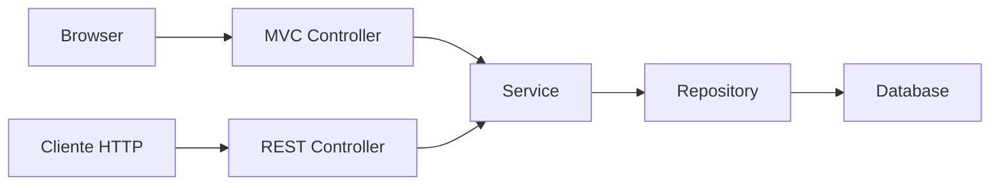
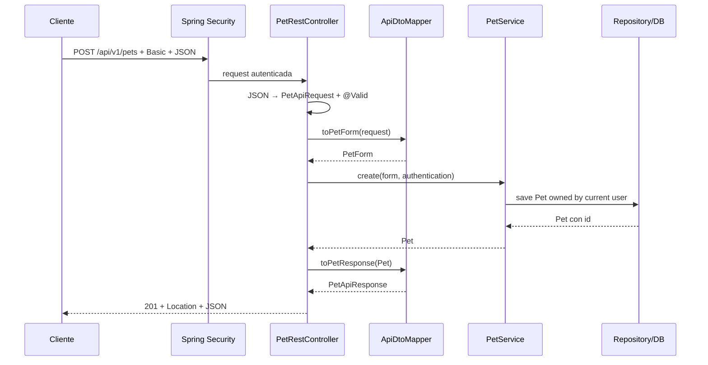

# 27 — REST API

En los capítulos anteriores vimos cómo PetMatch responde con HTML usando Spring MVC + Thymeleaf.

Ahora estudiaremos la segunda interfaz real de la aplicación:

```text
REST + JSON
```

La pregunta central es:

> **¿Cómo expone PetMatch los mismos casos de uso mediante HTTP y JSON sin duplicar las reglas de negocio?**

La respuesta está en tres Controllers:

```text
PetRestController
SupportRequestRestController
SupportApplicationRestController
```

que llaman a los mismos Services utilizados por la web MVC.

---

# 1. REST no significa “otra aplicación”

PetMatch no tiene:

```text
una aplicación MVC
+
otra aplicación REST separada
```

Tiene una sola aplicación con dos interfaces.



La capa de entrada cambia.

El negocio central no.

---

# 2. ¿Qué entendemos por API REST aquí?

Para este proyecto, la API ofrece recursos y operaciones mediante:

```text
URI
+
método HTTP
+
JSON request/response
+
status codes
```

Ejemplo:

```text
GET /api/v1/pets
```

significa conceptualmente:

> Obtener las mascotas visibles para el usuario autenticado según el caso de uso actual.

Mientras:

```text
POST /api/v1/pets
```

significa:

> Crear una nueva mascota para el usuario autenticado.

---

# 3. REST no es “JSON solamente”

JSON es el formato utilizado por PetMatch para los cuerpos de la API.

Pero una interacción HTTP también contiene:

```text
método
ruta
headers
status code
body opcional
```

Por ejemplo, crear una Pet produce:

```text
201 Created
Location: /api/v1/pets/{id}
Content-Type: application/json
body JSON
```

Por tanto estudiar una API significa estudiar más que el JSON.

---

# 4. `@RestController`

`PetRestController` comienza con:

```java
@RestController
@RequestMapping("/api/v1/pets")
public class PetRestController {
```

`@RestController` expresa que los valores devueltos por sus métodos forman parte del **response body**.

No se interpretan como nombres de vista Thymeleaf.

---

# 5. `@Controller` vs `@RestController`

En MVC vimos algo como:

```java
@Controller
public class PetController {

    @GetMapping
    public String list(...) {
        ...
        return "pets/list";
    }
}
```

Aquí:

```text
"pets/list"
→ nombre lógico de vista
```

En REST:

```java
@RestController
public class PetRestController {

    @GetMapping
    public List<PetApiResponse> findAll(...) {
        ...
    }
}
```

Aquí el valor retornado se convierte en el cuerpo HTTP.

---

# 6. No hay Thymeleaf en el Controller REST

`PetRestController` no usa:

```text
Model
RedirectAttributes
nombre de template
```

Tampoco devuelve:

```text
"pets/list"
```

Su responsabilidad es producir una representación HTTP/JSON.

---

# 7. Prefijo `/api/v1`

Las rutas REST actuales utilizan:

```text
/api/v1
```

Ejemplos:

```text
/api/v1/pets
/api/v1/support-requests
/api/v1/support-applications/mine
```

Ese prefijo cumple dos funciones visibles en PetMatch:

1. separa la API de las rutas web;
2. permite que `SecurityConfig` seleccione `/api/**` con otra `SecurityFilterChain`.

---

# 8. El significado de `v1`

El proyecto utiliza literalmente:

```text
/api/v1
```

Eso introduce una versión en la URI.

La versión actual no incluye:

```text
/api/v2
versionado por header
negociación de versiones
```

No aparecen en el código actual.

---

# 9. `PetRestController`: mapa completo

Base:

```text
/api/v1/pets
```

Métodos:

```text
GET    /api/v1/pets
GET    /api/v1/pets/{petId}
POST   /api/v1/pets
PUT    /api/v1/pets/{petId}
DELETE /api/v1/pets/{petId}
```

Es el recurso más parecido a un CRUD tradicional de la API.

---

# 10. GET collection

Código real:

```java
@GetMapping
public List<PetApiResponse> findAll(
    Authentication authentication
) {
    return petService
        .findCurrentUserPets(authentication)
        .stream()
        .map(ApiDtoMapper::toPetResponse)
        .toList();
}
```

Recorrido:

```text
GET /api/v1/pets
↓
Authentication
↓
PetService.findCurrentUserPets
↓
List<Pet>
↓
map to PetApiResponse
↓
List<PetApiResponse>
↓
JSON array
```

---

# 11. El GET no devuelve todas las Pets de la base

El método llama:

```java
findCurrentUserPets(authentication)
```

No:

```java
petRepository.findAll()
```

Así la API conserva el mismo ownership que la web.

Un cliente REST no recibe privilegios extra por usar JSON.

---

# 12. GET por id

Código real:

```java
@GetMapping("/{petId}")
public PetApiResponse findById(
    @PathVariable Long petId,
    Authentication authentication
) {
    return toPetResponse(
        petService.findOwnedPet(petId, authentication)
    );
}
```

La ruta contiene:

```text
{petId}
```

que Spring MVC REST convierte a:

```java
Long petId
```

mediante `@PathVariable`.

---

# 13. `@PathVariable` sigue siendo Spring MVC

Aunque hablamos de REST, el Controller sigue usando la infraestructura Spring MVC.

Conceptos como:

```text
@GetMapping
@PostMapping
@PathVariable
@RequestBody
```

pertenecen al stack web MVC utilizado por Spring Boot.

La diferencia principal está en la forma de representar la respuesta.

---

# 14. Crear una Pet

Código real:

```java
@PostMapping
public ResponseEntity<PetApiResponse> create(
    @Valid @RequestBody PetApiRequest request,
    Authentication authentication
) {
    Pet pet = petService.create(
        toPetForm(request),
        authentication
    );

    return ResponseEntity
        .created(
            URI.create("/api/v1/pets/" + pet.getId())
        )
        .body(toPetResponse(pet));
}
```

Este método concentra varios conceptos REST importantes.

---

# 15. `@RequestBody`

El cliente envía JSON como:

```json
{
  "name": "Luna",
  "species": "Perro",
  "age": 4,
  "description": "Sociable y acostumbrada a caminar."
}
```

`@RequestBody` indica que el contenido del cuerpo HTTP debe convertirse al tipo Java:

```java
PetApiRequest
```

El Controller no parsea manualmente el JSON con `String.split`, `Map` o código propio.

---

# 16. `@Valid` en REST

El parámetro declara:

```java
@Valid @RequestBody PetApiRequest request
```

Por tanto, después de convertir el JSON al DTO, se aplican sus constraints.

Ejemplos:

```text
@NotBlank name
@NotBlank species
@NotNull age
@Min(0) age
@Size description
```

La lógica de errores se estudiará en el capítulo 30.

---

# 17. JSON válido sintácticamente puede ser inválido semánticamente

Ejemplo:

```json
{
  "name": "",
  "species": "Perro",
  "age": -1
}
```

Es JSON bien formado.

Pero viola Bean Validation.

Esto puede producir:

```text
400 Bad Request
```

con errores de campos.

---

# 18. JSON ilegible es otro problema

Ejemplo conceptual:

```text
{ name: Luna
```

no puede convertirse correctamente al DTO esperado.

Eso es distinto de:

```text
JSON válido
pero campos inválidos
```

`ApiExceptionHandler` tiene handlers separados para ambos escenarios.

---

# 19. `ResponseEntity`

Crear una Pet no devuelve solamente:

```java
PetApiResponse
```

Devuelve:

```java
ResponseEntity<PetApiResponse>
```

Esto permite controlar explícitamente elementos HTTP como:

```text
status
headers
body
```

---

# 20. `201 Created`

Código:

```java
ResponseEntity.created(...)
```

produce una respuesta de creación:

```text
201 Created
```

No:

```text
200 OK
```

como status genérico para todo.

---

# 21. Header `Location`

La creación construye:

```java
URI.create("/api/v1/pets/" + pet.getId())
```

Por tanto el response incluye una ubicación del recurso creado:

```text
Location: /api/v1/pets/42
```

El test de integración verifica que `Location` exista.

---

# 22. Body después de crear

Además de `201` + `Location`, PetMatch devuelve:

```text
PetApiResponse
```

como cuerpo.

Conceptualmente:

```json
{
  "id": 42,
  "name": "Luna",
  "species": "Perro",
  "age": 4,
  "description": "Sociable y acostumbrada a caminar."
}
```

El id proviene de la Entity persistida.

---

# 23. PUT para actualizar

Código real:

```java
@PutMapping("/{petId}")
public PetApiResponse update(
    @PathVariable Long petId,
    @Valid @RequestBody PetApiRequest request,
    Authentication authentication
) {
    return toPetResponse(
        petService.update(
            petId,
            toPetForm(request),
            authentication
        )
    );
}
```

La API actual usa:

```text
PUT /api/v1/pets/{petId}
```

para actualizar la representación editable de una Pet.

---

# 24. PetMatch no implementa PATCH

No existe actualmente:

```text
PATCH /api/v1/pets/{id}
```

La actualización parcial no forma parte de la API implementada.

El contrato actual es `PUT` con `PetApiRequest`.

---

# 25. DELETE

Código real:

```java
@DeleteMapping("/{petId}")
public ResponseEntity<Void> delete(
    @PathVariable Long petId,
    Authentication authentication
) {
    petService.delete(petId, authentication);
    return ResponseEntity.noContent().build();
}
```

Recorrido:

```text
DELETE /api/v1/pets/42
↓
PetService.delete
↓
ownership
↓
regla de solicitudes asociadas
↓
delete
↓
204 No Content
```

---

# 26. `204 No Content`

Una respuesta `204` indica que la operación fue exitosa y no tiene cuerpo de respuesta.

En PetMatch se utiliza para varias operaciones mutantes.

Ejemplo:

```java
ResponseEntity.noContent().build()
```

---

# 27. `SupportRequestRestController`

Base:

```java
@RequestMapping("/api/v1/support-requests")
```

Endpoints:

```text
GET  /api/v1/support-requests
GET  /api/v1/support-requests/mine
GET  /api/v1/support-requests/{requestId}
POST /api/v1/support-requests
PUT  /api/v1/support-requests/{requestId}
POST /api/v1/support-requests/{requestId}/cancel
POST /api/v1/support-requests/{requestId}/complete
```

---

# 28. GET solicitudes abiertas

Código:

```java
@GetMapping
public List<SupportRequestApiResponse> findOpenRequests() {
    return supportRequestService
        .findOpenRequests()
        .stream()
        .map(ApiDtoMapper::toSupportRequestResponse)
        .toList();
}
```

El Controller no reproduce las condiciones:

```text
status OPEN
serviceDate futura
```

Esas reglas ya están encapsuladas en `SupportRequestService.findOpenRequests()`.

---

# 29. `/mine`

Código:

```java
@GetMapping("/mine")
public List<SupportRequestApiResponse> findMine(
    Authentication authentication
) {
    ...
}
```

La palabra:

```text
mine
```

representa una colección filtrada por el current user.

La identidad no se recibe como:

```text
?ownerId=123
```

sino desde `Authentication`.

---

# 30. Ver una solicitud concreta

Código:

```java
supportRequestService.findVisibleRequest(
    requestId,
    authentication
)
```

Así la API conserva la política ya estudiada:

```text
OPEN
→ visible

no OPEN
→ owner/applicant relacionados
→ outsider no
```

El REST Controller no implementa una política paralela.

---

# 31. Crear SupportRequest

Entrada:

```java
@Valid @RequestBody SupportRequestApiRequest request
```

Mapping:

```java
toSupportRequestForm(request)
```

Service:

```java
supportRequestService.create(...)
```

Salida:

```text
201 Created
Location: /api/v1/support-requests/{id}
SupportRequestApiResponse
```

---

# 32. JSON para SupportRequest

Ejemplo coherente con el contrato real:

```json
{
  "title": "Paseo para Luna",
  "description": "Necesito apoyo durante la tarde.",
  "supportType": "WALK",
  "serviceDate": "2026-09-10T15:30:00",
  "petId": 1
}
```

El cliente envía:

```text
petId
```

No una Entity `Pet` completa.

---

# 33. Ownership sigue dentro del Service

Aunque `petId` venga por JSON, el Service hace:

```text
findOwnedPet(petId, authentication)
```

Por tanto un cliente no puede asociar libremente una SupportRequest a la Pet de otro usuario.

La API no debilita las reglas existentes.

---

# 34. Actualizar SupportRequest

La API usa:

```text
PUT /api/v1/support-requests/{requestId}
```

Y llama:

```java
supportRequestService.update(...)
```

Ese Service comprueba:

```text
ownership
OPEN
Pet owned
```

antes de modificar.

---

# 35. Acciones de estado: cancel

Código:

```java
@PostMapping("/{requestId}/cancel")
public ResponseEntity<Void> cancel(...) {
    supportRequestService.cancel(...);
    return ResponseEntity.noContent().build();
}
```

La URI expresa una transición del recurso:

```text
POST /support-requests/{id}/cancel
```

---

# 36. Acciones de estado: complete

Igualmente:

```text
POST /support-requests/{id}/complete
```

llama:

```java
supportRequestService.complete(...)
```

y devuelve:

```text
204 No Content
```

---

# 37. ¿Por qué POST para `cancel` y `complete`?

PetMatch modela esas operaciones como comandos explícitos del dominio.

No intenta que el cliente envíe libremente:

```json
{
  "status": "COMPLETED"
}
```

Esto es importante.

El cliente no controla directamente cualquier transición de estado.

Ejecuta casos de uso permitidos.

---

# 38. API orientada a reglas, no a setters remotos

Un mal diseño sería permitir:

```text
PUT request
status = cualquier enum
```

sin pasar por reglas.

PetMatch mantiene métodos específicos:

```text
cancel
complete
accept
reject
```

que aplican las máquinas de estado del Service.

---

# 39. `SupportApplicationRestController`

Su base es más amplia:

```java
@RequestMapping("/api/v1")
```

porque expone rutas relacionadas con:

```text
support-requests
support-applications
```

---

# 40. Mis postulaciones

Endpoint:

```text
GET /api/v1/support-applications/mine
```

Llama:

```java
supportApplicationService
    .findCurrentUserApplications(authentication)
```

Y convierte cada Entity a:

```text
SupportApplicationApiResponse
```

---

# 41. Crear una postulación como recurso anidado

Endpoint:

```text
POST /api/v1/support-requests/{requestId}/applications
```

La URI expresa:

```text
crear una application
para una support request concreta
```

El `requestId` está en la ruta.

El mensaje está en el JSON.

---

# 42. Request body de postulación

El DTO contiene únicamente:

```text
message
```

Ejemplo:

```json
{
  "message": "Tengo disponibilidad y puedo ayudar con Luna."
}
```

El cliente no envía:

```text
applicantId
status
appliedAt
```

Estos datos se derivan del caso de uso.

---

# 43. Applicant viene de Authentication

`SupportApplicationService.apply(...)` obtiene:

```text
current user
→ applicant
```

Por tanto no existe un campo confiable del JSON como:

```text
applicantId
```

que permita suplantar a otra cuenta.

---

# 44. Crear application: `201 Created`

El Controller genera:

```java
URI.create(
    "/api/v1/support-applications/"
    + created.getId()
)
```

Y devuelve:

```text
201 Created
Location
SupportApplicationApiResponse
```

Aunque no exista un GET individual específico de application en el Controller actual, ese es el `Location` construido por la implementación.

> [!NOTE]
> El libro describe el código tal como está. No inventamos un endpoint GET individual solo para hacer coincidir el `Location` con una ruta adicional.

---

# 45. Postulaciones recibidas

Endpoint:

```text
GET /api/v1/support-requests/{requestId}/applications
```

Solo el owner de la request puede obtenerlas porque el Service usa ownership antes de listar.

Otra vez:

```text
URI correcta
+
autenticación
```

no basta sin autorización de recurso.

---

# 46. Aceptar postulación

Endpoint:

```text
POST /api/v1/support-applications/{applicationId}/accept
```

El Controller solo hace:

```java
supportApplicationService.accept(
    applicationId,
    authentication
);
```

Todo el comportamiento complejo permanece en Service:

```text
owner
lock
request OPEN
application PENDING
máximo una ACCEPTED
request → IN_PROGRESS
otras PENDING → REJECTED
```

---

# 47. Rechazar postulación

Endpoint:

```text
POST /api/v1/support-applications/{applicationId}/reject
```

Devuelve:

```text
204 No Content
```

pero antes el Service verifica ownership y estados.

---

# 48. Tabla de endpoints

| Método | URI | Resultado principal |
|---|---|---|
| GET | `/api/v1/pets` | mascotas del current user |
| POST | `/api/v1/pets` | crea Pet |
| GET | `/api/v1/pets/{petId}` | Pet owned |
| PUT | `/api/v1/pets/{petId}` | actualiza Pet owned |
| DELETE | `/api/v1/pets/{petId}` | elimina Pet owned si reglas permiten |
| GET | `/api/v1/support-requests` | requests OPEN/futuras |
| GET | `/api/v1/support-requests/mine` | requests del current user |
| GET | `/api/v1/support-requests/{requestId}` | request visible según regla |
| POST | `/api/v1/support-requests` | crea request |
| PUT | `/api/v1/support-requests/{requestId}` | actualiza request owned OPEN |
| POST | `/api/v1/support-requests/{requestId}/cancel` | cancela request owned OPEN |
| POST | `/api/v1/support-requests/{requestId}/complete` | completa request owned IN_PROGRESS |
| GET | `/api/v1/support-applications/mine` | applications del current user |
| POST | `/api/v1/support-requests/{requestId}/applications` | crea postulación |
| GET | `/api/v1/support-requests/{requestId}/applications` | applications recibidas por owner |
| POST | `/api/v1/support-applications/{applicationId}/accept` | acepta application |
| POST | `/api/v1/support-applications/{applicationId}/reject` | rechaza application |

---

# 49. REST y Services compartidos

El patrón central se repite:

```text
PetController
→ PetService
← PetRestController
```

```text
SupportRequestController
→ SupportRequestService
← SupportRequestRestController
```

```text
SupportApplicationController
→ SupportApplicationService
← SupportApplicationRestController
```

Esto hace que reglas como ownership no dependan de la interfaz.

---

# 50. ¿Por qué no duplicar reglas en REST Controller?

Supón que el REST Controller escribiera por su cuenta:

```text
if owner
if OPEN
if no duplicate
```

mientras MVC tuviera otra copia.

Con el tiempo podrían divergir.

Ejemplo peligroso:

```text
MVC bloquea self-apply
API lo olvida
```

Reutilizar Service reduce esa inconsistencia.

---

# 51. JSON response no es Entity

Aunque el método final se serialice a JSON, el Controller devuelve:

```text
PetApiResponse
SupportRequestApiResponse
SupportApplicationApiResponse
```

No:

```text
Pet
SupportRequest
SupportApplication
```

Esto se profundizará en el capítulo 28.

---

# 52. Status 200

Los métodos que devuelven directamente DTO/listas y no especifican otro status producen el comportamiento HTTP normal de éxito:

```text
200 OK
```

Ejemplos:

```text
GET collections
GET resource
PUT update
```

según los Controllers actuales.

---

# 53. Status 201

PetMatch lo usa al crear:

```text
Pet
SupportRequest
SupportApplication
```

mediante:

```java
ResponseEntity.created(...)
```

---

# 54. Status 204

PetMatch lo usa para operaciones exitosas sin body:

```text
DELETE Pet
cancel request
complete request
accept application
reject application
```

---

# 55. Status de error

El README actual resume:

```text
400 Bad Request
401 Unauthorized
404 Not Found
409 Conflict
```

Estos status no se codifican todos dentro de cada Controller.

Parte proviene de:

```text
SecurityFilterChain
```

y parte de:

```text
ApiExceptionHandler
```

---

# 56. API autenticada

Toda ruta `/api/**` exige:

```java
.anyRequest().authenticated()
```

por la chain API.

Por tanto los endpoints no son públicos aunque un método como `findOpenRequests()` no reciba `Authentication` explícitamente.

La protección ocurre antes del Controller.

---

# 57. Método sin `Authentication` ≠ endpoint público

Ejemplo:

```java
@GetMapping
public List<SupportRequestApiResponse> findOpenRequests()
```

No tiene parámetro:

```java
Authentication authentication
```

pero la URL sigue siendo:

```text
/api/v1/support-requests
```

y la chain `/api/**` exige autenticación.

Este es un detalle importante.

---

# 58. Seguridad REST se profundizará después

En este capítulo solo necesitamos recordar:

```text
/api/**
→ HTTP Basic
→ STATELESS
→ CSRF disabled
→ authenticated
```

El capítulo 29 estudiará las consecuencias de ese diseño.

---

# 59. API pragmática, no dogma REST

PetMatch utiliza recursos y métodos HTTP, pero también endpoints de comandos como:

```text
/cancel
/complete
/accept
/reject
```

Podrían existir otras formas de diseñar una API.

El objetivo del libro no es declarar que hay una única URI “pura”, sino entender la decisión real:

```text
transiciones explícitas del dominio
→ endpoints explícitos
```

---

# 60. No hay HATEOAS

Las respuestas actuales no incluyen estructuras tipo:

```json
{
  "_links": {
    "self": {},
    "cancel": {}
  }
}
```

No se observa Spring HATEOAS en el proyecto.

Por tanto no debemos describir la API como hipermedia/HATEOAS.

---

# 61. No hay paginación actual

Collections como:

```text
GET /api/v1/pets
GET /api/v1/support-requests
```

devuelven listas.

No reciben parámetros como:

```text
page
size
sort
```

como contrato implementado actual.

---

# 62. No hay OpenAPI/Swagger configurado

El proyecto no contiene una configuración que debamos presentar como:

```text
Swagger UI
OpenAPI spec autogenerada
```

Este libro sirve como documentación pedagógica, pero no reemplaza ficticiamente una herramienta que no está instalada.

---

# 63. Ejemplo con `curl`

El README del proyecto propone:

```bash
curl -u user@example.com:testing123 \
  http://localhost:8080/api/v1/pets
```

La opción:

```text
-u email:password
```

representa HTTP Basic para el ejemplo local.

---

# 64. Crear con `curl`

Ejemplo equivalente al README:

```bash
curl -u user@example.com:testing123 \
  -H "Content-Type: application/json" \
  -d '{
    "name": "Luna",
    "species": "Perro",
    "age": 4,
    "description": "Sociable y acostumbrada a caminar."
  }' \
  http://localhost:8080/api/v1/pets
```

Aquí distinguimos:

```text
Authorization
Content-Type
JSON body
URI
```

---

# 65. HTTP Basic y HTTPS

El README aclara que la aplicación académica usa HTTP local.

En un sistema real, credenciales Basic deben transportarse únicamente sobre HTTPS.

No confundas:

```text
Basic codifica credenciales para HTTP
```

con:

```text
Basic cifra el transporte
```

No lo hace.

---

# 66. Prueba real de creación

`RestApiIntegrationTests` envía:

```java
post("/api/v1/pets")
    .with(httpBasic(email, password))
    .contentType(MediaType.APPLICATION_JSON)
    .content(body)
```

Y espera:

```java
status().isCreated()
header().exists("Location")
jsonPath("$.name").value("Luna")
jsonPath("$.species").value("Perro")
```

Esto prueba contrato HTTP, no solo método Java.

---

# 67. Prueba sin autenticación

La prueba hace:

```java
mockMvc.perform(get("/api/v1/pets"))
    .andExpect(status().isUnauthorized());
```

Por tanto:

```text
sin credenciales
→ 401
```

antes de ejecutar normalmente el caso de uso.

---

# 68. Prueba con autenticación

Después:

```java
mockMvc.perform(
    get("/api/v1/pets")
        .with(httpBasic(email, password))
)
.andExpect(status().isOk());
```

Así se comprueba la coexistencia real de seguridad + Controller REST.

---

# 69. Prueba de validación

El test envía:

```json
{
  "name": "",
  "species": "Perro",
  "age": -1
}
```

Y espera:

```text
400
$.title = Validation failed
$.errors.name existe
$.errors.age existe
```

El detalle de `ProblemDetail` llegará en el capítulo 30.

---

# 70. Flujo completo de creación REST



---

# 71. ⚠️ Errores frecuentes

## Error 1 — Pensar que `@RestController` devuelve una vista

Devuelve response body.

## Error 2 — Retornar Entities directamente por comodidad

PetMatch utiliza API DTO.

## Error 3 — Duplicar reglas en el REST Controller

Los mismos Services deben seguir siendo la fuente de reglas.

## Error 4 — Confiar en ids enviados por JSON/URL

Ownership sigue en backend.

## Error 5 — Devolver siempre 200

PetMatch distingue 201 y 204, además de errores específicos.

## Error 6 — Usar GET para mutaciones

Las transiciones actuales utilizan POST y las eliminaciones DELETE.

## Error 7 — Permitir al cliente modificar `status` arbitrariamente

Las transiciones usan operaciones de dominio específicas.

## Error 8 — Decir que `/api/v1/support-requests` es público porque su método no recibe Authentication

La filter chain exige autenticación a todo `/api/**`.

## Error 9 — Decir que la API usa JWT

Usa HTTP Basic stateless.

## Error 10 — Asumir PATCH, paginación, Swagger o HATEOAS

No forman parte del estado actual.

---

# 72. 🛠 Prueba en el código

## Actividad 1 — MVC vs REST

Compara:

```text
PetController
PetRestController
```

Para crear una Pet identifica:

```text
entrada
salida
Service compartido
```

## Actividad 2 — Tabla HTTP

Para cada método de `PetRestController`, anota:

```text
HTTP method
URI
request DTO
response DTO
status esperado
```

## Actividad 3 — State transitions

Localiza:

```text
cancel
complete
accept
reject
```

y explica por qué son casos de uso en vez de simples setters de status.

## Actividad 4 — Authentication invisible

Explica por qué `findOpenRequests()` sigue protegido aunque su método no reciba `Authentication`.

## Actividad 5 — Test

Lee `authenticatedUserCanCreatePetThroughApiWithoutCsrfToken` y separa:

```text
security setup
request body
status assertion
header assertion
JSON assertion
```

---

# 73. 🧪 Comprueba que entendiste

1. ¿Qué diferencia principal hay entre `@Controller` y `@RestController` en este proyecto?
2. ¿Qué prefijo usan las rutas REST?
3. ¿Qué hace `@RequestBody`?
4. ¿Qué hace `@Valid` sobre un API request?
5. ¿Qué Service utiliza `PetRestController`?
6. ¿Se duplican las reglas de ownership en REST?
7. ¿Qué status usa una creación exitosa?
8. ¿Qué header añade `ResponseEntity.created(...)`?
9. ¿Qué status usa una operación exitosa sin body?
10. ¿Qué método HTTP usa PetMatch para actualizar Pets?
11. ¿Hay PATCH implementado?
12. ¿Qué endpoint crea una SupportApplication?
13. ¿De dónde sale el applicant?
14. ¿Por qué `cancel` no es un simple campo `status` enviado libremente?
15. ¿Qué endpoint lista postulaciones recibidas?
16. ¿Toda `/api/**` exige autenticación?
17. ¿La API usa JWT?
18. ¿Hay paginación/HATEOAS/Swagger implementados?

### Respuestas esperadas

1. MVC devuelve nombres de vista; REST devuelve body/DTO que se representa como JSON.
2. `/api/v1`.
3. Convierte/obtiene el cuerpo HTTP hacia el objeto Java indicado.
4. Ejecuta Bean Validation después del binding/conversión apropiada.
5. `PetService`.
6. No; se reutilizan Services.
7. `201 Created`.
8. `Location`.
9. `204 No Content`.
10. PUT.
11. No.
12. `POST /api/v1/support-requests/{requestId}/applications`.
13. Del usuario autenticado en el Service.
14. Porque el Service controla las transiciones válidas del dominio.
15. `GET /api/v1/support-requests/{requestId}/applications`.
16. Sí, por la API SecurityFilterChain.
17. No, HTTP Basic stateless.
18. No.

---

# 74. ✅ Qué debes recordar

- **PetMatch tiene una sola lógica de negocio y dos interfaces: MVC/HTML y REST/JSON.**
- Los Controllers REST viven en `controller/api`.
- La API utiliza `/api/v1`.
- `@RestController` produce response bodies, no nombres de template.
- `@RequestBody` convierte el cuerpo JSON al API Request DTO.
- `@Valid` aplica Bean Validation.
- Las respuestas usan API Response DTO, no Entities.
- Los REST Controllers reutilizan `PetService`, `SupportRequestService` y `SupportApplicationService`.
- Ownership y estados siguen protegidos en esos Services.
- POST de creación devuelve `201 Created` + `Location` + body.
- Operaciones sin representación de salida usan `204 No Content`.
- PetMatch usa PUT para actualización y no implementa PATCH.
- Cancel/complete/accept/reject son endpoints de transición del dominio.
- `/api/**` requiere autenticación aunque un método no reciba explícitamente `Authentication`.
- La API actual usa HTTP Basic + `STATELESS`, no JWT.
- No hay paginación, HATEOAS, Swagger/OpenAPI ni GraphQL implementados.
- `RestApiIntegrationTests` comprueba seguridad, creación, status, Location, JSON y validación.

---

# 🔗 Continúa con

Ya sabemos cómo están diseñados los endpoints.

Ahora debemos responder:

> **¿Por qué la API usa records separados para request/response, cómo se convierten a los objetos que esperan los Services y por qué no serializamos directamente las Entities JPA?**

Continúa con:

**[Capítulo 28 — DTO REST, JSON y mapping →](28-dto-rest-json-y-mapping.md)**

---

[← Bloque 04 — Seguridad](../04-seguridad/README.md) · [Índice del bloque](README.md) · [Índice general](../README.md) · [Siguiente → Capítulo 28](28-dto-rest-json-y-mapping.md)
