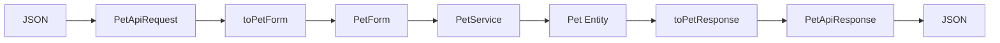

# 28 — DTO REST, JSON y mapping

En el capítulo 27 vimos cómo PetMatch expone endpoints REST.

Ahora vamos a estudiar una decisión arquitectónica más profunda:

> **¿Qué objetos Java representan el JSON que entra y sale de la API, y por qué esos objetos no son las Entities JPA?**

El flujo real de PetMatch es:

```text
JSON request
↓
API Request DTO
↓
ApiDtoMapper
↓
Form DTO
↓
Service
↓
Entity
↓
ApiDtoMapper
↓
API Response DTO
↓
JSON response
```

Este capítulo explica cada frontera.

---

# 1. El problema de exponer Entities directamente

Podríamos imaginar un Controller como:

```java
@PostMapping
public Pet create(@RequestBody Pet pet) {
    return petRepository.save(pet);
}
```

Parece corto.

Pero mezcla demasiadas responsabilidades:

```text
contrato HTTP
+
modelo persistente
+
reglas de negocio
+
serialización
+
persistencia
```

PetMatch no utiliza ese diseño.

---

# 2. Tres modelos de datos diferentes

En PetMatch conviven al menos tres familias:

```text
Entity
Form DTO
API DTO
```

Ejemplo para mascotas:

```text
Pet
PetForm
PetApiRequest
PetApiResponse
```

Aunque comparten algunos campos, no tienen la misma responsabilidad.

---

# 3. Entity

`Pet` representa estado persistente del dominio.

Incluye datos como:

```text
id
name
species
age
description
owner
supportRequests
```

Además tiene anotaciones JPA y relaciones.

Su diseño responde a preguntas de dominio y persistencia.

---

# 4. Form DTO

`PetForm` representa datos editables del caso de uso MVC/Service actual:

```text
name
species
age
description
```

No contiene:

```text
id
owner
supportRequests
```

Los Services actuales fueron diseñados para recibir este tipo de objeto.

---

# 5. API Request DTO

`PetApiRequest` representa el contrato JSON de entrada.

Código real:

```java
public record PetApiRequest(
    @NotBlank
    @Size(max = 100)
    String name,

    @NotBlank
    @Size(max = 80)
    String species,

    @NotNull
    @Min(0)
    Integer age,

    @Size(max = 1000)
    String description
) {
}
```

El API client solo puede enviar los componentes declarados en este contrato.

---

# 6. API Response DTO

Código real:

```java
public record PetApiResponse(
    Long id,
    String name,
    String species,
    Integer age,
    String description
) {
}
```

La respuesta sí incluye:

```text
id
```

porque es útil para identificar el recurso creado/consultado.

Pero no expone:

```text
owner Entity
supportRequests collection
```

---

# 7. Request DTO y Response DTO son distintos

Entrada:

```text
PetApiRequest
name
species
age
description
```

Salida:

```text
PetApiResponse
id
name
species
age
description
```

El cliente no decide el `id` al crear.

El servidor lo genera/persiste y luego lo devuelve.

---

# 8. ¿Por qué usar `record`?

Los API DTO actuales están implementados con Java records.

Un record es apropiado para estructuras de datos simples e inmutables en su forma declarada.

Ejemplo:

```java
public record PetApiResponse(
    Long id,
    String name,
    String species,
    Integer age,
    String description
) {
}
```

Java genera el constructor canónico y accessors como:

```text
id()
name()
species()
age()
description()
```

---

# 9. Record no es Entity JPA

PetMatch no convierte sus Entities en records.

Eso tiene sentido porque las Entities necesitan comportamiento/ciclo de vida JPA distinto:

```text
identidad persistente
constructores compatibles con JPA
relaciones
cambios de estado
setters usados por Services
```

Mientras los API DTO son representaciones de transferencia.

---

# 10. JSON → record

Un JSON:

```json
{
  "name": "Luna",
  "species": "Perro",
  "age": 4,
  "description": "Sociable"
}
```

puede convertirse conceptualmente a:

```text
PetApiRequest(
  "Luna",
  "Perro",
  4,
  "Sociable"
)
```

Spring usa su infraestructura de conversión HTTP/JSON para construir el objeto indicado en `@RequestBody`.

---

# 11. PetMatch no parsea JSON manualmente

El proyecto no contiene código como:

```java
ObjectMapper mapper = new ObjectMapper();
```

dentro de cada Controller para parsear requests.

Tampoco:

```text
String → split → Map → campos
```

La conversión forma parte de la infraestructura web configurada por Spring Boot.

---

# 12. Bean Validation vive también en API DTO

`PetApiRequest` contiene constraints equivalentes a las necesidades del contrato:

```text
name requerido
species requerida
age requerida y >= 0
description <= 1000
```

`@Valid @RequestBody` activa esa validación.

Esto significa que la API valida su propio contrato de entrada antes de llegar al Service cuando los campos son inválidos estructuralmente.

---

# 13. Form DTO y API DTO pueden compartir reglas sin ser la misma clase

`PetForm` y `PetApiRequest` contienen campos parecidos.

Eso no obliga a reutilizar una sola clase.

Ambos contratos pueden evolucionar independientemente:

```text
MVC HTML
→ necesidades del formulario

REST JSON
→ necesidades del cliente API
```

La coincidencia actual de algunos campos es una decisión del caso de uso, no una identidad conceptual.

---

# 14. `ApiDtoMapper`

Ruta:

```text
src/main/java/com/petmatch/community/dto/api/ApiDtoMapper.java
```

Es una clase:

```java
public final class ApiDtoMapper
```

con constructor privado:

```java
private ApiDtoMapper() {
}
```

y métodos `static`.

No es un Bean de Spring.

---

# 15. ¿Por qué constructor privado?

La clase se usa como utilidad estática.

No tiene estado de instancia.

Por eso el constructor privado evita algo como:

```java
new ApiDtoMapper()
```

cuando no es necesario.

---

# 16. `PetApiRequest → PetForm`

Código real:

```java
public static PetForm toPetForm(
    PetApiRequest request
) {
    PetForm form = new PetForm();
    form.setName(request.name());
    form.setSpecies(request.species());
    form.setAge(request.age());
    form.setDescription(request.description());
    return form;
}
```

El mapper adapta un record de API a la firma que ya consume `PetService`.

---

# 17. ¿Por qué no llama el Service directamente con `PetApiRequest`?

Porque el Service actual no está diseñado para depender de:

```text
controller.api DTO
```

Su firma usa:

```text
PetForm
```

El mapper permite mantener esa frontera.

---

# 18. Dirección de dependencia

La API conoce:

```text
Service
Form DTO
API DTO
```

Pero el Service no necesita conocer:

```text
PetApiRequest
PetApiResponse
```

Esto evita que la lógica central dependa del formato REST.

---

# 19. Una alternativa arquitectónica

En otro diseño podríamos crear objetos de aplicación neutrales como:

```text
CreatePetCommand
UpdatePetCommand
```

que fueran usados por MVC y REST.

PetMatch no implementa esa capa actualmente.

Su diseño real reutiliza los Form DTO como entrada de Service.

Debemos entender la alternativa sin documentarla como código existente.

---

# 20. Ventaja del diseño actual

La principal ventaja práctica es:

```text
reutilización inmediata de Services ya existentes
```

REST no necesita duplicar:

```text
normalización
ownership
reglas
persistencia
```

Solo adapta el contrato.

---

# 21. Posible límite del diseño actual

El nombre:

```text
PetForm
```

está ligado conceptualmente a formulario MVC.

Sin embargo también se usa como objeto de entrada interno para REST después del mapping.

En una aplicación más grande podría convenir separar:

```text
web form model
```

de:

```text
application command
```

Pero para PetMatch la implementación actual es simple y suficiente.

---

# 22. Entity → response DTO

Código real:

```java
public static PetApiResponse toPetResponse(Pet pet) {
    return new PetApiResponse(
        pet.getId(),
        pet.getName(),
        pet.getSpecies(),
        pet.getAge(),
        pet.getDescription()
    );
}
```

La salida está controlada explícitamente.

---

# 23. Esto evita serialización accidental de relaciones

Si devolviéramos directamente `Pet`, un serializador podría intentar navegar propiedades/relaciones según su configuración.

La Entity contiene:

```text
owner
supportRequests
```

Eso podría crear problemas como:

```text
exponer datos no planeados
grafos JSON grandes
ciclos de relaciones
lazy loading inesperado
acoplamiento del contrato a JPA
```

PetMatch evita esa situación mediante response DTO explícitos.

---

# 24. DTO como lista blanca

Podemos pensar en `PetApiResponse` como una lista explícita de campos públicos:

```text
id ✅
name ✅
species ✅
age ✅
description ✅
owner ❌
supportRequests ❌
```

Esto hace más visible qué sale de la API.

---

# 25. `SupportRequestApiRequest`

Código real, resumido:

```java
public record SupportRequestApiRequest(
    String title,
    String description,
    SupportType supportType,
    LocalDateTime serviceDate,
    Long petId
) {
}
```

Con Bean Validation sobre cada campo correspondiente.

---

# 26. JSON de entrada para SupportRequest

Ejemplo:

```json
{
  "title": "Paseo para Luna",
  "description": "Necesito apoyo durante la tarde.",
  "supportType": "WALK",
  "serviceDate": "2026-09-10T15:30:00",
  "petId": 1
}
```

Observa:

```text
supportType
→ enum

serviceDate
→ LocalDateTime

petId
→ Long
```

La infraestructura JSON convierte esos valores al record cuando el formato es compatible.

---

# 27. Enum en JSON

`supportType` es:

```java
SupportType
```

El ejemplo usa:

```json
"supportType": "WALK"
```

El valor debe corresponder al enum esperado por el contrato.

Si el body no puede convertirse al tipo esperado, se trata como un problema de lectura/conversión del body, no como una regla del Service.

---

# 28. `LocalDateTime` en JSON

El API DTO declara:

```java
LocalDateTime serviceDate
```

El README muestra un valor como:

```json
"serviceDate": "2026-09-10T15:30:00"
```

A diferencia del Form DTO MVC, el API DTO no necesita `@DateTimeFormat` para un `<input type="datetime-local">`.

Son mecanismos de entrada distintos.

---

# 29. `@Future` sigue aplicando

Aunque el JSON pueda convertirse a `LocalDateTime`, además debe superar:

```java
@Future
```

Por tanto:

```text
parseable
≠
valid business input structure
```

Una fecha pasada puede ser un `LocalDateTime` perfectamente válido como tipo y aun así violar el constraint.

---

# 30. `SupportRequestApiRequest → SupportRequestForm`

Mapper real:

```java
public static SupportRequestForm toSupportRequestForm(
    SupportRequestApiRequest request
) {
    SupportRequestForm form = new SupportRequestForm();
    form.setTitle(request.title());
    form.setDescription(request.description());
    form.setSupportType(request.supportType());
    form.setServiceDate(request.serviceDate());
    form.setPetId(request.petId());
    return form;
}
```

El mapping es explícito campo a campo.

---

# 31. ¿Por qué `petId` y no `Pet` también en REST?

El cliente conoce la identidad del recurso asociado:

```text
petId
```

Pero no debería construir una Entity `Pet` y enviarla como referencia principal.

El Service hace:

```text
petId
+
Authentication
↓
findOwnedPet
↓
Pet Entity autorizada
```

Así se conserva ownership.

---

# 32. `SupportRequestApiResponse`

Código real:

```java
public record SupportRequestApiResponse(
    Long id,
    String title,
    String description,
    SupportType supportType,
    LocalDateTime createdAt,
    LocalDateTime serviceDate,
    SupportRequestStatus status,
    Long petId,
    String petName,
    Long ownerId,
    String ownerName
) {
}
```

Esta estructura es muy útil para estudiar flattening.

---

# 33. La Entity tiene relaciones; el DTO las aplana

Entity conceptual:

```text
SupportRequest
├── Pet pet
└── User owner
```

Response DTO:

```text
petId
petName
ownerId
ownerName
```

No devuelve objetos anidados completos.

---

# 34. ¿Qué significa flattening?

Flattening significa transformar una estructura relacional/objetual profunda en campos más planos para el contrato de salida.

Ejemplo:

```text
request.pet.id
→ petId

request.pet.name
→ petName

request.owner.id
→ ownerId

request.owner.name
→ ownerName
```

Esto es exactamente lo que hace `ApiDtoMapper`.

---

# 35. Mapper de SupportRequest response

Código real:

```java
return new SupportRequestApiResponse(
    request.getId(),
    request.getTitle(),
    request.getDescription(),
    request.getSupportType(),
    request.getCreatedAt(),
    request.getServiceDate(),
    request.getStatus(),
    request.getPet().getId(),
    request.getPet().getName(),
    request.getOwner().getId(),
    request.getOwner().getName()
);
```

La forma JSON final queda desacoplada de la estructura exacta de asociaciones JPA.

---

# 36. DTO evita exponer campos de `User`

`User` contiene, entre otros:

```text
email
passwordHash
role
active
registeredAt
```

`SupportRequestApiResponse` solo expone del owner:

```text
ownerId
ownerName
```

Eso demuestra por qué devolver la Entity completa sería una frontera peligrosa.

---

# 37. Nunca exponer `passwordHash`

Este diseño hace que `passwordHash` ni siquiera forme parte del response DTO.

No dependemos de una anotación accidental de serialización para esconderlo.

Simplemente:

```text
no pertenece al contrato
```

Esa es una estrategia más explícita.

---

# 38. `SupportApplicationApiRequest`

Es un record muy pequeño:

```java
public record SupportApplicationApiRequest(
    @Size(max = 1000)
    String message
) {
}
```

Solo representa lo que el cliente puede aportar al postularse.

---

# 39. Lo que NO viene en el request de application

No contiene:

```text
id
applicantId
appliedAt
status
supportRequestId
```

¿Por qué?

Porque esos valores provienen de otras fuentes:

```text
application id
→ DB

applicant
→ Authentication

appliedAt
→ Entity @PrePersist

status
→ Entity/domain default

supportRequestId
→ URL path
```

---

# 40. Request body + path variable se combinan

Crear postulación usa:

```text
POST /api/v1/support-requests/{requestId}/applications
```

Y body:

```json
{
  "message": "Puedo ayudar."
}
```

Por tanto los datos del caso de uso vienen de varias partes:

```text
requestId → URI
message → JSON
applicant → Authentication
status/appliedAt → dominio
```

No todo tiene que viajar dentro del JSON.

---

# 41. `SupportApplicationApiRequest → SupportApplicationForm`

Mapper:

```java
public static SupportApplicationForm
    toSupportApplicationForm(
        SupportApplicationApiRequest request
    ) {

    SupportApplicationForm form =
        new SupportApplicationForm();

    form.setMessage(request.message());
    return form;
}
```

Nuevamente el REST adapter convierte al tipo que consume el Service.

---

# 42. `SupportApplicationApiResponse`

Código real:

```java
public record SupportApplicationApiResponse(
    Long id,
    String message,
    LocalDateTime appliedAt,
    SupportApplicationStatus status,
    Long applicantId,
    String applicantName,
    Long supportRequestId,
    String supportRequestTitle
) {
}
```

Aplana dos relaciones:

```text
applicant
supportRequest
```

---

# 43. Mapping de application response

Código real:

```java
return new SupportApplicationApiResponse(
    application.getId(),
    application.getMessage(),
    application.getAppliedAt(),
    application.getStatus(),
    application.getApplicant().getId(),
    application.getApplicant().getName(),
    application.getSupportRequest().getId(),
    application.getSupportRequest().getTitle()
);
```

El cliente recibe la información necesaria sin recibir el grafo completo.

---

# 44. Mapping y lazy loading

Para construir algunos response DTO hay que acceder a relaciones:

```text
request.pet
request.owner
application.applicant
application.supportRequest
```

Recordemos que:

```yaml
spring:
  jpa:
    open-in-view: false
```

Por tanto el diseño de fetch de Repository/Service sigue importando aunque la salida sea JSON.

---

# 45. EntityGraph ayuda antes del mapping

Repositories relevantes usan `@EntityGraph` para consultas que necesitan esas relaciones.

Ejemplo conceptual:

```text
Repository
→ obtiene request + pet + owner
↓
Service devuelve Entity preparada
↓
ApiDtoMapper accede a campos
↓
response DTO
```

El mapper no debería convertirse en una capa que hace consultas.

---

# 46. Mapper no usa Repository

`ApiDtoMapper` no inyecta:

```text
PetRepository
UserRepository
SupportRequestRepository
```

Solo transforma objetos que ya tiene.

Esto mantiene su responsabilidad simple:

```text
mapping
```

no:

```text
fetch + rules + mapping
```

---

# 47. Mapping explícito vs automático

PetMatch hace mapping manual.

Ejemplo:

```java
new PetApiResponse(...)
```

No se observa una herramienta como:

```text
MapStruct
ModelMapper
```

configurada como parte de esta implementación.

---

# 48. Ventajas del mapping explícito en un proyecto educativo

Para aprendices, el mapping manual hace visible:

```text
qué entra
qué sale
qué campo cambia de nombre/estructura
qué relación se aplana
```

No hay magia adicional que oculte el recorrido.

---

# 49. Costo del mapping manual

La contrapartida es escribir más código repetitivo.

Si el proyecto creciera a cientos de DTO, podría evaluarse una herramienta de mapping.

Pero eso sería una evolución de diseño.

No forma parte del estado actual.

---

# 50. JSON response y nombres de componentes

Los nombres de los componentes de un record como:

```java
Long ownerId,
String ownerName
```

se corresponden naturalmente con propiedades JSON como:

```json
{
  "ownerId": 7,
  "ownerName": "Ana"
}
```

Los DTO actuales no utilizan anotaciones personalizadas como `@JsonProperty` para cambiar esos nombres.

---

# 51. Contrato explícito y evolución

Si mañana la Entity `User` añade:

```text
phone
address
lastLogin
```

eso no significa automáticamente que `SupportRequestApiResponse` empiece a devolverlos.

El response DTO permanece igual hasta que alguien decida cambiar explícitamente el contrato.

Eso reduce cambios accidentales.

---

# 52. Persistencia puede cambiar sin romper JSON necesariamente

Supón que internamente:

```text
ownerName
```

se obtuviera desde otra estructura de dominio.

Mientras `ApiDtoMapper` siga construyendo:

```text
ownerId
ownerName
```

el cliente puede conservar el mismo contrato.

Ese desacoplamiento es una de las razones principales para usar DTO.

---

# 53. API DTO como frontera de seguridad

Los DTO también ayudan a controlar qué puede controlar el cliente.

Por ejemplo `SupportRequestApiRequest` no incluye:

```text
ownerId
status
createdAt
```

El cliente no puede pedir legítimamente:

```json
{
  "ownerId": 99,
  "status": "COMPLETED"
}
```

como parte del contrato definido.

---

# 54. Pero DTO no reemplaza autorización

Aunque `ownerId` no esté en el request, un usuario todavía puede enviar:

```text
petId de otra persona
```

Por eso el Service debe ejecutar ownership.

La frontera DTO reduce superficie, pero no reemplaza reglas backend.

---

# 55. DTO no reemplaza validación de negocio

`SupportApplicationApiRequest.message` puede ser válido según `@Size`.

Aun así el Service puede rechazar porque:

```text
request no OPEN
fecha vencida
self-apply
duplicado
```

De nuevo:

```text
JSON DTO válido
≠
caso de uso permitido
```

---

# 56. DTO no reemplaza DB constraints

Una request puede superar DTO validation y Service checks, pero la base conserva constraints estructurales.

Las capas se complementan:

```text
API DTO
→ contrato

Service
→ reglas

DB
→ integridad final
```

---

# 57. Input DTO y output DTO tienen objetivos distintos

Input pregunta:

> ¿qué datos acepta este endpoint del cliente?

Output pregunta:

> ¿qué datos publica este endpoint al cliente?

No deberían diseñarse automáticamente como una copia espejo.

---

# 58. Ejemplo: SupportRequest

Input:

```text
title
description
supportType
serviceDate
petId
```

Output:

```text
id
title
description
supportType
createdAt
serviceDate
status
petId
petName
ownerId
ownerName
```

El servidor añade información derivada/persistida.

---

# 59. Estado nunca viene en create request

`SupportRequestApiRequest` no contiene:

```text
status
```

La Entity inicializa:

```text
OPEN
```

mediante su ciclo de dominio/persistencia.

Por tanto el cliente no elige el estado inicial arbitrariamente.

---

# 60. `createdAt` tampoco viene del cliente

El response contiene:

```text
createdAt
```

pero el request no.

La fecha de creación pertenece al servidor/dominio.

Esto evita confiar en un timestamp proporcionado por el cliente como si fuera la fecha real de creación.

---

# 61. `appliedAt` sigue el mismo patrón

`SupportApplicationApiResponse` incluye:

```text
appliedAt
```

pero `SupportApplicationApiRequest` no.

El servidor determina ese valor.

---

# 62. Mapping completo de Pet



---

# 63. Mapping completo de SupportRequest

```mermaid
flowchart LR
    A[JSON request] --> B[SupportRequestApiRequest]
    B --> C[toSupportRequestForm]
    C --> D[SupportRequestForm]
    D --> E[SupportRequestService]
    E --> F[SupportRequest Entity]
    F --> G[toSupportRequestResponse]
    G --> H[SupportRequestApiResponse]
    H --> I[JSON response]
```



---

# 64. Mapping completo de SupportApplication

```mermaid
flowchart LR
    A[JSON message] --> B[SupportApplicationApiRequest]
    B --> C[toSupportApplicationForm]
    C --> D[SupportApplicationForm]
    D --> E[SupportApplicationService]
    E --> F[SupportApplication Entity]
    F --> G[toSupportApplicationResponse]
    G --> H[SupportApplicationApiResponse]
    H --> I[JSON]
```



---

# 65. ¿Dónde ocurre la serialización?

El Controller retorna un record Java.

Spring convierte ese objeto al cuerpo HTTP/JSON mediante su infraestructura de message conversion.

Por tanto el código del Controller no escribe manualmente:

```text
{"id": ...}
```

como String.

---

# 66. No construir JSON a mano

Un anti-patrón sería:

```java
return "{\"id\":" + pet.getId() + "}";
```

Eso sería frágil para:

```text
escaping
nulls
fechas
objetos
listas
mantenimiento
```

PetMatch devuelve objetos tipados.

---

# 67. Lists también se serializan

`findAll()` devuelve:

```java
List<PetApiResponse>
```

El resultado HTTP será un array JSON conceptualmente:

```json
[
  {
    "id": 1,
    "name": "Luna",
    "species": "Perro",
    "age": 4,
    "description": "Sociable"
  }
]
```

No hay que construir `[` y `]` manualmente.

---

# 68. Fechas en response

Los response records pueden contener:

```text
LocalDateTime
```

como:

```text
createdAt
serviceDate
appliedAt
```

La representación JSON se genera por la infraestructura configurada por Spring Boot.

El repositorio no declara un formato custom con `@JsonFormat` en esos records.

---

# 69. Zona horaria y límites del contrato

`LocalDateTime` no contiene zona horaria por sí mismo.

Los timestamps actuales no implican que el contrato incluya necesariamente:

```text
UTC
Z
America/Bogota offset
```

El DTO declara simplemente `LocalDateTime`.

---

# 70. Validación duplicada entre Form y API DTO

Hay constraints parecidas en:

```text
PetForm
PetApiRequest
```

Esto puede parecer repetición.

Pero cada interfaz declara y valida su contrato antes de entrar al Service.

Después el mapper crea el Form DTO usado internamente.

---

# 71. ¿La segunda validación del Form DTO se ejecuta automáticamente en Service?

No simplemente por convertir el objeto.

`@Valid` está en el parámetro del REST Controller para el `PetApiRequest`.

Cuando `ApiDtoMapper` crea un `PetForm`, el Service no vuelve a ejecutar Bean Validation solo por recibirlo.

Por eso es importante que el API Request DTO tenga sus propios constraints coherentes.

---

# 72. Service sigue defendiendo invariantes de negocio

Aunque no haya una segunda Bean Validation automática del Form creado por el mapper, el Service todavía implementa reglas críticas como:

```text
current user
ownership
status
self-apply
duplicado
normalización
```

Los DTO se ocupan de restricciones estructurales del contrato.

---

# 73. Normalización ocurre después del mapping

Ejemplo:

```text
JSON name = "  Luna  "
↓
PetApiRequest.name()
↓
PetForm.name
↓
PetService.normalize(...)
↓
"Luna"
```

El mapper copia.

El Service normaliza.

No debemos atribuir esa lógica a `ApiDtoMapper`.

---

# 74. Mapper no decide ownership

`toSupportRequestForm(...)` simplemente copia:

```text
petId
```

No pregunta si la Pet pertenece al usuario.

Eso ocurre en:

```text
SupportRequestService
→ PetService.findOwnedPet
```

Responsabilidades distintas.

---

# 75. Mapper no decide estados

`toSupportApplicationResponse(...)` lee:

```text
application.status
```

pero no decide cuándo pasa de PENDING a ACCEPTED.

Eso ocurre en el Service.

Mapping describe estado; no gobierna transiciones.

---

# 76. Mapper no es una capa de negocio

Una regla práctica:

```text
mapper
→ transforma forma de datos

service
→ decide comportamiento
```

Si un mapper comienza a contener:

```text
if request is OPEN
if current user owner
if duplicate
```

estaría absorbiendo responsabilidades incorrectas.

---

# 77. DTO REST y privacidad

El diseño de response puede decidir no exponer datos aunque la Entity los tenga.

Ejemplo:

```text
User.email
```

no aparece dentro de `SupportRequestApiResponse` ni `SupportApplicationApiResponse`.

La API muestra nombres/ids necesarios para el flujo actual.

---

# 78. DTO REST y estabilidad

Las Entities pueden cambiar por razones de persistencia.

Los DTO pueden cambiar por razones de contrato externo.

Separarlos permite que ambas evoluciones no estén obligatoriamente sincronizadas.

---

# 79. DTO REST y testing

`RestApiIntegrationTests` afirma propiedades del JSON:

```java
jsonPath("$.name").value("Luna")
jsonPath("$.species").value("Perro")
```

Esto prueba el contrato observable, no la estructura interna de la Entity.

Esa diferencia es importante en pruebas de API.

---

# 80. ¿Qué pasa con campos desconocidos?

El código de estos records no declara una política explícita para propiedades JSON desconocidas.

Ese comportamiento depende de la configuración de serialización/deserialización de Spring Boot/Jackson activa en el proyecto.

Como el repositorio no configura aquí una política custom que hayamos verificado, no debemos afirmar una regla específica adicional como parte del contrato documentado.

---

# 81. ¿Qué pasa con null?

Los constraints sí expresan algunas reglas claras:

```text
@NotNull
@NotBlank
```

Por ejemplo:

```text
age null → inválido
petId null → inválido
message null → permitido
```

El contrato debe leerse desde las anotaciones reales.

---

# 82. Request DTO como documentación ejecutable

Abrir `PetApiRequest` permite saber:

```text
qué campos acepta create/update Pet
qué tipos tienen
qué constraints aplican
```

Abrir `SupportRequestApiResponse` permite saber:

```text
qué estructura devolverá una request
```

Los DTO son parte importante de la documentación técnica del API.

---

# 83. Cuadro comparativo

| Modelo | Propósito | ¿JPA? | ¿Entrada JSON? | ¿Salida JSON? |
|---|---|---:|---:|---:|
| `Pet` | dominio/persistencia | ✅ | ❌ directo | ❌ directo |
| `PetForm` | entrada interna/form MVC | ❌ | ❌ directo | ❌ |
| `PetApiRequest` | contrato REST entrada | ❌ | ✅ | ❌ |
| `PetApiResponse` | contrato REST salida | ❌ | ❌ | ✅ |

El mismo razonamiento aplica a SupportRequest y SupportApplication.

---

# 84. ⚠️ Errores frecuentes

## Error 1 — Usar Entity como `@RequestBody`

Acopla el contrato a persistencia y puede exponer campos que el cliente no debe controlar.

## Error 2 — Devolver Entity directamente

Puede exponer relaciones/datos no deseados y crear problemas de serialización/lazy loading.

## Error 3 — Usar el mismo DTO para request y response por costumbre

Entrada y salida tienen objetivos distintos.

## Error 4 — Creer que `record` significa Entity inmutable JPA

Los records aquí son DTO de transferencia.

## Error 5 — Poner reglas de ownership en mapper

Pertenecen al Service.

## Error 6 — Poner consultas Repository en mapper

El mapper actual solo transforma objetos.

## Error 7 — Exponer `passwordHash`

Nunca forma parte del contrato REST actual.

## Error 8 — Pensar que `petId` recibido ya es una Pet autorizada

El Service debe resolver ownership.

## Error 9 — Construir JSON mediante concatenación de Strings

Spring ya serializa objetos tipados.

## Error 10 — Inventar MapStruct como implementación actual

El mapping actual es manual.

---

# 85. 🛠 Prueba en el código

## Actividad 1 — Cuatro modelos Pet

Compara:

```text
Pet
PetForm
PetApiRequest
PetApiResponse
```

Para cada uno responde:

```text
qué campos tiene
quién lo crea
quién lo consume
qué frontera representa
```

## Actividad 2 — Flattening

Toma `SupportRequestApiResponse` y traza:

```text
petId ← request.pet.id
petName ← request.pet.name
ownerId ← request.owner.id
ownerName ← request.owner.name
```

## Actividad 3 — Datos no controlados por el cliente

En `SupportApplicationApiRequest`, identifica qué datos importantes NO se reciben desde JSON y de dónde salen realmente.

## Actividad 4 — Mapping input

Sigue:

```text
SupportRequestApiRequest
→ toSupportRequestForm
→ SupportRequestService.create
→ PetService.findOwnedPet
```

Explica dónde termina mapping y dónde empieza autorización.

## Actividad 5 — Seguridad de salida

Compara `User` con los response DTO y lista campos de `User` que no se exponen.

---

# 86. 🧪 Comprueba que entendiste

1. ¿Qué diferencia hay entre Entity, Form DTO y API DTO?
2. ¿Por qué PetMatch separa API Request y API Response?
3. ¿Qué tipo Java usa para los API DTO?
4. ¿Qué hace `ApiDtoMapper`?
5. ¿Es `ApiDtoMapper` un Bean de Spring?
6. ¿Qué transforma `toPetForm(...)`?
7. ¿Por qué REST Controller no entrega `PetApiRequest` directamente a `PetService`?
8. ¿Qué significa flattening en `SupportRequestApiResponse`?
9. ¿Qué datos del owner expone ese response?
10. ¿Expone `passwordHash`?
11. ¿De dónde sale `applicantId` al crear una postulación?
12. ¿De dónde sale `supportRequestId` en el caso de apply?
13. ¿Quién decide el estado inicial de una application?
14. ¿Qué hace el mapper con ownership?
15. ¿Qué hace el Service con ownership?
16. ¿Cómo se convierte un record response a JSON?
17. ¿PetMatch construye JSON manualmente?
18. ¿Usa MapStruct actualmente?
19. ¿Un DTO válido garantiza que el caso de negocio sea permitido?

### Respuestas esperadas

1. Persistencia/dominio, entrada interna de formulario/caso actual y contrato REST respectivamente.
2. Porque lo aceptado por el cliente y lo publicado por el servidor no son necesariamente iguales.
3. Java records.
4. Convierte API DTO ↔ estructuras usadas por Service/response.
5. No; es una utility class estática.
6. `PetApiRequest` a `PetForm`.
7. Porque el Service actual recibe `PetForm` y no depende de DTO del paquete API.
8. Convertir relaciones profundas en campos planos como `petId`, `petName`, etc.
9. `ownerId` y `ownerName`.
10. No.
11. De `Authentication` mediante el Service.
12. Del `@PathVariable` de la URL.
13. El dominio/Entity/Service, no el JSON del cliente.
14. Nada; copia datos.
15. Verifica la relación del current user con el recurso.
16. Mediante la infraestructura de conversión HTTP/JSON de Spring.
17. No.
18. No.
19. No; todavía pueden fallar reglas de negocio, ownership o estado.

---

# 87. ✅ Qué debes recordar

- **Entity, Form DTO y API DTO representan fronteras diferentes.**
- PetMatch no usa Entities directamente como contrato JSON público.
- Los API DTO actuales son Java records.
- Request DTO y Response DTO están separados.
- Request expresa qué puede enviar el cliente.
- Response expresa qué decide publicar el servidor.
- `ApiDtoMapper` es una utility class estática y hace mapping manual.
- La entrada REST sigue el patrón `ApiRequest → Form DTO → Service`.
- La salida sigue `Entity → ApiResponse`.
- `SupportRequestApiResponse` aplana `Pet` y `User` en ids/nombres.
- `SupportApplicationApiResponse` aplana applicant y support request.
- El DTO evita exponer automáticamente relaciones o campos sensibles como `passwordHash`.
- Mapper transforma datos; no consulta, no autoriza y no decide estados.
- Services siguen siendo responsables de ownership, reglas y normalización.
- `petId`, `requestId` y otros ids controlados por cliente deben verificarse en backend.
- La serialización JSON la realiza la infraestructura de Spring; no se construyen Strings manuales.
- No hay MapStruct/ModelMapper como implementación actual.
- La separación de DTO ayuda a estabilizar el contrato aunque cambien Entities.

---

# 🔗 Continúa con

Con 27 y 28 ya podemos explicar:

```text
HTTP endpoint
→ JSON
→ API DTO
→ mapper
→ Service
→ Entity
→ response DTO
→ JSON
```

La siguiente pregunta es:

> **¿Cómo se protege específicamente esta API stateless con HTTP Basic y cómo se combina esa autenticación con los mismos controles de ownership?**

Continúa con:

**[Capítulo 29 — Seguridad REST →](29-seguridad-rest.md)**

---

[← Capítulo 27 — REST API](27-rest-api.md) · [Índice del bloque](README.md) · [Índice general](../README.md) · [Siguiente → Capítulo 29](29-seguridad-rest.md)
