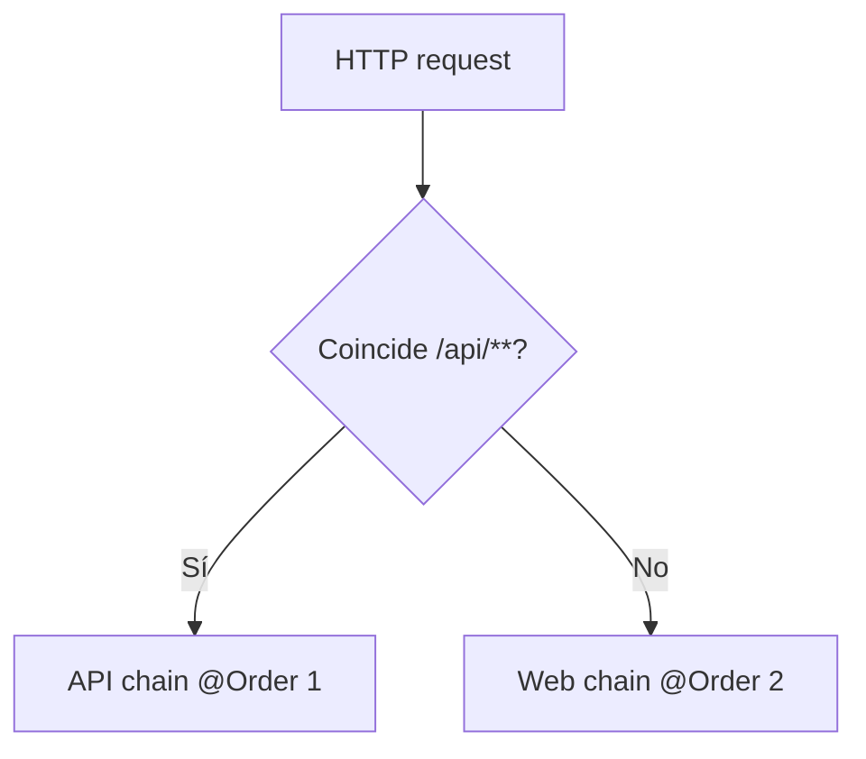
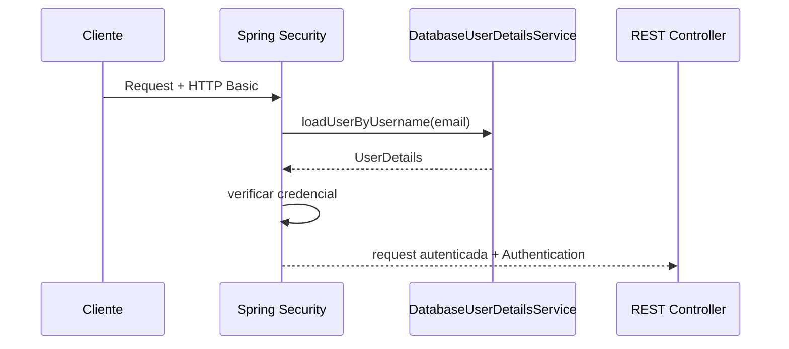
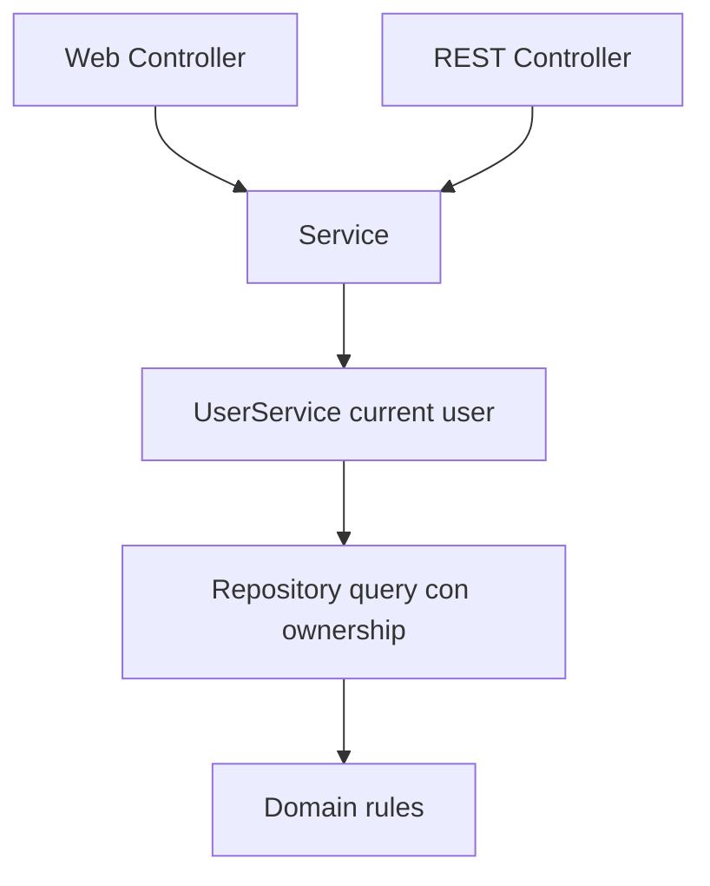
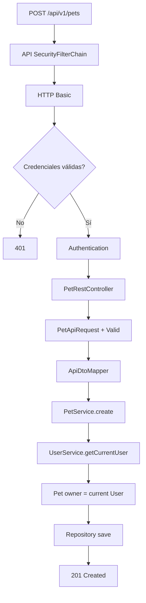
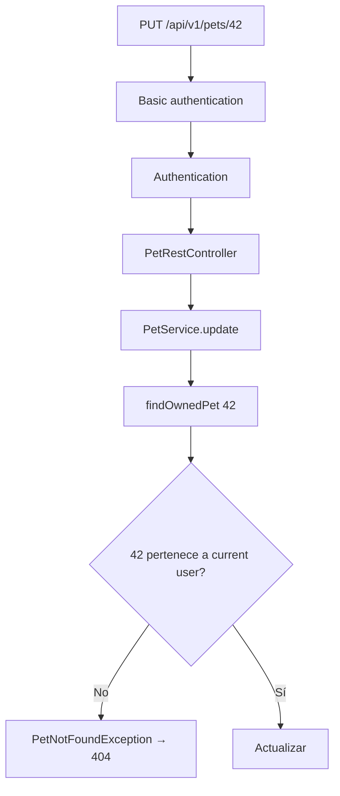
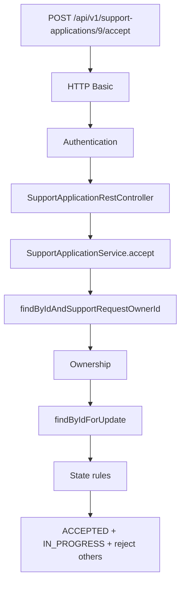

# 29 — Seguridad REST

En el capítulo 23 vimos que PetMatch tiene dos `SecurityFilterChain`.

En el capítulo 27 vimos los endpoints `/api/v1/...`.

Ahora unimos ambas piezas.

La pregunta central es:

> **¿Cómo autentica PetMatch cada request REST y cómo se combina esa autenticación stateless con ownership y reglas de negocio?**

La respuesta real del proyecto es:

```text
/api/**
→ SecurityFilterChain @Order(1)
→ HTTP Basic
→ STATELESS
→ CSRF disabled
→ authenticated
→ REST Controller
→ Service
→ ownership + estados + reglas
```

---

# 1. La API tiene una política propia

`SecurityConfig` declara:

```java
@Bean
@Order(1)
SecurityFilterChain apiSecurityFilterChain(
    HttpSecurity http
) throws Exception {
    http
        .securityMatcher("/api/**")
        .authorizeHttpRequests(authorize -> authorize
            .anyRequest().authenticated()
        )
        .sessionManagement(session -> session
            .sessionCreationPolicy(
                SessionCreationPolicy.STATELESS
            )
        )
        .csrf(csrf -> csrf.disable())
        .httpBasic(Customizer.withDefaults());

    return http.build();
}
```

Este bloque concentra toda la política HTTP específica de la API actual.

---

# 2. `securityMatcher("/api/**")`

Esta instrucción selecciona la cadena para requests como:

```text
/api/v1/pets
/api/v1/support-requests
/api/v1/support-applications/mine
```

No es una regla de autorización sobre recursos de dominio.

Es una regla de **selección de SecurityFilterChain**.

---

# 3. ¿Por qué `@Order(1)`?

PetMatch tiene dos chains:

```text
@Order(1) → API
@Order(2) → web
```

La API es más específica porque tiene:

```java
.securityMatcher("/api/**")
```

El orden permite que esta política se evalúe antes que la política web general.

Modelo mental:



Cada request es atendida por la chain que corresponde según su matcher y orden.

---

# 4. Toda la API exige autenticación

Dentro de la chain aparece:

```java
.anyRequest().authenticated()
```

Eso significa que cualquier endpoint que ya haya coincidido con `/api/**` necesita una identidad autenticada.

Incluye incluso:

```text
GET /api/v1/support-requests
```

Aunque conceptualmente liste solicitudes abiertas.

---

# 5. Método sin `Authentication` no significa endpoint público

`SupportRequestRestController.findOpenRequests()` no recibe un parámetro `Authentication`.

Pero su URL sigue estando bajo:

```text
/api/**
```

Por tanto:

```text
SecurityFilterChain
→ authenticated()
```

se aplica antes del Controller.

La firma del método Java no determina por sí sola si una ruta es pública.

---

# 6. HTTP Basic

La chain configura:

```java
.httpBasic(Customizer.withDefaults())
```

PetMatch utiliza HTTP Basic como mecanismo actual de autenticación REST.

Un cliente presenta credenciales en cada request API.

El README del proyecto muestra ejemplos como:

```bash
curl -u user@example.com:testing123 \
  http://localhost:8080/api/v1/pets
```

---

# 7. Basic no crea un login HTML

En la web tenemos:

```text
GET /login
POST /login
form login
session
```

En la API actual tenemos:

```text
request
+ credenciales HTTP Basic
→ autenticación de esa request
```

El cliente REST no necesita visitar `/login` para obtener una sesión web.

---

# 8. Basic no es JWT

La implementación actual no utiliza:

```text
Bearer token
JWT
refresh token
OAuth2 access token
```

El header de autenticación pertenece a HTTP Basic.

La implementación actual no utiliza una arquitectura basada en tokens.

---

# 9. Basic no cifra el transporte

HTTP Basic es un mecanismo de presentación de credenciales HTTP.

No sustituye TLS.

El propio README del proyecto aclara que el ejemplo académico trabaja localmente con HTTP y que, en un sistema real, Basic debe utilizarse únicamente sobre HTTPS.

Por tanto:

```text
HTTP Basic
≠
cifrado de transporte
```

---

# 10. Los usuarios API son los mismos usuarios de PetMatch

No existe una tabla separada de:

```text
api_users
```

ni una API key por usuario.

El mismo `DatabaseUserDetailsService` utilizado por Spring Security carga las cuentas desde `UserRepository`.

---

# 11. `DatabaseUserDetailsService`

Código real:

```java
@Override
public UserDetails loadUserByUsername(String username) {
    User user = userRepository
        .findByEmailIgnoreCase(username)
        .orElseThrow(() ->
            new UsernameNotFoundException("User not found")
        );

    return org.springframework.security.core.userdetails.User
        .withUsername(user.getEmail())
        .password(user.getPasswordHash())
        .roles(user.getRole().name())
        .disabled(!user.isActive())
        .build();
}
```

Así la API reutiliza:

```text
email
passwordHash
role
active
```

de la misma cuenta persistente.

---

# 12. El identificador sigue siendo el email

Aunque HTTP Basic hable de `username` de manera genérica, PetMatch construye el `UserDetails` con:

```java
.withUsername(user.getEmail())
```

Por tanto la identidad principal de seguridad sigue siendo el email.

---

# 13. PasswordEncoder sigue participando

Las contraseñas de los usuarios fueron registradas mediante:

```java
passwordEncoder.encode(...)
```

Spring Security utiliza la infraestructura de autenticación y el `PasswordEncoder` configurado para verificar la credencial presentada.

La API no compara passwords manualmente dentro de un REST Controller.

---

# 14. `STATELESS`

La chain declara:

```java
.sessionCreationPolicy(
    SessionCreationPolicy.STATELESS
)
```

Esta es una diferencia fundamental frente a la web.

Modelo:

```text
Request API 1
→ autenticar credenciales
→ ejecutar

Request API 2
→ autenticar credenciales nuevamente
→ ejecutar
```

La API no utiliza una sesión de seguridad para “recordar” el login entre requests.

---

# 15. Stateless no significa “sin estado en toda la aplicación”

Este término se refiere aquí al mecanismo de autenticación HTTP de la API.

La aplicación sigue teniendo estado persistente:

```text
User
Pet
SupportRequest
SupportApplication
```

en base de datos.

Por tanto:

```text
STATELESS security session
≠
no database state
```

---

# 16. Stateless tampoco significa “sin transacciones”

Los Services siguen usando:

```java
@Transactional
```

La política de sesión de Spring Security y las transacciones JPA son conceptos diferentes.

```text
SessionCreationPolicy.STATELESS
→ contexto de autenticación HTTP

@Transactional
→ unidad de trabajo de persistencia
```

---

# 17. `Authentication` existe durante la request

Aunque no haya una sesión web reutilizable, una request autenticada puede tener un objeto:

```java
Authentication authentication
```

Los REST Controllers lo reciben igual que los Controllers MVC.

Ejemplo:

```java
@GetMapping
public List<PetApiResponse> findAll(
    Authentication authentication
) {
    ...
}
```

---

# 18. De Basic a `Authentication`

Modelo mental simplificado:



No es una enumeración exhaustiva de filtros internos; es el recorrido conceptual necesario para leer PetMatch.

---

# 19. `Authentication.getName()` vuelve a ser email

`UserService.getCurrentUser(...)` hace:

```java
return findByEmail(
    authentication.getName()
);
```

Por tanto el mismo puente funciona para web y API:

```text
Authentication
→ email
→ UserService
→ User Entity
```

---

# 20. Autenticación REST no reemplaza ownership

Supón:

```text
Bruno presenta credenciales válidas
```

Entonces:

```text
Authentication ✅
```

Pero si intenta:

```text
GET /api/v1/pets/42
```

y Pet 42 pertenece a Ana, todavía debe fallar ownership.

---

# 21. Pet REST mantiene ownership

`PetRestController.findById(...)` llama:

```java
petService.findOwnedPet(
    petId,
    authentication
)
```

Y `PetService` usa:

```text
findByIdAndOwnerId(petId, currentUser.id)
```

Por tanto:

```text
Basic válido
≠
acceso a cualquier Pet
```

---

# 22. Update REST mantiene ownership

`PUT /api/v1/pets/{petId}` llama al mismo:

```java
petService.update(...)
```

que utiliza `findOwnedPet` antes de modificar.

No existe una versión REST “menos protegida” del caso de uso.

---

# 23. Delete REST mantiene reglas de negocio

`DELETE /api/v1/pets/{petId}` llama:

```java
petService.delete(...)
```

El Service comprueba:

```text
ownership
+
si existen SupportRequests asociadas
```

HTTP Basic solo resuelve la primera frontera de identidad.

---

# 24. SupportRequest también reutiliza autorización

Por ejemplo:

```text
PUT /api/v1/support-requests/{requestId}
```

termina en:

```text
SupportRequestService.update
→ findOwnedRequest
→ requireOpen
→ findOwnedPet
```

La autorización REST real sigue dependiendo del dominio.

---

# 25. Visibilidad de requests

El endpoint:

```text
GET /api/v1/support-requests/{requestId}
```

llama:

```java
findVisibleRequest(
    requestId,
    authentication
)
```

Por tanto una request no `OPEN` conserva la política:

```text
owner → visible
applicant relacionado → visible
outsider → no visible
```

---

# 26. Applications también mantienen ownership

Aceptar:

```text
POST /api/v1/support-applications/{applicationId}/accept
```

no comprueba permisos en el REST Controller.

Delega en:

```text
SupportApplicationService.accept
→ current user
→ findByIdAndSupportRequestOwnerId
→ state rules
→ pessimistic lock
```

El diseño comparte seguridad de recurso entre interfaces.

---

# 27. Dos niveles de autorización REST

Podemos expresarlo así:

```text
SecurityFilterChain
→ ¿hay una identidad autenticada?
```

Después:

```text
Service / Repository
→ ¿esa identidad puede actuar sobre ESTE recurso?
```

Y finalmente:

```text
State/business rules
→ ¿la operación es válida ahora?
```

---

# 28. CSRF está desactivado solo en la chain API

Código real:

```java
.csrf(csrf -> csrf.disable())
```

Esto pertenece a:

```text
apiSecurityFilterChain
```

que selecciona:

```text
/api/**
```

No es una desactivación global de CSRF para la aplicación web.

---

# 29. ¿Por qué el diseño actual desactiva CSRF en API?

La API actual utiliza:

```text
HTTP Basic
+
STATELESS
```

No reutiliza la sesión web como mecanismo de autenticación entre requests.

En este diseño concreto, PetMatch configura CSRF como deshabilitado para `/api/**`.

No debemos convertir esto en una regla universal:

```text
“toda API REST debe desactivar CSRF”
```

porque depende del mecanismo de autenticación utilizado.

---

# 30. CSRF disabled no significa “API sin seguridad”

La misma chain conserva:

```java
.anyRequest().authenticated()
```

y:

```java
.httpBasic(...)
```

Además los Services conservan ownership.

Así:

```text
CSRF disabled
≠
authentication disabled
≠
authorization disabled
```

---

# 31. Evidencia: POST sin CSRF

`RestApiIntegrationTests` contiene:

```java
mockMvc.perform(
    post("/api/v1/pets")
        .with(httpBasic(email, password))
        .contentType(MediaType.APPLICATION_JSON)
        .content(body)
)
.andExpect(status().isCreated());
```

La prueba no añade un token CSRF.

Y espera:

```text
201 Created
```

Esto es coherente con la configuración `/api/**`.

---

# 32. Esa prueba sigue necesitando autenticación

El test añade:

```java
.with(httpBasic(email, password))
```

Por tanto la conclusión correcta es:

```text
POST API
+ Basic válido
+ sin CSRF
→ permitido
```

No:

```text
POST API anónimo
→ permitido
```

---

# 33. Evidencia: request anónima

La misma prueba hace:

```java
mockMvc.perform(
    get("/api/v1/pets")
)
.andExpect(
    status().isUnauthorized()
);
```

Resultado:

```text
401 Unauthorized
```

Esto ocurre antes del flujo normal del REST Controller.

---

# 34. Evidencia: credenciales válidas

Después:

```java
mockMvc.perform(
    get("/api/v1/pets")
        .with(httpBasic(email, password))
)
.andExpect(status().isOk());
```

Con la misma cuenta registrada mediante `UserService`, el endpoint responde correctamente.

Esto conecta:

```text
registro
→ PasswordEncoder
→ UserDetailsService
→ HTTP Basic
→ REST endpoint
```

---

# 35. `401 Unauthorized`

En la práctica HTTP de la API:

```text
sin autenticación válida
→ 401
```

Aunque el nombre histórico diga “Unauthorized”, el status se utiliza para ausencia/fallo de autenticación.

El capítulo 30 distinguirá ese error de los errores producidos por `ApiExceptionHandler`.

---

# 36. ¿Y 403?

Conceptualmente:

```text
401
→ falta autenticación válida

403
→ identidad conocida pero acceso prohibido por política
```

Sin embargo, para ownership PetMatch suele resolver recursos ajenos mediante queries filtradas y excepciones `NotFound`.

Por eso no debemos afirmar que:

```text
“toda violación de ownership REST produce 403”
```

No describe el código actual.

---

# 37. Ownership puede terminar como 404

Ejemplo:

```text
GET /api/v1/pets/{id}
```

usa:

```text
findOwnedPet
→ findByIdAndOwnerId
→ PetNotFoundException
```

`ApiExceptionHandler` traduce `PetNotFoundException` a:

```text
404 Not Found
```

Así el API contract evita distinguir entre:

```text
id inexistente
```

y:

```text
id existente pero fuera del ownership de ese caso de uso
```

---

# 38. Error de estado no es error de autenticación

Si el usuario está correctamente autenticado y es owner, pero intenta completar una request que no está `IN_PROGRESS`, la seguridad HTTP inicial ya pasó.

Después el Service puede lanzar:

```text
SupportRequestStateException
```

que la API transforma a:

```text
409 Conflict
```

Distintas capas, distintos errores.

---

# 39. DTO válido tampoco implica autorización

Un JSON puede pasar:

```text
@RequestBody
@Valid
```

pero referenciar:

```text
petId de otro usuario
```

Entonces:

```text
validación estructural ✅
Authentication ✅
ownership ❌
```

El Service sigue siendo la defensa final sobre el recurso.

---

# 40. HTTP Basic no decide reglas de negocio

Basic responde:

```text
¿son válidas estas credenciales?
```

No responde:

```text
¿request OPEN?
¿Pet pertenece al usuario?
¿ya se postuló?
¿serviceDate venció?
¿ya existe una ACCEPTED?
```

Esas preguntas pertenecen a los Services.

---

# 41. API security no depende del frontend

Un cliente puede ser:

```text
curl
Postman
MockMvc
otra aplicación
script
```

No existe una interfaz visual que deba ocultar botones para proteger la API.

Por eso la autorización backend es todavía más evidente.

---

# 42. No hay API key

No se observa un mecanismo como:

```text
X-API-Key
client secret propio
api_keys table
```

La autenticación actual es por usuario de PetMatch con HTTP Basic.

---

# 43. No hay OAuth2 Resource Server

No existe configuración tipo:

```text
oauth2ResourceServer
BearerTokenAuthenticationFilter
JwtDecoder
```

Por tanto PetMatch no debe documentarse como Resource Server OAuth2/JWT.

---

# 44. No hay CORS personalizado

`SecurityConfig` no declara una política CORS específica.

La configuración actual no define:

```text
allowedOrigins
allowedMethods
allowedHeaders
```

como configuración actual.

CSRF y CORS siguen siendo conceptos distintos.

---

# 45. No hay rate limiting

La chain no contiene un mecanismo de:

```text
requests por minuto
throttling
quota
```

Por tanto una respuesta 429 no forma parte del contrato documentado actual.

---

# 46. No hay method security central

Los REST Controllers no dependen de anotaciones como:

```java
@PreAuthorize(...)
```

para ownership.

Las reglas importantes están en Service + Repository.

Esto permite que MVC y REST compartan el mismo comportamiento.

---

# 47. Una sola fuente de autorización de dominio

Arquitectura:



Si ownership estuviera solo en REST, MVC podría divergir.

Si estuviera solo en MVC, REST podría quedar vulnerable.

El Service compartido evita esa duplicación.

---

# 48. SecurityFilterChain tampoco reemplaza al Service

La chain sabe:

```text
ruta
identidad
authorities
```

Pero no conoce automáticamente relaciones como:

```text
Pet.owner.id
SupportRequest.owner.id
SupportApplication.supportRequest.owner.id
```

Por eso la seguridad de dominio necesita consultas específicas.

---

# 49. Flujo seguro de creación de Pet



El cliente nunca envía `ownerId` como fuente de identidad.

---

# 50. Flujo seguro de update owned



La URL contiene un id controlado por cliente, pero el Repository agrega el owner actual a la búsqueda.

---

# 51. Flujo seguro de accept



Autenticación, ownership y concurrencia siguen siendo responsabilidades diferentes.

---

# 52. Prueba de seguridad como contrato externo

`RestApiIntegrationTests` no llama directamente a:

```text
apiSecurityFilterChain(...)
```

Envía requests HTTP simuladas con `MockMvc`.

Esto permite comprobar el comportamiento observable:

```text
sin Basic → 401
con Basic → 200/201
```

La prueba atraviesa realmente la configuración de seguridad integrada.

---

# 53. ¿Qué debería probar una cobertura más amplia?

Como evolución de tests, podrían probarse más escenarios como:

```text
password incorrecta
usuario inactivo
ownership REST cruzado
409 de estados
404 de recurso ajeno
```

Pero no debemos afirmar que todos esos casos ya tengan tests REST dedicados si no aparecen en `RestApiIntegrationTests` actual.

---

# 54. ⚠️ Errores frecuentes

## Error 1 — “Stateless significa sin base de datos”

No. Se refiere aquí a no conservar autenticación mediante sesión de seguridad API.

## Error 2 — Usar la sesión web como si fuera el mecanismo documentado de `/api/**`

La chain API declara `STATELESS`.

## Error 3 — Decir que HTTP Basic cifra las credenciales

El transporte real debe protegerse con HTTPS.

## Error 4 — Creer que Basic concede acceso a todos los recursos

Ownership sigue aplicándose.

## Error 5 — Desactivar CSRF globalmente

PetMatch lo desactiva solo en la chain `/api/**`.

## Error 6 — Decir que un método REST sin `Authentication` es público

La chain protege por URL antes del Controller.

## Error 7 — Inventar JWT/OAuth2/API keys

No están implementados.

## Error 8 — Convertir toda denegación de ownership en 403 documentalmente

Los Services actuales suelen generar `NotFound` para recursos fuera del ownership.

## Error 9 — Poner ownership solo en el REST Controller

Debe permanecer reutilizable en Service/Repository.

## Error 10 — Confundir HTTP session con Hibernate Session o transacción

Son conceptos distintos.

---

# 55. 🛠 Prueba en el código

## Actividad 1 — Sigue una request anónima

Traza:

```text
GET /api/v1/pets
→ securityMatcher /api/**
→ authenticated()
→ sin Basic
→ 401
```

Comprueba el test correspondiente.

## Actividad 2 — Sigue una request válida

Traza:

```text
Basic email/password
→ DatabaseUserDetailsService
→ UserDetails
→ Authentication
→ PetRestController
→ PetService
```

## Actividad 3 — Stateless

Explica qué cambia entre:

```text
request API 1
request API 2
```

si el cliente deja de enviar HTTP Basic en la segunda.

## Actividad 4 — Ownership

Para:

```text
GET /api/v1/pets/{petId}
```

identifica exactamente dónde se incorpora `currentUser.id` a la búsqueda.

## Actividad 5 — CSRF

Explica por qué el test de POST Pet puede ejecutarse sin CSRF y por qué eso no implica que la web esté sin CSRF.

---

# 56. 🧪 Comprueba que entendiste

1. ¿Qué chain protege `/api/**`?
2. ¿Qué prioridad tiene?
3. ¿Qué mecanismo de autenticación usa?
4. ¿Qué significa `STATELESS` aquí?
5. ¿Toda la API requiere autenticación?
6. ¿Un método sin parámetro `Authentication` puede seguir protegido?
7. ¿Qué componente carga el usuario desde DB?
8. ¿Qué valor representa el username en PetMatch?
9. ¿La API usa JWT?
10. ¿HTTP Basic reemplaza HTTPS?
11. ¿Qué objeto recibe un REST Controller después de autenticar?
12. ¿Cómo se obtiene la Entity User desde ese objeto?
13. ¿Basic concede ownership?
14. ¿Dónde se verifica ownership?
15. ¿CSRF está desactivado globalmente?
16. ¿Por qué un POST API válido puede funcionar sin token CSRF?
17. ¿Qué devuelve una request API sin credenciales en el test?
18. ¿Un recurso ajeno produce necesariamente 403?
19. ¿PetMatch tiene API keys o OAuth2 Resource Server?
20. ¿Hay CORS personalizado?

### Respuestas esperadas

1. `apiSecurityFilterChain`.
2. `@Order(1)`.
3. HTTP Basic.
4. No conservar autenticación API mediante sesión entre requests.
5. Sí, `anyRequest().authenticated()` dentro de la chain API.
6. Sí.
7. `DatabaseUserDetailsService`.
8. El email.
9. No.
10. No.
11. `Authentication`.
12. `UserService.getCurrentUser` usa `authentication.getName()` y busca por email.
13. No.
14. En Services/Repositories con current user y queries owned.
15. No; solo en `/api/**`.
16. Porque esa chain desactiva CSRF y autentica mediante Basic stateless.
17. 401.
18. No; ownership suele resolverse como NotFound en los casos actuales.
19. No.
20. No se observa una configuración personalizada actual.

---

# 57. ✅ Qué debes recordar

- **La API de PetMatch usa HTTP Basic + `STATELESS`.**
- `@Order(1)` y `securityMatcher("/api/**")` seleccionan la chain API antes de la web.
- Toda `/api/**` exige autenticación.
- Los mismos usuarios de base de datos sirven para web y API.
- `DatabaseUserDetailsService` carga la cuenta por email.
- El `PasswordEncoder` configurado sigue participando en la verificación.
- Cada request API debe presentar autenticación según el mecanismo actual; no se reutiliza login de sesión web.
- `Authentication` sigue disponible durante la request.
- `Authentication.getName()` es el email en PetMatch.
- HTTP Basic autentica, pero no resuelve ownership ni reglas de negocio.
- Ownership continúa en Services/Repositories compartidos por MVC y REST.
- Recursos fuera de ownership pueden terminar como `404` según los Services actuales.
- La API desactiva CSRF solo en `/api/**`; la web lo conserva.
- `STATELESS` no significa sin DB, sin JPA o sin transacciones.
- PetMatch no usa JWT, OAuth2 Resource Server, API keys, rate limiting ni CORS personalizado como implementación actual.
- Las pruebas REST verifican 401 sin Basic y éxito con credenciales válidas.

---

# 🔗 Continúa con

Ya sabemos cómo una request API obtiene identidad y cómo esa identidad llega a ownership.

Falta responder:

> **¿Cómo convierte PetMatch los fallos de validación, JSON inválido, recursos no encontrados y conflictos de negocio en respuestas HTTP JSON consistentes?**

Continúa con:

**[Capítulo 30 — ProblemDetail y errores HTTP →](30-problemdetail-y-errores-http.md)**

---

[← Capítulo 28 — DTO REST, JSON y mapping](28-dto-rest-json-y-mapping.md) · [Índice del bloque](README.md) · [Índice general](../README.md) · [Siguiente → Capítulo 30](30-problemdetail-y-errores-http.md)
