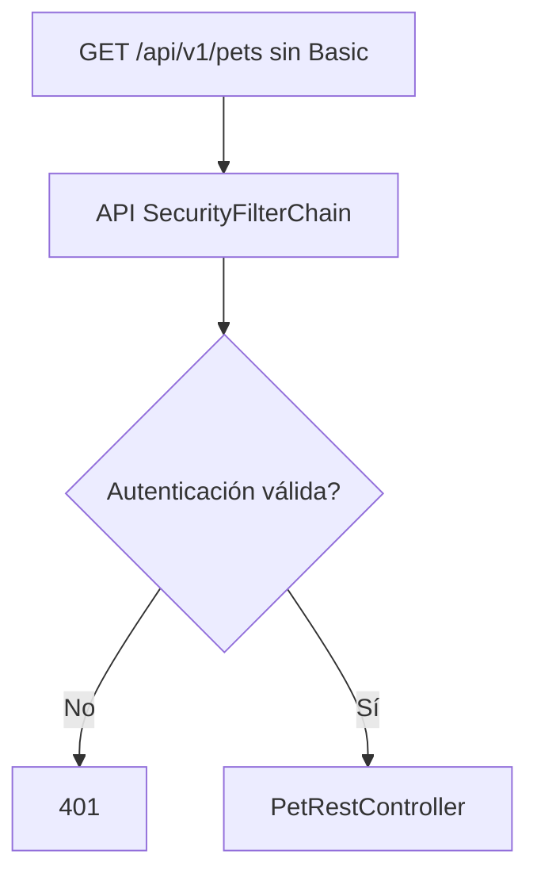
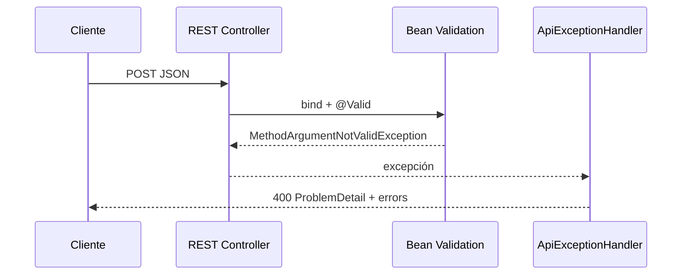
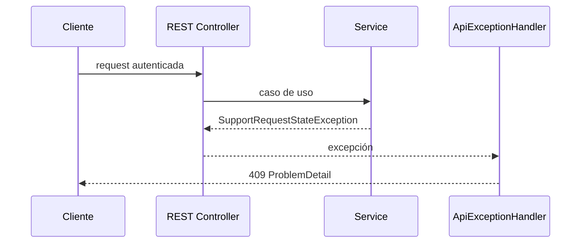
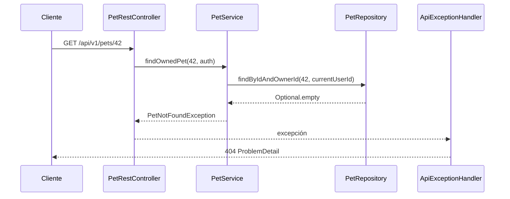

# 30 — `ProblemDetail` y errores HTTP

Este capítulo cierra el bloque REST.

Hasta ahora vimos el camino feliz:

```text
request válida
→ autenticación
→ Controller
→ Service
→ respuesta 200 / 201 / 204
```

Pero una API real también necesita responder correctamente cuando algo falla.

La pregunta central es:

> **¿Cómo transforma PetMatch errores de validación, JSON inválido, recursos no encontrados y conflictos de negocio en respuestas HTTP JSON consistentes?**

La pieza central es:

```text
ApiExceptionHandler
```

implementado con:

```java
@RestControllerAdvice
```

y respuestas:

```text
ProblemDetail
```

---

# 1. El problema de devolver errores inconsistentes

Sin una estrategia común, cada Controller podría responder distinto:

```text
Controller A → String
Controller B → Map
Controller C → HTML
Controller D → stacktrace
```

Eso hace difícil para un cliente saber:

```text
qué status ocurrió
qué tipo de error fue
qué detalle leer
qué campos fallaron
```

PetMatch centraliza los errores REST manejados.

---

# 2. `ApiExceptionHandler`

Archivo real:

```text
src/main/java/com/petmatch/community/controller/api/ApiExceptionHandler.java
```

Comienza con:

```java
@RestControllerAdvice(
    basePackages = "com.petmatch.community.controller.api"
)
public class ApiExceptionHandler {
```

Esta anotación combina dos ideas:

```text
ControllerAdvice
→ manejo transversal de excepciones

ResponseBody / REST
→ la respuesta se serializa como body
```

---

# 3. El scope es la API

La configuración contiene:

```java
basePackages =
    "com.petmatch.community.controller.api"
```

Por tanto este advice está dirigido a los Controllers REST del paquete API.

No es:

```text
manejador global de todos los errores MVC de PetMatch
```

porque su alcance está restringido.

---

# 4. ¿Qué es `ProblemDetail`?

`ProblemDetail` es un tipo de Spring para representar problemas HTTP de forma estructurada.

PetMatch lo usa para respuestas de error con campos como:

```text
status
title
detail
```

y, en validación, una propiedad adicional:

```text
errors
```

---

# 5. Helper `problem(...)`

El handler centraliza construcción básica:

```java
private ProblemDetail problem(
    HttpStatus status,
    String title,
    String detail
) {
    ProblemDetail problem =
        ProblemDetail.forStatusAndDetail(
            status,
            detail
        );

    problem.setTitle(title);
    return problem;
}
```

Así cada handler decide:

```text
status
title
detail
```

sin repetir toda la creación.

---

# 6. Grupo 1 — Not Found

PetMatch captura:

```java
@ExceptionHandler({
    PetNotFoundException.class,
    SupportRequestNotFoundException.class,
    SupportApplicationNotFoundException.class
})
```

Y responde:

```java
problem(
    HttpStatus.NOT_FOUND,
    "Resource not found",
    exception.getMessage()
)
```

Resultado:

```text
404 Not Found
```

---

# 7. ¿Cuándo aparece `PetNotFoundException`?

Un caso importante es ownership.

`PetService.findOwnedPet(...)` hace:

```text
findByIdAndOwnerId
```

Si no encuentra coincidencia:

```text
PetNotFoundException
```

Eso incluye dos posibilidades dentro del caso de uso:

```text
id no existe
```

o:

```text
id existe pero no pertenece al current user
```

La API transforma ambas en 404.

---

# 8. Not Found como política de visibilidad

`SupportRequestService.findVisibleRequest(...)` también puede lanzar:

```text
SupportRequestNotFoundException
```

cuando una request no abierta no debe ser visible para un outsider.

Así `404` no significa solamente:

```text
fila físicamente inexistente
```

También puede representar:

```text
recurso no visible bajo las reglas del caso de uso
```

---

# 9. Ejemplo conceptual 404

Un response puede verse conceptualmente como:

```json
{
  "title": "Resource not found",
  "status": 404,
  "detail": "..."
}
```

El texto exacto de `detail` depende del mensaje de la excepción concreta.

No existe un mensaje fijo universal porque las clases de excepción usan mensajes distintos.

---

# 10. Grupo 2 — Conflict

PetMatch agrupa:

```java
PetDeletionException.class,
SupportRequestStateException.class,
SupportApplicationRuleException.class,
SupportApplicationStateException.class,
DataIntegrityViolationException.class
```

Y responde:

```text
409 Conflict
```

---

# 11. Título de conflicto

Código real:

```java
"Business rule conflict"
```

El detalle es deliberadamente genérico:

```java
"La operación no puede realizarse en el estado actual del recurso."
```

---

# 12. El handler no expone siempre el mensaje interno

Para `NotFound`, PetMatch usa:

```java
exception.getMessage()
```

Pero para conflictos usa un mensaje fijo.

Eso significa que el contrato distingue entre:

```text
mensaje interno de excepción
```

y:

```text
detail público de API
```

No toda excepción debe revelar automáticamente su mensaje original.

---

# 13. Ejemplo: borrar Pet con requests asociadas

`PetService.delete(...)` puede lanzar:

```text
PetDeletionException
```

`ApiExceptionHandler` la transforma en:

```text
409 Conflict
Business rule conflict
```

Por tanto el error no es:

```text
400 porque el JSON esté mal
```

ni:

```text
401 porque falten credenciales
```

Es un conflicto con el estado/regla del recurso.

---

# 14. Ejemplo: transición inválida

Intentar:

```text
complete
```

sobre una request que no está:

```text
IN_PROGRESS
```

puede generar:

```text
SupportRequestStateException
```

que termina en:

```text
409 Conflict
```

Así HTTP refleja una regla del dominio.

---

# 15. Ejemplo: auto-postulación o duplicado

`SupportApplicationService.apply(...)` puede lanzar:

```text
SupportApplicationRuleException
```

por reglas como:

```text
request no acepta postulaciones
self-apply
duplicado
```

El handler las agrupa bajo:

```text
409 Conflict
```

---

# 16. `DataIntegrityViolationException`

También se captura:

```java
DataIntegrityViolationException.class
```

Esto permite convertir ciertos conflictos de integridad de persistencia en:

```text
409
```

sin devolver una excepción técnica cruda como respuesta normal de API.

---

# 17. No toda excepción de DB debería ocultar reglas faltantes

Capturar `DataIntegrityViolationException` no significa que debamos omitir validaciones de negocio.

PetMatch ya verifica reglas en Service.

La DB sigue siendo una última capa de integridad.

Modelo:

```text
Service rules
+
DB constraints
```

no:

```text
solo esperar que DB falle
```

---

# 18. Grupo 3 — Bean Validation

El handler específico es:

```java
@ExceptionHandler(
    MethodArgumentNotValidException.class
)
ProblemDetail handleValidation(...) {
```

Este error aparece cuando un DTO validado mediante:

```java
@Valid @RequestBody
```

viola constraints.

---

# 19. Status de validación

PetMatch responde:

```text
400 Bad Request
```

con:

```text
title = Validation failed
detail = Uno o más campos no son válidos.
```

---

# 20. Errores por campo

El código crea:

```java
Map<String, String> errors =
    new LinkedHashMap<>();
```

Después recorre:

```java
exception
    .getBindingResult()
    .getFieldErrors()
```

Y agrega:

```java
errors.putIfAbsent(
    error.getField(),
    error.getDefaultMessage()
);
```

---

# 21. ¿Por qué `putIfAbsent`?

Un campo puede violar más de un constraint.

El handler actual conserva el primer mensaje registrado para ese nombre de campo dentro del `Map`.

Por tanto el contrato actual es aproximadamente:

```text
campo → un mensaje
```

No:

```text
campo → lista completa de todos los mensajes
```

---

# 22. Propiedad adicional `errors`

Después:

```java
detail.setProperty("errors", errors);
```

Así `ProblemDetail` se extiende con información específica de PetMatch.

Ejemplo real esperado por test:

```json
{
  "title": "Validation failed",
  "status": 400,
  "detail": "Uno o más campos no son válidos.",
  "errors": {
    "name": "El nombre es obligatorio",
    "age": "La edad no puede ser negativa"
  }
}
```

---

# 23. Test de validación

`RestApiIntegrationTests` envía:

```json
{
  "name": "",
  "species": "Perro",
  "age": -1
}
```

Y verifica:

```java
status().isBadRequest()
jsonPath("$.title")
    .value("Validation failed")
jsonPath("$.errors.name").exists()
jsonPath("$.errors.age").exists()
```

Esto prueba el contrato de error, no solamente que una excepción ocurra.

---

# 24. El test no fija todos los mensajes exactos

La prueba verifica existencia de:

```text
errors.name
errors.age
```

pero no compara todos los textos de mensajes.

Por tanto la documentación puede mostrar ejemplos coherentes con constraints reales, pero no debe afirmar que ese test congela cada string del response.

---

# 25. Grupo 4 — Body JSON ilegible

El handler captura:

```java
HttpMessageNotReadableException
```

Y responde:

```text
400 Bad Request
```

con:

```text
title = Invalid request body
```

Y detalle:

```text
El cuerpo JSON no tiene el formato esperado.
```

---

# 26. JSON inválido vs validación inválida

Son errores diferentes.

## JSON no convertible

Ejemplo conceptual:

```json
{
  "age": "cuatro"
}
```

si el DTO espera `Integer` y la conversión no puede hacerse.

Puede terminar en:

```text
HttpMessageNotReadableException
→ 400 Invalid request body
```

## DTO correctamente construido pero inválido

Ejemplo:

```json
{
  "age": -1
}
```

Puede convertirse a `Integer`, pero falla:

```text
@Min(0)
```

Y termina en:

```text
MethodArgumentNotValidException
→ 400 Validation failed
```

---

# 27. Sintaxis y semántica de entrada

Una forma útil de distinguir:

```text
¿puedo interpretar/construir el request DTO?
→ conversión JSON

¿ese DTO cumple constraints declarados?
→ Bean Validation
```

Ambos pueden producir 400, pero con títulos diferentes.

---

# 28. ¿Qué errores NO maneja `ApiExceptionHandler`?

Un caso clave es:

```text
401 Unauthorized por HTTP Basic
```

Ese error ocurre en Spring Security antes de que la request llegue normalmente al REST Controller.

No proviene de:

```java
@ExceptionHandler(...)
```

de `ApiExceptionHandler`.

---

# 29. 401 y `ProblemDetail` no deben confundirse

La prueba demuestra:

```text
GET /api/v1/pets sin Basic
→ 401
```

Pero el handler no contiene:

```java
@ExceptionHandler(AuthenticationException.class)
```

como contrato actual.

Por tanto no debemos afirmar que todo 401 de PetMatch tenga el mismo `ProblemDetail` custom del advice.

---

# 30. 401 ocurre antes del Controller

Flujo:



`ApiExceptionHandler` está orientado a excepciones que ocurren dentro del flujo MVC/REST manejado por los Controllers/advice.

---

# 31. 404/409 ocurren después de autenticación

Ejemplo:

```text
Basic válido
→ Controller
→ Service
→ findOwnedPet
→ PetNotFoundException
→ ApiExceptionHandler
→ 404 ProblemDetail
```

Otro:

```text
Basic válido
→ Controller
→ Service
→ invalid state
→ SupportRequestStateException
→ ApiExceptionHandler
→ 409 ProblemDetail
```

---

# 32. Errores por capas

| Capa | Ejemplo | Resultado actual |
|---|---|---|
| Security | falta HTTP Basic | 401 |
| JSON conversion | body no convertible | 400 `Invalid request body` |
| Bean Validation | constraints inválidos | 400 `Validation failed` |
| Service visibility/ownership | resource no encontrado/visible | 404 `Resource not found` |
| Service/domain | estado/regla conflictiva | 409 `Business rule conflict` |
| DB integrity | `DataIntegrityViolationException` manejada | 409 `Business rule conflict` |

---

# 33. ¿Por qué 409 para reglas de negocio?

`409 Conflict` comunica que la request puede ser entendible, pero entra en conflicto con el estado actual del recurso o una regla de negocio.

Ejemplos PetMatch:

```text
cancelar algo no OPEN
completar algo no IN_PROGRESS
self-apply
postulación duplicada
borrar Pet con dependencias
```

La implementación agrupa esos casos bajo un contrato común.

---

# 34. 400 no debe usarse para todo

Sería menos expresivo devolver siempre:

```text
400 Bad Request
```

para:

```text
JSON inválido
validation
not found
state conflict
```

PetMatch distingue varias categorías mediante status diferentes.

---

# 35. 404 no es lo mismo que 409

```text
404
→ el recurso no está disponible bajo el caso de uso actual
```

```text
409
→ el recurso/caso existe, pero la operación entra en conflicto con reglas/estado
```

Ejemplo:

```text
Pet ajena
→ 404

Pet propia con requests asociadas y delete
→ 409
```

---

# 36. 400 validation no es 409 business rule

Ejemplo de validación:

```text
name vacío
age negativo
```

Se detecta antes de entrar al Service.

Ejemplo de negocio:

```text
usuario intenta postularse dos veces
```

requiere consultar estado/datos y se detecta en Service.

---

# 37. `@Valid` actúa antes del caso de uso normal

Si el request DTO es inválido:

```text
Controller binding/validation
→ excepción
→ ApiExceptionHandler
→ 400
```

El Service no debería ejecutar normalmente el caso de creación con ese DTO inválido.

---

# 38. JSON inválido puede fallar incluso antes de Bean Validation

Si Spring no puede construir el DTO por un cuerpo ilegible:

```text
@RequestBody conversion
→ HttpMessageNotReadableException
```

No existe todavía un objeto válido sobre el cual ejecutar todas las constraints normales.

---

# 39. `ProblemDetail` no es un Entity

La respuesta de error no se persiste.

No es:

```text
ErrorEntity
```

ni requiere una tabla.

Es una representación HTTP construida para el response.

---

# 40. `ProblemDetail` tampoco es un DTO de negocio

No representa:

```text
Pet
SupportRequest
SupportApplication
```

Representa el problema ocurrido al procesar la request HTTP.

Es parte de la frontera API.

---

# 41. Propiedades estándar y custom

PetMatch configura directamente:

```text
status
title
detail
```

Y para validación agrega:

```text
errors
```

La respuesta actual no agrega propiedades custom como:

```text
errorCode
traceId
timestamp propio
correlationId
```

porque el handler actual no las añade.

---

# 42. No exponer stacktrace

El `application.yaml` tiene:

```yaml
server:
  error:
    include-message: never
    include-binding-errors: never
    include-stacktrace: never
```

Y el handler REST devuelve mensajes controlados.

Esto es coherente con no publicar stacktraces como contrato normal de error.

---

# 43. Configuración global de error vs `ApiExceptionHandler`

Son mecanismos relacionados pero diferentes.

```text
server.error.*
→ comportamiento/configuración de errores generales de Spring Boot
```

```text
ApiExceptionHandler
→ traducción explícita de excepciones REST seleccionadas
```

No debemos considerar el YAML como sustituto del advice.

---

# 44. `ProblemDetail` y serialización JSON

El handler devuelve un objeto Java:

```java
ProblemDetail
```

La infraestructura HTTP de Spring lo convierte en una representación de respuesta.

El código no construye manualmente:

```java
"{\"title\":...}"
```

Esto conserva el mismo principio de DTO/serialización del capítulo 28.

---

# 45. Handler centralizado evita `try/catch` repetidos

Sin `@RestControllerAdvice`, cada método podría hacer:

```java
try {
    service...
} catch (...) {
    return ...;
}
```

PetMatch evita repetir esa traducción en cada REST Controller.

El Controller se concentra en:

```text
routing
binding
Service
response success
```

Y el advice se concentra en:

```text
exception
→ HTTP error response
```

---

# 46. Service no debería devolver HTTP status

Los Services trabajan con excepciones de dominio/aplicación como:

```text
PetNotFoundException
SupportRequestStateException
SupportApplicationRuleException
```

No devuelven:

```text
HttpStatus.CONFLICT
ResponseEntity
```

Eso mantiene el negocio independiente de la representación HTTP.

---

# 47. Traducción de capas

Patrón:

```text
Service exception
→ ApiExceptionHandler
→ HTTP status + ProblemDetail
```

Así una misma excepción de Service podría tener otra representación en otra interfaz sin reescribir el Service.

La web MVC, por ejemplo, no tiene que usar este mismo advice API.

---

# 48. `basePackages` protege esa separación

El advice se limita a:

```text
com.petmatch.community.controller.api
```

Eso refuerza que:

```text
REST error contract
```

es una preocupación de la interfaz API.

---

# 49. Flujo de validation error



---

# 50. Flujo de conflicto de negocio



---

# 51. Flujo 404 por ownership



---

# 52. El error HTTP forma parte del contrato

Para un consumidor de API importa tanto:

```text
201 + body
```

como:

```text
400 + errors
404 + detail
409 + conflict
401
```

Una API no está completa solo porque sus casos exitosos funcionen.

---

# 53. Testing debe verificar status y shape

El test actual de validación verifica:

```text
status 400
```

más:

```text
title
errors.name
errors.age
```

Esto es mejor que comprobar únicamente:

```text
“lanzó excepción”
```

porque prueba el contrato observable por un cliente.

---

# 54. Cobertura actual y límites

`RestApiIntegrationTests` confirma explícitamente:

```text
401 sin autenticación
200 con Basic válido
201 + Location al crear Pet
400 ProblemDetail de validación
```

No contiene pruebas dedicadas para todos los handlers de:

```text
404
409
Invalid request body
```

Por tanto esos comportamientos están implementados en el handler, pero no debemos decir que cada uno ya tiene cobertura REST específica en ese test.

---

# 55. Una futura prueba 404

Como mejora de cobertura podría construirse:

```text
usuario A crea Pet
usuario B hace GET por id
→ 404
```

Eso probaría integración entre:

```text
HTTP Basic
ownership
PetNotFoundException
ApiExceptionHandler
ProblemDetail
```

Pero sería una evolución de tests, no cobertura existente documentada.

---

# 56. Una futura prueba 409

También podría probarse:

```text
owner crea Pet
crea SupportRequest
intenta borrar Pet
→ 409
```

Esto conectaría:

```text
PetDeletionException
→ ApiExceptionHandler
→ Conflict
```

De nuevo: propuesta de cobertura, no test ya presente.

---

# 57. Propiedades RFC y alcance actual

Aunque `ProblemDetail` se relaciona con el estándar de problem details para HTTP APIs, este capítulo se centra en lo que el código utiliza.

No debemos afirmar que PetMatch configure explícitamente:

```text
type URI custom
instance URI custom
error catalog
machine-readable codes
```

porque el helper actual solo fija:

```text
status
title
detail
```

y `errors` para validación.

---

# 58. Logging de errores en la implementación actual

`ApiExceptionHandler` no contiene logging explícito en su implementación actual.

Por tanto no debemos decir:

```text
“cada ProblemDetail se registra automáticamente con un correlation id propio”
```

No existe esa implementación en el proyecto actual.

---

# 59. No devolver mensajes de DB directamente

El handler de conflict usa un detail genérico incluso para:

```text
DataIntegrityViolationException
```

Esto evita convertir detalles técnicos de persistencia en contrato normal de cliente.

Es una decisión importante de encapsulación.

---

# 60. API error contract actual

Resumen:

```text
401
→ autenticación HTTP Basic faltante/incorrecta
→ Spring Security

400 Validation failed
→ MethodArgumentNotValidException
→ ProblemDetail + errors

400 Invalid request body
→ HttpMessageNotReadableException
→ ProblemDetail

404 Resource not found
→ NotFound exceptions
→ ProblemDetail

409 Business rule conflict
→ state/rule/integrity exceptions
→ ProblemDetail
```

---

# 61. Tabla completa de errores manejados

| Error | Excepción/capa | Status | Title |
|---|---|---:|---|
| falta autenticación API | Spring Security | 401 | no definido por `ApiExceptionHandler` |
| validación DTO | `MethodArgumentNotValidException` | 400 | `Validation failed` |
| body JSON ilegible | `HttpMessageNotReadableException` | 400 | `Invalid request body` |
| Pet no encontrada/owned | `PetNotFoundException` | 404 | `Resource not found` |
| Request no encontrada/visible | `SupportRequestNotFoundException` | 404 | `Resource not found` |
| Application no encontrada/owned | `SupportApplicationNotFoundException` | 404 | `Resource not found` |
| delete Pet bloqueado | `PetDeletionException` | 409 | `Business rule conflict` |
| request state inválido | `SupportRequestStateException` | 409 | `Business rule conflict` |
| application rule | `SupportApplicationRuleException` | 409 | `Business rule conflict` |
| application state | `SupportApplicationStateException` | 409 | `Business rule conflict` |
| integridad DB manejada | `DataIntegrityViolationException` | 409 | `Business rule conflict` |

---

# 62. ¿Qué pasa con excepciones no manejadas aquí?

Este advice solo declara handlers para un conjunto concreto.

No debemos afirmar que:

```text
cualquier RuntimeException
→ ProblemDetail custom
```

porque no existe un:

```java
@ExceptionHandler(Exception.class)
```

genérico en el código actual.

Otros errores seguirán el manejo general del framework/configuración.

---

# 63. Ventaja de no capturar todo ciegamente

Un handler genérico puede ser útil en algunos sistemas, pero también puede ocultar bugs si se usa sin criterio.

PetMatch documenta explícitamente los grupos que quiere traducir.

Eso permite entender qué errores son parte consciente del contrato API actual.

---

# 64. Error handling y responsabilidades

```text
DTO constraints
→ estructura válida

Service exceptions
→ dominio/reglas

Security
→ autenticación/autorización HTTP general

ApiExceptionHandler
→ traducción a HTTP JSON
```

No mezclar estas capas ayuda a mantener el diseño comprensible.

---

# 65. Recorrido completo del error

```mermaid
flowchart TD
    A[Cliente] --> B[Security]
    B -->|sin auth| X[401]
    B -->|auth OK| C[REST Controller]
    C --> D{JSON convertible?}
    D -->|No| E[HttpMessageNotReadableException]
    D -->|Sí| F{@Valid OK?}
    F -->|No| G[MethodArgumentNotValidException]
    F -->|Sí| H[Service]
    H --> I{Resource visible/owned?}
    I -->|No| J[NotFound exception]
    I -->|Sí| K{Rule/state OK?}
    K -->|No| L[Rule/state exception]
    K -->|Sí| M[Success]

    E --> N[ApiExceptionHandler → 400]
    G --> O[ApiExceptionHandler → 400 + errors]
    J --> P[ApiExceptionHandler → 404]
    L --> Q[ApiExceptionHandler → 409]
```

---

# 66. ⚠️ Errores frecuentes

## Error 1 — Devolver stacktrace al cliente

El contrato debe ser controlado; el proyecto además configura no incluir stacktrace en errores generales.

## Error 2 — Capturar excepciones dentro de cada REST Controller

El advice ya centraliza grupos seleccionados.

## Error 3 — Usar 400 para cualquier problema

PetMatch distingue 400, 404 y 409.

## Error 4 — Confundir JSON ilegible con Bean Validation

Son excepciones y titles diferentes.

## Error 5 — Decir que ownership produce siempre 403

El patrón actual puede producir 404 mediante NotFound.

## Error 6 — Afirmar que `ApiExceptionHandler` genera el 401 Basic

Ese error pertenece a Spring Security.

## Error 7 — Exponer `DataIntegrityViolationException.getMessage()` al cliente

El handler actual usa detail genérico.

## Error 8 — Inventar `traceId`, `errorCode` o `timestamp` custom

No los añade el handler actual.

## Error 9 — Decir que todos los handlers tienen test REST dedicado

La cobertura actual es parcial.

## Error 10 — Capturar `Exception.class` en la documentación como si existiera

No existe en el código actual.

---

# 67. 🛠 Prueba en el código

## Actividad 1 — Mapa de excepciones

En `ApiExceptionHandler`, construye cuatro grupos:

```text
NotFound
Conflict
Validation
Unreadable body
```

Lista las clases de excepción que entran en cada uno.

## Actividad 2 — Validation

Sigue:

```text
PetApiRequest
→ @Valid
→ MethodArgumentNotValidException
→ getFieldErrors
→ Map errors
→ ProblemDetail
```

## Actividad 3 — Ownership 404

Sigue:

```text
GET /api/v1/pets/{id}
→ findOwnedPet
→ PetNotFoundException
→ handleNotFound
→ 404
```

## Actividad 4 — Conflict

Escoge una transición inválida y sigue:

```text
Service exception
→ handleConflict
→ 409
```

## Actividad 5 — 401

Explica por qué:

```text
GET /api/v1/pets sin Basic
```

no necesita que `ApiExceptionHandler` tenga un handler de autenticación para producir 401.

---

# 68. 🧪 Comprueba que entendiste

1. ¿Qué anotación usa `ApiExceptionHandler`?
2. ¿A qué paquete limita su alcance?
3. ¿Qué tipo devuelve para errores manejados?
4. ¿Qué campos configura el helper `problem(...)`?
5. ¿Qué excepciones producen 404?
6. ¿Qué title usa el 404?
7. ¿Qué grupo produce 409?
8. ¿Qué title usa 409?
9. ¿El detail de conflict expone siempre `exception.getMessage()`?
10. ¿Qué excepción representa validation failure?
11. ¿Qué propiedad custom se agrega en validación?
12. ¿Qué estructura tiene `errors`?
13. ¿Qué excepción representa body JSON ilegible?
14. ¿Qué title usa ese error?
15. ¿Qué diferencia hay entre body ilegible y DTO inválido?
16. ¿Quién genera el 401 de falta de HTTP Basic?
17. ¿`ApiExceptionHandler` maneja explícitamente 401?
18. ¿Ownership puede producir 404?
19. ¿Hay handler genérico `Exception.class`?
20. ¿Todos los casos 404/409 tienen un test REST dedicado?

### Respuestas esperadas

1. `@RestControllerAdvice`.
2. `com.petmatch.community.controller.api`.
3. `ProblemDetail`.
4. status, detail y title.
5. Pet/SupportRequest/SupportApplication NotFound exceptions.
6. `Resource not found`.
7. Reglas/estados/integridad seleccionados.
8. `Business rule conflict`.
9. No; usa un detail genérico.
10. `MethodArgumentNotValidException`.
11. `errors`.
12. `Map<String, String>` campo → mensaje.
13. `HttpMessageNotReadableException`.
14. `Invalid request body`.
15. El primero no puede convertirse correctamente al DTO; el segundo sí se construye pero viola constraints.
16. Spring Security/API filter chain.
17. No.
18. Sí.
19. No.
20. No; la cobertura REST actual es parcial.

---

# 69. ✅ Qué debes recordar

- **Los errores REST manejados se centralizan en `ApiExceptionHandler`.**
- El advice está limitado al paquete `controller.api`.
- PetMatch utiliza `ProblemDetail` para errores REST seleccionados.
- NotFound exceptions → `404 Resource not found`.
- Reglas/estados/integridad seleccionados → `409 Business rule conflict`.
- Bean Validation → `400 Validation failed` + propiedad `errors`.
- JSON ilegible/no convertible → `400 Invalid request body`.
- `errors` es un `Map<String, String>` con un mensaje por campo según el algoritmo actual.
- El 401 de HTTP Basic pertenece a Spring Security, no al `ApiExceptionHandler`.
- Ownership puede expresarse como 404 debido a queries filtradas por owner/visibilidad.
- Los Services lanzan excepciones; el advice las traduce a HTTP.
- Los Services no dependen de `HttpStatus` o `ResponseEntity`.
- El handler de conflictos usa un detail público genérico y no expone detalles técnicos de DB.
- No hay properties custom como traceId/errorCode/correlationId.
- No existe handler genérico `Exception.class` en el código actual.
- `server.error.include-stacktrace: never` es coherente con no exponer stacktrace.
- `RestApiIntegrationTests` verifica explícitamente 401, 201 y 400 validation; no todos los handlers tienen un test dedicado.

---

# Cierre del bloque 05 — REST

Con los capítulos 27–30 podemos recorrer una request REST completa:

```mermaid
flowchart TD
    A[Cliente HTTP] --> B[/api/v1/...]
    B --> C[HTTP Basic]
    C --> D[Authentication]
    D --> E[REST Controller]
    E --> F[API Request DTO]
    F --> G[Bean Validation]
    G --> H[ApiDtoMapper]
    H --> I[Form DTO]
    I --> J[Service]
    J --> K[Ownership + state + business rules]
    K --> L[Repository / DB]
    L --> M[Entity]
    M --> N[ApiDtoMapper]
    N --> O[API Response DTO]
    O --> P[JSON 200/201/204]

    G -->|invalid| Q[ProblemDetail 400]
    J -->|NotFound| R[ProblemDetail 404]
    J -->|Conflict| S[ProblemDetail 409]
    C -->|invalid credentials| T[401 Security]
```

Ahora deberías poder explicar no solo cómo funciona un endpoint exitoso, sino también cómo se protege y cómo falla de forma controlada.

---

# 🔗 Siguiente bloque

Continúa con:

**[Bloque 06 — Calidad y recorrido completo →](../06-calidad-y-recorrido/README.md)**

Comienza con:

**[Capítulo 31 — Pruebas unitarias →](../06-calidad-y-recorrido/31-pruebas-unitarias.md)**

---

[← Capítulo 29 — Seguridad REST](29-seguridad-rest.md) · [Índice del bloque](README.md) · [Índice general](../README.md) · [Siguiente bloque → Calidad y recorrido](../06-calidad-y-recorrido/README.md)
