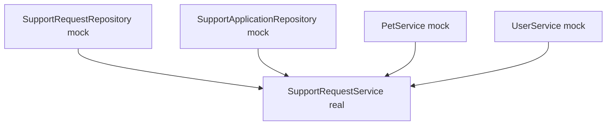

# 31 — Pruebas unitarias

Hasta ahora hemos estudiado Services como el lugar donde viven muchas reglas de negocio.

Ahora aparece una pregunta esencial:

> **¿Cómo comprobamos una regla de un Service sin depender de una base de datos, de Spring MVC, de Thymeleaf o de un servidor HTTP?**

En PetMatch la respuesta actual es:

```text
JUnit 5
+
Mockito
+
Service real
+
colaboradores mock
```

---

# 1. ¿Qué significa “prueba unitaria” aquí?

En este proyecto una prueba unitaria de Service intenta aislar una unidad principal:

```text
SupportRequestService
```

o:

```text
SupportApplicationService
```

Sus colaboradores no son reales.

Se reemplazan por mocks:

```text
Repository mock
UserService mock
PetService mock
Authentication mock
```

---

# 2. ¿Qué problema resuelve el aislamiento?

Supón que queremos comprobar esta regla:

```text
cancelar una SupportRequest OPEN
→ request CANCELLED
→ applications PENDING REJECTED
```

Para probar solamente esa decisión no necesitamos:

```text
MySQL real
HTTP
SecurityFilterChain
Thymeleaf
Spring ApplicationContext completo
```

Necesitamos que el Service reciba respuestas controladas de sus dependencias.

---

# 3. Clase real: `SupportRequestServiceTests`

Ruta:

```text
src/test/java/com/petmatch/community/service/SupportRequestServiceTests.java
```

Encabezado:

```java
@ExtendWith(MockitoExtension.class)
class SupportRequestServiceTests {
```

No tiene:

```java
@SpringBootTest
```

Por tanto Spring Boot no levanta su ApplicationContext para este test.

---

# 4. `MockitoExtension`

La anotación:

```java
@ExtendWith(MockitoExtension.class)
```

integra Mockito con JUnit 5 para esta clase.

Permite que Mockito prepare campos anotados con:

```java
@Mock
@InjectMocks
```

---

# 5. `@Mock`

En `SupportRequestServiceTests` aparecen:

```java
@Mock
private SupportRequestRepository supportRequestRepository;

@Mock
private SupportApplicationRepository supportApplicationRepository;

@Mock
private PetService petService;

@Mock
private UserService userService;

@Mock
private Authentication authentication;
```

Estos objetos no ejecutan su lógica real a menos que configuremos comportamiento específico.

---

# 6. Un mock no es una instancia real de Repository

Cuando hacemos:

```java
@Mock
private SupportRequestRepository supportRequestRepository;
```

no estamos conectando JPA a MySQL.

Estamos creando un doble de prueba controlado por Mockito.

Eso significa:

```text
Repository real ❌
DB real ❌
query JPA real ❌
```

---

# 7. `@InjectMocks`

La clase contiene:

```java
@InjectMocks
private SupportRequestService supportRequestService;
```

Aquí sí queremos una instancia real del Service bajo prueba.

Mockito intenta proporcionarle los mocks compatibles como colaboradores.

Modelo:



---

# 8. La unidad bajo prueba es real

Este punto es importante:

```text
Service real ✅
Dependencias mock ✅
```

No tendría sentido mockear también `supportRequestService` y luego pretender que estamos probando su lógica.

---

# 9. Primer test real

Nombre:

```java
void cancelRejectsPendingApplications()
```

El nombre cuenta la regla esperada:

```text
cancel
→ pending applications rejected
```

---

# 10. Arrange: preparar el owner

El test crea:

```java
User owner = new User(
    "Owner",
    "owner@example.com",
    "hash"
);
```

No guarda ese `User` en DB.

Solo necesita un objeto suficiente para representar al usuario actual dentro de este escenario unitario.

---

# 11. Algunas entidades también son mocks

El test usa:

```java
SupportRequest request =
    org.mockito.Mockito.mock(SupportRequest.class);

SupportApplication pendingApplication =
    org.mockito.Mockito.mock(SupportApplication.class);
```

Esto permite verificar directamente setters invocados sobre ellas.

---

# 12. `when(...).thenReturn(...)`

Primera configuración:

```java
when(userService.getCurrentUser(authentication))
    .thenReturn(owner);
```

Significa:

> cuando el Service bajo prueba pregunte al `userService` mock por el usuario actual, devuelve este owner.

No se ejecuta la implementación real de `UserService.getCurrentUser(...)`.

---

# 13. Simular el Repository

```java
when(
    supportRequestRepository
        .findByIdAndOwnerId(10L, owner.getId())
)
.thenReturn(Optional.of(request));
```

El test simula que la búsqueda owned encontró la request.

No comprueba si la query JPA está bien escrita.

Eso pertenecería a integración.

---

# 14. Configurar estado de la request

```java
when(request.getStatus())
    .thenReturn(SupportRequestStatus.OPEN);
```

La regla `cancel` exige que la request esté `OPEN`.

Así el test construye el escenario válido necesario para llegar a la transición.

---

# 15. Configurar applications pendientes

```java
when(
    supportApplicationRepository
        .findBySupportRequestIdAndStatus(
            10L,
            SupportApplicationStatus.PENDING
        )
)
.thenReturn(List.of(pendingApplication));
```

El Service “cree” que existe una application pendiente asociada.

---

# 16. Act

La acción real es una sola:

```java
supportRequestService.cancel(
    10L,
    authentication
);
```

Aquí se ejecuta la implementación verdadera de `SupportRequestService.cancel`.

---

# 17. Assert mediante `verify`

Después:

```java
verify(request)
    .setStatus(SupportRequestStatus.CANCELLED);
```

Y:

```java
verify(pendingApplication)
    .setStatus(SupportApplicationStatus.REJECTED);
```

El test verifica que el Service ordenó las transiciones esperadas.

---

# 18. ¿Qué demuestra este test?

Demuestra que, bajo las respuestas configuradas:

```text
request OPEN
+
owned request encontrada
+
una application PENDING
```

el Service ejecuta:

```text
request → CANCELLED
application → REJECTED
```

---

# 19. ¿Qué NO demuestra?

No demuestra que:

```text
findByIdAndOwnerId genere SQL correcto
la transacción haga commit
Hibernate detecte dirty checking
MySQL persista los estados
Spring Security autentique realmente
```

Esos elementos están fuera de la unidad aislada.

---

# 20. Segunda clase: `SupportApplicationServiceTests`

Ruta:

```text
src/test/java/com/petmatch/community/service/SupportApplicationServiceTests.java
```

También usa:

```java
@ExtendWith(MockitoExtension.class)
```

Y contiene dos tests.

---

# 21. Test de aceptación

Nombre real:

```java
acceptMovesRequestToInProgressAndRejectsOtherPendingApplications
```

La historia del nombre es:

```text
accept selected application
→ selected ACCEPTED
→ request IN_PROGRESS
→ other pending REJECTED
```

---

# 22. Dependencias mock del Service

La clase declara:

```java
@Mock
SupportApplicationRepository

@Mock
SupportRequestRepository

@Mock
UserService

@Mock
Authentication
```

Y:

```java
@InjectMocks
SupportApplicationService
```

---

# 23. Preparar selected y other pending

El test crea mocks:

```java
SupportApplication selected = mock(...);
SupportApplication otherPending = mock(...);
SupportRequest request = mock(...);
```

Eso permite representar exactamente el grafo mínimo requerido.

---

# 24. Simular ownership

```java
when(
    supportApplicationRepository
        .findByIdAndSupportRequestOwnerId(
            20L,
            owner.getId()
        )
)
.thenReturn(Optional.of(selected));
```

La prueba no estudia la implementación SQL de ownership.

Solo coloca al Service en el camino:

```text
selected application encontrada para owner actual
```

---

# 25. Simular lock fetch

El Service real usa:

```text
findByIdForUpdate
```

El test configura:

```java
when(
    supportRequestRepository.findByIdForUpdate(10L)
)
.thenReturn(Optional.of(request));
```

Esto permite que el Service continúe.

Pero atención:

> el test unitario **no prueba que exista un lock pesimista real en la base de datos**.

El Repository es un mock.

---

# 26. Simular ausencia de ACCEPTED previa

```java
when(
    supportApplicationRepository
        .countBySupportRequestIdAndStatus(
            10L,
            SupportApplicationStatus.ACCEPTED
        )
)
.thenReturn(0L);
```

Así la regla permite aceptar.

---

# 27. Simular lista PENDING

```java
when(
    supportApplicationRepository
        .findBySupportRequestIdAndStatus(
            10L,
            SupportApplicationStatus.PENDING
        )
)
.thenReturn(List.of(selected, otherPending));
```

El Service debe distinguir la seleccionada de las demás.

---

# 28. Act de aceptación

```java
supportApplicationService.accept(
    20L,
    authentication
);
```

---

# 29. Verificaciones principales

```java
verify(selected)
    .setStatus(SupportApplicationStatus.ACCEPTED);
```

```java
verify(request)
    .setStatus(SupportRequestStatus.IN_PROGRESS);
```

```java
verify(otherPending)
    .setStatus(SupportApplicationStatus.REJECTED);
```

Esto documenta exactamente el efecto esperado del caso de uso.

---

# 30. ¿Qué regla cubre?

Este test cubre unitariamente una parte crítica de la máquina de estados:

```text
SupportApplication PENDING
→ ACCEPTED

SupportRequest OPEN
→ IN_PROGRESS

otras PENDING
→ REJECTED
```

---

# 31. Lo que no cubre sobre concurrencia

Aunque el Service llame a `findByIdForUpdate`, este test no ejecuta:

```text
transacciones reales concurrentes
row lock real
segunda conexión
bloqueo de MySQL
```

Así que no es una prueba de concurrencia real.

Prueba la decisión del Service de usar ese colaborador dentro del flujo.

---

# 32. Segundo test de `SupportApplicationServiceTests`

Nombre:

```java
applyRejectsExpiredOpenRequest()
```

Aquí no buscamos verificar setters.

Queremos demostrar una excepción.

---

# 33. Preparar request vencida

```java
when(request.getStatus())
    .thenReturn(SupportRequestStatus.OPEN);
```

Y:

```java
when(request.getServiceDate())
    .thenReturn(
        LocalDateTime.now().minusMinutes(1)
    );
```

La request sigue `OPEN`, pero su fecha ya pasó.

---

# 34. `assertThrows`

El test hace:

```java
assertThrows(
    SupportApplicationRuleException.class,
    () -> supportApplicationService.apply(
        10L,
        form,
        authentication
    )
);
```

Esto expresa:

> esperamos que ejecutar esta operación produzca exactamente una excepción compatible con `SupportApplicationRuleException`.

---

# 35. Una excepción también es comportamiento esperado

Un test no solo verifica “casos exitosos”.

Para reglas de negocio, muchas veces el comportamiento correcto es impedir una operación.

Ejemplo:

```text
request OPEN pero vencida
→ aplicar debe fallar
```

Ese fallo es parte del contrato del Service.

---

# 36. Arrange — Act — Assert

Podemos reorganizar mentalmente cualquier test PetMatch así.

## Arrange

```text
crear objetos
crear mocks
configurar when
```

## Act

```text
invocar método del Service real
```

## Assert

```text
verify
assertThrows
assertEquals
```

---

# 37. `when` no es una assertion

Esto:

```java
when(request.getStatus())
    .thenReturn(OPEN);
```

no comprueba nada.

Solo prepara el escenario.

La comprobación ocurre después mediante `verify` o una assertion JUnit.

---

# 38. `verify` comprueba interacción

Ejemplo:

```java
verify(request)
    .setStatus(CANCELLED);
```

Pregunta:

```text
¿se llamó este método con este argumento?
```

No pregunta directamente:

```text
¿qué valor final tiene una fila en MySQL?
```

---

# 39. `assertThrows` comprueba un resultado excepcional

Ejemplo:

```text
aplicar a request vencida
→ debe lanzar SupportApplicationRuleException
```

No necesitamos un `try/catch` manual en el test.

---

# 40. Mock vs stub

En conversación técnica suele aparecer esta distinción:

```text
stub
→ devuelve datos programados

mock
→ además permite verificar interacciones
```

Mockito usa objetos mock que pueden cumplir ambos papeles.

En PetMatch hacemos tanto:

```java
when(...).thenReturn(...)
```

como:

```java
verify(...)
```

---

# 41. ¿Por qué mockear `Authentication`?

Los Services reciben:

```java
Authentication authentication
```

Pero en el test unitario no queremos atravesar Spring Security real.

Por eso usamos:

```java
@Mock
private Authentication authentication;
```

y configuramos `UserService` para devolver el usuario esperado cuando reciba ese objeto.

---

# 42. ¿Por qué no usar HTTP Basic en estos tests?

Porque HTTP Basic pertenece a otra capa.

En una prueba unitaria del Service queremos llegar directamente al método de negocio.

HTTP Basic se prueba en `RestApiIntegrationTests`.

---

# 43. ¿Por qué no usar `@Autowired`?

Estas clases no necesitan el contenedor Spring.

`@InjectMocks` es de Mockito, no de Spring.

Eso mantiene el test unitario más aislado.

---

# 44. ¿Por qué suelen ser rápidos?

No levantan:

```text
ApplicationContext
DataSource
Hibernate
SecurityFilterChain
MockMvc
```

Trabajan principalmente en memoria con objetos Java y mocks.

En general esto reduce trabajo de infraestructura por test.

---

# 45. Pero aislamiento tiene costo

Si configuramos un mock con un método que en realidad está mal definido en Repository, el test puede seguir pasando porque nunca ejecuta la implementación real.

Por eso:

```text
unit tests
+
integration tests
```

se complementan.

---

# 46. Un test unitario puede pasar aunque JPA esté roto

Ejemplo conceptual:

```text
when(repository.findByIdAndOwnerId(...))
→ Optional.of(request)
```

Mockito devuelve exactamente eso.

Aunque una query real tuviera un problema, este test no lo detectaría.

---

# 47. Tampoco prueba Bean Validation MVC/REST

Los tests unitarios actuales llaman Services directamente.

No atraviesan:

```text
@RequestBody
@ModelAttribute
@Valid
BindingResult
```

Por tanto no debemos atribuirles cobertura de binding/validation web.

---

# 48. Tampoco prueban `@Transactional`

Aunque los Services reales estén anotados con `@Transactional`, aquí la instancia es creada por Mockito y no está envuelta por el proxy Spring que gestionaría transacciones.

Por tanto este nivel prueba lógica Java del Service, no el comportamiento transaccional real de Spring.

---

# 49. Esto es muy importante pedagógicamente

La misma clase productiva puede verse de dos maneras:

```text
unit test
→ método Java aislado
```

```text
integration test
→ Bean Spring con infraestructura real alrededor
```

Esa diferencia explica por qué necesitamos ambos niveles.

---

# 50. Un test por comportamiento, no por método necesariamente

`accept(...)` contiene varias decisiones.

El test actual cubre una historia principal:

```text
aceptar selected
→ in progress
→ reject others
```

Otros comportamientos podrían merecer tests adicionales:

```text
request no OPEN
selected no PENDING
already accepted exists
owner incorrecto
```

No pueden considerarse cubiertos unitariamente si no existen en la suite actual.

---

# 51. Cobertura unitaria actual

Tenemos explícitamente:

```text
SupportRequestService.cancel
→ cancela request
→ rechaza applications PENDING
```

```text
SupportApplicationService.accept
→ selected ACCEPTED
→ request IN_PROGRESS
→ otras PENDING REJECTED
```

```text
SupportApplicationService.apply
→ request OPEN vencida
→ SupportApplicationRuleException
```

---

# 52. ¿Qué Services no tienen clase unitaria dedicada?

En `src/test/java/com/petmatch/community/service/` no aparecen clases unitarias dedicadas para:

```text
UserService
PetService
```

Eso no significa que sus comportamientos nunca se prueben: algunos participan en integración.

Pero no tienen una clase unitaria propia en este directorio.

---

# 53. No confundir cobertura indirecta con test dedicado

`PetService` aparece en `MvpFlowIntegrationTests`.

Así que algunos comportamientos se ejecutan en integración.

Pero eso no convierte automáticamente esa clase en una suite unitaria de `PetService`.

---

# 54. Datos hardcoded en unit tests

Ejemplos:

```text
10L
20L
21L
owner@example.com
```

Son ids/datos de escenario, no ids persistidos realmente.

Como no hay DB real, simplemente ayudan a conectar expectativas entre mocks.

---

# 55. El `owner.getId()` puede ser null

El `User owner` creado con constructor no ha sido persistido.

Por eso su `id` puede ser `null`.

El test sigue siendo válido porque tanto el `when(...)` como la llamada real del Service utilizan ese mismo valor para el mock.

Esto es otra señal de que no estamos probando persistencia.

---

# 56. ¿Es malo que sea null?

No necesariamente para este escenario unitario.

La pregunta del test es la lógica de transición, no la generación del id.

Si quisiéramos probar identidad persistente real, necesitaríamos otro nivel.

---

# 57. Test doble demasiado inteligente

Un peligro general sería programar mocks con tanta lógica que terminemos reimplementando el Service dentro del test.

Los tests actuales mantienen configuraciones simples:

```text
cuando pregunte X → devuelve Y
```

Eso facilita leer la regla.

---

# 58. No probar implementación irrelevante

Lo importante en cancel es:

```text
estado final solicitado
```

No tendría sentido verificar cada getter interno sin que represente comportamiento útil.

Las verificaciones deberían centrarse en decisiones relevantes.

---

# 59. Test frágil por exceso de `verify`

Si verificamos cada llamada interna, un refactor que conserva comportamiento podría romper muchos tests.

Los tests actuales verifican principalmente transiciones relevantes.

Es una buena oportunidad para discutir diferencia entre:

```text
comportamiento
```

y:

```text
detalle de implementación
```

---

# 60. Pruebas negativas son fundamentales

`applyRejectsExpiredOpenRequest` demuestra que un test negativo puede ser más valioso que otro caso feliz.

Las reglas importantes suelen incluir:

```text
qué se permite
+
qué se impide
```

---

# 61. ¿Dónde ejecutarlas?

Con Maven Wrapper, conceptualmente:

```bash
./mvnw test
```

En Windows:

```text
mvnw.cmd test
```

Eso ejecuta la suite de tests configurada por Maven.

No es necesario instalar Maven globalmente si usamos el Wrapper del proyecto.

---

# 62. Ejecutar solo una clase

Maven/Surefire permite normalmente seleccionar una clase de test mediante su opción de test.

Para el libro, lo esencial es entender primero la suite completa y la diferencia de niveles.

No necesitamos convertir este capítulo en un manual exhaustivo de flags de Maven.

---

# 63. Fallo de unit test

Si cambiamos una regla productiva y el test ya no recibe la interacción esperada, Mockito/JUnit marcará el test como fallido.

La función del test es avisar:

```text
el comportamiento observado ya no coincide con la expectativa escrita
```

Después debemos decidir si:

```text
se rompió código
```

o:

```text
cambió legítimamente la especificación y debe actualizarse el test
```

---

# 64. Un test no prueba “que no haya bugs”

Solo aporta evidencia sobre los escenarios que ejecuta.

Tres unit tests no significan:

```text
todas las reglas de Services verificadas
```

Debemos evitar esa conclusión.

---

# 65. Tests como red de seguridad

Su valor aparece especialmente al refactorizar.

Si reorganizamos código de `accept(...)`, queremos conservar:

```text
selected ACCEPTED
request IN_PROGRESS
others REJECTED
```

El test permite detectar si esa historia se pierde.

---

# 66. Prueba unitaria y diseño

Cuando un Service necesita demasiados colaboradores o setup enorme para probar una regla, puede ser señal de alto acoplamiento.

En PetMatch las pruebas actuales también ayudan a visualizar las dependencias reales del Service.

---

# 67. Leer `@InjectMocks` como diagrama de dependencias

En `SupportApplicationServiceTests`:

```text
SupportApplicationService
├── SupportApplicationRepository
├── SupportRequestRepository
└── UserService
```

La propia estructura del test sirve para revisar arquitectura.

---

# 68. Error frecuente: mockear lo que quieres probar

Incorrecto conceptualmente:

```java
@Mock
SupportApplicationService service;
```

si la meta es probar su lógica.

Entonces solo estaríamos programando respuestas del propio objeto bajo prueba.

---

# 69. Error frecuente: esperar persistencia real

Después de:

```java
verify(request).setStatus(IN_PROGRESS);
```

no existe una fila real que consultar.

El objeto puede incluso ser un mock.

---

# 70. Error frecuente: decir que el lock quedó probado

La llamada al método asociado al lock puede participar en el test, pero el efecto de base de datos del pessimistic lock no se ejerce porque el Repository es mock.

---

# 71. Error frecuente: usar `when` como validación

Preparar una respuesta no demuestra que el comportamiento haya ocurrido.

Necesitamos assertions/verifications.

---

# 72. Error frecuente: probar solo casos felices

Reglas como fecha expirada merecen tests negativos.

---

# 73. Error frecuente: levantar Spring innecesariamente

Para estas pruebas concretas del Service, usar `@SpringBootTest` aumentaría el alcance y cambiaría el tipo de prueba.

No necesitamos contexto completo para verificar setters/excepciones del algoritmo aislado.

---

# 74. Error frecuente: creer que unit test sustituye integración

Mocks pueden devolver respuestas que una DB real nunca produciría.

Necesitamos integración para comprobar colaboración real.

---

# 75. 🛠 Prueba en el código

## Actividad 1 — Marca AAA

Abre:

```text
cancelRejectsPendingApplications
```

separa cada línea en:

```text
Arrange
Act
Assert
```

## Actividad 2 — Lista de mocks

Para cada `@Mock`, escribe por qué queremos reemplazarlo en este nivel.

## Actividad 3 — Lock

Explica por qué configurar:

```java
findByIdForUpdate(...)
```

no significa probar un lock real.

## Actividad 4 — Caso negativo

Sigue `applyRejectsExpiredOpenRequest` y encuentra la condición temporal exacta que provoca la excepción.

## Actividad 5 — Test faltante

Diseña, sin implementarlo como si existiera, un test unitario posible para:

```text
owner no puede postularse a su propia request
```

Lista únicamente mocks, `when`, Act y assertion necesarios.

---

# 76. 🧪 Comprueba que entendiste

1. ¿Qué framework ejecuta estos tests?
2. ¿Qué librería crea mocks?
3. ¿Qué extensión integra Mockito con JUnit 5?
4. ¿Qué significa `@Mock`?
5. ¿Qué significa `@InjectMocks`?
6. ¿El Service bajo prueba es mock?
7. ¿Los Repositories son reales?
8. ¿Se usa MySQL en estos unit tests?
9. ¿Se levanta Spring Boot?
10. ¿Qué hace `when(...).thenReturn(...)`?
11. ¿Qué hace `verify(...)`?
12. ¿Qué hace `assertThrows(...)`?
13. ¿Qué comprueba `cancelRejectsPendingApplications`?
14. ¿Qué comprueba el test de `accept`?
15. ¿Qué comprueba `applyRejectsExpiredOpenRequest`?
16. ¿El test de `accept` prueba el lock pesimista real?
17. ¿Las unitarias prueban `@Transactional` real?
18. ¿Prueban Bean Validation HTTP/MVC?
19. ¿UserService tiene clase unitaria dedicada?
20. ¿PetService tiene clase unitaria dedicada?

### Respuestas esperadas

1. JUnit 5.
2. Mockito.
3. `MockitoExtension`.
4. Un colaborador simulado/controlado.
5. Una instancia real bajo prueba a la que Mockito inyecta mocks compatibles.
6. No.
7. No.
8. No.
9. No en estas clases.
10. Configura el comportamiento del mock.
11. Comprueba una interacción realizada sobre un mock.
12. Comprueba que una ejecución lance una excepción esperada.
13. Que cancelar una request OPEN la marque CANCELLED y rechace pendientes.
14. ACCEPTED para selected, IN_PROGRESS para request y REJECTED para otras PENDING.
15. Que una request OPEN pero vencida no acepte postulación.
16. No.
17. No, no hay proxy transaccional de Spring en este nivel.
18. No.
19. No.
20. No.

---

# 77. ✅ Qué debes recordar

- Una prueba unitaria de Service en PetMatch ejecuta **el Service real con colaboradores mock**.
- `@ExtendWith(MockitoExtension.class)` integra Mockito y JUnit 5.
- `@Mock` reemplaza colaboradores como Repository/UserService/Authentication.
- `@InjectMocks` crea la unidad real y conecta los mocks.
- `when(...).thenReturn(...)` prepara el escenario.
- `verify(...)` comprueba interacciones importantes.
- `assertThrows(...)` comprueba reglas que deben rechazar operaciones.
- Los tests unitarios actuales no levantan Spring Boot.
- No usan DB real ni ejecutan queries JPA reales.
- No prueban transacciones reales ni locks reales.
- No prueban HTTP, SecurityFilterChain, binding o Bean Validation web.
- `cancelRejectsPendingApplications` cubre cancelación y rechazo de pendientes.
- `acceptMovesRequestToInProgressAndRejectsOtherPendingApplications` cubre la transición principal de aceptación.
- `applyRejectsExpiredOpenRequest` cubre una regla negativa temporal.
- Los mocks permiten aislamiento, pero no reemplazan las pruebas de integración.
- La suite unitaria actual es útil, pero no representa cobertura total de todos los Services.

---

# 🔗 Continúa con

Ahora conocemos el extremo aislado:

```text
Service real
+
mocks
```

La siguiente pregunta es:

> **¿Qué cambia cuando levantamos Spring Boot y dejamos colaborar Services, Repositories, Security y MockMvc reales?**

Continúa con:

**[Capítulo 32 — Pruebas de integración →](32-pruebas-de-integracion.md)**

---

[← Bloque 06 — Calidad y recorrido](README.md) · [Índice general](../README.md) · [Siguiente → Capítulo 32](32-pruebas-de-integracion.md)
