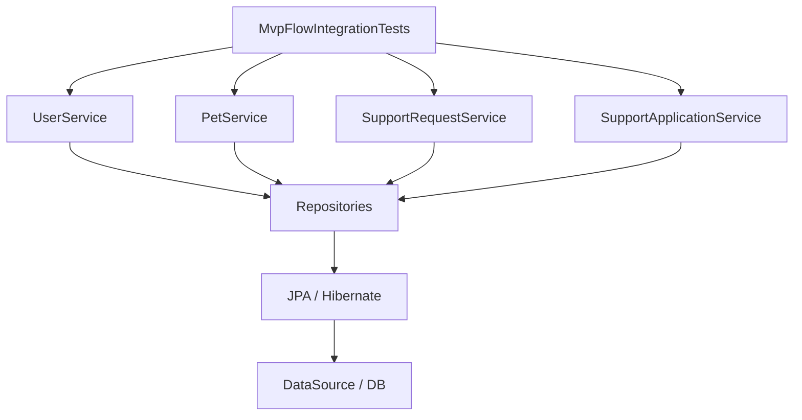
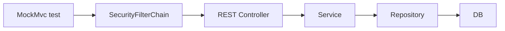
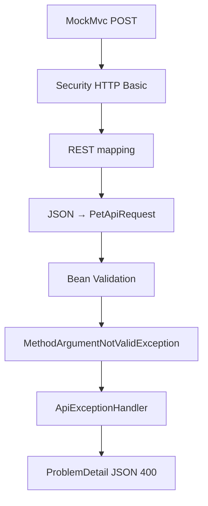
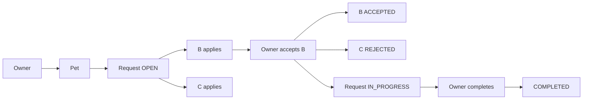

# 32 — Pruebas de integración

En el capítulo 31 aislamos Services con Mockito.

Ahora hacemos lo contrario:

> **¿Qué ocurre cuando dejamos que varias piezas reales de PetMatch colaboren dentro del contexto Spring?**

La suite actual ofrece tres ejemplos muy útiles:

```text
PetMatchCommunityApplicationTests
→ carga del contexto

MvpFlowIntegrationTests
→ Services + Repositories + DB + reglas

RestApiIntegrationTests
→ HTTP + Security + MVC REST + validation + Services + DB
```

---

# 1. ¿Qué significa integración aquí?

Una prueba de integración intenta comprobar la colaboración entre varias piezas reales.

En PetMatch podemos integrar combinaciones como:

```text
Spring context
Services
Repositories
JPA/Hibernate
DataSource
Security
MockMvc
Validation
JSON
```

No todas las pruebas integran exactamente las mismas capas.

---

# 2. `@SpringBootTest`

Las tres clases actuales utilizan:

```java
@SpringBootTest
```

Esto pide a Spring Boot construir el `ApplicationContext` de la aplicación para la prueba.

A diferencia de los unit tests con Mockito:

```text
Beans reales ✅
configuración Spring ✅
infraestructura Spring ✅
```

---

# 3. El contexto importa

Cuando Spring levanta el contexto puede detectar problemas como:

```text
Bean faltante
dependencia circular
configuración inválida
DataSource no disponible
problema de creación de Repository
```

Por eso incluso un test vacío puede aportar información.

---

# 4. Primer nivel: `contextLoads()`

Archivo:

```text
src/test/java/com/petmatch/community/PetMatchCommunityApplicationTests.java
```

Código:

```java
@SpringBootTest
class PetMatchCommunityApplicationTests {

    @Test
    void contextLoads() {
    }
}
```

---

# 5. ¿Por qué el método está vacío?

Porque la comprobación principal ocurre antes/durante la creación del test:

```text
Spring Boot
→ construir ApplicationContext
→ crear Beans
→ configurar infraestructura
```

Si todo eso falla, el test falla aunque el cuerpo esté vacío.

---

# 6. ¿Qué NO demuestra `contextLoads()`?

No demuestra por sí solo que:

```text
accept funcione
ownership funcione
REST devuelva 201
ProblemDetail tenga errors
una request llegue a COMPLETED
```

Solo aporta evidencia de que el contexto puede arrancar bajo el entorno de prueba disponible.

---

# 7. Segundo nivel: `MvpFlowIntegrationTests`

Ruta:

```text
src/test/java/com/petmatch/community/integration/MvpFlowIntegrationTests.java
```

Anotaciones:

```java
@SpringBootTest
@Transactional
class MvpFlowIntegrationTests {
```

Aquí el test ya ejecuta casos de negocio reales.

---

# 8. Dependencias reales con `@Autowired`

La clase inyecta:

```java
@Autowired UserService
@Autowired PetService
@Autowired SupportRequestService
@Autowired SupportApplicationService
@Autowired SupportRequestRepository
@Autowired SupportApplicationRepository
```

A diferencia de capítulo 31:

```text
@Mock ❌
@InjectMocks ❌
```

Estos objetos provienen del contenedor Spring.

---

# 9. Repositories reales

Cuando el test llama:

```java
supportRequestRepository.findById(...)
```

no estamos programando una respuesta con `when(...)`.

El Repository real participa con JPA/Hibernate y el DataSource configurado.

Por eso este nivel puede revelar problemas que Mockito no detecta.

---

# 10. Services reales

También se ejecutan los Services productivos con sus dependencias reales.

Ejemplo:

```java
Pet pet = petService.create(...);
```

recorre realmente la lógica de `PetService` y su Repository.

---

# 11. Datos únicos por ejecución

El test genera:

```java
String suffix = UUID.randomUUID()
    .toString()
    .substring(0, 8);
```

Después crea emails como:

```text
owner-<suffix>@example.com
applicant-b-<suffix>@example.com
```

Esto reduce colisiones con datos previos durante ejecuciones repetidas.

---

# 12. Registro real de usuarios

Helper:

```java
return userService.register(form);
```

Esto significa que el test utiliza realmente:

```text
UserService
→ duplicate check
→ email normalization
→ PasswordEncoder
→ UserRepository.save
```

No crea únicamente mocks de User.

---

# 13. Authentication de integración del flujo

Para el flujo MVP el test construye:

```java
new UsernamePasswordAuthenticationToken(
    user.getEmail(),
    "ignored",
    List.of(
        new SimpleGrantedAuthority("ROLE_USER")
    )
)
```

Esto proporciona un objeto `Authentication` utilizable por los Services.

---

# 14. Importante: no es un login web real

`MvpFlowIntegrationTests` no hace:

```text
POST /login
```

ni HTTP Basic.

Construye manualmente un `Authentication` para llamar Services directamente.

Por tanto integra Services/DB/reglas, pero no está probando la cadena HTTP de autenticación.

---

# 15. Crear Pet real

```java
Pet pet = petService.create(
    petForm("Luna", "Perro", 4),
    ownerAuth
);
```

Aquí participan:

```text
PetService
UserService.getCurrentUser
PetRepository
JPA/Hibernate
DB
```

---

# 16. Crear SupportRequest real

```java
SupportRequest request =
    supportRequestService.create(
        requestForm(pet.getId()),
        ownerAuth
    );
```

Además entra ownership de Pet.

La prueba ya une reglas estudiadas en varios capítulos.

---

# 17. Ownership negativo real

```java
assertThrows(
    PetNotFoundException.class,
    () -> petService.findOwnedPet(
        pet.getId(),
        applicantBAuth
    )
);
```

Aquí el Repository real debe respetar:

```text
pet id
+
owner id
```

No es una respuesta fabricada por Mockito.

---

# 18. Self-apply real

```java
assertThrows(
    SupportApplicationRuleException.class,
    () -> supportApplicationService.apply(
        request.getId(),
        applicationForm("Owner should not apply"),
        ownerAuth
    )
);
```

Esto prueba que el owner no puede postularse a su propia request dentro del flujo real de Services.

---

# 19. Dos applicants reales

El test crea:

```text
application B
application C
```

usando dos usuarios distintos.

Esto prepara el escenario central de aceptación.

---

# 20. Duplicado real

Después B intenta volver a aplicar:

```java
assertThrows(
    SupportApplicationRuleException.class,
    () -> supportApplicationService.apply(
        request.getId(),
        applicationForm("Duplicate"),
        applicantBAuth
    )
);
```

Así queda verificada la regla de no duplicar postulaciones dentro de la integración actual.

---

# 21. Accept real

```java
supportApplicationService.accept(
    applicationB.getId(),
    ownerAuth
);
```

A diferencia del unit test, ahora participan Repositories reales.

---

# 22. Volver a leer desde Repository

El test no se limita a observar setters.

Hace:

```java
SupportRequest inProgress =
    supportRequestRepository
        .findById(request.getId())
        .orElseThrow();
```

Y lo mismo para applications.

Esto busca comprobar estado persistido/gestionado a través de la infraestructura JPA real del test.

---

# 23. Assertions de estado

```java
assertEquals(
    SupportRequestStatus.IN_PROGRESS,
    inProgress.getStatus()
);
```

```java
assertEquals(
    SupportApplicationStatus.ACCEPTED,
    accepted.getStatus()
);
```

```java
assertEquals(
    SupportApplicationStatus.REJECTED,
    rejected.getStatus()
);
```

El flujo principal de máquina de estados queda comprobado en integración.

---

# 24. Visibilidad para applicant aceptado

El test verifica que B todavía ve la request después de pasar a `IN_PROGRESS`:

```java
assertEquals(
    request.getId(),
    supportRequestService
        .findVisibleRequest(
            request.getId(),
            applicantBAuth
        )
        .getId()
);
```

Esto conecta autorización de dominio y estados.

---

# 25. Outsider pierde visibilidad

```java
assertThrows(
    SupportRequestNotFoundException.class,
    () -> supportRequestService.findVisibleRequest(
        request.getId(),
        outsiderAuth
    )
);
```

Así queda demostrado el patrón de ocultar recursos no visibles mediante una excepción NotFound-style.

---

# 26. Completar request

```java
supportRequestService.complete(
    request.getId(),
    ownerAuth
);
```

Luego vuelve a leer la request y espera:

```text
COMPLETED
```

---

# 27. Applicant mantiene visibilidad después de COMPLETED

El test vuelve a ejecutar:

```text
findVisibleRequest
```

para applicant B y espera encontrar la misma request.

Esto documenta una regla importante del modelo actual.

---

# 28. ¿Qué integra realmente `MvpFlowIntegrationTests`?

Podemos verlo así:



No integra HTTP ni templates.

---

# 29. `@Transactional` en el test

La clase está anotada:

```java
@Transactional
```

Spring Test administra la prueba dentro de una transacción de testing.

Esto ayuda a que las modificaciones realizadas durante el test no queden como estado permanente después de la prueba bajo el comportamiento transaccional estándar de Spring Test.

---

# 30. No confundir transacción de test con Service transaction

Tenemos dos ideas relacionadas:

```text
@Transactional en Service
→ frontera productiva de caso de uso
```

```text
@Transactional en test
→ infraestructura/aislamiento del test
```

Una prueba puede estar envuelta en una transacción exterior de testing mientras invoca Services transaccionales.

---

# 31. Tercer nivel: `RestApiIntegrationTests`

Ruta:

```text
src/test/java/com/petmatch/community/integration/RestApiIntegrationTests.java
```

Anotaciones:

```java
@SpringBootTest
@AutoConfigureMockMvc
@Transactional
class RestApiIntegrationTests
```

Esta clase añade la frontera HTTP.

---

# 32. `@AutoConfigureMockMvc`

Esta anotación prepara:

```text
MockMvc
```

para probar la aplicación MVC/REST dentro del contexto Spring.

El test puede enviar requests simuladas al stack web sin necesitar iniciar un servidor externo accesible por red.

---

# 33. `MockMvc`

Se inyecta:

```java
@Autowired
private MockMvc mockMvc;
```

Luego se usa:

```java
mockMvc.perform(...)
```

para ejecutar requests y observar responses.

---

# 34. Setup con `@BeforeEach`

Antes de cada test:

```java
@BeforeEach
void registerApiUser() {
    ...
    userService.register(form);
}
```

Se crea un usuario real mediante `UserService`.

Así las credenciales Basic posteriores corresponden a una cuenta persistida con password encoded.

---

# 35. Password real del escenario

El test define:

```java
private final String password = "testing123";
```

Ese raw password se envía a `UserService.register`, que guarda el hash.

Después se reutiliza como credencial HTTP Basic.

---

# 36. `webAndApiSecurityCoexist`

Primer request:

```java
mockMvc.perform(get("/"))
    .andExpect(status().isOk());
```

Comprueba que la ruta pública web sigue accesible.

---

# 37. API sin autenticación

```java
mockMvc.perform(get("/api/v1/pets"))
    .andExpect(status().isUnauthorized());
```

Aquí sí atravesamos la configuración Security de `/api/**`.

Resultado esperado:

```text
401
```

---

# 38. API con HTTP Basic

```java
mockMvc.perform(
    get("/api/v1/pets")
        .with(httpBasic(email, password))
)
.andExpect(status().isOk());
```

Spring Security Test aporta el request post-processor:

```java
httpBasic(...)
```

para construir la autenticación HTTP correspondiente.

---

# 39. ¿Qué integra este caso?



También participa `DatabaseUserDetailsService`/PasswordEncoder dentro de la autenticación real configurada.

---

# 40. POST real de Pet

El test construye JSON:

```json
{
  "name": "Luna",
  "species": "Perro",
  "age": 4,
  "description": "Creada desde la API REST"
}
```

Y ejecuta:

```java
post("/api/v1/pets")
```

---

# 41. Content type

```java
.contentType(MediaType.APPLICATION_JSON)
```

indica que el body enviado es JSON.

Así puede participar la conversión:

```text
JSON
→ PetApiRequest
```

---

# 42. Sin CSRF token

El request usa HTTP Basic pero no agrega:

```text
csrf()
```

Y espera:

```text
201 Created
```

Esto comprueba de forma integrada la política CSRF deshabilitada de `/api/**`.

---

# 43. Verificar `201`

```java
.andExpect(status().isCreated())
```

No solo verificamos que “no lanzó excepción”.

Comprobamos el contrato HTTP.

---

# 44. Verificar `Location`

```java
.andExpect(header().exists("Location"))
```

Esto prueba una decisión REST del Controller:

```text
201 Created
+
Location
```

---

# 45. Verificar JSON con `jsonPath`

```java
.andExpect(jsonPath("$.name")
    .value("Luna"))
```

Y:

```java
.andExpect(jsonPath("$.species")
    .value("Perro"));
```

Aquí probamos el response JSON observable.

---

# 46. Validation error integrado

El tercer test envía:

```json
{
  "name": "",
  "species": "Perro",
  "age": -1
}
```

Eso viola constraints de `PetApiRequest`.

---

# 47. Esperar 400

```java
.andExpect(status().isBadRequest())
```

Así el test integra:

```text
JSON binding
→ @Valid
→ MethodArgumentNotValidException
→ ApiExceptionHandler
→ 400
```

---

# 48. Verificar `ProblemDetail`

```java
.andExpect(
    jsonPath("$.title")
        .value("Validation failed")
)
```

Esto comprueba parte del contrato documentado en capítulo 30.

---

# 49. Verificar errores por campo

```java
.andExpect(
    jsonPath("$.errors.name").exists()
)
.andExpect(
    jsonPath("$.errors.age").exists()
);
```

La prueba valida que la propiedad custom `errors` se serializa con entradas para esos campos.

---

# 50. Qué capas toca el test de validation



El Service de creación no necesita ejecutarse si validation detiene el flujo antes.

---

# 51. Unit test vs integration test: misma regla, distinta pregunta

Para accept podemos preguntar:

## Unit

```text
¿el algoritmo del Service intenta cambiar estados correctos?
```

## Integration

```text
¿el flujo real con Repositories y DB conserva esos estados y restricciones?
```

No son duplicados exactos; aportan evidencia diferente.

---

# 52. MockMvc no es Mockito

Los nombres pueden confundir.

```text
Mockito
→ mocks de objetos Java
```

```text
MockMvc
→ infraestructura de Spring para probar requests/responses MVC
```

`MockMvc` no significa que todos los Controllers/Services sean mocks.

En `@SpringBootTest`, esos Beans son reales salvo que explícitamente se sustituyan.

---

# 53. ¿Hay un servidor real escuchando puerto 8080?

Con `MockMvc` no necesitamos depender de un servidor externo accesible en `localhost:8080` para estos tests.

La request se procesa dentro del entorno de testing de Spring MVC.

Eso hace posible comprobar routing/filtros/controllers sin una llamada de red externa.

---

# 54. La base de datos sí es una dependencia real actual

El proyecto tiene:

```yaml
spring.datasource.url: ${DB_URL}
spring.datasource.username: ${DB_USERNAME}
spring.datasource.password: ${DB_PASSWORD}
```

No observamos:

```text
src/test/resources/application-test.*
H2
Testcontainers
```

como sustitución actual.

---

# 55. Consecuencia práctica

Para que `@SpringBootTest` pueda crear correctamente el DataSource, el entorno de ejecución necesita proporcionar configuración válida para esas variables.

Por tanto la reproducibilidad de la integración depende actualmente del entorno de DB disponible.

---

# 56. Base de datos utilizada por las pruebas

Sería incorrecto escribir en este libro:

```text
“los tests levantan H2 automáticamente”
```

No hay evidencia de esa configuración en el repositorio actual.

---

# 57. Testcontainers y el entorno actual

Tampoco observamos:

```java
@Testcontainers
@Container
```

ni dependencia correspondiente.

Puede ser una evolución futura, pero no parte de la implementación presente.

---

# 58. `ddl-auto: update` también aplica a configuración cargada

`application.yaml` contiene:

```yaml
spring:
  jpa:
    hibernate:
      ddl-auto: update
```

Como no se observa override de test específico, las pruebas que cargan esta configuración heredan esa política en el entorno correspondiente.

No debemos presentar eso como un sistema de migrations de test.

---

# 59. `open-in-view: false`

La configuración también mantiene:

```yaml
open-in-view: false
```

Así las integraciones se ejecutan bajo la misma decisión arquitectónica principal respecto a acceso lazy fuera de las fronteras transaccionales.

---

# 60. Una integración puede fallar por infraestructura

Ejemplos:

```text
DB no disponible
variables faltantes
mapping JPA inválido
Bean no construible
security config rota
```

Eso es parte del valor y también del costo de este nivel.

---

# 61. Las integraciones suelen ser más pesadas

Levantar contexto, JPA y Security cuesta más que crear mocks en memoria.

Por eso no reemplazamos automáticamente cada unit test por `@SpringBootTest`.

Cada nivel responde preguntas diferentes.

---

# 62. Cobertura real de `MvpFlowIntegrationTests`

La clase demuestra explícitamente:

```text
registro de 4 usuarios
Pet creation
SupportRequest creation
ownership Pet negativo
self-apply rechazado
2 postulaciones
postulación duplicada rechazada
accept
IN_PROGRESS
ACCEPTED
REJECTED
applicant visibility
outsider hidden
complete
COMPLETED
applicant still visible
```

---

# 63. Cobertura real de `RestApiIntegrationTests`

Demuestra explícitamente:

```text
web / → 200
API anónima → 401
API Basic → 200
POST API Pet sin CSRF → 201
Location presente
JSON response name/species
input inválido → 400
ProblemDetail title
errors.name
errors.age
```

---

# 64. Cobertura que NO observamos dedicada

No aparecen tests REST específicos para:

```text
404 ProblemDetail
409 ProblemDetail
JSON ilegible
PUT API
DELETE API
cancel API
complete API
accept/reject API
```

Eso no significa que esas rutas no funcionen; significa que no debemos atribuirles cobertura específica en esta suite.

---

# 65. Tampoco vemos integración MVC completa por formularios

`MvpFlowIntegrationTests` se llama “MvpFlow”, pero llama Services directamente.

No simula:

```text
GET /login
POST /register
POST /pets
Thymeleaf rendering
CSRF web form
```

Por tanto no es un test end-to-end del navegador.

---

# 66. Nombre de clase no define mágicamente su alcance

Debemos leer:

```text
anotaciones
objetos inyectados
cómo se invocan los casos
assertions
```

para saber qué integra realmente una prueba.

---

# 67. Integration ≠ end-to-end completo

`RestApiIntegrationTests` atraviesa gran parte del stack backend, pero no incluye:

```text
navegador real
DNS
proxy inverso
TLS real
frontend externo
```

Es una integración HTTP dentro del proceso de testing Spring.

---

# 68. Pruebas y ownership

Una ventaja de integración es comprobar que Service y Repository coinciden.

Ejemplo:

```text
findOwnedPet
→ Repository real
→ applicant B no recibe Pet del owner
```

Esto ofrece evidencia más fuerte que un mock programado para devolver `Optional.empty()`.

---

# 69. Pruebas y SecurityFilterChain

`RestApiIntegrationTests` sí puede detectar cambios en:

```text
securityMatcher
anyRequest().authenticated()
HTTP Basic
CSRF API
```

porque procesa requests dentro de la configuración real de seguridad.

---

# 70. Pruebas y ProblemDetail

El caso inválido conecta:

```text
DTO validation
ApiExceptionHandler
serialization
HTTP 400
```

Eso sería difícil de demostrar completamente con un unit test del Service porque el Service ni siquiera participa en esa validación web.

---

# 71. Pruebas y PasswordEncoder

El usuario API se registra mediante `UserService`.

Después el mismo raw password sirve para HTTP Basic.

Así la integración también ofrece evidencia de compatibilidad entre:

```text
passwordEncoder.encode en register
+
verificación Spring Security en Basic
```

---

# 72. Pruebas y dirty checking

Cuando Services cambian estados dentro de un contexto transaccional real y luego los Repositories leen esos objetos, entra la infraestructura JPA real.

Esto acerca la prueba a la persistencia productiva mucho más que un `verify(setStatus(...))` unitario.

---

# 73. ¿Prueba concurrencia real?

`MvpFlowIntegrationTests` ejecuta un flujo secuencial.

Aunque `accept` use un Repository con pessimistic lock, esta prueba no lanza dos transacciones simultáneas compitiendo por la misma request.

Por tanto:

```text
locking code participa
```

pero:

```text
race condition concurrente real probada
```

no debe afirmarse.

---

# 74. Tests temporales y `LocalDateTime.now()`

El flujo usa:

```java
LocalDateTime.now().plusDays(2)
```

para generar una fecha futura durante el test.

Eso satisface la regla temporal actual sin fijar una fecha histórica que eventualmente quede vencida.

---

# 75. Aleatoriedad controlada de email

El UUID evita conflictos de unique email.

Pero no convierte el test en aleatorio respecto a reglas de negocio: el flujo esperado sigue siendo determinista.

---

# 76. Un buen integration test cuenta una historia completa

`completeMvpFlowKeepsOwnershipVisibilityAndStatusesConsistent` describe tres dimensiones:

```text
ownership
visibility
statuses
```

Y el cuerpo efectivamente recorre esas dimensiones.

---

# 77. ¿Por qué volver a consultar Repositories?

Porque queremos observar el estado a través de la capa de persistencia, no depender únicamente de la referencia Java que ya teníamos.

Esto hace el test más representativo de la colaboración Service ↔ Repository.

---

# 78. ¿Qué pasa si el Repository query cambia?

Un unit test con mock podría seguir pasando si `when(...)` sigue configurado.

Una integración real puede fallar si:

```text
query derivada cambia mal
EntityGraph rompe
mapping JPA falla
constraint DB contradice flujo
```

Ese es precisamente el valor añadido.

---

# 79. ¿Qué pasa si SecurityConfig cambia?

El test REST podría detectar, por ejemplo, que:

```text
/api/v1/pets deja de pedir autenticación
```

porque la expectation de `401` fallaría.

Así funciona como red de seguridad para configuración transversal.

---

# 80. Tests de integración como documentación ejecutable

Podemos usar `MvpFlowIntegrationTests` como resumen ejecutable del MVP:



Este será el punto de partida del capítulo 33.

---

# 81. ⚠️ Errores frecuentes

## Error 1 — Llamar integración a cualquier test con muchos objetos

El criterio es qué componentes reales colaboran.

## Error 2 — Decir que `contextLoads()` prueba todo el negocio

Solo comprueba carga del contexto.

## Error 3 — Decir que `MvpFlowIntegrationTests` prueba login HTTP

Construye `Authentication` manualmente.

## Error 4 — Decir que MockMvc mockea Services

No necesariamente; aquí se usa con `@SpringBootTest` y Beans reales.

## Error 5 — Inventar H2

No está configurado.

## Error 6 — Inventar Testcontainers

No está implementado.

## Error 7 — Afirmar cobertura de todos los endpoints REST

La suite solo prueba algunos.

## Error 8 — Llamar end-to-end de navegador al flujo MVP

No utiliza navegador/templates/HTTP MVC.

## Error 9 — Afirmar que concurrencia real está probada

El test no ejecuta dos transacciones concurrentes.

## Error 10 — Olvidar las variables DB

`@SpringBootTest` actual depende de configuración de DataSource disponible.

---

# 82. 🛠 Prueba en el código

## Actividad 1 — Capas de `contextLoads`

Lista qué componentes tienen oportunidad de construirse antes de que el cuerpo vacío se ejecute.

## Actividad 2 — Flujo MVP

Dibuja el orden exacto de:

```text
register
create Pet
create Request
apply B
apply C
accept B
complete
```

## Actividad 3 — Visibilidad

Explica por qué B puede ver la request `IN_PROGRESS` y outsider no.

## Actividad 4 — Request HTTP

Traza:

```text
GET /api/v1/pets
+ httpBasic
→ Security
→ Controller
→ Service
→ Repository
→ JSON
```

## Actividad 5 — Validation

Traza el request inválido hasta `errors.name` y `errors.age`.

## Actividad 6 — Entorno DB

Busca en el repositorio una configuración H2/Testcontainers específica. Si no existe, explica qué propiedades necesita el entorno actual.

---

# 83. 🧪 Comprueba que entendiste

1. ¿Qué hace `@SpringBootTest` en términos generales?
2. ¿Qué prueba `contextLoads()`?
3. ¿Qué no prueba `contextLoads()`?
4. ¿`MvpFlowIntegrationTests` usa Services mocks?
5. ¿Usa Repositories reales?
6. ¿Hace login HTTP real?
7. ¿Cómo crea `Authentication`?
8. ¿Qué regla negativa de Pet prueba?
9. ¿Qué regla de application propia prueba?
10. ¿Qué regla de duplicado prueba?
11. ¿Qué estados verifica después de accept?
12. ¿Qué pasa con outsider?
13. ¿Qué estado final verifica?
14. ¿Qué añade `@AutoConfigureMockMvc`?
15. ¿Qué es `MockMvc`?
16. ¿Cómo se añade Basic en el test REST?
17. ¿Qué status espera sin Basic?
18. ¿Qué espera al crear Pet?
19. ¿Qué verifica del `ProblemDetail` inválido?
20. ¿Hay H2 configurado?
21. ¿Hay Testcontainers configurado?
22. ¿De dónde salen las propiedades DB?
23. ¿Las integraciones actuales prueban concurrencia real?
24. ¿`MvpFlowIntegrationTests` es end-to-end de navegador?

### Respuestas esperadas

1. Construye el ApplicationContext completo de Spring Boot para testing.
2. Que el contexto pueda cargarse bajo el entorno disponible.
3. Casos de negocio específicos.
4. No.
5. Sí.
6. No.
7. `UsernamePasswordAuthenticationToken` manual con ROLE_USER.
8. Otro usuario no puede encontrar la Pet como owned.
9. Owner no puede postularse a su propia request.
10. Un applicant no puede postularse dos veces.
11. Request IN_PROGRESS, B ACCEPTED, C REJECTED.
12. No puede ver la request no OPEN y recibe NotFound-style exception.
13. COMPLETED.
14. Configura MockMvc para pruebas web.
15. Herramienta de Spring MVC Test para ejecutar requests/responses dentro del contexto de prueba.
16. `.with(httpBasic(email, password))`.
17. 401.
18. 201 + Location + campos JSON.
19. Status 400, title `Validation failed`, `errors.name`, `errors.age`.
20. No está cubierto.
21. No está cubierto.
22. `DB_URL`, `DB_USERNAME`, `DB_PASSWORD` del entorno cargado por `application.yaml`.
23. No.
24. No.

---

# 84. ✅ Qué debes recordar

- `@SpringBootTest` integra Beans/configuración reales del ApplicationContext.
- `contextLoads()` comprueba que el contexto pueda arrancar; no cubre por sí solo el negocio.
- `MvpFlowIntegrationTests` integra Services, Repositories, JPA y DB.
- Ese test crea manualmente `Authentication`; no prueba el login HTTP.
- Comprueba ownership, self-apply, duplicados, estados y visibilidad del flujo principal.
- Después de accept espera `IN_PROGRESS`, `ACCEPTED` y `REJECTED`.
- Después de complete espera `COMPLETED`.
- `RestApiIntegrationTests` añade `@AutoConfigureMockMvc` y la frontera HTTP.
- `MockMvc` no significa que Services sean mocks.
- El test REST comprueba coexistencia web/API, HTTP Basic, 401, POST sin CSRF, 201, Location y JSON.
- También comprueba validación → `ProblemDetail` 400 con errores por campo.
- Las integraciones actuales dependen de un DataSource configurado mediante variables de entorno.
- No hay H2/Testcontainers configurados como infraestructura de test actual.
- No existe cobertura dedicada para todos los endpoints y todos los errores REST.
- El flujo de integración es secuencial; no prueba competencia concurrente real.
- Unit tests e integration tests se complementan porque responden preguntas diferentes.

---

# 🔗 Continúa con

Con 31 y 32 ya podemos leer las pruebas como evidencia del diseño.

La siguiente etapa recorre la aplicación completa, no por capas aisladas sino siguiendo una historia de usuario de principio a fin:

```text
registro
→ Pet
→ request
→ applications
→ accept
→ IN_PROGRESS
→ complete
→ COMPLETED
```

Continúa con:

**[Capítulo 33 — Flujo completo PetMatch →](33-flujo-completo-petmatch.md)**

---

[← Capítulo 31 — Pruebas unitarias](31-pruebas-unitarias.md) · [Índice del bloque](README.md) · [Índice general](../README.md) · [Siguiente → Capítulo 33](33-flujo-completo-petmatch.md)
