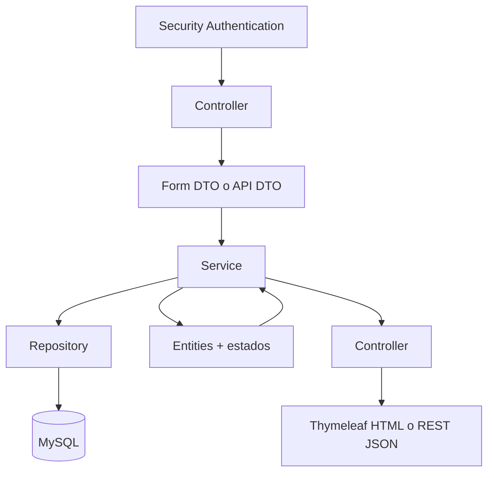
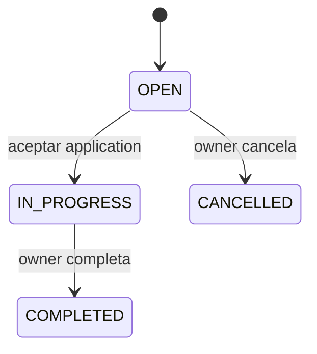
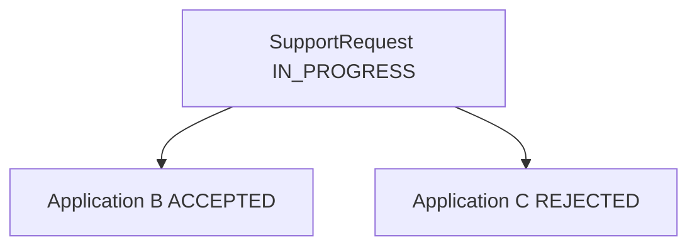
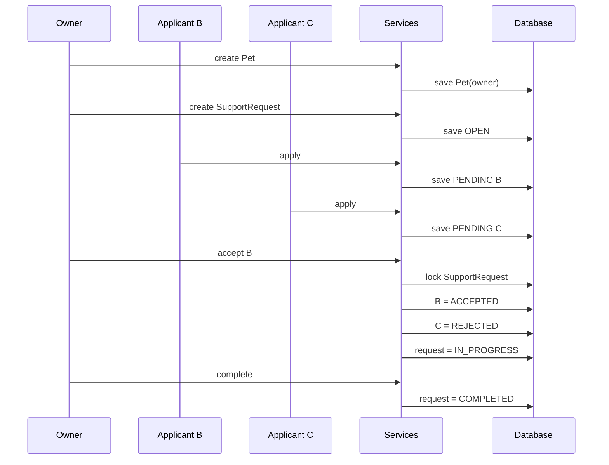
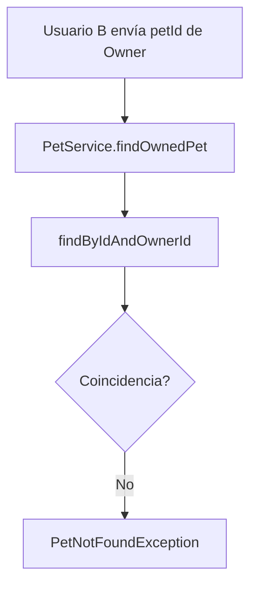
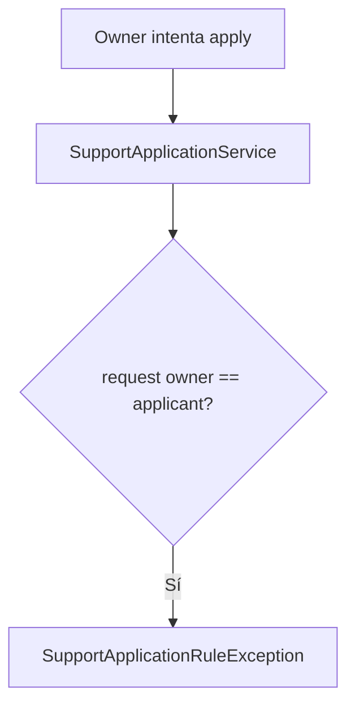
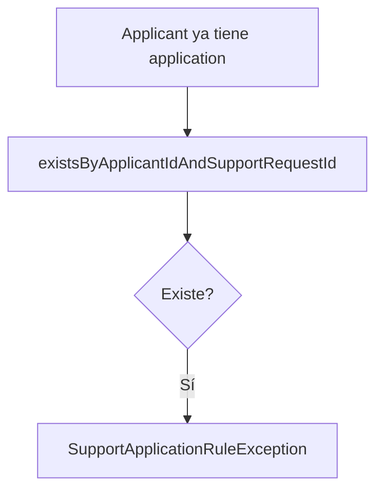
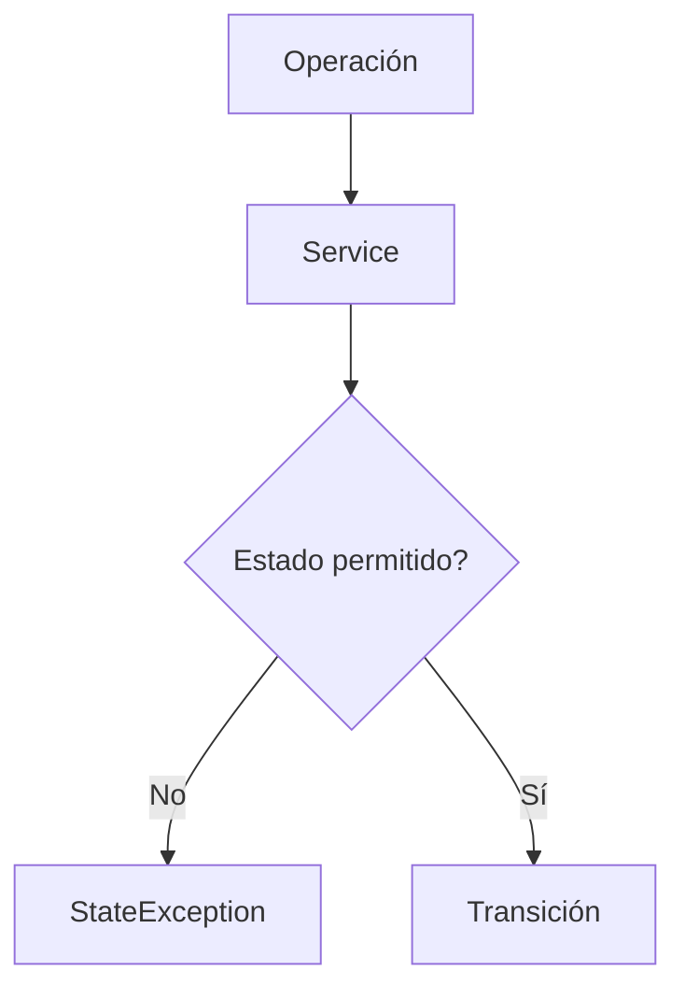
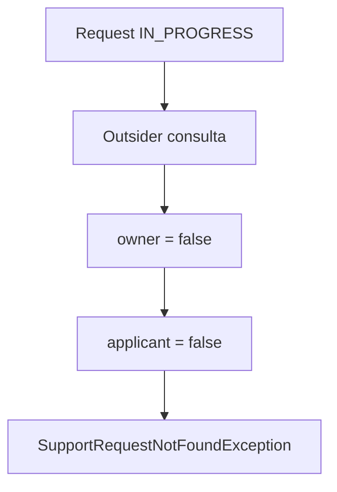
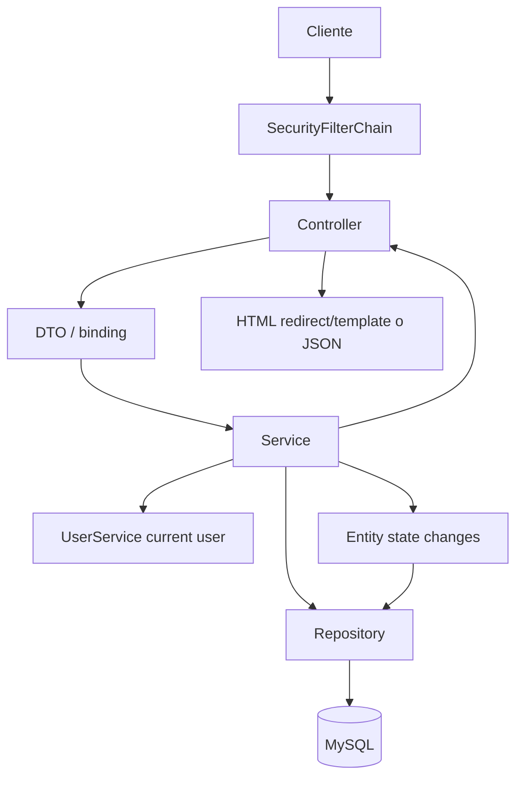

# 33 — Flujo completo de PetMatch

En los capítulos anteriores estudiamos piezas individuales:

```text
Controller
Service
Repository
Entity
Security
DTO
REST
Tests
```

Ahora vamos a unirlas.

La pregunta central de este capítulo es:

> **¿Qué ocurre realmente, de principio a fin, cuando varios usuarios recorren el caso de uso principal de PetMatch?**

El flujo que vamos a seguir es el mismo que confirma `MvpFlowIntegrationTests`:

```text
owner registra Pet
→ crea SupportRequest OPEN
→ applicant B se postula PENDING
→ applicant C se postula PENDING
→ owner acepta B
→ B ACCEPTED
→ C REJECTED
→ request IN_PROGRESS
→ applicant relacionado conserva visibilidad
→ outsider no puede verla
→ owner completa
→ request COMPLETED
```

---

# 1. El flujo no pertenece a una sola clase

No existe un método llamado:

```java
completeWholePetMatchFlow()
```

El comportamiento emerge de la colaboración de muchas piezas:



La arquitectura distribuye responsabilidades.

---

# 2. Los actores del escenario

El test de integración crea cuatro usuarios:

```text
Owner
Applicant B
Applicant C
Outsider
```

Cada uno representa una relación diferente con los recursos.

| Usuario | Relación principal |
|---|---|
| Owner | propietario de Pet y SupportRequest |
| Applicant B | se postula y luego es aceptado |
| Applicant C | se postula y luego es rechazado |
| Outsider | no participa en la solicitud |

Esto permite comprobar no solo estados, sino también ownership y visibilidad.

---

# 3. Paso 0 — registro de usuarios

`MvpFlowIntegrationTests` utiliza:

```java
userService.register(form);
```

para crear las cuentas.

El Service real:

```text
normaliza email
→ verifica duplicado
→ PasswordEncoder.encode(password)
→ crea User
→ Repository.save
```

El password almacenado no es el password en texto plano.

---

# 4. De identidad de seguridad a Entity User

Durante los casos de uso, los Services reciben:

```java
Authentication authentication
```

Y `UserService.getCurrentUser(...)` realiza conceptualmente:

```text
Authentication.getName()
→ email
→ UserRepository.findByEmailIgnoreCase
→ User
```

Esta operación es el puente entre:

```text
identidad de Spring Security
```

y:

```text
usuario de dominio persistido
```

---

# 5. El test de flujo no prueba el login HTTP

En `MvpFlowIntegrationTests`, `Authentication` se construye manualmente con:

```java
new UsernamePasswordAuthenticationToken(...)
```

Eso permite probar Services y persistencia sin recorrer el formulario `/login`.

Por tanto:

```text
MvpFlowIntegrationTests
→ prueba reglas integradas del flujo
```

pero no:

```text
login HTML real de extremo a extremo
```

La autenticación HTTP REST sí se aborda en `RestApiIntegrationTests`.

---

# 6. Paso 1 — Owner crea Pet

El test llama:

```java
Pet pet = petService.create(
    petForm("Luna", "Perro", 4),
    ownerAuth
);
```

El Service real hace:

```java
User owner = userService.getCurrentUser(authentication);
```

Después construye:

```java
new Pet(
    normalize(form.getName()),
    normalize(form.getSpecies()),
    form.getAge(),
    normalizeNullable(form.getDescription()),
    owner
)
```

Y guarda:

```java
petRepository.save(pet);
```

---

# 7. El owner no viene del formulario

`PetForm` no decide:

```text
ownerId
```

La identidad proviene de:

```text
Authentication
```

Esto evita confiar en una propiedad enviada por el cliente para decidir ownership.

Modelo:

```text
PetForm
→ datos editables de Pet

Authentication
→ owner
```

---

# 8. Primera regla de ownership

Después de crear la Pet, el test comprueba que Applicant B no puede cargarla como propia:

```java
assertThrows(
    PetNotFoundException.class,
    () -> petService.findOwnedPet(
        pet.getId(),
        applicantBAuth
    )
);
```

`PetService.findOwnedPet(...)` consulta:

```text
findByIdAndOwnerId(petId, currentUser.id)
```

No hace simplemente:

```text
findById(petId)
```

---

# 9. Ownership incorporado a la consulta

La idea es:

```text
id controlado por usuario
+
current user id
↓
Repository
↓
solo recurso propio
```

Esto reduce el riesgo de:

```text
“cambiar el id de la URL y acceder al recurso de otro usuario”
```

---

# 10. Paso 2 — Owner crea SupportRequest

El test llama:

```java
SupportRequest request =
    supportRequestService.create(
        requestForm(pet.getId()),
        ownerAuth
    );
```

El Service obtiene dos piezas sensibles:

```java
User owner = userService.getCurrentUser(authentication);
Pet pet = petService.findOwnedPet(
    form.getPetId(),
    authentication
);
```

---

# 11. Crear una request exige Pet propia

El cliente puede enviar:

```text
petId
```

pero el Service no acepta ese id ciegamente.

Lo transforma en:

```text
Pet autorizada
```

mediante:

```text
PetService.findOwnedPet
```

Así una persona no puede crear una solicitud asociada a la mascota de otra persona usando solo su id.

---

# 12. Estado inicial de SupportRequest

La request recién creada comienza en:

```text
OPEN
```

Ese estado no lo elige libremente el cliente.

Representa:

```text
la solicitud puede recibir postulaciones
```

---

# 13. Máquina de estados principal

Para `SupportRequest` el recorrido feliz del MVP es:



No todas las transiciones son válidas desde cualquier estado.

---

# 14. Paso 3 — Owner intenta postularse

El test verifica:

```java
supportApplicationService.apply(
    request.getId(),
    applicationForm("Owner should not apply"),
    ownerAuth
)
```

produce:

```text
SupportApplicationRuleException
```

---

# 15. Regla self-apply

`SupportApplicationService.apply(...)` compara:

```java
request.getOwner().getId()
    .equals(applicant.getId())
```

Si son iguales:

```text
No puedes postularte a tu propia solicitud.
```

La regla está en Service, no solo escondiendo un botón en Thymeleaf.

---

# 16. Antes de self-apply se valida que la request siga disponible

El Service comprueba:

```java
request.getStatus() == OPEN
```

y que:

```java
request.getServiceDate()
    .isAfter(LocalDateTime.now())
```

Por tanto una solicitud vencida no acepta aplicaciones aunque conserve accidentalmente un estado `OPEN`.

---

# 17. Paso 4 — Applicant B se postula

El test realiza:

```java
SupportApplication applicationB =
    supportApplicationService.apply(
        request.getId(),
        applicationForm("Puedo ayudar con Luna."),
        applicantBAuth
    );
```

El Service determina el applicant mediante:

```text
Authentication
→ UserService
→ User
```

No mediante un `applicantId` controlado por body.

---

# 18. Estado inicial de SupportApplication

La nueva postulación comienza en:

```text
PENDING
```

Eso significa:

```text
existe una propuesta
pero el owner todavía no tomó decisión
```

---

# 19. Paso 5 — Applicant C también se postula

Mientras la request siga:

```text
OPEN
```

otro usuario puede aplicar.

Así tenemos:

```text
SupportRequest OPEN
├── Application B PENDING
└── Application C PENDING
```

Esta situación es necesaria para comprender por qué aceptar una implica rechazar las demás.

---

# 20. Paso 6 — Applicant B intenta duplicar su postulación

El test ejecuta un segundo `apply` para B.

El Service consulta:

```java
existsByApplicantIdAndSupportRequestId(
    applicant.getId(),
    requestId
)
```

Si ya existe:

```text
SupportApplicationRuleException
```

---

# 21. Regla de duplicado en dos capas

El Service realiza una validación explícita de duplicado.

Además el modelo de persistencia contiene una restricción única para la combinación applicant/request.

La idea es:

```text
Service
→ mensaje/regla anticipada

DB constraint
→ integridad final
```

No son responsabilidades idénticas.

---

# 22. Estado antes de aceptar

Justo antes de la decisión del owner:

```text
Request = OPEN
Application B = PENDING
Application C = PENDING
```

Este es el punto más delicado del flujo.

¿Por qué?

Porque dos operaciones de aceptación simultáneas no deberían terminar con dos applications `ACCEPTED`.

---

# 23. Paso 7 — Owner acepta Applicant B

El test llama:

```java
supportApplicationService.accept(
    applicationB.getId(),
    ownerAuth
);
```

El método no empieza buscando cualquier application por id.

Primero incorpora ownership:

```text
findByIdAndSupportRequestOwnerId(
    applicationId,
    owner.id
)
```

---

# 24. El owner de la request es quien decide

Una application pertenece conceptualmente a:

```text
applicant
+
supportRequest
```

Pero la decisión de aceptar corresponde al:

```text
SupportRequest.owner
```

Por eso el Repository consulta:

```text
application id
+
request owner id
```

---

# 25. Pessimistic lock

Después de localizar la application, el Service hace:

```java
supportRequestRepository.findByIdForUpdate(
    application.getSupportRequest().getId()
)
```

Y el Repository define:

```java
@Lock(LockModeType.PESSIMISTIC_WRITE)
@Query(
    "select sr from SupportRequest sr " +
    "where sr.id = :id"
)
Optional<SupportRequest> findByIdForUpdate(...);
```

Esta es la protección explícita de concurrencia implementada en el flujo de aceptación.

---

# 26. ¿Qué recurso se bloquea?

Se bloquea la:

```text
SupportRequest
```

porque es el recurso compartido alrededor del cual compiten las decisiones de aceptación.

La pregunta lógica es:

```text
¿esta request todavía está OPEN y sin accepted?
```

---

# 27. Después del lock se vuelve a comprobar estado

El Service valida:

```java
request.getStatus() == OPEN
```

y:

```java
application.getStatus() == PENDING
```

No asume que el estado leído anteriormente siga siendo válido eternamente.

---

# 28. Defensa adicional: contar ACCEPTED

También ejecuta:

```java
countBySupportRequestIdAndStatus(
    request.getId(),
    ACCEPTED
)
```

Si ya hay una:

```text
SupportApplicationStateException
```

Así el caso de uso protege la invariancia:

```text
máximo una application ACCEPTED
```

---

# 29. La transición coordinada

Si todo es válido:

```java
application.setStatus(
    SupportApplicationStatus.ACCEPTED
);
```

Y:

```java
request.setStatus(
    SupportRequestStatus.IN_PROGRESS
);
```

Dos entidades cambian de estado dentro del mismo caso de uso transaccional.

---

# 30. Rechazo de las otras pendientes

Después el Service consulta:

```text
applications PENDING de esa request
```

filtra la seleccionada y ejecuta:

```java
other.setStatus(REJECTED)
```

Resultado esperado:

```text
B → ACCEPTED
C → REJECTED
Request → IN_PROGRESS
```

---

# 31. La operación completa está en `@Transactional`

`accept(...)` está marcado:

```java
@Transactional
```

Esto es importante porque la operación lógica incluye:

```text
lock request
→ validar estados
→ aceptar una
→ cambiar request
→ rechazar otras
```

No queremos tratar esas modificaciones como operaciones independientes sin coordinación.

---

# 32. Dirty checking

El Service no hace explícitamente:

```java
supportRequestRepository.save(request)
supportApplicationRepository.save(application)
```

para cada cambio de estado después de cargar las Entities administradas.

Dentro de la transacción, Hibernate puede detectar cambios sobre Entities managed y sincronizarlos al finalizar/flush.

Ese mecanismo es el dirty checking estudiado previamente.

---

# 33. El test vuelve a consultar el estado

Después de `accept`, `MvpFlowIntegrationTests` consulta los Repositories:

```text
SupportRequest
Application B
Application C
```

y verifica:

```text
IN_PROGRESS
ACCEPTED
REJECTED
```

No se limita a confiar en el valor retornado por el Service.

---

# 34. Estado después de aceptar



A partir de aquí la request ya no debe aparecer como una solicitud abierta normal para outsiders.

---

# 35. Paso 8 — Applicant B conserva visibilidad

El test ejecuta:

```java
supportRequestService.findVisibleRequest(
    request.getId(),
    applicantBAuth
)
```

y espera encontrar la request.

¿Por qué?

Porque B participó mediante una application.

---

# 36. `findVisibleRequest`

El Service calcula:

```text
owner?
applicant?
```

Y aplica:

```java
if (status != OPEN
    && !owner
    && !applicant) {
    throw new SupportRequestNotFoundException(...);
}
```

Por tanto una request cerrada al público sigue siendo visible para sus participantes relevantes.

---

# 37. Paso 9 — Outsider pierde visibilidad

El test llama el mismo método con `outsiderAuth`.

Como:

```text
request != OPEN
owner = false
applicant = false
```

el resultado es:

```text
SupportRequestNotFoundException
```

---

# 38. ¿Por qué NotFound y no Forbidden?

La implementación actual utiliza una política de no revelar el recurso a quien no tiene relación con él bajo ese estado.

Así el caso de uso responde conceptualmente:

```text
“no disponible para ti”
```

como:

```text
not found
```

En REST esa excepción termina como 404 mediante `ApiExceptionHandler`.

---

# 39. Paso 10 — Owner completa la request

El test ejecuta:

```java
supportRequestService.complete(
    request.getId(),
    ownerAuth
);
```

`complete(...)` primero obtiene:

```text
findOwnedRequest
```

Así solo el owner puede completar esa solicitud mediante este caso de uso.

---

# 40. Estado requerido para complete

El Service exige:

```java
request.getStatus() == IN_PROGRESS
```

Si no:

```text
SupportRequestStateException
```

No puede saltarse directamente:

```text
OPEN → COMPLETED
```

por esta operación.

---

# 41. Transición final

Si la request está `IN_PROGRESS`:

```java
request.setStatus(
    SupportRequestStatus.COMPLETED
);
```

El flujo feliz termina:

```text
OPEN
→ IN_PROGRESS
→ COMPLETED
```

---

# 42. Applicant B sigue viendo la request completada

El test verifica nuevamente:

```text
findVisibleRequest(... applicantB ...)
```

Y la encuentra.

La visibilidad no depende únicamente de que el estado sea `OPEN`.

También depende de la relación del usuario con la request.

---

# 43. Flujo completo de estados



---

# 44. El mismo dominio puede entrar por MVC o REST

El caso de uso no está duplicado.

Desde web:

```text
HTML form
→ MVC Controller
→ Form DTO
→ Service
```

Desde API:

```text
JSON
→ REST Controller
→ API Request DTO
→ ApiDtoMapper
→ Form DTO
→ Service
```

Después de esa frontera:

```text
mismos Services
→ mismas reglas
→ mismos Repositories
→ mismas Entities
```

---

# 45. Ejemplo: crear Pet por web

Conceptualmente:

```text
POST /pets
→ PetController
→ PetForm
→ PetService.create
→ current User
→ PetRepository.save
→ redirect
```

La respuesta final es navegación web.

---

# 46. Ejemplo: crear Pet por REST

Conceptualmente:

```text
POST /api/v1/pets
→ HTTP Basic
→ PetRestController
→ PetApiRequest
→ ApiDtoMapper.toPetForm
→ PetService.create
→ PetRepository.save
→ PetApiResponse
→ 201 + Location + JSON
```

La entrada y la salida cambian.

El negocio no.

---

# 47. Seguridad web y seguridad REST convergen en `Authentication`

Web:

```text
form login
→ HTTP session
→ Authentication
```

REST:

```text
HTTP Basic
→ stateless request
→ Authentication
```

Luego ambos pueden llamar:

```text
UserService.getCurrentUser(authentication)
```

Esto crea una frontera muy útil entre infraestructura de autenticación y reglas de dominio.

---

# 48. Validación también tiene dos entradas

Web:

```text
@Valid Form DTO
→ BindingResult
→ volver a template si hay errores
```

REST:

```text
@Valid API Request DTO
→ MethodArgumentNotValidException
→ ApiExceptionHandler
→ 400 ProblemDetail
```

La semántica de negocio posterior permanece compartida.

---

# 49. Un DTO válido no garantiza un caso de uso válido

Ejemplo:

```text
SupportApplicationForm válido
```

no significa que se pueda aplicar.

Todavía pueden fallar:

```text
request no OPEN
request vencida
self-apply
duplicado
```

Por eso tenemos:

```text
validación de entrada
+
reglas de Service
```

---

# 50. Repository tampoco reemplaza al Service

Un Repository puede responder:

```text
¿existe una fila?
¿cuál es su owner?
¿cuántas accepted hay?
```

Pero la decisión:

```text
si aceptar una application implica mover request a IN_PROGRESS y rechazar las demás
```

pertenece al Service.

---

# 51. Entity tampoco reemplaza al Service

Las Entities almacenan estado y relaciones.

Pero el caso de uso coordina varias Entities:

```text
SupportRequest
+
SupportApplication seleccionada
+
otras SupportApplication
+
current User
```

Esa coordinación vive en Service.

---

# 52. La importancia de las consultas con ownership

PetMatch usa consultas como:

```text
findByIdAndOwnerId
findByIdAndSupportRequestOwnerId
```

Esto hace que autorización de recurso forme parte de la forma de localizar el dato.

Es más seguro que:

```text
findById
→ devolver
→ esperar que otra capa recuerde comprobar owner
```

---

# 53. `EntityGraph` en el recorrido

`SupportRequestRepository` utiliza:

```java
@EntityGraph(attributePaths = {"pet", "owner"})
```

en consultas que necesitan esas relaciones.

Con:

```yaml
spring.jpa.open-in-view: false
```

es importante preparar en la capa de persistencia las asociaciones que la capa superior necesita leer.

---

# 54. `open-in-view: false` cambia nuestra disciplina

No podemos diseñar pensando:

```text
“si falta una relación, la vista o el mapper la cargará mágicamente cuando quiera”
```

El acceso a datos debe resolverse conscientemente dentro de la frontera transaccional apropiada.

---

# 55. Normalización

Los Services limpian strings antes de persistir.

Ejemplo `PetService`:

```text
name.trim()
species.trim()
description trim o null
```

Ejemplo `SupportApplicationService`:

```text
message trim
blank → null
```

Esto evita que distintas interfaces tengan que repetir la misma normalización.

---

# 56. Estado derivado del servidor

El cliente no decide arbitrariamente:

```text
Pet.owner
SupportRequest.owner
SupportRequest.status
SupportApplication.applicant
SupportApplication.status
createdAt
appliedAt
```

Esos datos se derivan de:

```text
Authentication
dominio
persistencia
ciclo de vida
```

---

# 57. La base de datos es parte de la consistencia

El flujo usa:

```text
foreign keys
unique constraint applicant/request
pessimistic lock
transactions
```

El diseño no descansa solamente en validaciones visuales o JavaScript.

---

# 58. Qué prueba realmente `MvpFlowIntegrationTests`

El test confirma explícitamente:

```text
Owner crea Pet
B no puede tratar Pet como propia
Owner no puede self-apply
B puede apply
C puede apply
B no puede duplicar apply
Owner acepta B
Request queda IN_PROGRESS
B queda ACCEPTED
C queda REJECTED
B conserva visibilidad
Outsider pierde visibilidad
Owner completa
Request queda COMPLETED
B conserva visibilidad
```

---

# 59. Qué NO prueba ese test

No prueba directamente:

```text
form login HTTP
renderizado Thymeleaf
CSRF web
HTTP Basic
JSON mapping
ProblemDetail
competencia concurrente real entre dos threads
cada endpoint REST
cada Controller MVC
```

Esos comportamientos pertenecen a otras pruebas o permanecen sin un test específico.

---

# 60. El test como mapa del dominio

Aunque se llame:

```text
MvpFlowIntegrationTests
```

es muy útil como documentación ejecutable porque conecta:

```text
ownership
reglas
persistencia
estados
visibilidad
```

En un proyecto educativo es un excelente punto de entrada para comprender la aplicación después de estudiar las clases por separado.

---

# 61. Flujo de error: Pet ajena



La seguridad no depende de que el cliente “se comporte bien”.

---

# 62. Flujo de error: self-apply



---

# 63. Flujo de error: duplicado



---

# 64. Flujo de error: estado inválido



En REST esas excepciones seleccionadas terminan normalmente como `409 Conflict` mediante el handler actual.

---

# 65. Flujo de error: outsider



---

# 66. Las capas vistas de extremo a extremo



---

# 67. Preguntas para seguir cualquier funcionalidad

Cuando leas PetMatch, pregunta:

1. ¿qué usuario inicia la operación?
2. ¿cómo llega su `Authentication`?
3. ¿qué Controller recibe la request?
4. ¿qué DTO representa la entrada?
5. ¿qué validación estructural ocurre?
6. ¿qué Service ejecuta el caso?
7. ¿cómo se resuelve el current user?
8. ¿qué ownership se verifica?
9. ¿qué Repository consulta?
10. ¿qué estado requiere?
11. ¿qué Entities cambian?
12. ¿está dentro de una transacción?
13. ¿hay riesgo concurrente?
14. ¿qué respuesta recibe la interfaz?
15. ¿qué test demuestra ese comportamiento?

---

# 68. ⚠️ Errores frecuentes al leer el flujo

## Error 1 — Creer que el Controller contiene el negocio

El Controller delega; las reglas principales están en Services.

## Error 2 — Creer que estar autenticado permite cualquier id

Authentication no sustituye ownership.

## Error 3 — Confiar en `petId` o `applicationId` sin current user

Los ids del cliente deben cruzarse con reglas de ownership.

## Error 4 — Pensar que `@Valid` valida estados de dominio

Bean Validation y reglas de Service son niveles distintos.

## Error 5 — Aceptar una application sin pensar en las demás

El caso de uso real rechaza las otras PENDING.

## Error 6 — Olvidar concurrencia en accept

Existe `PESSIMISTIC_WRITE` sobre la request.

## Error 7 — Decir que el test de flujo prueba login HTTP

Construye `Authentication` manualmente.

## Error 8 — Decir que el test simula concurrencia real

No lanza dos aceptaciones simultáneas.

## Error 9 — Pensar que REST tiene reglas distintas a MVC

Ambas interfaces reutilizan Services.

## Error 10 — Confundir estado de request con estado de application

Son dos máquinas relacionadas, pero diferentes.

---

# 69. 🛠 Recorrido guiado en el repositorio

## Actividad 1 — Owner crea Pet

Abre:

```text
PetService.create
```

y señala:

```text
current user
normalización
new Pet
save
```

## Actividad 2 — Request sobre Pet propia

Sigue:

```text
SupportRequestService.create
→ PetService.findOwnedPet
→ SupportRequestRepository.save
```

## Actividad 3 — Apply

Sigue las tres reglas:

```text
OPEN + future
not self
not duplicate
```

## Actividad 4 — Accept

Dibuja en orden:

```text
owner query
lock
state checks
count accepted
accept selected
IN_PROGRESS
reject others
```

## Actividad 5 — Visibility

Explica por qué:

```text
Applicant B → visible
Outsider → NotFound
```

después de `IN_PROGRESS`.

---

# 70. 🧪 Comprueba que entendiste

1. ¿Quién determina el owner de una Pet?
2. ¿Dónde se comprueba que una Pet pertenece al current user?
3. ¿Puede el cliente elegir libremente el owner de SupportRequest?
4. ¿Cuál es el estado inicial de SupportRequest?
5. ¿Cuándo deja de aceptar applications?
6. ¿Puede el owner postularse?
7. ¿Cómo se evita una postulación duplicada a nivel Service?
8. ¿Cuál es el estado inicial de SupportApplication?
9. ¿Quién puede aceptar una application?
10. ¿Qué Repository method incorpora ownership al aceptar?
11. ¿Qué se bloquea con `PESSIMISTIC_WRITE`?
12. ¿Por qué se vuelve a comprobar el estado después del lock?
13. ¿Qué ocurre con la application seleccionada?
14. ¿Qué ocurre con las otras PENDING?
15. ¿Qué estado recibe la request?
16. ¿Quién puede ver una request no OPEN?
17. ¿Qué ocurre con un outsider?
18. ¿Desde qué estado puede completarse?
19. ¿Qué estado final recibe?
20. ¿MVC y REST duplican los Services?
21. ¿Qué prueba `MvpFlowIntegrationTests` sobre login HTTP?
22. ¿Prueba concurrencia real simultánea?

### Respuestas esperadas

1. El backend mediante `Authentication`/current user.
2. `PetService.findOwnedPet` con `findByIdAndOwnerId`.
3. No.
4. `OPEN`.
5. Si no está OPEN o la fecha de servicio ya no es futura.
6. No.
7. `existsByApplicantIdAndSupportRequestId`.
8. `PENDING`.
9. El owner de la SupportRequest.
10. `findByIdAndSupportRequestOwnerId`.
11. La `SupportRequest`.
12. Para decidir con estado protegido dentro del caso concurrente.
13. `ACCEPTED`.
14. `REJECTED`.
15. `IN_PROGRESS`.
16. Owner o usuarios que ya son applicants relacionados.
17. `SupportRequestNotFoundException` en el caso actual.
18. `IN_PROGRESS`.
19. `COMPLETED`.
20. No; reutilizan los mismos Services.
21. No lo prueba; Authentication se construye manualmente.
22. No; el lock está implementado pero el test no lanza threads concurrentes.

---

# 71. ✅ Qué debes recordar

- **PetMatch es un flujo coordinado entre identidad, ownership, estados, persistencia y transacciones.**
- El owner de los recursos sensibles proviene de `Authentication`, no de un id confiado al cliente.
- `findByIdAndOwnerId` y consultas equivalentes incorporan autorización de recurso.
- Crear SupportRequest exige una Pet propia.
- `SupportRequest` nace `OPEN`.
- `SupportApplication` nace `PENDING`.
- El owner no puede postularse a su propia request.
- Un applicant no puede postularse dos veces.
- `accept` usa ownership, lock pesimista y comprobaciones de estado.
- Solo una application debe quedar `ACCEPTED`.
- Las otras pendientes quedan `REJECTED`.
- La request pasa a `IN_PROGRESS`.
- Owner y applicants relacionados conservan visibilidad de requests no abiertas; outsiders no.
- Solo una request `IN_PROGRESS` puede pasar a `COMPLETED` mediante el caso actual.
- MVC y REST son dos interfaces sobre los mismos Services.
- Bean Validation no reemplaza las reglas de dominio.
- Transactions y dirty checking coordinan cambios persistentes.
- `MvpFlowIntegrationTests` demuestra gran parte del flujo central, pero no login HTTP ni concurrencia simultánea real.

---

# 🔗 Continúa con

Después de recorrer la aplicación completa podemos evaluar las decisiones de diseño que hacen posible ese recorrido:

> **¿Qué prácticas están bien resueltas en PetMatch, qué trade-offs existen y qué alternativas serían razonables sin fingir que ya están implementadas?**

Continúa con:

**[Capítulo 34 — Buenas prácticas y decisiones →](34-buenas-practicas-y-decisiones.md)**

---

[← Capítulo 32 — Pruebas de integración](32-pruebas-de-integracion.md) · [Índice del bloque](README.md) · [Índice general](../README.md) · [Siguiente → Capítulo 34](34-buenas-practicas-y-decisiones.md)
