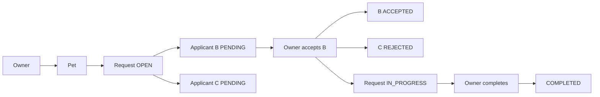
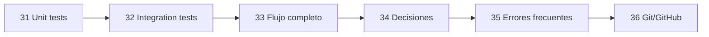

# Bloque 06 — Calidad y recorrido completo

Hasta aquí ya sabemos cómo está construida PetMatch.

Hemos estudiado:

```text
Spring Boot
→ configuración
→ Controller
→ Service
→ Repository
→ JPA/Hibernate
→ MVC/Thymeleaf
→ Security
→ REST/JSON
```

Este bloque responde dos preguntas finales sobre la implementación:

> **¿Cómo comprobamos que las piezas hacen lo esperado?**

> **¿Cómo se conectan todas esas piezas en un flujo real y qué errores debemos evitar?**

---

# Estado del bloque

**Bloque completo.**

Capítulos disponibles:

31. [Pruebas unitarias](31-pruebas-unitarias.md)
32. [Pruebas de integración](32-pruebas-de-integracion.md)
33. [Flujo completo PetMatch](33-flujo-completo-petmatch.md)
34. [Buenas prácticas y decisiones](34-buenas-practicas-y-decisiones.md)
35. [Errores frecuentes](35-errores-frecuentes.md)

Después continúa el [Bloque 07 — Referencia](../07-referencia/README.md).

---

# Objetivos del bloque

Al terminar deberías poder explicar:

- qué diferencia hay entre prueba unitaria e integración;
- qué parte de PetMatch se prueba con Mockito;
- qué significan `@Mock`, `@InjectMocks` y `MockitoExtension`;
- cómo se usan `when(...)`, `verify(...)` y `assertThrows(...)`;
- qué hace `@SpringBootTest`;
- qué aporta `MockMvc`;
- qué prueba `contextLoads()` y qué no;
- qué dependencia de DB tienen las pruebas de integración actuales;
- qué cubren realmente los tests actuales;
- cómo se recorre el flujo owner → Pet → request → applications → accept → complete;
- cómo se combinan Authentication, ownership, estado, transacciones y locking;
- cómo convergen MVC y REST sobre los mismos Services;
- qué decisiones de diseño están implementadas;
- qué trade-offs tienen esas decisiones;
- qué alternativas son futuras y no actuales;
- cómo diagnosticar errores frecuentes de capas, JPA, Security, REST, testing y configuración.

---

# Pruebas reales del repositorio

```text
src/test/java/com/petmatch/community/
├── PetMatchCommunityApplicationTests.java
├── service/
│   ├── SupportRequestServiceTests.java
│   └── SupportApplicationServiceTests.java
└── integration/
    ├── MvpFlowIntegrationTests.java
    └── RestApiIntegrationTests.java
```

Estas clases son la base de los capítulos 31 y 32.

---

# Dos niveles principales

## Unitarias

```text
SupportRequestServiceTests
SupportApplicationServiceTests
```

Modelo:

```text
Service real
+
Repository mock
+
otros colaboradores mock
```

No levantan el `ApplicationContext` de Spring.

---

## Integración

```text
PetMatchCommunityApplicationTests
MvpFlowIntegrationTests
RestApiIntegrationTests
```

Usan `@SpringBootTest`, pero integran fronteras diferentes:

```text
contextLoads
→ arranque del contexto

MvpFlowIntegrationTests
→ Services + Repositories + JPA + DB + reglas

RestApiIntegrationTests
→ HTTP + Security + MVC REST + Validation + Services + DB
```

---

# Herramientas utilizadas

En los tests del proyecto aparecen:

```text
JUnit 5
Mockito
Spring Boot Test
Spring Security Test
MockMvc
```

El proyecto no incorpora actualmente:

```text
Testcontainers
H2 de test
WireMock
Selenium
Playwright
Cypress
ArchUnit
JaCoCo configurado
```

Por tanto, esas herramientas no forman parte de la infraestructura de pruebas actual.

---

# El principio de testing del bloque

No preguntamos:

```text
¿cuántas anotaciones tiene el test?
```

Preguntamos:

```text
¿qué comportamiento quiero demostrar?
```

Ejemplo unitario:

```text
cancel OPEN
→ request CANCELLED
→ applications PENDING REJECTED
```

Ejemplo de integración HTTP:

```text
GET /api/v1/pets sin Basic
→ 401
```

Son preguntas distintas y requieren niveles distintos.

---

# Flujo completo del MVP

El capítulo 33 conecta todo alrededor de esta historia:



Ese recorrido permite ver juntas:

```text
Authentication
ownership
DTO
Service
Repository
transactions
dirty checking
locking
state machines
visibility
testing
```

---

# Caso unitario real

`SupportRequestServiceTests` comprueba:

```text
cancel request OPEN
↓
request → CANCELLED
applications PENDING → REJECTED
```

El objetivo es aislar la decisión del Service.

---

# Caso de integración real

`MvpFlowIntegrationTests` usa usuarios con roles funcionales distintos:

```text
owner
applicant B
applicant C
outsider
```

Y recorre:

```text
Pet
→ SupportRequest
→ applications
→ accept
→ IN_PROGRESS
→ visibility
→ complete
→ COMPLETED
```

Aquí participan Services y Repositories reales.

---

# Caso HTTP real

`RestApiIntegrationTests` verifica, entre otros:

```text
GET / → 200
GET /api/v1/pets sin Basic → 401
GET /api/v1/pets con Basic → 200
POST pet → 201 + Location + JSON
POST inválido → 400 + ProblemDetail
```

Esto integra Security y la frontera HTTP.

---

# Dependencia actual de base de datos

`application.yaml` usa:

```yaml
spring:
  datasource:
    url: ${DB_URL}
    username: ${DB_USERNAME}
    password: ${DB_PASSWORD}
```

El proyecto no configura una sustitución de test mediante H2 o Testcontainers.

Por tanto las pruebas `@SpringBootTest` actuales pueden necesitar variables de entorno válidas y una base compatible.

> [!IMPORTANT]
> Esto describe la implementación actual; no es una recomendación universal sobre cómo diseñar tests.

---

# Capítulo 33 — sistema completo

[Flujo completo PetMatch](33-flujo-completo-petmatch.md) explica cómo:

```text
Authentication
→ User
→ ownership
→ DTO
→ Service
→ Repository
→ Entity state
→ response
```

forma un solo caso de uso aunque esté distribuido entre clases.

---

# Capítulo 34 — decisiones y trade-offs

[Buenas prácticas y decisiones](34-buenas-practicas-y-decisiones.md) revisa decisiones reales como:

```text
constructor injection
arquitectura por capas
ownership backend
DTO separados
transactions
PESSIMISTIC_WRITE
open-in-view false
EntityGraph
dos SecurityFilterChain
ProblemDetail
unit + integration tests
```

Y las diferencia de alternativas no implementadas como:

```text
JWT/OAuth2
MapStruct
@Version
Flyway/Liquibase
Testcontainers
SPA frontend
```

---

# Capítulo 35 — errores frecuentes

[Errores frecuentes](35-errores-frecuentes.md) transforma el libro en una herramienta de diagnóstico.

Agrupa errores como:

```text
negocio en Controller
Entity usada como DTO
ownership solo en UI
@Valid usado como sustituto de Service
CSRF desactivado globalmente
confundir Basic con HTTPS
confundir STATELESS con ausencia de datos
cargar todo EAGER
ignorar dirty checking
creer que ddl-auto es migration tool
asumir H2/Testcontainers
confundir Mockito y MockMvc
asumir cobertura no demostrada
atribuir features no implementadas
```

También conecta desarrollo y control de versiones:

```text
cambio pequeño
→ prueba
→ commit coherente
```

---

# Qué puede concluirse de la suite

La existencia de tests no implica:

```text
100 % de cobertura
```

No hay tests dedicados para cada Controller MVC, cada Repository, cada endpoint REST ni una carrera real con dos transacciones concurrentes.

El libro distingue entre:

```text
regla implementada
```

y:

```text
regla con test específico
```

---

# Cómo leer una decisión técnica

Usa esta secuencia:

```text
problema
→ decisión actual
→ beneficio
→ trade-off
→ alternativa posible
→ ¿implementada o futura?
```

---

# Recorrido del bloque



---

# Comienza aquí

**[Capítulo 31 — Pruebas unitarias →](31-pruebas-unitarias.md)**

Cuando termines:

**[Capítulo 35 — Errores frecuentes →](35-errores-frecuentes.md)**

Después continúa con:

**[Bloque 07 — Referencia →](../07-referencia/README.md)**

---

[← Bloque 05 — REST](../05-rest/README.md) · [Índice general](../README.md) · [Siguiente bloque → Referencia](../07-referencia/README.md)
