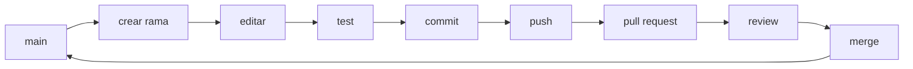

# 36 — Git, GitHub y versionado en PetMatch

Hasta este punto hemos estudiado cómo funciona la aplicación.

Ahora aparece una pregunta diferente:

> **¿Cómo conservamos, compartimos y revisamos los cambios del proyecto sin perder el historial?**

La respuesta en PetMatch es:

```text
Git
+
GitHub
```

Este capítulo no intenta enseñar todos los comandos existentes. Se concentra en los conceptos y operaciones que un aprendiz necesita para trabajar de forma segura sobre este repositorio.

---

# 1. Git y GitHub no son lo mismo

## Git

Es el sistema de control de versiones distribuido que registra cambios en archivos y crea historial.

## GitHub

Es una plataforma que aloja repositorios Git y añade colaboración, revisión, permisos, issues, pull requests y otras herramientas.

Modelo mental:

```text
Git
→ historial/versionado

GitHub
→ alojamiento y colaboración sobre repositorios Git
```

---

# 2. El repositorio de PetMatch

El proyecto se encuentra en un repositorio GitHub llamado:

```text
ethan-fullstack/petmatch-community
```

La rama por defecto actual es:

```text
main
```

En este libro, `main` representa el estado implementado que se describe.

---

# 3. ¿Qué es un repositorio?

Un repositorio Git contiene:

```text
archivos del proyecto
+
historial de commits
+
ramas
+
referencias
```

No es simplemente una carpeta comprimida.

La historia de cambios forma parte del valor del repositorio.

---

# 4. Working tree

Es el conjunto de archivos que tienes actualmente en tu carpeta local.

Puedes modificar:

```text
.java
.md
.yaml
.html
```

sin que Git considere esos cambios un commit todavía.

Modelo:

```text
archivo editado
≠
commit creado
```

---

# 5. Tres estados mentales básicos

Para empezar conviene distinguir:

```text
working tree
→ cambios locales

staging area
→ cambios seleccionados para próximo commit

repository history
→ commits ya registrados
```

Un flujo típico:

```text
editar
→ git add
→ git commit
```

---

# 6. `git status`

Es uno de los comandos más importantes para un aprendiz.

```bash
git status
```

Permite ver, entre otras cosas:

```text
rama actual
archivos modificados
archivos staged
archivos untracked
```

Antes de hacer un commit, acostúmbrate a ejecutarlo.

---

# 7. Tracked, untracked e ignored

## Tracked

Archivo que Git ya conoce y versiona.

## Untracked

Archivo presente localmente pero todavía no agregado a Git.

## Ignored

Archivo que coincide con reglas de `.gitignore` y normalmente no se propone para tracking.

Estas categorías no son equivalentes.

---

# 8. `.gitignore` real de PetMatch

El repositorio contiene:

```text
.gitignore
```

Entre otras cosas excluye:

```text
target/
.idea/
.vscode/
.env
mise.local.toml
mise.*.local.toml
/petmatch-community.zip
```

También incluye reglas para archivos generados por IDEs como STS, NetBeans e IntelliJ.

---

# 9. ¿Por qué ignorar `target/`?

Maven genera:

```text
target/
```

con clases compiladas y otros artefactos.

Esos archivos pueden reconstruirse mediante Maven.

Guardar artefactos compilados en Git normalmente produce:

```text
ruido
repositorio más pesado
conflictos innecesarios
```

El código fuente y configuración son la fuente reproducible.

---

# 10. ¿Por qué ignorar `.env`?

El proyecto usa variables:

```text
DB_URL
DB_USERNAME
DB_PASSWORD
```

Un archivo local `.env` podría contener información sensible o específica del equipo.

El `.gitignore` actual contiene:

```text
.env
```

Eso reduce el riesgo de agregarlo accidentalmente.

> [!WARNING]
> `.gitignore` no es un gestor de secretos. Si un secreto ya fue committeado, ignorar el archivo después no elimina el secreto del historial.

---

# 11. `.gitignore` no afecta mágicamente archivos ya tracked

Imagina:

```text
.env ya fue agregado y committeado
```

Después añades:

```text
.env
```

a `.gitignore`.

Git puede seguir considerando ese archivo tracked.

La regla de ignore se aplica principalmente al descubrimiento de archivos no trackeados.

---

# 12. No subir configuración personal del IDE

El `.gitignore` excluye configuraciones como:

```text
.idea/
.vscode/
.settings/
.project
.classpath
```

La idea es evitar que preferencias locales innecesarias contaminen el historial compartido.

No significa que toda configuración de herramientas deba ignorarse siempre; depende de si es una configuración compartible y necesaria para el proyecto.

---

# 13. `.gitattributes`

PetMatch también contiene:

```text
.gitattributes
```

con reglas actuales:

```text
/mvnw text eol=lf
*.cmd text eol=crlf
```

Esto controla finales de línea para archivos que deben comportarse correctamente en plataformas diferentes.

---

# 14. LF y CRLF

Sistemas operativos pueden usar convenciones distintas de fin de línea.

Simplificando:

```text
Linux/macOS
→ LF

Windows
→ frecuentemente CRLF
```

El Maven Wrapper incluye scripts distintos:

```text
mvnw
mvnw.cmd
```

La configuración de `.gitattributes` ayuda a preservar el formato esperado.

---

# 15. Maven Wrapper sí debe versionarse

El proyecto contiene:

```text
mvnw
mvnw.cmd
.mvn/
```

Eso permite ejecutar Maven mediante:

```bash
./mvnw
```

Linux/macOS/WSL, o:

```powershell
.\mvnw.cmd
```

Windows.

El Wrapper forma parte de la infraestructura reproducible del repositorio.

---

# 16. `git diff`

Antes de agregar cambios:

```bash
git diff
```

permite revisar diferencias del working tree respecto al estado indexado/registrado correspondiente.

Pregunta:

> ¿estoy a punto de versionar exactamente lo que quería cambiar?

---

# 17. `git add`

Selecciona cambios para el próximo commit.

Ejemplo:

```bash
git add src/main/java/com/petmatch/community/service/PetService.java
```

No es obligatorio agregar toda la carpeta con:

```bash
git add .
```

Para aprender buenas prácticas conviene seleccionar conscientemente los archivos relacionados.

---

# 18. Staging area

La staging area permite preparar un commit antes de crearlo.

Puedes tener simultáneamente:

```text
archivo A modificado + staged
archivo B modificado + no staged
```

Así el commit puede contener solo A.

---

# 19. Revisar lo staged

Una práctica útil:

```bash
git diff --staged
```

Antes del commit confirma:

```text
qué cambios exactos entrarán
```

Esto evita commits accidentales de archivos no relacionados.

---

# 20. Commit

Un commit es un punto del historial con:

```text
snapshot lógico de cambios
metadata
autor
fecha
mensaje
identificador SHA
```

No es simplemente “guardar”.

Es una unidad de historia técnica.

---

# 21. Un buen commit cuenta una historia

Mal ejemplo:

```text
cambios
```

Mejor:

```text
fix ownership check when updating pets
```

O:

```text
docs: explain pessimistic locking in accept flow
```

El mensaje debe ayudar a responder:

> ¿qué intención tiene este cambio?

---

# 22. Commit pequeño no significa commit microscópico

No buscamos:

```text
un commit por cada línea
```

Buscamos coherencia.

Ejemplo razonable:

```text
agregar DTO
+ Controller usa DTO
+ test del mismo caso
```

puede formar una sola historia si todo pertenece a la misma modificación funcional.

---

# 23. Evitar commits gigantes

Un commit que mezcla:

```text
seguridad
nuevo endpoint
reformateo total
CSS
renombrados
configuración DB
```

es difícil de:

```text
revisar
entender
revertir
comparar
```

Divide cambios por propósito.

---

# 24. Probar antes de commit

Para PetMatch una verificación frecuente es:

```bash
./mvnw test
```

En Windows:

```powershell
.\mvnw.cmd test
```

El README principal también documenta:

```text
clean test
```

Recuerda que las pruebas de integración actuales pueden requerir variables DB y una base compatible.

---

# 25. Flujo recomendado para una tarea pequeña

```text
1. actualizar main local
2. crear/cambiar rama si el flujo del equipo lo requiere
3. implementar cambio pequeño
4. git status
5. ejecutar tests relevantes
6. git diff
7. git add archivos relacionados
8. git diff --staged
9. git commit
10. push
11. revisar en GitHub
```

---

# 26. Rama

Una rama es una referencia móvil a una línea de commits.

La rama por defecto de este repositorio es:

```text
main
```

Un equipo puede crear ramas para trabajar sin modificar inmediatamente `main`.

---

# 27. `main`

En este libro tratamos `main` como:

```text
estado integrado de referencia
```

Por eso antes de afirmar que una feature existe se revisa el código de esa rama.

No basta con que algo exista:

```text
en una rama local
en una conversación
en un informe
en una captura
```

si no forma parte del estado de referencia solicitado.

---

# 28. Crear una rama

Ejemplo:

```bash
git switch -c docs/security-notes
```

Esto crea y cambia a una nueva rama desde el punto actual.

Nombres útiles expresan intención:

```text
feature/...
fix/...
docs/...
test/...
```

No son una obligación técnica de Git; son convenciones de equipo.

---

# 29. Cambiar de rama

```bash
git switch main
```

Antes de cambiar, revisa:

```bash
git status
```

Cambios locales sin commit pueden interferir con el cambio de rama.

---

# 30. Actualizar referencias remotas

```bash
git fetch
```

trae información nueva del remoto sin integrar automáticamente esos commits en tu rama de trabajo.

Esto permite conocer cambios remotos antes de decidir cómo integrarlos.

---

# 31. `origin`

Al clonar normalmente Git configura un remote llamado:

```text
origin
```

que apunta al repositorio remoto del que clonaste.

Puedes comprobarlo con:

```bash
git remote -v
```

El nombre `origin` es una convención, no una palabra mágica obligatoria.

---

# 32. Push

```bash
git push
```

envía commits locales hacia un remote, si tienes permisos y la operación es válida.

Un archivo guardado localmente no aparece en GitHub hasta que:

```text
forma parte de un commit
+
el commit se envía al remoto
```

---

# 33. Pull

`git pull` combina operaciones de obtención e integración según configuración.

Para principiantes es útil comprender primero las dos preguntas separadas:

```text
¿qué cambió en remoto?
→ fetch

¿cómo voy a integrar esos commits?
→ merge/rebase según flujo
```

Así `pull` deja de parecer una operación misteriosa.

---

# 34. GitHub no “sincroniza una carpeta” automáticamente

Si modificas:

```text
PetService.java
```

localmente, GitHub no lo sabe en tiempo real.

El camino es:

```text
working tree
→ commit local
→ push
→ repositorio remoto
```

---

# 35. Merge

Combina historias de ramas.

Conceptualmente:

```text
main
   \
    feature commits
```

se integran para formar una historia que contiene ambos trabajos.

Git puede resolver automáticamente muchos casos, pero no todos.

---

# 36. Conflicto de merge

Ocurre cuando Git no puede decidir automáticamente cómo combinar cambios.

Ejemplo:

```text
rama A cambia una línea
rama B cambia la misma zona incompatible
```

Git marca el conflicto y una persona debe decidir el resultado correcto.

---

# 37. Un conflicto no es un error de Git

Significa:

> necesito una decisión humana sobre estas dos versiones.

Resolverlo requiere comprender el código y el propósito de cada cambio.

No borres marcadores al azar solo para que Git deje de mostrar conflicto.

---

# 38. Pull request

Un Pull Request en GitHub propone integrar cambios de una rama hacia otra.

Permite discutir:

```text
qué cambió
por qué cambió
qué tests se ejecutaron
qué riesgos existen
```

El PR es una herramienta de colaboración; Git por sí solo no define Pull Requests.

---

# 39. Review

Una revisión debería evaluar más que sintaxis.

En PetMatch, preguntas útiles serían:

```text
¿se conserva ownership?
¿la regla está en Service?
¿se expone Entity por REST?
¿la transición de estado es válida?
¿requiere transacción?
¿hay riesgo concurrente?
¿el DTO permite campos sensibles?
¿hay test apropiado?
```

---

# 40. Revisión de documentación

Para `docs/` también se revisa:

```text
¿el enlace existe?
¿la clase mencionada existe?
¿la ruta es exacta?
¿la feature está implementada?
¿se mezcló futuro con presente?
```

Git/GitHub permiten revisar documentación igual que código.

---

# 41. SHA

Cada commit tiene un identificador criptográfico, normalmente mostrado abreviado.

Ejemplo conceptual:

```text
abc1234
```

Permite referirse a una versión concreta del historial.

---

# 42. `git log`

Permite inspeccionar historial:

```bash
git log --oneline
```

Podemos preguntar:

```text
¿qué commits recientes existen?
¿qué mensaje tenía el cambio?
¿qué commit introdujo algo?
```

---

# 43. `git show`

Para inspeccionar un commit:

```bash
git show <sha>
```

Ayuda a entender:

```text
metadata
mensaje
cambios introducidos
```

---

# 44. Historial como documentación técnica

Un historial limpio puede responder:

```text
¿cuándo se añadió REST?
¿cuándo cambió Security?
¿qué commit introdujo este test?
```

Pero el historial no reemplaza documentación conceptual; se complementan.

---

# 45. Revertir no es lo mismo que borrar historia

En equipos, una forma segura de deshacer un commit ya compartido puede ser crear otro commit inverso:

```bash
git revert <sha>
```

Así el historial muestra:

```text
cambio
→ reversión
```

en vez de fingir que nunca ocurrió.

---

# 46. `reset` requiere cuidado

`git reset` puede mover referencias y afectar staging/working tree según opciones.

No debe enseñarse como:

```text
“botón genérico para deshacer todo”
```

Antes de usarlo pregunta:

```text
¿el commit ya fue compartido?
¿quiero preservar historia?
¿quiero sacar cambios del staging?
¿quiero descartar archivos locales?
```

---

# 47. No usar comandos destructivos sin comprender el estado

Especialmente:

```text
reset --hard
clean -fd
force push
```

pueden destruir trabajo local o alterar historia remota.

Para aprendices, primero:

```bash
git status
git diff
git log --oneline
```

Luego decide.

---

# 48. Force push

Un push forzado puede reescribir la historia visible de una rama remota.

En una rama compartida puede eliminar commits de otros colaboradores.

No debe ser una solución automática cuando `git push` es rechazado.

---

# 49. Antes de resolver un push rechazado

Pregunta:

```text
¿el remoto tiene commits que yo no tengo?
```

Ejecuta:

```bash
git fetch
```

revisa la historia y decide cómo integrar.

No fuerces sin comprender la divergencia.

---

# 50. Secretos y Git

Nunca deberías versionar deliberadamente:

```text
password DB real
tokens
claves privadas
API keys
```

En PetMatch las credenciales DB se configuran por variables de entorno.

El hecho de que el repositorio sea privado no convierte en buena práctica guardar secretos allí.

---

# 51. Si un secreto se commiteó

No basta con:

```text
borrar el archivo
```

ni con añadirlo a `.gitignore`.

Debes considerar:

```text
rotar/revocar el secreto
eliminar exposición de versiones activas
revisar historial según política del proyecto
```

Un secreto filtrado debe tratarse como potencialmente comprometido.

---

# 52. README y docs sí se versionan

El repositorio contiene:

```text
README.md
docs/
```

La documentación es parte del producto educativo.

Cambiar comportamiento sin actualizar documentación relevante puede dejar el repositorio inconsistente.

---

# 53. Código y documentación deben avanzar juntos

Ejemplo:

```text
se cambia SupportRequestStatus
```

Entonces probablemente se deben revisar:

```text
Service
tests
REST contract
templates
docs de state machine
glosario
flujo completo
```

Git ayuda a agrupar estos cambios cuando pertenecen a la misma evolución.

---

# 54. No versionar una feature imaginaria

Una documentación puede afirmar:

```text
“la aplicación permite subir imágenes”
```

pero si `main` no contiene ese comportamiento, la documentación queda falsa.

Por eso este libro separa:

```text
implementado
```

de:

```text
posible evolución no implementada
```

Relacionado: [39 — Posibles evoluciones no implementadas](39-posibles-evoluciones-no-implementadas.md).

---

# 55. Git no reemplaza backups externos por sí solo

Git distribuye historial entre clones y remotos, pero no debe interpretarse como una estrategia completa de backup para:

```text
base de datos productiva
uploads
secretos
infraestructura externa
```

PetMatch no implementa una estrategia completa de backups como parte del MVP.

---

# 56. Git tampoco versiona la base MySQL

Los commits contienen archivos del repositorio.

Los registros reales de MySQL no se guardan automáticamente en Git.

Esto es diferente de versionar:

```text
scripts SQL
migrations
configuración
```

El proyecto actual usa `ddl-auto: update`, no migrations versionadas.

---

# 57. Diferencia entre código y datos

```text
Git
→ código/config/documentación versionable

MySQL
→ datos de ejecución
```

No confundas control de versiones del software con persistencia del dominio.

---

# 58. Tags

Git permite crear referencias nombradas sobre puntos del historial, útiles para marcar versiones.

Ejemplo conceptual:

```text
v1.0.0
```

No necesitamos afirmar que PetMatch tenga una política formal de releases/tags si no la estamos observando como parte del flujo actual.

Este es un concepto de Git, no una característica obligatoria del repositorio.

---

# 59. Versionado semántico

Una convención común es:

```text
MAJOR.MINOR.PATCH
```

pero este libro no debe atribuir a PetMatch una política SemVer formal no establecida.

Conocer SemVer es útil; decir que el proyecto ya lo usa requeriría evidencia específica.

---

# 60. `.gitignore` actual como mapa de decisiones

Podemos clasificar sus reglas:

| Categoría | Ejemplos |
|---|---|
| build | `target/`, `build/`, `dist/` |
| IDE | `.idea`, `.vscode/`, `.settings` |
| entorno local | `.env`, `mise.local.toml` |
| archivo generado | `/petmatch-community.zip` |

Cada grupo responde:

> ¿este archivo debe formar parte del estado compartido del proyecto?

---

# 61. Un `.gitignore` demasiado amplio también puede ser malo

Ejemplo hipotético:

```text
*.yaml
```

podría ocultar accidentalmente:

```text
application.yaml
```

que sí forma parte de la configuración compartida.

Las reglas deben ser específicas y comprensibles.

---

# 62. `application.yaml` sí está versionado

Contiene estructura/configuración como:

```text
${DB_URL}
${DB_USERNAME}
${DB_PASSWORD}
```

Es decir:

```text
se versiona la referencia a variables
```

pero no:

```text
el password local real
```

Esa separación es una buena idea para enseñar configuración externa.

---

# 63. `.env` ignorado no significa `.env` cargado

Dos ideas distintas:

```text
Git ignore
→ Git no propone el archivo normalmente
```

```text
Spring configuration
→ cómo llegan variables al proceso
```

PetMatch no debe documentarse como si `.gitignore` hiciera que Spring Boot cargara `.env`.

---

# 64. Flujo de colaboración con ramas



Ese flujo es conceptual. Un equipo puede definir reglas distintas, pero ayuda a comprender el ciclo completo.

---

# 65. Flujo directo usado con cuidado

En un proyecto personal o educativo también puede existir trabajo directo sobre `main`.

Eso reduce pasos, pero elimina parte de la revisión previa por rama/PR.

No existe una única estrategia válida para todos los equipos.

Lo importante es que el flujo sea consciente y consistente.

---

# 66. Qué revisar antes de `git add .`

Pregunta:

```text
¿hay .env?
¿hay target/?
¿hay archivos del IDE?
¿hay logs?
¿hay ZIPs?
¿hay cambios no relacionados?
```

Aunque `.gitignore` ayuda, `git status` sigue siendo obligatorio como hábito.

---

# 67. Qué revisar antes de commit

Checklist:

- `git status` limpio respecto a intención;
- cambios revisados con `git diff`;
- staging revisado;
- tests relevantes ejecutados;
- sin secretos;
- sin artefactos generados;
- documentación actualizada si cambió contrato;
- mensaje claro;
- un solo propósito técnico principal.

---

# 68. Qué revisar después de push

En GitHub:

```text
¿aparece el commit esperado?
¿los archivos correctos cambiaron?
¿la rama correcta recibió el cambio?
¿se coló algún secreto/artefacto?
```

No asumas que un comando exitoso significa que revisaste correctamente el resultado.

---

# 69. Commits de documentación

Ejemplos claros:

```text
docs: explain REST security

docs: add Spring glossary

docs: fix broken chapter navigation
```

Esto permite distinguir cambios que no modifican comportamiento ejecutable.

---

# 70. Commits de tests

Ejemplo:

```text
test: cover expired support request application
```

La convención exacta puede variar; lo importante es que el mensaje describa intención.

---

# 71. Commits de corrección

Ejemplo:

```text
fix: enforce ownership when updating pets
```

Un mensaje útil puede ayudar a detectar qué regla de negocio estaba en riesgo.

---

# 72. Conventional Commits

Prefijos como:

```text
feat:
fix:
docs:
test:
refactor:
```

son una convención popular.

El hecho de usarlos en ejemplos no significa que PetMatch tenga una política formal obligatoria de Conventional Commits.

---

# 73. Refactor vs feature

## Feature

Cambia capacidad observable.

## Refactor

Cambia estructura interna intentando conservar comportamiento.

Ejemplo:

```text
mover mapping repetido a ApiDtoMapper
```

podría ser refactor si el contrato sigue igual.

La diferencia importa para review y testing.

---

# 74. Git ayuda a aprender arquitectura

Un diff pequeño permite ver:

```text
qué capa cambió
qué tests acompañaron el cambio
qué documentación quedó afectada
```

Por eso un buen historial también enseña cómo evoluciona una aplicación Spring Boot.

---

# 75. Caso práctico — nueva regla de Service

Imagina que modificas una regla existente.

Flujo:

```text
editar Service
→ actualizar/agregar test
→ ejecutar test
→ revisar diff
→ stage solo esos archivos
→ commit coherente
```

No mezcles ese cambio con:

```text
20 archivos reformateados sin relación
```

---

# 76. Caso práctico — documentación

Si detectas que un capítulo dice:

```text
“archivo se creará después”
```

pero el archivo ya existe:

```text
editar navegación
→ revisar enlaces
→ commit docs
```

Eso es mantenimiento real de documentación versionada.

---

# 77. Caso práctico — `.env` aparece en `git status`

Si `.gitignore` contiene `.env`, normalmente no debería aparecer como untracked.

Si aparece como tracked, investiga si ya fue agregado anteriormente.

No hagas simplemente:

```text
git add .
```

sin revisar.

---

# 78. Caso práctico — `target/` aparece en commit

Pregunta:

```text
¿ya estaba tracked?
¿se alteró .gitignore?
```

No necesitamos subir clases compiladas para que otra persona compile el proyecto, porque existe Maven/pom/Wrapper.

---

# 79. Caso práctico — conflicto en `SupportRequestService`

Dos ramas cambiaron `accept`/reglas cercanas.

Resolver no consiste en elegir automáticamente:

```text
ours
```

o:

```text
theirs
```

Debes preservar las reglas válidas:

```text
ownership
lock
estado OPEN
application PENDING
solo una ACCEPTED
reject others
```

Después ejecuta tests.

---

# 80. Caso práctico — documentación y código difieren

Código:

```text
HTTP Basic
```

Documento antiguo:

```text
JWT
```

La corrección es documentar el estado real de `main`, no modificar código solo para que coincida con un texto histórico.

Si JWT se quiere en el futuro, pertenece a una evolución planificada.

---

# 81. GitHub como fuente navegable

GitHub permite explorar:

```text
árbol de archivos
historial
commits
diffs
branches
```

Esto resulta especialmente útil para este libro porque puedes alternar:

```text
capítulo
→ ruta de clase
→ código
→ historial
```

---

# 82. No copiar código de una rama cualquiera sin verificar contexto

Una rama puede contener trabajo experimental.

Para explicar la aplicación actual, comprueba la referencia solicitada.

En este libro:

```text
main
```

es la referencia principal.

---

# 83. Git como red de seguridad, no como excusa

Tener historial no significa que debamos hacer cambios irresponsables pensando:

```text
“después lo deshago”
```

La mejor práctica sigue siendo:

```text
comprender
→ cambiar pequeño
→ probar
→ revisar
→ commit
```

---

# 84. 🛠 Práctica guiada

Sin modificar código productivo, crea localmente un archivo de notas temporal y observa:

```bash
git status
```

Después:

1. identifica si está untracked;
2. agrega solo ese archivo;
3. revisa `git diff --staged`;
4. retíralo del staging si no quieres committearlo;
5. elimina el archivo temporal.

El objetivo es comprender estados de Git, no crear un commit innecesario.

---

# 85. 🧪 Comprueba que entendiste

1. ¿Git y GitHub son lo mismo?
2. ¿qué es working tree?
3. ¿qué es staging area?
4. ¿qué hace `git status`?
5. ¿qué diferencia hay entre tracked y untracked?
6. ¿qué significa ignored?
7. ¿por qué `target/` está ignorado?
8. ¿por qué `.env` está ignorado?
9. ¿`.gitignore` elimina secretos del historial?
10. ¿qué función tiene `.gitattributes`?
11. ¿qué rama es la referencia principal del libro?
12. ¿qué es un commit?
13. ¿por qué conviene un commit coherente?
14. ¿qué hace `git diff --staged`?
15. ¿qué hace `push`?
16. ¿qué hace `fetch` en términos generales?
17. ¿qué es un merge conflict?
18. ¿qué es un Pull Request?
19. ¿por qué un force push requiere cuidado?
20. ¿Git versiona automáticamente la base MySQL?
21. ¿`.env` ignorado implica que Spring lo carga?
22. ¿los Maven Wrapper scripts deben estar versionados aquí?

### Respuestas esperadas

1. No; Git versiona, GitHub aloja/colabora.
2. Los archivos locales actuales del repositorio.
3. Zona donde seleccionamos cambios para el próximo commit.
4. Muestra estado de rama y archivos.
5. Tracked ya pertenece al control de versiones; untracked todavía no.
6. Coincide con reglas de ignore y normalmente no se propone para tracking.
7. Porque es un artefacto generado por build.
8. Porque puede contener configuración local/sensible.
9. No.
10. Define atributos como tratamiento de texto/finales de línea.
11. `main`.
12. Una unidad registrada del historial con cambios y metadata.
13. Para facilitar revisión, comprensión y reversión.
14. Muestra diferencias preparadas para commit.
15. Envía commits al remote correspondiente.
16. Actualiza referencias/datos del remoto sin integrar automáticamente todo en la rama actual.
17. Situación donde Git necesita decisión humana para combinar cambios incompatibles.
18. Propuesta/revisión de integración alojada en GitHub.
19. Porque puede reescribir historia remota.
20. No.
21. No.
22. Sí; forman parte de la infraestructura reproducible del proyecto.

---

# 86. ✅ Qué debes recordar

```text
Git
→ registra historia

GitHub
→ aloja y facilita colaboración

working tree
→ estoy editando

staging
→ seleccioné próximo commit

commit
→ registré una historia coherente

push
→ envié commits al remoto
```

Y para PetMatch:

```text
main
→ referencia principal del libro

.gitignore
→ evita ruido/local/secrets por flujo normal

.gitattributes
→ normaliza atributos de archivos

Maven Wrapper
→ se versiona

target/
→ se regenera, no se versiona

.env
→ local/ignorado, no se asume cargado por Spring
```

La disciplina recomendada es:

```text
cambio pequeño
→ prueba
→ revisar diff
→ commit coherente
→ push/review
```

---

# 🔗 Continúa con

Ya sabemos cómo se conserva la evolución del proyecto. Ahora podemos usar el bloque final como referencia rápida de conceptos.

Continúa con:

**[Capítulo 37 — Glosario →](37-glosario.md)**

---

[← Capítulo 35 — Errores frecuentes](../06-calidad-y-recorrido/35-errores-frecuentes.md) · [Índice del bloque](README.md) · [Índice general](../README.md) · [Siguiente → Capítulo 37](37-glosario.md)
