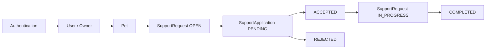

# 37 — Glosario de Spring Boot y PetMatch

Este capítulo funciona como **diccionario de consulta rápida** del libro.

No está pensado para memorizar definiciones aisladas. Cada término intenta responder tres preguntas:

```text
¿qué significa?
¿para qué sirve?
¿dónde lo vi en PetMatch?
```

> [!TIP]
> Cuando encuentres una palabra desconocida en otro capítulo, vuelve aquí, lee la definición y después regresa al código real.

---

# A

## `@Autowired`

Anotación que solicita a Spring resolver e inyectar una dependencia. En PetMatch aparece principalmente en **pruebas de integración**, por ejemplo para obtener `MockMvc`, Services y Repositories desde el `ApplicationContext`.

En el código productivo del proyecto se prefiere **inyección por constructor**, por lo que los Services y Controllers no necesitan marcar sus atributos con `@Autowired`.

Relacionado: [08 — Inyección de dependencias](../01-fundamentos/08-inyeccion-de-dependencias.md), [32 — Pruebas de integración](../06-calidad-y-recorrido/32-pruebas-de-integracion.md).

## API

Interfaz que permite que otro cliente use funcionalidades de una aplicación mediante un contrato. PetMatch expone una API HTTP/JSON bajo rutas `/api/v1/...`.

Relacionado: [27 — REST API](../05-rest/27-rest-api.md).

## API DTO

Objeto que define el contrato de entrada o salida de la API REST. PetMatch separa, por ejemplo:

```text
PetApiRequest
PetApiResponse
```

Los API DTO no son Entities JPA.

Relacionado: [28 — DTO REST, JSON y mapping](../05-rest/28-dto-rest-json-y-mapping.md).

## `ApiDtoMapper`

Clase utility real de PetMatch que transforma estructuras REST hacia los Form DTO usados por los Services y Entities hacia response DTO.

Ejemplo conceptual:

```text
PetApiRequest
→ PetForm
→ PetService
```

Relacionado: [28 — DTO REST, JSON y mapping](../05-rest/28-dto-rest-json-y-mapping.md).

## ApplicationContext

Contenedor principal de Spring que conoce y administra Beans y sus dependencias. Cuando una prueba usa `@SpringBootTest`, Spring Boot construye un `ApplicationContext` para la aplicación.

Relacionado: [03 — Spring y Spring Boot](../01-fundamentos/03-spring-y-spring-boot.md), [32 — Pruebas de integración](../06-calidad-y-recorrido/32-pruebas-de-integracion.md).

## Authentication

Objeto de Spring Security que representa la identidad autenticada disponible durante una request o un caso de uso.

En PetMatch:

```text
Authentication.getName()
→ email
→ UserService
→ User
```

Relacionado: [22 — Autenticación](../04-seguridad/22-autenticacion.md), [25 — Autorización y ownership](../04-seguridad/25-autorizacion-y-ownership.md).

## Autenticación

Proceso de responder:

> ¿quién eres?

En la web PetMatch utiliza form login y sesión. En `/api/**` utiliza HTTP Basic con política `STATELESS`.

Relacionado: [22 — Autenticación](../04-seguridad/22-autenticacion.md), [29 — Seguridad REST](../05-rest/29-seguridad-rest.md).

## Autorización

Proceso de responder:

> ¿qué puede hacer esta identidad?

Estar autenticado no significa poder modificar cualquier `Pet` o `SupportRequest`. PetMatch combina reglas generales de Spring Security con ownership dentro de Services/Repositories.

Relacionado: [25 — Autorización y ownership](../04-seguridad/25-autorizacion-y-ownership.md).

---

# B

## Bean

Objeto administrado por el contenedor de Spring. Controllers, Services, configuración y otros componentes pueden convertirse en Beans mediante anotaciones o métodos `@Bean`.

Ejemplos PetMatch:

```text
PetService
SupportRequestService
SecurityFilterChain
PasswordEncoder
```

Relacionado: [03 — Spring y Spring Boot](../01-fundamentos/03-spring-y-spring-boot.md), [08 — Inyección de dependencias](../01-fundamentos/08-inyeccion-de-dependencias.md).

## Bean Validation

Estándar usado mediante anotaciones como:

```text
@NotBlank
@NotNull
@Size
@Min
@Email
@Future
```

Sirve para validar estructura y restricciones de datos de entrada antes de ejecutar reglas de negocio más complejas.

Relacionado: [21 — Validación](../03-web-mvc/21-validacion.md).

## Binding

Proceso mediante el cual Spring asigna datos de una request a un objeto Java. En MVC puede poblar un Form DTO; en REST, la infraestructura convierte JSON a un API Request DTO.

Relacionado: [20 — Formularios y Form DTO](../03-web-mvc/20-formularios-y-form-dto.md), [28 — DTO REST](../05-rest/28-dto-rest-json-y-mapping.md).

## `BindingResult`

Objeto usado en MVC para consultar errores de binding/validación después de `@Valid`. `AuthController` lo usa durante registro.

Relacionado: [21 — Validación](../03-web-mvc/21-validacion.md).

---

# C

## Cascade

Configuración JPA que puede propagar ciertas operaciones entre Entities relacionadas. Las relaciones centrales de PetMatch no deben suponerse con cascades que no estén declarados en el código.

Relacionado: [11 — Relaciones JPA](../02-dominio-y-persistencia/11-relaciones-jpa.md).

## Controller

Capa que recibe una request, interpreta datos de entrada, delega en Services y decide la respuesta de la interfaz.

En PetMatch existen Controllers MVC como:

```text
PetController
SupportRequestController
```

y REST Controllers como:

```text
PetRestController
SupportRequestRestController
```

Relacionado: [07 — Arquitectura por capas](../01-fundamentos/07-arquitectura-por-capas.md), [18 — Spring MVC](../03-web-mvc/18-spring-mvc.md).

## CORS

Mecanismo del navegador relacionado con solicitudes entre orígenes. No se observó una configuración CORS personalizada en el `SecurityConfig` actual de PetMatch.

No confundir con CSRF.

Relacionado: [29 — Seguridad REST](../05-rest/29-seguridad-rest.md).

## CSRF

Ataque en el que un navegador autenticado puede ser inducido a enviar una operación no deseada aprovechando credenciales que se adjuntan automáticamente.

PetMatch mantiene protección CSRF en la web y la desactiva específicamente en la chain `/api/**`, que utiliza HTTP Basic + `STATELESS`.

Relacionado: [26 — CSRF, sesión y seguridad web](../04-seguridad/26-csrf-sesion-y-seguridad-web.md), [29 — Seguridad REST](../05-rest/29-seguridad-rest.md).

## Constraint

Restricción sobre datos. Puede existir en validación Java o en base de datos.

Ejemplos:

```text
@NotBlank
unique email
unique applicant + support request
```

Relacionado: [21 — Validación](../03-web-mvc/21-validacion.md), [10 — JPA y Hibernate](../02-dominio-y-persistencia/10-jpa-y-hibernate.md).

## Constructor injection

Forma de inyección de dependencias donde una clase declara sus colaboradores en el constructor.

Ejemplo conceptual:

```java
public PetService(
    PetRepository petRepository,
    SupportRequestRepository supportRequestRepository,
    UserService userService
) { ... }
```

Es el patrón predominante del código productivo de PetMatch.

Relacionado: [08 — Inyección de dependencias](../01-fundamentos/08-inyeccion-de-dependencias.md).

---

# D

## DataSource

Abstracción que representa la conexión/configuración de acceso a la base de datos. PetMatch obtiene actualmente URL, usuario y password mediante variables de entorno:

```text
DB_URL
DB_USERNAME
DB_PASSWORD
```

Relacionado: [06 — Configuración y application.yaml](../01-fundamentos/06-configuracion-y-application-yaml.md).

## Dependency Injection — DI

Técnica mediante la cual una clase recibe sus dependencias desde fuera en vez de construirlas directamente.

```text
PetService
no crea PetRepository con new
```

Spring resuelve esa colaboración.

Relacionado: [08 — Inyección de dependencias](../01-fundamentos/08-inyeccion-de-dependencias.md).

## Derived query

Consulta que Spring Data JPA deriva del nombre de un método de Repository.

Ejemplo real:

```text
findByIdAndOwnerId
```

Su nombre expresa condiciones que Spring Data interpreta.

Relacionado: [12 — Spring Data JPA](../02-dominio-y-persistencia/12-spring-data-jpa.md).

## Dirty checking

Capacidad de Hibernate de detectar cambios en una Entity administrada dentro de una transacción y sincronizarlos con la base sin exigir un `save(...)` después de cada setter.

En PetMatch se usa al cambiar estados durante `accept`, `cancel` o `complete`.

Relacionado: [14 — Transacciones y consistencia](../02-dominio-y-persistencia/14-transacciones-y-consistencia.md), [33 — Flujo completo](../06-calidad-y-recorrido/33-flujo-completo-petmatch.md).

## DTO — Data Transfer Object

Objeto creado para transportar datos entre fronteras sin usar directamente una Entity.

PetMatch distingue:

```text
Form DTO
API Request DTO
API Response DTO
```

Relacionado: [20 — Formularios y Form DTO](../03-web-mvc/20-formularios-y-form-dto.md), [28 — DTO REST](../05-rest/28-dto-rest-json-y-mapping.md).

---

# E

## Entity

Clase del modelo persistente administrada por JPA/Hibernate.

Entities reales:

```text
User
Pet
SupportRequest
SupportApplication
```

Relacionado: [09 — Modelo de dominio](../02-dominio-y-persistencia/09-modelo-de-dominio.md), [10 — JPA y Hibernate](../02-dominio-y-persistencia/10-jpa-y-hibernate.md).

## EntityGraph

Mecanismo de JPA/Spring Data usado para indicar asociaciones que deben cargarse junto con una consulta.

PetMatch lo usa, por ejemplo, para preparar `pet` y `owner` de `SupportRequest` cuando después serán necesarios.

Relacionado: [17 — Lazy loading y EntityGraph](../02-dominio-y-persistencia/17-lazy-loading-y-entitygraph.md).

## Enum

Tipo Java que representa un conjunto cerrado de valores.

PetMatch usa:

```text
Role
SupportType
SupportRequestStatus
SupportApplicationStatus
```

Relacionado: [09 — Modelo de dominio](../02-dominio-y-persistencia/09-modelo-de-dominio.md), [15 — Máquinas de estado](../02-dominio-y-persistencia/15-maquinas-de-estado.md).

## Excepción de negocio

Excepción que comunica que una operación no puede continuar por una regla o estado.

Ejemplos:

```text
SupportApplicationRuleException
SupportRequestStateException
PetDeletionException
```

En REST varias se traducen a `409 Conflict`.

Relacionado: [13 — Service y reglas de negocio](../02-dominio-y-persistencia/13-service-y-reglas-de-negocio.md), [30 — ProblemDetail y errores HTTP](../05-rest/30-problemdetail-y-errores-http.md).

---

# F

## Fetch

Acción de cargar datos desde persistencia. En JPA importa especialmente cuándo se cargan asociaciones y si son lazy.

Relacionado: [17 — Lazy loading y EntityGraph](../02-dominio-y-persistencia/17-lazy-loading-y-entitygraph.md).

## Filter chain

Cadena de filtros de Spring Security que procesa una request antes de llegar al Controller.

PetMatch tiene dos `SecurityFilterChain`:

```text
@Order(1) API
@Order(2) web
```

Relacionado: [23 — Spring Security](../04-seguridad/23-spring-security.md), [29 — Seguridad REST](../05-rest/29-seguridad-rest.md).

## Foreign key

Restricción de base de datos que relaciona registros de tablas.

Ejemplos conceptuales:

```text
Pet → User owner
SupportRequest → Pet
SupportApplication → SupportRequest
```

Relacionado: [11 — Relaciones JPA](../02-dominio-y-persistencia/11-relaciones-jpa.md).

## Form DTO

Objeto Java que representa datos de un formulario/caso de entrada MVC y que los Services actuales también reciben después del mapping REST.

Ejemplos:

```text
PetForm
SupportRequestForm
SupportApplicationForm
RegistrationForm
```

Relacionado: [20 — Formularios y Form DTO](../03-web-mvc/20-formularios-y-form-dto.md).

---

# H

## Hibernate

Implementación ORM utilizada por Spring Data JPA/JPA en PetMatch. Se encarga de materializar Entities, seguimiento de cambios y sincronización con la base.

Relacionado: [10 — JPA y Hibernate](../02-dominio-y-persistencia/10-jpa-y-hibernate.md).

## HTTP Basic

Mecanismo de autenticación HTTP usado actualmente por `/api/**`.

El cliente presenta credenciales en cada request según el diseño `STATELESS` actual. Basic no sustituye HTTPS.

Relacionado: [29 — Seguridad REST](../05-rest/29-seguridad-rest.md).

## HTTP status

Código que resume el resultado HTTP.

PetMatch usa, entre otros:

```text
200 OK
201 Created
204 No Content
400 Bad Request
401 Unauthorized
404 Not Found
409 Conflict
```

Relacionado: [27 — REST API](../05-rest/27-rest-api.md), [30 — ProblemDetail](../05-rest/30-problemdetail-y-errores-http.md).

---

# I

## Idempotencia

Propiedad por la cual repetir una operación produce el mismo efecto final esperado. No debe suponerse automáticamente para todos los endpoints de PetMatch; el comportamiento depende del método y del caso de uso.

Se estudia como concepto al analizar HTTP, no como garantía general implementada.

Relacionado: [27 — REST API](../05-rest/27-rest-api.md).

## Inversión de control — IoC

Principio por el cual la creación/composición de objetos pasa a un contenedor en lugar de quedar completamente controlada por cada clase.

Spring usa IoC para crear Beans y resolver dependencias.

Relacionado: [03 — Spring y Spring Boot](../01-fundamentos/03-spring-y-spring-boot.md), [08 — Inyección de dependencias](../01-fundamentos/08-inyeccion-de-dependencias.md).

---

# J

## Jackson / conversión JSON

Infraestructura usada por Spring Boot para convertir cuerpos JSON a objetos Java y objetos Java a JSON dentro del stack REST.

PetMatch no construye strings JSON manualmente en sus REST Controllers.

Relacionado: [28 — DTO REST, JSON y mapping](../05-rest/28-dto-rest-json-y-mapping.md).

## JPA

Jakarta Persistence API: especificación para mapear objetos Java y persistencia relacional.

En PetMatch define conceptos como:

```text
@Entity
@Id
@ManyToOne
@OneToMany
@Enumerated
@Lock
```

Relacionado: [10 — JPA y Hibernate](../02-dominio-y-persistencia/10-jpa-y-hibernate.md).

## JPQL

Lenguaje de consulta orientado a Entities JPA. `SupportRequestRepository.findByIdForUpdate(...)` usa un `@Query` JPQL para seleccionar la request sobre la que se aplica el lock.

Relacionado: [12 — Spring Data JPA](../02-dominio-y-persistencia/12-spring-data-jpa.md), [16 — Concurrencia y locking](../02-dominio-y-persistencia/16-concurrencia-y-locking.md).

## JUnit 5

Framework de pruebas usado por PetMatch.

Ejemplos de anotaciones/assertions:

```text
@Test
@BeforeEach
assertEquals
assertThrows
```

Relacionado: [31 — Pruebas unitarias](../06-calidad-y-recorrido/31-pruebas-unitarias.md), [32 — Pruebas de integración](../06-calidad-y-recorrido/32-pruebas-de-integracion.md).

---

# L

## Lazy loading

Carga diferida de una relación JPA: la asociación puede no cargarse al consultar inicialmente la Entity.

PetMatch configura:

```yaml
spring.jpa.open-in-view: false
```

por lo que debe ser consciente de cuándo necesita relaciones fuera de la consulta inicial.

Relacionado: [17 — Lazy loading y EntityGraph](../02-dominio-y-persistencia/17-lazy-loading-y-entitygraph.md).

## Lock pesimista

Estrategia de concurrencia que bloquea un registro/recurso en la base durante una operación para reducir carreras de actualización.

PetMatch usa:

```java
@Lock(LockModeType.PESSIMISTIC_WRITE)
```

sobre `SupportRequestRepository.findByIdForUpdate(...)` durante `accept`.

Relacionado: [16 — Concurrencia y locking](../02-dominio-y-persistencia/16-concurrencia-y-locking.md).

---

# M

## Maven

Herramienta de construcción y dependencias del proyecto. El archivo principal es:

```text
pom.xml
```

Relacionado: [05 — Maven y dependencias](../01-fundamentos/05-maven-y-dependencias.md).

## Maven Wrapper

Scripts incluidos en el repositorio que permiten usar una versión de Maven resuelta por el proyecto sin exigir una instalación global idéntica.

Relacionado: [05 — Maven y dependencias](../01-fundamentos/05-maven-y-dependencias.md).

## Mock

Objeto simulado usado para aislar una unidad durante pruebas.

En PetMatch los unit tests simulan Repositories, `UserService`, `Authentication` y algunas Entities.

Relacionado: [31 — Pruebas unitarias](../06-calidad-y-recorrido/31-pruebas-unitarias.md).

## MockMvc

Herramienta de Spring MVC Test que permite ejecutar requests y verificar responses dentro del contexto de pruebas sin necesitar un servidor externo escuchando por red.

No es lo mismo que Mockito.

Relacionado: [32 — Pruebas de integración](../06-calidad-y-recorrido/32-pruebas-de-integracion.md).

## Mockito

Framework de mocking usado en los unit tests de Services.

Conceptos usados:

```text
@Mock
@InjectMocks
when(...)
verify(...)
```

Relacionado: [31 — Pruebas unitarias](../06-calidad-y-recorrido/31-pruebas-unitarias.md).

## MVC

Model–View–Controller. En PetMatch la interfaz web server-side usa Spring MVC + Thymeleaf.

Relacionado: [18 — Spring MVC](../03-web-mvc/18-spring-mvc.md).

---

# O

## Open Session in View / Open EntityManager in View

Patrón que permite mantener acceso al contexto de persistencia durante la renderización web. PetMatch lo desactiva con:

```yaml
open-in-view: false
```

Esto obliga a resolver conscientemente las necesidades de carga en Repository/Service.

Relacionado: [17 — Lazy loading y EntityGraph](../02-dominio-y-persistencia/17-lazy-loading-y-entitygraph.md).

## ORM

Object-Relational Mapping: técnica que conecta objetos Java con tablas relacionales.

JPA define la API y Hibernate implementa gran parte del trabajo ORM en PetMatch.

Relacionado: [10 — JPA y Hibernate](../02-dominio-y-persistencia/10-jpa-y-hibernate.md).

## Ownership

Regla por la cual una operación sobre un recurso depende de quién lo posee o de la relación del usuario con él.

Ejemplo:

```text
findByIdAndOwnerId(petId, currentUserId)
```

Relacionado: [25 — Autorización y ownership](../04-seguridad/25-autorizacion-y-ownership.md), [33 — Flujo completo](../06-calidad-y-recorrido/33-flujo-completo-petmatch.md).

---

# P

## PasswordEncoder

Interfaz de Spring Security para codificar/verificar passwords. PetMatch configura un encoder mediante:

```text
PasswordEncoderFactories.createDelegatingPasswordEncoder()
```

`UserService.register(...)` guarda el resultado de `encode(...)`, no el raw password.

Relacionado: [24 — Contraseñas y PasswordEncoder](../04-seguridad/24-contrasenas-y-password-encoder.md).

## Pessimistic write

Modo de lock JPA orientado a proteger una fila para escritura durante una transacción.

PetMatch lo usa al aceptar una postulación para coordinar la decisión sobre la misma `SupportRequest`.

Relacionado: [16 — Concurrencia y locking](../02-dominio-y-persistencia/16-concurrencia-y-locking.md).

## `ProblemDetail`

Tipo de Spring usado para representar errores HTTP estructurados.

`ApiExceptionHandler` construye responses con:

```text
status
title
detail
```

y agrega `errors` para fallos de Bean Validation.

Relacionado: [30 — ProblemDetail y errores HTTP](../05-rest/30-problemdetail-y-errores-http.md).

## `@PrePersist`

Callback JPA ejecutado antes de persistir una Entity nueva. En el modelo se usa para inicializar valores como estados/timestamps por defecto.

Relacionado: [10 — JPA y Hibernate](../02-dominio-y-persistencia/10-jpa-y-hibernate.md), [15 — Máquinas de estado](../02-dominio-y-persistencia/15-maquinas-de-estado.md).

---

# R

## Record

Tipo de Java adecuado para representar estructuras de datos compactas. Los API Request/Response DTO de PetMatch están implementados como `record`.

No son Entities JPA.

Relacionado: [28 — DTO REST, JSON y mapping](../05-rest/28-dto-rest-json-y-mapping.md).

## Repository

Capa de acceso a datos. Los Repositories reales extienden `JpaRepository` y expresan consultas mediante métodos derivados, `@EntityGraph`, `@Query` y lock donde corresponde.

Ejemplos:

```text
UserRepository
PetRepository
SupportRequestRepository
SupportApplicationRepository
```

Relacionado: [12 — Spring Data JPA](../02-dominio-y-persistencia/12-spring-data-jpa.md).

## REST

Estilo arquitectónico aplicado en PetMatch para exponer recursos/operaciones mediante HTTP y JSON bajo `/api/v1`.

Relacionado: [27 — REST API](../05-rest/27-rest-api.md).

## `ResponseEntity`

Tipo de Spring que permite construir una respuesta HTTP controlando status, headers y body.

PetMatch lo usa, por ejemplo, para devolver:

```text
201 Created + Location + body
204 No Content
```

Relacionado: [27 — REST API](../05-rest/27-rest-api.md).

## Role

Enum de PetMatch con valores:

```text
USER
ADMIN
```

`SecurityConfig` tiene una regla `/admin/**` para `ADMIN`, aunque el repositorio actual no contiene un módulo funcional de administración que deba documentarse como implementado.

Relacionado: [25 — Autorización y ownership](../04-seguridad/25-autorizacion-y-ownership.md).

---

# S

## SecurityFilterChain

Bean que describe filtros y reglas de seguridad para un conjunto de requests.

PetMatch define:

```text
apiSecurityFilterChain @Order(1)
webSecurityFilterChain @Order(2)
```

Relacionado: [23 — Spring Security](../04-seguridad/23-spring-security.md), [29 — Seguridad REST](../05-rest/29-seguridad-rest.md).

## Security matcher

Selector que determina para qué requests aplica una chain.

PetMatch usa:

```java
.securityMatcher("/api/**")
```

para la chain REST.

Relacionado: [29 — Seguridad REST](../05-rest/29-seguridad-rest.md).

## Service

Capa donde PetMatch concentra coordinación de casos de uso, ownership, estados, normalización y transacciones.

Services reales:

```text
UserService
PetService
SupportRequestService
SupportApplicationService
```

Relacionado: [13 — Service y reglas de negocio](../02-dominio-y-persistencia/13-service-y-reglas-de-negocio.md).

## Session — sesión HTTP

Estado asociado a interacciones web de un usuario. La web de PetMatch usa sesión para conservar la autenticación entre requests después de form login.

No confundir con una sesión de Hibernate ni con una transacción.

Relacionado: [26 — CSRF, sesión y seguridad web](../04-seguridad/26-csrf-sesion-y-seguridad-web.md).

## Spring

Framework basado en IoC, DI y una amplia infraestructura para aplicaciones Java.

Relacionado: [03 — Spring y Spring Boot](../01-fundamentos/03-spring-y-spring-boot.md).

## Spring Boot

Capa sobre el ecosistema Spring que facilita autoconfiguración, arranque, dependencias starter y configuración de aplicaciones.

PetMatch está construido con Spring Boot.

Relacionado: [03 — Spring y Spring Boot](../01-fundamentos/03-spring-y-spring-boot.md).

## Spring Data JPA

Proyecto que simplifica el acceso a datos JPA mediante interfaces Repository, query derivation y otras capacidades.

Relacionado: [12 — Spring Data JPA](../02-dominio-y-persistencia/12-spring-data-jpa.md).

## Spring Security

Framework de seguridad que gestiona autenticación, autorización, filtros, PasswordEncoder, CSRF y sesiones, entre otras capacidades.

Relacionado: [23 — Spring Security](../04-seguridad/23-spring-security.md).

## `STATELESS`

Política de creación de sesión configurada para la API:

```java
SessionCreationPolicy.STATELESS
```

Significa que la autenticación API no se conserva mediante una sesión de seguridad entre requests. No significa que la aplicación carezca de estado en base de datos.

Relacionado: [29 — Seguridad REST](../05-rest/29-seguridad-rest.md).

## Status de dominio

Valor que representa la etapa de vida de una Entity/caso de uso.

`SupportRequestStatus`:

```text
OPEN
IN_PROGRESS
COMPLETED
CANCELLED
```

`SupportApplicationStatus`:

```text
PENDING
ACCEPTED
REJECTED
```

Relacionado: [15 — Máquinas de estado](../02-dominio-y-persistencia/15-maquinas-de-estado.md).

---

# T

## Thymeleaf

Motor de templates server-side usado para construir HTML desde Controllers MVC.

Relacionado: [19 — Thymeleaf](../03-web-mvc/19-thymeleaf.md).

## Transaction / transacción

Unidad de trabajo que agrupa operaciones de persistencia para mantener consistencia.

PetMatch usa `@Transactional` en Services y también en pruebas de integración, aunque con propósitos distintos.

Relacionado: [14 — Transacciones y consistencia](../02-dominio-y-persistencia/14-transacciones-y-consistencia.md), [32 — Pruebas de integración](../06-calidad-y-recorrido/32-pruebas-de-integracion.md).

## `@Transactional(readOnly = true)`

Declaración usada en operaciones de lectura. Comunica la intención transaccional de un caso que consulta sin planear cambios persistentes.

Relacionado: [14 — Transacciones y consistencia](../02-dominio-y-persistencia/14-transacciones-y-consistencia.md).

---

# U

## `UserDetails`

Representación de usuario que Spring Security utiliza para autenticación/autorización.

`DatabaseUserDetailsService` transforma la Entity `User` en un `UserDetails` con:

```text
email como username
passwordHash
role
active/disabled
```

Relacionado: [22 — Autenticación](../04-seguridad/22-autenticacion.md).

## `UserDetailsService`

Interfaz de Spring Security para cargar información de usuario durante autenticación.

PetMatch la implementa mediante:

```text
DatabaseUserDetailsService
```

Relacionado: [22 — Autenticación](../04-seguridad/22-autenticacion.md).

---

# V

## Validación estructural

Comprobación de formato y constraints de entrada, por ejemplo:

```text
nombre obligatorio
email válido
age >= 0
serviceDate futura
```

No debe confundirse con reglas como ownership, duplicado o transición de estado.

Relacionado: [21 — Validación](../03-web-mvc/21-validacion.md).

## Visibilidad

Regla de negocio que determina si un usuario puede consultar una `SupportRequest` según estado y relación con ella.

En `findVisibleRequest(...)`, una request no `OPEN` puede seguir siendo visible para su owner o para un applicant relacionado, mientras un outsider recibe una excepción NotFound-style.

Relacionado: [25 — Autorización y ownership](../04-seguridad/25-autorizacion-y-ownership.md), [33 — Flujo completo](../06-calidad-y-recorrido/33-flujo-completo-petmatch.md).

---

# Conceptos que NO son sinónimos

Esta tabla evita varias confusiones frecuentes.

| Concepto A | Concepto B | Diferencia |
|---|---|---|
| Spring | Spring Boot | Boot facilita configuración/arranque sobre el ecosistema Spring |
| JPA | Hibernate | JPA es especificación; Hibernate es implementación ORM usada |
| Authentication | Authorization | identidad vs permiso |
| Validation | Business rule | estructura de entrada vs decisión del caso de uso |
| Entity | DTO | persistencia/dominio vs transferencia de datos |
| Form DTO | API DTO | entrada web/interna actual vs contrato REST |
| Mockito | MockMvc | mocks de objetos vs pruebas HTTP del stack MVC |
| HTTP Session | Transaction | estado web de autenticación vs unidad de persistencia |
| CSRF | CORS | protección contra requests inducidas vs política cross-origin |
| HTTP Basic | HTTPS | mecanismo de credenciales vs cifrado del transporte |
| `STATELESS` API | aplicación sin estado | no conservar auth en sesión vs datos persistentes del dominio |
| 401 | 404 | autenticación faltante vs recurso no disponible/visible |
| 404 | 409 | recurso no disponible vs conflicto con estado/regla |
| Lazy loading | EntityGraph | carga diferida vs plan explícito de asociaciones |
| `save(...)` | dirty checking | persistencia explícita de nuevo objeto vs detección de cambios managed |

---

# Glosario del dominio PetMatch

## Applicant

Usuario que se postula para ayudar en una `SupportRequest`. Queda asociado mediante `SupportApplication`.

## Owner

Usuario propietario de una `Pet` y/o autor de una `SupportRequest`. Ownership se resuelve a partir del usuario autenticado.

## Pet

Entity que representa una mascota registrada por un usuario.

## SupportApplication

Entity que representa una postulación a una solicitud de apoyo.

Estados:

```text
PENDING
ACCEPTED
REJECTED
```

## SupportRequest

Entity que representa una solicitud comunitaria de apoyo asociada a una Pet y un owner.

Estados:

```text
OPEN
IN_PROGRESS
COMPLETED
CANCELLED
```

## SupportType

Enum que clasifica el apoyo solicitado:

```text
WALK
TEMPORARY_CARE
FEEDING
COMPANIONSHIP
TRANSPORTATION
OTHER
```

---

# El vocabulario del flujo principal



Si puedes explicar cada palabra del diagrama sin mirar el glosario, ya tienes el vocabulario central de PetMatch.

---

# 🧪 Autoevaluación rápida

Explica con tus palabras:

1. diferencia entre Bean e Entity;
2. diferencia entre Repository y Service;
3. diferencia entre Authentication y ownership;
4. diferencia entre Form DTO y API DTO;
5. diferencia entre JPA e Hibernate;
6. diferencia entre Mockito y MockMvc;
7. diferencia entre CSRF y CORS;
8. diferencia entre HTTP Basic y HTTPS;
9. qué significa `STATELESS` en la API;
10. qué problema resuelve el lock pesimista en `accept`;
11. qué significa dirty checking;
12. por qué `open-in-view: false` hace relevante `EntityGraph`;
13. por qué un DTO válido todavía puede fallar por regla de negocio;
14. por qué un usuario autenticado todavía puede recibir NotFound por ownership.

---

# ✅ Qué debes recordar

El glosario no sustituye los capítulos conceptuales. Úsalo como mapa de recuperación:

```text
término desconocido
→ definición breve
→ ejemplo PetMatch
→ capítulo correspondiente
→ volver al código
```

La meta final no es recitar definiciones, sino poder leer una clase como `SupportApplicationService` y reconocer inmediatamente conceptos como:

```text
@Service
Dependency Injection
Authentication
Repository
ownership
@Transactional
state machine
pessimistic locking
business exception
dirty checking
```

---

# 🔗 Continúa con

El glosario responde:

> ¿qué significa este término?

El siguiente capítulo responde otra pregunta práctica:

> **¿Dónde está cada clase del proyecto y en qué capítulo se explica?**

Continúa con:

**[Capítulo 38 — Índice de clases y conceptos →](38-indice-de-clases-y-conceptos.md)**

---

[← Capítulo 36 — Git, GitHub y versionado](36-git-github-y-versionado.md) · [Índice del bloque](README.md) · [Índice general](../README.md) · [Siguiente → Capítulo 38](38-indice-de-clases-y-conceptos.md)
