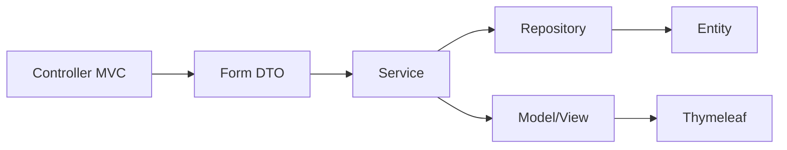
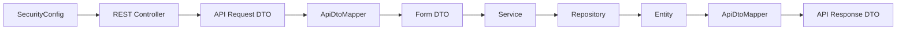

# 38 — Índice de clases y conceptos

Este capítulo es un **mapa de navegación del código real**.

Úsalo cuando la pregunta sea:

```text
¿qué clase debo abrir?
```

o:

```text
¿en qué clase puedo observar este concepto?
```

No reemplaza los capítulos anteriores. Su propósito es conectar rápidamente:

```text
concepto ↔ clase ↔ responsabilidad ↔ capítulo
```

> [!IMPORTANT]
> Este índice corresponde a la estructura actual de la rama `main` y contiene únicamente clases y módulos presentes en PetMatch.

---

# 1. Mapa principal de paquetes

Código productivo:

```text
src/main/java/com/petmatch/community/
├── PetMatchCommunityApplication.java
├── config/
├── controller/
│   └── api/
├── dto/
│   ├── api/
│   ├── auth/
│   ├── pet/
│   ├── supportapplication/
│   └── supportrequest/
├── exception/
├── model/
│   └── enums/
├── repository/
├── security/
└── service/
```

La organización refleja las responsabilidades estudiadas a lo largo del libro.

---

# 2. Clase de arranque

## `PetMatchCommunityApplication`

Ruta:

```text
src/main/java/com/petmatch/community/PetMatchCommunityApplication.java
```

Responsabilidad:

```text
punto de entrada de Spring Boot
```

Conceptos asociados:

```text
@SpringBootApplication
ApplicationContext
autoconfiguración
component scanning
arranque
```

Estudiar en:

- [03 — Spring y Spring Boot](../01-fundamentos/03-spring-y-spring-boot.md)
- [04 — Estructura del proyecto](../01-fundamentos/04-estructura-del-proyecto.md)

---

# 3. Configuración

## `SecurityConfig`

Ruta:

```text
src/main/java/com/petmatch/community/config/SecurityConfig.java
```

Responsabilidades reales:

```text
crear PasswordEncoder
configurar SecurityFilterChain API
configurar SecurityFilterChain web
HTTP Basic API
STATELESS API
CSRF deshabilitado en API
form login web
logout
roles/rutas
```

Conceptos asociados:

```text
@Bean
@Configuration
@Order
SecurityFilterChain
securityMatcher
PasswordEncoder
CSRF
session
HTTP Basic
roles
```

Estudiar en:

- [23 — Spring Security](../04-seguridad/23-spring-security.md)
- [24 — Contraseñas y PasswordEncoder](../04-seguridad/24-contrasenas-y-password-encoder.md)
- [25 — Autorización y ownership](../04-seguridad/25-autorizacion-y-ownership.md)
- [26 — CSRF, sesión y seguridad web](../04-seguridad/26-csrf-sesion-y-seguridad-web.md)
- [29 — Seguridad REST](../05-rest/29-seguridad-rest.md)

---

# 4. Controllers MVC

## `HomeController`

Ruta:

```text
src/main/java/com/petmatch/community/controller/HomeController.java
```

Responsabilidad:

```text
resolver la página principal web
```

Conceptos:

```text
@Controller
@GetMapping
view name
```

Estudiar en:

- [18 — Spring MVC](../03-web-mvc/18-spring-mvc.md)
- [19 — Thymeleaf](../03-web-mvc/19-thymeleaf.md)

---

## `AuthController`

Ruta:

```text
src/main/java/com/petmatch/community/controller/AuthController.java
```

Responsabilidades:

```text
mostrar login
mostrar registro
procesar registro
validar RegistrationForm
comparar password/confirmPassword
manejar email duplicado en registro
redirigir después de registro exitoso
```

Importante:

```text
NO procesa POST /login
```

El login efectivo es manejado por Spring Security.

Conceptos:

```text
@Controller
@Valid
@ModelAttribute
BindingResult
redirect
Spring Security form login
```

Estudiar en:

- [18 — Spring MVC](../03-web-mvc/18-spring-mvc.md)
- [20 — Formularios y Form DTO](../03-web-mvc/20-formularios-y-form-dto.md)
- [21 — Validación](../03-web-mvc/21-validacion.md)
- [22 — Autenticación](../04-seguridad/22-autenticacion.md)

---

## `PetController`

Ruta:

```text
src/main/java/com/petmatch/community/controller/PetController.java
```

Responsabilidad general:

```text
interfaz MVC para las mascotas del usuario actual
```

Colabora principalmente con:

```text
PetService
PetForm
Authentication
Thymeleaf
```

Conceptos:

```text
MVC CRUD
Form DTO
ownership delegado al Service
redirect
validation
```

Estudiar en:

- [18 — Spring MVC](../03-web-mvc/18-spring-mvc.md)
- [20 — Formularios y Form DTO](../03-web-mvc/20-formularios-y-form-dto.md)
- [25 — Autorización y ownership](../04-seguridad/25-autorizacion-y-ownership.md)

---

## `SupportRequestController`

Ruta:

```text
src/main/java/com/petmatch/community/controller/SupportRequestController.java
```

Responsabilidad general:

```text
interfaz MVC para crear, consultar, modificar,
cancelar y completar solicitudes de apoyo
```

Colabora con:

```text
SupportRequestService
SupportApplicationService
PetService
SupportRequestForm
Authentication
```

Conceptos:

```text
MVC
Form DTO
máquina de estados
ownership
visibilidad
```

Estudiar en:

- [18 — Spring MVC](../03-web-mvc/18-spring-mvc.md)
- [15 — Máquinas de estado](../02-dominio-y-persistencia/15-maquinas-de-estado.md)
- [25 — Autorización y ownership](../04-seguridad/25-autorizacion-y-ownership.md)
- [33 — Flujo completo PetMatch](../06-calidad-y-recorrido/33-flujo-completo-petmatch.md)

---

## `SupportApplicationController`

Ruta:

```text
src/main/java/com/petmatch/community/controller/SupportApplicationController.java
```

Responsabilidad general:

```text
interfaz MVC para postularse y para que el owner
gestione postulaciones recibidas
```

Colabora principalmente con:

```text
SupportApplicationService
SupportRequestService
SupportApplicationForm
Authentication
```

Conceptos:

```text
postulación
accept/reject
ownership
estado
reglas de negocio
```

Estudiar en:

- [13 — Service y reglas de negocio](../02-dominio-y-persistencia/13-service-y-reglas-de-negocio.md)
- [15 — Máquinas de estado](../02-dominio-y-persistencia/15-maquinas-de-estado.md)
- [25 — Autorización y ownership](../04-seguridad/25-autorizacion-y-ownership.md)
- [33 — Flujo completo](../06-calidad-y-recorrido/33-flujo-completo-petmatch.md)

---

# 5. Controllers REST

## `PetRestController`

Ruta:

```text
src/main/java/com/petmatch/community/controller/api/PetRestController.java
```

Base path:

```text
/api/v1/pets
```

Responsabilidades:

```text
listar pets propias
consultar pet propia
crear
actualizar
eliminar
mapear request/response REST
```

Conceptos:

```text
@RestController
@RequestMapping
@RequestBody
@PathVariable
ResponseEntity
201 + Location
204
API DTO
```

Estudiar en:

- [27 — REST API](../05-rest/27-rest-api.md)
- [28 — DTO REST, JSON y mapping](../05-rest/28-dto-rest-json-y-mapping.md)
- [29 — Seguridad REST](../05-rest/29-seguridad-rest.md)

---

## `SupportRequestRestController`

Ruta:

```text
src/main/java/com/petmatch/community/controller/api/SupportRequestRestController.java
```

Base path:

```text
/api/v1/support-requests
```

Responsabilidades:

```text
listar abiertas
listar propias
consultar visible
crear
actualizar
cancelar
completar
```

Conceptos:

```text
REST
resource routes
DTO
ownership
visibilidad
status transitions
```

Estudiar en:

- [27 — REST API](../05-rest/27-rest-api.md)
- [28 — DTO REST](../05-rest/28-dto-rest-json-y-mapping.md)
- [29 — Seguridad REST](../05-rest/29-seguridad-rest.md)

---

## `SupportApplicationRestController`

Ruta:

```text
src/main/java/com/petmatch/community/controller/api/SupportApplicationRestController.java
```

Base path:

```text
/api/v1
```

Rutas conceptuales principales:

```text
/support-applications/mine
/support-requests/{requestId}/applications
/support-applications/{applicationId}/accept
/support-applications/{applicationId}/reject
```

Responsabilidades:

```text
crear application
listar applications propias
listar recibidas por owner
aceptar
rechazar
```

Detalle importante del estado actual:

```text
al crear se construye Location hacia
/api/v1/support-applications/{id}
```

pero no existe un GET individual para esa URL en el Controller actual.

No debe inventarse ese endpoint.

Estudiar en:

- [27 — REST API](../05-rest/27-rest-api.md)
- [28 — DTO REST](../05-rest/28-dto-rest-json-y-mapping.md)
- [29 — Seguridad REST](../05-rest/29-seguridad-rest.md)

---

## `ApiExceptionHandler`

Ruta:

```text
src/main/java/com/petmatch/community/controller/api/ApiExceptionHandler.java
```

Responsabilidad:

```text
traducir excepciones del flujo REST a respuestas HTTP estructuradas
```

Scope real:

```text
com.petmatch.community.controller.api
```

Mapeos centrales:

```text
NotFound exceptions       → 404
business/state conflicts  → 409
Bean Validation           → 400
body JSON ilegible        → 400
```

Conceptos:

```text
@RestControllerAdvice
@ExceptionHandler
ProblemDetail
HTTP status
errors por campo
```

Estudiar en:

- [30 — ProblemDetail y errores HTTP](../05-rest/30-problemdetail-y-errores-http.md)

---

# 6. Services

## `UserService`

Ruta:

```text
src/main/java/com/petmatch/community/service/UserService.java
```

Responsabilidades:

```text
registrar usuario
normalizar email
verificar duplicado
codificar password
resolver current User desde Authentication
```

Conceptos:

```text
@Service
Dependency Injection
PasswordEncoder
Authentication
normalización
Repository
```

Estudiar en:

- [08 — Inyección de dependencias](../01-fundamentos/08-inyeccion-de-dependencias.md)
- [13 — Service y reglas de negocio](../02-dominio-y-persistencia/13-service-y-reglas-de-negocio.md)
- [22 — Autenticación](../04-seguridad/22-autenticacion.md)
- [24 — PasswordEncoder](../04-seguridad/24-contrasenas-y-password-encoder.md)

---

## `PetService`

Ruta:

```text
src/main/java/com/petmatch/community/service/PetService.java
```

Responsabilidades:

```text
listar pets propias
findOwnedPet
crear
actualizar
eliminar
bloquear eliminación si existen requests
toForm
normalizar strings
```

Conceptos:

```text
ownership
@Transactional
dirty checking
business exception
normalización
```

Estudiar en:

- [13 — Service y reglas de negocio](../02-dominio-y-persistencia/13-service-y-reglas-de-negocio.md)
- [14 — Transacciones](../02-dominio-y-persistencia/14-transacciones-y-consistencia.md)
- [25 — Ownership](../04-seguridad/25-autorizacion-y-ownership.md)
- [33 — Flujo completo](../06-calidad-y-recorrido/33-flujo-completo-petmatch.md)

---

## `SupportRequestService`

Ruta:

```text
src/main/java/com/petmatch/community/service/SupportRequestService.java
```

Responsabilidades:

```text
listar OPEN futuras
listar requests propias
consultar por id
findVisibleRequest
findOwnedRequest
crear
actualizar
cancelar
completar
isOwner
toForm
```

Reglas especialmente importantes:

```text
crear con Pet propia
update solo OPEN
cancel solo OPEN
cancel → PENDING applications REJECTED
complete solo IN_PROGRESS
request no OPEN solo visible para owner/applicant relacionado
```

Conceptos:

```text
Service
ownership
visibility
state machine
transaction
dirty checking
```

Estudiar en:

- [13 — Service y reglas](../02-dominio-y-persistencia/13-service-y-reglas-de-negocio.md)
- [14 — Transacciones](../02-dominio-y-persistencia/14-transacciones-y-consistencia.md)
- [15 — Máquinas de estado](../02-dominio-y-persistencia/15-maquinas-de-estado.md)
- [25 — Ownership](../04-seguridad/25-autorizacion-y-ownership.md)
- [33 — Flujo completo](../06-calidad-y-recorrido/33-flujo-completo-petmatch.md)

---

## `SupportApplicationService`

Ruta:

```text
src/main/java/com/petmatch/community/service/SupportApplicationService.java
```

Responsabilidades:

```text
apply
listar applications propias
listar recibidas por owner
accept
reject
hasApplied
```

Reglas centrales:

```text
request OPEN y futura
owner no puede self-apply
no duplicado
solo owner de request puede gestionar
accept requiere PENDING + request OPEN
máximo una ACCEPTED
accept → request IN_PROGRESS
accept → otras PENDING REJECTED
reject solo mientras request OPEN y application PENDING
```

Conceptos:

```text
business rules
state machine
ownership
transactions
pessimistic locking
concurrency
```

Estudiar en:

- [13 — Service y reglas](../02-dominio-y-persistencia/13-service-y-reglas-de-negocio.md)
- [15 — Máquinas de estado](../02-dominio-y-persistencia/15-maquinas-de-estado.md)
- [16 — Concurrencia y locking](../02-dominio-y-persistencia/16-concurrencia-y-locking.md)
- [25 — Ownership](../04-seguridad/25-autorizacion-y-ownership.md)
- [33 — Flujo completo](../06-calidad-y-recorrido/33-flujo-completo-petmatch.md)

---

# 7. Repositories

## `UserRepository`

Ruta:

```text
src/main/java/com/petmatch/community/repository/UserRepository.java
```

Responsabilidades principales:

```text
findByEmailIgnoreCase
existsByEmailIgnoreCase
```

Conceptos:

```text
JpaRepository
derived query
Optional
```

Estudiar en:

- [12 — Spring Data JPA](../02-dominio-y-persistencia/12-spring-data-jpa.md)
- [22 — Autenticación](../04-seguridad/22-autenticacion.md)

---

## `PetRepository`

Ruta:

```text
src/main/java/com/petmatch/community/repository/PetRepository.java
```

Responsabilidades centrales:

```text
findByOwnerIdOrderByNameAsc
findByIdAndOwnerId
```

Concepto destacado:

```text
ownership incorporado a query
```

Estudiar en:

- [12 — Spring Data JPA](../02-dominio-y-persistencia/12-spring-data-jpa.md)
- [25 — Ownership](../04-seguridad/25-autorizacion-y-ownership.md)

---

## `SupportRequestRepository`

Ruta:

```text
src/main/java/com/petmatch/community/repository/SupportRequestRepository.java
```

Capacidades importantes:

```text
@EntityGraph pet + owner
queries por owner/status/date/type/pet
findByIdAndOwnerId
override findById con EntityGraph
findByIdForUpdate
existsByPetId
```

Conceptos:

```text
query derivation
EntityGraph
ownership
JPQL
@Query
@Lock
PESSIMISTIC_WRITE
```

Estudiar en:

- [12 — Spring Data JPA](../02-dominio-y-persistencia/12-spring-data-jpa.md)
- [16 — Concurrencia y locking](../02-dominio-y-persistencia/16-concurrencia-y-locking.md)
- [17 — Lazy loading y EntityGraph](../02-dominio-y-persistencia/17-lazy-loading-y-entitygraph.md)

---

## `SupportApplicationRepository`

Ruta:

```text
src/main/java/com/petmatch/community/repository/SupportApplicationRepository.java
```

Capacidades centrales:

```text
consultas por request
consultas por applicant
findByIdAndSupportRequestOwnerId
exists applicant/request
count por status
EntityGraph para asociaciones requeridas
```

Conceptos:

```text
ownership por asociación
queries derivadas
EntityGraph
invariantes apoyadas por consultas
```

Estudiar en:

- [12 — Spring Data JPA](../02-dominio-y-persistencia/12-spring-data-jpa.md)
- [16 — Concurrencia y locking](../02-dominio-y-persistencia/16-concurrencia-y-locking.md)
- [17 — Lazy loading y EntityGraph](../02-dominio-y-persistencia/17-lazy-loading-y-entitygraph.md)
- [25 — Ownership](../04-seguridad/25-autorizacion-y-ownership.md)

---

# 8. Entities

## `User`

Ruta:

```text
src/main/java/com/petmatch/community/model/User.java
```

Representa:

```text
usuario persistido
```

Campos/conceptos relevantes:

```text
id
name
email único
passwordHash
Role
active
registeredAt
relaciones hacia pets/requests/applications
@PrePersist
```

Estudiar en:

- [09 — Modelo de dominio](../02-dominio-y-persistencia/09-modelo-de-dominio.md)
- [10 — JPA y Hibernate](../02-dominio-y-persistencia/10-jpa-y-hibernate.md)
- [11 — Relaciones JPA](../02-dominio-y-persistencia/11-relaciones-jpa.md)
- [24 — PasswordEncoder](../04-seguridad/24-contrasenas-y-password-encoder.md)

---

## `Pet`

Ruta:

```text
src/main/java/com/petmatch/community/model/Pet.java
```

Representa:

```text
mascota registrada por un owner
```

Relaciones importantes:

```text
Pet → owner User
Pet → supportRequests
```

Estudiar en:

- [09 — Modelo de dominio](../02-dominio-y-persistencia/09-modelo-de-dominio.md)
- [11 — Relaciones JPA](../02-dominio-y-persistencia/11-relaciones-jpa.md)

---

## `SupportRequest`

Ruta:

```text
src/main/java/com/petmatch/community/model/SupportRequest.java
```

Representa:

```text
solicitud comunitaria de apoyo
```

Relaciones:

```text
SupportRequest → Pet
SupportRequest → owner User
SupportRequest → SupportApplications
```

Estados:

```text
OPEN
IN_PROGRESS
COMPLETED
CANCELLED
```

Estudiar en:

- [09 — Modelo de dominio](../02-dominio-y-persistencia/09-modelo-de-dominio.md)
- [11 — Relaciones JPA](../02-dominio-y-persistencia/11-relaciones-jpa.md)
- [15 — Máquinas de estado](../02-dominio-y-persistencia/15-maquinas-de-estado.md)

---

## `SupportApplication`

Ruta:

```text
src/main/java/com/petmatch/community/model/SupportApplication.java
```

Representa:

```text
postulación de un User a una SupportRequest
```

Relaciones:

```text
SupportApplication → applicant User
SupportApplication → SupportRequest
```

Estados:

```text
PENDING
ACCEPTED
REJECTED
```

Restricción destacada:

```text
applicant + request único
```

Estudiar en:

- [09 — Modelo de dominio](../02-dominio-y-persistencia/09-modelo-de-dominio.md)
- [11 — Relaciones JPA](../02-dominio-y-persistencia/11-relaciones-jpa.md)
- [15 — Máquinas de estado](../02-dominio-y-persistencia/15-maquinas-de-estado.md)

---

# 9. Enums

## `Role`

Ruta:

```text
src/main/java/com/petmatch/community/model/enums/Role.java
```

Valores:

```text
USER
ADMIN
```

Ver:

- [25 — Autorización y ownership](../04-seguridad/25-autorizacion-y-ownership.md)

---

## `SupportRequestStatus`

Ruta:

```text
src/main/java/com/petmatch/community/model/enums/SupportRequestStatus.java
```

Valores:

```text
OPEN
IN_PROGRESS
COMPLETED
CANCELLED
```

Ver:

- [15 — Máquinas de estado](../02-dominio-y-persistencia/15-maquinas-de-estado.md)
- [33 — Flujo completo](../06-calidad-y-recorrido/33-flujo-completo-petmatch.md)

---

## `SupportApplicationStatus`

Ruta:

```text
src/main/java/com/petmatch/community/model/enums/SupportApplicationStatus.java
```

Valores:

```text
PENDING
ACCEPTED
REJECTED
```

Ver:

- [15 — Máquinas de estado](../02-dominio-y-persistencia/15-maquinas-de-estado.md)
- [33 — Flujo completo](../06-calidad-y-recorrido/33-flujo-completo-petmatch.md)

---

## `SupportType`

Ruta:

```text
src/main/java/com/petmatch/community/model/enums/SupportType.java
```

Valores:

```text
WALK
TEMPORARY_CARE
FEEDING
COMPANIONSHIP
TRANSPORTATION
OTHER
```

Ver:

- [09 — Modelo de dominio](../02-dominio-y-persistencia/09-modelo-de-dominio.md)

---

# 10. Form DTO

## `RegistrationForm`

Ruta:

```text
src/main/java/com/petmatch/community/dto/auth/RegistrationForm.java
```

Representa entrada de registro:

```text
name
email
password
confirmPassword
```

Ver:

- [20 — Formularios y Form DTO](../03-web-mvc/20-formularios-y-form-dto.md)
- [21 — Validación](../03-web-mvc/21-validacion.md)
- [24 — PasswordEncoder](../04-seguridad/24-contrasenas-y-password-encoder.md)

---

## `PetForm`

Ruta:

```text
src/main/java/com/petmatch/community/dto/pet/PetForm.java
```

Entrada usada por casos create/update de Pet.

Ver:

- [20 — Formularios y Form DTO](../03-web-mvc/20-formularios-y-form-dto.md)
- [21 — Validación](../03-web-mvc/21-validacion.md)

---

## `SupportRequestForm`

Ruta:

```text
src/main/java/com/petmatch/community/dto/supportrequest/SupportRequestForm.java
```

Entrada usada por create/update de SupportRequest.

Conceptos destacados:

```text
SupportType
serviceDate
petId
validation
```

Ver:

- [20 — Formularios y Form DTO](../03-web-mvc/20-formularios-y-form-dto.md)
- [21 — Validación](../03-web-mvc/21-validacion.md)

---

## `SupportApplicationForm`

Ruta:

```text
src/main/java/com/petmatch/community/dto/supportapplication/SupportApplicationForm.java
```

Entrada de una postulación.

El applicant y el request no se deciden mediante campos libres del formulario; provienen de identidad/URL/caso de uso.

Ver:

- [20 — Formularios y Form DTO](../03-web-mvc/20-formularios-y-form-dto.md)
- [25 — Ownership](../04-seguridad/25-autorizacion-y-ownership.md)

---

# 11. DTO REST y mapper

## `PetApiRequest`

Entrada JSON para Pet.

Ruta:

```text
src/main/java/com/petmatch/community/dto/api/PetApiRequest.java
```

Ver:

- [28 — DTO REST, JSON y mapping](../05-rest/28-dto-rest-json-y-mapping.md)

## `PetApiResponse`

Salida JSON controlada para Pet.

Ruta:

```text
src/main/java/com/petmatch/community/dto/api/PetApiResponse.java
```

Ver capítulo 28.

---

## `SupportRequestApiRequest`

Entrada JSON para SupportRequest.

Ruta:

```text
src/main/java/com/petmatch/community/dto/api/SupportRequestApiRequest.java
```

Campos conceptuales:

```text
title
description
supportType
serviceDate
petId
```

Ver capítulo 28.

---

## `SupportRequestApiResponse`

Salida JSON para SupportRequest.

Ruta:

```text
src/main/java/com/petmatch/community/dto/api/SupportRequestApiResponse.java
```

Ejemplifica flattening:

```text
petId
petName
ownerId
ownerName
```

Ver capítulo 28.

---

## `SupportApplicationApiRequest`

Entrada JSON de una application.

Ruta:

```text
src/main/java/com/petmatch/community/dto/api/SupportApplicationApiRequest.java
```

Actualmente contiene el mensaje; applicant/request/status se resuelven fuera del body.

Ver capítulo 28.

---

## `SupportApplicationApiResponse`

Salida JSON de una application.

Ruta:

```text
src/main/java/com/petmatch/community/dto/api/SupportApplicationApiResponse.java
```

Aplana applicant y request.

Ver capítulo 28.

---

## `ApiDtoMapper`

Ruta:

```text
src/main/java/com/petmatch/community/dto/api/ApiDtoMapper.java
```

Responsabilidad:

```text
API Request → Form DTO
Entity → API Response
```

No es:

```text
Repository
Service
Bean con reglas de negocio
```

Ver:

- [28 — DTO REST, JSON y mapping](../05-rest/28-dto-rest-json-y-mapping.md)
- [34 — Buenas prácticas y decisiones](../06-calidad-y-recorrido/34-buenas-practicas-y-decisiones.md)

---

# 12. Seguridad

## `DatabaseUserDetailsService`

Ruta:

```text
src/main/java/com/petmatch/community/security/DatabaseUserDetailsService.java
```

Responsabilidad:

```text
cargar User por email
→ convertirlo a UserDetails de Spring Security
```

Mapeo conceptual:

```text
User.email        → username
User.passwordHash → password
User.role         → authorities/roles
User.active       → enabled/disabled
```

Ver:

- [22 — Autenticación](../04-seguridad/22-autenticacion.md)
- [23 — Spring Security](../04-seguridad/23-spring-security.md)
- [29 — Seguridad REST](../05-rest/29-seguridad-rest.md)

---

# 13. Excepciones

## `DuplicateEmailException`

Caso:

```text
intento de registrar email ya existente
```

Se utiliza principalmente en el flujo MVC de registro.

Ver:

- [13 — Service y reglas de negocio](../02-dominio-y-persistencia/13-service-y-reglas-de-negocio.md)
- [22 — Autenticación](../04-seguridad/22-autenticacion.md)

---

## `PetNotFoundException`

Caso:

```text
Pet no encontrada bajo la regla de consulta actual
```

Puede representar también ownership fallido cuando se usa `findByIdAndOwnerId`.

En API entra al grupo 404.

---

## `PetDeletionException`

Caso:

```text
intento de borrar Pet con SupportRequests asociadas
```

En API entra al grupo 409.

---

## `SupportRequestNotFoundException`

Caso:

```text
request inexistente
```

o:

```text
request no visible/propia bajo el caso de uso
```

En API → 404.

---

## `SupportRequestStateException`

Caso:

```text
operación no permitida por el estado de la request
```

Ejemplos:

```text
update/cancel no OPEN
complete no IN_PROGRESS
```

En API → 409.

---

## `SupportApplicationNotFoundException`

Caso:

```text
application no encontrada para el owner/request requerido
```

En API → 404.

---

## `SupportApplicationRuleException`

Reglas como:

```text
request ya no acepta applications
self-apply
duplicado
```

En API → 409.

---

## `SupportApplicationStateException`

Caso:

```text
accept/reject incompatible con estado actual
```

En API → 409.

Ver conjunto completo en:

- [30 — ProblemDetail y errores HTTP](../05-rest/30-problemdetail-y-errores-http.md)

---

# 14. Índice inverso: concepto → clases

## Dependency Injection

Abrir:

```text
PetService
SupportRequestService
SupportApplicationService
UserService
Controllers
SecurityConfig
```

Capítulo:

- [08 — Inyección de dependencias](../01-fundamentos/08-inyeccion-de-dependencias.md)

---

## Arquitectura Controller → Service → Repository

Seguir ejemplo Pet:

```text
PetController
→ PetService
→ PetRepository
→ Pet
```

Seguir ejemplo SupportRequest:

```text
SupportRequestController
→ SupportRequestService
→ SupportRequestRepository
→ SupportRequest
```

Capítulo:

- [07 — Arquitectura por capas](../01-fundamentos/07-arquitectura-por-capas.md)

---

## JPA Entity

Abrir:

```text
User
Pet
SupportRequest
SupportApplication
```

Capítulos:

- [10 — JPA y Hibernate](../02-dominio-y-persistencia/10-jpa-y-hibernate.md)
- [11 — Relaciones JPA](../02-dominio-y-persistencia/11-relaciones-jpa.md)

---

## Query derivation

Abrir:

```text
UserRepository
PetRepository
SupportRequestRepository
SupportApplicationRepository
```

Buscar nombres como:

```text
findBy...
existsBy...
countBy...
```

Capítulo:

- [12 — Spring Data JPA](../02-dominio-y-persistencia/12-spring-data-jpa.md)

---

## Regla de negocio

Abrir:

```text
PetService.delete
SupportRequestService.cancel
SupportRequestService.complete
SupportApplicationService.apply
SupportApplicationService.accept
SupportApplicationService.reject
```

Capítulo:

- [13 — Service y reglas de negocio](../02-dominio-y-persistencia/13-service-y-reglas-de-negocio.md)

---

## `@Transactional`

Abrir:

```text
PetService
SupportRequestService
SupportApplicationService
```

También aparece en pruebas de integración, con contexto de testing.

Capítulos:

- [14 — Transacciones y consistencia](../02-dominio-y-persistencia/14-transacciones-y-consistencia.md)
- [32 — Pruebas de integración](../06-calidad-y-recorrido/32-pruebas-de-integracion.md)

---

## Máquina de estados

Abrir:

```text
SupportRequestStatus
SupportApplicationStatus
SupportRequestService
SupportApplicationService
```

Capítulo:

- [15 — Máquinas de estado](../02-dominio-y-persistencia/15-maquinas-de-estado.md)

---

## Concurrencia

Abrir:

```text
SupportApplicationService.accept
SupportRequestRepository.findByIdForUpdate
```

Buscar:

```java
@Lock(LockModeType.PESSIMISTIC_WRITE)
```

Capítulo:

- [16 — Concurrencia y locking](../02-dominio-y-persistencia/16-concurrencia-y-locking.md)

---

## Lazy loading / fetch plan

Abrir:

```text
Pet
SupportRequest
SupportApplication
SupportRequestRepository
SupportApplicationRepository
application.yaml
```

Buscar:

```text
FetchType.LAZY
@EntityGraph
open-in-view: false
```

Capítulo:

- [17 — Lazy loading y EntityGraph](../02-dominio-y-persistencia/17-lazy-loading-y-entitygraph.md)

---

## Form binding

Abrir:

```text
AuthController
PetController
SupportRequestController
SupportApplicationController
RegistrationForm
PetForm
SupportRequestForm
SupportApplicationForm
```

Capítulo:

- [20 — Formularios y Form DTO](../03-web-mvc/20-formularios-y-form-dto.md)

---

## Bean Validation

Abrir:

```text
RegistrationForm
PetForm
SupportRequestForm
SupportApplicationForm
PetApiRequest
SupportRequestApiRequest
SupportApplicationApiRequest
```

Capítulo:

- [21 — Validación](../03-web-mvc/21-validacion.md)

---

## Login

Abrir:

```text
AuthController
SecurityConfig
DatabaseUserDetailsService
UserService
UserRepository
User
```

Capítulo:

- [22 — Autenticación](../04-seguridad/22-autenticacion.md)

---

## Password hashing

Abrir:

```text
SecurityConfig.passwordEncoder
UserService.register
User.passwordHash
DatabaseUserDetailsService
```

Capítulo:

- [24 — Contraseñas y PasswordEncoder](../04-seguridad/24-contrasenas-y-password-encoder.md)

---

## Ownership

Abrir:

```text
PetService.findOwnedPet
SupportRequestService.findOwnedRequest
SupportRequestService.findVisibleRequest
SupportApplicationRepository.findByIdAndSupportRequestOwnerId
PetRepository.findByIdAndOwnerId
```

Capítulo:

- [25 — Autorización y ownership](../04-seguridad/25-autorizacion-y-ownership.md)

---

## CSRF y sesión web

Abrir:

```text
SecurityConfig.webSecurityFilterChain
templates con forms Thymeleaf
```

Capítulo:

- [26 — CSRF, sesión y seguridad web](../04-seguridad/26-csrf-sesion-y-seguridad-web.md)

---

## REST

Abrir:

```text
PetRestController
SupportRequestRestController
SupportApplicationRestController
```

Capítulo:

- [27 — REST API](../05-rest/27-rest-api.md)

---

## API DTO / mapping

Abrir:

```text
ApiDtoMapper
PetApiRequest
PetApiResponse
SupportRequestApiRequest
SupportRequestApiResponse
SupportApplicationApiRequest
SupportApplicationApiResponse
```

Capítulo:

- [28 — DTO REST, JSON y mapping](../05-rest/28-dto-rest-json-y-mapping.md)

---

## Seguridad REST

Abrir:

```text
SecurityConfig.apiSecurityFilterChain
DatabaseUserDetailsService
UserService.getCurrentUser
REST Controllers
Services ownership
```

Capítulo:

- [29 — Seguridad REST](../05-rest/29-seguridad-rest.md)

---

## `ProblemDetail`

Abrir:

```text
ApiExceptionHandler
```

Capítulo:

- [30 — ProblemDetail y errores HTTP](../05-rest/30-problemdetail-y-errores-http.md)

---

# 15. Índice de pruebas

## `PetMatchCommunityApplicationTests`

Ruta:

```text
src/test/java/com/petmatch/community/PetMatchCommunityApplicationTests.java
```

Concepto:

```text
@SpringBootTest
contextLoads
```

Ver:

- [32 — Pruebas de integración](../06-calidad-y-recorrido/32-pruebas-de-integracion.md)

---

## `SupportRequestServiceTests`

Ruta:

```text
src/test/java/com/petmatch/community/service/SupportRequestServiceTests.java
```

Prueba relacionada:

```text
cancel → request CANCELLED
PENDING applications → REJECTED
```

Conceptos:

```text
JUnit 5
Mockito
@Mock
@InjectMocks
when
verify
```

Ver:

- [31 — Pruebas unitarias](../06-calidad-y-recorrido/31-pruebas-unitarias.md)

---

## `SupportApplicationServiceTests`

Ruta:

```text
src/test/java/com/petmatch/community/service/SupportApplicationServiceTests.java
```

Pruebas relacionadas:

```text
accept → IN_PROGRESS/ACCEPTED/REJECTED
expired request → exception
```

Ver capítulo 31.

---

## `MvpFlowIntegrationTests`

Ruta:

```text
src/test/java/com/petmatch/community/integration/MvpFlowIntegrationTests.java
```

Concepto:

```text
flujo integrado Services + Repositories + DB
```

Cubre gran parte del recorrido:

```text
owner
pet
request
applications
accept
visibility
complete
```

Ver:

- [32 — Pruebas de integración](../06-calidad-y-recorrido/32-pruebas-de-integracion.md)
- [33 — Flujo completo](../06-calidad-y-recorrido/33-flujo-completo-petmatch.md)

---

## `RestApiIntegrationTests`

Ruta:

```text
src/test/java/com/petmatch/community/integration/RestApiIntegrationTests.java
```

Conceptos:

```text
@SpringBootTest
@AutoConfigureMockMvc
MockMvc
HTTP Basic
SecurityFilterChain
201 + Location
ProblemDetail validation
```

Ver:

- [29 — Seguridad REST](../05-rest/29-seguridad-rest.md)
- [30 — ProblemDetail](../05-rest/30-problemdetail-y-errores-http.md)
- [32 — Pruebas de integración](../06-calidad-y-recorrido/32-pruebas-de-integracion.md)

---

# 16. ¿Qué abrir para entender el proyecto en 15 minutos?

Si ya conoces Spring y solo quieres comprender PetMatch, sigue este orden:

```text
1. SupportRequestStatus
2. SupportApplicationStatus
3. User
4. Pet
5. SupportRequest
6. SupportApplication
7. PetService
8. SupportRequestService
9. SupportApplicationService
10. SupportRequestRepository
11. SupportApplicationRepository
12. SecurityConfig
13. DatabaseUserDetailsService
14. MvpFlowIntegrationTests
15. RestApiIntegrationTests
```

Ese recorrido muestra:

```text
dominio
→ reglas
→ persistencia
→ seguridad
→ evidencia mediante tests
```

---

# 17. ¿Qué abrir para seguir una request MVC?



Ejemplo Pet:

```text
PetController
→ PetForm
→ PetService
→ PetRepository
→ Pet
→ template
```

---

# 18. ¿Qué abrir para seguir una request REST?



---

# 19. ¿Qué abrir para entender ownership?

Recorrido mínimo:

```text
SecurityConfig
→ DatabaseUserDetailsService
→ UserService.getCurrentUser
→ PetService.findOwnedPet
→ PetRepository.findByIdAndOwnerId
→ SupportRequestService.findOwnedRequest
→ SupportApplicationRepository.findByIdAndSupportRequestOwnerId
```

---

# 20. ¿Qué abrir para entender accept?

Recorrido mínimo:

```text
SupportApplicationService.accept
↓
SupportApplicationRepository.findByIdAndSupportRequestOwnerId
↓
SupportRequestRepository.findByIdForUpdate
↓
PESSIMISTIC_WRITE
↓
status checks
↓
count ACCEPTED
↓
selected ACCEPTED
↓
request IN_PROGRESS
↓
others REJECTED
```

Ver:

- [16 — Concurrencia y locking](../02-dominio-y-persistencia/16-concurrencia-y-locking.md)
- [33 — Flujo completo](../06-calidad-y-recorrido/33-flujo-completo-petmatch.md)

---

# 21. Clases que NO existen en el estado actual

No busques como implementación actual clases del tipo:

```text
JwtService
JwtFilter
OAuth2Config
FileUploadService
ImageService
AdminController funcional
MigrationConfig
TestcontainersConfig
WebFluxConfig
ChatService
PaymentService
GeolocationService
```

Tampoco existe una clase que implemente un módulo de tienda, inventario, chat o red social completa.

Si aparecen ideas de ese tipo en el siguiente capítulo, estarán marcadas como **posibles evoluciones no implementadas**.

---

# 22. 🧪 Ejercicio de navegación

Sin utilizar búsqueda global del IDE, intenta encontrar la clase correcta para cada pregunta:

1. ¿Dónde se configura HTTP Basic?
2. ¿Dónde se convierte email/passwordHash a `UserDetails`?
3. ¿Dónde se verifica Pet ownership?
4. ¿Dónde se bloquea una request para aceptar application?
5. ¿Dónde se rechazan las demás applications?
6. ¿Dónde se traduce `SupportApplicationRuleException` a HTTP?
7. ¿Dónde se define `IN_PROGRESS`?
8. ¿Dónde se valida `serviceDate` de un request REST?
9. ¿Dónde se transforma `SupportRequest` a response DTO?
10. ¿Dónde se comprueba el flujo completo de estados con Repositories reales?

### Respuestas

1. `SecurityConfig`.
2. `DatabaseUserDetailsService`.
3. `PetService` + `PetRepository`.
4. `SupportRequestRepository.findByIdForUpdate` llamado desde `SupportApplicationService.accept`.
5. `SupportApplicationService.accept`.
6. `ApiExceptionHandler`.
7. `SupportRequestStatus`.
8. `SupportRequestApiRequest`.
9. `ApiDtoMapper`.
10. `MvpFlowIntegrationTests`.

---

# ✅ Qué debes recordar

Este índice debe ayudarte a evitar una lectura desordenada del repositorio.

Cuando busques una responsabilidad, piensa primero en la capa:

```text
HTTP/UI
→ Controller

entrada/salida de datos
→ DTO

caso de uso/regla
→ Service

consulta
→ Repository

estado persistente
→ Entity

identidad HTTP
→ Security

traducción REST de errores
→ ApiExceptionHandler
```

Y cuando una funcionalidad cruza varias capas, recórrela siempre de extremo a extremo en vez de asumir que una sola clase contiene toda la solución.

---

# 🔗 Continúa con

Hasta aquí el libro documenta el sistema que **sí existe**.

El último capítulo separa deliberadamente otra categoría:

> **ideas razonables para evolucionar PetMatch que NO forman parte de la implementación actual.**

Continúa con:

**[Capítulo 39 — Posibles evoluciones no implementadas →](39-posibles-evoluciones-no-implementadas.md)**

---

[← Capítulo 37 — Glosario](37-glosario.md) · [Índice general](../README.md) · [Siguiente → Capítulo 39](39-posibles-evoluciones-no-implementadas.md)
