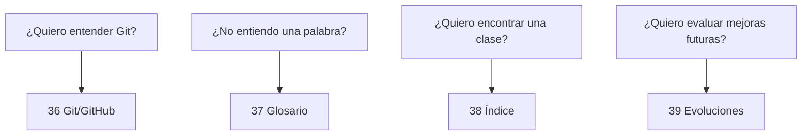

# Bloque 07 — Referencia

Este bloque cierra el libro con herramientas para **volver rápidamente a lo aprendido** sin tener que releer todos los capítulos en orden.

No introduce un nuevo framework ni una nueva arquitectura.

Su objetivo es servir como capa de consulta:

```text
Git y GitHub
→ cómo conservar y revisar cambios

Glosario
→ qué significa un término

Índice de clases y conceptos
→ dónde encontrar una pieza real

Posibles evoluciones
→ qué podría cambiar en el futuro sin confundirlo con lo implementado
```

---

# Objetivos del bloque

Al terminar deberías poder:

- distinguir Git de GitHub;
- explicar working tree, staging, commit, branch, push, fetch y merge;
- interpretar `.gitignore` y `.gitattributes` del repositorio;
- comprender por qué `target/`, `.env` y archivos del IDE no deben mezclarse con el código compartido;
- entender que las explicaciones del libro corresponden a la implementación disponible en `main`;
- localizar rápidamente términos como `Bean`, `EntityGraph`, `ProblemDetail`, `STATELESS` o `Authentication`;
- localizar cada Controller, Service, Repository, Entity, DTO, enum, excepción y test relevante;
- saltar de un concepto a las clases donde puede estudiarse;
- distinguir claramente entre capacidades actuales y evoluciones no implementadas.

---

# Capítulos

36. [Git, GitHub y versionado](36-git-github-y-versionado.md)
37. [Glosario](37-glosario.md)
38. [Índice de clases y conceptos](38-indice-de-clases-y-conceptos.md)
39. [Posibles evoluciones no implementadas](39-posibles-evoluciones-no-implementadas.md)

---

# 36 — Git, GitHub y versionado

Este capítulo usa archivos reales del repositorio:

```text
.gitignore
.gitattributes
mvnw
mvnw.cmd
README.md
docs/
```

para explicar:

```text
tracked / untracked / ignored
working tree
staging area
commit
branch
main
push
fetch
merge
conflicts
pull requests
reviews
secretos
artefactos generados
```

También conecta control de versiones con la disciplina usada durante todo el libro:

```text
cambio pequeño
→ prueba
→ diff
→ commit coherente
```

---

# 37 — Glosario

El glosario responde preguntas como:

```text
¿Qué es un Bean?
¿Qué significa dirty checking?
¿Qué diferencia hay entre JPA e Hibernate?
¿Qué significa STATELESS?
¿Qué diferencia hay entre Mockito y MockMvc?
```

Cada definición intenta incluir:

```text
significado
→ uso
→ ejemplo PetMatch
→ capítulo relacionado
```

No sustituye los capítulos largos; sirve para recuperar contexto rápidamente.

---

# 38 — Índice de clases y conceptos

Este capítulo funciona en dos direcciones.

## Clase → explicación

Ejemplo:

```text
SupportApplicationService
→ responsabilidad
→ ruta real
→ capítulos donde se estudia
```

## Concepto → clases

Ejemplo:

```text
ownership
→ UserService
→ PetService
→ SupportRequestService
→ SupportApplicationService
→ Repositories con owner
```

Es especialmente útil cuando ya conoces el concepto y quieres volver al código.

---

# 39 — Posibles evoluciones no implementadas

Este capítulo mantiene una distinción fundamental del libro:

> **una idea futura no describe el comportamiento actual.**

Allí aparecen, entre otras, posibles evoluciones como:

```text
Flyway/Liquibase
Testcontainers
@Version
OpenAPI
JWT/OAuth2
MapStruct
Docker
CI/CD
observabilidad
File & Image Upload
```

Siempre separadas del estado real.

---

# Mapa de uso rápido



---

# Correspondencia con el proyecto

Las explicaciones de este bloque se refieren al código disponible en la rama `main`.

Los capítulos 37–39 relacionan conceptos y referencias con las clases reales del repositorio.

Si el proyecto cambia, la documentación deberá actualizarse para conservar esa correspondencia.

---

# Lo que este bloque NO hace

No convierte en actuales capacidades como:

```text
JWT
OAuth2
Flyway
Liquibase
Testcontainers
Docker
File Upload
chat
pagos
geolocalización
microservicios
```

Que aparezcan como referencia o evolución no significa que estén implementadas.

---

# Ruta recomendada

Si estás leyendo el libro por primera vez:

```text
35 Errores frecuentes
→ 36 Git/GitHub
→ 37 Glosario
→ 38 Índice
→ 39 Evoluciones
```

Después puedes volver a este bloque de forma no lineal según tu necesidad.

---

# Comienza aquí

**[Capítulo 36 — Git, GitHub y versionado →](36-git-github-y-versionado.md)**

---

[← Bloque 06 — Calidad y recorrido](../06-calidad-y-recorrido/README.md) · [Índice general](../README.md) · [Siguiente → Capítulo 36](36-git-github-y-versionado.md)
