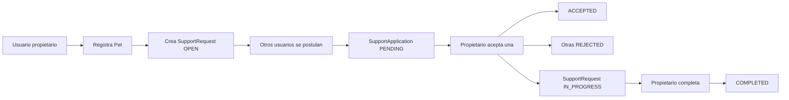
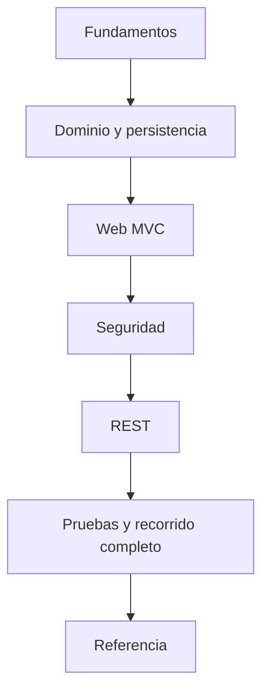

# PetMatch Community — Spring Boot desde cero

> Un libro técnico y pedagógico para aprender Spring Boot recorriendo una aplicación real.

Este libro enseña **Spring Boot a través de una aplicación real llamada PetMatch Community**.

No está planteado como un catálogo de anotaciones ni como documentación genérica del framework. Cada concepto se estudia a partir de una necesidad concreta del proyecto:

> **problema → concepto → mecanismo → código real → decisión → alternativa → error frecuente**

PetMatch Community es una aplicación demostrativa para gestionar solicitudes comunitarias de apoyo temporal relacionadas con mascotas. La misma lógica de negocio se utiliza desde una interfaz web MVC con Thymeleaf y desde una API REST JSON.

---

## ¿Para quién es este libro?

Está dirigido principalmente a aprendices que:

- conocen Java básico;
- conocen SQL básico;
- pueden leer clases, métodos, atributos y estructuras de control;
- todavía no conocen Spring Framework;
- todavía no conocen Spring Boot;
- todavía no conocen JPA/Hibernate;
- todavía no conocen Spring Security;
- todavía no conocen Thymeleaf;
- tienen poca o ninguna experiencia construyendo una aplicación web Java completa.

No necesitas saber previamente qué es un `Bean`, un contenedor de Spring, un `Repository`, un DTO, una sesión HTTP o un `SecurityFilterChain`. El libro introduce esos conceptos cuando aparece el problema que los hace necesarios.

> [!IMPORTANT]
> El objetivo no es memorizar anotaciones. El objetivo es comprender **por qué existe cada pieza**, qué responsabilidad tiene y cómo se relaciona con las demás.

---

## Conocimientos previos recomendados

Antes de empezar conviene sentirte cómodo con:

- clases y objetos en Java;
- constructores;
- interfaces;
- colecciones básicas;
- excepciones;
- `enum`;
- métodos y parámetros;
- conceptos SQL como tabla, fila, clave primaria y clave foránea;
- operaciones `SELECT`, `INSERT`, `UPDATE` y `DELETE` a nivel básico.

No necesitas dominar Maven, HTTP, MVC, ORM ni seguridad web. Esos temas se desarrollan progresivamente.

---

## La aplicación que estudiaremos

PetMatch Community permite representar un flujo como este:

1. un usuario se registra e inicia sesión;
2. registra una mascota propia;
3. publica una solicitud de apoyo para esa mascota;
4. otros usuarios consultan solicitudes abiertas;
5. uno o más usuarios se postulan;
6. el propietario acepta una postulación;
7. la aceptada pasa a `ACCEPTED`;
8. las demás pendientes pasan a `REJECTED`;
9. la solicitud pasa a `IN_PROGRESS`;
10. finalmente el propietario la marca como `COMPLETED`.



---

## Tecnologías reales del proyecto

| Tecnología | Uso en PetMatch |
|---|---|
| Java 21 | Lenguaje principal |
| Spring Boot 4.1.1 | Arranque, configuración y composición |
| Spring MVC | Interfaz web y manejo HTTP |
| Thymeleaf | Renderizado HTML server-side |
| Spring Data JPA | Acceso a persistencia |
| Hibernate | Implementación ORM usada por JPA |
| MySQL | Base de datos |
| Spring Security | Autenticación y autorización |
| Bean Validation | Validación de formularios y DTO |
| Maven | Gestión del proyecto y dependencias |
| Maven Wrapper | Ejecución reproducible de Maven |
| HTTP Session | Estado de autenticación web |
| HTTP Basic | Autenticación de API REST |
| ProblemDetail | Representación de errores REST |
| JUnit 5 | Pruebas |
| Mockito | Pruebas unitarias aisladas |
| MockMvc | Pruebas HTTP |
| Tailwind CSS vía CDN | Presentación visual |

---

## ¿Qué aprenderás?

Al terminar el recorrido deberías poder explicar, usando código real de PetMatch:

- qué problema intenta resolver Spring;
- qué aporta Spring Boot sobre Spring Framework;
- IoC, Dependency Injection, Beans y contenedor;
- estructura de un proyecto Spring Boot;
- Maven y `pom.xml`;
- configuración con `application.yaml`;
- arquitectura Controller → Service → Repository;
- modelo de dominio;
- JPA, Hibernate y ORM;
- relaciones y foreign keys;
- Spring Data JPA;
- reglas de negocio;
- transacciones y consistencia;
- máquinas de estado;
- concurrencia y locking;
- lazy loading y `EntityGraph`;
- MVC y Thymeleaf;
- Form DTO vs Entity vs API DTO;
- data binding y validación;
- autenticación y autorización;
- password hashing;
- ownership;
- CSRF y sesión;
- REST y JSON;
- seguridad REST;
- `ProblemDetail`;
- pruebas unitarias e integración;
- recorrido completo de una funcionalidad;
- decisiones arquitectónicas y sus trade-offs;
- errores frecuentes y diagnóstico por capas;
- Git, GitHub y versionado del proyecto;
- uso de un glosario y un índice de clases/conceptos;
- separación entre estado actual y posibles evoluciones.

---

## Qué NO cubre el estado actual de PetMatch

No forman parte de la implementación actual:

- carga de imágenes o archivos;
- `MultipartFile`;
- almacenamiento de imágenes;
- F11 File & Image Upload;
- JWT;
- OAuth2;
- login social;
- microservicios;
- WebFlux;
- Flyway o Liquibase como herramientas instaladas;
- Docker como requisito;
- Testcontainers;
- S3, MinIO o Cloudinary;
- CI/CD;
- observabilidad y métricas;
- 2FA;
- frontend React, Vue o Angular.

Algunas aparecen en [Posibles evoluciones no implementadas](07-referencia/39-posibles-evoluciones-no-implementadas.md), siempre separadas del estado real de la aplicación.

---

# Cómo está organizado el libro

## 1. Fundamentos — completo

- [01 — PetMatch y el problema](01-fundamentos/01-petmatch-y-el-problema.md)
- [02 — Antes de Spring](01-fundamentos/02-antes-de-spring.md)
- [03 — Spring y Spring Boot](01-fundamentos/03-spring-y-spring-boot.md)
- [04 — Estructura del proyecto](01-fundamentos/04-estructura-del-proyecto.md)
- [05 — Maven y dependencias](01-fundamentos/05-maven-y-dependencias.md)
- [06 — Configuración y `application.yaml`](01-fundamentos/06-configuracion-y-application-yaml.md)
- [07 — Arquitectura por capas](01-fundamentos/07-arquitectura-por-capas.md)
- [08 — Inyección de dependencias en PetMatch](01-fundamentos/08-inyeccion-de-dependencias.md)

[Índice del bloque 01](01-fundamentos/README.md)

---

## 2. Dominio y persistencia — completo

- [09 — Modelo de dominio](02-dominio-y-persistencia/09-modelo-de-dominio.md)
- [10 — JPA y Hibernate](02-dominio-y-persistencia/10-jpa-y-hibernate.md)
- [11 — Relaciones JPA](02-dominio-y-persistencia/11-relaciones-jpa.md)
- [12 — Spring Data JPA](02-dominio-y-persistencia/12-spring-data-jpa.md)
- [13 — Service y reglas de negocio](02-dominio-y-persistencia/13-service-y-reglas-de-negocio.md)
- [14 — Transacciones y consistencia](02-dominio-y-persistencia/14-transacciones-y-consistencia.md)
- [15 — Máquinas de estado](02-dominio-y-persistencia/15-maquinas-de-estado.md)
- [16 — Concurrencia y locking](02-dominio-y-persistencia/16-concurrencia-y-locking.md)
- [17 — Lazy loading y `EntityGraph`](02-dominio-y-persistencia/17-lazy-loading-y-entitygraph.md)

[Índice del bloque 02](02-dominio-y-persistencia/README.md)

---

## 3. Web MVC — completo

- [18 — Spring MVC](03-web-mvc/18-spring-mvc.md)
- [19 — Thymeleaf](03-web-mvc/19-thymeleaf.md)
- [20 — Formularios y Form DTO](03-web-mvc/20-formularios-y-form-dto.md)
- [21 — Validación](03-web-mvc/21-validacion.md)

[Índice del bloque 03](03-web-mvc/README.md)

---

## 4. Seguridad — completo

- [22 — Autenticación](04-seguridad/22-autenticacion.md)
- [23 — Spring Security](04-seguridad/23-spring-security.md)
- [24 — Contraseñas y `PasswordEncoder`](04-seguridad/24-contrasenas-y-password-encoder.md)
- [25 — Autorización y ownership](04-seguridad/25-autorizacion-y-ownership.md)
- [26 — CSRF, sesión y seguridad web](04-seguridad/26-csrf-sesion-y-seguridad-web.md)

[Índice del bloque 04](04-seguridad/README.md)

---

## 5. REST — completo

- [27 — REST API](05-rest/27-rest-api.md)
- [28 — DTO REST, JSON y mapping](05-rest/28-dto-rest-json-y-mapping.md)
- [29 — Seguridad REST](05-rest/29-seguridad-rest.md)
- [30 — `ProblemDetail` y errores HTTP](05-rest/30-problemdetail-y-errores-http.md)

[Índice del bloque 05](05-rest/README.md)

---

## 6. Calidad y recorrido completo — completo

- [31 — Pruebas unitarias](06-calidad-y-recorrido/31-pruebas-unitarias.md)
- [32 — Pruebas de integración](06-calidad-y-recorrido/32-pruebas-de-integracion.md)
- [33 — Flujo completo PetMatch](06-calidad-y-recorrido/33-flujo-completo-petmatch.md)
- [34 — Buenas prácticas y decisiones](06-calidad-y-recorrido/34-buenas-practicas-y-decisiones.md)
- [35 — Errores frecuentes](06-calidad-y-recorrido/35-errores-frecuentes.md)

[Índice del bloque 06](06-calidad-y-recorrido/README.md)

Este bloque conecta pruebas, recorrido completo, decisiones implementadas, trade-offs y diagnóstico de errores frecuentes.

---

## 7. Referencia — completo

- [36 — Git, GitHub y versionado](07-referencia/36-git-github-y-versionado.md)
- [37 — Glosario](07-referencia/37-glosario.md)
- [38 — Índice de clases y conceptos](07-referencia/38-indice-de-clases-y-conceptos.md)
- [39 — Posibles evoluciones no implementadas](07-referencia/39-posibles-evoluciones-no-implementadas.md)

[Índice del bloque 07](07-referencia/README.md)

Este bloque sirve como referencia de trabajo después de completar la lectura lineal.

---

## Ruta recomendada

Lee el libro en orden la primera vez.



Después puedes usar el glosario y el índice de clases de forma no lineal.

> [!TIP]
> Mantén abierto el repositorio mientras lees. Este libro está pensado para alternar explicación y código.

---

## Convenciones del libro

Cuando aparezca una ruta como:

```text
src/main/java/com/petmatch/community/service/SupportRequestService.java
```

significa que debes localizar ese archivo real en el repositorio.

Los fragmentos marcados como **Código real** provienen del proyecto. Si se utiliza una simplificación se marca explícitamente como **pseudocódigo**.

Encontrarás bloques como:

> [!NOTE]
> Contexto adicional útil.

> [!TIP]
> Consejo práctico.

> [!WARNING]
> Error frecuente o riesgo.

> [!IMPORTANT]
> Idea clave para capítulos posteriores.

Y actividades:

- **🧠 Idea mental**;
- **🔎 En PetMatch**;
- **🛠 Prueba en el código**;
- **🧪 Comprueba que entendiste**;
- **✅ Qué debes recordar**.

---

## Correspondencia con la implementación

Las explicaciones y los ejemplos del libro corresponden al código disponible en la rama `main`.

Las funcionalidades que no forman parte del estado actual se presentan de manera separada en:

[39 — Posibles evoluciones no implementadas](07-referencia/39-posibles-evoluciones-no-implementadas.md).

---

## Empieza aquí

**[Cómo usar este libro →](00-como-usar-este-libro.md)**

Luego:

**[Capítulo 01 — PetMatch y el problema →](01-fundamentos/01-petmatch-y-el-problema.md)**

---

[README principal del proyecto](../README.md) · [Cómo usar este libro →](00-como-usar-este-libro.md)